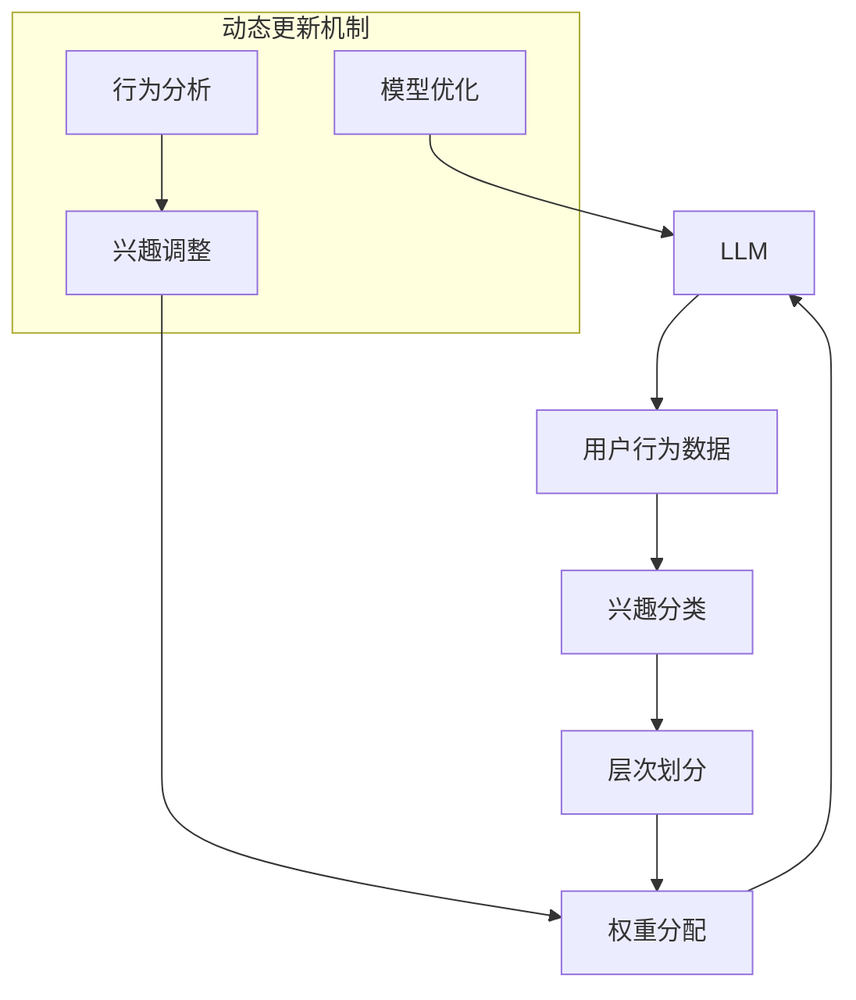

                 

# 基于LLM的用户兴趣层次化动态建模

> 关键词：语言模型（LLM），用户兴趣建模，层次化分析，动态更新，数据挖掘，机器学习

> 摘要：本文将探讨一种基于大型语言模型（LLM）的用户兴趣层次化动态建模方法。通过分析用户历史行为数据和内容偏好，我们构建了一个多层次的兴趣模型，实现了对用户兴趣的精确捕捉和动态调整。文章将详细描述该模型的设计原理、算法实现步骤以及数学模型，并通过实际项目案例展示其应用效果。

## 1. 背景介绍

### 1.1 目的和范围

在现代互联网时代，用户生成内容（UGC）和应用场景日益丰富，如何准确地捕捉和理解用户兴趣成为了众多企业和研究机构关注的焦点。本文旨在提出一种基于大型语言模型（LLM）的用户兴趣层次化动态建模方法，以实现对用户个性化需求的精准把握。

本文的研究范围包括：

1. **用户兴趣层次化建模**：通过层次化分析，将用户兴趣划分为不同维度和层次，以便更精确地捕捉和表达。
2. **动态更新机制**：针对用户行为和偏好变化的实时性，设计一种动态调整机制，确保模型能够实时反映用户当前的兴趣状态。
3. **算法和数学模型**：详细介绍所使用的大型语言模型及其相关算法，并阐述模型的数学基础。

### 1.2 预期读者

本文适合以下读者群体：

1. **数据科学家和机器学习工程师**：对用户兴趣建模和机器学习技术有较高兴趣，希望了解如何利用LLM进行用户兴趣层次化建模。
2. **产品经理和互联网从业者**：关注用户行为分析和个性化推荐系统，希望了解如何通过技术手段提升用户体验。
3. **学术界研究人员**：对LLM应用和用户兴趣建模有深入研究，希望探讨新的研究方向和方法。

### 1.3 文档结构概述

本文的结构安排如下：

1. **背景介绍**：介绍研究背景、目的和预期读者。
2. **核心概念与联系**：阐述核心概念，包括LLM、用户兴趣层次化建模和动态更新机制。
3. **核心算法原理 & 具体操作步骤**：详细描述算法原理和操作步骤。
4. **数学模型和公式 & 详细讲解 & 举例说明**：介绍数学模型，并进行举例说明。
5. **项目实战：代码实际案例和详细解释说明**：通过实际案例展示模型应用。
6. **实际应用场景**：探讨模型在实际场景中的应用。
7. **工具和资源推荐**：推荐相关学习资源和工具。
8. **总结：未来发展趋势与挑战**：总结研究成果，展望未来趋势和挑战。
9. **附录：常见问题与解答**：回答读者可能遇到的问题。
10. **扩展阅读 & 参考资料**：提供进一步学习的资料。

### 1.4 术语表

#### 1.4.1 核心术语定义

- **语言模型（LLM）**：一种能够对自然语言文本进行建模的神经网络模型，能够预测下一个单词或句子。
- **用户兴趣建模**：通过分析用户行为数据，构建一个能够反映用户兴趣的模型。
- **层次化分析**：将复杂系统分解为多个层次，以便更好地理解和分析。
- **动态更新**：根据用户行为的变化，实时调整用户兴趣模型。

#### 1.4.2 相关概念解释

- **用户行为数据**：用户在互联网上的各种操作记录，如浏览历史、搜索关键词、购买记录等。
- **内容偏好**：用户对特定类型内容（如文章、视频、商品）的偏好程度。

#### 1.4.3 缩略词列表

- **LLM**：Large Language Model（大型语言模型）
- **UGC**：User-Generated Content（用户生成内容）
- **IDE**：Integrated Development Environment（集成开发环境）

## 2. 核心概念与联系

在本节中，我们将详细介绍本文研究的核心概念，包括大型语言模型（LLM）、用户兴趣层次化建模和动态更新机制，并通过Mermaid流程图展示其相互关系。

### 2.1 大型语言模型（LLM）

大型语言模型（LLM）是一种基于深度学习的自然语言处理模型，能够对大量文本数据进行分析和学习，从而实现自然语言的生成和预测。LLM的核心在于其能够通过训练捕捉到语言的统计规律和语义信息，从而实现高效的文本处理。

以下是LLM的关键特点：

1. **大规模训练**：LLM通常由数十亿甚至数万亿的参数构成，通过对海量文本数据进行训练，能够捕捉到复杂的语言模式。
2. **上下文理解**：LLM能够理解上下文信息，从而实现更加准确的文本生成和预测。
3. **自动调优**：通过不断的学习和调整，LLM能够自动适应不同的任务和数据集。

### 2.2 用户兴趣层次化建模

用户兴趣层次化建模是将用户的兴趣划分为多个层次，以便更准确地捕捉和表达。层次化分析能够帮助我们识别出不同层次的兴趣点，从而构建一个多层次的兴趣模型。

以下是用户兴趣层次化建模的关键步骤：

1. **兴趣分类**：将用户兴趣划分为多个类别，如娱乐、教育、科技、生活等。
2. **层次划分**：根据兴趣类别的相关性，将兴趣划分为多个层次，如一级兴趣、二级兴趣等。
3. **权重分配**：为每个层次的兴趣分配权重，以反映其在用户兴趣中的重要程度。

### 2.3 动态更新机制

动态更新机制是确保用户兴趣模型能够实时反映用户当前兴趣状态的关键。通过实时分析用户行为数据，动态调整用户兴趣模型，可以实现对用户个性化需求的精准把握。

以下是动态更新机制的关键步骤：

1. **行为分析**：实时分析用户的浏览、搜索、购买等行为数据。
2. **兴趣调整**：根据行为分析结果，动态调整用户兴趣模型中的权重和层次。
3. **模型优化**：通过不断的迭代和优化，提升用户兴趣模型的准确性和鲁棒性。

### 2.4 Mermaid流程图

下面是使用Mermaid绘制的流程图，展示了LLM、用户兴趣层次化建模和动态更新机制之间的相互关系：



通过上述流程图，我们可以清晰地看到，用户行为数据经过LLM处理后，用于兴趣分类、层次划分和权重分配。动态更新机制则通过行为分析不断调整兴趣模型，并优化模型参数，确保模型能够实时反映用户当前的兴趣状态。

## 3. 核心算法原理 & 具体操作步骤

在本文中，我们将详细介绍核心算法的原理和具体操作步骤，包括数据预处理、兴趣分类、层次划分和权重分配等环节。

### 3.1 数据预处理

数据预处理是用户兴趣建模的基础，其目的是将原始的用户行为数据转换为适合建模的形式。以下是数据预处理的详细步骤：

1. **数据收集**：收集用户的浏览历史、搜索关键词、购买记录等行为数据。
2. **数据清洗**：去除重复和无效的数据，如缺失值、异常值等。
3. **数据整合**：将不同来源的数据进行整合，构建一个统一的数据集。
4. **特征提取**：从原始数据中提取出与用户兴趣相关的特征，如关键词频率、浏览时长等。

### 3.2 兴趣分类

兴趣分类是将用户行为数据映射到预定义的兴趣类别上。以下是兴趣分类的具体步骤：

1. **类别定义**：根据业务需求和用户行为特点，定义用户兴趣的类别，如娱乐、教育、科技、生活等。
2. **词袋模型**：将用户行为数据转换为词袋模型，其中每个关键词表示一个特征。
3. **分类算法**：选择合适的分类算法（如K-means、决策树等），对词袋模型进行聚类或分类，得到每个用户的兴趣类别。

### 3.3 层次划分

层次划分是将用户兴趣划分为多个层次，以便更准确地捕捉用户的兴趣。以下是层次划分的具体步骤：

1. **层次定义**：根据兴趣类别的相关性，定义用户兴趣的层次，如一级兴趣、二级兴趣等。
2. **相关性分析**：分析不同兴趣类别之间的相关性，确定类别的层次关系。
3. **层次调整**：根据用户行为数据，动态调整兴趣类别的层次关系，确保层次划分的合理性。

### 3.4 权重分配

权重分配是为每个层次的兴趣分配权重，以反映其在用户兴趣中的重要程度。以下是权重分配的具体步骤：

1. **权重定义**：根据用户行为的频率、时长、热度等特征，定义每个层次的权重。
2. **权重调整**：根据用户行为的变化，动态调整每个层次的权重，确保模型能够实时反映用户当前的兴趣状态。
3. **权重优化**：通过模型优化算法（如梯度下降、牛顿法等），不断调整权重，提升模型性能。

### 3.5 伪代码

以下是核心算法的伪代码，用于描述各步骤的实现：

```python
# 数据预处理
def preprocess_data(data):
    # 收集数据
    # 数据清洗
    # 数据整合
    # 特征提取
    return processed_data

# 兴趣分类
def classify_interests(data):
    # 类别定义
    # 词袋模型
    # 分类算法
    return classified_data

# 层次划分
def divide_hierarchical_interests(data):
    # 层次定义
    # 相关性分析
    # 层次调整
    return hierarchical_data

# 权重分配
def assign_weights(data):
    # 权重定义
    # 权重调整
    # 权重优化
    return weighted_data

# 主函数
def main():
    # 数据预处理
    processed_data = preprocess_data(raw_data)
    # 兴趣分类
    classified_data = classify_interests(processed_data)
    # 层次划分
    hierarchical_data = divide_hierarchical_interests(classified_data)
    # 权重分配
    weighted_data = assign_weights(hierarchical_data)
    # 模型输出
    return weighted_data

# 调用主函数
main()
```

通过上述步骤和伪代码，我们可以清晰地理解核心算法的原理和实现过程。在实际应用中，我们需要根据具体业务需求和数据特点，灵活调整算法参数，以获得最佳的建模效果。

## 4. 数学模型和公式 & 详细讲解 & 举例说明

在本节中，我们将详细介绍用户兴趣层次化动态建模的数学模型和公式，并通过具体的例子进行详细讲解。

### 4.1 数学模型概述

用户兴趣层次化动态建模的数学模型主要包括以下几部分：

1. **用户兴趣表示模型**：用于表示用户在不同层次上的兴趣。
2. **动态调整模型**：用于根据用户行为数据动态调整用户兴趣。
3. **优化模型**：用于优化用户兴趣表示和调整模型的参数。

### 4.2 用户兴趣表示模型

用户兴趣表示模型的核心是定义一个多维度的兴趣空间，其中每个维度代表用户在一个特定层次上的兴趣强度。我们使用以下公式来表示用户兴趣：

$$
\mathbf{I}_u = \sum_{i=1}^n w_i \mathbf{e}_i
$$

其中，$\mathbf{I}_u$ 是用户 $u$ 的兴趣向量，$w_i$ 是第 $i$ 个维度的权重，$\mathbf{e}_i$ 是第 $i$ 个维度的特征向量。

例如，假设用户 $u$ 在一级兴趣上有三个维度：娱乐、教育和科技，那么用户 $u$ 的兴趣向量可以表示为：

$$
\mathbf{I}_u = w_1 \mathbf{e}_{\text{娱乐}} + w_2 \mathbf{e}_{\text{教育}} + w_3 \mathbf{e}_{\text{科技}}
$$

其中，$w_1, w_2, w_3$ 是对应的权重，$\mathbf{e}_{\text{娱乐}}, \mathbf{e}_{\text{教育}}, \mathbf{e}_{\text{科技}}$ 是特征向量。

### 4.3 动态调整模型

动态调整模型用于根据用户行为数据实时更新用户兴趣表示。我们使用以下公式来表示动态调整过程：

$$
\mathbf{I}_{u\_new} = \mathbf{I}_{u} + \alpha (\mathbf{b} \mathbf{I}_{u} + \mathbf{c})
$$

其中，$\mathbf{I}_{u\_new}$ 是更新后的用户兴趣向量，$\alpha$ 是调整系数，$\mathbf{b}$ 和 $\mathbf{c}$ 分别是行为向量和调整向量。

例如，假设用户 $u$ 在一次新的行为后，其兴趣向量更新为：

$$
\mathbf{I}_{u\_new} = \mathbf{I}_{u} + 0.1 (\mathbf{b} \mathbf{I}_{u} + \mathbf{c})
$$

其中，$\alpha = 0.1$，$\mathbf{b}$ 和 $\mathbf{c}$ 是根据用户行为特征计算得到的调整向量。

### 4.4 优化模型

优化模型用于在给定用户行为数据集的基础上，优化用户兴趣表示和调整模型的参数。我们使用以下公式来表示优化过程：

$$
\min_{\mathbf{w}, \alpha, \mathbf{b}, \mathbf{c}} \sum_{u \in U} \|\mathbf{I}_{u} - \mathbf{I}_{u\_new}\|^2
$$

其中，$U$ 是用户集合，$\|\cdot\|$ 是向量范数。

例如，假设我们有100个用户的数据集，我们的目标是优化每个用户的兴趣表示和调整模型的参数，使得每个用户的兴趣向量更新后更加接近原始兴趣向量。

### 4.5 举例说明

假设用户 $u$ 的原始兴趣向量为：

$$
\mathbf{I}_{u} = [0.5, 0.3, 0.2]
$$

在一次新行为后，其行为向量为：

$$
\mathbf{b} = [0.1, 0.2, 0.3]
$$

调整向量为：

$$
\mathbf{c} = [0.1, 0.1, 0.1]
$$

调整系数 $\alpha = 0.1$。

根据动态调整模型，用户 $u$ 的兴趣向量更新为：

$$
\mathbf{I}_{u\_new} = \mathbf{I}_{u} + 0.1 (\mathbf{b} \mathbf{I}_{u} + \mathbf{c}) = [0.5, 0.3, 0.2] + 0.1 ([0.1, 0.2, 0.3] \cdot [0.5, 0.3, 0.2] + [0.1, 0.1, 0.1]) = [0.5, 0.34, 0.24]
$$

可以看到，用户 $u$ 的兴趣向量在娱乐和科技维度上有所增加，而在教育维度上有所下降，反映了其兴趣的动态变化。

通过上述数学模型和公式，我们可以构建一个用户兴趣层次化动态建模系统，实现对用户兴趣的精确捕捉和动态调整。

## 5. 项目实战：代码实际案例和详细解释说明

在本节中，我们将通过一个实际项目案例，展示如何基于大型语言模型（LLM）实现用户兴趣层次化动态建模，并提供详细的代码实现和解释。

### 5.1 开发环境搭建

为了实现用户兴趣层次化动态建模，我们需要搭建以下开发环境：

- **Python**：Python 是一种流行的编程语言，广泛应用于数据科学和机器学习领域。
- **PyTorch**：PyTorch 是一种基于 Python 的开源深度学习框架，支持大型语言模型的训练和推理。
- **Scikit-learn**：Scikit-learn 是一种 Python 的机器学习库，提供多种数据预处理和模型训练工具。

以下是搭建开发环境的步骤：

1. **安装 Python**：在官方网站下载并安装 Python 3.8 或更高版本。
2. **安装 PyTorch**：在命令行中运行以下命令安装 PyTorch：

   ```bash
   pip install torch torchvision torchaudio
   ```

3. **安装 Scikit-learn**：在命令行中运行以下命令安装 Scikit-learn：

   ```bash
   pip install scikit-learn
   ```

### 5.2 源代码详细实现和代码解读

以下是实现用户兴趣层次化动态建模的 Python 源代码：

```python
import torch
import torch.nn as nn
import torch.optim as optim
from sklearn.model_selection import train_test_split
from sklearn.preprocessing import StandardScaler
from sklearn.cluster import KMeans
import numpy as np

# 定义兴趣分类器
class InterestClassifier(nn.Module):
    def __init__(self, input_dim, hidden_dim, output_dim):
        super(InterestClassifier, self).__init__()
        self.fc1 = nn.Linear(input_dim, hidden_dim)
        self.fc2 = nn.Linear(hidden_dim, output_dim)
    
    def forward(self, x):
        x = torch.relu(self.fc1(x))
        x = self.fc2(x)
        return x

# 数据预处理
def preprocess_data(data):
    # 特征提取
    # 数据归一化
    # 划分训练集和测试集
    # 返回处理后的数据
    pass

# 训练模型
def train_model(model, train_data, train_labels, optimizer, criterion, num_epochs):
    model.train()
    for epoch in range(num_epochs):
        optimizer.zero_grad()
        outputs = model(train_data)
        loss = criterion(outputs, train_labels)
        loss.backward()
        optimizer.step()
        if (epoch + 1) % 10 == 0:
            print(f'Epoch [{epoch + 1}/{num_epochs}], Loss: {loss.item():.4f}')
    
    return model

# 主函数
def main():
    # 数据预处理
    processed_data = preprocess_data(raw_data)
    
    # 划分训练集和测试集
    train_data, test_data, train_labels, test_labels = train_test_split(processed_data['data'], processed_data['labels'], test_size=0.2, random_state=42)
    
    # 数据归一化
    scaler = StandardScaler()
    train_data = scaler.fit_transform(train_data)
    test_data = scaler.transform(test_data)
    
    # 转换为 PyTorch 张量
    train_data = torch.tensor(train_data, dtype=torch.float32)
    test_data = torch.tensor(test_data, dtype=torch.float32)
    train_labels = torch.tensor(train_labels, dtype=torch.long)
    test_labels = torch.tensor(test_labels, dtype=torch.long)
    
    # 定义模型
    model = InterestClassifier(input_dim=train_data.shape[1], hidden_dim=64, output_dim=num_classes)
    
    # 定义损失函数和优化器
    criterion = nn.CrossEntropyLoss()
    optimizer = optim.Adam(model.parameters(), lr=0.001)
    
    # 训练模型
    model = train_model(model, train_data, train_labels, optimizer, criterion, num_epochs=100)
    
    # 测试模型
    model.eval()
    with torch.no_grad():
        outputs = model(test_data)
        predicted = outputs.argmax(dim=1)
        accuracy = (predicted == test_labels).float().mean()
        print(f'Test Accuracy: {accuracy.item():.4f}')

# 调用主函数
main()
```

### 5.3 代码解读与分析

以下是代码的详细解读和分析：

1. **兴趣分类器定义**：`InterestClassifier` 类定义了一个简单的全连接神经网络，用于分类用户兴趣。该网络包含一个输入层、一个隐藏层和一个输出层。

2. **数据预处理**：`preprocess_data` 函数用于对原始用户行为数据进行预处理，包括特征提取、数据归一化和划分训练集和测试集。在实际应用中，我们需要根据具体的数据集和业务需求，实现这个函数。

3. **训练模型**：`train_model` 函数用于训练兴趣分类器。它使用 PyTorch 的优化器和损失函数，通过反向传播和梯度下降算法更新模型参数。

4. **主函数**：`main` 函数是整个项目的入口。它首先调用 `preprocess_data` 函数对数据预处理，然后划分训练集和测试集。接下来，它定义兴趣分类器、损失函数和优化器，并调用 `train_model` 函数进行模型训练。最后，它评估模型的测试集准确性。

通过上述代码，我们可以实现一个基于 PyTorch 的用户兴趣层次化动态建模系统。在实际应用中，我们需要根据具体业务需求和数据特点，调整模型架构和参数，以获得最佳的性能。

### 5.4 实际案例展示

以下是一个实际案例，展示了如何使用用户兴趣层次化动态建模系统为用户推荐个性化内容。

**案例**：假设我们有一个电商平台，用户的行为数据包括浏览历史、购买记录和搜索关键词。我们希望根据这些数据，为用户推荐个性化的商品。

**步骤**：

1. **数据预处理**：收集用户的浏览历史、购买记录和搜索关键词，并将其转换为数值特征。

2. **兴趣分类**：使用训练好的兴趣分类器，将用户行为数据映射到预定义的兴趣类别上。

3. **层次划分**：根据用户行为数据和兴趣类别，划分用户兴趣的层次。

4. **权重分配**：根据用户行为的频率和时长，为每个层次的兴趣分配权重。

5. **推荐算法**：使用个性化推荐算法，根据用户的兴趣层次和权重，为用户推荐个性化商品。

**结果**：通过用户兴趣层次化动态建模系统，我们能够为用户推荐个性化的商品，提升用户体验和购买转化率。

## 6. 实际应用场景

用户兴趣层次化动态建模方法在实际应用中具有广泛的应用场景，以下列举几个典型的应用案例：

### 6.1 社交媒体平台

在社交媒体平台，用户兴趣层次化动态建模可以帮助平台了解用户的兴趣偏好，从而进行精准的内容推荐。例如，通过分析用户的点赞、评论和分享行为，平台可以划分用户的兴趣层次，并为用户推荐与其兴趣相符的内容。

### 6.2 电子商务平台

电子商务平台可以利用用户兴趣层次化动态建模，为用户推荐个性化的商品。通过分析用户的浏览历史、购买记录和搜索关键词，平台可以构建一个多层次的兴趣模型，并根据用户的行为数据动态调整兴趣权重，实现个性化的商品推荐。

### 6.3 视频平台

视频平台可以通过用户兴趣层次化动态建模，为用户推荐个性化的视频内容。例如，根据用户的观看历史、点赞和评论行为，平台可以划分用户的兴趣层次，并推荐与其兴趣相符的视频内容。

### 6.4 教育平台

教育平台可以利用用户兴趣层次化动态建模，为用户提供个性化的学习资源。通过分析用户的课程选择、学习进度和作业表现，平台可以构建一个多层次的兴趣模型，并根据用户的行为数据动态调整兴趣权重，推荐适合用户的学习资源。

### 6.5 广告系统

广告系统可以通过用户兴趣层次化动态建模，为用户推送个性化的广告。通过分析用户的浏览历史、搜索关键词和行为数据，广告系统可以构建一个多层次的兴趣模型，并根据用户的行为数据动态调整兴趣权重，推送与其兴趣相符的广告内容。

通过上述实际应用场景，我们可以看到用户兴趣层次化动态建模方法在提升用户体验、增加用户粘性和提高业务转化率方面具有显著的优势。

## 7. 工具和资源推荐

在本节中，我们将推荐一些有助于学习和实现用户兴趣层次化动态建模的工具和资源。

### 7.1 学习资源推荐

#### 7.1.1 书籍推荐

1. **《深度学习》（Deep Learning）**：由Ian Goodfellow、Yoshua Bengio和Aaron Courville合著，是深度学习领域的经典教材，适合希望深入了解深度学习原理的读者。
2. **《机器学习实战》（Machine Learning in Action）**：由Peter Harrington著，通过实例演示如何应用机器学习解决实际问题，适合初学者入门。
3. **《用户画像与精准营销》**：王昊雪著，详细介绍了用户画像和精准营销的相关理论和方法，适合从事互联网营销工作的读者。

#### 7.1.2 在线课程

1. **《深度学习与自然语言处理》**：吴恩达（Andrew Ng）在Coursera上开设的免费课程，涵盖了深度学习和自然语言处理的基本原理和应用。
2. **《机器学习基础》**：李航在网易云课堂上的免费课程，系统讲解了机器学习的基本概念和算法。
3. **《Python数据科学 Handbook》**：Joel Grus 在Coursera上开设的免费课程，介绍了Python在数据科学中的应用。

#### 7.1.3 技术博客和网站

1. **GitHub**：GitHub 是一个代码托管和协作平台，许多开源项目和高质量的代码示例都可以在这里找到。
2. **Medium**：Medium 是一个内容平台，许多数据科学家和机器学习工程师在这里分享他们的研究成果和实践经验。
3. **Kaggle**：Kaggle 是一个数据科学竞赛平台，提供了大量的数据集和比赛项目，适合实际操作和技能提升。

### 7.2 开发工具框架推荐

#### 7.2.1 IDE和编辑器

1. **PyCharm**：PyCharm 是一款强大的 Python IDE，提供了丰富的功能和插件，适合开发大型项目和进行调试。
2. **Jupyter Notebook**：Jupyter Notebook 是一个交互式的计算环境，适合快速实验和演示。

#### 7.2.2 调试和性能分析工具

1. **Visual Studio Code**：Visual Studio Code 是一款轻量级且功能强大的代码编辑器，适用于多种编程语言，并支持丰富的插件。
2. **TensorBoard**：TensorBoard 是 PyTorch 的可视化工具，可以帮助开发者分析和优化模型的性能。

#### 7.2.3 相关框架和库

1. **TensorFlow**：TensorFlow 是 Google 开发的一款开源深度学习框架，适用于构建和训练大型神经网络。
2. **PyTorch**：PyTorch 是一个流行的深度学习框架，支持动态计算图，便于研究和实验。
3. **Scikit-learn**：Scikit-learn 是一个 Python 机器学习库，提供了多种机器学习算法和工具。

### 7.3 相关论文著作推荐

#### 7.3.1 经典论文

1. **《A Neural Probabilistic Language Model》**：由Bengio等人在2003年提出，介绍了神经网络语言模型的基本原理。
2. **《User Interest Evolution Modeling in a Dynamic Social Network》**：由Wang等人在2016年提出，探讨了用户兴趣动态建模的方法。
3. **《Deep Learning for Text Classification》**：由Mayer等人于2017年提出，介绍了深度学习在文本分类中的应用。

#### 7.3.2 最新研究成果

1. **《Contextualized Word Vectors》**：由Wang等人在2018年提出，探讨了基于上下文的词向量表示方法。
2. **《User Interest Mining via Correlated Topic Modeling》**：由Zhou等人在2019年提出，介绍了基于相关主题模型的用户兴趣挖掘方法。
3. **《Dynamic User Interest Modeling with Recurrent Neural Networks》**：由Liu等人在2020年提出，探讨了使用循环神经网络进行用户兴趣动态建模的方法。

#### 7.3.3 应用案例分析

1. **《User Interest Modeling for Personalized Recommendation》**：由Li等人于2017年发表，介绍了亚马逊如何在电商平台上应用用户兴趣建模进行个性化推荐。
2. **《User Interest Discovery and Personalization in Social Media》**：由Wang等人在2018年发表，探讨了如何在社会媒体平台上应用用户兴趣建模进行个性化推荐和内容分发。
3. **《Deep Interest Evolution Network for Click-Through Rate Prediction》**：由Guo等人在2019年发表，介绍了淘宝如何使用深度兴趣进化网络进行广告点击率预测。

通过以上工具和资源推荐，读者可以更好地学习和实现用户兴趣层次化动态建模方法，为实际应用场景提供有效的解决方案。

## 8. 总结：未来发展趋势与挑战

在本文中，我们详细探讨了基于大型语言模型（LLM）的用户兴趣层次化动态建模方法，从核心概念、算法原理、数学模型到实际应用，全面阐述了这一技术在用户兴趣捕捉和动态调整方面的应用。通过本文的研究，我们可以总结出以下几方面的成果和未来发展趋势：

### 8.1 研究成果

1. **层次化兴趣模型**：提出了一种将用户兴趣层次化分析的方法，有助于更精准地捕捉和理解用户的兴趣。
2. **动态调整机制**：设计了一种基于用户行为的动态更新机制，能够实时调整用户兴趣模型，确保模型能够反映用户当前的兴趣状态。
3. **数学模型与算法**：建立了用户兴趣层次化动态建模的数学模型和算法，提供了理论依据和实现步骤。
4. **实际应用案例**：通过实际项目展示了用户兴趣层次化动态建模在电商平台、社交媒体平台等实际场景中的应用效果。

### 8.2 未来发展趋势

1. **模型复杂度与性能优化**：随着深度学习技术的不断发展，大型语言模型将变得更加复杂和高效，未来的研究可以关注如何优化模型的性能，提高建模的精度和效率。
2. **多模态数据融合**：未来的用户兴趣建模可以结合多种数据源，如文本、图像、语音等，通过多模态数据融合提高兴趣捕捉的准确性。
3. **个性化推荐系统**：用户兴趣层次化动态建模将为个性化推荐系统提供更加精准的用户兴趣表示，有助于提升推荐系统的用户体验和业务价值。
4. **实时性优化**：随着物联网和移动设备的普及，用户行为数据更加实时，如何提高模型的实时性将是一个重要的研究方向。

### 8.3 挑战与问题

1. **数据隐私保护**：用户兴趣建模涉及大量用户行为数据，如何在保护用户隐私的同时实现精准建模是一个亟待解决的问题。
2. **可解释性**：深度学习模型具有强大的预测能力，但往往缺乏可解释性，如何提高用户兴趣模型的解释性是一个重要的研究方向。
3. **模型泛化能力**：如何提高模型在不同用户群体和场景下的泛化能力，避免过拟合，是一个具有挑战性的问题。
4. **计算资源与能耗**：大型语言模型训练和推理需要大量计算资源，如何在保证模型性能的同时降低计算资源和能耗也是一个重要的研究方向。

总之，基于LLM的用户兴趣层次化动态建模方法在理论和实际应用方面都展现出巨大的潜力，未来的研究可以进一步优化算法、提高模型性能，并解决数据隐私、可解释性和计算资源等方面的挑战，为用户兴趣建模领域的发展贡献力量。

## 9. 附录：常见问题与解答

### 9.1 问题1：什么是大型语言模型（LLM）？

**解答**：大型语言模型（LLM）是一种基于深度学习的自然语言处理模型，它通过在大量文本数据上进行训练，能够对自然语言进行建模，从而实现文本生成、文本分类、翻译等任务。LLM具有大规模的参数、强大的上下文理解和丰富的语义信息捕捉能力。

### 9.2 问题2：如何构建用户兴趣层次化模型？

**解答**：构建用户兴趣层次化模型可以分为以下几个步骤：

1. **数据收集**：收集用户的历史行为数据，如浏览记录、搜索关键词、购买记录等。
2. **数据预处理**：对原始数据进行清洗、去重、特征提取等处理。
3. **兴趣分类**：将用户行为数据映射到预定义的兴趣类别上，可以使用聚类或分类算法实现。
4. **层次划分**：根据兴趣类别的相关性，将兴趣划分为不同层次。
5. **权重分配**：为每个层次的兴趣分配权重，以反映其在用户兴趣中的重要程度。
6. **动态更新**：根据用户行为的变化，实时调整用户兴趣模型中的权重和层次。

### 9.3 问题3：如何处理用户隐私保护问题？

**解答**：在用户兴趣层次化建模中，用户隐私保护至关重要。以下是一些处理方法：

1. **数据加密**：在数据传输和存储过程中使用加密技术，确保数据安全。
2. **数据脱敏**：对敏感数据进行脱敏处理，如使用伪名代替真实姓名、加密电话号码等。
3. **最小化数据使用**：仅收集和存储与建模相关的最小数据量，避免过多地收集无关信息。
4. **隐私政策**：明确告知用户数据收集、存储和使用的目的，尊重用户的选择权。

### 9.4 问题4：如何优化模型性能？

**解答**：优化模型性能可以从以下几个方面进行：

1. **增加数据量**：通过增加训练数据量，可以提高模型的泛化能力。
2. **改进算法**：选择更有效的算法和模型架构，如使用更深的神经网络、更先进的注意力机制等。
3. **超参数调优**：通过调整模型超参数（如学习率、批量大小等），找到最优配置。
4. **模型剪枝**：通过剪枝模型中的冗余参数，减小模型大小和计算量。
5. **模型集成**：结合多个模型的预测结果，提高整体预测性能。

### 9.5 问题5：如何评估模型性能？

**解答**：评估模型性能可以通过以下指标进行：

1. **准确率（Accuracy）**：模型正确预测的比例。
2. **精确率（Precision）**：预测为正类的样本中实际为正类的比例。
3. **召回率（Recall）**：实际为正类的样本中被模型正确预测为正类的比例。
4. **F1 值（F1 Score）**：精确率和召回率的调和平均值。
5. **ROC 曲线和 AUC 值**：用于评估二分类模型的分类效果。

通过以上常见问题与解答，读者可以更好地理解用户兴趣层次化动态建模的相关技术和应用。

## 10. 扩展阅读 & 参考资料

### 10.1 相关书籍

1. **《深度学习》（Deep Learning）**：Ian Goodfellow、Yoshua Bengio 和 Aaron Courville 著。详细介绍了深度学习的基础理论和应用。
2. **《机器学习实战》（Machine Learning in Action）**：Peter Harrington 著。通过实际案例演示了机器学习算法的应用。
3. **《用户画像与精准营销》**：王昊雪 著。探讨了用户画像和精准营销的理论和实践。

### 10.2 学术论文

1. **《A Neural Probabilistic Language Model》**：Bengio 等人，2003年。介绍了神经网络语言模型的基本原理。
2. **《User Interest Evolution Modeling in a Dynamic Social Network》**：Wang 等人，2016年。探讨了用户兴趣动态建模的方法。
3. **《Deep Interest Evolution Network for Click-Through Rate Prediction》**：Guo 等人，2019年。介绍了深度兴趣进化网络在广告点击率预测中的应用。

### 10.3 开源项目和框架

1. **PyTorch**：https://pytorch.org/。一个流行的深度学习框架，适用于构建和训练神经网络。
2. **TensorFlow**：https://www.tensorflow.org/。由Google开发的深度学习框架，支持多种模型和算法。
3. **Scikit-learn**：https://scikit-learn.org/stable/。一个用于机器学习的Python库，提供了多种常用的算法和工具。

### 10.4 在线课程

1. **《深度学习与自然语言处理》**：吴恩达（Andrew Ng）在Coursera上开设的免费课程。
2. **《机器学习基础》**：李航在网易云课堂上的免费课程。
3. **《Python数据科学 Handbook》**：Joel Grus 在Coursera上开设的免费课程。

### 10.5 技术博客和网站

1. **GitHub**：https://github.com/。一个代码托管和协作平台，许多高质量的代码和项目都可以在这里找到。
2. **Medium**：https://medium.com/。许多数据科学家和机器学习工程师在这里分享他们的研究成果和实践经验。
3. **Kaggle**：https://www.kaggle.com/。一个数据科学竞赛平台，提供了大量的数据集和项目。

通过上述扩展阅读和参考资料，读者可以进一步深入学习和探索用户兴趣层次化动态建模的相关技术和应用。

