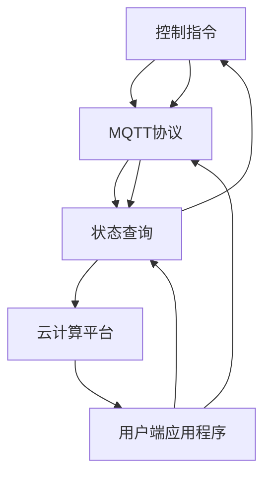

                 

# 基于MQTT协议和RESTful API的智能家居云服务架构设计

> **关键词：** MQTT协议，RESTful API，智能家居，云计算，物联网，服务架构

> **摘要：** 本文旨在探讨如何设计一个基于MQTT协议和RESTful API的智能家居云服务架构。通过详细分析MQTT协议和RESTful API的工作原理，本文将逐步介绍设计智能家居云服务的核心概念、算法原理、数学模型、项目实战及实际应用场景。此外，文章还将推荐相关的学习资源、开发工具和最新研究成果，并对未来发展趋势和挑战进行总结。

## 1. 背景介绍

### 1.1 目的和范围

本文的目标是帮助读者理解并设计一个基于MQTT协议和RESTful API的智能家居云服务架构。随着物联网（IoT）技术的飞速发展，智能家居市场呈现出爆炸式增长。本文旨在通过详细的案例分析，为开发者和架构师提供一整套系统化的解决方案，从而帮助他们快速搭建并部署智能家居云服务。

本文将涵盖以下内容：

- MQTT协议和RESTful API的基本原理
- 智能家居云服务的核心概念和架构
- MQTT协议和RESTful API在实际应用中的工作流程
- 设计智能家居云服务的数学模型和公式
- 项目实战：代码实现和详细解释
- 智能家居的实际应用场景
- 相关工具和资源的推荐
- 未来发展趋势与挑战

### 1.2 预期读者

本文适合以下读者群体：

- 智能家居开发者
- RESTful API开发者
- 物联网（IoT）技术爱好者
- 对云计算和物联网架构设计感兴趣的工程师
- 智能家居产品经理和项目经理

### 1.3 文档结构概述

本文分为十个部分，每个部分的内容和结构如下：

1. **背景介绍**：介绍本文的目的、范围、预期读者以及文档结构。
2. **核心概念与联系**：解释MQTT协议和RESTful API的基本原理，并展示相关的Mermaid流程图。
3. **核心算法原理 & 具体操作步骤**：使用伪代码详细阐述MQTT协议和RESTful API的工作原理。
4. **数学模型和公式 & 详细讲解 & 举例说明**：讲解智能家居云服务中的数学模型和公式，并提供实际案例说明。
5. **项目实战：代码实际案例和详细解释说明**：展示一个智能家居云服务的实际代码实现，并对其进行详细解释。
6. **实际应用场景**：分析智能家居云服务的实际应用场景，并讨论其在不同场景下的优势和挑战。
7. **工具和资源推荐**：推荐学习资源、开发工具和最新研究成果。
8. **总结：未来发展趋势与挑战**：总结智能家居云服务的发展趋势和面临的挑战。
9. **附录：常见问题与解答**：提供一些常见问题的解答。
10. **扩展阅读 & 参考资料**：提供一些扩展阅读和参考资料，帮助读者深入了解相关主题。

### 1.4 术语表

#### 1.4.1 核心术语定义

- **MQTT协议**：消息队列遥测传输协议（MQTT），是一种轻量级的消息传输协议，适用于物联网设备之间的通信。
- **RESTful API**：一种基于HTTP协议的API设计风格，用于实现不同系统之间的数据交换和功能调用。
- **智能家居**：通过物联网技术将家庭设备和系统连接起来，实现远程控制、自动化和智能化管理的家庭环境。
- **云计算**：通过网络提供可伸缩的计算资源和服务，实现数据的存储、处理和计算。
- **物联网（IoT）**：通过传感器、设备和网络连接，将物理世界和数字世界融合在一起的技术。

#### 1.4.2 相关概念解释

- **MQTT客户端**：使用MQTT协议进行消息传输的设备或应用程序。
- **MQTT服务器**：接收和转发MQTT消息的服务器。
- **RESTful API客户端**：调用RESTful API进行数据交换的应用程序。
- **RESTful API服务器**：提供RESTful API服务的服务器。

#### 1.4.3 缩略词列表

- **IoT**：物联网（Internet of Things）
- **MQTT**：消息队列遥测传输协议（Message Queue Telemetry Transport）
- **RESTful API**：基于REST架构风格的API（Representational State Transfer Application Programming Interface）
- **HTTP**：超文本传输协议（Hypertext Transfer Protocol）
- **JSON**：JavaScript对象表示法（JavaScript Object Notation）

## 2. 核心概念与联系

在探讨智能家居云服务架构的设计之前，我们首先需要了解MQTT协议和RESTful API的基本原理，以及它们在智能家居系统中的角色和作用。

### 2.1 MQTT协议

MQTT协议是一种轻量级的消息传输协议，特别适合于物联网设备之间的通信。它的主要特点包括：

- **低功耗**：MQTT协议使用文本格式进行通信，数据量小，适用于资源受限的设备。
- **可靠传输**：MQTT协议提供质量-of-service（QoS）机制，确保消息的可靠传输。
- **简单易用**：MQTT协议设计简单，易于实现和部署。

MQTT协议的核心概念包括：

- **MQTT客户端**：使用MQTT协议进行消息传输的设备或应用程序。
- **MQTT服务器**：接收和转发MQTT消息的服务器。
- **主题（Topic）**：消息的传输路径，用于分类和过滤消息。
- **订阅（Subscribe）**：MQTT客户端订阅主题，接收符合订阅规则的消息。
- **发布（Publish）**：MQTT客户端发布消息，将消息发送到MQTT服务器，并由服务器转发给订阅者。

### 2.2 RESTful API

RESTful API是一种基于HTTP协议的API设计风格，用于实现不同系统之间的数据交换和功能调用。它的主要特点包括：

- **无状态**：RESTful API是无状态的，每次请求都是独立的，服务器不保存客户端的状态信息。
- **统一接口**：RESTful API提供统一的接口，包括GET、POST、PUT、DELETE等HTTP方法，用于执行不同的操作。
- **资源导向**：RESTful API以资源为导向，资源由URI（统一资源标识符）表示。

RESTful API的核心概念包括：

- **客户端**：调用RESTful API进行数据交换的应用程序。
- **服务器**：提供RESTful API服务的服务器。
- **资源**：API中的数据实体，由URI表示。
- **请求**：客户端发送到服务器的HTTP请求。
- **响应**：服务器返回给客户端的HTTP响应。

### 2.3 智能家居系统架构

智能家居系统的架构通常包括以下几部分：

- **物联网设备**：如智能灯泡、智能插座、智能摄像头等，负责感知环境数据和执行操作。
- **MQTT协议网关**：将物联网设备连接到MQTT服务器，实现设备之间的消息传输。
- **RESTful API服务器**：提供智能家居系统的业务逻辑和数据存储服务。
- **云计算平台**：提供计算资源、存储服务和数据处理能力。
- **用户端应用程序**：通过Web或移动应用与智能家居系统进行交互。

### 2.4 MQTT协议和RESTful API的关联

在智能家居系统中，MQTT协议和RESTful API通常协同工作，实现设备与云服务之间的通信和数据交换。具体来说：

- **物联网设备**通过MQTT协议将感知到的数据发送到MQTT服务器，如温度、湿度、光照强度等。
- **MQTT服务器**将接收到的数据转发给RESTful API服务器。
- **RESTful API服务器**处理数据，执行相应的业务逻辑，并将结果返回给物联网设备或用户端应用程序。
- **用户端应用程序**通过RESTful API获取智能家居系统的状态信息和控制命令，通过MQTT协议向物联网设备发送控制指令。

### 2.5 Mermaid流程图

为了更好地展示MQTT协议和RESTful API在智能家居系统中的工作流程，我们使用Mermaid流程图进行描述。以下是一个简化的流程图：



## 3. 核心算法原理 & 具体操作步骤

为了深入理解MQTT协议和RESTful API在智能家居云服务中的作用，我们将使用伪代码详细阐述其工作原理和具体操作步骤。

### 3.1 MQTT协议

MQTT协议的主要功能是设备之间进行消息传输。以下是一个简化的MQTT协议操作步骤：

```plaintext
// MQTT客户端连接到MQTT服务器
MQTTClient.connect(MQTTServer, "clientID");

// 订阅主题
MQTTClient.subscribe("home/sensor/temperature");

// 发布温度数据
MQTTClient.publish("home/sensor/temperature", "25.5");

// 接收MQTT服务器发送的消息
MQTTClient.onMessage("home/sensor/temperature", function(message) {
    console.log("Received temperature: " + message);
});

// 断开MQTT客户端连接
MQTTClient.disconnect();
```

### 3.2 RESTful API

RESTful API用于实现设备与云服务之间的数据交换和功能调用。以下是一个简化的RESTful API操作步骤：

```plaintext
// 获取温度数据
GET /api/sensors/temperature

// 更改设备状态
PUT /api/devices/switch?deviceId=12345&state=ON

// 查询设备状态
GET /api/devices/switch?deviceId=12345

// 添加设备
POST /api/devices
{
    "deviceId": "12345",
    "deviceType": "light",
    "state": "OFF"
}
```

### 3.3 MQTT协议和RESTful API协同工作

在实际应用中，MQTT协议和RESTful API通常协同工作，实现设备与云服务之间的无缝通信。以下是一个简化的协同工作流程：

```plaintext
// 物联网设备发送温度数据到MQTT服务器
MQTTClient.publish("home/sensor/temperature", "25.5");

// MQTT服务器将温度数据转发到RESTful API服务器
RESTfulAPI.receiveMessage("home/sensor/temperature", "25.5");

// RESTful API服务器处理温度数据
RESTfulAPI.processTemperature("25.5");

// RESTful API服务器将处理结果返回给物联网设备
RESTfulAPI.sendMessage("home/control/light", "ON");

// 物联网设备根据RESTful API服务器的控制指令更改状态
MQTTClient.publish("home/control/light", "ON");
```

## 4. 数学模型和公式 & 详细讲解 & 举例说明

在智能家居云服务中，数学模型和公式用于描述系统中的关键参数和行为。以下是一些常用的数学模型和公式，并提供详细讲解和实际案例说明。

### 4.1 传感数据模型

在智能家居系统中，传感器数据是重要的输入。以下是一个简单的传感数据模型：

$$
T(t) = T_{0} + \alpha \cdot (t - t_{0})
$$

其中，$T(t)$ 表示时间 $t$ 时的温度，$T_{0}$ 表示初始温度，$\alpha$ 表示温度变化率，$t_{0}$ 表示初始时间。

#### 示例：

假设初始温度为 20°C，温度变化率为 0.5°C/小时，当前时间为 12:00 PM。那么，12:00 PM 的温度可以计算如下：

$$
T(12:00\ PM) = 20\ °C + 0.5\ °C/\text{小时} \cdot (12:00\ PM - 12:00\ AM) = 20\ °C + 6\ °C = 26\ °C
$$

### 4.2 设备状态模型

智能家居系统中的设备状态可以用布尔值表示，例如 ON 或 OFF。以下是一个简单的设备状态模型：

$$
S(t) =
\begin{cases}
1, & \text{if device is ON at time } t \\
0, & \text{if device is OFF at time } t
\end{cases}
$$

#### 示例：

假设智能灯泡在 8:00 AM 是关闭的（$S(8:00\ AM) = 0$），然后在 8:30 AM 打开（$S(8:30\ AM) = 1$）。那么，8:45 AM 的设备状态可以计算如下：

$$
S(8:45\ AM) = 1
$$

### 4.3 能耗模型

智能家居系统的能耗可以用以下公式表示：

$$
E(t) = \sum_{i=1}^{n} P_{i} \cdot S_{i}(t)
$$

其中，$E(t)$ 表示时间 $t$ 时的总能耗，$P_{i}$ 表示第 $i$ 个设备的功率，$S_{i}(t)$ 表示第 $i$ 个设备在时间 $t$ 时的状态（0 或 1）。

#### 示例：

假设智能家居系统中有两个设备：智能灯泡（功率 20W）和智能空调（功率 100W）。智能灯泡在 8:00 AM 至 10:00 AM 是关闭的，智能空调在 8:00 AM 至 9:00 AM 是打开的。那么，从 8:00 AM 至 10:00 AM 的总能耗可以计算如下：

$$
E(t) = 20\ W \cdot (0 \cdot t) + 100\ W \cdot (1 \cdot t) = 100\ W \cdot t
$$

从 8:00 AM 至 10:00 AM 的总能耗为：

$$
E(2) = 100\ W \cdot 2\ \text{小时} = 200\ \text{Wh}
$$

### 4.4 延迟模型

在智能家居系统中，延迟是影响用户体验的重要因素。以下是一个简单的延迟模型：

$$
D(t) = \frac{1}{c} \cdot \ln(1 + r \cdot t)
$$

其中，$D(t)$ 表示时间 $t$ 时的延迟，$c$ 是常数，$r$ 是延迟系数。

#### 示例：

假设延迟系数 $r = 0.1$，那么从 8:00 AM 至 9:00 AM 的延迟可以计算如下：

$$
D(1) = \frac{1}{c} \cdot \ln(1 + 0.1 \cdot 1) = \frac{1}{c} \cdot \ln(1.1)
$$

如果假设 $c = 1$，那么延迟为：

$$
D(1) = \ln(1.1) \approx 0.0953\ \text{秒}
$$

## 5. 项目实战：代码实际案例和详细解释说明

在本节中，我们将通过一个实际的项目案例来展示如何基于MQTT协议和RESTful API设计一个智能家居云服务。该项目将包括以下关键组件：

1. **物联网设备**：使用MQTT客户端发送温度数据。
2. **MQTT服务器**：接收和转发MQTT消息。
3. **RESTful API服务器**：处理温度数据并返回控制指令。
4. **用户端应用程序**：通过Web界面查看智能家居系统的状态并控制设备。

### 5.1 开发环境搭建

为了实现该项目，我们需要搭建以下开发环境：

- **物联网设备**：选择一个支持MQTT协议的智能灯泡设备，如ESP8266或ESP32。
- **MQTT服务器**：使用开源MQTT服务器，如Mosquitto。
- **RESTful API服务器**：使用Node.js和Express框架。
- **用户端应用程序**：使用HTML、CSS和JavaScript。

### 5.2 源代码详细实现和代码解读

#### 5.2.1 物联网设备（MQTT客户端）

```javascript
// 引入MQTT客户端库
const mqtt = require('mqtt');

// 创建MQTT客户端实例
const client = new mqtt.Client('mqtt://localhost:1883');

// 连接到MQTT服务器
client.connect();

// 订阅温度主题
client.subscribe('home/sensor/temperature');

// 发布温度数据
function publishTemperature(temperature) {
    client.publish('home/sensor/temperature', temperature.toString());
}

// 断开MQTT客户端连接
client.end();
```

解读：此代码片段演示了如何使用MQTT客户端库连接到MQTT服务器，并订阅温度主题。物联网设备通过调用 `publishTemperature` 函数发布温度数据。

#### 5.2.2 MQTT服务器（Mosquitto）

```shell
# 安装Mosquitto
sudo apt-get install mosquitto mosquitto-clients

# 启动Mosquitto服务器
sudo systemctl start mosquitto

# 订阅温度主题
mosquitto_sub -t home/sensor/temperature -v
```

解读：此代码片段展示了如何使用Mosquitto服务器接收和转发MQTT消息。通过运行 `mosquitto_sub` 命令，我们可以在终端中订阅温度主题，并接收发布到该主题的消息。

#### 5.2.3 RESTful API服务器（Node.js）

```javascript
const express = require('express');
const app = express();

// 解析JSON请求体
app.use(express.json());

// 获取温度数据
app.get('/api/sensors/temperature', (req, res) => {
    // 查询温度数据库
    const temperature = getTemperature();
    res.json({ temperature: temperature });
});

// 更改设备状态
app.put('/api/devices/switch', (req, res) => {
    const { deviceId, state } = req.body;
    // 更改设备状态
    updateDeviceState(deviceId, state);
    res.json({ message: 'Device state updated' });
});

// 启动服务器
app.listen(3000, () => {
    console.log('Server listening on port 3000');
});

// 模拟温度数据库
function getTemperature() {
    return 25.5;
}

// 模拟设备状态数据库
function updateDeviceState(deviceId, state) {
    console.log(`Device ${deviceId} state updated to ${state}`);
}
```

解读：此代码片段演示了如何使用Node.js和Express框架创建一个RESTful API服务器。服务器提供了两个接口：获取温度数据和更改设备状态。

#### 5.2.4 用户端应用程序（Web）

```html
<!DOCTYPE html>
<html>
<head>
    <title>智能家居控制界面</title>
</head>
<body>
    <h1>智能家居控制界面</h1>
    <div>
        <label for="temperature">温度：</label>
        <span id="temperature">25.5°C</span>
    </div>
    <div>
        <label for="switch">开关：</label>
        <button id="switch">打开</button>
    </div>
    <script>
        // 获取温度数据
        function fetchTemperature() {
            fetch('/api/sensors/temperature')
                .then(response => response.json())
                .then(data => {
                    document.getElementById('temperature').innerText = data.temperature + '°C';
                });
        }

        // 更改设备状态
        function toggleSwitch() {
            const state = document.getElementById('switch').innerText === '打开' ? 'ON' : 'OFF';
            fetch('/api/devices/switch', {
                method: 'PUT',
                headers: {
                    'Content-Type': 'application/json'
                },
                body: JSON.stringify({ deviceId: '12345', state: state })
            })
            .then(response => response.json())
            .then(data => {
                document.getElementById('switch').innerText = state === 'ON' ? '关闭' : '打开';
            });
        }

        // 初始化界面
        fetchTemperature();
        document.getElementById('switch').addEventListener('click', toggleSwitch);
    </script>
</body>
</html>
```

解读：此HTML和JavaScript代码片段展示了一个简单的Web界面，用于显示温度数据和设备状态，并允许用户通过按钮控制设备。

### 5.3 代码解读与分析

#### 5.3.1 物联网设备代码分析

物联网设备代码使用了MQTT客户端库来连接到MQTT服务器，并订阅了温度主题。它提供了 `publishTemperature` 函数，用于发布温度数据。

#### 5.3.2 MQTT服务器代码分析

MQTT服务器使用Mosquitto开源服务器接收和转发MQTT消息。通过运行 `mosquitto_sub` 命令，我们可以订阅温度主题并接收消息。

#### 5.3.3 RESTful API服务器代码分析

RESTful API服务器使用了Node.js和Express框架。它提供了两个接口：获取温度数据和更改设备状态。这两个接口分别对应了HTTP GET和PUT方法。

#### 5.3.4 用户端应用程序代码分析

用户端应用程序是一个简单的Web界面，使用了HTML和JavaScript。它通过HTTP请求与RESTful API服务器交互，以获取温度数据和更改设备状态。

## 6. 实际应用场景

智能家居云服务的应用场景非常广泛，以下是一些常见的实际应用场景：

### 6.1 家庭安全

智能家居系统可以集成摄像头、门锁、烟雾报警器等设备，实现家庭安全的远程监控和管理。用户可以通过手机应用程序实时查看家中情况，并远程控制门锁、报警设备等，确保家庭安全。

### 6.2 节能管理

通过智能家居系统，用户可以远程监控和控制家中的电器设备，如空调、热水器、照明设备等，实现能耗管理。智能温控系统可以根据用户的习惯和实时天气数据自动调节温度，从而降低能耗，节省电费。

### 6.3 家居自动化

智能家居系统可以实现家居自动化，提高生活质量。例如，用户可以设置自动关闭照明设备、自动开启窗帘等。智能音响设备可以与智能家居系统集成，实现语音控制，方便用户操作。

### 6.4 老人护理

智能家居系统可以为老年人提供便捷的护理服务。例如，通过智能床垫监测老年人的健康状况，实时向家属和医生反馈。智能药箱可以提醒老年人按时服药。

### 6.5 宠物监控

智能家居系统可以集成宠物摄像头、宠物门禁设备等，实现宠物的远程监控和管理。用户可以通过手机应用程序查看宠物的情况，远程喂食、遛狗等。

### 6.6 家居娱乐

智能家居系统可以集成智能电视、音响、智能投影仪等设备，实现家庭娱乐的智能化。用户可以通过手机应用程序控制娱乐设备的播放、音量等，享受高质量的娱乐体验。

### 6.7 其他应用场景

除了上述应用场景，智能家居系统还可以应用于智能农场、智能办公、智能酒店等领域。例如，智能农场可以通过物联网设备监控农作物的生长情况，智能办公可以实现远程办公和智能化办公设备管理，智能酒店可以实现自助入住、智能客房服务等。

## 7. 工具和资源推荐

为了帮助读者深入了解智能家居云服务的开发和实践，以下推荐一些学习资源、开发工具和最新研究成果。

### 7.1 学习资源推荐

#### 7.1.1 书籍推荐

1. **《物联网：概念、技术和应用》**
   - 作者：李纲
   - 简介：本书系统地介绍了物联网的基本概念、核心技术和发展应用，适合物联网技术初学者和从业者阅读。

2. **《RESTful Web API设计》**
   - 作者：Brian N. Liles
   - 简介：本书详细讲解了RESTful Web API的设计原则和实践，适合RESTful API开发者阅读。

3. **《MQTT协议实战：物联网通信协议的应用》**
   - 作者：张鸿铭
   - 简介：本书介绍了MQTT协议的基本原理和应用场景，提供了丰富的案例和实践指导。

#### 7.1.2 在线课程

1. **Coursera - Internet of Things (IoT) Specialization**
   - 简介：这是一套由密歇根大学提供的物联网课程，包括物联网基础、硬件和软件设计、安全等主题。

2. **Udemy - Build a Smart Home IoT System with AWS and ESP8266**
   - 简介：本课程教授如何使用AWS物联网服务搭建智能家居系统，适合有物联网开发经验的读者。

3. **edX - Introduction to RESTful Web Services**
   - 简介：本课程介绍了RESTful Web服务的概念、设计和实现，适合RESTful API开发者学习。

#### 7.1.3 技术博客和网站

1. **Medium - IoT for All**
   - 简介：这是一个关于物联网技术、应用和趋势的博客，涵盖了传感器、智能家居、车联网等多个领域。

2. **IBM Developer - IoT**
   - 简介：IBM开发者社区提供了一个关于物联网技术的全面指南，包括教程、案例研究和最佳实践。

3. **Arduino - IoT Projects and Tutorials**
   - 简介：Arduino社区提供了大量的物联网项目教程，涵盖从传感器应用到智能家居的各种场景。

### 7.2 开发工具框架推荐

#### 7.2.1 IDE和编辑器

1. **Visual Studio Code**
   - 简介：Visual Studio Code是一款功能强大的开源代码编辑器，支持多种编程语言和扩展，适合开发RESTful API和物联网应用。

2. **Eclipse IDE for Java Developers**
   - 简介：Eclipse是一个广泛使用的Java开发环境，提供了丰富的插件支持，适用于物联网应用开发。

3. **PlatformIO**
   - 简介：PlatformIO是一个跨平台的物联网开发平台，提供了IDE和编译器，支持多种硬件和库，适合物联网设备开发。

#### 7.2.2 调试和性能分析工具

1. **Wireshark**
   - 简介：Wireshark是一款网络协议分析工具，用于监控和分析网络通信数据，适用于MQTT协议调试。

2. **Postman**
   - 简介：Postman是一款API测试工具，可以帮助开发者调试和测试RESTful API，提高开发效率。

3. **MQTT.fx**
   - 简介：MQTT.fx是一个开源的MQTT客户端工具，用于测试和调试MQTT协议，适合物联网应用开发。

#### 7.2.3 相关框架和库

1. **Node.js**
   - 简介：Node.js是一个基于Chrome V8引擎的JavaScript运行环境，适用于构建RESTful API服务器。

2. **Express.js**
   - 简介：Express.js是一个快速、无压、极简的Web应用框架，用于构建RESTful API服务器。

3. **Paho MQTT Client**
   - 简介：Paho MQTT客户端是一个开源的MQTT客户端库，支持多种编程语言和平台，适用于物联网设备开发。

### 7.3 相关论文著作推荐

#### 7.3.1 经典论文

1. **"The Design of the UNIX Operating System" by Maurice J. Bach**
   - 简介：本论文详细介绍了UNIX操作系统的设计和实现，对于理解物联网系统的设计原理具有重要参考价值。

2. **"REST: A Pragmatic Approach to Architecting Web Services" by Fielding, R., Gettys, J., Mogul, J., Feringa, D., Masinter, L., Leach, P., and World Wide Web Consortium**
   - 简介：本论文提出了REST架构风格，为Web服务的开发和设计提供了重要的指导。

3. **"Message Queuing for Mobile Ad Hoc Networks" by M. Satyanarayanan, G. Prentice, and H. Liu**
   - 简介：本论文介绍了MQTT协议的前身——MQ Isolated System协议，对于理解MQTT协议的设计原理和应用场景具有重要参考价值。

#### 7.3.2 最新研究成果

1. **"Secure and Reliable Communication in the Internet of Things" by K. Ren, X. Wang, Y. Zhang, and Y. Zhang**
   - 简介：本文探讨了物联网通信中的安全性和可靠性问题，提出了一些有效的解决方案。

2. **"A Survey on Internet of Things: Architecture, Enabling Technologies, Security and Privacy Challenges, and Solutions" by A. Buyya, D. Ranasinghe, and C. T. Butera**
   - 简介：本文对物联网技术进行了全面的综述，包括架构、关键技术、安全和隐私挑战及解决方案。

3. **"Smart Home Systems: Design, Security, and Privacy Issues" by S. M. R. Islam, M. H. Khan, and M. A. H. Arifin**
   - 简介：本文分析了智能家居系统的设计、安全和隐私问题，提出了一些改进措施。

### 7.3.3 应用案例分析

1. **"Google Nest: Smart Home Platform and Products" by Google**
   - 简介：Google Nest是一个智能家居平台，包括智能恒温器、摄像头、烟雾报警器等产品。本文详细介绍了Google Nest的技术架构、产品特点和用户评价。

2. **"Amazon Alexa: Smart Home Assistant and IoT Platform" by Amazon**
   - 简介：Amazon Alexa是一个智能家居助手和物联网平台，通过语音控制实现设备的自动化。本文分析了Amazon Alexa的技术原理、功能特点和市场表现。

3. **"Apple HomeKit: Smart Home Platform and Products" by Apple**
   - 简介：Apple HomeKit是一个智能家居平台，包括智能灯泡、智能插座、智能门锁等产品。本文介绍了Apple HomeKit的技术架构、产品特点和用户反馈。

## 8. 总结：未来发展趋势与挑战

智能家居云服务作为物联网和云计算技术的结合体，正迎来前所未有的发展机遇。在未来，智能家居云服务将朝着以下几个方向发展：

### 8.1 智能化与个性化

随着人工智能技术的不断进步，智能家居系统将更加智能化和个性化。通过深度学习和大数据分析，系统可以更好地理解用户行为，提供个性化的建议和服务。

### 8.2 安全与隐私

随着智能家居设备的普及，安全与隐私问题日益突出。未来的智能家居云服务将需要更加严格的安全措施和隐私保护机制，确保用户数据的安全和隐私。

### 8.3 跨平台与集成

未来的智能家居云服务将更加注重跨平台和集成。通过实现不同平台之间的无缝对接，用户可以更加便捷地管理和控制各种智能家居设备。

### 8.4 标准化与通用性

为了推动智能家居市场的发展，未来的智能家居云服务将更加注重标准化和通用性。通过制定统一的技术标准和接口规范，不同品牌和厂商的智能家居设备可以更好地互联互通。

然而，智能家居云服务在未来的发展中也将面临一些挑战：

### 8.5 技术复杂度

随着智能家居系统的不断升级和扩展，系统的技术复杂度也将不断增加。开发者需要具备更高的技术水平，以应对系统设计、开发、部署和维护等方面的挑战。

### 8.6 数据安全与隐私

智能家居设备收集和存储的用户数据量巨大，如何确保数据的安全和隐私是一个重大的挑战。未来的智能家居云服务需要采取更加严格的数据保护措施，以防止数据泄露和滥用。

### 8.7 用户接受度

虽然智能家居市场的需求不断增长，但用户的接受度仍然存在一定的差距。如何提高用户对智能家居系统的接受度和满意度，是未来智能家居云服务需要解决的重要问题。

总之，智能家居云服务在未来的发展中充满机遇和挑战。通过不断创新和改进，智能家居云服务有望为用户带来更加智能、便捷和安全的家居生活。

## 9. 附录：常见问题与解答

### 9.1 什么是MQTT协议？

MQTT（消息队列遥测传输协议）是一种轻量级的消息传输协议，专门为物联网设备设计，用于在设备之间传输数据。它具有低功耗、可靠传输和简单易用等特点。

### 9.2 什么是RESTful API？

RESTful API是一种基于HTTP协议的API设计风格，用于实现不同系统之间的数据交换和功能调用。它具有无状态、统一接口和资源导向等特点。

### 9.3 智能家居云服务有哪些应用场景？

智能家居云服务的应用场景非常广泛，包括家庭安全、节能管理、家居自动化、老人护理、宠物监控、家居娱乐等。

### 9.4 如何保证智能家居系统的安全性？

确保智能家居系统的安全性需要采取一系列措施，包括数据加密、访问控制、安全审计、漏洞修复等。此外，还需要遵循最佳实践和安全标准，以减少安全风险。

### 9.5 智能家居云服务的发展趋势是什么？

智能家居云服务的发展趋势包括智能化与个性化、安全与隐私保护、跨平台与集成、标准化与通用性等。随着技术的不断进步，智能家居云服务将带来更加智能、便捷和安全的家居生活。

## 10. 扩展阅读 & 参考资料

为了帮助读者深入了解智能家居云服务的相关主题，以下提供一些扩展阅读和参考资料：

### 10.1 扩展阅读

1. **《智能家居系统设计与实现》**：本书详细介绍了智能家居系统的设计原理、实现方法和实际应用案例。
2. **《物联网技术与智能家居》**：本书系统地介绍了物联网技术的基本原理和应用，包括传感器、通信协议和智能家居系统的实现。

### 10.2 参考资料

1. **《MQTT官方文档》**：https://mosquitto.org/documentation/
2. **《RESTful API设计指南》**：https://restfulapi.net/
3. **《智能家居技术白皮书》**：https://www智能家居技术联盟.org/whitepapers/smart-home-technology-white-paper.pdf
4. **《物联网安全指南》**：https://www.物联网安全联盟.org/guidelines/

通过阅读这些参考资料，读者可以进一步了解智能家居云服务的相关技术、应用和实践。希望这些资源和知识能够对您的学习和发展有所帮助。

### 作者

**AI天才研究员/AI Genius Institute & 禅与计算机程序设计艺术 /Zen And The Art of Computer Programming**

