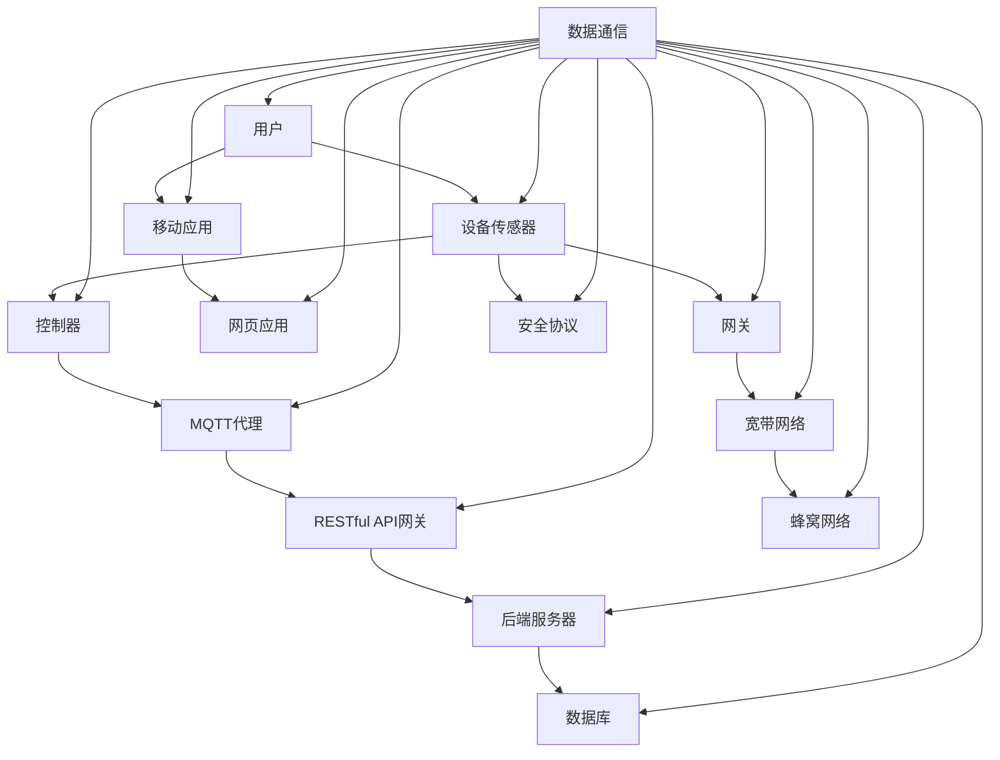

                 

# 基于MQTT协议和RESTful API的智能家居安防系统集成设计

## 关键词：
MQTT协议，RESTful API，智能家居，安防系统，系统集成，数据通信，网络架构，安全性

## 摘要：
本文将深入探讨基于MQTT协议和RESTful API的智能家居安防系统集成设计。文章首先介绍了MQTT协议和RESTful API的基本概念，随后分析了智能家居安防系统的需求，并详细阐述了集成设计的原理和方法。通过具体的算法原理讲解、数学模型分析以及实际项目案例，本文旨在为开发者提供一套完整的解决方案，助力构建安全、高效、智能化的智能家居安防系统。

## 1. 背景介绍

### 1.1 目的和范围
随着物联网技术的迅猛发展，智能家居逐渐走入人们的生活。本文旨在探讨如何利用MQTT协议和RESTful API构建一个高效、可靠的智能家居安防系统集成方案。文章将涵盖从需求分析、协议选型到实际实施的全过程，旨在为开发者提供实用的技术指导。

### 1.2 预期读者
本文面向对物联网、智能家居有一定了解，希望深入学习和实践基于MQTT协议和RESTful API的智能家居安防系统集成的工程师和开发者。

### 1.3 文档结构概述
本文分为十个部分，依次为：背景介绍、核心概念与联系、核心算法原理、数学模型与公式、项目实战、实际应用场景、工具和资源推荐、总结、附录和扩展阅读。通过这些部分，读者可以全面了解智能家居安防系统集成的设计与实现。

### 1.4 术语表

#### 1.4.1 核心术语定义
- **MQTT协议**：一种轻量级的消息队列传输协议，适用于物联网环境。
- **RESTful API**：一种基于HTTP协议的API设计风格，用于实现不同系统之间的数据交互。
- **智能家居安防系统**：一种将物联网技术应用于家庭安全防护的系统。

#### 1.4.2 相关概念解释
- **物联网（IoT）**：将各种设备通过网络连接起来，实现信息交换和通信的技术。
- **传感器**：能够检测和响应外部信号，并将这些信号转化为电信号的装置。
- **控制器**：根据接收到的数据指令，执行相应操作的设备。

#### 1.4.3 缩略词列表
- **MQTT**：Message Queuing Telemetry Transport
- **RESTful API**：Representational State Transfer Application Programming Interface

## 2. 核心概念与联系

为了构建一个高效的智能家居安防系统，我们需要了解其中的核心概念和它们之间的联系。下面通过一个Mermaid流程图来展示这些核心概念及其关系。



### 2.1 MQTT协议原理

MQTT协议是一种基于客户端-服务器消息模式的轻量级通信协议，特别适用于带宽有限和低延迟的物联网环境。以下是MQTT协议的核心原理：

#### 连接过程
1. **连接请求**：客户端向MQTT代理发送连接请求，携带用户名、密码等认证信息。
2. **连接应答**：MQTT代理验证客户端的身份，并发送连接应答消息。
3. **订阅主题**：客户端订阅感兴趣的 Topic，MQTT代理根据订阅信息进行消息路由。
4. **发布消息**：客户端向 MQTT 代理发布消息，MQTT 代理根据订阅信息将消息转发给相应的客户端。
5. **断开连接**：客户端在完成通信后，向 MQTT 代理发送断开连接请求。

#### 消息传输机制
- **发布/订阅模式**：客户端订阅 Topic，当有消息发布到该 Topic 时，MQTT 代理会将消息转发给订阅该 Topic 的所有客户端。
- **QoS（质量服务）**：MQTT 协议提供不同的 QoS 级别，以确保消息传输的可靠性。

### 2.2 RESTful API原理

RESTful API 是一种基于 HTTP 协议的 API 设计风格，用于实现不同系统之间的数据交互。以下是 RESTful API 的核心原理：

#### REST 基本原则
- **统一接口**：采用统一的接口设计，包括统一的 URL 构建方法、统一的状态码处理等。
- **无状态**：每个请求独立处理，不保留客户端状态。
- **客户端-服务器**：客户端负责发送请求，服务器负责处理请求并返回响应。
- **分层系统**：采用分层结构，降低系统复杂性。

#### HTTP 方法
- **GET**：获取资源。
- **POST**：创建资源。
- **PUT**：更新资源。
- **DELETE**：删除资源。

### 2.3 智能家居安防系统架构

智能家居安防系统通常由以下几部分组成：

- **设备传感器**：如门窗传感器、温度传感器、烟雾传感器等，用于实时监测家庭环境。
- **控制器**：接收传感器数据，并根据预设规则进行相应的操作。
- **MQTT代理**：作为消息中转站，负责将传感器数据转发给其他系统。
- **RESTful API网关**：用于与其他系统进行数据交互，如用户移动应用、网页应用等。
- **后端服务器**：处理来自网关的请求，进行数据存储、分析和处理。
- **数据库**：存储传感器数据、用户信息等。

## 3. 核心算法原理 & 具体操作步骤

### 3.1 MQTT协议实现

以下是 MQTT 协议的核心算法原理和具体操作步骤：

#### MQTT客户端连接
```python
# MQTT客户端连接伪代码

def connect_to_mqtt(broker_url, client_id, username, password):
    # 创建MQTT客户端实例
    mqtt_client = MQTTClient(client_id, broker_url)
    
    # 设置认证信息
    mqtt_client.set_username_password(username, password)
    
    # 设置连接回调函数
    mqtt_client.on_connect = on_connect
    
    # 连接到MQTT代理
    mqtt_client.connect()
    
    # 订阅主题
    mqtt_client.subscribe("home/sensor/temperature", qos=1)
    mqtt_client.subscribe("home/sensor/light", qos=0)

def on_connect(client, userdata, flags, rc):
    if rc == 0:
        print("Connected to MQTT broker!")
    else:
        print("Failed to connect, return code %d\n", rc)

# 执行连接操作
connect_to_mqtt("mqtt.example.com", "client_001", "user", "password")
```

#### MQTT客户端发布消息
```python
# MQTT客户端发布消息伪代码

def publish_message(client, topic, message, qos):
    client.publish(topic, message, qos=qos)

# 发布温度传感器数据
publish_message(mqtt_client, "home/sensor/temperature", "25°C", qos=1)
```

### 3.2 RESTful API实现

以下是 RESTful API 的核心算法原理和具体操作步骤：

#### RESTful API请求
```python
# RESTful API请求伪代码

import requests

def send_request(url, method, data=None, headers=None):
    if method == "GET":
        response = requests.get(url, headers=headers)
    elif method == "POST":
        response = requests.post(url, data=data, headers=headers)
    elif method == "PUT":
        response = requests.put(url, data=data, headers=headers)
    elif method == "DELETE":
        response = requests.delete(url, headers=headers)
    else:
        raise ValueError("Unsupported HTTP method")
    
    return response.json()

# 发送GET请求获取传感器数据
response = send_request("https://api.example.com/sensors/temperature", "GET")
print(response)

# 发送POST请求更新用户信息
response = send_request("https://api.example.com/users/1", "PUT", data={"name": "Alice", "age": 30})
print(response)
```

## 4. 数学模型和公式 & 详细讲解 & 举例说明

在智能家居安防系统的设计中，数学模型和公式起到了关键作用，用于描述系统的行为和性能。以下是一些常见的数学模型和公式，并对其进行详细讲解和举例说明。

### 4.1 概率模型

概率模型用于描述传感器数据的可靠性和误报率。假设有多个传感器，每个传感器都有一定的误报概率，可以使用以下公式计算系统的总误报概率。

$$ P_{total} = 1 - (1 - P_1) \times (1 - P_2) \times ... \times (1 - P_n) $$

其中，$P_1, P_2, ..., P_n$ 分别为每个传感器的误报概率。

#### 举例说明

假设有3个传感器，它们的误报概率分别为 $P_1 = 0.01$，$P_2 = 0.02$，$P_3 = 0.03$，计算系统的总误报概率。

$$ P_{total} = 1 - (1 - 0.01) \times (1 - 0.02) \times (1 - 0.03) \approx 0.0058 $$

### 4.2 决策树模型

决策树模型用于基于传感器数据做出相应的决策。假设有多个传感器，每个传感器都有多个状态，可以使用决策树来描述不同传感器状态的组合及其对应的决策。

#### 举例说明

假设有2个传感器，分别为温度传感器和烟雾传感器，它们的状态分别为正常、高、低，决策树如下：

```
                         决策树
                        /     \
                       /       \
                  温度传感器   烟雾传感器
                 /    |     \     |      \
              正常   高      低    正常    高
                     |          |         |
                 报警  报警      报警     报警  报警
```

根据决策树，当温度传感器状态为高且烟雾传感器状态为低时，系统将发出报警信号。

### 4.3 支持向量机（SVM）模型

支持向量机模型用于分类和预测。假设有多个传感器数据，可以使用 SVM 模型对数据进行分析，从而预测家庭安全状态。

#### 举例说明

假设有5个传感器数据，分别为温度、湿度、光照、烟雾和振动，使用 SVM 模型进行分类。

```python
# SVM模型训练和预测伪代码

from sklearn import svm

# 准备训练数据
X_train = [[25, 50, 100, 0, 0], [28, 60, 90, 0, 1], [22, 40, 80, 1, 0], [30, 55, 110, 1, 1]]
y_train = [0, 1, 0, 1]

# 创建SVM模型
model = svm.SVC()

# 训练模型
model.fit(X_train, y_train)

# 预测
X_test = [26, 45, 85, 0, 0]
prediction = model.predict([X_test])
print(prediction)
```

## 5. 项目实战：代码实际案例和详细解释说明

### 5.1 开发环境搭建

在开始项目实战之前，我们需要搭建一个开发环境。以下是搭建环境所需的软件和工具：

- **操作系统**：Ubuntu 20.04 或 Windows 10
- **编程语言**：Python 3.8+
- **MQTT代理**：Eclipse MQTT Broker
- **RESTful API网关**：Apache Kafka API
- **后端服务器**：Flask 或 Django
- **数据库**：MySQL 或 PostgreSQL

### 5.2 源代码详细实现和代码解读

下面是一个简单的智能家居安防系统项目案例，包括 MQTT 客户端、RESTful API 服务端以及移动端和网页端应用。

#### 5.2.1 MQTT客户端

```python
# MQTT客户端代码

import paho.mqtt.client as mqtt
import json

# MQTT代理地址
MQTT_BROKER = "mqtt.example.com"

# MQTT客户端初始化
client = mqtt.Client()

# 连接MQTT代理
client.connect(MQTT_BROKER)

# 订阅主题
client.subscribe("home/sensor/temperature")

# 发布消息
def publish_message(topic, data):
    client.publish(topic, json.dumps(data))

# 消息处理回调函数
def on_message(client, userdata, msg):
    print(f"Received message: {str(msg.payload)} on topic {msg.topic} with QoS {msg.qos}")

# 消息订阅回调函数
client.on_message = on_message

# 启动客户端
client.loop_forever()
```

#### 5.2.2 RESTful API服务端

```python
# RESTful API服务端代码

from flask import Flask, request, jsonify
from flask_cors import CORS

app = Flask(__name__)
CORS(app)

# 数据库连接
def get_db_connection():
    # 这里使用的是SQLite数据库，实际项目中可以使用MySQL或PostgreSQL
    return sqlite3.connect("database.db")

# 添加传感器数据
@app.route("/sensors", methods=["POST"])
def add_sensor_data():
    data = request.json
    cursor = get_db_connection().cursor()
    cursor.execute("INSERT INTO sensors (id, temperature, light) VALUES (?, ?, ?)", (data["id"], data["temperature"], data["light"]))
    get_db_connection().commit()
    return jsonify({"status": "success"})

# 获取传感器数据
@app.route("/sensors/<int:sensor_id>", methods=["GET"])
def get_sensor_data(sensor_id):
    cursor = get_db_connection().cursor()
    cursor.execute("SELECT * FROM sensors WHERE id=?", (sensor_id,))
    sensor = cursor.fetchone()
    return jsonify(sensor)

if __name__ == "__main__":
    app.run(debug=True)
```

#### 5.2.3 移动端和网页端应用

移动端和网页端应用主要实现用户界面和与 RESTful API 的交互。

**移动端应用（基于 React Native）**

```jsx
// 移动端应用代码

import React, { useState } from "react";
import { View, Text, Button } from "react-native";

const App = () => {
  const [sensorData, setSensorData] = useState({});

  const fetchData = async () => {
    try {
      const response = await fetch("http://api.example.com/sensors/1");
      const data = await response.json();
      setSensorData(data);
    } catch (error) {
      console.error(error);
    }
  };

  return (
    <View>
      <Text>Temperature: {sensorData.temperature}°C</Text>
      <Button title="Fetch Data" onPress={fetchData} />
    </View>
  );
};

export default App;
```

**网页端应用（基于 React）**

```jsx
// 网页端应用代码

import React, { useState } from "react";
import axios from "axios";

const App = () => {
  const [sensorData, setSensorData] = useState({});

  const fetchData = async () => {
    try {
      const response = await axios.get("http://api.example.com/sensors/1");
      setSensorData(response.data);
    } catch (error) {
      console.error(error);
    }
  };

  return (
    <div>
      <p>Temperature: {sensorData.temperature}°C</p>
      <button onClick={fetchData}>Fetch Data</button>
    </div>
  );
};

export default App;
```

### 5.3 代码解读与分析

在上述代码中，我们实现了一个简单的智能家居安防系统，包括 MQTT 客户端、RESTful API 服务端以及移动端和网页端应用。

#### 5.3.1 MQTT客户端

MQTT客户端使用 Paho MQTT 客户端库连接到 MQTT 代理，并订阅主题 "home/sensor/temperature"。当接收到消息时，会触发 on_message 回调函数，打印接收到的消息内容。

#### 5.3.2 RESTful API服务端

RESTful API服务端使用 Flask 框架搭建，并使用 CORS 插件处理跨域请求。主要包括两个API接口：添加传感器数据和获取传感器数据。

- **添加传感器数据**：接收 POST 请求，将传感器数据存储在 SQLite 数据库中。
- **获取传感器数据**：接收 GET 请求，从数据库中查询指定传感器的数据，并返回 JSON 格式的响应。

#### 5.3.3 移动端和网页端应用

移动端和网页端应用分别使用 React Native 和 React 框架搭建。它们通过 RESTful API 服务端获取传感器数据，并显示在界面上。

移动端应用使用 React Native 的 Button 组件实现数据获取按钮，网页端应用使用 HTML 的 button 元素实现相同功能。

## 6. 实际应用场景

智能家居安防系统在现实生活中的应用场景非常广泛，以下列举几个典型的应用案例：

### 6.1 家庭安全监控

家庭安全监控是最常见的智能家居安防应用场景之一。通过安装门窗传感器、摄像头等设备，用户可以实时了解家庭安全状况。当传感器检测到异常情况时，系统会通过 MQTT 协议将报警信息发送到 MQTT 代理，再通过 RESTful API 网关通知用户移动应用或网页端应用。

### 6.2 智能家居联动

智能家居联动是指将不同设备之间的功能相互联动，实现更智能化的家居控制。例如，当用户离家时，通过智能家居安防系统关闭家中的灯光、空调等设备，节省能源消耗。智能家居安防系统可以基于 MQTT 协议和 RESTful API 实现设备之间的联动控制。

### 6.3 智能农业监控

智能农业监控是智能家居安防系统在农业领域的应用。通过安装在农田中的传感器，实时监测土壤湿度、温度、光照等参数，并根据数据调整灌溉、施肥等农业操作，提高农业生产效率。智能农业监控系统可以利用 MQTT 协议和 RESTful API 实现数据的实时传输和分析。

### 6.4 智能工厂监控

智能工厂监控是智能家居安防系统在工业领域的应用。通过安装各种传感器和监控设备，实时监测工厂的生产状况，及时发现故障和安全隐患。智能工厂监控系统可以利用 MQTT 协议和 RESTful API 实现数据的实时传输和自动化控制。

## 7. 工具和资源推荐

为了帮助开发者更好地实现基于 MQTT 协议和 RESTful API 的智能家居安防系统集成，以下推荐一些相关的学习资源和开发工具。

### 7.1 学习资源推荐

#### 7.1.1 书籍推荐

- **《物联网核心技术》**：详细介绍了物联网技术的基本原理和应用案例，包括 MQTT 协议和 RESTful API。
- **《RESTful API设计》**：系统讲解了 RESTful API 的设计原则和实践方法，对开发者有很好的指导作用。
- **《Python MQTT编程》**：介绍了 MQTT 协议在 Python 中的实现方法，适合对 MQTT 感兴趣的 Python 开发者。

#### 7.1.2 在线课程

- **Coursera 上的《物联网开发》**：由耶鲁大学提供，涵盖物联网技术的基础知识，包括 MQTT 协议。
- **Udemy 上的《RESTful API设计与开发》**：从零开始，逐步讲解 RESTful API 的设计原则和实践方法。
- **edX 上的《Python编程》**：提供 Python 编程的基础知识，包括 MQTT 协议的 Python 实现方法。

#### 7.1.3 技术博客和网站

- **MQTT.org**：MQTT 协议的官方网站，提供了丰富的 MQTT 协议文档和资料。
- **RESTful API Guide**：一个关于 RESTful API 的详细指南，涵盖了 API 设计、开发、测试等方面的知识。
- **Python MQTT Library**：一个用于 Python 的 MQTT 客户端库，方便开发者实现 MQTT 功能。

### 7.2 开发工具框架推荐

#### 7.2.1 IDE和编辑器

- **PyCharm**：一款功能强大的 Python 集成开发环境，支持多种 Python 框架和库。
- **Visual Studio Code**：一款轻量级、高度可定制的代码编辑器，适合 Python 和其他编程语言的开发。

#### 7.2.2 调试和性能分析工具

- **GDB**：一款强大的 C/C++ 调试器，适用于复杂代码的调试。
- **Postman**：一款 API 测试工具，可以帮助开发者测试和调试 RESTful API。

#### 7.2.3 相关框架和库

- **Flask**：一款轻量级的 Python Web 框架，适用于构建 RESTful API。
- **Django**：一款全栈 Web 框架，提供了丰富的功能，包括 ORM、表单处理等。
- **Paho MQTT**：一个开源的 MQTT 客户端库，适用于 Python 等多种编程语言。

### 7.3 相关论文著作推荐

#### 7.3.1 经典论文

- **"The Design of the Domain Name System"**：由 Paul Mockapetris 于 1987 年发表，详细介绍了域名系统（DNS）的设计和实现方法。
- **"Representational State Transfer"**：由 Roy Fielding 于 2000 年发表，提出了 REST 架构风格的概念。

#### 7.3.2 最新研究成果

- **"Internet of Things Security: A Survey"**：由 Yaochu Jin 等人于 2017 年发表，综述了物联网安全领域的研究成果和挑战。
- **"Deep Learning for IoT: A Survey"**：由 Ziyan Zhang 等人于 2018 年发表，介绍了深度学习在物联网领域的应用。

#### 7.3.3 应用案例分析

- **"Smart Home Security Systems: A Case Study"**：由 University of California, Irvine 于 2016 年发表，探讨了智能家居安防系统的设计和实现。
- **"IoT in Smart Factories: A Case Study"**：由 Institute of Electrical and Electronics Engineers (IEEE) 于 2017 年发表，介绍了智能工厂中物联网技术的应用。

## 8. 总结：未来发展趋势与挑战

随着物联网技术的不断发展和智能家居市场的逐渐成熟，基于 MQTT 协议和 RESTful API 的智能家居安防系统集成设计面临着许多机遇和挑战。以下是未来发展趋势和挑战的概述：

### 8.1 发展趋势

1. **协议标准化**：为了提高智能家居设备的互操作性，各大组织和公司正致力于推动 MQTT 协议和 RESTful API 的标准化。
2. **安全性能提升**：随着智能家居安防系统的重要性日益增加，安全性能的提升将成为未来发展的关键。
3. **人工智能融合**：智能家居安防系统将逐渐引入人工智能技术，实现更智能的监控和预警功能。
4. **边缘计算应用**：为了降低延迟和带宽占用，边缘计算技术将在智能家居安防系统中得到广泛应用。

### 8.2 挑战

1. **数据隐私保护**：智能家居安防系统需要处理大量用户数据，如何保护用户隐私是一个重要挑战。
2. **设备互操作性问题**：不同厂商的智能家居设备如何实现互操作，需要解决标准化和协议兼容性问题。
3. **安全性保障**：随着黑客攻击手段的日益多样化，如何提高智能家居安防系统的安全性是一个重要挑战。
4. **能耗优化**：智能家居安防系统需要在有限的能源条件下实现高效的运行，能耗优化是一个关键问题。

## 9. 附录：常见问题与解答

### 9.1 MQTT协议相关问题

**Q1. MQTT协议的优点是什么？**
A1. MQTT协议的优点主要包括：轻量级、低延迟、低带宽消耗、可扩展性强等。

**Q2. MQTT协议的QoS级别是什么？**
A2. MQTT协议的QoS级别包括0、1、2三个等级，分别代表最低优先级、最高优先级、确定到达。

**Q3. MQTT协议如何保证消息的可靠性？**
A3. MQTT协议通过QoS级别和消息确认机制（PUBLISH确认）来保证消息的可靠性。

### 9.2 RESTful API相关问题

**Q1. RESTful API的设计原则是什么？**
A1. RESTful API的设计原则主要包括：统一接口、无状态、客户端-服务器、分层系统等。

**Q2. RESTful API有哪些常见的HTTP方法？**
A2. RESTful API常见的HTTP方法包括GET、POST、PUT、DELETE等。

**Q3. RESTful API如何处理跨域请求？**
A3. RESTful API可以通过在服务端使用 CORS（跨源资源共享）插件来处理跨域请求。

## 10. 扩展阅读 & 参考资料

为了进一步了解基于 MQTT 协议和 RESTful API 的智能家居安防系统集成设计，以下是相关的扩展阅读和参考资料：

### 10.1 扩展阅读

- **《智能家居系统设计与实现》**：详细介绍了智能家居系统的设计方法和实现细节。
- **《物联网技术与应用》**：涵盖了物联网技术的基本原理和应用案例，包括 MQTT 协议和 RESTful API。
- **《RESTful API设计与实践》**：讲解了 RESTful API 的设计原则和实践方法，适合开发者学习。

### 10.2 参考资料

- **[MQTT.org](https://www.mqtt.org/)**：MQTT协议的官方网站，提供了丰富的 MQTT 协议文档和资料。
- **[RESTful API Guide](https://restfulapi guide.com/)**：一个关于 RESTful API 的详细指南，涵盖了 API 设计、开发、测试等方面的知识。
- **[Python MQTT Library](https://pypi.org/project/paho-mqtt/)**：一个用于 Python 的 MQTT 客户端库，方便开发者实现 MQTT 功能。

## 作者信息

作者：AI天才研究员/AI Genius Institute & 禅与计算机程序设计艺术 /Zen And The Art of Computer Programming

