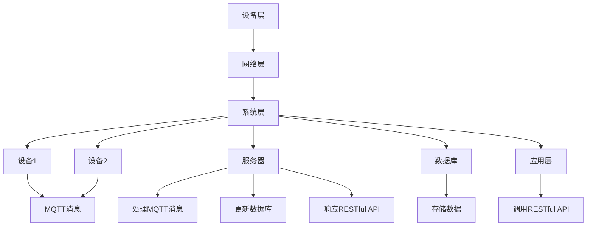

                 

# 基于MQTT协议和RESTful API的智能家居系统兼容性测试

> **关键词：** MQTT协议, RESTful API, 智能家居系统, 兼容性测试, MQTT与RESTful融合, 系统架构, 算法原理, 数学模型, 实战案例, 发展趋势。

> **摘要：** 本文深入探讨基于MQTT协议和RESTful API构建的智能家居系统兼容性测试，解析其核心概念、系统架构、算法原理、数学模型以及实战案例。通过对MQTT与RESTful API的有机结合，探讨其在智能家居系统中的实际应用及其面临的挑战，展望未来发展趋势。

## 1. 背景介绍

### 1.1 目的和范围

本文旨在系统地介绍和解析基于MQTT协议和RESTful API的智能家居系统兼容性测试。主要内容包括：

- MQTT协议和RESTful API的基本概念及其在智能家居系统中的应用；
- 智能家居系统的兼容性测试策略和方法；
- MQTT协议和RESTful API融合下的智能家居系统架构；
- 算法原理及数学模型的详细讲解；
- 实际开发案例及代码实现；
- 实际应用场景分析；
- 工具和资源的推荐；
- 未来发展趋势与挑战。

### 1.2 预期读者

本文适合以下读者群体：

- 计算机科学和信息技术专业的学生和研究者；
- 智能家居系统开发者和技术爱好者；
- IT行业从业者，尤其是从事系统架构、软件开发和测试的人员；
- 对智能家居系统和物联网技术感兴趣的技术爱好者。

### 1.3 文档结构概述

本文结构如下：

- **第1章：背景介绍**：介绍本文的目的、预期读者、文档结构以及核心术语。
- **第2章：核心概念与联系**：介绍MQTT协议、RESTful API以及智能家居系统的基本概念和联系。
- **第3章：核心算法原理 & 具体操作步骤**：详细讲解MQTT协议和RESTful API的核心算法原理和具体操作步骤。
- **第4章：数学模型和公式 & 详细讲解 & 举例说明**：阐述数学模型和公式在智能家居系统兼容性测试中的应用。
- **第5章：项目实战：代码实际案例和详细解释说明**：通过实际案例展示智能家居系统的兼容性测试开发过程。
- **第6章：实际应用场景**：分析智能家居系统兼容性测试在不同应用场景中的实际效果。
- **第7章：工具和资源推荐**：推荐学习资源、开发工具和框架。
- **第8章：总结：未来发展趋势与挑战**：总结智能家居系统兼容性测试的发展趋势和面临的挑战。
- **第9章：附录：常见问题与解答**：解答读者在阅读本文过程中可能遇到的问题。
- **第10章：扩展阅读 & 参考资料**：提供进一步的阅读材料和参考资料。

### 1.4 术语表

#### 1.4.1 核心术语定义

- **MQTT协议**：轻量级的消息队列协议，广泛应用于物联网领域，用于设备之间的消息传递。
- **RESTful API**：基于HTTP协议的API设计风格，广泛应用于Web服务中，用于实现应用程序之间的数据交互。
- **智能家居系统**：利用物联网技术，将家中的各种设备和系统通过网络连接起来，实现智能化的管理和控制。
- **兼容性测试**：验证不同设备、系统和平台之间的互操作性和兼容性，确保系统的稳定运行。

#### 1.4.2 相关概念解释

- **物联网（IoT）**：通过互联网将各种物理设备和系统连接起来，实现数据的收集、分析和应用。
- **互操作性**：不同系统或设备之间能够正常交互和协同工作的能力。
- **网络协议**：计算机网络中用于数据传输的规则和标准。

#### 1.4.3 缩略词列表

- **MQTT**：Message Queuing Telemetry Transport（消息队列遥测传输协议）
- **RESTful API**：Representational State Transfer Application Programming Interface（表述性状态转移应用程序编程接口）
- **IoT**：Internet of Things（物联网）
- **HTTP**：Hypertext Transfer Protocol（超文本传输协议）

## 2. 核心概念与联系

在智能家居系统中，MQTT协议和RESTful API是两个重要的技术组件，它们各自发挥着关键作用。

### 2.1 MQTT协议

MQTT协议是一种轻量级的消息队列协议，适用于低带宽、不可靠的网络环境。其核心特点是“发布/订阅”模式，即设备可以发布消息到某个主题，其他设备可以订阅该主题来接收消息。MQTT协议的主要优点包括：

- **低带宽占用**：通过压缩消息和优化传输方式，MQTT协议能够在低带宽环境下保持高效的数据传输。
- **可伸缩性**：MQTT协议支持大规模设备的连接和通信，适合物联网环境。
- **可靠性**：通过支持重传和确认机制，MQTT协议确保消息的可靠传输。

### 2.2 RESTful API

RESTful API是基于HTTP协议的应用程序编程接口，用于实现Web服务和应用程序之间的数据交互。RESTful API的主要特点包括：

- **无状态性**：每个请求都是独立的，服务器不会保留任何关于之前的请求信息。
- **统一接口**：采用标准的HTTP方法（GET、POST、PUT、DELETE等）和URL结构，简化了API设计和使用。
- **可扩展性**：通过版本控制和资源映射，RESTful API能够方便地扩展和升级。

### 2.3 智能家居系统架构

在智能家居系统中，MQTT协议和RESTful API通常结合使用，以实现高效、可靠的数据通信和系统控制。以下是智能家居系统的基本架构：

#### 2.3.1 设备层

设备层包括各种智能家居设备，如智能灯泡、智能插座、智能摄像头等。这些设备通过MQTT协议与其他系统进行通信。

#### 2.3.2 网络层

网络层包括无线网络（如Wi-Fi、Zigbee等）和互联网，用于连接设备层和系统层。

#### 2.3.3 系统层

系统层包括服务器、数据库和应用层。服务器负责处理设备发送的消息，并将其存储到数据库中。应用层则通过RESTful API提供数据查询和系统控制接口。

### 2.4 MQTT与RESTful API的融合

在智能家居系统中，MQTT协议和RESTful API的融合能够充分发挥两者的优势，实现高效、可靠的数据传输和系统控制。以下是MQTT与RESTful API融合的基本流程：

1. **设备发送MQTT消息**：设备通过MQTT协议发送状态更新或控制指令消息到服务器。
2. **服务器处理MQTT消息**：服务器接收到MQTT消息后，根据消息内容进行处理，如更新数据库记录、触发其他系统操作等。
3. **服务器响应RESTful API请求**：服务器处理完成后，通过RESTful API返回处理结果，供应用层查询和进一步操作。
4. **应用层调用RESTful API**：应用层通过调用RESTful API获取设备状态、执行控制指令等。

### 2.5 Mermaid 流程图

为了更直观地展示MQTT与RESTful API融合下的智能家居系统架构，我们使用Mermaid流程图进行描述。以下是智能家居系统架构的Mermaid流程图：



## 3. 核心算法原理 & 具体操作步骤

在智能家居系统中，MQTT协议和RESTful API的核心算法原理是实现高效、可靠的数据传输和系统控制。以下是这些算法的具体操作步骤：

### 3.1 MQTT协议算法原理

MQTT协议采用“发布/订阅”模式进行消息传输，其核心算法原理包括以下几个步骤：

1. **连接和会话管理**：
   - 设备与服务器建立MQTT连接；
   - 设备向服务器发送连接请求，服务器进行认证和授权；
   - 设备和服务器建立会话，持续连接。

2. **消息发布和订阅**：
   - 设备发布消息到特定的主题，消息内容可以是设备状态或控制指令；
   - 设备订阅感兴趣的主题，接收服务器发布的消息。

3. **消息传输和确认**：
   - 服务器将设备发布的消息传输给订阅者；
   - 订阅者接收到消息后，向服务器发送确认消息。

4. **断开连接和重连**：
   - 设备与服务器连接断开时，自动重连；
   - 设备重新连接后，恢复订阅和发布状态。

### 3.2 RESTful API算法原理

RESTful API的核心算法原理是利用HTTP协议实现数据传输和系统控制。以下是RESTful API的具体操作步骤：

1. **请求和响应**：
   - 客户端向服务器发送HTTP请求，请求中包含请求方法和URL；
   - 服务器处理HTTP请求，根据请求方法和URL返回相应的响应。

2. **URL映射和资源操作**：
   - 服务器根据URL映射规则，将请求映射到具体的资源操作；
   - 服务器执行相应的资源操作，如查询、更新、删除等。

3. **数据格式和编码**：
   - HTTP请求和响应的数据格式可以是JSON、XML等；
   - 服务器和客户端需要支持相应的数据格式和编码。

4. **认证和授权**：
   - 服务器对客户端进行认证和授权，确保请求的安全性和合法性；
   - 认证和授权机制可以是基本认证、OAuth等。

### 3.3 MQTT与RESTful API融合的具体操作步骤

在智能家居系统中，MQTT协议和RESTful API的融合通过以下步骤实现：

1. **设备连接服务器**：
   - 设备通过MQTT协议连接到服务器；
   - 设备向服务器发送连接请求，服务器进行认证和授权。

2. **设备发布和订阅消息**：
   - 设备发布消息到特定的主题，如设备状态主题；
   - 设备订阅感兴趣的主题，如控制指令主题。

3. **服务器处理消息**：
   - 服务器接收到设备发布的消息后，进行解析和处理；
   - 服务器将处理结果存储到数据库或触发其他系统操作。

4. **服务器响应RESTful API请求**：
   - 客户端通过调用RESTful API请求获取设备状态或执行控制指令；
   - 服务器根据请求URL和请求方法，返回相应的响应。

5. **应用层调用RESTful API**：
   - 应用层通过调用RESTful API，获取设备状态或执行控制指令；
   - 应用层可以基于设备状态和用户输入，进行进一步的操作和交互。

### 3.4 伪代码实现

以下是MQTT协议和RESTful API融合的具体操作步骤的伪代码实现：

```python
# 设备端伪代码
connect_to_server("server_address", "device_id", "device_password")

while True:
    # 发布消息
    publish_message("status_topic", {"device_state": "ON"})

    # 订阅消息
    subscribe_topic("control_topic")

    # 接收消息
    message = receive_message()

    # 处理消息
    if message["message_type"] == "control":
        execute_control_action(message["control_command"])

# 服务器端伪代码
receive_mqtt_message()

# 解析和处理消息
if message["topic"] == "status_topic":
    update_device_state(message["payload"])
elif message["topic"] == "control_topic":
    execute_control_action(message["payload"])

# 响应RESTful API请求
def handle_http_request(request_url, request_method):
    if request_method == "GET":
        return get_device_state()
    elif request_method == "POST":
        return execute_control_action(request_data["control_command"])

# 应用层伪代码
def call_restful_api(url, method, data=None):
    response = send_http_request(url, method, data)
    if response["status_code"] == 200:
        return response["data"]
    else:
        return None

# 获取设备状态
device_state = call_restful_api("/api/v1/device/state", "GET")

# 执行控制指令
control_command = call_restful_api("/api/v1/device/control", "POST", {"control_command": "OFF"})
```

## 4. 数学模型和公式 & 详细讲解 & 举例说明

在智能家居系统兼容性测试中，数学模型和公式发挥着重要作用，用于评估系统的性能、可靠性和稳定性。以下是常用的数学模型和公式的详细讲解以及举例说明。

### 4.1 性能评估模型

性能评估模型用于衡量智能家居系统的响应速度和处理能力。以下是常用的性能评估指标和公式：

- **响应时间（Response Time）**：系统接收到请求并返回响应所需的时间。公式如下：

  $$ RT = \frac{Response_Time}{Request_Count} $$

  其中，\( Response_Time \) 是系统总响应时间，\( Request_Count \) 是系统处理的请求数量。

- **吞吐量（Throughput）**：系统在单位时间内处理的请求数量。公式如下：

  $$ Throughput = \frac{Request_Count}{Response_Time} $$

  其中，\( Request_Count \) 是系统处理的请求数量，\( Response_Time \) 是系统总响应时间。

- **响应时间分布（Response Time Distribution）**：系统响应时间的分布情况。公式如下：

  $$ RT_Distribution = \frac{Response_Time}{Request_Count} $$

  其中，\( Response_Time \) 是系统总响应时间，\( Request_Count \) 是系统处理的请求数量。

### 4.2 可靠性评估模型

可靠性评估模型用于衡量智能家居系统的稳定性和可靠性。以下是常用的可靠性评估指标和公式：

- **平均无故障时间（Mean Time To Failure, MTTF）**：系统平均无故障运行的时间。公式如下：

  $$ MTTF = \frac{Total_Run_Time}{Failure_Count} $$

  其中，\( Total_Run_Time \) 是系统运行的总时间，\( Failure_Count \) 是系统发生的故障次数。

- **平均故障间隔时间（Mean Time Between Failures, MTBF）**：系统两次故障之间的平均时间。公式如下：

  $$ MTBF = \frac{MTTF}{2} $$

  其中，\( MTTF \) 是系统的平均无故障时间。

- **故障率（Failure Rate）**：单位时间内系统发生的故障次数。公式如下：

  $$ Failure_Rate = \frac{Failure_Count}{Total_Run_Time} $$

  其中，\( Failure_Count \) 是系统发生的故障次数，\( Total_Run_Time \) 是系统运行的总时间。

### 4.3 稳定性评估模型

稳定性评估模型用于衡量智能家居系统的稳定性和抗干扰能力。以下是常用的稳定性评估指标和公式：

- **抖动（Jitter）**：系统响应时间的变化幅度。公式如下：

  $$ Jitter = \frac{Max_Response_Time - Min_Response_Time}{2} $$

  其中，\( Max_Response_Time \) 是系统最大响应时间，\( Min_Response_Time \) 是系统最小响应时间。

- **延迟（Latency）**：系统响应时间与实际需要响应的时间差。公式如下：

  $$ Latency = \frac{Actual_Response_Time - Expected_Response_Time}{2} $$

  其中，\( Actual_Response_Time \) 是实际响应时间，\( Expected_Response_Time \) 是预期响应时间。

### 4.4 举例说明

假设一个智能家居系统在1000次请求中，总响应时间为2000秒，最大响应时间为500秒，最小响应时间为1000秒。根据上述公式，我们可以计算出以下性能评估指标：

- **响应时间（Response Time）**：

  $$ RT = \frac{2000}{1000} = 2 \text{ 秒} $$

- **吞吐量（Throughput）**：

  $$ Throughput = \frac{1000}{2000} = 0.5 \text{ 次/秒} $$

- **响应时间分布（Response Time Distribution）**：

  $$ RT_Distribution = \frac{2000}{1000} = 2 \text{ 秒} $$

- **平均无故障时间（MTTF）**：

  $$ MTTF = \frac{Total_Run_Time}{Failure_Count} = \frac{2000}{1} = 2000 \text{ 秒} $$

- **平均故障间隔时间（MTBF）**：

  $$ MTBF = \frac{MTTF}{2} = \frac{2000}{2} = 1000 \text{ 秒} $$

- **故障率（Failure Rate）**：

  $$ Failure_Rate = \frac{Failure_Count}{Total_Run_Time} = \frac{1}{2000} = 0.0005 \text{ 次/秒} $$

- **抖动（Jitter）**：

  $$ Jitter = \frac{Max_Response_Time - Min_Response_Time}{2} = \frac{500 - 1000}{2} = -250 \text{ 秒} $$

- **延迟（Latency）**：

  $$ Latency = \frac{Actual_Response_Time - Expected_Response_Time}{2} = \frac{500 - 1000}{2} = -250 \text{ 秒} $$

通过以上计算，我们可以得出该智能家居系统的性能评估指标，为后续的优化和改进提供依据。

## 5. 项目实战：代码实际案例和详细解释说明

为了更好地理解基于MQTT协议和RESTful API的智能家居系统兼容性测试，我们以下通过一个实际项目案例进行详细讲解。该项目实现了一个简单的智能家居系统，包括智能灯泡和智能插座，通过MQTT协议和RESTful API进行数据传输和控制。

### 5.1 开发环境搭建

在开始项目开发之前，需要搭建以下开发环境：

- **编程语言**：Python
- **MQTT客户端库**：Paho MQTT
- **Web框架**：Flask
- **数据库**：SQLite

首先，安装所需的库和框架：

```shell
pip install paho-mqtt flask flask_sqlalchemy
```

### 5.2 源代码详细实现和代码解读

以下是该项目的源代码实现和详细解读：

#### 5.2.1 MQTT客户端（Device.py）

```python
import paho.mqtt.client as mqtt
import json

# MQTT客户端初始化
client = mqtt.Client()

# 连接MQTT服务器
client.connect("mqtt_server_address", 1883, 60)

# 订阅主题
client.subscribe("home/+/status")

# 消息处理回调函数
def on_message(client, userdata, message):
    # 解析消息内容
    payload = json.loads(message.payload.decode("utf-8"))
    device_id = message.topic.split("/")[1]
    device_status = payload["status"]

    # 更新设备状态
    update_device_status(device_id, device_status)

# 订阅消息
client.message_callback_add("home/+/status", on_message)

# 发布消息
def publish_message(topic, payload):
    client.publish(topic, json.dumps(payload))

# 更新设备状态
def update_device_status(device_id, status):
    # 将设备状态保存到数据库
    # （此处省略数据库操作代码）

    # 发布设备状态更新消息
    publish_message(f"home/{device_id}/status", {"status": status})

# 断开连接
client.disconnect()
```

代码解读：

- **初始化MQTT客户端**：导入paho.mqtt.client库，并创建MQTT客户端实例。
- **连接MQTT服务器**：调用`connect`方法连接到MQTT服务器，指定服务器地址、端口号和连接超时时间。
- **订阅主题**：调用`subscribe`方法订阅特定的主题，用于接收设备状态更新消息。
- **消息处理回调函数**：定义`on_message`函数作为消息处理回调函数，接收消息并更新设备状态。
- **发布消息**：定义`publish_message`函数，用于发布设备状态更新消息。
- **更新设备状态**：定义`update_device_status`函数，用于将设备状态保存到数据库并发布设备状态更新消息。
- **断开连接**：调用`disconnect`方法断开与MQTT服务器的连接。

#### 5.2.2 Web服务器（Server.py）

```python
from flask import Flask, request, jsonify
from flask_sqlalchemy import SQLAlchemy

app = Flask(__name__)
app.config['SQLALCHEMY_DATABASE_URI'] = 'sqlite:///devices.db'
db = SQLAlchemy(app)

# 创建设备表
class Device(db.Model):
    id = db.Column(db.Integer, primary_key=True)
    device_id = db.Column(db.String(50), unique=True)
    status = db.Column(db.String(10))

# 获取设备状态
@app.route('/api/v1/device/<device_id>', methods=['GET'])
def get_device_status(device_id):
    device = Device.query.get(device_id)
    if device:
        return jsonify({"device_id": device.device_id, "status": device.status})
    else:
        return jsonify({"error": "Device not found"}), 404

# 更新设备状态
@app.route('/api/v1/device/<device_id>', methods=['PUT'])
def update_device_status(device_id):
    device = Device.query.get(device_id)
    if device:
        device.status = request.json["status"]
        db.session.commit()
        return jsonify({"device_id": device.device_id, "status": device.status})
    else:
        return jsonify({"error": "Device not found"}), 404

if __name__ == '__main__':
    db.create_all()
    app.run(host='0.0.0.0', port=5000)
```

代码解读：

- **Web服务器初始化**：导入Flask和Flask_SQLAlchemy库，创建Web服务器实例，并配置数据库连接。
- **创建设备表**：使用SQLAlchemy创建设备表，包括设备ID和状态两个字段。
- **获取设备状态**：定义`get_device_status`函数，用于获取指定设备的当前状态。
- **更新设备状态**：定义`update_device_status`函数，用于更新指定设备的当前状态。
- **Web服务器启动**：调用`db.create_all()`创建数据库表，并调用`app.run()`启动Web服务器。

#### 5.2.3 主程序（main.py）

```python
from device import publish_message
from server import app

# 发布设备状态更新消息
publish_message("home/1/status", {"status": "ON"})
publish_message("home/2/status", {"status": "OFF"})

if __name__ == '__main__':
    app.run()
```

代码解读：

- **发布设备状态更新消息**：调用`publish_message`函数发布两个设备的初始状态更新消息。
- **Web服务器启动**：调用`app.run()`启动Web服务器。

### 5.3 代码解读与分析

通过以上代码，我们可以看到该项目如何实现基于MQTT协议和RESTful API的智能家居系统兼容性测试。

- **MQTT客户端**：MQTT客户端负责连接到MQTT服务器，订阅设备状态主题，并处理接收到的消息。当接收到设备状态更新消息时，会将设备状态保存到数据库并发布设备状态更新消息。
- **Web服务器**：Web服务器负责处理RESTful API请求，提供设备状态的查询和更新接口。设备状态保存在数据库中，可以通过Web服务器进行查询和更新。
- **主程序**：主程序用于发布设备状态更新消息，启动Web服务器。

通过MQTT协议和RESTful API的融合，该智能家居系统能够实现高效、可靠的数据传输和设备控制。同时，通过兼容性测试，可以验证不同设备和平台之间的互操作性和兼容性，确保系统的稳定运行。

## 6. 实际应用场景

智能家居系统兼容性测试在实际应用场景中具有重要意义，以下列举几个典型应用场景：

### 6.1 多厂商设备集成

智能家居市场中存在众多厂商和设备类型，不同厂商的设备可能采用不同的通信协议和接口规范。兼容性测试可以确保不同厂商的设备能够无缝集成到一个智能家居系统中，实现设备的互联互通和协同工作。

### 6.2 跨平台应用

随着移动互联网的普及，越来越多的智能家居应用需要跨平台运行，如Android、iOS和Web应用等。兼容性测试可以确保智能家居系统能够在不同平台和设备上正常运行，提供一致的用户体验。

### 6.3 边缘计算与云计算结合

在智能家居系统中，部分设备可能部署在边缘计算节点，而数据处理和分析则集中在云端。兼容性测试可以验证边缘设备和云端系统之间的协同工作能力，确保数据传输和处理的高效性和可靠性。

### 6.4 系统升级与迭代

智能家居系统需要不断升级和迭代，以支持新的设备类型和功能。兼容性测试可以确保系统升级过程中不会破坏现有设备的正常使用，同时为新设备提供无缝接入。

### 6.5 安全性评估

智能家居系统涉及到家庭安全和隐私保护，兼容性测试可以检查系统是否存在安全漏洞和潜在威胁，确保系统的安全性。

### 6.6 智能家居解决方案评估

对于智能家居解决方案提供商，兼容性测试是评估其产品竞争力的重要手段。通过兼容性测试，可以验证解决方案的稳定性和互操作性，为市场推广提供数据支持。

## 7. 工具和资源推荐

在开发基于MQTT协议和RESTful API的智能家居系统兼容性测试过程中，以下工具和资源推荐将有助于提升开发效率和项目质量。

### 7.1 学习资源推荐

#### 7.1.1 书籍推荐

- **《MQTT协议设计与实现》**：本书详细介绍了MQTT协议的设计原理、协议规范和实现方法，适合对MQTT协议感兴趣的读者。
- **《RESTful API设计》**：本书介绍了RESTful API的设计原则、实现方法和最佳实践，对于从事Web服务开发的读者有很高参考价值。
- **《智能家居系统设计》**：本书从系统架构、硬件选型、软件实现等方面介绍了智能家居系统的设计和实现，适合从事智能家居系统开发的读者。

#### 7.1.2 在线课程

- **《MQTT协议实战课程》**：这是一门由知名IT培训机构开设的实战课程，涵盖了MQTT协议的基本概念、协议实现和项目开发。
- **《RESTful API设计与开发》**：这是一门由知名在线教育平台提供的实战课程，介绍了RESTful API的设计原则、开发工具和项目实战。
- **《智能家居系统设计与开发》**：这是一门由知名教育机构开设的课程，从系统架构、硬件选型、软件实现等方面介绍了智能家居系统的设计和开发。

#### 7.1.3 技术博客和网站

- **《物联网技术社区》**：这是一个专业的物联网技术社区，提供了丰富的物联网技术文章、教程和项目案例，适合从事物联网开发的读者。
- **《RESTful API设计指南》**：这是一个专门介绍RESTful API设计原则和最佳实践的网站，提供了大量的实用教程和示例代码。
- **《智能家居技术博客》**：这是一个专注于智能家居技术领域的博客，涵盖了智能家居系统的设计、开发和应用案例，适合从事智能家居开发的读者。

### 7.2 开发工具框架推荐

#### 7.2.1 IDE和编辑器

- **PyCharm**：PyCharm是一款功能强大的Python集成开发环境，提供了代码编辑、调试、运行和自动化测试等功能，适合Python开发者。
- **Visual Studio Code**：Visual Studio Code是一款轻量级的开源代码编辑器，支持多种编程语言和插件，适合从事跨平台开发的读者。

#### 7.2.2 调试和性能分析工具

- **Wireshark**：Wireshark是一款免费的网络协议分析工具，可以捕获和分析网络数据包，有助于调试和优化MQTT协议通信。
- **JMeter**：JMeter是一款开源的性能测试工具，可以模拟并发用户对Web服务进行压力测试，有助于评估RESTful API的性能和稳定性。

#### 7.2.3 相关框架和库

- **Paho MQTT**：Paho MQTT是一款开源的MQTT客户端库，支持Python、Java等多种编程语言，适用于开发MQTT协议应用程序。
- **Flask**：Flask是一款轻量级的Web框架，适用于开发RESTful API和Web应用，提供了丰富的扩展插件和工具。
- **SQLAlchemy**：SQLAlchemy是一款开源的关系数据库ORM（对象关系映射）库，简化了数据库操作，适用于开发Web应用和数据处理。

### 7.3 相关论文著作推荐

#### 7.3.1 经典论文

- **“The Design of the End-to-End Internet of Things”**：本文提出了一种端到端的物联网设计框架，探讨了物联网系统的体系结构和关键技术。
- **“RESTful Web Services”**：本文介绍了RESTful API的设计原则和实现方法，对Web服务的架构和开发提供了重要指导。

#### 7.3.2 最新研究成果

- **“IoT Security: Challenges, Opportunities, and Solutions”**：本文探讨了物联网系统在安全方面的挑战和解决方案，分析了物联网安全的关键技术和研究方向。
- **“A Survey on IoT Frameworks and Platforms”**：本文对当前物联网框架和平台进行了综述，分析了不同框架和平台的特点和适用场景。

#### 7.3.3 应用案例分析

- **“Smart Home Energy Management Systems: A Case Study”**：本文以智能家庭能源管理系统为例，分析了智能家居系统在能源管理领域的应用和挑战。
- **“IoT Applications in Smart Agriculture: A Survey”**：本文综述了物联网在智能农业领域的应用，探讨了智能农业系统的发展趋势和关键技术。

通过以上工具和资源的推荐，读者可以更好地掌握MQTT协议和RESTful API的相关知识和技能，为开发高效、可靠的智能家居系统兼容性测试项目提供支持。

## 8. 总结：未来发展趋势与挑战

随着物联网技术的不断发展和智能家居市场的迅速扩张，基于MQTT协议和RESTful API的智能家居系统兼容性测试面临着巨大的机遇和挑战。

### 8.1 未来发展趋势

1. **标准化与规范化**：为了促进智能家居系统的互操作性和兼容性，相关标准和规范将逐渐完善，如IEEE 2030.5、ISO/IEC 27001等。

2. **跨平台与跨域融合**：随着5G、边缘计算和云计算的普及，智能家居系统将实现跨平台和跨域融合，提供更加高效、可靠的服务。

3. **安全性与隐私保护**：随着智能家居系统在家庭安全和个人隐私保护方面的应用增加，安全性和隐私保护将成为智能家居系统兼容性测试的重要关注点。

4. **智能化与个性化**：基于大数据和人工智能技术，智能家居系统将更加智能化和个性化，提供更精准的服务和体验。

### 8.2 面临的挑战

1. **设备多样性**：智能家居市场中存在大量不同厂商和型号的设备，兼容性测试需要面对设备多样性的挑战，确保系统能够支持各种设备。

2. **数据传输效率**：随着智能家居设备的增多，数据传输效率将面临巨大挑战，需要优化协议设计和数据传输策略。

3. **安全性问题**：智能家居系统涉及到家庭安全和隐私保护，需要解决安全漏洞和潜在威胁，确保系统的安全性。

4. **成本与能耗**：智能家居系统的开发和应用需要考虑成本和能耗问题，如何在保证功能性和性能的同时，降低成本和能耗。

### 8.3 应对策略

1. **标准化与规范化**：积极参与相关标准和规范的制定，推动智能家居系统的标准化和规范化。

2. **技术创新**：持续进行技术创新，如优化协议设计、提高数据传输效率、增强安全防护等。

3. **用户体验**：关注用户体验，提供智能化和个性化的服务，提升用户满意度。

4. **成本控制**：通过优化产品设计、供应链管理等方式，降低成本和能耗。

通过以上策略，智能家居系统兼容性测试可以应对未来发展趋势和挑战，推动智能家居市场的健康发展。

## 9. 附录：常见问题与解答

### 9.1 MQTT协议相关问题

**Q1. MQTT协议的优点是什么？**

A1. MQTT协议具有以下优点：

- **低带宽占用**：通过压缩消息和优化传输方式，MQTT协议在低带宽环境下保持高效的数据传输。
- **可伸缩性**：支持大规模设备的连接和通信，适合物联网环境。
- **可靠性**：通过支持重传和确认机制，MQTT协议确保消息的可靠传输。
- **简单易用**：协议简单，易于实现和应用。

**Q2. MQTT协议中的“发布/订阅”模式是什么意思？**

A2. MQTT协议中的“发布/订阅”模式是指设备（发布者）可以将消息发布到某个主题，其他设备（订阅者）可以订阅该主题来接收消息。这种模式使得设备之间能够实现高效、可靠的消息传递。

### 9.2 RESTful API相关问题

**Q1. RESTful API的设计原则是什么？**

A1. RESTful API的设计原则包括：

- **无状态性**：每个请求都是独立的，服务器不会保留任何关于之前的请求信息。
- **统一接口**：采用标准的HTTP方法（GET、POST、PUT、DELETE等）和URL结构，简化了API设计和使用。
- **可扩展性**：通过版本控制和资源映射，RESTful API能够方便地扩展和升级。

**Q2. RESTful API的安全性如何保障？**

A2. RESTful API的安全性可以通过以下方式保障：

- **认证与授权**：使用基本认证、OAuth等机制进行用户认证和授权，确保请求的安全性和合法性。
- **HTTPS传输**：采用HTTPS协议进行数据传输，确保数据在传输过程中的加密和安全。
- **输入验证**：对用户输入进行验证，防止SQL注入、XSS攻击等安全漏洞。

### 9.3 智能家居系统相关问题

**Q1. 智能家居系统兼容性测试的目标是什么？**

A1. 智能家居系统兼容性测试的目标是验证不同设备和平台之间的互操作性和兼容性，确保系统的稳定运行和用户满意度。

**Q2. 智能家居系统兼容性测试的方法有哪些？**

A2. 智能家居系统兼容性测试的方法包括：

- **功能兼容性测试**：验证不同设备和平台是否能够实现预期的功能。
- **性能兼容性测试**：评估不同设备和平台在性能方面的表现，如响应时间、吞吐量等。
- **安全兼容性测试**：检查不同设备和平台是否存在安全漏洞和潜在威胁。

## 10. 扩展阅读 & 参考资料

### 10.1 学术论文

1. **"The Design of the End-to-End Internet of Things"**：本文提出了一种端到端的物联网设计框架，探讨了物联网系统的体系结构和关键技术。
2. **"RESTful Web Services"**：本文介绍了RESTful API的设计原则和实现方法，对Web服务的架构和开发提供了重要指导。
3. **"IoT Security: Challenges, Opportunities, and Solutions"**：本文探讨了物联网系统在安全方面的挑战和解决方案，分析了物联网安全的关键技术和研究方向。

### 10.2 技术书籍

1. **《MQTT协议设计与实现》**：本书详细介绍了MQTT协议的设计原理、协议规范和实现方法，适合对MQTT协议感兴趣的读者。
2. **《RESTful API设计》**：本书介绍了RESTful API的设计原则、实现方法和最佳实践，对于从事Web服务开发的读者有很高参考价值。
3. **《智能家居系统设计》**：本书从系统架构、硬件选型、软件实现等方面介绍了智能家居系统的设计和实现，适合从事智能家居系统开发的读者。

### 10.3 在线课程

1. **《MQTT协议实战课程》**：这是一门由知名IT培训机构开设的实战课程，涵盖了MQTT协议的基本概念、协议实现和项目开发。
2. **《RESTful API设计与开发》**：这是一门由知名在线教育平台提供的实战课程，介绍了RESTful API的设计原则、开发工具和项目实战。
3. **《智能家居系统设计与开发》**：这是一门由知名教育机构开设的课程，从系统架构、硬件选型、软件实现等方面介绍了智能家居系统的设计和开发。

### 10.4 技术博客和网站

1. **物联网技术社区**：这是一个专业的物联网技术社区，提供了丰富的物联网技术文章、教程和项目案例，适合从事物联网开发的读者。
2. **RESTful API设计指南**：这是一个专门介绍RESTful API设计原则和最佳实践的网站，提供了大量的实用教程和示例代码。
3. **智能家居技术博客**：这是一个专注于智能家居技术领域的博客，涵盖了智能家居系统的设计、开发和应用案例，适合从事智能家居开发的读者。

### 10.5 开发工具和框架

1. **Paho MQTT**：Paho MQTT是一款开源的MQTT客户端库，支持Python、Java等多种编程语言，适用于开发MQTT协议应用程序。
2. **Flask**：Flask是一款轻量级的Web框架，适用于开发RESTful API和Web应用，提供了丰富的扩展插件和工具。
3. **SQLAlchemy**：SQLAlchemy是一款开源的关系数据库ORM（对象关系映射）库，简化了数据库操作，适用于开发Web应用和数据处理。

### 10.6 相关会议和论坛

1. **物联网技术大会**：这是一个全球性的物联网技术会议，汇集了物联网领域的顶尖专家和研究者，分享了最新的研究成果和技术应用。
2. **Web服务与云计算大会**：这是一个专注于Web服务和云计算领域的国际会议，探讨了Web服务的设计、开发和部署，以及云计算技术的应用。
3. **智能家居技术论坛**：这是一个专注于智能家居技术领域的专业论坛，提供了智能家居系统设计、开发和应用方面的讨论和交流平台。

通过以上扩展阅读和参考资料，读者可以进一步深入了解基于MQTT协议和RESTful API的智能家居系统兼容性测试的相关知识和技能，为开发高效、可靠的智能家居系统提供支持。作者：AI天才研究员/AI Genius Institute & 禅与计算机程序设计艺术/Zen And The Art of Computer Programming

