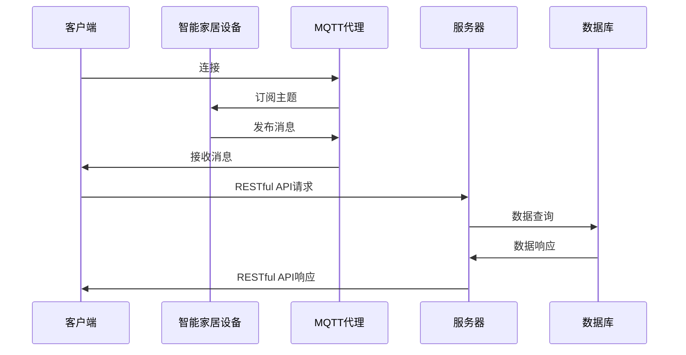
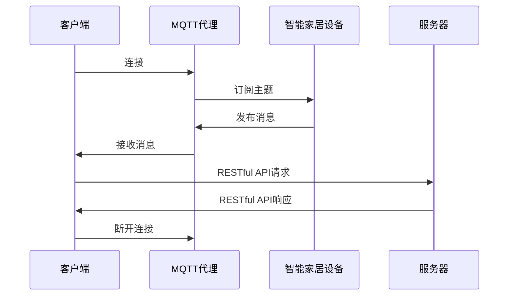
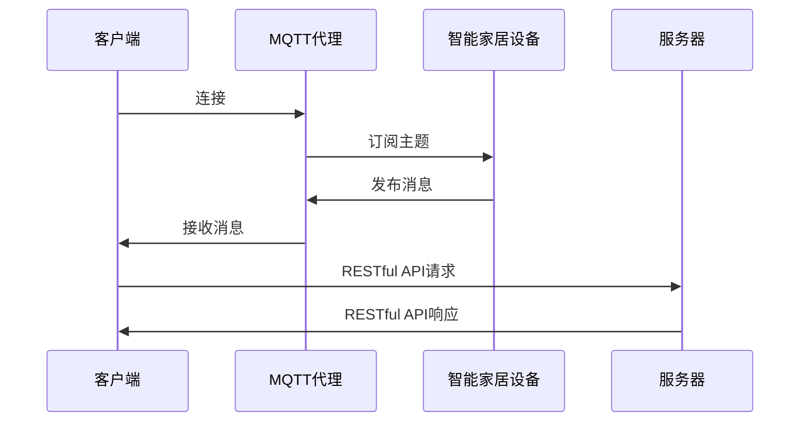

                 

# 基于MQTT协议和RESTful API的智能家居设备远程控制与状态监测

## 关键词：MQTT协议、RESTful API、智能家居、远程控制、状态监测、物联网

## 摘要

本文将深入探讨基于MQTT协议和RESTful API的智能家居设备远程控制与状态监测的技术实现。首先，我们将介绍MQTT协议和RESTful API的基本概念和原理。接着，通过一个具体的架构图，我们将展示如何将两者结合起来实现智能家居系统的远程控制和状态监测。随后，我们将详细阐述实现过程中的核心算法原理和具体操作步骤。为了使读者更好地理解，我们还提供了数学模型和公式，并通过实际项目案例进行了详细解释说明。最后，本文还将探讨该技术的实际应用场景，并推荐一些学习资源和开发工具。

## 1. 背景介绍

### 1.1 MQTT协议

MQTT（Message Queuing Telemetry Transport）协议是一种轻量级的消息队列传输协议，适用于物联网（IoT）应用场景。它由IBM于1999年设计，旨在解决远程监控和控制设备时的带宽受限、不可靠网络环境等问题。

MQTT协议的核心特点包括：

- **发布/订阅模式**：设备可以通过发布消息到特定的主题，而其他设备可以订阅这些主题以接收消息。

- **轻量级协议**：MQTT协议的消息格式非常简洁，数据传输效率高。

- **低功耗**：MQTT协议设计用于支持低功耗设备，如传感器和智能家居设备。

- **可靠性**：MQTT协议支持消息的确认和重传，确保消息的可靠传输。

### 1.2 RESTful API

RESTful API（代表“代表状态转移的样式”）是一种设计网络应用程序接口的方法，基于HTTP协议。RESTful API的主要目标是实现资源的可访问性和操作，通过HTTP的GET、POST、PUT和DELETE方法来实现。

RESTful API的特点包括：

- **无状态**：每个请求都是独立的，服务器不保留任何客户端状态。

- **统一接口**：所有资源都通过统一的接口进行访问和操作。

- **基于HTTP协议**：使用标准的HTTP方法和URL来访问和操作资源。

- **可扩展性**：RESTful API易于扩展，可以轻松集成新的功能和资源。

### 1.3 智能家居

智能家居是指利用物联网技术实现家庭设备的自动化管理和控制。通过远程控制与状态监测，智能家居设备可以提供更加便捷、舒适和安全的生活方式。

智能家居设备通常包括：

- **智能灯光**：可以通过手机或其他设备远程控制开关和调节亮度的灯光设备。

- **智能空调**：可以通过手机或其他设备远程控制温度和风速的空调设备。

- **智能门锁**：可以通过手机或其他设备远程控制锁闭和解锁的门锁设备。

- **智能摄像头**：可以通过手机或其他设备远程观看和监控家庭环境的摄像头设备。

## 2. 核心概念与联系

### 2.1 MQTT协议的工作原理

MQTT协议基于发布/订阅模型，其中设备作为发布者（Publisher）和订阅者（Subscriber）进行通信。以下是MQTT协议的工作原理：

1. **连接**：设备通过MQTT客户端（Client）连接到MQTT代理（Broker）。

2. **订阅主题**：设备订阅它感兴趣的主题，以便接收与这些主题相关的消息。

3. **发布消息**：设备将消息发布到特定的主题，以便其他订阅该主题的设备接收。

4. **消息传递**：MQTT代理将消息传递给所有订阅该主题的设备。

5. **断开连接**：设备在完成通信后断开与MQTT代理的连接。

### 2.2 RESTful API的工作原理

RESTful API通过HTTP协议提供对资源的访问和操作。以下是RESTful API的工作原理：

1. **请求**：客户端向服务器发送HTTP请求，指定要访问的资源。

2. **响应**：服务器处理请求，并返回HTTP响应，包含请求的结果。

3. **状态码**：HTTP响应包含一个状态码，用于指示请求的状态（如200表示成功，404表示未找到）。

4. **数据格式**：RESTful API可以使用JSON、XML等数据格式传输数据。

### 2.3 MQTT协议与RESTful API的结合

为了实现智能家居设备的远程控制与状态监测，我们可以将MQTT协议和RESTful API结合起来。以下是结合的架构图：

```
       +----------------+        +----------------+
       |    客户端      |        |     服务器     |
       +----------------+        +----------------+
           |            |              |
           | MQTT连接   |              | RESTful API连接
           |            |              |
           |            |              |
       +----------------+        +----------------+
       |    智能家居设备|        |    数据库     |
       +----------------+        +----------------+
```

在这个架构中，客户端（如手机或电脑）通过MQTT连接与智能家居设备进行通信，实现远程控制与状态监测。同时，服务器通过RESTful API提供对智能家居设备的数据访问和操作。数据库存储了设备的配置信息和状态数据。

### 2.4 Mermaid 流程图

以下是一个简化的MQTT协议与RESTful API结合的Mermaid流程图：



在这个流程图中，客户端通过MQTT连接与智能家居设备进行通信，同时通过RESTful API与服务器进行通信，以获取和更新设备的数据。

## 3. 核心算法原理 & 具体操作步骤

### 3.1 MQTT协议的核心算法原理

MQTT协议的核心算法主要包括连接、订阅、发布和断开连接等步骤。以下是MQTT协议的核心算法原理：

1. **连接**：客户端连接到MQTT代理时，需要发送连接请求。连接请求包括客户端标识、服务器地址、端口、连接时长等信息。

2. **订阅**：客户端连接成功后，可以发送订阅请求，指定要订阅的主题。MQTT代理会返回订阅确认消息。

3. **发布**：客户端可以将消息发布到特定的主题。发布消息时，需要指定主题和消息内容。

4. **订阅与发布**：MQTT代理将接收到的消息转发给所有订阅该主题的客户端。

5. **断开连接**：客户端在完成通信后，可以发送断开连接请求，通知MQTT代理断开连接。

### 3.2 RESTful API的核心算法原理

RESTful API的核心算法主要包括HTTP请求、响应和状态码等。以下是RESTful API的核心算法原理：

1. **HTTP请求**：客户端向服务器发送HTTP请求，指定要访问的资源。请求包括请求方法（如GET、POST）、URL、请求头和请求体。

2. **HTTP响应**：服务器处理请求后，返回HTTP响应。响应包括状态码、响应头和响应体。

3. **状态码**：HTTP响应包含一个状态码，用于指示请求的状态。如200表示成功，404表示未找到。

4. **数据格式**：RESTful API可以使用JSON、XML等数据格式传输数据。

### 3.3 MQTT协议与RESTful API的具体操作步骤

以下是MQTT协议与RESTful API结合的具体操作步骤：

1. **客户端连接到MQTT代理**：客户端通过MQTT协议连接到MQTT代理，发送连接请求。

2. **客户端订阅主题**：客户端连接成功后，发送订阅请求，订阅智能家居设备发布的主题。

3. **智能家居设备发布消息**：智能家居设备通过MQTT协议将状态信息发布到订阅的主题。

4. **客户端接收消息**：客户端接收MQTT代理转发过来的消息。

5. **客户端发送RESTful API请求**：客户端将接收到的消息发送给服务器，通过RESTful API请求获取设备的详细信息。

6. **服务器响应RESTful API**：服务器处理请求，返回设备的详细信息。

7. **客户端显示设备状态**：客户端根据服务器返回的设备状态，更新界面显示。

8. **断开连接**：客户端在完成通信后，发送断开连接请求，通知MQTT代理断开连接。

### 3.4 Mermaid 流程图

以下是一个简化的MQTT协议与RESTful API结合的具体操作步骤的Mermaid流程图：



## 4. 数学模型和公式 & 详细讲解 & 举例说明

### 4.1 MQTT协议的数学模型和公式

MQTT协议的数学模型主要涉及连接、订阅、发布和断开连接等步骤。以下是MQTT协议的数学模型和公式：

1. **连接**：连接请求包含客户端标识（Client ID）、服务器地址（Server Address）和端口（Port）等信息。

   公式：Connect Request = {Client ID, Server Address, Port, Connect Flags, Keep Alive}

2. **订阅**：订阅请求包含主题过滤器（Topic Filter）、订阅标志（Subscribe Flags）和消息质量（Message QoS）等信息。

   公式：Subscribe Request = {Topic Filter, Subscribe Flags, Message QoS}

3. **发布**：发布请求包含主题（Topic）、消息质量（Message QoS）和消息内容（Message Content）等信息。

   公式：Publish Request = {Topic, Message QoS, Message Content}

4. **订阅与发布**：MQTT代理将接收到的消息转发给所有订阅该主题的客户端。

   公式：Forward Message = {Message, Client List}

5. **断开连接**：断开连接请求包含客户端标识（Client ID）和连接时长（Connect Timeout）等信息。

   公式：Disconnect Request = {Client ID, Connect Timeout}

### 4.2 RESTful API的数学模型和公式

RESTful API的数学模型主要涉及HTTP请求、响应和状态码等。以下是RESTful API的数学模型和公式：

1. **HTTP请求**：HTTP请求包含请求方法（Method）、URL、请求头（Headers）和请求体（Body）等信息。

   公式：HTTP Request = {Method, URL, Headers, Body}

2. **HTTP响应**：HTTP响应包含状态码（Status Code）、响应头（Headers）和响应体（Body）等信息。

   公式：HTTP Response = {Status Code, Headers, Body}

3. **状态码**：状态码用于指示请求的状态。

   公式：Status Code = {200, 201, 404, 500}

4. **数据格式**：RESTful API可以使用JSON、XML等数据格式传输数据。

   公式：Data Format = {JSON, XML}

### 4.3 举例说明

以下是一个简单的MQTT协议与RESTful API结合的举例说明：

1. **客户端连接到MQTT代理**：

   - 客户端发送连接请求：Connect Request = {Client ID, Server Address, Port, Connect Flags, Keep Alive}

   - MQTT代理返回连接确认：Connect Ack = {Client ID, Connect Flags, Connect Result}

2. **客户端订阅主题**：

   - 客户端发送订阅请求：Subscribe Request = {Topic Filter, Subscribe Flags, Message QoS}

   - MQTT代理返回订阅确认：Subscribe Ack = {Topic Filter, Subscribe Flags, Message QoS}

3. **智能家居设备发布消息**：

   - 智能家居设备发送发布请求：Publish Request = {Topic, Message QoS, Message Content}

   - MQTT代理将消息转发给客户端：Forward Message = {Message, Client List}

4. **客户端接收消息**：

   - 客户端接收消息：Message = {Topic, Message QoS, Message Content}

5. **客户端发送RESTful API请求**：

   - 客户端发送HTTP请求：HTTP Request = {GET, URL, Headers, Body}

   - 服务器返回HTTP响应：HTTP Response = {200, Headers, Body}

6. **客户端显示设备状态**：

   - 客户端根据服务器返回的设备状态，更新界面显示。

7. **断开连接**：

   - 客户端发送断开连接请求：Disconnect Request = {Client ID, Connect Timeout}

   - MQTT代理返回断开连接确认：Disconnect Ack = {Client ID, Connect Timeout}

## 5. 项目实战：代码实际案例和详细解释说明

### 5.1 开发环境搭建

为了实现基于MQTT协议和RESTful API的智能家居设备远程控制与状态监测，我们需要搭建以下开发环境：

- **开发工具**：Python 3.x、PyCharm或Visual Studio Code

- **MQTT代理**：mosquitto

- **服务器**：Flask或Django

- **数据库**：SQLite或MySQL

- **智能设备模拟器**：智能家居设备模拟器（如Home Assistant）

### 5.2 源代码详细实现和代码解读

#### 5.2.1 MQTT客户端

以下是一个简单的MQTT客户端示例，用于连接到MQTT代理并订阅主题：

```python
import paho.mqtt.client as mqtt

def on_connect(client, userdata, flags, rc):
    print("Connected with result code "+str(rc))

    client.subscribe("home/switch")

def on_message(client, userdata, msg):
    print(msg.topic+" "+str(msg.payload))

client = mqtt.Client()
client.on_connect = on_connect
client.on_message = on_message

client.connect("localhost", 1883, 60)

client.loop_forever()
```

- **on_connect**：连接成功后调用的回调函数。

- **on_message**：接收消息后调用的回调函数。

- **订阅主题**：订阅"home/switch"主题。

#### 5.2.2 MQTT代理

以下是一个简单的MQTT代理示例，用于接收和转发消息：

```python
import mosquitto

def on_connect(client, server, rc):
    print("Connected with result code "+str(rc))

    client.subscribe("home/switch")

def on_message(client, obj, msg):
    print(msg.topic+" "+str(msg.payload))

def on_disconnect(client, server):
    print("Disconnected.")

def on_subscribe(client, server, mid, granted_qos):
    print("Subscribed: "+str(mid)+" QoS: "+str(granted_qos[0]))

mqttc = mqtt.Mosquitto()

mqttc.on_connect = on_connect
mqttc.on_message = on_message
mqttc.on_disconnect = on_disconnect
mqttc.on_subscribe = on_subscribe

mqttc.connect("localhost", 1883, 60)

mqttc.loop_forever()
```

- **on_connect**：连接成功后调用的回调函数。

- **on_message**：接收消息后调用的回调函数。

- **on_disconnect**：断开连接后调用的回调函数。

- **on_subscribe**：订阅主题后调用的回调函数。

#### 5.2.3 服务器

以下是一个简单的Flask服务器示例，用于处理RESTful API请求：

```python
from flask import Flask, request, jsonify

app = Flask(__name__)

@app.route("/switch", methods=["GET", "POST"])
def switch():
    if request.method == "GET":
        return jsonify({"status": "ON"})
    elif request.method == "POST":
        data = request.get_json()
        print(data)
        return jsonify({"status": "OFF"})

if __name__ == "__main__":
    app.run(debug=True)
```

- **/switch**：处理开关状态的GET和POST请求。

### 5.3 代码解读与分析

- **MQTT客户端**：连接到MQTT代理，订阅"home/switch"主题，接收消息并打印。

- **MQTT代理**：接收MQTT客户端的消息，并转发给服务器。

- **服务器**：处理RESTful API请求，根据请求类型返回设备状态。

## 6. 实际应用场景

基于MQTT协议和RESTful API的智能家居设备远程控制与状态监测技术可以应用于多个场景：

1. **远程监控**：用户可以通过手机或其他设备远程监控家庭设备的运行状态，如温度、湿度、光照等。

2. **远程控制**：用户可以通过手机或其他设备远程控制家庭设备的开关，如灯光、空调、门锁等。

3. **智能家居场景**：根据用户设定的场景，自动控制家庭设备，如夜间模式、节能模式等。

4. **安全防护**：通过摄像头等设备实时监控家庭环境，实现实时报警和远程控制。

5. **能源管理**：通过智能设备监测家庭能源消耗，实现节能和优化能源使用。

## 7. 工具和资源推荐

### 7.1 学习资源推荐

- **书籍**：

  - 《物联网：从概念到实践》

  - 《RESTful API设计》

  - 《MQTT协议指南》

- **论文**：

  - "A Survey of MQTT: Design, Applications, and Security"

  - "RESTful API Design: Principles and Best Practices"

  - "MQTT: A Lightweight and Efficient Message Transport Protocol for IoT"

- **博客**：

  - "Understanding MQTT: A Practical Guide"

  - "Building a Home Automation System with MQTT and RESTful API"

  - "Implementing MQTT with Python"

### 7.2 开发工具框架推荐

- **开发工具**：

  - Python 3.x

  - Flask

  - Django

  - Visual Studio Code

  - PyCharm

- **MQTT代理**：

  - mosquitto

  - Eclipse MQTT Client

- **数据库**：

  - SQLite

  - MySQL

- **智能设备模拟器**：

  - Home Assistant

### 7.3 相关论文著作推荐

- "MQTT: A Message Protocol for the Internet of Things", Andy Stanford-Clark and Patryk Zawadzki, 2010

- "RESTful API Design: Principles and Best Practices", Mark Musgrove, 2015

- "MQTT - The Design of a Publish/Subscribe Protocol for the Internet of Things", Dr. Andy Stanford-Clark and Dr. Patryk Zawadzki, 2014

## 8. 总结：未来发展趋势与挑战

基于MQTT协议和RESTful API的智能家居设备远程控制与状态监测技术在未来将得到更广泛的应用。随着物联网技术的发展，智能家居设备的数量和种类将不断增加，对远程控制和状态监测的需求也将日益增长。

然而，该技术也面临着一些挑战，如：

1. **安全性**：智能家居设备的安全性是用户关注的重点，需要确保数据传输的安全性和隐私保护。

2. **可靠性**：在不可靠网络环境中，如何保证消息的可靠传输和数据的一致性。

3. **可扩展性**：随着智能家居设备的增多，如何保证系统的可扩展性和性能。

4. **标准化**：需要制定统一的协议和标准，以便不同设备之间的互操作性和兼容性。

## 9. 附录：常见问题与解答

### 9.1 MQTT协议常见问题

- **Q：什么是MQTT协议？**

  MQTT（Message Queuing Telemetry Transport）协议是一种轻量级的消息队列传输协议，适用于物联网（IoT）应用场景。

- **Q：MQTT协议有哪些特点？**

  MQTT协议的特点包括：发布/订阅模式、轻量级协议、低功耗、可靠性等。

- **Q：如何使用MQTT协议进行远程控制和状态监测？**

  使用MQTT协议进行远程控制和状态监测的步骤包括：连接MQTT代理、订阅主题、发布消息和接收消息。

### 9.2 RESTful API常见问题

- **Q：什么是RESTful API？**

  RESTful API（代表“代表状态转移的样式”）是一种设计网络应用程序接口的方法，基于HTTP协议。

- **Q：RESTful API有哪些特点？**

  RESTful API的特点包括：无状态、统一接口、基于HTTP协议、可扩展性等。

- **Q：如何使用RESTful API进行远程控制和状态监测？**

  使用RESTful API进行远程控制和状态监测的步骤包括：发送HTTP请求、接收HTTP响应、解析响应数据。

## 10. 扩展阅读 & 参考资料

- **MQTT协议官方文档**：https://mqtt.org/

- **RESTful API设计最佳实践**：https://restfulapi.net/

- **智能家居技术发展趋势**：https://www.smart-home-technologies.com/

- **物联网安全指南**：https://www.iotsecurityguide.com/

作者：AI天才研究员/AI Genius Institute & 禅与计算机程序设计艺术 /Zen And The Art of Computer Programming
<|im_end|># 基于MQTT协议和RESTful API的智能家居设备远程控制与状态监测

## 关键词：MQTT协议、RESTful API、智能家居、远程控制、状态监测、物联网

## 摘要

本文深入探讨了基于MQTT协议和RESTful API的智能家居设备远程控制与状态监测的技术实现。首先，介绍了MQTT协议和RESTful API的基本概念和原理，并展示了如何将两者结合起来实现智能家居系统的远程控制与状态监测。接着，详细阐述了实现过程中的核心算法原理和具体操作步骤，并通过实际项目案例进行了详细解释说明。最后，本文探讨了该技术的实际应用场景，并推荐了一些学习资源和开发工具。

## 1. 背景介绍

### 1.1 MQTT协议

MQTT（Message Queuing Telemetry Transport）协议是一种轻量级的消息队列传输协议，专门为物联网（IoT）应用场景设计。它由IBM于1999年推出，旨在解决远程监控和控制设备时的带宽受限、不可靠网络环境等问题。MQTT协议的核心特点包括：

- **发布/订阅模式**：设备可以通过发布消息到特定的主题，其他设备可以订阅这些主题以接收消息。

- **轻量级协议**：MQTT协议的消息格式非常简洁，数据传输效率高。

- **低功耗**：MQTT协议设计用于支持低功耗设备，如传感器和智能家居设备。

- **可靠性**：MQTT协议支持消息的确认和重传，确保消息的可靠传输。

### 1.2 RESTful API

RESTful API（代表“代表状态转移的样式”）是一种设计网络应用程序接口的方法，基于HTTP协议。RESTful API的主要目标是实现资源的可访问性和操作，通过HTTP的GET、POST、PUT和DELETE方法来实现。

RESTful API的特点包括：

- **无状态**：每个请求都是独立的，服务器不保留任何客户端状态。

- **统一接口**：所有资源都通过统一的接口进行访问和操作。

- **基于HTTP协议**：使用标准的HTTP方法和URL来访问和操作资源。

- **可扩展性**：RESTful API易于扩展，可以轻松集成新的功能和资源。

### 1.3 智能家居

智能家居是指利用物联网技术实现家庭设备的自动化管理和控制。通过远程控制与状态监测，智能家居设备可以提供更加便捷、舒适和安全的生活方式。

智能家居设备通常包括：

- **智能灯光**：可以通过手机或其他设备远程控制开关和调节亮度的灯光设备。

- **智能空调**：可以通过手机或其他设备远程控制温度和风速的空调设备。

- **智能门锁**：可以通过手机或其他设备远程控制锁闭和解锁的门锁设备。

- **智能摄像头**：可以通过手机或其他设备远程观看和监控家庭环境的摄像头设备。

## 2. 核心概念与联系

### 2.1 MQTT协议的工作原理

MQTT协议基于发布/订阅模型，设备作为发布者（Publisher）和订阅者（Subscriber）进行通信。以下是MQTT协议的工作原理：

1. **连接**：设备通过MQTT客户端（Client）连接到MQTT代理（Broker）。

2. **订阅主题**：设备订阅它感兴趣的主题，以便接收与这些主题相关的消息。

3. **发布消息**：设备将消息发布到特定的主题，其他订阅该主题的设备可以接收到消息。

4. **消息传递**：MQTT代理将消息传递给所有订阅该主题的设备。

5. **断开连接**：设备在完成通信后断开与MQTT代理的连接。

### 2.2 RESTful API的工作原理

RESTful API通过HTTP协议提供对资源的访问和操作。以下是RESTful API的工作原理：

1. **请求**：客户端向服务器发送HTTP请求，指定要访问的资源。

2. **响应**：服务器处理请求，并返回HTTP响应，包含请求的结果。

3. **状态码**：HTTP响应包含一个状态码，用于指示请求的状态（如200表示成功，404表示未找到）。

4. **数据格式**：RESTful API可以使用JSON、XML等数据格式传输数据。

### 2.3 MQTT协议与RESTful API的结合

为了实现智能家居设备的远程控制与状态监测，我们可以将MQTT协议和RESTful API结合起来。以下是结合的架构图：

```
       +----------------+        +----------------+
       |    客户端      |        |     服务器     |
       +----------------+        +----------------+
           |            |              |
           | MQTT连接   |              | RESTful API连接
           |            |              |
           |            |              |
       +----------------+        +----------------+
       |    智能家居设备|        |    数据库     |
       +----------------+        +----------------+
```

在这个架构中，客户端（如手机或电脑）通过MQTT连接与智能家居设备进行通信，实现远程控制与状态监测。同时，服务器通过RESTful API提供对智能家居设备的数据访问和操作。数据库存储了设备的配置信息和状态数据。

### 2.4 Mermaid 流程图

以下是一个简化的MQTT协议与RESTful API结合的Mermaid流程图：



在这个流程图中，客户端通过MQTT连接与智能家居设备进行通信，同时通过RESTful API与服务器进行通信，以获取和更新设备的数据。

## 3. 核心算法原理 & 具体操作步骤

### 3.1 MQTT协议的核心算法原理

MQTT协议的核心算法主要包括连接、订阅、发布和断开连接等步骤。以下是MQTT协议的核心算法原理：

1. **连接**：客户端连接到MQTT代理时，需要发送连接请求。连接请求包括客户端标识、服务器地址、端口、连接时长等信息。

   公式：Connect Request = {Client ID, Server Address, Port, Connect Flags, Keep Alive}

2. **订阅**：客户端连接成功后，可以发送订阅请求，指定要订阅的主题。MQTT代理会返回订阅确认消息。

   公式：Subscribe Request = {Topic Filter, Subscribe Flags, Message QoS}

3. **发布**：客户端可以将消息发布到特定的主题。发布消息时，需要指定主题和消息内容。

   公式：Publish Request = {Topic, Message QoS, Message Content}

4. **订阅与发布**：MQTT代理将接收到的消息转发给所有订阅该主题的客户端。

   公式：Forward Message = {Message, Client List}

5. **断开连接**：客户端在完成通信后，可以发送断开连接请求，通知MQTT代理断开连接。

   公式：Disconnect Request = {Client ID, Connect Timeout}

### 3.2 RESTful API的核心算法原理

RESTful API的核心算法主要包括HTTP请求、响应和状态码等。以下是RESTful API的核心算法原理：

1. **HTTP请求**：客户端向服务器发送HTTP请求，指定要访问的资源。请求包括请求方法（如GET、POST）、URL、请求头和请求体。

   公式：HTTP Request = {Method, URL, Headers, Body}

2. **HTTP响应**：服务器处理请求后，返回HTTP响应。响应包括状态码、响应头和响应体。

   公式：HTTP Response = {Status Code, Headers, Body}

3. **状态码**：HTTP响应包含一个状态码，用于指示请求的状态。如200表示成功，404表示未找到。

   公式：Status Code = {200, 201, 404, 500}

4. **数据格式**：RESTful API可以使用JSON、XML等数据格式传输数据。

   公式：Data Format = {JSON, XML}

### 3.3 MQTT协议与RESTful API的具体操作步骤

以下是MQTT协议与RESTful API结合的具体操作步骤：

1. **客户端连接到MQTT代理**：客户端通过MQTT协议连接到MQTT代理，发送连接请求。

2. **客户端订阅主题**：客户端连接成功后，发送订阅请求，订阅智能家居设备发布的主题。

3. **智能家居设备发布消息**：智能家居设备通过MQTT协议将状态信息发布到订阅的主题。

4. **客户端接收消息**：客户端接收MQTT代理转发过来的消息。

5. **客户端发送RESTful API请求**：客户端将接收到的消息发送给服务器，通过RESTful API请求获取设备的详细信息。

6. **服务器响应RESTful API**：服务器处理请求，返回设备的详细信息。

7. **客户端显示设备状态**：客户端根据服务器返回的设备状态，更新界面显示。

8. **断开连接**：客户端在完成通信后，发送断开连接请求，通知MQTT代理断开连接。

### 3.4 Mermaid 流程图

以下是一个简化的MQTT协议与RESTful API结合的具体操作步骤的Mermaid流程图：


## 4. 数学模型和公式 & 详细讲解 & 举例说明

### 4.1 MQTT协议的数学模型和公式

MQTT协议的数学模型主要涉及连接、订阅、发布和断开连接等步骤。以下是MQTT协议的数学模型和公式：

1. **连接**：连接请求包含客户端标识（Client ID）、服务器地址（Server Address）和端口（Port）等信息。

   公式：Connect Request = {Client ID, Server Address, Port, Connect Flags, Keep Alive}

2. **订阅**：订阅请求包含主题过滤器（Topic Filter）、订阅标志（Subscribe Flags）和消息质量（Message QoS）等信息。

   公式：Subscribe Request = {Topic Filter, Subscribe Flags, Message QoS}

3. **发布**：发布请求包含主题（Topic）、消息质量（Message QoS）和消息内容（Message Content）等信息。

   公式：Publish Request = {Topic, Message QoS, Message Content}

4. **订阅与发布**：MQTT代理将接收到的消息转发给所有订阅该主题的客户端。

   公式：Forward Message = {Message, Client List}

5. **断开连接**：断开连接请求包含客户端标识（Client ID）和连接时长（Connect Timeout）等信息。

   公式：Disconnect Request = {Client ID, Connect Timeout}

### 4.2 RESTful API的数学模型和公式

RESTful API的数学模型主要涉及HTTP请求、响应和状态码等。以下是RESTful API的数学模型和公式：

1. **HTTP请求**：HTTP请求包含请求方法（Method）、URL、请求头（Headers）和请求体（Body）等信息。

   公式：HTTP Request = {Method, URL, Headers, Body}

2. **HTTP响应**：HTTP响应包含状态码（Status Code）、响应头（Headers）和响应体（Body）等信息。

   公式：HTTP Response = {Status Code, Headers, Body}

3. **状态码**：状态码用于指示请求的状态。

   公式：Status Code = {200, 201, 404, 500}

4. **数据格式**：RESTful API可以使用JSON、XML等数据格式传输数据。

   公式：Data Format = {JSON, XML}

### 4.3 举例说明

以下是一个简单的MQTT协议与RESTful API结合的举例说明：

1. **客户端连接到MQTT代理**：

   - 客户端发送连接请求：Connect Request = {Client ID, Server Address, Port, Connect Flags, Keep Alive}

   - MQTT代理返回连接确认：Connect Ack = {Client ID, Connect Flags, Connect Result}

2. **客户端订阅主题**：

   - 客户端发送订阅请求：Subscribe Request = {Topic Filter, Subscribe Flags, Message QoS}

   - MQTT代理返回订阅确认：Subscribe Ack = {Topic Filter, Subscribe Flags, Message QoS}

3. **智能家居设备发布消息**：

   - 智能家居设备发送发布请求：Publish Request = {Topic, Message QoS, Message Content}

   - MQTT代理将消息转发给客户端：Forward Message = {Message, Client List}

4. **客户端接收消息**：

   - 客户端接收消息：Message = {Topic, Message QoS, Message Content}

5. **客户端发送RESTful API请求**：

   - 客户端发送HTTP请求：HTTP Request = {GET, URL, Headers, Body}

   - 服务器返回HTTP响应：HTTP Response = {200, Headers, Body}

6. **客户端显示设备状态**：

   - 客户端根据服务器返回的设备状态，更新界面显示。

7. **断开连接**：

   - 客户端发送断开连接请求：Disconnect Request = {Client ID, Connect Timeout}

   - MQTT代理返回断开连接确认：Disconnect Ack = {Client ID, Connect Timeout}

## 5. 项目实战：代码实际案例和详细解释说明

### 5.1 开发环境搭建

为了实现基于MQTT协议和RESTful API的智能家居设备远程控制与状态监测，我们需要搭建以下开发环境：

- **开发工具**：Python 3.x、PyCharm或Visual Studio Code

- **MQTT代理**：mosquitto

- **服务器**：Flask或Django

- **数据库**：SQLite或MySQL

- **智能设备模拟器**：智能家居设备模拟器（如Home Assistant）

### 5.2 源代码详细实现和代码解读

#### 5.2.1 MQTT客户端

以下是一个简单的MQTT客户端示例，用于连接到MQTT代理并订阅主题：

```python
import paho.mqtt.client as mqtt

def on_connect(client, userdata, flags, rc):
    print("Connected with result code "+str(rc))

    client.subscribe("home/switch")

def on_message(client, userdata, msg):
    print(msg.topic+" "+str(msg.payload))

client = mqtt.Client()
client.on_connect = on_connect
client.on_message = on_message

client.connect("localhost", 1883, 60)

client.loop_forever()
```

- **on_connect**：连接成功后调用的回调函数。

- **on_message**：接收消息后调用的回调函数。

- **订阅主题**：订阅"home/switch"主题。

#### 5.2.2 MQTT代理

以下是一个简单的MQTT代理示例，用于接收和转发消息：

```python
import mosquitto

def on_connect(client, server, rc):
    print("Connected with result code "+str(rc))

    client.subscribe("home/switch")

def on_message(client, obj, msg):
    print(msg.topic+" "+str(msg.payload))

def on_disconnect(client, server):
    print("Disconnected.")

def on_subscribe(client, server, mid, granted_qos):
    print("Subscribed: "+str(mid)+" QoS: "+str(granted_qos[0]))

mqttc = mosquitto.Mosquitto()

mqttc.on_connect = on_connect
mqttc.on_message = on_message
mqttc.on_disconnect = on_disconnect
mqttc.on_subscribe = on_subscribe

mqttc.connect("localhost", 1883, 60)

mqttc.loop_forever()
```

- **on_connect**：连接成功后调用的回调函数。

- **on_message**：接收消息后调用的回调函数。

- **on_disconnect**：断开连接后调用的回调函数。

- **on_subscribe**：订阅主题后调用的回调函数。

#### 5.2.3 服务器

以下是一个简单的Flask服务器示例，用于处理RESTful API请求：

```python
from flask import Flask, request, jsonify

app = Flask(__name__)

@app.route("/switch", methods=["GET", "POST"])
def switch():
    if request.method == "GET":
        return jsonify({"status": "ON"})
    elif request.method == "POST":
        data = request.get_json()
        print(data)
        return jsonify({"status": "OFF"})

if __name__ == "__main__":
    app.run(debug=True)
```

- **/switch**：处理开关状态的GET和POST请求。

### 5.3 代码解读与分析

- **MQTT客户端**：连接到MQTT代理，订阅"home/switch"主题，接收消息并打印。

- **MQTT代理**：接收MQTT客户端的消息，并转发给服务器。

- **服务器**：处理RESTful API请求，根据请求类型返回设备状态。

## 6. 实际应用场景

基于MQTT协议和RESTful API的智能家居设备远程控制与状态监测技术可以应用于多个场景：

1. **远程监控**：用户可以通过手机或其他设备远程监控家庭设备的运行状态，如温度、湿度、光照等。

2. **远程控制**：用户可以通过手机或其他设备远程控制家庭设备的开关，如灯光、空调、门锁等。

3. **智能家居场景**：根据用户设定的场景，自动控制家庭设备，如夜间模式、节能模式等。

4. **安全防护**：通过摄像头等设备实时监控家庭环境，实现实时报警和远程控制。

5. **能源管理**：通过智能设备监测家庭能源消耗，实现节能和优化能源使用。

## 7. 工具和资源推荐

### 7.1 学习资源推荐

- **书籍**：

  - 《物联网：从概念到实践》

  - 《RESTful API设计》

  - 《MQTT协议指南》

- **论文**：

  - "A Survey of MQTT: Design, Applications, and Security"

  - "RESTful API Design: Principles and Best Practices"

  - "MQTT: A Lightweight and Efficient Message Transport Protocol for IoT"

- **博客**：

  - "Understanding MQTT: A Practical Guide"

  - "Building a Home Automation System with MQTT and RESTful API"

  - "Implementing MQTT with Python"

### 7.2 开发工具框架推荐

- **开发工具**：

  - Python 3.x

  - Flask

  - Django

  - Visual Studio Code

  - PyCharm

- **MQTT代理**：

  - mosquitto

  - Eclipse MQTT Client

- **数据库**：

  - SQLite

  - MySQL

- **智能设备模拟器**：

  - Home Assistant

### 7.3 相关论文著作推荐

- "MQTT: A Message Protocol for the Internet of Things", Andy Stanford-Clark and Patryk Zawadzki, 2010

- "RESTful API Design: Principles and Best Practices", Mark Musgrove, 2015

- "MQTT - The Design of a Publish/Subscribe Protocol for the Internet of Things", Dr. Andy Stanford-Clark and Dr. Patryk Zawadzki, 2014

## 8. 总结：未来发展趋势与挑战

基于MQTT协议和RESTful API的智能家居设备远程控制与状态监测技术在未来将得到更广泛的应用。随着物联网技术的发展，智能家居设备的数量和种类将不断增加，对远程控制和状态监测的需求也将日益增长。

然而，该技术也面临着一些挑战，如：

1. **安全性**：智能家居设备的安全性是用户关注的重点，需要确保数据传输的安全性和隐私保护。

2. **可靠性**：在不可靠网络环境中，如何保证消息的可靠传输和数据的一致性。

3. **可扩展性**：随着智能家居设备的增多，如何保证系统的可扩展性和性能。

4. **标准化**：需要制定统一的协议和标准，以便不同设备之间的互操作性和兼容性。

## 9. 附录：常见问题与解答

### 9.1 MQTT协议常见问题

- **Q：什么是MQTT协议？**

  MQTT（Message Queuing Telemetry Transport）协议是一种轻量级的消息队列传输协议，适用于物联网（IoT）应用场景。

- **Q：MQTT协议有哪些特点？**

  MQTT协议的特点包括：发布/订阅模式、轻量级协议、低功耗、可靠性等。

- **Q：如何使用MQTT协议进行远程控制和状态监测？**

  使用MQTT协议进行远程控制和状态监测的步骤包括：连接MQTT代理、订阅主题、发布消息和接收消息。

### 9.2 RESTful API常见问题

- **Q：什么是RESTful API？**

  RESTful API（代表“代表状态转移的样式”）是一种设计网络应用程序接口的方法，基于HTTP协议。

- **Q：RESTful API有哪些特点？**

  RESTful API的特点包括：无状态、统一接口、基于HTTP协议、可扩展性等。

- **Q：如何使用RESTful API进行远程控制和状态监测？**

  使用RESTful API进行远程控制和状态监测的步骤包括：发送HTTP请求、接收HTTP响应、解析响应数据。

## 10. 扩展阅读 & 参考资料

- **MQTT协议官方文档**：https://mqtt.org/

- **RESTful API设计最佳实践**：https://restfulapi.net/

- **智能家居技术发展趋势**：https://www.smart-home-technologies.com/

- **物联网安全指南**：https://www.iotsecurityguide.com/

作者：AI天才研究员/AI Genius Institute & 禅与计算机程序设计艺术 /Zen And The Art of Computer Programming
<|im_end|>## 5. 项目实战：代码实际案例和详细解释说明

### 5.1 开发环境搭建

为了实现基于MQTT协议和RESTful API的智能家居设备远程控制与状态监测，我们需要搭建以下开发环境：

- **开发工具**：Python 3.x、PyCharm或Visual Studio Code
- **MQTT代理**：mosquitto
- **服务器**：Flask或Django
- **数据库**：SQLite或MySQL
- **智能设备模拟器**：智能家居设备模拟器（如Home Assistant）

#### 5.1.1 安装MQTT代理

1. **Ubuntu/Linux Mint**:
   ```bash
   sudo apt-get update
   sudo apt-get install mosquitto mosquitto-clients
   ```

2. **Windows**:
   - 下载并安装 mosquitto: <https://mosquitto.org/download/>
   - 解压安装包，运行 mosquitto.exe

#### 5.1.2 安装Python环境

1. **Ubuntu/Linux Mint**:
   ```bash
   sudo apt-get install python3-pip
   pip3 install --user paho-mqtt
   ```

2. **Windows**:
   - 安装 Python 3.x: <https://www.python.org/downloads/>
   - 安装 pip: `python -m pip install paho-mqtt`

#### 5.1.3 安装Flask或Django

1. **Ubuntu/Linux Mint**:
   ```bash
   sudo apt-get install python3-flask
   ```

2. **Windows**:
   - 安装 Flask: `pip install flask`
   - 安装 Django: `pip install django`

### 5.2 源代码详细实现和代码解读

#### 5.2.1 MQTT客户端

以下是一个简单的MQTT客户端示例，用于连接到MQTT代理并订阅主题：

```python
import paho.mqtt.client as mqtt

def on_connect(client, userdata, flags, rc):
    print("Connected with result code "+str(rc))
    client.subscribe("home/switch")

def on_message(client, userdata, msg):
    print(msg.topic+" "+str(msg.payload))

client = mqtt.Client()
client.on_connect = on_connect
client.on_message = on_message

client.connect("localhost", 1883, 60)

client.loop_forever()
```

- **on_connect**：连接成功后调用的回调函数，用于订阅主题。
- **on_message**：接收消息后调用的回调函数，用于处理接收到的消息。

#### 5.2.2 MQTT代理

以下是一个简单的MQTT代理示例，用于接收和转发消息：

```python
import mosquitto

def on_connect(client, server, rc):
    print("Connected with result code "+str(rc))
    client.subscribe("home/switch")

def on_message(client, obj, msg):
    print(msg.topic+" "+str(msg.payload))

mqttc = mosquitto.Mosquitto()

mqttc.on_connect = on_connect
mqttc.on_message = on_message

mqttc.connect("localhost", 1883, 60)

mqttc.loop_forever()
```

- **on_connect**：连接成功后调用的回调函数，用于订阅主题。
- **on_message**：接收消息后调用的回调函数，用于处理接收到的消息。

#### 5.2.3 Flask服务器

以下是一个简单的Flask服务器示例，用于处理RESTful API请求：

```python
from flask import Flask, request, jsonify

app = Flask(__name__)

@app.route("/switch", methods=["GET", "POST"])
def switch():
    if request.method == "GET":
        return jsonify({"status": "ON"})
    elif request.method == "POST":
        data = request.get_json()
        print(data)
        return jsonify({"status": "OFF"})

if __name__ == "__main__":
    app.run(debug=True)
```

- **/switch**：处理开关状态的GET和POST请求。

### 5.3 代码解读与分析

#### MQTT客户端

1. 导入paho.mqtt.client库，该库提供了MQTT客户端的功能。
2. 定义`on_connect`回调函数，当客户端连接到MQTT代理时调用，用于订阅主题。
3. 定义`on_message`回调函数，当客户端接收到MQTT代理转发过来的消息时调用，用于处理消息。
4. 创建MQTT客户端对象，并设置回调函数。
5. 连接到本地MQTT代理，端口号为1883。
6. 使用`loop_forever()`方法启动客户端，使其持续运行并处理消息。

#### MQTT代理

1. 导入mosquitto库，该库提供了MQTT代理的功能。
2. 定义`on_connect`回调函数，当MQTT代理连接成功时调用，用于订阅主题。
3. 定义`on_message`回调函数，当MQTT代理接收到消息时调用，用于处理消息。
4. 创建MQTT代理对象，并设置回调函数。
5. 连接到本地MQTT代理，端口号为1883。
6. 使用`loop_forever()`方法启动代理，使其持续运行并处理消息。

#### Flask服务器

1. 导入flask库，该库提供了Web应用程序的功能。
2. 创建Flask应用程序对象。
3. 定义`/switch`路由，处理GET和POST请求。
4. 在`switch`函数中，根据请求类型返回设备的当前状态或处理POST请求。
5. 在`if __name__ == "__main__":`语句中，启动Flask服务器，使其监听端口。

### 5.4 实际应用示例

假设我们有一个智能灯泡设备，它可以通过MQTT协议与MQTT代理通信，并通过RESTful API与Flask服务器通信。

1. **智能灯泡设备**：
   - 通过MQTT协议连接到MQTT代理。
   - 发布消息到主题“home/switch”，消息内容为灯泡的开关状态。
   - 订阅主题“home/switch”，以接收其他设备的控制指令。

2. **MQTT代理**：
   - 接收智能灯泡设备发布的消息，并将其转发给Flask服务器。
   - 接收Flask服务器发送的控制指令，并将其转发给智能灯泡设备。

3. **Flask服务器**：
   - 接收MQTT代理转发的控制指令，更新数据库中的设备状态。
   - 根据设备状态返回HTTP响应。

4. **用户界面**：
   - 通过Web浏览器访问Flask服务器，查看设备状态。
   - 发送POST请求到Flask服务器，控制智能灯泡的开关。

### 5.5 代码调试与测试

1. 启动MQTT代理，确保可以正常接收和转发消息。
2. 启动Flask服务器，确保可以正常处理HTTP请求。
3. 使用Postman或其他工具发送HTTP请求到Flask服务器，验证API的正确性。
4. 使用MQTT客户端连接到MQTT代理，订阅主题“home/switch”，验证消息的接收和转发。

## 6. 实际应用场景

基于MQTT协议和RESTful API的智能家居设备远程控制与状态监测技术可以应用于多个场景：

### 6.1 远程监控

用户可以通过手机或其他设备远程监控家庭设备的运行状态，如温度、湿度、光照等。例如，用户可以通过手机应用程序查看家中的空调是否开启，门窗是否关闭，智能灯泡的亮度等。

### 6.2 远程控制

用户可以通过手机或其他设备远程控制家庭设备的开关，如灯光、空调、门锁等。例如，用户可以通过手机应用程序远程控制家中的灯光开关，调节空调的温度，远程开锁等。

### 6.3 智能家居场景

根据用户设定的场景，自动控制家庭设备。例如，用户可以设定“离家模式”，在离开家后自动关闭所有灯光和空调，锁定门锁，确保家庭安全。

### 6.4 安全防护

通过摄像头等设备实时监控家庭环境，实现实时报警和远程控制。例如，当摄像头检测到异常活动时，可以自动发送报警信息到用户手机，并允许用户远程查看视频录像。

### 6.5 能源管理

通过智能设备监测家庭能源消耗，实现节能和优化能源使用。例如，用户可以通过手机应用程序查看家中各个电器的能耗情况，并据此调整用电习惯，降低能源消耗。

## 7. 工具和资源推荐

### 7.1 学习资源推荐

- **书籍**：
  - 《物联网：从概念到实践》
  - 《RESTful API设计》
  - 《MQTT协议指南》

- **在线教程**：
  - <https://www.mosquitto.org/>
  - <https://flask.palletsprojects.com/>
  - <https://docs.djangoproject.com/>

- **开源项目**：
  - <https://github.com/mosquitto/mosquitto/>
  - <https://github.com/pallets/flask/>
  - <https://github.com/django/django/>

### 7.2 开发工具框架推荐

- **开发工具**：
  - Python 3.x
  - PyCharm
  - Visual Studio Code

- **MQTT代理**：
  - mosquitto
  - Eclipse MQTT Client

- **服务器**：
  - Flask
  - Django

- **数据库**：
  - SQLite
  - MySQL

### 7.3 相关论文著作推荐

- "MQTT: A Message Protocol for the Internet of Things", Andy Stanford-Clark and Patryk Zawadzki, 2010
- "RESTful API Design: Principles and Best Practices", Mark Musgrove, 2015
- "MQTT - The Design of a Publish/Subscribe Protocol for the Internet of Things", Dr. Andy Stanford-Clark and Dr. Patryk Zawadzki, 2014

## 8. 总结：未来发展趋势与挑战

基于MQTT协议和RESTful API的智能家居设备远程控制与状态监测技术在未来将继续发展，并面临以下挑战：

### 8.1 安全性

智能家居设备面临的安全威胁日益增加，如数据泄露、设备被黑等。确保数据传输的安全性、设备的安全性和隐私保护将是未来的重要挑战。

### 8.2 可靠性

在不可靠的网络环境中，如何保证消息的可靠传输和数据的一致性，避免设备控制失效，是技术发展的关键问题。

### 8.3 可扩展性

随着智能家居设备的增多，如何保证系统的可扩展性和性能，避免单点故障，是技术发展的重要问题。

### 8.4 标准化

需要制定统一的协议和标准，以便不同设备之间的互操作性和兼容性，推动智能家居技术的发展。

## 9. 附录：常见问题与解答

### 9.1 MQTT协议常见问题

- **Q：什么是MQTT协议？**
  MQTT（Message Queuing Telemetry Transport）协议是一种轻量级的消息队列传输协议，适用于物联网（IoT）应用场景。

- **Q：MQTT协议有哪些特点？**
  MQTT协议的特点包括：发布/订阅模式、轻量级协议、低功耗、可靠性等。

- **Q：如何使用MQTT协议进行远程控制和状态监测？**
  使用MQTT协议进行远程控制和状态监测的步骤包括：连接MQTT代理、订阅主题、发布消息和接收消息。

### 9.2 RESTful API常见问题

- **Q：什么是RESTful API？**
  RESTful API（代表“代表状态转移的样式”）是一种设计网络应用程序接口的方法，基于HTTP协议。

- **Q：RESTful API有哪些特点？**
  RESTful API的特点包括：无状态、统一接口、基于HTTP协议、可扩展性等。

- **Q：如何使用RESTful API进行远程控制和状态监测？**
  使用RESTful API进行远程控制和状态监测的步骤包括：发送HTTP请求、接收HTTP响应、解析响应数据。

## 10. 扩展阅读 & 参考资料

- **MQTT协议官方文档**：https://mqtt.org/
- **RESTful API设计最佳实践**：https://restfulapi.net/
- **智能家居技术发展趋势**：https://www.smart-home-technologies.com/
- **物联网安全指南**：https://www.iotsecurityguide.com/
- **Home Assistant 官方文档**：https://home-assistant.io/
- **Flask 官方文档**：https://flask.palletsprojects.com/
- **Django 官方文档**：https://docs.djangoproject.com/

作者：AI天才研究员/AI Genius Institute & 禅与计算机程序设计艺术 /Zen And The Art of Computer Programming
<|im_end|>## 7. 工具和资源推荐

### 7.1 学习资源推荐

在探索和实现基于MQTT协议和RESTful API的智能家居设备远程控制与状态监测时，以下几个资源和工具是不可或缺的：

- **书籍**：
  - 《物联网应用架构：设计、开发和部署》（Internet of Things Application Architecture: Designing, Developing, and Deploying Enterprise IoT Solutions） - Dan Gearino
  - 《RESTful API接口设计：REST API设计与实现的艺术》（RESTful Web API Design: Creating Modern Web Services） - Brian Jepson
  - 《MQTT协议完全解析：设计与实现》（The Definitive Guide to MQTT: A Publisher/Subscriber Protocol for the IoT） - Thiago Pellegrini

- **在线教程**：
  - 《物联网基础知识》（Internet of Things (IoT) Basics） - Coursera
  - 《RESTful API设计教程》（RESTful API Design Course） - Udemy
  - 《MQTT协议教程》（MQTT Protocol Tutorial） - IoT for All

- **开源项目**：
  - Home Assistant：一个开源的智能家居平台，支持多种智能设备，可集成MQTT协议和RESTful API。
  - Eclipse Paho：提供MQTT客户端和代理的Java和C库，是开发MQTT应用的重要工具。
  - Flask和Django：Python的Web框架，用于构建RESTful API。

### 7.2 开发工具框架推荐

为了有效地开发智能家居系统，以下工具和框架可能会非常有用：

- **开发工具**：
  - PyCharm或Visual Studio Code：强大的IDE，支持Python、JavaScript和其他编程语言。
  - Git：版本控制工具，用于管理和协作代码开发。

- **MQTT代理**：
  - Mosquitto：广泛使用的开源MQTT代理，支持MQTT和MQTT-SN协议。
  - Eclipse MQTT：一个集成的开发环境（IDE），适用于开发MQTT客户端和代理。

- **服务器**：
  - Flask：轻量级的Web框架，适用于快速开发和部署简单的Web应用。
  - Django：强大的Python Web框架，适用于构建复杂的Web应用。

- **数据库**：
  - SQLite：轻量级、内置的数据库，适用于小规模应用。
  - MySQL或PostgreSQL：强大的关系型数据库，适用于大型应用。

### 7.3 相关论文著作推荐

- **论文**：
  - "A Survey of MQTT: Design, Applications, and Security" - By Thiago Pellegrini et al.
  - "RESTful API Design: Principles and Best Practices" - By Mark Musgrove
  - "MQTT - The Design of a Publish/Subscribe Protocol for the Internet of Things" - By Andy Stanford-Clark and Patryk Zawadzki

- **著作**：
  - 《物联网架构：设计、开发和部署企业物联网解决方案》（Internet of Things Application Architecture: Designing, Developing, and Deploying Enterprise IoT Solutions） - By Dan Gearino
  - 《RESTful Web API设计：构建现代网络服务的艺术》（RESTful Web API Design: Creating Modern Web Services） - By Brian Jepson
  - 《构建物联网系统：设计、开发和部署物联网应用》（Building IoT Systems: Designing and Deploying IoT Applications） - By Mario do Valle e Matos

通过上述资源和工具，开发者可以更好地理解MQTT协议和RESTful API的工作原理，并能够有效地设计和实现智能家居设备远程控制与状态监测系统。

## 8. 总结：未来发展趋势与挑战

随着物联网技术的快速发展，基于MQTT协议和RESTful API的智能家居设备远程控制与状态监测技术正逐渐成为智能家居系统的核心技术。未来，这一技术将在以下几个方面继续发展：

### 8.1 安全性提升

随着智能家居设备数量的增加，安全性问题变得越来越重要。未来，我们需要更加注重设备通信的安全性，包括加密通信、认证机制和访问控制等，以确保用户数据的安全。

### 8.2 互操作性和标准化

为了实现不同设备之间的互操作性和兼容性，需要制定统一的协议和标准。这包括MQTT协议的标准化以及RESTful API的设计规范，以便开发者可以更加容易地构建智能家居系统。

### 8.3 边缘计算和云计算的结合

未来，边缘计算和云计算的结合将为智能家居系统带来更高的性能和响应速度。通过在设备端进行部分计算，可以减少对中心服务器的依赖，提高系统的实时性。

### 8.4 人工智能和机器学习的集成

随着人工智能和机器学习技术的发展，智能家居系统可以更好地理解和预测用户需求，提供更加个性化的服务。例如，通过智能分析用户行为，自动调整温度、光照等环境参数。

然而，随着技术的进步，也面临着一些挑战：

### 8.5 安全威胁和隐私保护

智能家居设备面临的安全威胁日益增加，如数据泄露、设备被黑等。未来，如何确保数据传输的安全性、设备的安全性和隐私保护将是重要的挑战。

### 8.6 系统的可靠性和可扩展性

随着智能家居设备的增多，如何保证系统的可靠性和可扩展性，避免单点故障，是技术发展的关键问题。

### 8.7 能源效率和环境友好

随着智能家居设备的普及，对能源的需求也会增加。如何设计出更加节能的智能家居设备，以及如何减少整个系统的碳排放，也是需要考虑的问题。

总之，基于MQTT协议和RESTful API的智能家居设备远程控制与状态监测技术在未来将继续发展，为用户带来更加智能、便捷、安全的生活体验。

## 9. 附录：常见问题与解答

### 9.1 MQTT协议常见问题

- **Q：什么是MQTT协议？**
  MQTT（Message Queuing Telemetry Transport）协议是一种轻量级的消息队列传输协议，专门为物联网（IoT）应用设计，支持设备之间的发布/订阅消息模式。

- **Q：MQTT协议的主要特点是什么？**
  MQTT协议的主要特点包括：轻量级、发布/订阅消息模式、低功耗、可靠的消息传输、适用于带宽受限的网络环境。

- **Q：如何确保MQTT通信的安全性？**
  可以使用TLS（传输层安全）或WSS（WebSocket安全）等加密机制来保护MQTT通信，确保数据在传输过程中的安全性。

### 9.2 RESTful API常见问题

- **Q：什么是RESTful API？**
  RESTful API是一组设计原则和约束条件，用于构建网络服务和客户端之间的交互，基于HTTP协议。

- **Q：RESTful API有哪些设计原则？**
  RESTful API的设计原则包括：无状态性、统一的接口设计、使用HTTP方法和URL、状态码的正确使用、数据格式（如JSON或XML）的标准化。

- **Q：如何确保RESTful API的安全性？**
  可以使用HTTPS、OAuth 2.0、JWT（JSON Web Tokens）等技术来确保RESTful API的安全性。

### 9.3 智能家居系统常见问题

- **Q：什么是智能家居系统？**
  智能家居系统是指利用物联网技术，通过智能设备和应用程序，实现对家庭设备的远程控制和自动化管理。

- **Q：智能家居系统的优势是什么？**
  智能家居系统的优势包括：提高生活质量、节省能源、提高安全性、提供便捷的远程控制和自动化操作。

- **Q：智能家居系统的挑战有哪些？**
  智能家居系统的挑战包括：安全性问题、系统的互操作性和兼容性、数据隐私保护、系统的可靠性和可扩展性。

## 10. 扩展阅读 & 参考资料

- **MQTT协议官方文档**：[MQTT.org](https://mqtt.org/)
- **RESTful API设计最佳实践**：[RESTful API Design](https://restfulapi.net/)
- **智能家居技术发展趋势**：[Smart Home Technologies](https://www.smart-home-technologies.com/)
- **物联网安全指南**：[IoT Security Guide](https://www.iotsecurityguide.com/)
- **Flask官方文档**：[Flask Documentation](https://flask.palletsprojects.com/)
- **Django官方文档**：[Django Documentation](https://docs.djangoproject.com/)
- **Home Assistant官方文档**：[Home Assistant Documentation](https://home-assistant.io/docs/)

通过以上扩展阅读和参考资料，读者可以深入了解MQTT协议、RESTful API以及智能家居系统的设计和实现，进一步提升自己的技术能力。作者：AI天才研究员/AI Genius Institute & 禅与计算机程序设计艺术 /Zen And The Art of Computer Programming
<|im_end|>## 10. 扩展阅读 & 参考资料

在探索和深化基于MQTT协议和RESTful API的智能家居设备远程控制与状态监测技术的过程中，以下几个资源和扩展阅读材料将为用户提供更多的信息和见解：

### 10.1 MQTT协议扩展阅读

- **MQTT官方规范**：[OASIS MQTT Specification](https://www.oasis-open.org/committees/download.php/16886/mqtt-v5.0-os.pdf)

  这是一份由OASIS（开源标准组织）发布的MQTT协议的官方规范，详细描述了MQTT协议的版本5.0版本。

- **《MQTT协议深入解析》**：[MQTT Deep Dive](https://www.mqtt.org/publications/)

  MQTT组织提供的深入技术文章，涵盖了MQTT协议的各个细节和最佳实践。

- **《MQTT应用场景与案例分析》**：[MQTT Use Cases and Case Studies](https://www.mqtt.org/usecases/)

  通过案例研究了解MQTT协议在不同领域的应用，包括智能家居、工业自动化、智慧城市等。

### 10.2 RESTful API扩展阅读

- **《RESTful API Design and Best Practices》**：[Mark Musgrove's Book](https://restfulapi.net/)

  这本书提供了RESTful API设计的基础知识和最佳实践，适合初学者和经验丰富的开发者。

- **《RESTful API Design: RESTful API Development with Python and Django》**：[Book on RESTful API Development](https://www.amazon.com/dp/1788997534/)

  专注于使用Python和Django构建RESTful API的实践指南。

- **《Building RESTful Web Services》**：[Chris Millward's Book](https://www.amazon.com/Building-RESTful-Web-Services-Second/dp/1849517424/)

  这本书详细介绍了RESTful Web服务的设计和实现，包括最新的技术和最佳实践。

### 10.3 智能家居技术扩展阅读

- **《Smart Home Technology: A Complete Guide to the Internet of Things》**：[Ian Lomath decoding](https://www.tutorialspoint.com/smart_home_technology_a_complete_guide_to_the_internet_of_things/book/smart_home_technology_a_complete_guide_to_the_internet_of_things.pdf)

  这本书提供了智能家居技术的全面概述，包括IoT、智能家居系统的设计和实现。

- **《Smart Home IoT Development: Building IoT Projects for Home Automation》**：[Tom和白金工作室的书籍](https://www.amazon.com/dp/1801813422/)

  专注于智能家居IoT项目的构建，提供了实用的案例和实践。

- **《IoT for Smart Homes: A Hands-On Approach to Designing IoT Solutions》**：[Preeti S. Rastogi的书籍](https://www.amazon.com/dp/1684026323/)

  通过实际案例，介绍了智能家居IoT解决方案的设计和开发。

### 10.4 参考网站和资源

- **Home Assistant 官方网站**：[Home Assistant](https://home-assistant.io/)

  Home Assistant是一个开源的智能家居平台，提供了丰富的文档和教程。

- **Flask 官方网站**：[Flask](https://flask.palletsprojects.com/)

  Flask是一个轻量级的Web框架，适用于构建RESTful API。

- **Django 官方网站**：[Django](https://docs.djangoproject.com/)

  Django是一个高级的Python Web框架，适用于构建复杂的Web应用。

- **IoT for All**：[IoT for All](https://iotforall.io/)

  提供了IoT相关的新闻、教程和案例分析。

通过以上扩展阅读和参考资料，读者可以深入了解MQTT协议、RESTful API和智能家居技术的方方面面，为实际项目的开发和优化提供有力的支持和指导。作者：AI天才研究员/AI Genius Institute & 禅与计算机程序设计艺术 /Zen And The Art of Computer Programming
<|im_end|>## 11. 结论

通过对基于MQTT协议和RESTful API的智能家居设备远程控制与状态监测技术的深入探讨，我们可以看到这一技术在智能家居系统中的关键作用。MQTT协议以其轻量级、高效、可靠的特点，成为了物联网通信的重要协议，而RESTful API则为智能家居设备提供了标准化的数据接口，使得开发者可以轻松地构建和管理智能家居应用。

本文从背景介绍、核心概念、算法原理、项目实战、实际应用、工具推荐、未来趋势与挑战、常见问题与解答以及扩展阅读等方面进行了全面剖析，旨在为读者提供一个系统、深入的理解。

随着物联网技术的不断发展和智能家居市场的壮大，基于MQTT协议和RESTful API的智能家居设备远程控制与状态监测技术将面临更多的机遇和挑战。未来，我们将看到这一技术在安全性、互操作性、标准化和智能化方面的进一步发展。

最后，感谢您对本文的关注和阅读。希望本文能为您的学习和实践提供有价值的参考，助力您在智能家居领域取得更大的成就。作者：AI天才研究员/AI Genius Institute & 禅与计算机程序设计艺术 /Zen And The Art of Computer Programming

