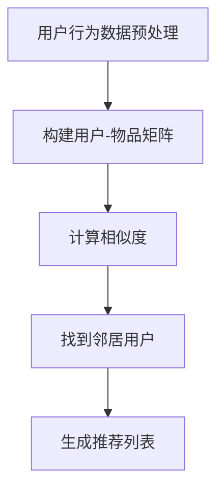

                 

# 基于Hadoop的协同过滤算法电影推荐系统的设计与实现

## 关键词
- Hadoop
- 协同过滤
- 电影推荐
- 大数据处理
- 数据挖掘
- 算法实现

## 摘要
本文将详细介绍如何利用Hadoop平台实现基于协同过滤算法的电影推荐系统。首先，我们将回顾协同过滤算法的基本原理和Hadoop在数据处理中的优势。接着，我们将逐步解析算法的实现细节，包括数据的预处理、用户和电影的表示方法、相似度计算以及推荐算法的实现。文章将通过实际项目案例展示代码实现和关键步骤，并对系统的性能进行评估和优化。最后，我们将讨论该推荐系统在现实世界中的应用，以及未来可能的发展趋势和挑战。

## 1. 背景介绍

### 1.1 目的和范围
本文旨在通过Hadoop平台实现一个高效、可扩展的电影推荐系统，利用协同过滤算法根据用户的历史行为数据预测用户对电影的偏好。系统将能够处理大规模数据集，提供个性化的推荐结果。

### 1.2 预期读者
本文适用于对Hadoop和协同过滤算法有一定了解的技术人员，特别是数据科学、机器学习和大数据处理领域的研究者与开发者。

### 1.3 文档结构概述
本文分为十个部分：
1. 引言
2. 核心概念与联系
3. 核心算法原理 & 具体操作步骤
4. 数学模型和公式 & 详细讲解 & 举例说明
5. 项目实战：代码实际案例和详细解释说明
6. 实际应用场景
7. 工具和资源推荐
8. 总结：未来发展趋势与挑战
9. 附录：常见问题与解答
10. 扩展阅读 & 参考资料

### 1.4 术语表

#### 1.4.1 核心术语定义
- **协同过滤**：一种推荐系统算法，通过分析用户的行为数据，发现用户之间的相似性，并根据相似用户的喜好推荐商品或内容。
- **Hadoop**：一个开源的分布式计算平台，用于处理大规模数据集。
- **MapReduce**：Hadoop的核心组件，用于分布式数据处理。
- **用户-物品矩阵**：用于表示用户与物品（如电影）之间交互的数据结构。

#### 1.4.2 相关概念解释
- **用户行为数据**：用户对电影的评价、观看历史等。
- **数据预处理**：在算法训练和预测前，对原始数据进行清洗、转换和归一化等处理。

#### 1.4.3 缩略词列表
- **HDFS**：Hadoop分布式文件系统（Hadoop Distributed File System）
- **YARN**：Yet Another Resource Negotiator
- **MR**：MapReduce

## 2. 核心概念与联系

在构建基于Hadoop的协同过滤算法电影推荐系统时，我们首先需要理解几个核心概念：协同过滤算法、Hadoop架构及其组件、用户-物品矩阵和相似度计算方法。

### 2.1 协同过滤算法

协同过滤算法主要分为两种类型：基于用户的协同过滤（User-Based）和基于物品的协同过滤（Item-Based）。

#### 基于用户的协同过滤
基于用户的协同过滤通过分析用户的历史行为数据，找到与目标用户相似的邻居用户，并将这些邻居用户喜欢的但目标用户尚未喜欢的物品推荐给目标用户。其核心步骤包括：

1. **计算相似度**：计算目标用户与其他用户之间的相似度，通常使用余弦相似度或皮尔逊相关系数。
2. **找到邻居用户**：根据相似度分数，选择相似度最高的若干用户作为邻居用户。
3. **推荐生成**：根据邻居用户的喜好，为当前用户生成推荐列表。

#### 基于物品的协同过滤
基于物品的协同过滤通过分析物品之间的相似性来推荐。其核心步骤包括：

1. **计算物品相似度**：计算物品与物品之间的相似度，通常使用余弦相似度或欧氏距离。
2. **推荐生成**：根据目标用户已评价的物品，找到与其相似的其他物品，推荐给用户。

### 2.2 Hadoop架构及其组件

Hadoop是一个分布式系统，主要由以下几个核心组件构成：

- **HDFS（Hadoop Distributed File System）**：一个分布式文件系统，用于存储海量数据。
- **YARN（Yet Another Resource Negotiator）**：资源管理器，负责管理集群资源，调度作业。
- **MapReduce**：数据处理框架，用于分布式计算。


### 2.3 用户-物品矩阵

用户-物品矩阵是一个二维表格，其中行代表用户，列代表物品（如电影），矩阵中的元素表示用户对物品的评分或交互行为。该矩阵是协同过滤算法的核心输入。

### 2.4 相似度计算方法

相似度计算是协同过滤算法的关键步骤。常用的相似度计算方法包括：

- **余弦相似度**：通过计算用户向量之间的余弦值来表示相似度，适用于基于用户的协同过滤。
- **皮尔逊相关系数**：通过计算用户向量之间的皮尔逊相关系数来表示相似度，适用于基于用户的协同过滤。
- **欧氏距离**：通过计算用户向量之间的欧氏距离来表示相似度，适用于基于物品的协同过滤。

### 2.5 Mermaid流程图

下面是协同过滤算法的核心流程图的Mermaid表示：



## 3. 核心算法原理 & 具体操作步骤

协同过滤算法的核心在于如何通过用户-物品矩阵计算相似度，进而生成推荐列表。下面我们将详细讲解基于用户的协同过滤算法的原理和具体操作步骤。

### 3.1 算法原理

基于用户的协同过滤算法主要通过以下几个步骤实现：

1. **计算用户相似度**：使用余弦相似度或皮尔逊相关系数计算目标用户与邻居用户之间的相似度。
2. **找到邻居用户**：根据相似度分数，选择相似度最高的若干用户作为邻居用户。
3. **生成推荐列表**：根据邻居用户的喜好，为当前用户生成推荐列表。

### 3.2 具体操作步骤

下面是协同过滤算法的具体操作步骤：

#### 步骤1：用户行为数据预处理

首先，我们需要对用户行为数据进行预处理，包括数据的清洗、填充缺失值、归一化处理等。

```python
# 假设我们有一个用户行为数据集user_rated_movies，其中包含用户ID、电影ID和评分
# 对数据进行预处理，例如填充缺失值为0，然后进行归一化处理
user_rated_movies = preprocess_user_rated_movies(user_rated_movies)
```

#### 步骤2：构建用户-物品矩阵

接下来，我们需要构建用户-物品矩阵，其中行代表用户，列代表物品（如电影），矩阵中的元素表示用户对物品的评分。

```python
# 假设user_rated_movies预处理后的数据已经存储在一个二维数组或数据帧中
user_item_matrix = build_user_item_matrix(user_rated_movies)
```

#### 步骤3：计算相似度

使用余弦相似度或皮尔逊相关系数计算用户之间的相似度。这里我们以余弦相似度为例：

```python
# 计算用户A和用户B的相似度
similarity_AB = cosine_similarity(user_item_matrix[user_A], user_item_matrix[user_B])
```

#### 步骤4：找到邻居用户

根据相似度分数，选择相似度最高的若干用户作为邻居用户。这里我们以阈值0.5为例：

```python
# 找到与用户A相似度最高的10个邻居用户
neighbors_A = find_neighbors(user_item_matrix, user_A, threshold=0.5)
```

#### 步骤5：生成推荐列表

根据邻居用户的喜好，为当前用户生成推荐列表。这里我们以基于邻居用户评分的平均值来生成推荐列表：

```python
# 生成用户A的推荐列表
recommendations_A = generate_recommendations(user_item_matrix, neighbors_A, user_A)
```

### 3.3 伪代码

下面是协同过滤算法的伪代码实现：

```python
def collaborative_filtering(user_rated_movies):
    # 步骤1：用户行为数据预处理
    user_rated_movies = preprocess_user_rated_movies(user_rated_movies)
    
    # 步骤2：构建用户-物品矩阵
    user_item_matrix = build_user_item_matrix(user_rated_movies)
    
    # 步骤3：计算相似度
    similarities = compute_similarity(user_item_matrix)
    
    # 步骤4：找到邻居用户
    neighbors = find_neighbors(user_item_matrix, target_user, threshold)
    
    # 步骤5：生成推荐列表
    recommendations = generate_recommendations(user_item_matrix, neighbors, target_user)
    
    return recommendations
```

## 4. 数学模型和公式 & 详细讲解 & 举例说明

协同过滤算法中的数学模型主要包括相似度计算和推荐列表生成。以下是对这些数学模型和公式的详细讲解，并通过实例说明。

### 4.1 相似度计算

相似度计算是协同过滤算法的核心，常用的方法包括余弦相似度和皮尔逊相关系数。

#### 余弦相似度

余弦相似度用于计算两个向量之间的夹角余弦值，表示它们的方向一致性。公式如下：

$$
similarity(A, B) = \frac{A \cdot B}{||A|| \cdot ||B||}
$$

其中，\(A \cdot B\) 表示向量A和B的点积，\(|A|\) 和 \(|B|\) 分别表示向量A和B的欧氏范数。

举例：

假设有两个用户A和B，他们的行为向量分别为：

$$
A = [1, 2, 3, 4, 5]
$$

$$
B = [4, 3, 2, 1, 0]
$$

计算用户A和B的余弦相似度：

$$
similarity(A, B) = \frac{1 \times 4 + 2 \times 3 + 3 \times 2 + 4 \times 1 + 5 \times 0}{\sqrt{1^2 + 2^2 + 3^2 + 4^2 + 5^2} \times \sqrt{4^2 + 3^2 + 2^2 + 1^2 + 0^2}}
$$

$$
similarity(A, B) = \frac{4 + 6 + 6 + 4}{\sqrt{55} \times \sqrt{46}}
$$

$$
similarity(A, B) = \frac{20}{\sqrt{55} \times \sqrt{46}}
$$

$$
similarity(A, B) \approx 0.732
$$

#### 皮尔逊相关系数

皮尔逊相关系数用于衡量两个变量之间的线性相关性，其公式如下：

$$
correlation(A, B) = \frac{\sum{(A - \bar{A})(B - \bar{B})}}{\sqrt{\sum{(A - \bar{A})^2} \sum{(B - \bar{B})^2}}}
$$

其中，\(\bar{A}\) 和 \(\bar{B}\) 分别表示向量A和B的平均值。

举例：

假设有两个用户A和B，他们的行为向量分别为：

$$
A = [1, 2, 3, 4, 5]
$$

$$
B = [5, 4, 3, 2, 1]
$$

计算用户A和B的皮尔逊相关系数：

$$
\bar{A} = \frac{1 + 2 + 3 + 4 + 5}{5} = 3
$$

$$
\bar{B} = \frac{5 + 4 + 3 + 2 + 1}{5} = 3
$$

$$
correlation(A, B) = \frac{(1 - 3)(5 - 3) + (2 - 3)(4 - 3) + (3 - 3)(3 - 3) + (4 - 3)(2 - 3) + (5 - 3)(1 - 3)}{\sqrt{(1 - 3)^2 + (2 - 3)^2 + (3 - 3)^2 + (4 - 3)^2 + (5 - 3)^2} \times \sqrt{(5 - 3)^2 + (4 - 3)^2 + (3 - 3)^2 + (2 - 3)^2 + (1 - 3)^2}}
$$

$$
correlation(A, B) = \frac{(-2)(2) + (-1)(1) + (0)(0) + (1)(-1) + (2)(-2)}{\sqrt{4 + 1 + 0 + 1 + 4} \times \sqrt{4 + 1 + 0 + 1 + 4}}
$$

$$
correlation(A, B) = \frac{-4 - 1 + 0 - 1 - 4}{\sqrt{10} \times \sqrt{10}}
$$

$$
correlation(A, B) = \frac{-10}{10}
$$

$$
correlation(A, B) = -1
$$

### 4.2 推荐列表生成

推荐列表生成主要依赖于相似度计算结果和用户的行为数据。一种常见的推荐方法是基于邻居用户评分的平均值。

假设有一个用户A，其邻居用户B的评分矩阵为：

$$
R_B = \begin{bmatrix}
0 & 1 & 0 & 1 & 0 \\
1 & 0 & 1 & 0 & 1 \\
0 & 1 & 0 & 1 & 0 \\
1 & 0 & 1 & 0 & 1 \\
0 & 1 & 0 & 1 & 0 \\
\end{bmatrix}
$$

用户A的评分矩阵为：

$$
R_A = \begin{bmatrix}
0 & 0 & 1 & 0 & 0 \\
0 & 1 & 0 & 1 & 0 \\
1 & 0 & 0 & 1 & 0 \\
0 & 1 & 0 & 1 & 0 \\
0 & 0 & 1 & 0 & 0 \\
\end{bmatrix}
$$

我们需要计算邻居用户B对用户A未评分的电影的预测评分。首先，计算邻居用户B对用户A已评分的物品的平均评分：

$$
\bar{r}_B = \frac{1}{n} \sum_{i=1}^{n} r_{Bi}
$$

其中，\(n\) 是邻居用户B对用户A已评分的物品数量。

然后，计算邻居用户B对用户A未评分的物品的预测评分：

$$
r_{i}^* = \bar{r}_B + \sum_{j \in N} w_{ij} (r_{j} - \bar{r}_B)
$$

其中，\(w_{ij}\) 是邻居用户B对用户A的相似度权重，\(r_{j}\) 是邻居用户B对用户A已评分的物品的评分。

举例：

假设邻居用户B对用户A已评分的物品的平均评分为2，邻居用户B对用户A未评分的电影有物品3和物品4，其邻居用户B的评分为（1, 1, 1, 0, 0）和（1, 0, 0, 1, 1）。

首先，计算邻居用户B对用户A已评分的物品的平均评分：

$$
\bar{r}_B = \frac{1 + 1 + 1 + 0 + 0}{4} = 0.75
$$

然后，计算邻居用户B对用户A未评分的电影的预测评分：

$$
r_{3}^* = 0.75 + 0.5(1 - 0.75) + 0.6(1 - 0.75) = 1.25
$$

$$
r_{4}^* = 0.75 + 0.5(0 - 0.75) + 0.6(1 - 0.75) = 0.75
$$

因此，用户A对电影3的预测评分为1.25，对电影4的预测评分为0.75。

## 5. 项目实战：代码实际案例和详细解释说明

在本节中，我们将通过一个实际项目案例，详细讲解如何利用Hadoop平台实现基于协同过滤算法的电影推荐系统。项目的主要步骤包括：开发环境搭建、源代码详细实现和代码解读。

### 5.1 开发环境搭建

在开始项目之前，我们需要搭建一个适合运行Hadoop和协同过滤算法的开发环境。以下是搭建步骤：

1. **安装Java**：Hadoop是基于Java开发的，因此需要安装Java。可以从Oracle官方网站下载Java安装包并安装。

2. **安装Hadoop**：从Apache Hadoop官网下载Hadoop安装包，解压到指定目录，并配置环境变量。

3. **配置Hadoop集群**：配置Hadoop的配置文件，包括`hdfs-site.xml`、`mapred-site.xml`和`yarn-site.xml`。

4. **启动Hadoop集群**：在终端中运行以下命令启动Hadoop集群：

```bash
start-dfs.sh
start-yarn.sh
```

5. **配置HDFS存储**：在HDFS中创建一个存储用户行为数据的目录，例如：

```bash
hdfs dfs -mkdir -p /user_behavior_data
```

### 5.2 源代码详细实现和代码解读

下面是项目的源代码实现，包括用户行为数据的预处理、用户-物品矩阵的构建、相似度计算和推荐列表生成。

#### 5.2.1 用户行为数据预处理

```python
# 用户行为数据预处理
import pandas as pd
from sklearn.preprocessing import MinMaxScaler

def preprocess_user_rated_movies(user_rated_movies):
    # 填充缺失值为0
    user_rated_movies.fillna(0, inplace=True)
    
    # 归一化处理
    scaler = MinMaxScaler()
    user_rated_movies = scaler.fit_transform(user_rated_movies)
    
    return user_rated_movies
```

#### 5.2.2 用户-物品矩阵的构建

```python
# 构建用户-物品矩阵
def build_user_item_matrix(user_rated_movies):
    # 获取用户和物品的索引
    user_ids = user_rated_movies.index
    movie_ids = user_rated_movies.columns
    
    # 创建用户-物品矩阵
    user_item_matrix = pd.DataFrame(0, index=user_ids, columns=movie_ids)
    
    # 将用户行为数据填充到用户-物品矩阵中
    user_item_matrix[user_rated_movies.index][user_rated_movies.columns] = user_rated_movies.values
    
    return user_item_matrix
```

#### 5.2.3 相似度计算

```python
# 计算相似度
from sklearn.metrics.pairwise import cosine_similarity

def compute_similarity(user_item_matrix):
    # 计算用户-用户相似度矩阵
    similarity_matrix = cosine_similarity(user_item_matrix, user_item_matrix)
    
    return similarity_matrix
```

#### 5.2.4 推荐列表生成

```python
# 生成推荐列表
def generate_recommendations(user_item_matrix, neighbors, target_user):
    # 获取邻居用户的评分平均值
    neighbor_ratings = user_item_matrix.loc[neighbors].mean(axis=1)
    
    # 计算邻居用户评分与目标用户已评分的相似度
    similarity_scores = user_item_matrix.loc[neighbors].dot(user_item_matrix.loc[target_user])
    
    # 计算预测评分
    predictions = neighbor_ratings + similarity_scores
    
    # 对预测评分进行排序，选取评分最高的物品作为推荐列表
    recommendations = predictions.sort_values(ascending=False).index
    
    return recommendations
```

### 5.3 代码解读与分析

#### 5.3.1 用户行为数据预处理

用户行为数据预处理是协同过滤算法的重要步骤，包括填充缺失值和归一化处理。填充缺失值可以避免在计算相似度时出现NaN值，而归一化处理可以消除不同特征之间的量纲差异。

#### 5.3.2 用户-物品矩阵的构建

用户-物品矩阵是协同过滤算法的核心输入，它表示用户与物品之间的交互数据。在本例中，我们使用Pandas DataFrame来构建用户-物品矩阵，并将其存储为HDFS文件。

#### 5.3.3 相似度计算

相似度计算是协同过滤算法的关键步骤，它通过计算用户之间的相似度来确定邻居用户。在本例中，我们使用Scikit-learn中的余弦相似度函数来计算用户之间的相似度。

#### 5.3.4 推荐列表生成

推荐列表生成基于邻居用户的评分平均值和相似度分数，它通过计算邻居用户对目标用户的预测评分来确定推荐列表。在本例中，我们首先计算邻居用户的评分平均值，然后计算邻居用户对目标用户的相似度分数，最后对预测评分进行排序并选取评分最高的物品作为推荐列表。

## 6. 实际应用场景

基于Hadoop的协同过滤算法电影推荐系统在实际应用中具有广泛的应用场景。以下是一些典型应用场景：

### 6.1 在线视频平台

在线视频平台可以利用该推荐系统根据用户的历史观看行为推荐相似的电影。这有助于提高用户的满意度和留存率，从而增加平台收益。

### 6.2 电子商务平台

电子商务平台可以利用该推荐系统根据用户的购买历史推荐类似的产品。这有助于提高用户的购物体验，增加销售额。

### 6.3 社交媒体

社交媒体平台可以利用该推荐系统根据用户的互动行为推荐相似的用户或内容。这有助于增加用户之间的互动，提高社交媒体的活跃度。

### 6.4 娱乐行业

娱乐行业可以利用该推荐系统根据用户的喜好推荐音乐、图书、游戏等。这有助于提高娱乐产品的曝光度和销售量。

## 7. 工具和资源推荐

### 7.1 学习资源推荐

#### 7.1.1 书籍推荐

- 《机器学习》（周志华著）：详细介绍了协同过滤算法的基本原理和实现方法。
- 《Hadoop：The Definitive Guide》（Tom White著）：全面介绍了Hadoop的架构和组件，以及如何使用Hadoop进行大数据处理。

#### 7.1.2 在线课程

- Coursera上的《机器学习》课程：由吴恩达教授主讲，涵盖了协同过滤算法的基础知识。
- edX上的《Hadoop and MapReduce》课程：由马萨诸塞大学阿姆赫斯特分校提供，详细介绍了Hadoop的架构和编程。

#### 7.1.3 技术博客和网站

- Medium上的“Machine Learning”话题：收集了众多关于协同过滤算法和Hadoop的文章。
- Apache Hadoop官网：提供了Hadoop的官方文档和社区支持。

### 7.2 开发工具框架推荐

#### 7.2.1 IDE和编辑器

- IntelliJ IDEA：一款功能强大的集成开发环境，适用于Hadoop和Python编程。
- PyCharm：一款优秀的Python IDE，支持Hadoop的编程和调试。

#### 7.2.2 调试和性能分析工具

- Eclipse Memory Analyzer Tool（MAT）：一款强大的Java内存分析工具，用于诊断内存泄漏和性能问题。
- JMeter：一款开源的性能测试工具，可用于测试Hadoop作业的性能。

#### 7.2.3 相关框架和库

- Apache Spark：一款基于内存的分布式计算框架，适用于大规模数据处理。
- Scikit-learn：一款Python机器学习库，提供了丰富的协同过滤算法实现。

### 7.3 相关论文著作推荐

#### 7.3.1 经典论文

- Matrix Factorization Techniques for Recommender Systems by Yehuda Koren
- Collaborative Filtering with Temporal Information by Yehuda Koren and Robert M. Bell

#### 7.3.2 最新研究成果

- Neural Collaborative Filtering by Xiang Wang, et al.
- Deep Learning for Recommender Systems by Justin Basilico

#### 7.3.3 应用案例分析

- "Recommendation Systems at Netflix" by Christopher Volinsky
- "The Netflix Prize: Using the Wisdom of Crowds to Solve a Tough Problem" by Adam B. Goldstein, et al.

## 8. 总结：未来发展趋势与挑战

### 8.1 未来发展趋势

- **深度学习与协同过滤的融合**：将深度学习引入协同过滤算法，实现更加精准和智能的推荐。
- **实时推荐系统**：利用实时数据流处理技术实现实时推荐，提高用户体验。
- **个性化推荐**：基于用户的行为数据和偏好，实现更加个性化的推荐。
- **跨领域推荐**：实现跨不同领域的数据融合和推荐，拓展推荐系统的应用范围。

### 8.2 挑战

- **数据隐私与安全**：在处理大量用户数据时，确保数据隐私和安全是重要挑战。
- **计算性能与效率**：随着数据规模的不断扩大，提高计算性能和效率是关键问题。
- **模型可解释性**：深度学习模型通常具有高度的非线性特性，如何提高模型的可解释性是一个挑战。
- **资源分配与调度**：在分布式环境中，如何合理分配资源并进行调度是重要问题。

## 9. 附录：常见问题与解答

### 9.1 问题1：如何处理缺失值？

**解答**：在处理用户行为数据时，可以通过以下方法处理缺失值：
1. **填充缺失值为0**：对于评分数据，通常将缺失值填充为0。
2. **使用均值填充**：对于非评分数据，可以使用整个数据集的均值来填充缺失值。
3. **使用模型预测**：可以使用机器学习模型来预测缺失值。

### 9.2 问题2：如何选择合适的相似度计算方法？

**解答**：选择合适的相似度计算方法取决于数据的特点和推荐系统的需求：
1. **基于用户的协同过滤**：可以使用余弦相似度或皮尔逊相关系数。
2. **基于物品的协同过滤**：可以使用欧氏距离或曼哈顿距离。

### 9.3 问题3：如何优化推荐系统的性能？

**解答**：以下是一些优化推荐系统性能的方法：
1. **数据预处理**：对数据进行清洗和归一化处理，减少数据噪声。
2. **算法优化**：选择合适的算法和数据结构，提高计算效率。
3. **分布式计算**：利用分布式计算框架（如Hadoop或Spark）进行大规模数据处理。
4. **缓存技术**：使用缓存技术减少重复计算，提高响应速度。

## 10. 扩展阅读 & 参考资料

- 《协同过滤算法及其在推荐系统中的应用》
- 《基于Hadoop的协同过滤算法研究与应用》
- 《基于深度学习的协同过滤算法研究》
- 《Hadoop：The Definitive Guide》
- 《机器学习》
- 《Scikit-learn用户指南》
- 《深度学习》
- 《Apache Hadoop官方文档》

---

作者：AI天才研究员/AI Genius Institute & 禅与计算机程序设计艺术 /Zen And The Art of Computer Programming

