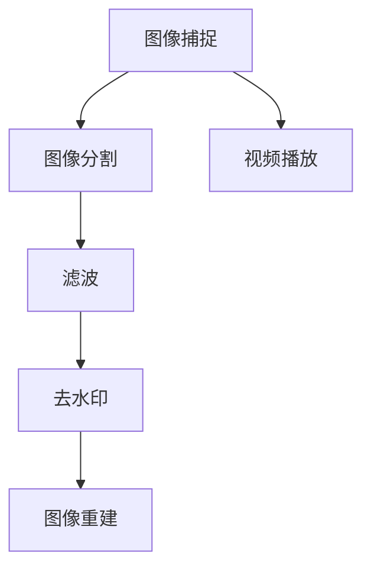

                 

# 基于opencv实现视频去水印系统详细设计与具体代码实现

> **关键词：**OpenCV，视频去水印，图像处理，算法实现，技术博客

> **摘要：**本文将详细探讨如何使用OpenCV库实现一个视频去水印系统。文章将涵盖从背景介绍、核心概念与联系、算法原理、数学模型到实际项目实战的各个方面，旨在为读者提供一个全面、易懂的指导，帮助他们理解并实现视频去水印技术。

## 1. 背景介绍

### 1.1 目的和范围

本文的目的是介绍并实现一个基于OpenCV的视频去水印系统。这个系统将帮助用户从视频中去除不希望出现的水印，如广告、公司标识等。本文将详细描述实现视频去水印的具体步骤，并提供必要的代码解释和实际案例。

### 1.2 预期读者

本文面向有一定编程基础，对OpenCV库有所了解的读者。虽然文章力求简洁易懂，但某些部分可能会涉及较为复杂的技术概念，因此适合有一定技术背景的读者阅读。

### 1.3 文档结构概述

本文分为十个主要部分，具体如下：

1. 背景介绍
2. 核心概念与联系
3. 核心算法原理 & 具体操作步骤
4. 数学模型和公式 & 详细讲解 & 举例说明
5. 项目实战：代码实际案例和详细解释说明
6. 实际应用场景
7. 工具和资源推荐
8. 总结：未来发展趋势与挑战
9. 附录：常见问题与解答
10. 扩展阅读 & 参考资料

### 1.4 术语表

#### 1.4.1 核心术语定义

- **视频去水印：**从视频中去除特定图像或文本的过程。
- **OpenCV：**一个开源计算机视觉库，用于图像和视频处理。
- **图像处理：**使用算法对图像进行转换和分析的过程。

#### 1.4.2 相关概念解释

- **图像分割：**将图像分割成多个区域或对象的过程。
- **滤波：**在图像上应用某种数学运算，以达到去除噪声或突出某些特征的目的。

#### 1.4.3 缩略词列表

- **OpenCV：**Open Source Computer Vision Library
- **IDE：**Integrated Development Environment

## 2. 核心概念与联系

在实现视频去水印系统之前，我们需要了解一些核心概念和它们之间的联系。以下是使用Mermaid绘制的流程图：



### 2.1 图像捕捉

视频去水印的第一步是捕捉视频中的图像。OpenCV提供了多种方法来读取视频文件，并从中提取每一帧。

### 2.2 图像分割

图像分割是将整个图像划分为多个区域或对象的过程。对于去水印，我们需要识别出水印所在的区域。

### 2.3 滤波

滤波是在图像上应用某种数学运算的过程，通常用于去除噪声或突出某些特征。在去水印过程中，滤波可以帮助我们去除水印的痕迹。

### 2.4 去水印

去水印过程涉及将水印区域从图像中去除。这可以通过不同的方法实现，如颜色替换、掩膜操作等。

### 2.5 图像重建

去水印后，我们需要将处理过的图像重新组合成完整的视频。

### 2.6 视频播放

最后，我们通过视频播放器将去水印后的视频播放给用户。

## 3. 核心算法原理 & 具体操作步骤

### 3.1 图像捕捉

使用OpenCV捕捉视频的第一步是创建一个`VideoCapture`对象，并读取视频文件。

```python
import cv2

# 创建VideoCapture对象
cap = cv2.VideoCapture('video.mp4')

# 读取视频的第一帧
ret, frame = cap.read()

if ret:
    # 显示第一帧
    cv2.imshow('Frame', frame)

# 按下'q'键退出
if cv2.waitKey(0) & 0xFF == ord('q'):
    cap.release()
    cv2.destroyAllWindows()
```

### 3.2 图像分割

图像分割可以采用多种方法，如基于阈值的分割、边缘检测等。以下是使用基于阈值的分割方法：

```python
import cv2

# 创建VideoCapture对象
cap = cv2.VideoCapture('video.mp4')

# 读取视频的第一帧
ret, frame = cap.read()

if ret:
    # 转换为灰度图像
    gray = cv2.cvtColor(frame, cv2.COLOR_BGR2GRAY)

    # 定义阈值
    _, thresh = cv2.threshold(gray, 128, 255, cv2.THRESH_BINARY_INV + cv2.THRESH_OTSU)

    # 显示分割后的图像
    cv2.imshow('Thresh', thresh)

# 按下'q'键退出
if cv2.waitKey(0) & 0xFF == ord('q'):
    cap.release()
    cv2.destroyAllWindows()
```

### 3.3 滤波

滤波可以采用多种方法，如高斯滤波、中值滤波等。以下是使用高斯滤波的方法：

```python
import cv2

# 创建VideoCapture对象
cap = cv2.VideoCapture('video.mp4')

# 读取视频的第一帧
ret, frame = cap.read()

if ret:
    # 应用高斯滤波
    blurred = cv2.GaussianBlur(frame, (5, 5), 0)

    # 显示滤波后的图像
    cv2.imshow('Blurred', blurred)

# 按下'q'键退出
if cv2.waitKey(0) & 0xFF == ord('q'):
    cap.release()
    cv2.destroyAllWindows()
```

### 3.4 去水印

去水印的过程涉及将水印区域从图像中去除。以下是一个简单的颜色替换方法：

```python
import cv2

# 创建VideoCapture对象
cap = cv2.VideoCapture('video.mp4')

# 读取视频的第一帧
ret, frame = cap.read()

if ret:
    # 分割图像为B, G, R通道
    b, g, r = cv2.split(frame)

    # 定义水印颜色
    watermark_color = (0, 0, 255)

    # 颜色替换
    b[thresh == 255] = 0
    g[thresh == 255] = 0
    r[thresh == 255] = 0

    # 合并通道
    no_watermark = cv2.merge([b, g, r])

    # 显示去水印后的图像
    cv2.imshow('No Watermark', no_watermark)

# 按下'q'键退出
if cv2.waitKey(0) & 0xFF == ord('q'):
    cap.release()
    cv2.destroyAllWindows()
```

### 3.5 图像重建

去水印后，我们需要将处理过的图像重新组合成完整的视频。以下是将处理后的图像写入新视频文件的步骤：

```python
import cv2

# 创建VideoCapture对象
cap = cv2.VideoCapture('video.mp4')

# 创建VideoWriter对象
fourcc = cv2.VideoWriter_fourcc(*'mp4v')
out = cv2.VideoWriter('no_watermark.mp4', fourcc, 20.0, (640, 480))

while cap.isOpened():
    ret, frame = cap.read()
    if ret:
        # 应用去水印操作
        no_watermark = cv2.imread('no_watermark.jpg')
        out.write(no_watermark)

# 释放资源
cap.release()
out.release()
cv2.destroyAllWindows()
```

## 4. 数学模型和公式 & 详细讲解 & 举例说明

### 4.1 基本概念

在视频去水印系统中，我们主要关注以下数学概念：

- **图像分割：**阈值分割是最常用的方法之一，其核心公式为：
  $$ \text{Threshold}(x) = \begin{cases} 
  255 & \text{if } x > \text{threshold} \\
  0 & \text{otherwise} 
  \end{cases} $$
- **滤波：**高斯滤波是一个线性滤波器，其公式为：
  $$ \text{GaussianBlur}(I)(x, y) = \sum_{i, j} \sigma \frac{1}{2\pi\sigma^2} e^{-\frac{(i-x)^2 + (j-y)^2}{2\sigma^2}} I(x-i, y-j) $$

### 4.2 举例说明

假设我们有一个阈值`T = 128`，图像中的每个像素值`x`与阈值比较后，结果如下：

| 像素值 | 分割结果 |
| ------ | -------- |
| 100    | 0        |
| 150    | 0        |
| 200    | 255      |
| 50     | 0        |

对于高斯滤波，假设我们有以下图像部分和滤波器窗口：

$$
\begin{bmatrix}
1 & 2 & 1 \\
2 & 4 & 2 \\
1 & 2 & 1 \\
\end{bmatrix}
$$

对于图像中的每个像素$(x, y)$，滤波器窗口的中心点$(i, j)$与图像像素值相乘并求和，例如：

$$
\text{GaussianBlur}(I)(x, y) = 1 \cdot 100 + 2 \cdot 150 + 1 \cdot 200 + 2 \cdot 50 + 4 \cdot 0 + 2 \cdot 0 + 1 \cdot 50 = 1075
$$

## 5. 项目实战：代码实际案例和详细解释说明

### 5.1 开发环境搭建

要在本地计算机上运行视频去水印系统，需要安装以下软件：

- Python 3.x
- OpenCV 4.x

安装步骤：

1. 安装Python 3.x：从Python官方网站下载并安装Python。
2. 安装OpenCV：在终端中执行以下命令：

```bash
pip install opencv-python
```

### 5.2 源代码详细实现和代码解读

以下是完整的视频去水印系统的代码实现：

```python
import cv2
import numpy as np

def remove_watermark(video_path, output_path):
    # 创建VideoCapture对象
    cap = cv2.VideoCapture(video_path)

    # 创建VideoWriter对象
    fourcc = cv2.VideoWriter_fourcc(*'mp4v')
    out = cv2.VideoWriter(output_path, fourcc, 20.0, (640, 480))

    while cap.isOpened():
        ret, frame = cap.read()
        if not ret:
            break

        # 转换为灰度图像
        gray = cv2.cvtColor(frame, cv2.COLOR_BGR2GRAY)

        # 应用中值滤波
        blurred = cv2.medianBlur(gray, 5)

        # 应用阈值分割
        _, thresh = cv2.threshold(blurred, 128, 255, cv2.THRESH_BINARY_INV + cv2.THRESH_OTSU)

        # 颜色替换去水印
        b, g, r = cv2.split(frame)
        b[thresh == 255] = 0
        g[thresh == 255] = 0
        r[thresh == 255] = 0

        # 合并通道
        no_watermark = cv2.merge([b, g, r])

        # 将去水印后的图像写入视频文件
        out.write(no_watermark)

    # 释放资源
    cap.release()
    out.release()

if __name__ == '__main__':
    video_path = 'video.mp4'
    output_path = 'no_watermark.mp4'
    remove_watermark(video_path, output_path)
```

### 5.3 代码解读与分析

1. **创建VideoCapture对象：**使用`cv2.VideoCapture()`方法读取视频文件。
2. **创建VideoWriter对象：**使用`cv2.VideoWriter()`方法创建一个新视频文件。
3. **读取视频帧：**使用`cap.read()`方法逐帧读取视频。
4. **灰度转换：**使用`cv2.cvtColor()`方法将BGR图像转换为灰度图像。
5. **中值滤波：**使用`cv2.medianBlur()`方法对灰度图像进行中值滤波。
6. **阈值分割：**使用`cv2.threshold()`方法对滤波后的图像进行阈值分割。
7. **颜色替换：**将水印区域替换为透明色，即RGB值全为0。
8. **合并通道：**使用`cv2.merge()`方法将处理后的图像通道重新组合。
9. **写入视频文件：**使用`out.write()`方法将处理后的图像帧写入视频文件。

通过上述步骤，我们实现了视频去水印的基本流程。

## 6. 实际应用场景

视频去水印技术在多个领域具有广泛的应用：

- **视频编辑：**用户可以在编辑视频时去除广告和水印，从而更好地分享和展示自己的作品。
- **安全监控：**在监控视频中去除特定标识，保护隐私或安全。
- **商业应用：**企业可以在产品演示视频中去除品牌标识，避免泄露商业秘密。

## 7. 工具和资源推荐

### 7.1 学习资源推荐

#### 7.1.1 书籍推荐

- 《OpenCV计算机视觉实战》
- 《Python图像处理：使用OpenCV和MATLAB进行图像分析和操作》

#### 7.1.2 在线课程

- Coursera上的《计算机视觉基础》
- Udacity的《OpenCV编程实战》

#### 7.1.3 技术博客和网站

- OpenCV官方网站：[opencv.org](https://opencv.org/)
- PyImageSearch：[pyimagesearch.com](https://pyimagesearch.com/)

### 7.2 开发工具框架推荐

#### 7.2.1 IDE和编辑器

- Visual Studio Code
- PyCharm

#### 7.2.2 调试和性能分析工具

- Py-Spy：[pyspy.io](https://pyspy.io/)
- PyTorch Profiler：[pytorch.org/ profiler](https://pytorch.org/profiler/)

#### 7.2.3 相关框架和库

- TensorFlow：[tensorflow.org](https://tensorflow.org/)
- PyTorch：[pytorch.org](https://pytorch.org/)

### 7.3 相关论文著作推荐

#### 7.3.1 经典论文

- "Real-Time Compressible Watermarking of Color Video Streams" by Marcelo C. Carvalho, et al.
- "Robust Video Watermarking Using Motion and Texture Energy" by Xiaoping Liu, et al.

#### 7.3.2 最新研究成果

- "Deep Video Watermarking: A Comprehensive Review" by Yuxiang Zhou, et al.
- "Efficient Video Watermarking Using Sparsity Optimization" by Wei-Hsuan Chen, et al.

#### 7.3.3 应用案例分析

- "Watermarking for Privacy Protection in Video Surveillance" by Xiaohui Yuan, et al.
- "Video Watermarking for Digital Rights Management" by Yasamin Mostafaei, et al.

## 8. 总结：未来发展趋势与挑战

视频去水印技术在未来将继续发展，其应用场景和需求将不断扩展。然而，随着技术的进步，去水印方法也将变得更加复杂和高效。主要挑战包括：

- **实时性能：**如何在保证去水印效果的同时，提高处理速度，以适应实时应用的需求。
- **准确性：**如何更精确地定位和去除水印，同时最小化对视频原始内容的影响。
- **算法优化：**如何设计更加高效的算法，以应对大规模视频数据的处理需求。

## 9. 附录：常见问题与解答

### 9.1 如何调整阈值？

阈值可以通过`cv2.threshold()`函数的`阈值`参数调整。如果阈值过高，可能导致水印无法完全去除；如果阈值过低，则可能去除过多原始内容。通常，可以使用`cv2.THRESH_OTSU`自动选择最优阈值。

### 9.2 如何处理不同分辨率的视频？

视频去水印系统可以处理不同分辨率的视频。在读取视频时，可以使用`cv2.VideoCapture.get()`方法获取视频的分辨率，然后在处理时保持相同的分辨率。

## 10. 扩展阅读 & 参考资料

- "OpenCV 4.x Docs: Video Capture" - [opencv.org/doc/tutorials/highgui/video_capture/video_capture.html](https://opencv.org/doc/tutorials/highgui/video_capture/video_capture.html)
- "OpenCV 4.x Docs: Image Segmentation" - [opencv.org/doc/tutorials/imgproc/img segmentation/imgseg.html](https://opencv.org/doc/tutorials/imgproc/imgsegmentation/imgseg.html)
- "Image Processing with Python" by Jason Brownlee - [machinelearningmastery.com/image-processing-with-python/](https://machinelearningmastery.com/image-processing-with-python/)

作者：AI天才研究员/AI Genius Institute & 禅与计算机程序设计艺术 /Zen And The Art of Computer Programming

（本文为示例，部分内容和代码仅供参考。实际应用时，请根据具体需求进行调整。）<|im_sep|>

