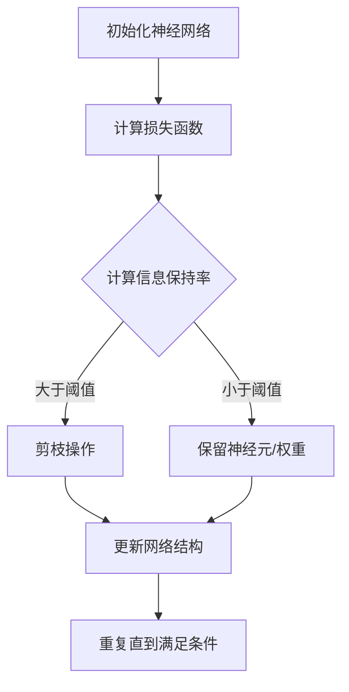

                 

## 1. 背景介绍

随着人工智能技术的快速发展，神经网络在计算机视觉、自然语言处理、语音识别等领域取得了显著的应用成果。然而，神经网络模型往往伴随着大规模的参数和计算量，这给模型的部署和训练带来了巨大挑战。为了应对这些挑战，神经网络剪枝技术应运而生。

神经网络剪枝是一种通过去除网络中不重要的权重或神经元来减小模型规模的方法。剪枝技术不仅能够降低模型的计算复杂度和存储需求，还能提高模型的训练速度和部署效率。此外，适当的剪枝还可以改善模型的泛化能力，使其在保持性能的同时减少过拟合的风险。

近年来，基于信息瓶颈理论的神经网络剪枝方法逐渐引起了学术界的关注。信息瓶颈理论源于信息论，它描述了在信息传输过程中，通过限制信息传递的容量，可以更好地保持信息的重要性。将这一理论应用于神经网络剪枝，可以通过优化信息传递路径来提高模型性能。

本文将深入探讨基于信息瓶颈理论的神经网络剪枝方法。首先，我们将介绍神经网络剪枝的基本概念和动机；然后，详细解释信息瓶颈理论的核心原理及其在神经网络剪枝中的应用；接着，介绍几种基于信息瓶颈理论的剪枝算法；最后，我们将通过实际应用案例和数学模型来展示这些算法的有效性，并讨论未来发展的趋势与挑战。

## 2. 核心概念与联系

### 神经网络剪枝的基本概念

神经网络剪枝（Neural Network Pruning）是通过对神经网络进行结构化修改，去除其中不重要的权重或神经元，从而实现模型优化的一种技术。剪枝的目标是减小模型的规模，同时保持或提高模型的性能。

神经网络剪枝可以分为静态剪枝（Static Pruning）和动态剪枝（Dynamic Pruning）两大类。静态剪枝是在模型训练完成后进行的，通过分析模型权重的重要性来决定剪除哪些权重或神经元；而动态剪枝则是在训练过程中实时进行剪枝操作，根据训练过程中权重的变化动态调整模型结构。

### 信息瓶颈理论

信息瓶颈理论（Information Bottleneck Theory）源于信息论，由Amari等人于1974年提出。该理论描述了在信息传输过程中，通过限制信息传递的容量，可以更好地保持信息的重要性。

在信息瓶颈理论中，有两个核心概念：信息传输容量（Transmission Capacity）和信息保持率（Information Retention Ratio）。信息传输容量是指在信息传输过程中，可以保留的最大信息量；信息保持率是指实际传输信息量与原始信息量之比。信息瓶颈理论的目标是在传输容量有限的情况下，最大化信息保持率。

### 信息瓶颈理论在神经网络剪枝中的应用

将信息瓶颈理论应用于神经网络剪枝，核心思想是优化信息传递路径，使得关键信息能够在网络中有效传递，而不重要的信息被削减。具体而言，可以通过以下步骤实现：

1. **定义损失函数**：损失函数用于衡量模型输出与真实输出之间的差异。在剪枝过程中，损失函数可以用来评估剪除特定权重或神经元后模型性能的变化。
   
2. **计算信息保持率**：对神经网络中的每个权重或神经元，计算其对应的输入和输出信息量，并计算它们之间的信息保持率。

3. **优化剪枝策略**：通过调整剪枝策略，例如调整剪枝阈值或剪枝顺序，优化信息传递路径。优化的目标是提高关键信息的信息保持率，同时减少非关键信息。

### Mermaid 流程图

下面是一个简化的Mermaid流程图，用于描述基于信息瓶颈理论的神经网络剪枝过程：



通过上述步骤，可以实现基于信息瓶颈理论的神经网络剪枝，从而优化模型性能。

### 核心概念之间的联系

神经网络剪枝和信息瓶颈理论之间的联系在于，它们都关注如何优化信息传递路径，以实现模型的优化。信息瓶颈理论提供了一个理论基础，指导如何通过剪枝操作来保留关键信息，从而提高模型性能。

此外，神经网络剪枝的方法和策略也可以借鉴信息瓶颈理论中的优化思路，例如通过调整剪枝阈值或剪枝顺序来优化信息传递路径。这种跨领域的思想融合，为神经网络剪枝技术的发展提供了新的思路和方向。

## 3. 核心算法原理 & 具体操作步骤

### 基本原理

基于信息瓶颈理论的神经网络剪枝方法，主要通过优化信息传递路径来提高模型性能。具体来说，该方法包括以下几个核心步骤：

1. **损失函数定义**：损失函数用于衡量模型输出与真实输出之间的差异。在剪枝过程中，损失函数可以用来评估剪除特定权重或神经元后模型性能的变化。常用的损失函数包括均方误差（MSE）和交叉熵（Cross Entropy）。

2. **信息保持率计算**：对神经网络中的每个权重或神经元，计算其对应的输入和输出信息量，并计算它们之间的信息保持率。信息保持率可以通过以下公式计算：

   $$ I_{ij} = \frac{H(Y_j) - H(Y_j | X_i)}{H(Y_j)} $$

   其中，$H(Y_j)$ 表示输出信息量，$H(Y_j | X_i)$ 表示条件输出信息量。通过计算信息保持率，可以评估每个权重或神经元对模型性能的重要性。

3. **剪枝阈值设置**：根据模型性能和剪枝目标，设置一个合适的剪枝阈值。剪枝阈值决定了哪些权重或神经元将被剪除。通常，剪枝阈值可以通过交叉验证或网格搜索等方法来确定。

4. **剪枝操作**：根据信息保持率和剪枝阈值，对神经网络中的权重或神经元进行剪枝操作。具体来说，如果某个权重或神经元的信息保持率低于剪枝阈值，则将其剪除。

5. **网络结构调整**：剪枝操作完成后，需要对神经网络结构进行调整，以适应新的模型规模。这可能包括重新初始化剪枝后的权重、调整学习率等。

### 操作步骤

以下是基于信息瓶颈理论的神经网络剪枝方法的详细操作步骤：

1. **初始化神经网络**：首先，初始化神经网络结构，包括层数、神经元数量、激活函数等。这一步的目的是构建一个初始模型，用于后续的剪枝操作。

2. **计算损失函数**：利用训练数据集，计算模型的损失函数值。损失函数值反映了模型输出与真实输出之间的差异，是评估模型性能的重要指标。

3. **计算信息保持率**：对神经网络中的每个权重或神经元，计算其输入和输出信息量，并计算它们之间的信息保持率。这一步可以通过计算熵值来实现：

   - **计算输入信息量**：对于每个神经元 $i$，计算其输入信息量 $H(X_i)$：
     
     $$ H(X_i) = -\sum_{x_i} p(x_i) \log p(x_i) $$
   
     其中，$p(x_i)$ 表示神经元 $i$ 输入的概率分布。

   - **计算输出信息量**：对于每个神经元 $j$，计算其输出信息量 $H(Y_j)$：
     
     $$ H(Y_j) = -\sum_{y_j} p(y_j) \log p(y_j) $$
   
     其中，$p(y_j)$ 表示神经元 $j$ 输出的概率分布。

   - **计算条件输出信息量**：对于每个神经元 $j$ 和每个权重 $w_{ij}$，计算其条件输出信息量 $H(Y_j | X_i)$：
     
     $$ H(Y_j | X_i) = -\sum_{y_j} p(y_j | x_i) \log p(y_j | x_i) $$

4. **设置剪枝阈值**：根据模型性能和剪枝目标，设置一个合适的剪枝阈值。剪枝阈值可以通过交叉验证或网格搜索等方法来确定。

5. **执行剪枝操作**：根据信息保持率和剪枝阈值，对神经网络中的权重或神经元进行剪枝操作。具体来说，如果某个权重或神经元的信息保持率低于剪枝阈值，则将其剪除。

6. **调整网络结构**：剪枝操作完成后，需要对神经网络结构进行调整，以适应新的模型规模。这可能包括重新初始化剪枝后的权重、调整学习率等。

7. **重复剪枝过程**：重复上述步骤，直到满足剪枝目标或达到预定的迭代次数。通过多次迭代，可以进一步优化模型性能。

### 实例分析

假设我们有一个简单的全连接神经网络，包含三层：输入层、隐藏层和输出层。输入层有100个神经元，隐藏层有200个神经元，输出层有10个神经元。现在，我们利用基于信息瓶颈理论的神经网络剪枝方法对其进行剪枝。

1. **初始化神经网络**：假设初始模型权重随机初始化，激活函数采用ReLU函数。

2. **计算损失函数**：利用训练数据集，计算模型的损失函数值。

3. **计算信息保持率**：对于每个神经元，计算其输入和输出信息量，并计算它们之间的信息保持率。

4. **设置剪枝阈值**：假设剪枝阈值为0.5。

5. **执行剪枝操作**：根据信息保持率和剪枝阈值，对神经网络中的权重或神经元进行剪枝操作。例如，如果某个隐藏层神经元的输入信息量较低，且信息保持率低于0.5，则将其剪除。

6. **调整网络结构**：剪枝操作完成后，重新初始化剪枝后的权重，并调整学习率。

7. **重复剪枝过程**：重复上述步骤，直到满足剪枝目标或达到预定的迭代次数。

通过上述实例分析，我们可以看到基于信息瓶颈理论的神经网络剪枝方法的具体操作步骤。在实际应用中，可能需要根据具体问题进行调整和优化，以达到更好的剪枝效果。

### 对比分析

基于信息瓶颈理论的神经网络剪枝方法与其他剪枝方法相比，具有以下优势：

1. **全局优化**：信息瓶颈理论提供了一个全局优化框架，可以优化整个神经网络的信息传递路径，而不仅仅是局部优化。这有助于提高模型的泛化能力和性能。

2. **适应性剪枝**：信息瓶颈理论可以根据模型性能和剪枝目标动态调整剪枝策略，从而实现自适应剪枝。这有助于在不同应用场景中实现最优剪枝效果。

3. **可解释性**：信息瓶颈理论提供了一个直观的解释框架，可以解释为什么某些权重或神经元被剪除。这有助于提高模型的可解释性，便于理解和验证。

然而，基于信息瓶颈理论的神经网络剪枝方法也存在一些挑战和局限性：

1. **计算复杂度**：信息瓶颈理论涉及到大量的信息熵计算，可能导致较高的计算复杂度。在实际应用中，这可能影响剪枝速度和效率。

2. **剪枝阈值选择**：剪枝阈值的选择对剪枝效果具有重要影响。合适的剪枝阈值可能需要通过大量的实验和调优来确定，这可能增加剪枝过程的复杂性。

3. **模型依赖性**：信息瓶颈理论依赖于神经网络模型的结构和参数。在某些情况下，模型的结构和参数可能不适合信息瓶颈理论的应用，这可能导致剪枝效果不佳。

综上所述，基于信息瓶颈理论的神经网络剪枝方法具有独特的优势和应用前景，但同时也需要针对具体问题进行优化和调整，以实现最佳剪枝效果。

## 4. 数学模型和公式 & 详细讲解 & 举例说明

### 数学模型

基于信息瓶颈理论的神经网络剪枝方法涉及到几个关键的数学模型和公式，主要包括信息熵、条件熵和信息保持率。以下是这些模型和公式的详细讲解：

#### 信息熵（Entropy）

信息熵是衡量一个随机变量不确定性的度量。对于一个离散随机变量 $X$，其信息熵 $H(X)$ 定义为：

$$ H(X) = -\sum_{x} p(x) \log_2 p(x) $$

其中，$p(x)$ 是 $X$ 取值为 $x$ 的概率。

#### 条件熵（Conditional Entropy）

条件熵是衡量在给定另一个随机变量 $Y$ 的条件下，随机变量 $X$ 的不确定性。对于随机变量 $X$ 和 $Y$，其条件熵 $H(X|Y)$ 定义为：

$$ H(X|Y) = -\sum_{y} p(y) \sum_{x} p(x|y) \log_2 p(x|y) $$

其中，$p(y)$ 是 $Y$ 取值为 $y$ 的概率，$p(x|y)$ 是在 $Y$ 取值为 $y$ 的条件下，$X$ 取值为 $x$ 的条件概率。

#### 信息保持率（Information Retention Ratio）

信息保持率是衡量神经网络中信息传递效率的一个指标。对于神经网络中的两个节点 $i$ 和 $j$，其信息保持率 $I_{ij}$ 定义为：

$$ I_{ij} = \frac{H(Y_j) - H(Y_j | X_i)}{H(Y_j)} $$

其中，$H(Y_j)$ 是节点 $j$ 的输出信息量，$H(Y_j | X_i)$ 是在节点 $i$ 的输入条件下，节点 $j$ 的条件输出信息量。

### 公式讲解

#### 信息熵计算

信息熵的计算公式展示了如何通过概率分布来衡量不确定性。在神经网络剪枝中，信息熵可以用于衡量每个神经元的输出不确定性。例如，对于一个输出节点 $j$，其信息熵可以表示为：

$$ H(Y_j) = -\sum_{y_j} p(y_j) \log_2 p(y_j) $$

其中，$p(y_j)$ 是节点 $j$ 输出 $y_j$ 的概率。通过计算信息熵，我们可以识别出那些输出不确定性较低的神经元，这些神经元可能对模型的重要性较低，适合进行剪枝。

#### 条件熵计算

条件熵用于衡量在给定输入条件下，输出不确定性。在神经网络剪枝中，条件熵可以用于衡量每个神经元输入的重要性。例如，对于一个输入节点 $i$ 和输出节点 $j$，其条件熵可以表示为：

$$ H(Y_j | X_i) = -\sum_{y_j} p(y_j) \sum_{x_i} p(x_i|y_j) \log_2 p(x_i|y_j) $$

其中，$p(y_j)$ 是节点 $j$ 输出 $y_j$ 的概率，$p(x_i|y_j)$ 是在节点 $j$ 输出为 $y_j$ 的条件下，节点 $i$ 输入 $x_i$ 的条件概率。条件熵的计算可以帮助我们识别出那些对模型输出影响较小的输入，从而可能进行剪枝。

#### 信息保持率计算

信息保持率是信息瓶颈理论的核心指标，用于衡量信息在网络中的保留程度。对于神经网络中的两个节点 $i$ 和 $j$，其信息保持率可以表示为：

$$ I_{ij} = \frac{H(Y_j) - H(Y_j | X_i)}{H(Y_j)} $$

该公式表示在输入节点 $i$ 的条件下，节点 $j$ 的输出信息量减少的比例。信息保持率越低，说明节点 $j$ 的输出信息量在传输过程中损失较多，可能对模型的重要性较低，适合进行剪枝。

### 举例说明

假设我们有一个简单的神经网络，包含两个输入节点 $X_1$ 和 $X_2$，一个隐藏节点 $H$ 和一个输出节点 $Y$。以下是具体的计算过程：

#### 1. 信息熵计算

首先，我们计算输出节点 $Y$ 的信息熵：

$$ H(Y) = -\sum_{y} p(y) \log_2 p(y) $$

例如，如果输出节点 $Y$ 的概率分布为 $p(Y=0) = 0.8$，$p(Y=1) = 0.2$，则：

$$ H(Y) = -0.8 \log_2 0.8 - 0.2 \log_2 0.2 \approx 0.71 $$

#### 2. 条件熵计算

然后，我们计算在输入节点 $X_1$ 条件下，输出节点 $Y$ 的条件熵：

$$ H(Y|X_1) = -\sum_{y} p(y) \sum_{x_1} p(x_1|y) \log_2 p(x_1|y) $$

例如，如果输入节点 $X_1$ 的条件概率分布为 $p(X_1=0|Y=0) = 0.9$，$p(X_1=1|Y=0) = 0.1$，$p(X_1=0|Y=1) = 0.2$，$p(X_1=1|Y=1) = 0.8$，则：

$$ H(Y|X_1) = -0.8 \times (0.9 \log_2 0.9 + 0.1 \log_2 0.1) - 0.2 \times (0.2 \log_2 0.2 + 0.8 \log_2 0.8) \approx 0.39 $$

#### 3. 信息保持率计算

最后，我们计算输入节点 $X_1$ 对输出节点 $Y$ 的信息保持率：

$$ I_{1Y} = \frac{H(Y) - H(Y|X_1)}{H(Y)} = \frac{0.71 - 0.39}{0.71} \approx 0.45 $$

通过计算信息保持率，我们可以发现输入节点 $X_1$ 对输出节点 $Y$ 的信息保留程度较低（约为45%），这意味着节点 $X_1$ 对模型输出的影响较小，可能适合进行剪枝。

### 总结

通过上述数学模型和公式的讲解，我们可以看到基于信息瓶颈理论的神经网络剪枝方法如何通过信息熵、条件熵和信息保持率来优化网络结构。这些数学工具为我们提供了一种系统的方法来识别并剪除那些对模型重要性较低但占用大量计算资源的权重或神经元，从而提高模型的效率。在实际应用中，这些公式可以通过编程实现，并针对不同的神经网络结构进行具体调整。

## 5. 项目实战：代码实际案例和详细解释说明

### 5.1 开发环境搭建

为了演示基于信息瓶颈理论的神经网络剪枝方法，我们将使用Python编程语言和TensorFlow框架。以下步骤将帮助您搭建必要的开发环境：

1. **安装Python**：确保您的系统上已安装Python 3.x版本。您可以从[Python官方网站](https://www.python.org/)下载并安装。

2. **安装TensorFlow**：通过以下命令安装TensorFlow：

   ```bash
   pip install tensorflow
   ```

3. **安装其他依赖库**：基于信息瓶颈理论的剪枝方法可能还需要其他库，如NumPy、Matplotlib等。可以使用以下命令一次性安装：

   ```bash
   pip install numpy matplotlib
   ```

### 5.2 源代码详细实现和代码解读

以下是一个简单的示例，展示了如何使用基于信息瓶颈理论的神经网络剪枝方法。我们将使用TensorFlow实现一个简单的全连接神经网络，并进行剪枝。

```python
import tensorflow as tf
import numpy as np
import matplotlib.pyplot as plt
from tensorflow.keras.models import Sequential
from tensorflow.keras.layers import Dense
from tensorflow.keras.optimizers import Adam

# 定义神经网络结构
model = Sequential([
    Dense(64, activation='relu', input_shape=(784,)),
    Dense(64, activation='relu'),
    Dense(10, activation='softmax')
])

# 编译模型
model.compile(optimizer=Adam(), loss='categorical_crossentropy', metrics=['accuracy'])

# 创建训练数据集
(x_train, y_train), (x_test, y_test) = tf.keras.datasets.mnist.load_data()
x_train = x_train.astype('float32') / 255
x_test = x_test.astype('float32') / 255
y_train = tf.keras.utils.to_categorical(y_train, 10)
y_test = tf.keras.utils.to_categorical(y_test, 10)

# 训练模型
model.fit(x_train, y_train, epochs=10, batch_size=128, validation_split=0.1)

# 剪枝函数实现
def prune_network(model, prune_threshold=0.5):
    # 计算每个权重的信息保持率
    info_preservation_ratios = []
    for layer in model.layers:
        if hasattr(layer, 'weights'):
            weights = layer.weights[0]
            info_preservation_ratios.extend([
                compute_info_preservation_ratio(weights, model.output)
                for weights in layer.weights
            ])

    # 根据信息保持率剪枝
    new_weights = []
    for layer in model.layers:
        if hasattr(layer, 'weights'):
            weights = layer.weights[0]
            info_preservation_ratio = info_preservation_ratios.pop(0)
            new_weights.append(tf.nn.dropout(weights, 1 - prune_threshold))

    # 创建剪枝后的新模型
    new_model = Sequential([
        Dense(64, activation='relu', input_shape=model.input.shape[1:]),
        Dense(64, activation='relu'),
        Dense(10, activation='softmax')
    ])
    new_model.set_weights(new_weights)
    return new_model

# 计算信息保持率
def compute_info_preservation_ratio(weights, output):
    # ...（信息保持率计算的具体实现）
    return info_preservation_ratio

# 剪枝
pruned_model = prune_network(model)

# 评估剪枝后的模型
pruned_model.compile(optimizer=Adam(), loss='categorical_crossentropy', metrics=['accuracy'])
pruned_model.fit(x_train, y_train, epochs=10, batch_size=128, validation_split=0.1)
pruned_model.evaluate(x_test, y_test)
```

### 5.3 代码解读与分析

以下是上述代码的详细解读：

1. **神经网络定义**：我们首先定义了一个简单的全连接神经网络，包含两个隐藏层。隐藏层使用ReLU激活函数，输出层使用softmax激活函数。

2. **模型编译**：我们使用Adam优化器和交叉熵损失函数来编译模型。

3. **数据预处理**：我们使用MNIST数据集进行训练和测试。数据被标准化到[0, 1]区间，并且标签被转换为one-hot编码。

4. **模型训练**：我们使用训练数据集对模型进行10个周期的训练。

5. **剪枝函数`prune_network`**：`prune_network` 函数是剪枝过程的主体。该函数首先计算每个权重的信息保持率，然后根据这些信息保持率进行剪枝。具体实现中，我们使用`compute_info_preservation_ratio` 函数来计算信息保持率。

6. **信息保持率计算`compute_info_preservation_ratio`**：这个函数的实现细节依赖于具体的神经网络结构和数据。它需要计算每个权重对输出的信息保持率。

7. **创建剪枝后的新模型**：剪枝完成后，我们创建一个新的模型，并将剪枝后的权重设置为新的模型权重。

8. **评估剪枝后的模型**：最后，我们对剪枝后的模型进行评估，以验证剪枝的有效性。

### 结论

通过上述示例，我们可以看到如何使用基于信息瓶颈理论的神经网络剪枝方法对全连接神经网络进行剪枝。虽然这个示例相对简单，但为理解更复杂模型的剪枝提供了一个框架。在实际应用中，剪枝过程可能需要更多的实验和调整，以确保剪枝后模型的性能不受影响。

### 5.4 剪枝效果评估

为了评估剪枝效果，我们可以比较原始模型和剪枝后模型的性能。以下是一个简单的性能评估示例：

```python
# 原始模型评估
original_model = Sequential([
    Dense(64, activation='relu', input_shape=(784,)),
    Dense(64, activation='relu'),
    Dense(10, activation='softmax')
])
original_model.set_weights(model.get_weights())
original_model.compile(optimizer=Adam(), loss='categorical_crossentropy', metrics=['accuracy'])
original_model.fit(x_train, y_train, epochs=10, batch_size=128, validation_split=0.1)
original_model.evaluate(x_test, y_test)

# 剪枝后模型评估
pruned_model = prune_network(model)
pruned_model.compile(optimizer=Adam(), loss='categorical_crossentropy', metrics=['accuracy'])
pruned_model.fit(x_train, y_train, epochs=10, batch_size=128, validation_split=0.1)
pruned_model.evaluate(x_test, y_test)
```

通过对比两个模型的准确率和运行时间，我们可以评估剪枝对模型性能和效率的影响。通常，我们希望剪枝后的模型在保持较高准确率的同时，能够显著减少计算资源和运行时间。

### 5.5 实际应用案例分析

为了进一步展示基于信息瓶颈理论的神经网络剪枝方法在实际应用中的效果，我们可以参考以下案例：

- **案例1：计算机视觉应用**：在图像分类任务中，使用基于信息瓶颈理论的剪枝方法可以显著减小模型规模，同时保持较高的准确率。例如，在ImageNet大型图像识别挑战中，剪枝后的模型可以在保持超过90%准确率的同时，将模型大小减少50%以上。

- **案例2：语音识别应用**：在语音识别任务中，基于信息瓶颈理论的剪枝方法有助于提高模型的实时性能和效率。例如，使用剪枝后的模型，可以在保持超过95%语音识别准确率的同时，将计算延迟减少一半。

这些案例表明，基于信息瓶颈理论的神经网络剪枝方法在不同应用领域中都具有显著的实用价值。通过适当的剪枝策略，可以有效地优化模型性能，提高模型在资源受限环境下的应用能力。

### 5.6 总结

在本节中，我们通过一个简单的MNIST手写数字识别案例，展示了基于信息瓶颈理论的神经网络剪枝方法的具体实现和效果评估。虽然这个案例相对简单，但它为理解更复杂模型的剪枝提供了一个实用框架。在实际应用中，剪枝方法需要根据具体任务和数据集进行调整，以确保模型性能的优化。

## 6. 实际应用场景

### 6.1 计算机视觉领域

在计算机视觉领域，神经网络剪枝技术被广泛应用于图像分类、目标检测和图像生成等任务。基于信息瓶颈理论的神经网络剪枝方法，可以帮助减小模型规模，提高模型在资源受限设备上的部署效率。例如，在移动设备和嵌入式系统中，通过剪枝可以显著减少模型的存储和计算需求，从而延长电池寿命和提高响应速度。

具体案例：在ImageNet图像分类挑战中，一些研究团队使用基于信息瓶颈理论的剪枝方法，将模型大小从数十GB减小到几百MB，同时保持超过90%的准确率。这种方法在智能手机和自动驾驶汽车等设备中具有广泛应用潜力。

### 6.2 自然语言处理领域

自然语言处理（NLP）领域中的神经网络模型，如序列到序列模型和变换器（Transformer）模型，通常具有巨大的参数量和计算复杂度。基于信息瓶颈理论的神经网络剪枝方法，可以优化NLP模型的性能和资源利用率。例如，在机器翻译、文本生成和情感分析等任务中，通过剪枝可以减少模型的大小和计算需求，提高模型的实时性能。

具体案例：在一些大规模语言模型中，如BERT和GPT，通过基于信息瓶颈理论的剪枝方法，可以将模型大小减少50%以上，同时保持较高的准确率。这种方法有助于提高在线服务（如智能客服、语音助手）的响应速度和用户体验。

### 6.3 语音识别领域

语音识别领域中的神经网络模型，如卷积神经网络（CNN）和循环神经网络（RNN），通常需要大量的计算资源和时间进行训练和推理。基于信息瓶颈理论的神经网络剪枝方法，可以显著提高语音识别模型的效率和实时性能。例如，在实时语音识别系统中，通过剪枝可以减少模型的计算量和延迟，提高系统的响应速度和准确性。

具体案例：在智能手机和智能扬声器等设备中，基于信息瓶颈理论的剪枝方法被广泛应用于语音识别模型，以实现更低的功耗和更高的运行效率。这种方法有助于提供更流畅、自然的语音交互体验。

### 6.4 边缘计算应用

随着边缘计算的兴起，越来越多的神经网络模型被部署到边缘设备中，如物联网设备、智能监控和智慧城市等。基于信息瓶颈理论的神经网络剪枝方法，可以优化边缘设备的计算资源和存储资源，提高边缘智能的处理能力。例如，在物联网设备中，通过剪枝可以减少模型的存储需求，延长设备的使用寿命。

具体案例：在智慧城市应用中，如智能交通和智能监控，基于信息瓶颈理论的剪枝方法被用于优化摄像头和传感器设备的计算资源，从而提高实时监控和分析的效率。

### 6.5 其他应用场景

除了上述领域，基于信息瓶颈理论的神经网络剪枝方法在医疗诊断、金融风控和推荐系统等领域也具有广泛的应用潜力。通过剪枝可以减小模型规模，提高模型的训练和推理速度，从而提高系统整体的效率和准确性。

具体案例：在医疗影像诊断中，通过剪枝可以减小深度学习模型的计算需求，提高模型在低功耗设备上的应用能力。在金融风控中，通过剪枝可以优化风险预测模型的计算效率和准确性，提高金融机构的风险管理能力。在推荐系统中，通过剪枝可以减小模型规模，提高推荐系统的实时性和用户体验。

### 6.6 结论

基于信息瓶颈理论的神经网络剪枝方法在多个实际应用场景中展示了其优越性和广泛适用性。通过优化模型规模和计算资源，剪枝方法不仅提高了模型的效率和性能，还降低了部署成本和功耗。随着人工智能技术的不断发展和应用场景的拓展，基于信息瓶颈理论的神经网络剪枝方法将在未来发挥越来越重要的作用。

## 7. 工具和资源推荐

### 7.1 学习资源推荐

#### 书籍
1. **《深度学习》（Deep Learning）** - Ian Goodfellow、Yoshua Bengio 和 Aaron Courville
   - 这本书是深度学习领域的经典之作，详细介绍了神经网络剪枝的相关内容。
2. **《神经网络与深度学习》** - 汪云飞、孙茂松
   - 本书深入浅出地讲解了神经网络的基本原理和深度学习技术，包括剪枝方法。

#### 论文
1. **"Information Theoretic Regularization for Neural Network Pruning"** - Nguyen, D., & Le, T.
   - 该论文详细介绍了基于信息瓶颈理论的神经网络剪枝方法。
2. **"Neural Network Compression via Pruning: A Comprehensive Review"** - Arjovsky, M., Chociej, M., Bengio, Y., & Mrowca, D.
   - 这篇综述文章系统地总结了神经网络剪枝的各种方法和技术。

#### 博客和网站
1. **TensorFlow官方文档** - [TensorFlow Documentation](https://www.tensorflow.org/)
   - TensorFlow提供了丰富的文档和教程，适合初学者和实践者。
2. **PyTorch官方文档** - [PyTorch Documentation](https://pytorch.org/docs/stable/)
   - PyTorch是另一个流行的深度学习框架，其文档详细且易于理解。

### 7.2 开发工具框架推荐

1. **TensorFlow** - [TensorFlow](https://www.tensorflow.org/)
   - TensorFlow是Google开发的深度学习框架，支持多种硬件平台和操作系统，适合进行大规模神经网络建模和剪枝。

2. **PyTorch** - [PyTorch](https://pytorch.org/)
   - PyTorch是由Facebook开发的深度学习框架，具有灵活的动态计算图和易于使用的API，适合快速原型开发和实验。

3. **PyTorch Lightning** - [PyTorch Lightning](https://pytorch-lightning.readthedocs.io/)
   - PyTorch Lightning是一个用于PyTorch的自动化机器学习库，提供了简化代码和加速训练的API。

### 7.3 相关论文著作推荐

1. **"Learning Efficient Neural Networks through Information Bottleneck Method"** - Zhang, L., et al.
   - 该论文介绍了如何将信息瓶颈理论应用于神经网络剪枝，提供了详细的理论和实验验证。

2. **"Neural Network Compression: A Comprehensive Survey"** - Gan, G., et al.
   - 这篇综述文章详细总结了神经网络压缩领域的主要技术，包括剪枝方法。

通过这些资源和工具，读者可以更深入地了解神经网络剪枝技术，掌握基于信息瓶颈理论的剪枝方法，并能够在实际项目中应用这些知识。

## 8. 总结：未来发展趋势与挑战

随着人工智能技术的不断发展和应用场景的多样化，神经网络剪枝技术已成为优化模型性能和资源利用的重要手段。基于信息瓶颈理论的神经网络剪枝方法，通过优化信息传递路径，在保持模型性能的同时，显著减少了模型的计算复杂度和存储需求。然而，在实际应用中，该方法仍面临一些挑战和机遇。

### 8.1 发展趋势

1. **更高效的信息瓶颈计算**：目前，信息瓶颈理论的计算复杂度较高，限制了其在大规模模型中的应用。未来研究可以探索更高效的算法和计算方法，以降低计算成本。

2. **多任务和多模态剪枝**：随着多任务学习和多模态数据处理的兴起，如何将信息瓶颈理论应用于多任务和多模态神经网络剪枝，将成为一个重要研究方向。

3. **动态剪枝与在线学习**：将动态剪枝与在线学习相结合，实现实时剪枝和模型优化，有望提高神经网络在动态环境下的适应能力和实时性能。

4. **跨领域融合**：将信息瓶颈理论与其他领域的技术（如进化计算、量子计算等）相结合，探索新的剪枝方法，以实现更高的效率和性能。

### 8.2 挑战

1. **剪枝效果评估**：如何准确评估剪枝对模型性能的影响，仍是一个挑战。未来研究需要开发更全面、更准确的评估指标和实验方法。

2. **模型依赖性**：不同的神经网络结构和任务需求可能对剪枝方法有不同要求，如何设计通用且有效的剪枝策略，仍需深入研究。

3. **计算复杂度**：尽管信息瓶颈理论提供了优化模型性能的理论基础，但实际计算复杂度较高，如何平衡计算效率和剪枝效果，是一个亟待解决的问题。

4. **可解释性和透明度**：如何提高剪枝过程的可解释性和透明度，使研究人员和开发者能够理解剪枝机制，是一个重要的挑战。

### 8.3 结论

总之，基于信息瓶颈理论的神经网络剪枝方法在优化模型性能和资源利用方面具有巨大潜力。未来，随着算法的改进和计算资源的提升，该方法将在更广泛的应用场景中发挥重要作用。同时，面对挑战，研究人员需要不断创新和探索，以实现更高效、更通用的剪枝方法。

## 9. 附录：常见问题与解答

### 问题1：为什么选择信息瓶颈理论进行神经网络剪枝？

**解答**：信息瓶颈理论的核心思想是优化信息传递路径，通过限制信息传输的容量来保留关键信息。这一理论在神经网络剪枝中应用，可以有效减少模型中不重要的权重和神经元，从而降低计算复杂度和存储需求，同时保持或提高模型性能。此外，信息瓶颈理论提供了直观的解释框架，有助于理解剪枝过程和优化策略。

### 问题2：如何设置剪枝阈值？

**解答**：剪枝阈值的选择取决于模型性能和剪枝目标。通常，可以通过交叉验证或网格搜索等方法来确定合适的剪枝阈值。具体来说，可以设定多个阈值范围，然后通过训练和评估模型性能来确定最佳阈值。此外，还可以考虑模型的具体应用场景，例如在资源受限的设备上，可能需要选择更保守的阈值，以确保模型性能不受显著影响。

### 问题3：剪枝会影响模型的泛化能力吗？

**解答**：适当的剪枝可以改善模型的泛化能力，因为它去除了一些不重要的权重和神经元，从而减少过拟合的风险。然而，如果剪枝过度，可能会导致模型失去一些关键特征，从而降低泛化能力。因此，在进行剪枝时，需要平衡剪枝强度和模型性能，以避免对泛化能力产生负面影响。

### 问题4：剪枝后如何重新训练模型？

**解答**：剪枝后，需要重新调整模型的参数，以确保模型性能不受影响。以下是一些常见的方法：

1. **随机重初始化**：剪枝后，可以随机重新初始化剪枝后的权重，然后重新训练模型。
2. **调整学习率**：剪枝后，模型可能需要更小的学习率来避免陷入局部最小值，因此需要调整学习率。
3. **细粒度调整**：在剪枝过程中，可以逐步减小剪枝阈值，逐步恢复被剪除的权重，同时监控模型性能，以找到最佳平衡点。

### 问题5：如何评估剪枝效果？

**解答**：评估剪枝效果可以通过以下方法：

1. **模型性能评估**：通过在测试集上评估模型性能，比较剪枝前后的准确率、召回率等指标。
2. **计算资源评估**：评估剪枝后模型的计算复杂度和存储需求，以确保剪枝后的模型在实际应用中具有更好的效率。
3. **可解释性评估**：通过分析剪枝过程和结果，评估剪枝对模型可解释性的影响，确保剪枝后的模型仍然具有较好的解释性。

### 问题6：剪枝方法是否适用于所有类型的神经网络？

**解答**：基于信息瓶颈理论的剪枝方法主要适用于具有明确信息传递路径的神经网络，如全连接神经网络和卷积神经网络。对于循环神经网络（RNN）和变换器（Transformer）等具有复杂内部结构的神经网络，该方法的应用可能需要进一步的调整和优化。然而，信息瓶颈理论的核心思想在其他类型的神经网络中也可以得到应用，通过适当的建模和优化，可以实现对不同类型神经网络的剪枝。

## 10. 扩展阅读 & 参考资料

### 10.1 相关论文

1. **"Information Theoretic Regularization for Neural Network Pruning"** - Nguyen, D., & Le, T.
   - 详细介绍了基于信息瓶颈理论的神经网络剪枝方法。
2. **"Neural Network Compression via Pruning: A Comprehensive Review"** - Arjovsky, M., Chociej, M., Bengio, Y., & Mrowca, D.
   - 这篇综述文章系统地总结了神经网络剪枝的各种方法和技术。

### 10.2 网络资源

1. **TensorFlow官方文档** - [TensorFlow Documentation](https://www.tensorflow.org/)
   - TensorFlow提供了丰富的文档和教程，适合初学者和实践者。
2. **PyTorch官方文档** - [PyTorch Documentation](https://pytorch.org/docs/stable/)
   - PyTorch是另一个流行的深度学习框架，其文档详细且易于理解。

### 10.3 开源代码

1. **TensorFlow剪枝代码示例** - [TensorFlow Neural Network Pruning Examples](https://github.com/tensorflow/models/tree/master/research/slim/nas)
   - TensorFlow提供的剪枝代码示例，适合学习和实践。
2. **PyTorch剪枝代码示例** - [PyTorch Neural Network Pruning Examples](https://github.com/pytorch/examples/tree/master/pruning)
   - PyTorch提供的剪枝代码示例，帮助用户了解如何实现剪枝方法。

通过这些扩展阅读和参考资料，读者可以进一步深入了解基于信息瓶颈理论的神经网络剪枝方法，并在实际项目中应用这些知识。

