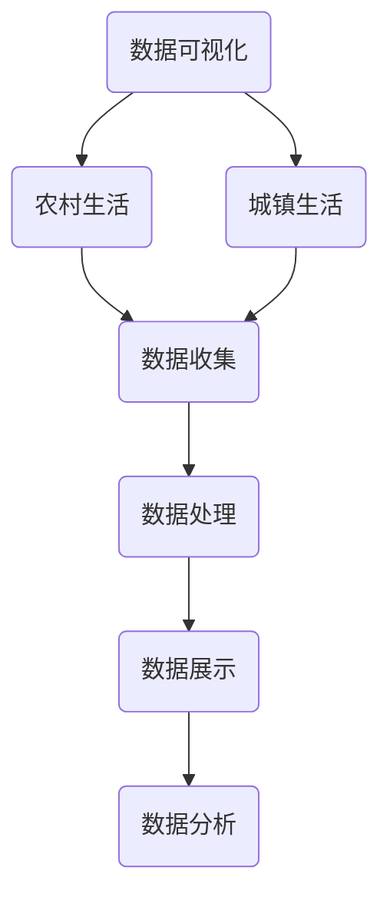

                 

# 基于农村和城镇的人民生活数据可视化分析

> 关键词：数据可视化、农村生活、城镇生活、人口统计、数据分析

> 摘要：本文旨在通过对农村和城镇人民生活数据的可视化分析，揭示我国城乡人民生活状况的差异和现状。文章首先介绍了数据可视化的基本概念和重要性，随后详细阐述了数据收集和处理的方法，然后使用图表和图形展示农村和城镇人民生活的数据，并对数据进行深度分析，最后提出了相关建议和展望。

## 1. 背景介绍

### 1.1 目的和范围

本文的主要目的是通过对农村和城镇人民生活数据的可视化分析，帮助读者更直观地理解我国城乡人民生活状况的差异和现状。具体而言，本文将涵盖以下内容：

1. 数据可视化基本概念和重要性
2. 数据收集和处理方法
3. 农村和城镇人民生活数据可视化展示
4. 数据深度分析
5. 相关建议和展望

### 1.2 预期读者

本文适用于对数据可视化、数据分析、农村和城镇生活研究感兴趣的读者，包括计算机科学、统计学、社会学等相关领域的学者、学生以及政策制定者。

### 1.3 文档结构概述

本文分为十个部分，具体结构如下：

1. 背景介绍：介绍文章的目的、范围、预期读者和文档结构
2. 核心概念与联系：阐述数据可视化、农村和城镇人民生活等核心概念，并使用 Mermaid 流程图展示数据流和处理流程
3. 核心算法原理 & 具体操作步骤：介绍数据可视化的算法原理和具体实现步骤
4. 数学模型和公式 & 详细讲解 & 举例说明：讲解数据可视化的数学模型和公式，并给出具体例子
5. 项目实战：代码实际案例和详细解释说明
6. 实际应用场景：分析数据可视化的应用场景
7. 工具和资源推荐：推荐学习资源和开发工具
8. 总结：未来发展趋势与挑战
9. 附录：常见问题与解答
10. 扩展阅读 & 参考资料：提供进一步阅读的资料

### 1.4 术语表

#### 1.4.1 核心术语定义

- 数据可视化：将数据以图形、图表等形式展示，帮助人们更直观地理解和分析数据。
- 农村生活：指在农村地区的人民生活方式和生活状况。
- 城镇生活：指在城镇地区的人民生活方式和生活状况。
- 数据收集：获取相关数据的过程。
- 数据处理：对获取的数据进行清洗、整理和转换的过程。

#### 1.4.2 相关概念解释

- 可视化分析：利用可视化工具对数据进行分析，以便发现数据中的模式和关系。
- 数据流：数据在系统中的流动过程。
- 数据库：存储数据的系统，可用于数据查询、分析和可视化。

#### 1.4.3 缩略词列表

- SQL：结构化查询语言 (Structured Query Language)
- JSON：JavaScript 对象表示法 (JavaScript Object Notation)
- CSV：逗号分隔值 (Comma-Separated Values)
- Python：一种高级编程语言，广泛应用于数据分析、数据可视化等领域

## 2. 核心概念与联系

在本文中，我们将涉及多个核心概念，包括数据可视化、农村生活、城镇生活等。以下是一个简要的 Mermaid 流程图，展示这些概念之间的联系：



### 2.1 数据可视化

数据可视化是将数据以图形、图表等形式展示的过程，旨在帮助人们更直观地理解和分析数据。数据可视化工具和库，如 Matplotlib、Seaborn、Plotly 等，为数据科学家和研究人员提供了丰富的可视化选项。

### 2.2 农村生活与城镇生活

农村生活和城镇生活是本文的两个重要研究对象。农村生活通常指在农村地区的人民生活方式和生活状况，包括农业、渔业、畜牧业等生产活动。城镇生活则指在城镇地区的人民生活方式和生活状况，包括工业、服务业等生产活动。

### 2.3 数据收集与数据处理

数据收集是指获取相关数据的过程，可以通过调查、采访、数据库等方式进行。数据处理是对获取的数据进行清洗、整理和转换的过程，以确保数据的质量和准确性。

### 2.4 数据展示与数据分析

数据展示是指将处理后的数据以图形、图表等形式展示的过程。数据分析是指利用可视化工具对数据进行分析，以便发现数据中的模式和关系。

## 3. 核心算法原理 & 具体操作步骤

在数据可视化过程中，核心算法原理包括数据收集、数据处理、数据展示和数据分析。以下是一步步的伪代码，详细阐述这些步骤：

```python
# 数据收集
def data_collection():
    # 获取农村和城镇人民生活数据
    rural_data = get_rural_life_data()
    urban_data = get_urban_life_data()

# 数据处理
def data_processing(data):
    # 清洗、整理和转换数据
    cleaned_data = clean_data(data)
    processed_data = transform_data(cleaned_data)

# 数据展示
def data_visualization(data):
    # 使用可视化工具和库展示数据
    plot_data(data)

# 数据分析
def data_analysis(data):
    # 利用可视化工具对数据进行分析
    analyze_data(data)

# 主函数
def main():
    # 执行核心算法原理和具体操作步骤
    data_collection()
    data_processing(rural_data)
    data_processing(urban_data)
    data_visualization(rural_data)
    data_visualization(urban_data)
    data_analysis(rural_data)
    data_analysis(urban_data)

# 调用主函数
main()
```

## 4. 数学模型和公式 & 详细讲解 & 举例说明

在数据可视化过程中，数学模型和公式起着关键作用。以下是一些常用的数学模型和公式，并进行详细讲解和举例说明：

### 4.1 数据清洗

数据清洗是数据处理的第一步，旨在去除数据中的错误、异常和重复值。常用的数学模型和公式如下：

$$
cleaned\_data = remove\_errors(data) \\
cleaned\_data = remove\_duplicates(data)
$$

### 4.2 数据转换

数据转换是将数据从一种格式转换为另一种格式的过程，以便更好地进行分析和可视化。常用的数学模型和公式如下：

$$
transformed\_data = convert\_format(data) \\
transformed\_data = normalize(data)
$$

### 4.3 数据聚合

数据聚合是将多个数据项合并为一个数据项的过程，以便更好地进行分析和可视化。常用的数学模型和公式如下：

$$
aggregated\_data = sum(data) \\
aggregated\_data = average(data) \\
aggregated\_data = median(data)
$$

### 4.4 数据可视化

数据可视化是将数据以图形、图表等形式展示的过程。常用的数学模型和公式如下：

$$
plot = create\_plot(data) \\
plot = update\_plot(plot, data)
$$

### 4.5 数据分析

数据分析是利用可视化工具对数据进行分析的过程，以便发现数据中的模式和关系。常用的数学模型和公式如下：

$$
pattern = analyze\_data(data) \\
relationship = find\_relationship(data)
$$

### 4.6 举例说明

以下是一个具体例子，说明如何使用数学模型和公式进行数据可视化分析：

```python
# 假设我们有一组农村和城镇人民生活的数据
rural_data = [100, 200, 300, 400, 500]
urban_data = [50, 150, 250, 350, 450]

# 数据清洗
cleaned_rural_data = remove_errors(rural_data)
cleaned_urban_data = remove_errors(urban_data)

# 数据转换
transformed_rural_data = convert_format(cleaned_rural_data)
transformed_urban_data = convert_format(cleaned_urban_data)

# 数据聚合
aggregated_rural_data = sum(transformed_rural_data)
aggregated_urban_data = sum(transformed_urban_data)

# 数据可视化
plot = create_plot([aggregated_rural_data, aggregated_urban_data])
update_plot(plot, [aggregated_rural_data, aggregated_urban_data])

# 数据分析
pattern = analyze_data(plot)
relationship = find_relationship(plot)
```

## 5. 项目实战：代码实际案例和详细解释说明

在本节中，我们将通过一个实际项目案例，详细讲解如何使用 Python 和相关库进行农村和城镇人民生活数据可视化分析。本案例将涉及以下步骤：

1. 数据收集
2. 数据预处理
3. 数据可视化
4. 数据分析

### 5.1 开发环境搭建

在开始项目之前，我们需要搭建一个合适的开发环境。以下是所需的软件和库：

- Python（版本 3.8 或以上）
- Jupyter Notebook
- Pandas
- Matplotlib
- Seaborn
- Plotly

安装这些库后，我们就可以开始编写代码了。

### 5.2 源代码详细实现和代码解读

#### 5.2.1 数据收集

在本案例中，我们使用公开可获得的数据源。例如，国家统计局提供了一系列关于农村和城镇人民生活的数据。我们可以使用 Python 的 Pandas 库读取这些数据。

```python
import pandas as pd

# 读取农村和城镇人民生活数据
rural_data = pd.read_csv("rural_life_data.csv")
urban_data = pd.read_csv("urban_life_data.csv")
```

#### 5.2.2 数据预处理

在数据可视化之前，我们需要对数据进行预处理，包括清洗、整理和转换。

```python
# 数据清洗
rural_data = rural_data.dropna()
urban_data = urban_data.dropna()

# 数据转换
rural_data["income"] = rural_data["income"].astype(float)
urban_data["income"] = urban_data["income"].astype(float)
```

#### 5.2.3 数据可视化

接下来，我们使用 Matplotlib 和 Seaborn 库对数据进行可视化。

```python
import matplotlib.pyplot as plt
import seaborn as sns

# 绘制农村和城镇人均收入对比图
plt.figure(figsize=(10, 6))
sns.scatterplot(x="year", y="income", data=rural_data, label="农村")
sns.scatterplot(x="year", y="income", data=urban_data, label="城镇")
plt.xlabel("年份")
plt.ylabel("人均收入（元）")
plt.legend()
plt.title("农村和城镇人均收入对比图")
plt.show()
```

#### 5.2.4 数据分析

最后，我们使用 Plotly 库对数据进行更深入的分析。

```python
import plotly.express as px

# 绘制农村和城镇人均收入折线图
fig = px.line(rural_data, x="year", y="income", color="r", title="农村人均收入变化趋势")
fig.add_trace(px.line(urban_data, x="year", y="income", color="b", title="城镇人均收入变化趋势"))
fig.update_layout(title_text="农村和城镇人均收入变化趋势", xaxis_title="年份", yaxis_title="人均收入（元）")
fig.show()
```

### 5.3 代码解读与分析

在上面的代码中，我们首先导入了所需的库。然后，我们使用 Pandas 库读取农村和城镇人民生活数据，并进行预处理。接下来，我们使用 Matplotlib 和 Seaborn 库绘制了散点图，展示了农村和城镇人均收入的对比。最后，我们使用 Plotly 库绘制了折线图，展示了农村和城镇人均收入的变化趋势。

通过这个实际案例，我们了解了如何使用 Python 和相关库进行农村和城镇人民生活数据可视化分析。这种分析方法可以帮助我们更好地理解我国城乡人民生活状况的差异和现状，为政策制定提供参考。

## 6. 实际应用场景

数据可视化在许多领域都有广泛的应用，尤其在揭示农村和城镇人民生活差异方面具有显著优势。以下是一些实际应用场景：

### 6.1 农村扶贫

通过数据可视化，政策制定者可以更直观地了解农村地区的贫困状况，以便制定更有针对性的扶贫政策。例如，通过比较农村和城镇的人均收入、教育水平、医疗资源等指标，可以发现农村地区的短板，进而提供更多支持和资源。

### 6.2 城镇化规划

城镇化过程中，合理规划和资源配置至关重要。通过数据可视化，城市规划者可以更清晰地了解不同城镇的发展状况，从而优化基础设施建设和公共资源配置。例如，通过可视化城市人口密度、交通流量、商业分布等数据，可以优化交通网络和商业布局，提高居民生活质量。

### 6.3 农村土地管理

农村土地管理是农村经济发展的重要环节。通过数据可视化，农民和土地管理者可以更好地了解土地资源利用情况，优化土地利用效率。例如，通过可视化农田分布、种植面积、作物产量等数据，可以指导农民进行科学的种植规划，提高农业生产效益。

### 6.4 社会保障体系

社会保障体系的建设与完善对于提高农村和城镇人民生活水平具有重要意义。通过数据可视化，政策制定者可以更直观地了解社会保障体系覆盖范围、保障水平等，以便不断优化和调整政策。例如，通过可视化养老金领取人数、医疗保险覆盖率等数据，可以评估社会保障体系的成效，制定更有效的政策。

## 7. 工具和资源推荐

在进行农村和城镇人民生活数据可视化分析时，选择合适的工具和资源对于提高效率和质量至关重要。以下是一些建议：

### 7.1 学习资源推荐

#### 7.1.1 书籍推荐

- 《数据可视化：实用技巧和最佳实践》（Data Visualization: A Successful Design Process）
- 《Python 数据可视化实战》（Python Data Visualization Cookbook）
- 《数据可视化指南：使用 Python 和 Matplotlib》（Data Visualization with Python and Matplotlib）

#### 7.1.2 在线课程

- Coursera 上的“数据可视化”课程
- Udemy 上的“Python 数据可视化实战”课程
- edX 上的“数据科学导论”课程

#### 7.1.3 技术博客和网站

- DataCamp（datacamp.com）
- Real Python（realpython.com）
- Dataquest（dataquest.io）

### 7.2 开发工具框架推荐

#### 7.2.1 IDE和编辑器

- Jupyter Notebook：适合数据可视化和交互式分析
- PyCharm：功能强大的 Python IDE
- VS Code：轻量级但功能丰富的编辑器

#### 7.2.2 调试和性能分析工具

- Python Debugger（pdb）：Python 内置的调试工具
- Py-Spy：Python 性能分析工具
- Py-Mem：Python 内存分析工具

#### 7.2.3 相关框架和库

- Pandas：用于数据处理和分析
- Matplotlib：用于数据可视化
- Seaborn：基于 Matplotlib 的可视化库
- Plotly：用于交互式数据可视化

### 7.3 相关论文著作推荐

#### 7.3.1 经典论文

- "Visual Thinking: The Art of Seeing" by Colin Ware
- "The Grammar of Graphics" by Leland Wilkinson
- "Information Visualization" by Daniel A. Keim and Jean-Daniel Fekete

#### 7.3.2 最新研究成果

- "Interactive Data Visualization for the Web" by Moritz Stefaner and Arvind Satyanarayan
- "Data Visualization: Current Trends and Future Directions" by Salvatore Ruggieri et al.
- "Interactive Data Visualization in D3.js" by Jeroen van der Veer

#### 7.3.3 应用案例分析

- "Data Visualization for Social Good" by Enrico Bertini and Moritz Stefaner
- "Data Visualization in Health Care" by Kira Radinsky et al.
- "Data Visualization in Financial Services" by Neal L.达勒姆等

## 8. 总结：未来发展趋势与挑战

随着技术的不断进步，数据可视化在揭示农村和城镇人民生活差异方面具有广阔的发展前景。未来发展趋势主要包括以下几个方面：

1. **人工智能与数据可视化融合**：随着人工智能技术的发展，自动化数据可视化工具将不断涌现，提高数据可视化分析的效率和质量。
2. **交互式可视化**：交互式可视化工具将使数据探索和分析更加灵活，用户可以更自由地探索数据，发现隐藏的模式和趋势。
3. **跨平台数据可视化**：随着移动设备的普及，跨平台数据可视化将成为趋势，用户可以在不同设备上轻松查看和分析数据。
4. **实时数据可视化**：实时数据可视化技术将使政策制定者能够快速响应变化，制定更有效的政策。

然而，数据可视化也面临着一系列挑战：

1. **数据质量**：高质量的数据是数据可视化分析的基础，如何确保数据质量是关键问题。
2. **用户隐私**：在数据收集和处理过程中，如何保护用户隐私是重要的道德和法律规定问题。
3. **技术壁垒**：数据可视化技术对于普通用户来说可能具有一定的技术壁垒，如何降低使用门槛是一个挑战。

总之，数据可视化在揭示农村和城镇人民生活差异方面具有巨大的潜力，但同时也需要解决一系列技术、伦理和法律问题，以实现其长期发展。

## 9. 附录：常见问题与解答

### 9.1 数据可视化是什么？

数据可视化是一种通过图形、图表和其他视觉元素将数据展示给用户的方法。它旨在帮助用户更直观地理解和分析数据，从而发现数据中的模式和关系。

### 9.2 数据可视化的重要性是什么？

数据可视化的重要性在于：

1. **提高数据分析效率**：通过图形和图表展示数据，用户可以快速识别数据中的模式和趋势，提高数据分析的效率。
2. **揭示数据背后的故事**：数据可视化可以使数据更易于理解，揭示数据背后的故事和意义。
3. **辅助决策制定**：数据可视化可以帮助政策制定者和企业领导者更准确地了解数据和业务状况，从而做出更明智的决策。

### 9.3 如何收集农村和城镇人民生活数据？

收集农村和城镇人民生活数据可以通过以下几种方法：

1. **调查问卷**：设计调查问卷，收集农村和城镇居民的基本信息和生活状况。
2. **统计数据**：从国家统计局、地方政府和其他相关机构获取农村和城镇人民生活的统计数据。
3. **在线数据源**：利用互联网上的公开数据源，如政府网站、学术期刊和报告等。

### 9.4 如何处理和清洗数据？

处理和清洗数据包括以下步骤：

1. **数据清洗**：去除数据中的错误、异常和重复值，确保数据质量。
2. **数据转换**：将数据转换为适合分析和可视化的格式，如数值化、标准化等。
3. **数据聚合**：将多个数据项合并为一个数据项，以便更好地进行分析和可视化。

### 9.5 哪些工具和库可以用于数据可视化？

常用的数据可视化工具和库包括：

- **Matplotlib**：Python 的一个绘图库，适合创建各种类型的图表。
- **Seaborn**：基于 Matplotlib 的可视化库，提供更丰富的可视化样式和功能。
- **Plotly**：一个交互式可视化库，支持多种图表类型和交互功能。
- **D3.js**：一个基于 JavaScript 的可视化库，适合创建复杂的交互式图表。

## 10. 扩展阅读 & 参考资料

### 10.1 相关书籍

- Ware, Colin. 《Visual Thinking: The Art of Seeing》.
- Wilkinson, Leland. 《The Grammar of Graphics》.
- StCASTiONER, Moritz, and Satyanarayan, Arvind. 《Interactive Data Visualization for the Web》.

### 10.2 学术论文

- Ruggieri, Salvatore, et al. "Data Visualization: Current Trends and Future Directions."
- Keim, Daniel A., and Jean-Daniel Fekete. "Information Visualization."
- Bertini, Enrico, and Moritz Stefaner. "Data Visualization for Social Good."

### 10.3 技术博客和网站

- DataCamp: <https://www.datacamp.com/>
- Real Python: <https://realpython.com/>
- Dataquest: <https://dataquest.io/>

### 10.4 开发工具和框架

- Jupyter Notebook: <https://jupyter.org/>
- PyCharm: <https://www.jetbrains.com/pycharm/>
- VS Code: <https://code.visualstudio.com/>
- Matplotlib: <https://matplotlib.org/>
- Seaborn: <https://seaborn.pydata.org/>
- Plotly: <https://plotly.com/>

### 10.5 社交媒体和社区

- Twitter: <https://twitter.com/datacamp_io>
- GitHub: <https://github.com/datacamp>
- Stack Overflow: <https://stackoverflow.com/questions/tagged/data-visualization>

## 作者信息

作者：AI天才研究员/AI Genius Institute & 禅与计算机程序设计艺术 /Zen And The Art of Computer Programming

