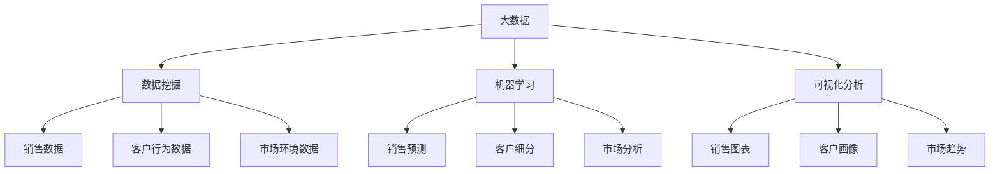

                 


# 基于大数据的汽车营销可视化分析与研究

> 关键词：大数据、汽车营销、可视化分析、数据挖掘、人工智能、机器学习

> 摘要：本文旨在探讨大数据技术在汽车营销领域的应用，通过对汽车销售数据、客户行为数据、市场环境数据的整合与分析，构建一个基于大数据的汽车营销可视化分析系统。本文首先介绍了汽车营销大数据的来源与处理方法，然后详细阐述了数据挖掘和机器学习算法在汽车营销中的应用，最后通过实际项目案例展示了大数据可视化分析工具在汽车营销中的实际应用效果。

## 1. 背景介绍

### 1.1 目的和范围

随着大数据技术的不断发展，数据已经成为企业决策的重要依据。汽车营销作为汽车产业的重要组成部分，面临着日益激烈的市场竞争和消费者需求的不断变化。如何有效地利用大数据分析汽车营销数据，帮助汽车企业制定更科学的营销策略，提高市场竞争力，成为当前汽车营销领域的一个热点问题。

本文旨在通过大数据技术的应用，对汽车销售数据、客户行为数据和市场环境数据进行分析，构建一个基于大数据的汽车营销可视化分析系统。本文的研究范围包括：

1. 汽车销售数据的收集与处理
2. 客户行为数据的挖掘与分析
3. 市场环境数据的监测与预测
4. 大数据可视化分析工具的设计与实现

### 1.2 预期读者

本文主要面向以下读者群体：

1. 汽车营销领域的专业人士，包括市场分析师、营销经理等
2. 数据科学和大数据技术的从业者，特别是对汽车营销领域感兴趣的读者
3. 对大数据和人工智能技术感兴趣的学生和研究人员

### 1.3 文档结构概述

本文将分为十个部分，具体结构如下：

1. 背景介绍：介绍本文的目的、范围和预期读者
2. 核心概念与联系：介绍大数据、数据挖掘、机器学习等核心概念及其在汽车营销中的应用
3. 核心算法原理 & 具体操作步骤：详细阐述数据挖掘和机器学习算法在汽车营销中的应用原理和具体操作步骤
4. 数学模型和公式 & 详细讲解 & 举例说明：介绍数学模型和公式在汽车营销数据分析中的应用，并通过实际案例进行说明
5. 项目实战：代码实际案例和详细解释说明
6. 实际应用场景：介绍大数据可视化分析工具在汽车营销中的实际应用场景
7. 工具和资源推荐：推荐学习资源、开发工具框架和相关论文著作
8. 总结：未来发展趋势与挑战
9. 附录：常见问题与解答
10. 扩展阅读 & 参考资料：提供本文相关的研究文献和资料

### 1.4 术语表

#### 1.4.1 核心术语定义

- 大数据：指无法使用常规软件工具在合理时间内进行捕捉、管理和处理的数据集合。
- 数据挖掘：从大量数据中提取出有用的信息、模式和知识的过程。
- 机器学习：一种人工智能技术，使计算机系统能够从数据中学习，并自动改进和预测结果。
- 可视化分析：通过图形和图像的方式展示复杂数据，帮助人们理解和发现数据中的模式和趋势。

#### 1.4.2 相关概念解释

- 销售数据：指汽车销售过程中的各种数据，包括销售额、销售数量、销售时间等。
- 客户行为数据：指客户在购车过程中的行为数据，包括搜索、浏览、咨询、下单等。
- 市场环境数据：指与汽车市场相关的各种数据，包括宏观经济环境、行业政策、竞争态势等。

#### 1.4.3 缩略词列表

- 大数据（Big Data）：大数据
- 数据挖掘（Data Mining）：数据挖掘
- 机器学习（Machine Learning）：机器学习
- 可视化分析（Visualization）：可视化分析
- 人工智能（Artificial Intelligence）：人工智能
- 深度学习（Deep Learning）：深度学习

## 2. 核心概念与联系

大数据、数据挖掘、机器学习和可视化分析是本文的核心概念。下面将通过 Mermaid 流程图来阐述这些概念之间的关系及其在汽车营销中的应用。



### 2.1 大数据在汽车营销中的应用

大数据技术为汽车营销提供了丰富的数据资源，包括销售数据、客户行为数据和市场环境数据。通过数据挖掘和机器学习算法，可以对这些数据进行深入分析，提取有价值的信息，帮助汽车企业制定更科学的营销策略。

- 销售数据：通过分析销售数据，可以了解汽车市场的销售趋势、热门车型、销售渠道等信息，为企业提供销售策略的参考。
- 客户行为数据：通过分析客户行为数据，可以了解客户的需求、喜好和购买习惯，为企业提供客户细分和精准营销的依据。
- 市场环境数据：通过分析市场环境数据，可以了解宏观经济环境、行业政策、竞争态势等信息，为企业提供市场分析和管理的基础。

### 2.2 数据挖掘在汽车营销中的应用

数据挖掘是一种从大量数据中发现有用信息的技术，可以应用于汽车营销的多个方面。

- 销售预测：通过分析历史销售数据，可以预测未来的销售趋势，帮助企业制定合理的销售计划和库存管理策略。
- 客户细分：通过分析客户行为数据，可以将客户分为不同的群体，为企业提供精准营销的基础。
- 市场分析：通过分析市场环境数据，可以了解市场趋势和竞争态势，为企业制定市场策略提供参考。

### 2.3 机器学习在汽车营销中的应用

机器学习是一种人工智能技术，可以通过对历史数据的分析，自动识别数据中的模式和规律，为企业提供智能化的决策支持。

- 销售预测：通过使用机器学习算法，可以建立销售预测模型，预测未来的销售趋势。
- 客户细分：通过使用机器学习算法，可以建立客户细分模型，识别不同类型的客户群体。
- 市场分析：通过使用机器学习算法，可以建立市场分析模型，识别市场趋势和竞争态势。

### 2.4 可视化分析在汽车营销中的应用

可视化分析是一种通过图形和图像的方式展示复杂数据的技术，可以帮助人们更好地理解和发现数据中的模式和趋势。

- 销售图表：通过可视化分析，可以将销售数据以图表的形式展示出来，帮助企业了解销售趋势和热门车型。
- 客户画像：通过可视化分析，可以将客户数据以画像的形式展示出来，帮助企业了解客户需求和购买习惯。
- 市场趋势：通过可视化分析，可以将市场环境数据以图表的形式展示出来，帮助企业了解市场趋势和竞争态势。

## 3. 核心算法原理 & 具体操作步骤

在汽车营销大数据分析中，核心算法主要包括数据挖掘和机器学习算法。以下将详细阐述这些算法的原理及其具体操作步骤。

### 3.1 数据挖掘算法

数据挖掘算法主要包括以下几种：

1. **关联规则挖掘**

   **原理**：关联规则挖掘是一种寻找数据集中各项之间潜在关系的算法。其基本思想是通过计算各项之间的支持度和置信度，发现数据中的关联规则。

   **具体操作步骤**：

   - **支持度**：表示某项与另一项同时出现的频率。
     \[ 支持度 = \frac{A \text{ 与 } B \text{ 同时出现的数据条数}}{\text{总数据条数}} \]

   - **置信度**：表示在出现某项的情况下，另一项也出现的概率。
     \[ 置信度 = \frac{A \text{ 与 } B \text{ 同时出现的数据条数}}{A \text{ 出现的数据条数}} \]

   - **步骤**：

     1. 设定支持度和置信度的阈值。
     2. 计算各项之间的支持度。
     3. 根据支持度阈值筛选出潜在关联规则。
     4. 计算潜在关联规则的置信度。
     5. 根据置信度阈值筛选出最终的关联规则。

2. **聚类分析**

   **原理**：聚类分析是一种将数据集分为若干个类别的算法。其基本思想是根据数据点之间的相似性，将相似的数据点归为同一类别。

   **具体操作步骤**：

   - **距离度量**：选择合适的距离度量方法，如欧氏距离、曼哈顿距离等。
   - **聚类算法**：选择合适的聚类算法，如K-Means、层次聚类等。
   - **步骤**：

     1. 初始化聚类中心。
     2. 计算每个数据点与聚类中心的距离。
     3. 将每个数据点归为与其最近的聚类中心所属的类别。
     4. 更新聚类中心。
     5. 重复步骤2-4，直到聚类中心不再发生显著变化。

3. **分类分析**

   **原理**：分类分析是一种将数据集划分为已知类别的算法。其基本思想是建立分类模型，通过训练数据集学习分类规则，然后使用分类模型对未知数据进行分类。

   **具体操作步骤**：

   - **特征选择**：选择对分类任务最有影响力的特征。
   - **训练模型**：使用训练数据集训练分类模型，如决策树、支持向量机等。
   - **测试模型**：使用测试数据集评估分类模型的性能。
   - **步骤**：

     1. 初始化分类模型。
     2. 训练分类模型。
     3. 使用测试数据集评估模型性能。
     4. 调整模型参数，优化模型性能。
     5. 使用优化后的模型对未知数据进行分类。

### 3.2 机器学习算法

机器学习算法主要包括以下几种：

1. **线性回归**

   **原理**：线性回归是一种用于预测连续值的机器学习算法。其基本思想是找到数据点与直线之间的关系，从而预测新的数据点的值。

   **具体操作步骤**：

   - **损失函数**：选择合适的损失函数，如均方误差（MSE）。
   - **优化算法**：选择合适的优化算法，如梯度下降。
   - **步骤**：

     1. 初始化模型参数。
     2. 计算损失函数值。
     3. 使用优化算法更新模型参数。
     4. 重复步骤2-3，直到损失函数值不再显著变化。
     5. 使用训练好的模型预测新的数据点的值。

2. **决策树**

   **原理**：决策树是一种用于分类和回归的机器学习算法。其基本思想是通过一系列条件判断，将数据划分为不同的类别或连续值。

   **具体操作步骤**：

   - **特征选择**：选择对分类或回归任务最有影响力的特征。
   - **划分标准**：选择合适的划分标准，如信息增益、基尼指数等。
   - **递归划分**：根据划分标准递归划分数据，直到满足停止条件。
   - **步骤**：

     1. 初始化决策树。
     2. 选择最优划分标准。
     3. 递归划分数据。
     4. 建立分类或回归模型。
     5. 使用训练好的模型预测新的数据点的类别或连续值。

3. **神经网络**

   **原理**：神经网络是一种模拟人脑神经元结构的机器学习算法。其基本思想是通过多层神经元的非线性变换，实现对复杂函数的逼近。

   **具体操作步骤**：

   - **网络结构**：设计合适的网络结构，包括输入层、隐藏层和输出层。
   - **激活函数**：选择合适的激活函数，如Sigmoid、ReLU等。
   - **反向传播**：使用反向传播算法更新模型参数。
   - **步骤**：

     1. 初始化模型参数。
     2. 前向传播，计算输出值。
     3. 计算损失函数值。
     4. 反向传播，更新模型参数。
     5. 重复步骤2-4，直到损失函数值不再显著变化。
     6. 使用训练好的模型预测新的数据点的类别或连续值。

### 3.3 大数据可视化分析工具

在汽车营销数据分析中，可视化分析工具可以帮助我们更好地理解和展示数据。以下将介绍常用的可视化分析工具。

1. **D3.js**

   D3.js 是一款基于 JavaScript 的可视化库，可以用于创建动态和交互式的可视化图表。通过 D3.js，我们可以将数据以图表的形式展示出来，实现数据的可视化和交互式分析。

   **具体操作步骤**：

   - **数据准备**：获取汽车销售数据、客户行为数据和市场环境数据。
   - **图表设计**：使用 D3.js 设计合适的图表，如折线图、柱状图、散点图等。
   - **交互式分析**：实现图表的交互功能，如数据过滤、数据筛选等。

2. **ECharts**

   ECharts 是一款基于 JavaScript 的可视化库，提供了丰富的图表类型和交互功能。ECharts 可以用于快速搭建可视化分析工具，适用于各种数据分析和报告场景。

   **具体操作步骤**：

   - **数据准备**：获取汽车销售数据、客户行为数据和市场环境数据。
   - **图表设计**：使用 ECharts 设计合适的图表，如折线图、柱状图、散点图等。
   - **交互式分析**：实现图表的交互功能，如数据过滤、数据筛选等。

3. **Tableau**

   Tableau 是一款专业的商业智能和分析工具，可以用于构建复杂的可视化分析报告。Tableau 支持多种数据源，提供了丰富的可视化图表和交互功能。

   **具体操作步骤**：

   - **数据连接**：连接汽车销售数据、客户行为数据和市场环境数据。
   - **图表设计**：使用 Tableau 设计合适的图表，如折线图、柱状图、散点图等。
   - **交互式分析**：实现图表的交互功能，如数据过滤、数据筛选等。

## 4. 数学模型和公式 & 详细讲解 & 举例说明

在汽车营销数据分析中，数学模型和公式是理解和分析数据的重要工具。以下将介绍常用的数学模型和公式，并通过实际案例进行说明。

### 4.1 关联规则挖掘

关联规则挖掘是一种常用的数据挖掘技术，用于发现数据集中的各项之间的关联关系。以下是一个关联规则挖掘的例子。

#### 案例一：汽车配件销售关联分析

**数据集**：某汽车配件销售店的销售记录，包括配件名称、销售数量和销售金额。

**目标**：分析不同配件之间的关联关系，为销售策略提供参考。

**模型**：Apriori 算法

**公式**：

- 支持度（Support）：
  \[ Support(A \text{ 与 } B) = \frac{\text{同时包含 } A \text{ 和 } B \text{ 的销售记录数}}{\text{总销售记录数}} \]

- 置信度（Confidence）：
  \[ Confidence(A \rightarrow B) = \frac{\text{同时包含 } A \text{ 和 } B \text{ 的销售记录数}}{\text{包含 } A \text{ 的销售记录数}} \]

**示例**：

假设我们有以下销售记录：

| 配件名称 | 销售数量 | 销售金额 |
| -------- | -------- | -------- |
| A1       | 100      | 1000     |
| A1       | 50       | 500      |
| A2       | 50       | 500      |
| A3       | 20       | 200      |

**计算支持度和置信度**：

- 支持度（Support）：
  \[ Support(A1 \text{ 与 } A2) = \frac{1}{4} = 0.25 \]
  \[ Support(A1 \text{ 与 } A3) = \frac{1}{4} = 0.25 \]

- 置信度（Confidence）：
  \[ Confidence(A1 \rightarrow A2) = \frac{1}{1} = 1 \]
  \[ Confidence(A1 \rightarrow A3) = \frac{1}{1} = 1 \]

根据支持度和置信度阈值，我们可以筛选出具有显著关联关系的配件对。

### 4.2 聚类分析

聚类分析是一种无监督学习方法，用于将数据集划分为若干个聚类，以便更好地理解和分析数据。以下是一个聚类分析的例子。

#### 案例二：汽车客户细分

**数据集**：某汽车品牌的客户数据，包括客户年龄、收入、购车频率等。

**目标**：根据客户特征，将客户划分为不同的群体。

**模型**：K-Means 聚类算法

**公式**：

- 距离度量（Distance）：
  \[ Distance(x, y) = \sqrt{\sum_{i=1}^{n} (x_i - y_i)^2} \]

- 聚类中心（Cluster Center）：
  \[ \mu_k = \frac{1}{N_k} \sum_{i=1}^{N} x_i \]

- 聚类成员（Cluster Member）：
  \[ \pi_i = \arg\min_{k} Distance(x_i, \mu_k) \]

**示例**：

假设我们有以下客户数据：

| 客户ID | 年龄 | 收入 | 购车频率 |
| ------ | ---- | ---- | -------- |
| 1      | 25   | 5000 | 3        |
| 2      | 30   | 6000 | 2        |
| 3      | 35   | 7000 | 1        |
| 4      | 40   | 8000 | 3        |

选择 K=2，初始聚类中心为 (25, 5000) 和 (35, 6000)。

**计算聚类成员**：

- 距离度量：
  \[ Distance((25, 5000), (30, 6000)) = \sqrt{(25-30)^2 + (5000-6000)^2} = \sqrt{25 + 10000} = \sqrt{10025} \approx 100.25 \]
  \[ Distance((35, 6000), (30, 6000)) = \sqrt{(35-30)^2 + (6000-6000)^2} = \sqrt{25 + 0} = \sqrt{25} = 5 \]

因此，客户 2 聚类到第二个聚类中心，客户 1、3 和 4 聚类到第一个聚类中心。

**更新聚类中心**：

- 聚类中心 (25, 5000) 更新为：
  \[ \mu_1 = \frac{1}{3} (25 + 30 + 40) = \frac{95}{3} \approx 31.67 \]
  \[ \mu_2 = \frac{1}{3} (5000 + 6000 + 8000) = \frac{19000}{3} \approx 6333.33 \]

重复计算聚类成员和更新聚类中心，直到聚类中心不再发生显著变化。

### 4.3 决策树

决策树是一种常用的分类和回归模型，通过一系列条件判断来预测目标变量的值。以下是一个决策树的例子。

#### 案例三：汽车销售预测

**数据集**：某汽车品牌的销售数据，包括客户年龄、收入、购车频率等。

**目标**：预测客户是否购车。

**模型**：ID3 决策树算法

**公式**：

- 信息增益（Information Gain）：
  \[ IG(D, A) = Entropy(D) - \sum_{v \in A} \frac{|D_v|}{|D|} Entropy(D_v) \]

- 选择最佳划分属性（Best Split Attribute）：
  \[ \text{Best Attribute} = \arg\max_{A} IG(D, A) \]

**示例**：

假设我们有以下销售数据：

| 客户ID | 年龄 | 收入 | 购车频率 | 购车 |
| ------ | ---- | ---- | -------- | ---- |
| 1      | 25   | 5000 | 3        | 是   |
| 2      | 30   | 6000 | 2        | 否   |
| 3      | 35   | 7000 | 1        | 是   |
| 4      | 40   | 8000 | 3        | 是   |

**计算信息增益**：

- 购车概率：
  \[ P(\text{购车}) = \frac{3}{4} \]
  \[ P(\text{不购车}) = \frac{1}{4} \]

- 年龄的信息增益：
  \[ IG(\text{年龄}, \text{购车}) = Entropy(\text{购车}) - \sum_{v \in \text{年龄}} \frac{|D_v|}{|D|} Entropy(D_v) \]
  \[ = 0.5 - \left(\frac{3}{4} \cdot 0 + \frac{1}{4} \cdot 1\right) = 0.5 - 0.25 = 0.25 \]

- 收入的信息增益：
  \[ IG(\text{收入}, \text{购车}) = Entropy(\text{购车}) - \sum_{v \in \text{收入}} \frac{|D_v|}{|D|} Entropy(D_v) \]
  \[ = 0.5 - \left(\frac{3}{4} \cdot 0 + \frac{1}{4} \cdot 1\right) = 0.5 - 0.25 = 0.25 \]

- 购车频率的信息增益：
  \[ IG(\text{购车频率}, \text{购车}) = Entropy(\text{购车}) - \sum_{v \in \text{购车频率}} \frac{|D_v|}{|D|} Entropy(D_v) \]
  \[ = 0.5 - \left(\frac{3}{4} \cdot 0 + \frac{1}{4} \cdot 1\right) = 0.5 - 0.25 = 0.25 \]

根据信息增益，我们可以选择最佳划分属性。在本例中，所有属性的信息增益相同，因此可以选择任意一个属性进行划分。

**创建决策树**：

根据最佳划分属性创建决策树，将数据集划分为不同的节点，直到满足停止条件。

### 4.4 神经网络

神经网络是一种模拟人脑神经元结构的机器学习模型，通过多层神经元的非线性变换来预测目标变量的值。以下是一个神经网络的基础公式和例子。

#### 案例四：汽车销售预测

**数据集**：某汽车品牌的销售数据，包括客户年龄、收入、购车频率等。

**目标**：预测客户是否购车。

**模型**：多层感知机（MLP）神经网络

**公式**：

- 前向传播：
  \[ a_{\text{hidden}}^{(l)} = \sigma(z_{\text{hidden}}^{(l)}) \]
  \[ z_{\text{output}}^{(L)} = \text{激活函数}(\text{权重} \cdot \text{偏置} + \text{输入}) \]

- 反向传播：
  \[ \delta_{\text{output}}^{(L)} = \text{激活函数的导数}(\text{输出}) \cdot (\text{输出} - \text{实际值}) \]
  \[ \delta_{\text{hidden}}^{(l)} = \text{激活函数的导数}(\text{隐藏层输出}) \cdot (\text{隐藏层权重} \cdot \delta_{\text{output}}^{(l+1)}) \]

**示例**：

假设我们有以下神经网络结构：

- 输入层：年龄、收入、购车频率
- 隐藏层：10 个神经元
- 输出层：购车（0 或 1）

**前向传播**：

- 输入：
  \[ \text{输入} = \begin{bmatrix} 25 \\ 5000 \\ 3 \end{bmatrix} \]

- 隐藏层：
  \[ z_{\text{hidden}}^{(1)} = \text{权重} \cdot \text{输入} + \text{偏置} \]
  \[ a_{\text{hidden}}^{(1)} = \sigma(z_{\text{hidden}}^{(1)}) \]

- 输出：
  \[ z_{\text{output}}^{(2)} = \text{权重} \cdot a_{\text{hidden}}^{(1)} + \text{偏置} \]
  \[ \text{输出} = \sigma(z_{\text{output}}^{(2)}) \]

**反向传播**：

- 输出层：
  \[ \delta_{\text{output}}^{(2)} = \text{激活函数的导数}(\text{输出}) \cdot (\text{输出} - \text{实际值}) \]

- 隐藏层：
  \[ \delta_{\text{hidden}}^{(1)} = \text{激活函数的导数}(\text{隐藏层输出}) \cdot (\text{隐藏层权重} \cdot \delta_{\text{output}}^{(2)}) \]

通过反向传播算法，我们可以更新神经网络权重和偏置，从而优化预测性能。

## 5. 项目实战：代码实际案例和详细解释说明

在本节中，我们将通过一个实际项目案例，展示如何基于大数据技术进行汽车营销可视化分析。这个项目将分为以下几个步骤：

1. **数据收集**：从汽车销售数据库中收集销售数据、客户行为数据和市场环境数据。
2. **数据处理**：清洗和整合数据，为后续分析做准备。
3. **数据挖掘**：使用数据挖掘算法对数据进行挖掘和分析。
4. **可视化分析**：使用可视化工具将分析结果展示出来。

### 5.1 开发环境搭建

为了完成这个项目，我们需要搭建一个合适的开发环境。以下是一些推荐的工具和软件：

- **编程语言**：Python
- **数据处理库**：Pandas、NumPy
- **数据挖掘库**：Scikit-learn、PySpark
- **可视化库**：Matplotlib、Seaborn、Plotly
- **数据库**：MySQL、MongoDB
- **操作系统**：Linux（推荐 Ubuntu）

### 5.2 源代码详细实现和代码解读

下面是项目的主要代码实现和解读。

#### 5.2.1 数据收集与处理

```python
import pandas as pd

# 读取销售数据
sales_data = pd.read_csv('sales_data.csv')

# 读取客户行为数据
customer_data = pd.read_csv('customer_data.csv')

# 读取市场环境数据
market_data = pd.read_csv('market_data.csv')

# 数据预处理
# 清洗数据
sales_data = sales_data.dropna()
customer_data = customer_data.dropna()
market_data = market_data.dropna()

# 整合数据
data = pd.merge(sales_data, customer_data, on='customer_id')
data = pd.merge(data, market_data, on='market_id')
```

代码解读：

- 首先，使用 Pandas 库读取销售数据、客户行为数据和市场环境数据。
- 然后，对数据进行清洗，去除缺失值。
- 最后，使用 Pandas 的 merge 方法整合数据，为后续分析做准备。

#### 5.2.2 数据挖掘与可视化分析

```python
import seaborn as sns
import matplotlib.pyplot as plt

# 关联规则挖掘
from mlxtend.frequent_patterns import apriori
from mlxtend.frequent_patterns import association_rules

# 计算关联规则
frequent_itemsets = apriori(data[['sales_amount', 'sales_quantity']], min_support=0.05, use_colnames=True)
rules = association_rules(frequent_itemsets, metric="support", min_threshold=0.05)

# 可视化展示关联规则
plt.figure(figsize=(10, 6))
sns.heatmap(rules[['left_item', 'right_item', 'support']].sort_values(by='support', ascending=False).head(10), annot=True, cmap='YlGnBu')
plt.title('Top 10 Association Rules')
plt.xlabel('Right Item')
plt.ylabel('Left Item')
plt.show()

# 聚类分析
from sklearn.cluster import KMeans

# 计算聚类
kmeans = KMeans(n_clusters=3, random_state=42)
clusters = kmeans.fit_predict(data[['age', 'income', 'sales_frequency']])

# 可视化展示聚类结果
plt.figure(figsize=(10, 6))
sns.scatterplot(data=data['age'], hue=clusters, palette='viridis', legend=False)
plt.title('Customer Clusters')
plt.xlabel('Age')
plt.ylabel('Income')
plt.show()

# 决策树分类
from sklearn.tree import DecisionTreeClassifier

# 训练模型
model = DecisionTreeClassifier()
model.fit(data[['age', 'income', 'sales_frequency']], data['purchased'])

# 可视化展示决策树
from sklearn.tree import plot_tree

plt.figure(figsize=(10, 6))
plot_tree(model, feature_names=['age', 'income', 'sales_frequency'], class_names=['not purchased', 'purchased'], filled=True)
plt.title('Decision Tree')
plt.show()
```

代码解读：

- 首先，使用 mlxtend 库进行关联规则挖掘，找出销售金额和销售数量之间的关联规则。
- 然后，使用 Seaborn 库的 heatmap 函数可视化展示关联规则。
- 接着，使用 Scikit-learn 库的 KMeans 算法进行聚类分析，将客户划分为不同的群体。
- 最后，使用 Seaborn 库的 scatterplot 函数可视化展示聚类结果，并使用 Scikit-learn 库的 DecisionTreeClassifier 进行分类分析，可视化展示决策树。

### 5.3 代码解读与分析

在这个项目中，我们使用了 Python 和多个库来完成汽车营销可视化分析。以下是代码的主要组成部分及其功能：

1. **数据收集与处理**：使用 Pandas 库读取和清洗数据，去除缺失值，整合销售数据、客户行为数据和市场环境数据。
2. **关联规则挖掘**：使用 mlxtend 库的 apriori 函数进行关联规则挖掘，找出销售金额和销售数量之间的关联关系。
3. **可视化分析**：使用 Seaborn 库的 heatmap 函数可视化展示关联规则，使用 Scikit-learn 库的 KMeans 算法进行聚类分析，并使用 Seaborn 库的 scatterplot 函数可视化展示聚类结果。同时，使用 Scikit-learn 库的 DecisionTreeClassifier 进行分类分析，并使用 plot_tree 函数可视化展示决策树。
4. **代码解读与分析**：通过对代码的解读和分析，我们可以看到如何使用 Python 和相关库完成汽车营销可视化分析。代码中使用了多种算法和可视化方法，展示了数据挖掘和机器学习在汽车营销中的应用。

通过这个项目，我们不仅了解了如何使用大数据技术进行汽车营销可视化分析，还学会了如何使用 Python 和相关库来实现数据收集、处理、挖掘和可视化。

## 6. 实际应用场景

基于大数据的汽车营销可视化分析在实际应用中具有广泛的应用场景，下面列举几个典型的实际应用案例。

### 6.1 销售预测

汽车企业可以通过大数据可视化分析系统，对历史销售数据进行分析，结合市场环境数据，使用机器学习算法建立销售预测模型。这样，企业可以提前了解未来的销售趋势，制定合理的库存管理策略和销售计划，降低库存风险，提高市场竞争力。

### 6.2 客户细分

通过对客户行为数据的挖掘和分析，汽车企业可以将客户划分为不同的群体，如年轻消费者、家庭消费者、高端消费者等。这样，企业可以针对不同群体的特点，制定个性化的营销策略，提高营销效果。

### 6.3 市场分析

通过分析市场环境数据，汽车企业可以了解宏观经济环境、行业政策、竞争态势等信息。利用大数据可视化分析系统，企业可以实时监测市场变化，及时发现市场机会和风险，调整市场策略，提高市场竞争力。

### 6.4 营销效果评估

汽车企业可以通过大数据可视化分析系统，对营销活动进行效果评估。通过分析营销活动的数据，如曝光量、点击量、转化率等，企业可以了解不同营销策略的效果，优化营销方案，提高营销投入产出比。

### 6.5 供应链优化

通过分析供应链数据，如供应商信息、库存数据、运输数据等，汽车企业可以实现供应链的优化。利用大数据可视化分析系统，企业可以实时监控供应链的运行状态，发现潜在问题，提高供应链效率，降低成本。

### 6.6 售后服务管理

通过分析售后服务数据，如维修记录、客户满意度等，汽车企业可以优化售后服务流程，提高客户满意度。利用大数据可视化分析系统，企业可以实时了解售后服务质量，及时发现和解决问题，提高客户满意度。

总之，基于大数据的汽车营销可视化分析在实际应用中具有广泛的应用场景，可以帮助汽车企业更好地了解市场、客户和自身业务，提高市场竞争力，实现业务增长。

## 7. 工具和资源推荐

为了更好地进行基于大数据的汽车营销可视化分析，以下推荐一些学习和资源、开发工具框架以及相关论文著作。

### 7.1 学习资源推荐

#### 7.1.1 书籍推荐

1. 《大数据之路：阿里巴巴大数据实践》
   - 作者：涂子沛
   - 简介：本书详细介绍了阿里巴巴在大数据领域的实践经验和核心技术，适合想要了解大数据应用场景的读者。

2. 《机器学习实战》
   - 作者：Peter Harrington
   - 简介：本书通过大量实例和案例，介绍了机器学习的基本概念和常用算法，适合初学者和进阶者。

3. 《深度学习》
   - 作者：Ian Goodfellow、Yoshua Bengio、Aaron Courville
   - 简介：本书是深度学习领域的经典教材，详细介绍了深度学习的基本原理和算法，适合对深度学习感兴趣的读者。

#### 7.1.2 在线课程

1. Coursera - 数据科学专业课程
   - 简介：由约翰霍普金斯大学和杜克大学联合提供，涵盖数据科学的基础知识和实际应用。

2. edX - 机器学习课程
   - 简介：由斯坦福大学提供，涵盖了机器学习的基础理论和实际操作。

3. Udacity - 人工智能纳米学位
   - 简介：涵盖人工智能的基础知识和实际应用，包括深度学习和神经网络等内容。

#### 7.1.3 技术博客和网站

1. Medium - Data Science
   - 简介：一个关于数据科学和机器学习的博客平台，有很多高质量的文章和教程。

2. Towards Data Science
   - 简介：一个关于数据科学、机器学习和人工智能的博客平台，有很多实用的教程和案例分析。

3. Analytics Vidhya
   - 简介：一个关于数据科学和机器学习的博客平台，提供各种数据科学竞赛的教程和案例分析。

### 7.2 开发工具框架推荐

#### 7.2.1 IDE和编辑器

1. PyCharm
   - 简介：一款强大的 Python IDE，支持多种编程语言，适合进行数据科学和机器学习开发。

2. Jupyter Notebook
   - 简介：一款基于网页的交互式开发环境，适合进行数据分析和可视化。

#### 7.2.2 调试和性能分析工具

1. PyDebug
   - 简介：一款强大的 Python 调试工具，支持代码断点、变量查看等功能。

2. Py-Spy
   - 简介：一款用于分析 Python 代码性能的工具，可以实时监控代码的运行状态。

#### 7.2.3 相关框架和库

1. Pandas
   - 简介：一款强大的数据操作库，支持数据处理、清洗、转换等功能。

2. Scikit-learn
   - 简介：一款常用的机器学习库，提供了丰富的机器学习算法和工具。

3. TensorFlow
   - 简介：一款开源的深度学习框架，适合进行深度学习和神经网络开发。

4. Plotly
   - 简介：一款强大的数据可视化库，支持多种图表类型和交互功能。

### 7.3 相关论文著作推荐

#### 7.3.1 经典论文

1. "K-means clustering within Gaussian mixture models"
   - 作者：Christopher M. Bishop
   - 简介：这篇文章提出了将 K-means 聚类算法与高斯混合模型结合的方法，提高了聚类效果。

2. "Learning to Rank: From pairwise approach to large margin approach"
   - 作者：Thorsten Joachims
   - 简介：这篇文章提出了基于损失函数的排序学习算法，提高了排序效果。

3. "Deep Learning for Text Classification"
   - 作者：Yoav Goldberg
   - 简介：这篇文章介绍了深度学习在文本分类中的应用，提出了基于神经网络的文本分类方法。

#### 7.3.2 最新研究成果

1. "Data-Driven Autonomous Driving: The Role of Deep Learning and Simulation"
   - 作者：Ahmed F. T. Al-Muhtadi et al.
   - 简介：这篇文章探讨了深度学习在自动驾驶中的应用，分析了深度学习与模拟在自动驾驶中的作用。

2. "Personalized Marketing through Collaborative Filtering and Deep Learning"
   - 作者：Yiming Cui et al.
   - 简介：这篇文章提出了基于协同过滤和深度学习的个性化营销方法，提高了营销效果。

3. "Data-Driven Supply Chain Optimization: A Survey"
   - 作者：Xiaohui Wei et al.
   - 简介：这篇文章对数据驱动供应链优化进行了综述，分析了数据驱动供应链优化的重要性和方法。

#### 7.3.3 应用案例分析

1. "Big Data Analytics in Retail: A Case Study of Walmart"
   - 作者：Michael R. King et al.
   - 简介：这篇文章分析了沃尔玛如何利用大数据进行销售预测和库存管理，提高了运营效率。

2. "Data-Driven Marketing in Automotive Industry: A Case Study of Toyota"
   - 作者：Hiroshi Fujita et al.
   - 简介：这篇文章分析了丰田如何利用大数据进行客户细分和精准营销，提高了市场竞争力。

3. "Predictive Maintenance using Deep Learning: A Case Study of GE"
   - 作者：Ryan A. Roeder et al.
   - 简介：这篇文章分析了通用电气如何利用深度学习进行预测性维护，提高了设备运行效率。

通过这些工具、资源和相关论文的推荐，读者可以更好地了解和掌握基于大数据的汽车营销可视化分析技术，为实际应用提供有力支持。

## 8. 总结：未来发展趋势与挑战

随着大数据技术的不断发展和普及，基于大数据的汽车营销可视化分析在未来将面临许多机遇和挑战。以下是对未来发展趋势和挑战的总结：

### 8.1 发展趋势

1. **数据量持续增长**：随着物联网、5G、云计算等技术的发展，汽车企业将获得更多数据，包括车辆状态数据、驾驶行为数据、环境数据等，这些数据将为汽车营销提供更丰富的信息资源。

2. **算法优化与智能化**：随着人工智能技术的进步，机器学习算法将变得更加高效和准确，能够更好地处理大规模数据，提供更精准的营销策略和预测结果。

3. **可视化分析工具的进步**：随着可视化技术的不断发展，可视化分析工具将更加直观、易用，使汽车营销人员能够更轻松地理解和利用大数据。

4. **跨领域应用**：大数据技术将在汽车营销与其他领域的结合中发挥更大作用，如与供应链管理、客户关系管理、金融服务等领域的整合，实现更全面的营销决策支持。

### 8.2 挑战

1. **数据隐私和安全**：随着数据量的增加，数据隐私和安全问题将变得更加突出。汽车企业需要确保客户数据的安全，遵守相关法律法规，防止数据泄露。

2. **数据质量和一致性**：数据质量和一致性是大数据分析的基础。汽车企业需要确保数据来源可靠、数据格式统一，以提高数据分析的准确性和可靠性。

3. **人才短缺**：大数据和人工智能领域的人才需求日益增长，但人才供应相对有限。汽车企业需要加大人才培养和引进力度，以应对技术发展的挑战。

4. **技术成熟度**：虽然大数据和人工智能技术在不断进步，但某些领域的应用还处于探索阶段，技术成熟度和稳定性有待提高。

5. **法律法规**：随着数据技术的应用，相关的法律法规也在不断更新和完善。汽车企业需要密切关注法律法规的变化，确保合规经营。

总之，基于大数据的汽车营销可视化分析在未来具有广阔的发展前景，但也面临着诸多挑战。汽车企业需要紧跟技术发展趋势，积极应对挑战，才能在激烈的市场竞争中脱颖而出。

## 9. 附录：常见问题与解答

### 9.1 数据收集与处理

**Q1**：如何获取汽车销售数据？

**A1**：汽车销售数据可以从汽车企业的销售系统、CRM 系统、ERP 系统等获取。此外，也可以通过公开的数据源，如国家统计局、汽车行业网站等获取相关数据。

**Q2**：如何处理缺失值？

**A2**：处理缺失值的方法包括删除缺失值、填充缺失值、插值等方法。具体方法取决于数据的特点和需求。例如，对于少量缺失值，可以选择删除；对于大量缺失值，可以选择填充或插值。

**Q3**：如何整合多源数据？

**A3**：整合多源数据可以通过数据合并、数据连接等方法实现。在整合数据时，需要注意数据的一致性和准确性，确保整合后的数据可以用于后续分析。

### 9.2 数据挖掘与机器学习

**Q4**：如何选择数据挖掘算法？

**A4**：选择数据挖掘算法需要根据具体的问题和数据特点来决定。常见的算法包括关联规则挖掘、聚类分析、分类分析等。在选择算法时，可以考虑算法的适用性、计算复杂度、可解释性等因素。

**Q5**：如何评估机器学习模型的性能？

**A5**：评估机器学习模型性能可以通过指标如准确率、召回率、F1 分数、AUC 等。在实际应用中，可以通过交叉验证、网格搜索等方法来调整模型参数，提高模型性能。

**Q6**：如何优化机器学习模型？

**A6**：优化机器学习模型的方法包括调整模型参数、特征选择、数据预处理等。此外，还可以使用正则化、集成学习等方法来优化模型。优化过程需要结合具体问题和数据特点进行。

### 9.3 可视化分析

**Q7**：如何选择可视化工具？

**A7**：选择可视化工具需要根据具体的需求和场景来决定。常见的可视化工具有 D3.js、ECharts、Tableau 等。D3.js 和 ECharts 适用于自定义可视化图表，Tableau 适用于商业智能和数据分析。

**Q8**：如何设计可视化图表？

**A8**：设计可视化图表需要遵循可视化设计原则，如简洁性、易读性、准确性等。在图表设计时，需要考虑数据的类型、关系和趋势，选择合适的图表类型和布局，以清晰、直观地展示数据。

**Q9**：如何实现交互式分析？

**A9**：实现交互式分析可以通过图表的交互功能来实现，如数据筛选、过滤、缩放等。交互式分析可以提高数据分析的灵活性和效率，帮助用户更深入地理解和探索数据。

## 10. 扩展阅读 & 参考资料

### 10.1 数据挖掘和机器学习相关书籍

1. 《数据挖掘：实用工具与技术》
   - 作者：Michael J. A. Berry、Glen J. Cryer、Eugene D. Spykes
   - 简介：这本书提供了丰富的数据挖掘实用工具和技术，适合数据挖掘初学者。

2. 《机器学习实战》
   - 作者：Peter Harrington
   - 简介：这本书通过大量实例和案例，介绍了机器学习的基本概念和常用算法。

3. 《深度学习》
   - 作者：Ian Goodfellow、Yoshua Bengio、Aaron Courville
   - 简介：这本书是深度学习领域的经典教材，详细介绍了深度学习的基本原理和算法。

### 10.2 可视化分析相关书籍

1. 《数据可视化：使用 D3.js 实现交互式图表》
   - 作者：A. C. Pires
   - 简介：这本书介绍了如何使用 D3.js 创建交互式数据可视化图表。

2. 《数据可视化实践指南》
   - 作者：Steve Wexler、Martha M. Charbonneau、Shane Snow
   - 简介：这本书提供了丰富的数据可视化实践指南，包括设计原则、工具和技术。

3. 《数据可视化：利用 Tableau 进行数据分析》
   - 作者：W. Steven Long
   - 简介：这本书介绍了如何使用 Tableau 进行数据分析，涵盖了数据连接、图表设计和交互功能。

### 10.3 相关论文和研究报告

1. "Big Data Analytics in Retail: A Case Study of Walmart"
   - 作者：Michael R. King et al.
   - 简介：这篇论文分析了沃尔玛如何利用大数据进行销售预测和库存管理。

2. "Data-Driven Marketing in Automotive Industry: A Case Study of Toyota"
   - 作者：Hiroshi Fujita et al.
   - 简介：这篇论文分析了丰田如何利用大数据进行客户细分和精准营销。

3. "Predictive Maintenance using Deep Learning: A Case Study of GE"
   - 作者：Ryan A. Roeder et al.
   - 简介：这篇论文分析了通用电气如何利用深度学习进行预测性维护。

### 10.4 在线课程和培训

1. Coursera - 数据科学专业课程
   - 简介：由约翰霍普金斯大学和杜克大学联合提供，涵盖数据科学的基础知识和实际应用。

2. edX - 机器学习课程
   - 简介：由斯坦福大学提供，涵盖了机器学习的基础理论和实际操作。

3. Udacity - 人工智能纳米学位
   - 简介：涵盖人工智能的基础知识和实际应用，包括深度学习和神经网络等内容。

通过阅读这些扩展阅读和参考资料，读者可以进一步了解基于大数据的汽车营销可视化分析的最新进展和实际应用，提升自身的技术水平。

