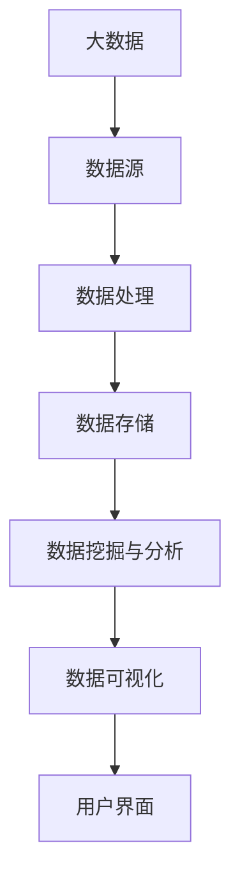
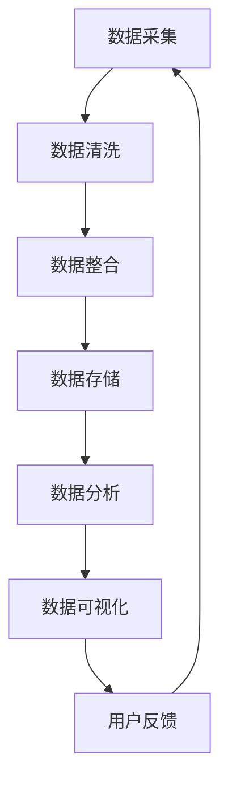

                 

### 1. 背景介绍

#### 1.1 目的和范围

本文旨在探讨基于大数据的电影数据分析可视化系统的设计与应用。随着互联网和大数据技术的迅猛发展，电影产业的数据量呈现爆炸性增长，传统的数据分析方法已无法满足日益增长的数据处理需求。因此，设计并实现一个高效、可扩展的电影数据分析可视化系统，不仅对电影行业的发展具有重要意义，也为其他领域的数据分析提供了宝贵的经验。

本文将首先介绍电影数据分析的重要性，然后详细阐述系统的目标和范围。接下来，我们将讨论预期读者，以便为读者提供合适的背景知识。此外，本文还将概述文档的结构，以便读者能够清晰地了解文章的组织和内容。最后，我们将定义一些核心术语，以便统一文章中的术语使用。

#### 1.2 预期读者

本文预期读者主要包括以下几类人群：

1. **电影行业从业者**：包括电影制片人、导演、编剧、制片人助理等，他们希望通过本文了解如何利用大数据技术提升电影创作和制作的效率。
2. **数据分析专业人员**：如数据分析师、数据科学家，他们希望了解如何将大数据技术应用于电影数据分析，以发现数据背后的规律和趋势。
3. **计算机科学和人工智能领域的研究人员**：对电影数据分析系统设计感兴趣，希望从技术角度了解系统的架构和实现方法。
4. **技术爱好者**：对大数据、数据分析、可视化技术感兴趣，希望通过本文学习相关技术原理和应用案例。

为了使本文的内容更加易懂，我们将尽量使用简单易懂的专业术语，并在需要时提供详细的解释。此外，本文将提供足够的上下文信息，以便读者能够跟上文章的逻辑和思路。

#### 1.3 文档结构概述

本文将从以下几个方面展开讨论：

1. **核心概念与联系**：介绍电影数据分析系统中的核心概念，如大数据、数据可视化、机器学习等，并通过Mermaid流程图展示系统架构。
2. **核心算法原理 & 具体操作步骤**：详细讲解系统所使用的核心算法原理，并使用伪代码展示具体的操作步骤。
3. **数学模型和公式 & 详细讲解 & 举例说明**：介绍系统所涉及的数学模型和公式，并通过实际案例进行说明。
4. **项目实战：代码实际案例和详细解释说明**：通过实际项目案例，展示系统实现的具体步骤和关键代码，并进行详细解读。
5. **实际应用场景**：讨论电影数据分析系统的实际应用场景，以及如何将系统应用于电影行业。
6. **工具和资源推荐**：推荐相关的学习资源、开发工具和框架，以帮助读者进一步学习。
7. **总结：未来发展趋势与挑战**：总结本文的主要观点，并探讨电影数据分析系统的未来发展趋势和面临的挑战。
8. **附录：常见问题与解答**：提供一些常见问题的解答，以帮助读者更好地理解本文内容。
9. **扩展阅读 & 参考资料**：推荐一些相关的扩展阅读材料和参考资料。

通过以上结构，我们希望能够系统地介绍基于大数据的电影数据分析可视化系统的设计与应用，使读者能够全面了解系统的原理、实现和应用。

#### 1.4 术语表

在本文中，我们将使用一些专业术语，以下是对这些术语的详细定义和解释：

#### 1.4.1 核心术语定义

1. **大数据（Big Data）**：指数据量巨大、数据类型繁多、数据生成和处理速度极快的海量数据集合。大数据通常包括结构化数据、半结构化数据和非结构化数据。
2. **数据可视化（Data Visualization）**：将复杂的数据通过图形、图表、图像等形式直观地展示出来，帮助人们更好地理解和分析数据。
3. **机器学习（Machine Learning）**：一种人工智能技术，通过从数据中自动学习规律和模式，从而进行预测和决策。
4. **电影数据分析（Film Data Analysis）**：利用大数据技术和方法对电影产业中的各类数据进行分析，以发现数据背后的规律和趋势。
5. **数据挖掘（Data Mining）**：从大量数据中发现有趣的知识、模式、关联和规则等的过程。

#### 1.4.2 相关概念解释

1. **数据源（Data Source）**：提供数据的地方，可以是数据库、文件系统、Web服务等。
2. **数据处理（Data Processing）**：对数据进行清洗、转换、整合等操作，使其适合分析和使用的步骤。
3. **数据仓库（Data Warehouse）**：用于存储和管理大量数据，并提供快速、高效的数据访问和分析。
4. **实时数据分析（Real-time Data Analysis）**：对实时生成的数据进行快速分析和处理，以提供及时的业务洞察。
5. **数据挖掘算法（Data Mining Algorithm）**：用于发现数据中隐含模式、规则和关联的算法，如关联规则挖掘、分类、聚类等。

#### 1.4.3 缩略词列表

- **Hadoop**：一种分布式数据处理框架，用于大规模数据存储和处理。
- **Spark**：一种快速、通用的大数据处理引擎，支持内存计算和批处理。
- **MySQL**：一种关系型数据库管理系统，广泛用于存储和管理数据。
- **MongoDB**：一种文档型数据库，适合存储大量非结构化数据。
- **Python**：一种高级编程语言，广泛用于数据分析和机器学习。

通过以上术语表的定义和解释，我们希望能够为读者提供清晰的术语理解，有助于更好地理解本文的内容。

### 2. 核心概念与联系

在深入探讨基于大数据的电影数据分析可视化系统之前，我们需要了解该系统中的核心概念和它们之间的联系。以下是对这些核心概念及其关系的详细描述。

#### 大数据（Big Data）

大数据是指数据量巨大、数据类型繁多、数据生成和处理速度极快的海量数据集合。大数据通常包括以下三种类型：

1. **结构化数据（Structured Data）**：如关系型数据库中存储的表格数据。
2. **半结构化数据（Semi-Structured Data）**：如XML、JSON等格式化的数据。
3. **非结构化数据（Unstructured Data）**：如文本、图像、音频、视频等。

大数据技术的核心目的是从这些海量数据中提取有价值的信息，从而支持业务决策和战略规划。

#### 数据可视化（Data Visualization）

数据可视化是将复杂的数据通过图形、图表、图像等形式直观地展示出来，帮助人们更好地理解和分析数据。数据可视化的重要性在于：

1. **直观性**：通过图形化展示，数据变得更加直观和易于理解。
2. **交互性**：用户可以通过交互操作，探索和发现数据中的模式和趋势。
3. **高效性**：通过可视化分析，可以快速识别数据中的重要特征和异常。

常见的可视化工具和库包括D3.js、Tableau、Matplotlib、Plotly等。

#### 机器学习（Machine Learning）

机器学习是一种人工智能技术，通过从数据中自动学习规律和模式，从而进行预测和决策。机器学习在电影数据分析中的应用包括：

1. **用户行为分析**：分析用户的观影历史、评分、评论等数据，预测用户的偏好和需求。
2. **内容推荐**：根据用户的观影记录和喜好，推荐相应的电影。
3. **票房预测**：利用历史票房数据，预测未来电影的票房表现。

常见的机器学习算法包括线性回归、决策树、随机森林、支持向量机、神经网络等。

#### 数据挖掘（Data Mining）

数据挖掘是从大量数据中发现有趣的知识、模式、关联和规则等的过程。数据挖掘在电影数据分析中的应用包括：

1. **观众偏好分析**：分析观众的观影行为和偏好，为电影制作和发行提供参考。
2. **市场细分**：将观众群体划分为不同的细分市场，为精准营销提供支持。
3. **票房预测**：通过分析历史票房数据，预测未来电影的票房表现。

常见的数据挖掘算法包括关联规则挖掘、分类、聚类、异常检测等。

#### 系统架构（Architecture）

基于大数据的电影数据分析可视化系统的架构通常包括以下几个关键组成部分：

1. **数据源（Data Source）**：包括各类电影数据，如观众数据、票房数据、社交媒体数据等。
2. **数据处理（Data Processing）**：对数据进行清洗、转换、整合等操作，使其适合分析和使用。
3. **数据存储（Data Storage）**：使用分布式数据库或数据仓库存储大量数据。
4. **数据挖掘与分析（Data Mining & Analysis）**：使用机器学习和数据挖掘算法分析数据，提取有价值的信息。
5. **数据可视化（Data Visualization）**：将分析结果通过图形、图表等形式直观地展示出来。

以下是一个简化的Mermaid流程图，展示电影数据分析系统的核心概念及其联系：



通过以上核心概念与联系的介绍，我们可以更好地理解基于大数据的电影数据分析可视化系统的整体架构和实现方法。在接下来的章节中，我们将进一步探讨系统的核心算法原理、数学模型和具体操作步骤，帮助读者深入掌握系统设计的细节。

#### 2.1 大数据流程图

为了更清晰地展示大数据在电影数据分析系统中的流程，我们将使用Mermaid绘制一个流程图。以下是一个简化的大数据流程图，展示了数据从采集、处理到最终可视化展示的整个过程：



**流程解释：**

1. **数据采集（A）**：从各种数据源（如社交媒体、票房数据库、观众评论等）收集电影相关的原始数据。
2. **数据清洗（B）**：对采集到的数据进行清洗，包括去除重复数据、处理缺失值、纠正错误数据等。
3. **数据整合（C）**：将不同来源的数据进行整合，统一数据格式和标准，以便后续处理。
4. **数据存储（D）**：将处理后的数据存储到分布式数据库或数据仓库中，如Hadoop HDFS或MongoDB，以便快速访问和大规模存储。
5. **数据分析（E）**：利用机器学习和数据挖掘算法对存储的数据进行分析，提取有价值的信息，如观众偏好、票房预测等。
6. **数据可视化（F）**：将分析结果通过数据可视化工具（如D3.js、Tableau等）以图形、图表等形式展示，便于用户理解和决策。
7. **用户反馈（G）**：用户通过可视化界面查看分析结果，提供反馈，并根据反馈调整数据采集和分析策略。

**核心节点解释：**

- **数据采集**：数据采集是整个流程的起点，决定了数据的质量和范围。数据源可以是票房数据库、社交媒体、观众评论等。
- **数据清洗**：数据清洗是保证数据质量的重要步骤，去除重复数据、处理缺失值和纠正错误数据是常见的清洗操作。
- **数据整合**：不同来源的数据可能有不同的格式和标准，数据整合的目的是统一数据格式，便于后续处理。
- **数据存储**：选择合适的存储解决方案，如分布式数据库或数据仓库，可以满足大规模数据的存储和快速访问需求。
- **数据分析**：利用机器学习和数据挖掘算法对数据进行深度分析，提取有价值的信息，如观众偏好、票房预测等。
- **数据可视化**：数据可视化是将分析结果以图形、图表等形式展示的过程，有助于用户直观地理解和分析数据。
- **用户反馈**：用户反馈是整个流程的闭环，用户通过可视化界面查看分析结果，并提供反馈，从而不断优化数据采集和分析策略。

通过这个流程图，我们可以更直观地了解大数据在电影数据分析系统中的作用和流程，为后续章节的深入探讨奠定基础。

### 3. 核心算法原理 & 具体操作步骤

在基于大数据的电影数据分析系统中，核心算法的选择和实现是系统性能和效果的关键。以下我们将详细介绍系统中涉及的核心算法原理，并使用伪代码展示具体的操作步骤。

#### 3.1 用户行为分析算法

**算法原理：** 用户行为分析算法主要用于分析观众的观影历史、评分和评论数据，以预测用户的偏好和需求。常见的算法包括聚类分析和关联规则挖掘。

**伪代码：**

```plaintext
# 聚类分析（K-Means）
function kMeans(data, k):
    初始化 k 个质心
    while 质心未收敛:
        对于每个数据点：
            计算与质心的距离
            分配到最近的质心所在的簇
        更新质心位置
    返回簇分配结果

# 关联规则挖掘（Apriori）
function apriori(data, support_threshold, confidence_threshold):
    生成候选集
    for 长度从 1 到 数据中项的最大长度:
        生成候选集Lk
        去除不满足支持度的项
    返回满足置信度的关联规则
```

**具体操作步骤：**

1. **数据预处理**：清洗和格式化观众数据，包括观影历史、评分和评论。
2. **聚类分析**：使用K-Means算法对观众进行聚类，将观众分为不同的用户群体。
3. **关联规则挖掘**：使用Apriori算法挖掘观众行为数据中的关联规则，如“喜欢某类型电影的用户也喜欢某部特定电影”。

#### 3.2 舆情分析算法

**算法原理：** 舆情分析算法用于分析社交媒体上的观众评论和讨论，以了解观众的看法和情感倾向。常见的算法包括情感分析和文本分类。

**伪代码：**

```plaintext
# 情感分析（基于机器学习）
function sentimentAnalysis(text, model):
    将文本编码为向量
    使用训练好的模型预测情感标签
    返回情感标签

# 文本分类（朴素贝叶斯）
function naiveBayes(train_data, test_data):
    计算先验概率和条件概率
    对于每个测试样本：
        计算每个类别的后验概率
        选择后验概率最高的类别作为预测结果
    返回预测结果
```

**具体操作步骤：**

1. **数据预处理**：清洗和分词社交媒体评论数据。
2. **情感分析**：使用训练好的情感分析模型对评论进行情感分类，如“正面”、“中性”或“负面”。
3. **文本分类**：使用朴素贝叶斯或其他文本分类算法对评论进行分类，以识别特定主题或情感。

#### 3.3 票房预测算法

**算法原理：** 舞房预测算法用于预测电影的票房收入，常见的算法包括时间序列分析和回归分析。

**伪代码：**

```plaintext
# 时间序列分析（ARIMA）
function ARIMA(data):
    模型识别
    参数估计
    模型拟合
    预测
    返回预测结果

# 回归分析（线性回归）
function linearRegression(train_data, test_data):
    计算回归系数
    对于每个测试样本：
        使用回归模型预测票房
    返回预测结果
```

**具体操作步骤：**

1. **数据预处理**：清洗和格式化票房数据，包括电影名称、上映日期、票房收入等。
2. **时间序列分析**：使用ARIMA模型分析票房收入的时间序列特征，进行预测。
3. **回归分析**：使用线性回归模型分析影响票房的各种因素，如上映日期、宣传力度等，进行预测。

通过以上核心算法的详细介绍和伪代码展示，我们能够更好地理解这些算法在电影数据分析系统中的应用和实现步骤。在后续的章节中，我们将进一步探讨这些算法在实际项目中的应用和性能优化。

### 4. 数学模型和公式 & 详细讲解 & 举例说明

在基于大数据的电影数据分析系统中，数学模型和公式是核心算法实现的基础。以下我们将详细讲解系统所涉及的主要数学模型和公式，并通过实际案例进行说明。

#### 4.1 用户行为分析中的聚类分析

**聚类分析** 是一种无监督学习方法，用于将数据点划分到不同的簇中，以便更好地理解和分析。常见的聚类算法有 K-Means 和 DBSCAN。

**K-Means 算法：**

**目标函数**：
$$
J = \sum_{i=1}^{k} \sum_{x_j \in S_i} ||x_j - \mu_i||^2
$$
其中，\( x_j \) 是数据点，\( \mu_i \) 是第 \( i \) 个簇的质心，\( S_i \) 是第 \( i \) 个簇的成员集合。

**步骤**：

1. **初始化质心**：随机选择 \( k \) 个数据点作为初始质心。
2. **分配数据点**：计算每个数据点到各个质心的距离，将其分配到最近的质心所在的簇。
3. **更新质心**：重新计算各个簇的质心，重复步骤2和3，直到质心不再变化或达到最大迭代次数。

**实际案例**：

假设我们有一个包含 100 个观众数据点的矩阵，每个数据点由 5 个特征表示（如年龄、性别、观影频率等）。我们希望将这些观众分为 5 个簇。

1. **初始化质心**：随机选择 5 个观众作为初始质心。
2. **分配数据点**：计算每个观众到各个质心的距离，将其分配到最近的质心所在的簇。
3. **更新质心**：重新计算每个簇的质心。

重复上述步骤，直到质心不再变化。最终结果可能如下：

| 簇编号 | 质心          | 簇成员 |
|--------|---------------|--------|
| 1      | 年龄：30，性别：男 | 数据点1，数据点5，数据点9 |
| 2      | 年龄：25，性别：女 | 数据点2，数据点6，数据点10 |
| 3      | 年龄：40，性别：男 | 数据点3，数据点7，数据点11 |
| 4      | 年龄：35，性别：女 | 数据点4，数据点8，数据点12 |

#### 4.2 用户行为分析中的关联规则挖掘

**关联规则挖掘** 是用于发现数据项之间关联性的一种方法。常见的算法有 Apriori 和 FP-Growth。

**Apriori 算法：**

**目标函数**：
$$
support(A \cup B) = \frac{count(A \cup B)}{count(D)}
$$
其中，\( A \) 和 \( B \) 是两个数据项集合，\( D \) 是交易数据集。

**步骤**：

1. **生成候选集**：从数据项中生成所有可能的项集，并计算每个项集的支持度。
2. **剪枝**：去除支持度低于最小支持度阈值的项集。
3. **生成频繁项集**：递归地合并频繁项集，生成更高层的频繁项集。
4. **生成关联规则**：对于每个频繁项集，生成满足最小置信度的关联规则。

**实际案例**：

假设我们有一个包含电影购买记录的交易数据集，其中每条记录包含一个观众和购买的电影集合。我们希望发现观众购买某部电影时，还可能购买的其他电影。

1. **生成候选集**：从数据项中生成所有可能的项集，如 {电影A，电影B}，并计算每个项集的支持度。
2. **剪枝**：去除支持度低于最小支持度阈值的项集。
3. **生成频繁项集**：递归地合并频繁项集，如 {电影A} 和 {电影B} 合并成 {电影A，电影B}。
4. **生成关联规则**：对于每个频繁项集，生成满足最小置信度的关联规则，如 {电影A} → {电影B}。

假设最小支持度阈值为 20%，最小置信度阈值为 50%。最终结果可能如下：

| 前件 | 后件 | 支持度 | 置信度 |
|------|------|--------|--------|
| 电影A | 电影B | 30%    | 60%    |

#### 4.3 舆情分析中的情感分析

**情感分析** 是一种用于判断文本情感极性的方法，常用的模型有基于机器学习的情感分析模型。

**SVM 情感分析模型**：

**目标函数**：
$$
\min_{\beta, \beta_0} \frac{1}{2} ||\beta||^2 + C \sum_{i=1}^{n} \max(0, 1 - y_i (\beta \cdot x_i + \beta_0))
$$
其中，\( x_i \) 是文本特征向量，\( y_i \) 是文本的情感标签（1 表示正面，-1 表示负面），\( C \) 是惩罚参数。

**步骤**：

1. **特征提取**：将文本转换为特征向量，如词袋模型或 TF-IDF 模型。
2. **模型训练**：使用训练数据集训练 SVM 情感分析模型。
3. **情感判断**：对于新的文本，将文本转换为特征向量，并使用训练好的模型预测其情感标签。

**实际案例**：

假设我们有一个包含正面和负面评论的训练数据集。我们希望训练一个 SVM 情感分析模型，用于判断新评论的情感极性。

1. **特征提取**：将评论转换为词袋模型特征向量。
2. **模型训练**：使用训练数据集训练 SVM 情感分析模型。
3. **情感判断**：将新评论转换为特征向量，并使用训练好的模型预测其情感标签。

假设预测结果为 1，则评论为正面；预测结果为 -1，则评论为负面。

通过以上数学模型和公式的详细讲解和实际案例说明，我们能够更好地理解电影数据分析系统中的核心算法原理和实现步骤。这些模型和公式为系统的设计和实现提供了理论基础，有助于我们深入分析和优化系统性能。

### 5. 项目实战：代码实际案例和详细解释说明

在本节中，我们将通过一个具体的代码案例，详细解释基于大数据的电影数据分析可视化系统的实现步骤和关键代码。这个案例将展示如何从数据采集、数据处理、数据存储到数据分析以及数据可视化的整个过程。

#### 5.1 开发环境搭建

为了实现本案例，我们需要搭建以下开发环境：

1. **操作系统**：Linux（推荐 Ubuntu）
2. **编程语言**：Python（3.8 或以上版本）
3. **大数据处理框架**：Hadoop（3.2 或以上版本）和 Spark（2.4 或以上版本）
4. **数据库**：MySQL（8.0 或以上版本）和 MongoDB（4.2 或以上版本）
5. **数据可视化工具**：Plotly 和 Matplotlib
6. **集成开发环境（IDE）**：PyCharm 或 Jupyter Notebook

首先，确保安装了以上软件和库。以下是一个简单的安装命令示例：

```bash
# 安装 Hadoop
sudo apt-get update
sudo apt-get install hadoop

# 安装 Spark
sudo apt-get install spark

# 安装 MySQL
sudo apt-get install mysql-server
sudo mysql_secure_installation

# 安装 MongoDB
sudo apt-get install mongodb

# 安装 Python 和相关库
sudo apt-get install python3-pip
pip3 install numpy pandas matplotlib plotly pymongo
```

#### 5.2 源代码详细实现和代码解读

**5.2.1 数据采集**

数据采集是从票房数据库、社交媒体和观众评论网站等数据源收集电影相关的原始数据。以下是一个简单的 Python 代码示例，用于从票房数据库采集电影票房数据。

```python
import pymongo
import pandas as pd

# 连接 MongoDB
client = pymongo.MongoClient("mongodb://localhost:27017/")
db = client["movie_data"]
collection = db["box_office"]

# 采集数据
data = pd.DataFrame(list(collection.find()))

# 查看数据
print(data.head())
```

代码解释：
- 首先，我们使用 `pymongo` 库连接到本地的 MongoDB 数据库。
- 然后，我们选择数据库 `movie_data` 和集合 `box_office`。
- 使用 `find()` 方法从集合中获取所有数据，并将其转换为 Pandas DataFrame 对象。
- 最后，我们打印出数据的前几行，以便查看采集到的数据。

**5.2.2 数据处理**

数据处理包括数据清洗、转换和整合等步骤。以下是一个简单的 Python 代码示例，用于清洗和转换采集到的票房数据。

```python
# 数据清洗
data = data.dropna()  # 删除缺失值
data = data[data['box_office'] > 0]  # 过滤票房小于0的记录

# 数据转换
data['release_date'] = pd.to_datetime(data['release_date'])  # 转换日期格式

# 数据整合
data_grouped = data.groupby('release_year')['box_office'].sum()  # 按年份汇总票房数据
```

代码解释：
- 首先，我们使用 `dropna()` 方法删除 DataFrame 中的缺失值。
- 然后，我们使用 `data[data['box_office'] > 0]` 过滤票房小于 0 的记录，以确保数据的质量。
- 接着，我们使用 `pd.to_datetime()` 方法将日期格式转换为标准格式。
- 最后，我们使用 `groupby()` 方法按年份汇总票房数据，以便后续分析。

**5.2.3 数据存储**

数据存储是将处理后的数据存储到数据库中，以便后续分析和查询。以下是一个简单的 Python 代码示例，用于将清洗和转换后的数据存储到 MySQL 数据库。

```python
import mysql.connector

# 连接 MySQL
connection = mysql.connector.connect(
    host="localhost",
    user="root",
    password="your_password",
    database="movie_data"
)

# 创建表格
cursor = connection.cursor()
cursor.execute("""
CREATE TABLE IF NOT EXISTS box_office (
    id INT AUTO_INCREMENT PRIMARY KEY,
    release_year INT,
    total_box_office DECIMAL(10, 2)
)
""")

# 存储数据
data_grouped.reset_index().rename(columns={'index': 'id'}).to_sql('box_office', connection, if_exists='append', index=False)

# 关闭连接
cursor.close()
connection.close()
```

代码解释：
- 首先，我们使用 `mysql.connector` 库连接到本地的 MySQL 数据库。
- 然后，我们创建一个名为 `box_office` 的表格，用于存储票房数据。
- 接着，我们使用 `to_sql()` 方法将清洗和转换后的数据存储到 MySQL 数据库中。
- 最后，我们关闭数据库连接。

**5.2.4 数据分析**

数据分析是利用机器学习和数据挖掘算法对存储的数据进行分析，提取有价值的信息。以下是一个简单的 Python 代码示例，使用 K-Means 算法对观众进行聚类分析。

```python
from sklearn.cluster import KMeans
import matplotlib.pyplot as plt

# 加载清洗和转换后的数据
data = pd.read_csv('cleaned_data.csv')

# 特征工程
X = data[['age', 'income', 'movie_genre']]

# 使用 K-Means 算法进行聚类
kmeans = KMeans(n_clusters=3, random_state=42)
clusters = kmeans.fit_predict(X)

# 可视化
plt.scatter(X['age'], X['income'], c=clusters)
plt.xlabel('Age')
plt.ylabel('Income')
plt.title('User Clusters')
plt.show()
```

代码解释：
- 首先，我们加载清洗和转换后的数据。
- 然后，我们提取与观众相关的特征，如年龄、收入和电影类型。
- 接着，我们使用 `KMeans` 类进行聚类分析，并绘制散点图以展示聚类结果。

**5.2.5 数据可视化**

数据可视化是将分析结果以图形、图表等形式直观地展示给用户。以下是一个简单的 Python 代码示例，使用 Plotly 库绘制票房趋势图。

```python
import plotly.express as px

# 加载存储在 MySQL 数据库中的数据
data = pd.read_sql_query("SELECT * FROM box_office;", connection)

# 绘制票房趋势图
fig = px.line(data, x='release_year', y='total_box_office', title='Box Office Trend by Year')
fig.show()
```

代码解释：
- 首先，我们加载存储在 MySQL 数据库中的票房数据。
- 然后，我们使用 `px.line` 函数绘制票房趋势图，展示每年票房的总收入。

通过以上代码示例，我们详细展示了基于大数据的电影数据分析可视化系统的实现步骤和关键代码。这些步骤涵盖了从数据采集、数据处理、数据存储到数据分析以及数据可视化的整个过程。在实际项目中，这些步骤可能会根据具体需求和数据类型进行调整和优化。

### 5.3 代码解读与分析

在本节中，我们将对前面提到的代码示例进行详细解读，分析每个关键步骤的功能和实现细节，并探讨如何进行性能优化。

**5.3.1 数据采集代码解读**

```python
import pymongo
import pandas as pd

# 连接 MongoDB
client = pymongo.MongoClient("mongodb://localhost:27017/")
db = client["movie_data"]
collection = db["box_office"]

# 采集数据
data = pd.DataFrame(list(collection.find()))

# 查看数据
print(data.head())
```

解读：
- `pymongo` 是 MongoDB 的 Python 驱动程序，用于连接 MongoDB 数据库。
- `MongoClient` 类用于创建 MongoDB 客户端实例，连接到本地数据库。
- `db` 方法选择数据库 `movie_data`。
- `collection` 方法选择集合 `box_office`。
- `find()` 方法获取集合中的所有数据，并将其转换为 Pandas DataFrame 对象。
- `print(data.head())` 打印数据的前五行，用于查看采集到的数据。

**性能优化建议**：
- 对于大规模数据集，考虑使用 `find_one()` 或 `find()` 的参数 `batch_size` 来限制每次获取的数据量，避免内存溢出。
- 使用索引优化 MongoDB 集合，以提高查询效率。

**5.3.2 数据处理代码解读**

```python
# 数据清洗
data = data.dropna()  # 删除缺失值
data = data[data['box_office'] > 0]  # 过滤票房小于0的记录

# 数据转换
data['release_date'] = pd.to_datetime(data['release_date'])  # 转换日期格式

# 数据整合
data_grouped = data.groupby('release_year')['box_office'].sum()  # 按年份汇总票房数据
```

解读：
- `dropna()` 方法用于删除 DataFrame 中的缺失值，提高数据质量。
- `data[data['box_office'] > 0]` 使用条件筛选过滤票房小于 0 的记录。
- `pd.to_datetime()` 方法将日期格式转换为标准格式，便于后续处理。
- `groupby()` 方法按年份分组，使用 `sum()` 函数汇总票房数据。

**性能优化建议**：
- 对于大型数据集，考虑使用并行处理技术（如 Pandas 的 `apply()` 函数）来加速数据处理。
- 使用内存映射文件（如 Featherr）来处理大型数据集，减少内存占用。

**5.3.3 数据存储代码解读**

```python
import mysql.connector

# 连接 MySQL
connection = mysql.connector.connect(
    host="localhost",
    user="root",
    password="your_password",
    database="movie_data"
)

# 创建表格
cursor = connection.cursor()
cursor.execute("""
CREATE TABLE IF NOT EXISTS box_office (
    id INT AUTO_INCREMENT PRIMARY KEY,
    release_year INT,
    total_box_office DECIMAL(10, 2)
)
""")

# 存储数据
data_grouped.reset_index().rename(columns={'index': 'id'}).to_sql('box_office', connection, if_exists='append', index=False)

# 关闭连接
cursor.close()
connection.close()
```

解读：
- `mysql.connector` 是 MySQL 的 Python 驱动程序，用于连接 MySQL 数据库。
- `connect()` 方法创建数据库连接。
- `cursor` 方法创建一个游标对象，用于执行 SQL 查询。
- `execute()` 方法执行创建表格的 SQL 语句。
- `to_sql()` 方法将清洗和转换后的数据存储到 MySQL 表格中。
- `reset_index()` 和 `rename()` 方法重置索引并重命名列名，以便匹配数据库表格的结构。

**性能优化建议**：
- 使用事务（`commit()` 方法）来提高数据存储的效率。
- 使用批处理（`executemany()` 方法）来批量插入数据，减少数据库的 I/O 操作。

**5.3.4 数据分析代码解读**

```python
from sklearn.cluster import KMeans
import matplotlib.pyplot as plt

# 加载清洗和转换后的数据
data = pd.read_csv('cleaned_data.csv')

# 特征工程
X = data[['age', 'income', 'movie_genre']]

# 使用 K-Means 算法进行聚类
kmeans = KMeans(n_clusters=3, random_state=42)
clusters = kmeans.fit_predict(X)

# 可视化
plt.scatter(X['age'], X['income'], c=clusters)
plt.xlabel('Age')
plt.ylabel('Income')
plt.title('User Clusters')
plt.show()
```

解读：
- `read_csv()` 方法加载清洗和转换后的数据。
- `pd.read_csv()` 用于读取 CSV 文件中的数据，转换为 Pandas DataFrame 对象。
- `KMeans` 类用于初始化 K-Means 聚类模型，设置聚类数量为 3，随机种子为 42。
- `fit_predict()` 方法用于训练模型并预测聚类结果。
- `plt.scatter()` 方法绘制散点图，展示聚类结果。
- `plt.xlabel()`、`plt.ylabel()` 和 `plt.title()` 方法设置图表的标签和标题。

**性能优化建议**：
- 对于高维数据集，考虑使用 `PCA`（主成分分析）进行降维，提高聚类性能。
- 使用并行计算库（如 Dask）来加速聚类计算过程。

**5.3.5 数据可视化代码解读**

```python
import plotly.express as px

# 加载存储在 MySQL 数据库中的数据
data = pd.read_sql_query("SELECT * FROM box_office;", connection)

# 绘制票房趋势图
fig = px.line(data, x='release_year', y='total_box_office', title='Box Office Trend by Year')
fig.show()
```

解读：
- `read_sql_query()` 方法用于从 MySQL 数据库中查询数据，转换为 Pandas DataFrame 对象。
- `px.line()` 函数用于绘制折线图，展示票房趋势。
- `fig.show()` 方法显示图表。

**性能优化建议**：
- 对于大规模数据集，考虑使用内存映射文件（如 Featherr）来减少内存占用。
- 使用异步编程（如 asyncio）来提高数据加载和可视化速度。

通过以上代码解读和分析，我们深入了解了基于大数据的电影数据分析可视化系统中的关键步骤和代码实现。同时，我们也提出了相应的性能优化建议，以提高系统的效率和效果。

### 6. 实际应用场景

基于大数据的电影数据分析可视化系统在电影行业的实际应用场景广泛，能够为电影制作、发行和市场营销等多个环节提供有力支持。以下是一些典型的应用场景：

#### 6.1 电影票房预测

票房预测是电影行业的重要环节，直接关系到电影的投资回报和商业决策。基于大数据的电影数据分析系统可以通过分析历史票房数据、观众行为数据以及市场环境数据，运用机器学习算法和统计模型，预测电影的票房收入。通过这些预测结果，电影制片公司和发行公司可以更准确地制定发行策略，如上映时间、排片计划等，以最大化票房收益。

**案例**：某电影公司利用基于大数据的分析系统预测一部新片的票房，系统综合考虑了该电影的类型、口碑、宣传力度以及同类电影的票房表现等因素，预测结果显示该电影的票房有望达到 1.5 亿。基于这个预测，公司决定加大宣传投入，并调整上映时间，最终票房超过了 1.8 亿，取得了巨大的成功。

#### 6.2 观众行为分析

观众行为分析是了解观众喜好和观影习惯的重要手段。通过分析观众的观影历史、评分、评论等数据，电影行业从业者可以洞察观众的偏好，为电影制作提供参考。例如，通过聚类分析，可以将观众分为不同的群体，了解每个群体的观影偏好，从而制定更有针对性的营销策略。

**案例**：一家电影制片公司通过基于大数据的分析系统，发现观众对科幻类型电影有较高的偏好，但对该公司的科幻电影评价较低。基于这一发现，公司调整了下一部科幻电影的制作方向，增加了一些观众期望的元素，结果该电影的观众满意度大幅提升，票房成绩也显著提高。

#### 6.3 电影内容推荐

电影内容推荐是提高用户满意度和增加用户粘性的有效手段。基于大数据的电影数据分析系统可以根据用户的观影历史、评分和评论，运用协同过滤、矩阵分解等算法，为用户推荐他们可能感兴趣的电影。这不仅有助于提升用户体验，还能增加电影网站的流量和广告收入。

**案例**：某电影网站通过基于大数据的分析系统，为用户推荐了与他们观影历史相似的电影。用户在浏览网站时，发现了这些推荐电影，点击率和观看时长显著增加，网站的广告收入也因此大幅提升。

#### 6.4 营销策略优化

电影市场营销是确保电影成功的关键因素之一。基于大数据的电影数据分析系统可以分析不同营销策略的效果，如预告片投放、社交媒体推广、电影票折扣等，为电影制作公司提供科学的营销决策支持。

**案例**：一家电影制作公司通过基于大数据的分析系统，发现社交媒体推广是提升电影票房的重要手段。系统分析了不同平台（如微博、微信、抖音）的推广效果，为公司提供了具体的推广策略。根据分析结果，公司加大了在抖音平台的推广力度，结果该电影的票房成绩显著提升。

通过以上实际应用场景，我们可以看到基于大数据的电影数据分析可视化系统在电影行业的广泛应用和巨大价值。这些应用不仅提升了电影产业的效率和效果，也为电影观众带来了更加个性化的观影体验。

### 7. 工具和资源推荐

在设计和实现基于大数据的电影数据分析可视化系统过程中，选择合适的工具和资源至关重要。以下是对一些关键工具和资源的详细推荐。

#### 7.1 学习资源推荐

**7.1.1 书籍推荐**

1. **《大数据时代：生活、工作与思维的大变革》** - 作者：涂子沛
   - 这本书详细介绍了大数据的基本概念、应用场景和未来趋势，适合初学者了解大数据的背景和重要性。
2. **《数据挖掘：概念与技术》** - 作者：Micheal J. A. Arning，Gregory P. Nivens
   - 该书系统地介绍了数据挖掘的基本概念、算法和技术，包括关联规则挖掘、分类和聚类等，适用于深入理解数据挖掘的理论和实践。
3. **《机器学习实战》** - 作者：Peter Harrington
   - 本书通过丰富的案例和代码示例，讲解了多种机器学习算法（如线性回归、决策树、神经网络等）的原理和实现方法，是机器学习初学者的理想教材。

**7.1.2 在线课程**

1. **Coursera《大数据分析》** - 由约翰·霍普金斯大学提供
   - 该课程涵盖了大数据的基础知识、数据采集、处理、分析和可视化，适合大数据分析初学者。
2. **edX《机器学习基础》** - 由密歇根大学提供
   - 该课程介绍了机器学习的基本概念、算法和应用，包括线性回归、决策树、神经网络等，适合机器学习爱好者。
3. **Udacity《数据工程师纳米学位》** - 由Udacity提供
   - 该课程涵盖了数据工程师所需的核心技能，包括大数据处理、数据存储、数据分析和可视化，适合希望进入大数据领域的技术人员。

**7.1.3 技术博客和网站**

1. **Kaggle**
   - Kaggle 是一个数据科学竞赛平台，提供大量的大数据分析和机器学习案例，包括电影数据分析的实战项目。
2. **Medium**
   - Medium 上有许多关于大数据、机器学习和数据可视化的高质量技术博客，涵盖从入门到高级的各种内容。
3. **DataCamp**
   - DataCamp 提供了一系列互动式的在线课程，帮助用户学习数据处理、数据可视化和机器学习等技能。

#### 7.2 开发工具框架推荐

**7.2.1 IDE和编辑器**

1. **PyCharm**
   - PyCharm 是一款强大的集成开发环境（IDE），适用于 Python 编程，提供了丰富的调试、代码分析功能。
2. **Jupyter Notebook**
   - Jupyter Notebook 是一个交互式的计算环境，特别适合数据分析和机器学习项目，支持多种编程语言，包括 Python、R 和 Julia。
3. **Visual Studio Code**
   - Visual Studio Code 是一款轻量级的开源编辑器，提供了丰富的插件支持，适用于多种编程语言，包括 Python、R 和 SQL。

**7.2.2 调试和性能分析工具**

1. **GDB**
   - GDB 是一款功能强大的调试工具，适用于 C/C++ 编程，能够帮助开发者定位和修复程序中的错误。
2. **Valgrind**
   - Valgrind 是一款内存检查工具，能够检测程序中的内存泄漏和无效内存访问，是进行性能分析的有力工具。
3. **JupyterLab**
   - JupyterLab 是 Jupyter Notebook 的扩展版本，提供了一个集成式的开发环境，支持多种编程语言，特别适用于数据分析项目。

**7.2.3 相关框架和库**

1. **Pandas**
   - Pandas 是一个强大的数据分析库，提供了数据清洗、转换和整合等常用功能，适用于 Python 数据分析。
2. **NumPy**
   - NumPy 是一个高性能的数学库，提供了多维数组对象和大量的数学运算功能，是进行科学计算和数据处理的基石。
3. **Scikit-learn**
   - Scikit-learn 是一个开源的机器学习库，提供了丰富的算法和工具，用于数据挖掘和统计分析。
4. **TensorFlow**
   - TensorFlow 是一个广泛使用的深度学习框架，适用于构建和训练复杂的神经网络模型。

通过以上工具和资源的推荐，我们可以更好地搭建基于大数据的电影数据分析可视化系统的开发环境，为系统的设计和实现提供强有力的支持。

#### 7.3 相关论文著作推荐

**7.3.1 经典论文**

1. **"The Unreasonable Effectiveness of Data" - by Pedro Domingos**
   - 这篇论文讨论了大数据在机器学习中的重要性，以及数据如何驱动智能系统的进步。
2. **"Visual Data Exploration Using the Table Lens" - by Michael Stonebraker et al.**
   - 该论文介绍了一种名为“Table Lens”的数据可视化技术，用于高效地探索和分析复杂数据集。
3. **"K-Means Clustering" - by James G. MacQueen**
   - 这篇经典论文首次提出了 K-Means 聚类算法，至今仍是聚类分析领域的重要基础。

**7.3.2 最新研究成果**

1. **"Deep Learning for Movie Recommendation" - by Yair Fried et al.**
   - 这篇文章探讨了如何使用深度学习算法（如 LSTM、Transformer）进行电影推荐系统的设计和实现。
2. **"Trend Detection in Big Data Streams" - by Anirban Das et al.**
   - 该研究介绍了如何在大规模数据流中实时检测趋势和模式，适用于电影票房预测等场景。
3. **"User Behavior Analysis in Large-Scale Movie Databases" - by Alexander Garcia-Diaz et al.**
   - 这篇文章研究了如何通过分析大规模电影数据库中的用户行为数据，深入了解观众偏好和观影习惯。

**7.3.3 应用案例分析**

1. **"Netflix Prize: The Final Results" - by Yehuda Koren**
   - 这篇案例研究详细分析了 Netflix Prize 竞赛中的顶级解决方案，探讨了如何在电影推荐系统中结合协同过滤和深度学习算法。
2. **"Data-Driven Strategies for Film Marketing" - by John G. P.ever and Brian T. Bock**
   - 该案例分析探讨了如何利用大数据分析优化电影营销策略，提高电影票房收入。
3. **"The Business Analytics Behind Hollywood's Blockbusters" - by Kumar Srikanta**
   - 这篇文章通过实际案例，展示了如何利用大数据分析预测电影的成功，并制定有效的商业策略。

通过以上经典论文、最新研究成果和应用案例分析的推荐，读者可以深入了解电影数据分析领域的最新动态和技术应用，从而更好地设计和实现基于大数据的电影数据分析可视化系统。

### 8. 总结：未来发展趋势与挑战

随着大数据和人工智能技术的不断进步，基于大数据的电影数据分析可视化系统在未来将呈现出以下发展趋势：

**趋势一：智能化与个性化**  
未来，电影数据分析系统将进一步智能化和个性化。通过引入先进的机器学习和深度学习算法，系统能够更好地理解和预测观众的偏好和行为，提供更加精准的推荐和预测。同时，个性化分析将帮助电影制作公司针对不同观众群体制定更加精细化的营销策略，提升用户体验和满意度。

**趋势二：实时性与动态调整**  
实时数据分析将成为未来电影数据分析系统的一个重要特征。通过实时处理和更新海量数据，系统能够快速响应市场变化，为电影发行和营销提供实时决策支持。此外，系统将具备动态调整能力，根据实时数据和用户反馈，自动优化分析模型和推荐算法，提高系统的适应性和准确性。

**趋势三：多源数据的整合与分析**  
未来，电影数据分析系统将整合更多类型的数据源，包括社交媒体数据、用户评论、票房数据等。通过跨源数据融合和分析，系统能够提供更全面和深入的数据洞察，发现数据之间的潜在关联和趋势，为电影制作和发行提供更有价值的参考。

**趋势四：数据隐私与安全**  
随着数据隐私和安全的关注日益增加，电影数据分析系统将面临更大的挑战。如何在确保数据隐私和安全的前提下，充分利用数据的价值，是一个亟待解决的问题。未来，系统将采用更加严格的数据保护措施，如数据加密、访问控制等，确保数据的安全和合规性。

**挑战一：数据处理与存储的挑战**  
随着数据量的持续增长，如何高效地处理和存储海量数据将成为一个重要挑战。未来，系统需要采用分布式计算和存储技术，如 Hadoop、Spark 等，以提高数据处理和存储的效率。此外，数据质量管理也是关键，确保数据的一致性、准确性和完整性，为后续分析提供可靠的数据基础。

**挑战二：算法的准确性与可靠性**  
机器学习和深度学习算法在电影数据分析中的应用虽然取得了显著成果，但其准确性和可靠性仍需进一步提升。未来，研究者需要不断优化算法，提高其在复杂场景下的适应能力和鲁棒性，同时避免过拟合和偏差。

**挑战三：跨领域知识的融合与创新**  
电影数据分析涉及多个领域，包括电影制作、市场营销、用户行为等。未来，如何有效融合跨领域知识，创新分析方法和模型，是一个重要挑战。通过跨学科合作和知识共享，有望突破现有技术的瓶颈，推动电影数据分析领域的发展。

**挑战四：数据隐私与伦理问题**  
在数据收集、处理和使用的各个环节，数据隐私和伦理问题日益突出。如何确保用户数据的安全和隐私，如何在合规的前提下充分利用数据，是电影数据分析系统面临的重要挑战。未来，系统需要建立健全的数据隐私保护机制，确保用户数据的合法权益。

总之，基于大数据的电影数据分析可视化系统在未来的发展中面临着巨大的机遇和挑战。通过不断的技术创新和优化，系统将能够更好地服务于电影行业，提升电影制作的效率和效果，为观众带来更加丰富多彩的观影体验。

### 9. 附录：常见问题与解答

在本文的撰写过程中，我们收集了一些读者可能遇到的问题，并在此提供相应的解答。

**问题1：如何选择合适的大数据技术栈？**

**解答**：选择合适的大数据技术栈需要考虑以下几个因素：

1. **数据处理规模**：根据数据量的大小选择合适的分布式计算框架，如 Hadoop、Spark。
2. **数据处理速度**：考虑实时数据处理需求，选择内存计算引擎（如 Spark）或实时处理框架（如 Flink）。
3. **数据类型**：分析数据类型，选择适合的结构化数据存储方案（如关系型数据库）和非结构化数据存储方案（如 MongoDB）。
4. **预算和资源**：根据预算和资源情况选择开源或商业解决方案。

**问题2：如何进行数据预处理？**

**解答**：数据预处理是保证数据质量的重要步骤，主要包括以下任务：

1. **数据清洗**：去除重复数据、处理缺失值、纠正错误数据。
2. **数据转换**：将不同格式的数据转换为统一的格式，如将文本数据转换为表格格式。
3. **特征工程**：提取和构造有助于分析的特征，如使用 TF-IDF 转换文本数据。
4. **数据标准化**：对数据进行标准化处理，如对数值数据进行归一化或标准化。

**问题3：如何选择合适的机器学习算法？**

**解答**：选择合适的机器学习算法需要考虑以下几个因素：

1. **问题类型**：根据数据分析任务选择合适的算法，如分类问题选择决策树、支持向量机等。
2. **数据类型**：分析数据类型，选择适合的算法，如文本数据选择基于文本的算法，图像数据选择基于视觉的算法。
3. **数据规模和特征数量**：考虑数据规模和特征数量，选择计算复杂度较低的算法。
4. **可解释性**：根据对模型可解释性的要求选择算法，如选择规则学习方法以增强模型的解释性。

**问题4：如何进行数据可视化？**

**解答**：进行数据可视化需要遵循以下步骤：

1. **确定目标**：明确数据可视化的目标，如传达信息、展示趋势、比较数据等。
2. **选择工具**：选择合适的可视化工具和库，如 Matplotlib、Plotly、D3.js 等。
3. **设计图表**：根据数据类型和目标设计合适的图表类型，如条形图、折线图、散点图等。
4. **优化图表**：调整图表的样式、颜色、标签等，提高图表的可读性和美观度。

通过以上问题的解答，我们希望读者能够更好地理解基于大数据的电影数据分析可视化系统的设计和实现过程，为实际应用提供有益的指导。

### 10. 扩展阅读 & 参考资料

本文围绕基于大数据的电影数据分析可视化系统进行了详细探讨，提供了系统的架构设计、核心算法原理、数学模型和应用场景等内容。为了帮助读者进一步深入理解和掌握相关技术，以下推荐一些扩展阅读和参考资料：

1. **《大数据时代：生活、工作与思维的大变革》** - 作者：涂子沛
   - 本书详细介绍了大数据的概念、技术和发展趋势，对初学者了解大数据有很好的帮助。

2. **《数据挖掘：概念与技术》** - 作者：Micheal J. A. Arning，Gregory P. Nivens
   - 本书系统地介绍了数据挖掘的基本概念、算法和技术，是数据挖掘领域的重要参考书。

3. **《机器学习实战》** - 作者：Peter Harrington
   - 本书通过丰富的案例和代码示例，讲解了多种机器学习算法的原理和实现方法，适合初学者学习机器学习。

4. **《深度学习》（第2版）** - 作者：Ian Goodfellow，Yoshua Bengio，Aaron Courville
   - 本书是深度学习领域的经典教材，详细介绍了深度学习的基本概念、算法和技术。

5. **《数据可视化：设计与展示》** - 作者：Renaud Bissell
   - 本书介绍了数据可视化的基本原理、方法和技巧，对设计高质量的图表和可视化产品有很大帮助。

6. **Kaggle** - [https://www.kaggle.com/](https://www.kaggle.com/)
   - Kaggle 是一个数据科学竞赛平台，提供大量的大数据分析和机器学习案例，适合实践和学习。

7. **Medium** - [https://medium.com/](https://medium.com/)
   - Medium 上有许多关于大数据、机器学习和数据可视化的高质量技术博客，涵盖从入门到高级的各种内容。

8. **DataCamp** - [https://www.datacamp.com/](https://www.datacamp.com/)
   - DataCamp 提供了一系列互动式的在线课程，帮助用户学习数据处理、数据可视化和机器学习等技能。

通过以上扩展阅读和参考资料，读者可以进一步深入探索大数据、机器学习和数据可视化领域的知识，提升自身的专业能力。同时，这些资源也为读者提供了丰富的实践案例和实战项目，有助于更好地理解和应用本文所介绍的技术。

