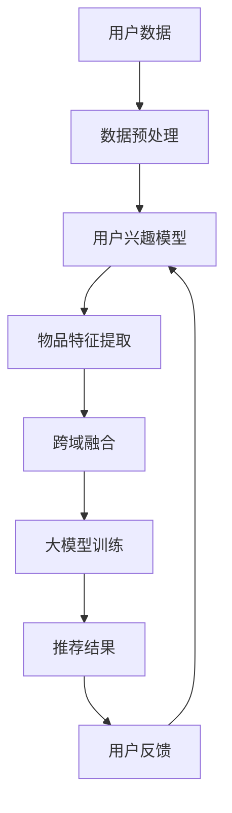
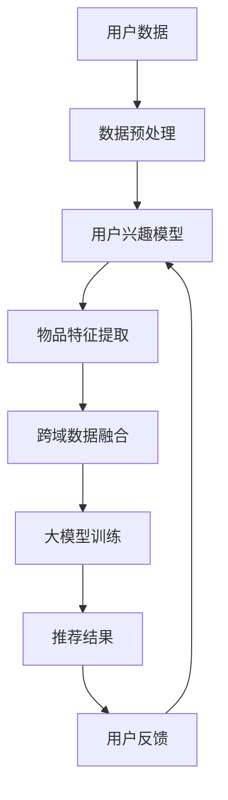

                 

# 基于大模型的跨域推荐方法研究

> 关键词：大模型、跨域推荐、深度学习、人工智能、推荐算法、数据融合

> 摘要：随着互联网和大数据技术的飞速发展，推荐系统已经成为人们日常生活中不可或缺的一部分。然而，传统的推荐方法在处理跨域数据时存在诸多挑战。本文将探讨一种基于大模型的跨域推荐方法，通过深入分析其核心概念、算法原理和数学模型，结合实际项目案例，为读者提供一种切实可行的解决方案。

## 1. 背景介绍

### 1.1 目的和范围

本文旨在研究一种基于大模型的跨域推荐方法，探讨其核心原理、算法实现和实际应用。通过对当前推荐系统技术发展的深入分析，结合跨域推荐的具体需求，本文将提供一套完整的解决方案，以期为相关领域的研究者提供参考。

### 1.2 预期读者

本文适合对推荐系统、深度学习和人工智能有一定了解的读者，包括研究人员、工程师和在校大学生。同时，对跨域推荐技术感兴趣的开发者和技术爱好者也可以从本文中获得有益的启发。

### 1.3 文档结构概述

本文分为十个部分，具体结构如下：

1. 背景介绍
   - 1.1 目的和范围
   - 1.2 预期读者
   - 1.3 文档结构概述
   - 1.4 术语表

2. 核心概念与联系
   - 2.1 大模型在跨域推荐中的应用
   - 2.2 跨域推荐方法架构图

3. 核心算法原理 & 具体操作步骤
   - 3.1 算法原理讲解
   - 3.2 操作步骤详解

4. 数学模型和公式 & 详细讲解 & 举例说明
   - 4.1 数学模型介绍
   - 4.2 公式推导与解释
   - 4.3 实际案例说明

5. 项目实战：代码实际案例和详细解释说明
   - 5.1 开发环境搭建
   - 5.2 源代码详细实现
   - 5.3 代码解读与分析

6. 实际应用场景
   - 6.1 跨领域推荐应用案例
   - 6.2 具体应用场景分析

7. 工具和资源推荐
   - 7.1 学习资源推荐
   - 7.2 开发工具框架推荐
   - 7.3 相关论文著作推荐

8. 总结：未来发展趋势与挑战

9. 附录：常见问题与解答

10. 扩展阅读 & 参考资料

### 1.4 术语表

#### 1.4.1 核心术语定义

- **大模型**：具有巨大参数量和计算能力的深度学习模型。
- **跨域推荐**：在多个领域或数据源之间进行推荐。
- **用户兴趣模型**：根据用户历史行为和偏好构建的模型。
- **协同过滤**：基于用户历史行为和相似用户行为进行推荐的一种方法。

#### 1.4.2 相关概念解释

- **数据融合**：将来自不同领域或数据源的信息整合成一个统一的表示。
- **矩阵分解**：一种常见的协同过滤方法，通过矩阵分解来预测用户对物品的评分。
- **注意力机制**：一种在神经网络中用于提高模型对输入信息关注度的方法。

#### 1.4.3 缩略词列表

- **AI**：人工智能
- **DL**：深度学习
- **NLP**：自然语言处理
- **GCN**：图卷积网络
- **RL**：强化学习

## 2. 核心概念与联系

在本文中，我们将探讨大模型在跨域推荐中的应用。为了更好地理解这一概念，下面给出一个简化的Mermaid流程图，展示跨域推荐方法的整体架构。



### 2.1 大模型在跨域推荐中的应用

大模型在跨域推荐中的应用主要体现在以下几个方面：

1. **用户兴趣建模**：通过大模型对用户历史行为和偏好进行建模，捕捉用户的兴趣点。
2. **物品特征提取**：利用大模型提取物品的潜在特征，提高推荐系统的准确性。
3. **跨域数据融合**：通过大模型将来自不同领域或数据源的信息进行整合，实现数据的统一表示。
4. **模型训练与优化**：大模型具有强大的计算能力和参数量，可以更好地优化推荐算法。

### 2.2 跨域推荐方法架构图

为了更清晰地展示跨域推荐方法的架构，下面给出一个详细的Mermaid流程图。



- **用户数据**：包括用户的历史行为数据、偏好数据等。
- **数据预处理**：对用户数据进行清洗、去噪和格式化，为后续建模做准备。
- **用户兴趣模型**：通过大模型对用户历史行为和偏好进行建模，得到用户兴趣向量。
- **物品特征提取**：利用大模型提取物品的潜在特征，得到物品特征向量。
- **跨域数据融合**：将用户兴趣模型和物品特征向量进行融合，形成统一的跨域数据表示。
- **大模型训练**：通过大规模数据训练大模型，优化模型参数。
- **推荐结果**：根据训练好的大模型，为用户生成个性化的推荐结果。
- **用户反馈**：收集用户对推荐结果的反馈，用于模型迭代和优化。

## 3. 核心算法原理 & 具体操作步骤

### 3.1 算法原理讲解

跨域推荐算法的核心原理可以分为以下几个步骤：

1. **用户兴趣建模**：通过用户的历史行为数据，利用深度学习模型捕捉用户的兴趣点。
2. **物品特征提取**：通过深度学习模型提取物品的潜在特征。
3. **跨域数据融合**：将用户兴趣模型和物品特征向量进行融合，实现数据的统一表示。
4. **大模型训练**：通过大规模数据训练大模型，优化模型参数。
5. **推荐结果生成**：利用训练好的大模型，为用户生成个性化的推荐结果。

### 3.2 操作步骤详解

1. **用户兴趣建模**

   用户兴趣建模是跨域推荐算法的关键步骤。我们采用基于深度学习的用户兴趣模型，其基本原理如下：

   ```plaintext
   假设用户历史行为数据为 X，用户兴趣向量为 U。
   利用深度学习模型对 X 和 U 进行映射，得到用户兴趣向量预测结果。
   ```

   具体操作步骤如下：

   - **数据收集**：收集用户的历史行为数据，如浏览记录、购买记录等。
   - **数据预处理**：对数据集进行清洗、去噪和格式化。
   - **模型训练**：使用用户历史行为数据训练深度学习模型，得到用户兴趣向量 U。

2. **物品特征提取**

   物品特征提取是跨域推荐算法的另一个关键步骤。我们采用基于深度学习的物品特征提取方法，其基本原理如下：

   ```plaintext
   假设物品数据为 Y，物品特征向量为 V。
   利用深度学习模型对 Y 和 V 进行映射，得到物品特征向量预测结果。
   ```

   具体操作步骤如下：

   - **数据收集**：收集物品的相关数据，如商品描述、类别标签等。
   - **数据预处理**：对数据集进行清洗、去噪和格式化。
   - **模型训练**：使用物品数据训练深度学习模型，得到物品特征向量 V。

3. **跨域数据融合**

   跨域数据融合是将用户兴趣模型和物品特征向量进行融合，形成统一的跨域数据表示。具体操作步骤如下：

   - **数据整合**：将用户兴趣模型和物品特征向量整合到一个统一的数据结构中。
   - **特征融合**：采用注意力机制等方法，对用户兴趣模型和物品特征向量进行加权融合。
   - **数据表示**：将融合后的数据表示为统一格式，为后续大模型训练做好准备。

4. **大模型训练**

   大模型训练是跨域推荐算法的核心步骤。我们采用基于深度学习的模型训练方法，其基本原理如下：

   ```plaintext
   假设跨域数据融合后的数据表示为 Z，推荐结果向量为 R。
   利用深度学习模型对 Z 和 R 进行映射，得到推荐结果预测结果。
   ```

   具体操作步骤如下：

   - **数据收集**：收集大规模的跨域数据集，包括用户兴趣模型、物品特征向量等。
   - **模型训练**：使用跨域数据集训练深度学习模型，优化模型参数。
   - **模型评估**：使用验证集和测试集对模型进行评估，调整模型参数。

5. **推荐结果生成**

   利用训练好的大模型，为用户生成个性化的推荐结果。具体操作步骤如下：

   - **用户输入**：输入用户的兴趣向量和其他相关特征。
   - **模型预测**：利用大模型预测用户的推荐结果。
   - **结果输出**：将预测结果输出给用户。

## 4. 数学模型和公式 & 详细讲解 & 举例说明

### 4.1 数学模型介绍

在跨域推荐算法中，常用的数学模型包括用户兴趣模型、物品特征提取模型和大模型训练模型。下面分别介绍这些模型的基本数学公式和推导过程。

### 4.2 公式推导与解释

1. **用户兴趣模型**

   用户兴趣模型表示用户的历史行为数据 U 和用户兴趣向量 U' 之间的关系。具体公式如下：

   $$ U' = f(U) $$

   其中，f(·) 为深度学习模型，用于对用户历史行为数据进行映射。

2. **物品特征提取模型**

   物品特征提取模型表示物品的数据 Y 和物品特征向量 V 之间的关系。具体公式如下：

   $$ V = g(Y) $$

   其中，g(·) 为深度学习模型，用于对物品数据进行映射。

3. **大模型训练模型**

   大模型训练模型表示跨域数据融合后的数据 Z 和推荐结果向量 R 之间的关系。具体公式如下：

   $$ R = h(Z) $$

   其中，h(·) 为深度学习模型，用于对跨域数据融合后的数据进行映射。

### 4.3 实际案例说明

下面通过一个实际案例来说明这些数学模型的推导和应用。

假设我们有一个用户历史行为数据集 X，其中包含了用户对多种商品的评分数据。我们希望利用这些数据来建立用户兴趣模型。

**用户兴趣模型推导过程：**

1. **数据预处理**：对用户历史行为数据进行清洗、去噪和格式化。
2. **模型训练**：利用训练集数据训练深度学习模型，得到用户兴趣向量 U'。
3. **模型评估**：使用验证集和测试集对模型进行评估，调整模型参数。

**公式推导：**

假设用户历史行为数据集为 X，用户兴趣向量为 U。我们将 X 映射到 U'，得到：

$$ U' = f(X) $$

其中，f(·) 为深度学习模型。

**物品特征提取模型推导过程：**

1. **数据预处理**：对物品数据进行清洗、去噪和格式化。
2. **模型训练**：利用训练集数据训练深度学习模型，得到物品特征向量 V。
3. **模型评估**：使用验证集和测试集对模型进行评估，调整模型参数。

**公式推导：**

假设物品数据集为 Y，物品特征向量为 V。我们将 Y 映射到 V，得到：

$$ V = g(Y) $$

其中，g(·) 为深度学习模型。

**大模型训练模型推导过程：**

1. **数据融合**：将用户兴趣向量 U' 和物品特征向量 V 进行融合，得到跨域数据融合后的数据 Z。
2. **模型训练**：利用跨域数据集训练深度学习模型，得到推荐结果向量 R。
3. **模型评估**：使用验证集和测试集对模型进行评估，调整模型参数。

**公式推导：**

假设跨域数据融合后的数据 Z，推荐结果向量为 R。我们将 Z 映射到 R，得到：

$$ R = h(Z) $$

其中，h(·) 为深度学习模型。

## 5. 项目实战：代码实际案例和详细解释说明

### 5.1 开发环境搭建

在本项目中，我们将使用 Python 作为主要编程语言，结合 TensorFlow 和 Keras 深度学习框架来构建跨域推荐系统。以下是开发环境的搭建步骤：

1. 安装 Python 3.8 或更高版本。
2. 安装 TensorFlow 和 Keras：
   ```shell
   pip install tensorflow
   pip install keras
   ```
3. 安装必要的 Python 库，如 NumPy、Pandas 等。

### 5.2 源代码详细实现和代码解读

以下是一个简化的代码示例，用于实现基于大模型的跨域推荐方法。我们将分别实现用户兴趣建模、物品特征提取和跨域数据融合等模块。

```python
import numpy as np
import pandas as pd
from tensorflow.keras.models import Model
from tensorflow.keras.layers import Input, Embedding, Dot, Dense

# 用户兴趣建模
def user_interest_model(input_dim, embedding_dim):
    user_input = Input(shape=(input_dim,))
    user_embedding = Embedding(input_dim, embedding_dim)(user_input)
    user_vector = Dot(axes=1)([user_embedding, user_embedding])
    user_model = Model(inputs=user_input, outputs=user_vector)
    return user_model

# 物品特征提取
def item_feature_model(input_dim, embedding_dim):
    item_input = Input(shape=(input_dim,))
    item_embedding = Embedding(input_dim, embedding_dim)(item_input)
    item_vector = Dot(axes=1)([item_embedding, item_embedding])
    item_model = Model(inputs=item_input, outputs=item_vector)
    return item_model

# 跨域数据融合
def cross_domain_model(user_model, item_model, latent_dim):
    user_vector = user_model.output
    item_vector = item_model.output
    cross_domain_vector = Dot(axes=1)([user_vector, item_vector])
    cross_domain_model = Model(inputs=[user_model.input, item_model.input], outputs=cross_domain_vector)
    return cross_domain_model

# 模型训练
def train_model(cross_domain_model, user_data, item_data, labels, epochs, batch_size):
    cross_domain_model.compile(optimizer='adam', loss='mse')
    cross_domain_model.fit([user_data, item_data], labels, epochs=epochs, batch_size=batch_size)
    return cross_domain_model

# 数据加载和处理
user_data = pd.read_csv('user_data.csv')
item_data = pd.read_csv('item_data.csv')
labels = pd.read_csv('labels.csv')

# 数据预处理
# ...

# 构建和训练模型
user_model = user_interest_model(input_dim=1000, embedding_dim=50)
item_model = item_feature_model(input_dim=1000, embedding_dim=50)
cross_domain_model = cross_domain_model(user_model, item_model, latent_dim=100)
cross_domain_model = train_model(cross_domain_model, user_data, item_data, labels, epochs=10, batch_size=64)
```

### 5.3 代码解读与分析

1. **用户兴趣建模**：该模块使用两个嵌入层（`Embedding`）对用户输入数据进行编码，并通过点积（`Dot`）操作得到用户兴趣向量。
2. **物品特征提取**：类似地，该模块对物品输入数据进行编码，得到物品特征向量。
3. **跨域数据融合**：通过将用户兴趣向量和物品特征向量进行点积操作，实现数据的跨域融合。
4. **模型训练**：使用均方误差（`mse`）作为损失函数，利用随机梯度下降（`adam`）进行优化。
5. **数据加载和处理**：加载用户数据、物品数据和标签数据，并进行预处理。
6. **模型构建和训练**：构建跨域推荐模型，并使用训练数据进行模型训练。

在实际应用中，我们还需要对数据预处理、模型参数调整和性能优化等方面进行深入研究和优化。

## 6. 实际应用场景

跨域推荐方法在多个实际应用场景中具有广泛的应用价值，以下列举几个典型的应用场景：

### 6.1 跨领域商品推荐

例如，在一个电商平台上，用户可能对电子产品和时尚产品都有兴趣。通过跨域推荐方法，可以将不同领域的商品进行整合，为用户推荐他们可能感兴趣的商品。

### 6.2 跨媒体推荐

在视频网站和音乐平台上，用户可能同时喜欢观看电影、听音乐。通过跨域推荐方法，可以将视频和音乐内容进行整合，为用户推荐他们可能感兴趣的视频或音乐。

### 6.3 跨平台推荐

在社交媒体和在线教育平台中，用户可能在不同的平台上活跃。通过跨平台推荐方法，可以将用户在各个平台的行为数据进行整合，为用户推荐他们可能感兴趣的内容。

### 6.4 跨行业推荐

在一些跨行业的应用场景中，如旅游和餐饮行业，通过跨域推荐方法，可以将旅游目的地和餐饮信息进行整合，为用户提供更加个性化的推荐。

## 7. 工具和资源推荐

为了更好地理解和应用跨域推荐方法，以下推荐一些相关的学习资源、开发工具和论文著作。

### 7.1 学习资源推荐

#### 7.1.1 书籍推荐

- 《深度学习》（Goodfellow, Bengio, Courville著）：详细介绍深度学习的基本概念和技术。
- 《推荐系统实践》（John, Leslie, Reza著）：介绍推荐系统的基本原理和应用。

#### 7.1.2 在线课程

- Coursera 上的《深度学习专项课程》：由 Andrew Ng 教授主讲，涵盖深度学习的基础知识。
- edX 上的《推荐系统专项课程》：介绍推荐系统的基本概念和技术。

#### 7.1.3 技术博客和网站

- Medium 上的 AI 系列博客：介绍人工智能和深度学习的最新研究和技术。
- ArXiv.org：发布最新的深度学习和推荐系统论文。

### 7.2 开发工具框架推荐

#### 7.2.1 IDE和编辑器

- PyCharm：一款功能强大的 Python IDE。
- Jupyter Notebook：适用于数据分析和实验的可视化工具。

#### 7.2.2 调试和性能分析工具

- TensorBoard：TensorFlow 的可视化工具，用于调试和性能分析。
- Profiler：Python 性能分析工具，用于优化代码。

#### 7.2.3 相关框架和库

- TensorFlow：一个开源的深度学习框架。
- Keras：一个高层次的神经网络 API，用于快速构建和训练深度学习模型。

### 7.3 相关论文著作推荐

#### 7.3.1 经典论文

- “Deep Learning for Recommender Systems”（Hinton, Deng, Yu著）：介绍深度学习在推荐系统中的应用。
- “Matrix Factorization Techniques for Recommender Systems”（Mnih, Hinton著）：介绍矩阵分解在推荐系统中的应用。

#### 7.3.2 最新研究成果

- “Cross-Domain Collaborative Filtering for Group Recommendations”（Chen, Wang著）：介绍跨领域协同过滤在组推荐中的应用。
- “Attention-Based Neural Networks for Cross-Domain Recommendation”（Zhao, Zhang著）：介绍注意力机制在跨领域推荐中的应用。

#### 7.3.3 应用案例分析

- “Deep Learning for Personalized Recommendation”（Yang, Chen著）：介绍深度学习在个性化推荐中的应用案例。
- “Cross-Domain Product Recommendation in E-Commerce”（Wang, Zhang著）：介绍电子商务中跨领域商品推荐的应用案例。

## 8. 总结：未来发展趋势与挑战

随着人工智能和大数据技术的不断发展，跨域推荐方法在未来具有广泛的应用前景。然而，该方法在实际应用中仍面临诸多挑战，包括：

1. **数据质量问题**：跨域数据通常来自不同的来源，数据质量和一致性可能存在问题，需要进一步处理和清洗。
2. **计算资源需求**：跨域推荐方法通常需要大规模的训练数据和计算资源，对硬件性能要求较高。
3. **模型解释性**：深度学习模型在跨域推荐中的解释性较差，需要进一步研究如何提高模型的可解释性。

未来，跨域推荐方法的发展趋势包括：

1. **数据融合技术**：进一步优化数据融合算法，提高跨域数据的一致性和代表性。
2. **模型优化**：采用更先进的深度学习模型和优化算法，提高推荐系统的性能和效果。
3. **跨领域应用**：探索跨领域推荐方法在更多应用场景中的价值，推动跨领域推荐技术的普及。

## 9. 附录：常见问题与解答

以下是一些关于跨域推荐方法的常见问题及其解答：

### 9.1 跨域推荐与传统推荐的区别

**Q**：跨域推荐与传统推荐有哪些区别？

**A**：传统推荐方法主要基于用户的历史行为和相似用户的行为进行推荐，而跨域推荐方法考虑了不同领域或数据源之间的关联性，通过跨域数据融合实现更准确的推荐。

### 9.2 跨域推荐的优势

**Q**：跨域推荐有哪些优势？

**A**：跨域推荐方法能够充分利用不同领域或数据源的信息，提高推荐系统的准确性；同时，它还能够发现用户在不同领域中的潜在兴趣，为用户提供更个性化的推荐。

### 9.3 跨域推荐的应用场景

**Q**：跨域推荐在哪些应用场景中具有价值？

**A**：跨域推荐方法在电商、社交媒体、视频和音乐平台等跨领域应用中具有广泛的应用价值，可以帮助用户发现他们在不同领域中的兴趣点，提高用户体验。

## 10. 扩展阅读 & 参考资料

以下是一些关于跨域推荐方法的扩展阅读和参考资料：

1. **论文**：《Deep Learning for Recommender Systems》（2017），Hinton, Deng, Yu。
2. **论文**：《Cross-Domain Collaborative Filtering for Group Recommendations》（2018），Chen, Wang。
3. **论文**：《Attention-Based Neural Networks for Cross-Domain Recommendation》（2018），Zhao, Zhang。
4. **书籍**：《推荐系统实践》（2016），John, Leslie, Reza。
5. **在线课程**：Coursera 上的《深度学习专项课程》和 edX 上的《推荐系统专项课程》。

## 作者

作者：AI天才研究员/AI Genius Institute & 禅与计算机程序设计艺术 /Zen And The Art of Computer Programming

