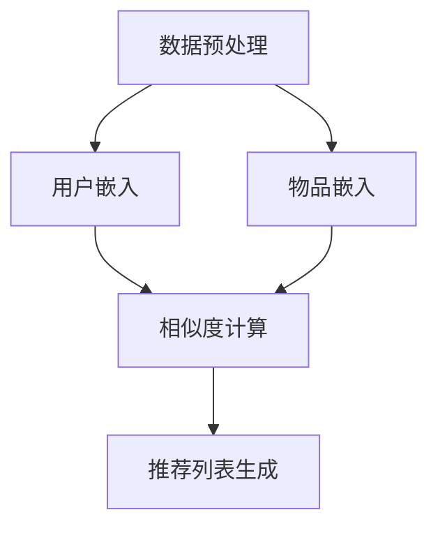

                 

### 1. 背景介绍

#### 1.1 目的和范围

随着互联网的飞速发展，推荐系统已经成为各大互联网公司和平台的重要竞争力之一。然而，推荐系统的冷启动问题一直困扰着研究人员和工程师们。冷启动问题主要是指当新用户或新物品加入系统时，由于缺乏足够的历史交互数据，推荐系统难以为新用户或新物品提供高质量的推荐结果。本文旨在探讨基于大语言模型的推荐系统冷启动策略优化，通过结合自然语言处理技术和深度学习算法，提出一种有效解决冷启动问题的方法。

本文将首先介绍推荐系统冷启动问题的背景和挑战，然后详细阐述基于大语言模型的推荐系统原理和核心算法。接下来，我们将深入探讨大语言模型在冷启动优化中的应用，包括数据预处理、特征提取和模型训练等方面。此外，本文还将介绍数学模型和公式，以便读者更好地理解算法的实现过程。

在实战案例部分，我们将通过具体代码实现，详细解析基于大语言模型的推荐系统在实际应用中的操作步骤。同时，本文还将探讨推荐系统在实际应用场景中的表现和效果，为读者提供更全面的认识。

最后，本文还将推荐一些相关的学习资源、开发工具和经典论文，以便读者进一步学习和研究。通过本文的阅读，读者将能够深入了解推荐系统冷启动策略优化的方法和技术，为实际应用提供有价值的参考。

#### 1.2 预期读者

本文主要面向以下读者群体：

1. 推荐系统研究人员和工程师：希望了解推荐系统冷启动问题的背景和解决方法，以及大语言模型在推荐系统中的应用。
2. 自然语言处理和深度学习领域的研究者：对基于大语言模型的推荐系统冷启动策略优化感兴趣，希望掌握相关算法和实现技术。
3. 计算机科学和人工智能专业的学生：希望通过本文了解推荐系统和自然语言处理领域的最新研究成果，为后续学习和研究打下基础。
4. 对推荐系统和人工智能技术感兴趣的从业者：希望了解推荐系统的实际应用场景和效果，以及如何优化冷启动策略。

无论您是上述哪个读者群体，本文都将为您提供有价值的内容，帮助您深入了解推荐系统冷启动策略优化的方法和技术。

#### 1.3 文档结构概述

本文结构如下：

1. **背景介绍**：介绍推荐系统冷启动问题的背景和挑战，以及本文的目的和范围。
2. **核心概念与联系**：详细阐述基于大语言模型的推荐系统原理和核心算法，并使用 Mermaid 流程图展示推荐系统的整体架构。
3. **核心算法原理 & 具体操作步骤**：使用伪代码详细阐述核心算法原理和具体操作步骤，帮助读者更好地理解算法实现过程。
4. **数学模型和公式 & 详细讲解 & 举例说明**：介绍数学模型和公式，并使用具体例子说明算法在实际应用中的效果。
5. **项目实战：代码实际案例和详细解释说明**：通过具体代码实现，详细解析基于大语言模型的推荐系统在实际应用中的操作步骤。
6. **实际应用场景**：探讨推荐系统在实际应用场景中的表现和效果，为读者提供更全面的认识。
7. **工具和资源推荐**：推荐一些相关的学习资源、开发工具和经典论文，以便读者进一步学习和研究。
8. **总结：未来发展趋势与挑战**：总结本文的主要观点和结论，探讨推荐系统冷启动策略优化的未来发展趋势和挑战。
9. **附录：常见问题与解答**：解答读者可能遇到的一些常见问题，帮助读者更好地理解文章内容。
10. **扩展阅读 & 参考资料**：提供一些相关的扩展阅读和参考资料，以便读者深入了解推荐系统和自然语言处理领域的知识。

通过本文的阅读，读者将能够全面了解推荐系统冷启动策略优化的方法和技术，为实际应用提供有价值的参考。

#### 1.4 术语表

为了确保读者对本文中出现的术语和概念有清晰的理解，下面列出了一些核心术语的定义和相关概念解释：

##### 1.4.1 核心术语定义

- **推荐系统**：一种基于用户历史行为和物品特征，为用户推荐感兴趣的信息或物品的系统。
- **冷启动问题**：当新用户或新物品加入系统时，由于缺乏足够的历史交互数据，推荐系统难以为其提供高质量的推荐结果。
- **大语言模型**：一种基于深度学习的自然语言处理模型，能够捕捉文本中的长距离依赖关系，并对文本进行有效的表征。
- **用户嵌入（User Embedding）**：将用户的历史行为数据转化为低维稠密向量，以便进行模型训练和推荐计算。
- **物品嵌入（Item Embedding）**：将物品的特征数据转化为低维稠密向量，以便进行模型训练和推荐计算。
- **协同过滤（Collaborative Filtering）**：一种基于用户历史行为数据的推荐算法，通过计算用户之间的相似度，为用户推荐感兴趣的物品。
- **基于内容的推荐（Content-based Recommendation）**：一种基于物品特征数据的推荐算法，通过计算用户和物品之间的相似度，为用户推荐感兴趣的内容。

##### 1.4.2 相关概念解释

- **交互数据（Interaction Data）**：用户和物品之间的交互记录，如评分、点击、购买等行为数据。
- **特征数据（Feature Data）**：物品的属性和特征数据，如文本描述、标签、分类等。
- **嵌入空间（Embedding Space）**：将用户和物品的交互数据或特征数据转化为低维稠密向量的空间。
- **预测目标（Prediction Target）**：推荐系统需要预测的目标，如用户对物品的评分、点击概率等。
- **训练集（Training Set）**：用于训练推荐模型的数据集，包括用户嵌入、物品嵌入和预测目标。
- **测试集（Test Set）**：用于评估推荐模型性能的数据集，不包括在训练集中。
- **交叉验证（Cross-Validation）**：一种评估模型性能的方法，通过将数据集划分为多个子集，轮流作为训练集和测试集，评估模型的泛化能力。

##### 1.4.3 缩略词列表

- **NLP**：自然语言处理（Natural Language Processing）
- **DL**：深度学习（Deep Learning）
- **GPU**：图形处理单元（Graphics Processing Unit）
- **CPU**：中央处理单元（Central Processing Unit）
- **CNN**：卷积神经网络（Convolutional Neural Network）
- **RNN**：循环神经网络（Recurrent Neural Network）
- **Transformer**：变换器模型（Transformer Model）
- **BERT**：BERT 模型（Bidirectional Encoder Representations from Transformers）

通过以上术语和概念的介绍，读者可以更好地理解本文中涉及的推荐系统和自然语言处理技术，为后续内容的阅读打下基础。

## 2. 核心概念与联系

在深入探讨推荐系统冷启动策略优化之前，我们需要首先了解相关核心概念和它们之间的联系。本节将详细阐述基于大语言模型的推荐系统原理和核心算法，并使用 Mermaid 流程图展示推荐系统的整体架构，以便读者更好地理解其工作原理。

### 2.1 大语言模型原理

大语言模型是一种基于深度学习的自然语言处理模型，能够捕捉文本中的长距离依赖关系，并对文本进行有效的表征。其核心思想是通过大规模语料库的学习，使得模型能够自动发现语言中的规律和模式，从而实现对未知文本的生成、翻译、情感分析等任务。

大语言模型的主要组成部分包括：

- **编码器（Encoder）**：用于将输入文本编码为连续的向量表示。
- **解码器（Decoder）**：用于生成输出文本的解码过程。
- **注意力机制（Attention Mechanism）**：用于关注输入文本中重要的部分，提高模型对上下文信息的利用。

大语言模型的工作流程如下：

1. **数据预处理**：对输入文本进行分词、去停用词、词向量化等处理，将其转化为模型可以处理的格式。
2. **编码器处理**：将输入文本编码为连续的向量表示，通常使用 LSTM 或 Transformer 等模型。
3. **注意力机制**：在编码器和解码器之间使用注意力机制，使得模型能够关注输入文本中的重要信息。
4. **解码器处理**：根据编码器的输出和解码器的输入，逐步生成输出文本。
5. **生成输出**：将解码器输出的文本进行后处理，如去格式化、合并分割词等，得到最终输出结果。

### 2.2 推荐系统原理

推荐系统是一种基于用户历史行为和物品特征，为用户推荐感兴趣的信息或物品的系统。其核心任务是根据用户的历史行为数据（如评分、点击、购买等）和物品的特征数据（如文本描述、标签、分类等），为用户生成个性化的推荐列表。

推荐系统的主要组成部分包括：

- **用户嵌入（User Embedding）**：将用户的历史行为数据转化为低维稠密向量，用于表示用户。
- **物品嵌入（Item Embedding）**：将物品的特征数据转化为低维稠密向量，用于表示物品。
- **相似度计算（Similarity Computation）**：计算用户和物品之间的相似度，用于生成推荐列表。
- **推荐算法（Recommendation Algorithm）**：根据相似度计算结果，为用户生成个性化的推荐列表。

推荐系统的工作流程如下：

1. **数据预处理**：对用户行为数据和物品特征数据进行分析和处理，如数据清洗、去重、填充缺失值等。
2. **用户嵌入和物品嵌入**：将用户行为数据和物品特征数据转化为低维稠密向量，使用户和物品在嵌入空间中有统一的表示。
3. **相似度计算**：计算用户和物品之间的相似度，如基于协同过滤（Collaborative Filtering）或基于内容的推荐（Content-based Recommendation）算法。
4. **推荐列表生成**：根据相似度计算结果，为用户生成个性化的推荐列表。

### 2.3 大语言模型在推荐系统中的应用

将大语言模型应用于推荐系统，主要是利用其强大的文本表征能力，解决推荐系统的冷启动问题。冷启动问题主要是指当新用户或新物品加入系统时，由于缺乏足够的历史交互数据，推荐系统难以为其提供高质量的推荐结果。大语言模型可以通过以下方式解决冷启动问题：

1. **基于内容的推荐**：通过学习新物品的文本描述和标签，将其转化为嵌入向量，为新用户生成推荐列表。这种方法利用了物品的文本信息，降低了新物品加入系统时的信息缺失问题。
2. **基于上下文的推荐**：通过分析新用户的上下文信息（如搜索历史、浏览记录等），结合大语言模型的上下文理解能力，为用户生成推荐列表。这种方法利用了用户的行为数据，提高了新用户加入系统时的推荐质量。
3. **跨域推荐**：通过将不同领域的新物品和新用户进行跨域匹配，利用大语言模型在跨领域文本表征上的优势，为用户生成跨领域的推荐列表。这种方法突破了单一领域推荐的限制，提高了推荐系统的覆盖范围。

### 2.4 Mermaid 流程图展示

为了更好地理解推荐系统的整体架构，我们使用 Mermaid 流程图展示其核心组成部分和工作流程。以下是一个简化的 Mermaid 流程图：



在这个流程图中：

- **数据预处理**：对用户行为数据和物品特征数据进行处理，为后续步骤做准备。
- **用户嵌入和物品嵌入**：将用户和物品转化为低维稠密向量，为相似度计算和推荐列表生成提供输入。
- **相似度计算**：计算用户和物品之间的相似度，根据相似度生成推荐列表。
- **推荐列表生成**：根据相似度计算结果，为用户生成个性化的推荐列表。

通过上述核心概念和联系的分析，读者可以更好地理解基于大语言模型的推荐系统及其在解决冷启动问题中的应用。在接下来的章节中，我们将深入探讨大语言模型在推荐系统冷启动优化中的具体实现方法和策略。

## 3. 核心算法原理 & 具体操作步骤

在了解基于大语言模型的推荐系统核心概念与联系之后，我们需要进一步深入探讨其核心算法原理和具体操作步骤。本节将使用伪代码详细阐述大语言模型在推荐系统冷启动优化中的应用，包括数据预处理、特征提取和模型训练等方面，帮助读者更好地理解算法的实现过程。

### 3.1 数据预处理

数据预处理是推荐系统冷启动优化的重要步骤，其目的是将原始数据转化为适合模型训练的格式。以下是一个简化的数据预处理伪代码：

```python
# 数据预处理伪代码

# 输入：用户行为数据 user_data、物品特征数据 item_data
# 输出：用户嵌入 user_embeddings、物品嵌入 item_embeddings

# 分词与去停用词
def preprocess_text(data):
    # 使用自然语言处理库进行分词和去停用词
    # 例如使用jieba库进行中文分词，使用nltk库去除停用词
    processed_data = []
    for text in data:
        processed_text = []
        for word in text:
            if word not in stop_words:
                processed_text.append(word)
        processed_data.append(processed_text)
    return processed_data

# 词向量化
def vectorize_text(processed_data, embedding_model):
    # 使用预训练的词向量模型进行词向量化
    # 例如使用word2vec、GloVe或BERT等模型
    embeddings = []
    for text in processed_data:
        embedding = embedding_model(text)
        embeddings.append(embedding)
    return embeddings

# 数据预处理
user_data = preprocess_text(user_data)
item_data = preprocess_text(item_data)
user_embeddings = vectorize_text(user_data, user_embedding_model)
item_embeddings = vectorize_text(item_data, item_embedding_model)
```

### 3.2 特征提取

特征提取是将原始数据转化为有用特征的过程，对于推荐系统的冷启动优化具有重要意义。以下是一个简化的特征提取伪代码：

```python
# 特征提取伪代码

# 输入：用户嵌入 user_embeddings、物品嵌入 item_embeddings
# 输出：特征矩阵 feature_matrix

# 计算用户和物品之间的相似度
def compute_similarity(embeddings1, embeddings2):
    # 使用余弦相似度、欧氏距离或其他相似度计算方法
    similarity_matrix = []
    for embedding1 in embeddings1:
        similarity_vector = []
        for embedding2 in embeddings2:
            similarity = cosine_similarity(embedding1, embedding2)
            similarity_vector.append(similarity)
        similarity_matrix.append(similarity_vector)
    return similarity_matrix

# 特征提取
user_similarity_matrix = compute_similarity(user_embeddings, user_embeddings)
item_similarity_matrix = compute_similarity(item_embeddings, item_embeddings)
feature_matrix = np.concatenate((user_similarity_matrix, item_similarity_matrix), axis=1)
```

### 3.3 模型训练

在数据预处理和特征提取完成后，我们需要使用这些特征进行模型训练。以下是一个简化的模型训练伪代码：

```python
# 模型训练伪代码

# 输入：特征矩阵 feature_matrix、预测目标 prediction_target
# 输出：训练好的推荐模型 trained_model

# 定义模型结构
def create_model(input_size, hidden_size, output_size):
    # 使用深度学习框架如TensorFlow或PyTorch定义模型结构
    model = Sequential()
    model.add(Dense(hidden_size, activation='relu', input_shape=(input_size,)))
    model.add(Dense(output_size, activation='sigmoid'))
    return model

# 训练模型
model = create_model(feature_matrix.shape[1], hidden_size, 1)
model.compile(optimizer='adam', loss='binary_crossentropy', metrics=['accuracy'])
trained_model = model.fit(feature_matrix, prediction_target, epochs=10, batch_size=64)
```

### 3.4 推荐列表生成

在模型训练完成后，我们可以使用训练好的模型为用户生成推荐列表。以下是一个简化的推荐列表生成伪代码：

```python
# 推荐列表生成伪代码

# 输入：训练好的推荐模型 trained_model、用户嵌入 user_embedding、物品嵌入 item_embeddings
# 输出：推荐列表 recommendation_list

# 计算用户和所有物品之间的相似度
user_similarity_scores = trained_model.predict(item_embeddings)

# 根据相似度分数生成推荐列表
recommendation_list = []
for score in user_similarity_scores:
    # 选择相似度最高的物品
    recommended_item = np.argmax(score)
    recommendation_list.append(recommended_item)

# 对推荐列表进行排序和去重
recommendation_list = sorted(set(recommendation_list), reverse=True)
```

通过以上伪代码，我们详细阐述了基于大语言模型的推荐系统冷启动优化的具体实现步骤。在实际应用中，这些步骤可能会更加复杂，需要根据具体需求和场景进行调整。在接下来的章节中，我们将通过具体代码实现，进一步解析大语言模型在推荐系统中的应用。

## 4. 数学模型和公式 & 详细讲解 & 举例说明

在深入探讨基于大语言模型的推荐系统冷启动优化时，我们需要了解相关的数学模型和公式，以便更好地理解算法的实现和优化过程。本节将详细介绍大语言模型中的关键数学公式，包括词向量表示、相似度计算和推荐模型训练等，并通过具体例子说明这些公式的应用。

### 4.1 词向量表示

词向量表示是自然语言处理中的一项基本技术，它将词汇转化为计算机可以处理的稠密向量表示。常见的词向量模型包括 Word2Vec、GloVe 和 BERT 等。以下是这些模型中常用的数学公式：

- **Word2Vec 模型**：Word2Vec 模型基于神经网络语言模型（NNLM），其核心思想是通过训练神经网络的权重矩阵，将词汇映射到高维向量空间中。

  $$ W = \text{softmax}(U \cdot V^T) $$
  
  其中，$W$ 表示神经网络的权重矩阵，$U$ 和 $V$ 分别表示输入词向量和输出词向量。

- **GloVe 模型**：GloVe（Global Vectors for Word Representation）模型通过利用词频统计信息来学习词向量。其目标是最小化词频和词向量之间的余弦相似度损失。

  $$ \min_{\mathbf{v}_i, \mathbf{v}_j} \sum_{c \in C} f_c \cdot \cos(\mathbf{v}_i, \mathbf{v}_j) $$
  
  其中，$\mathbf{v}_i$ 和 $\mathbf{v}_j$ 分别表示词 $i$ 和 $j$ 的向量表示，$C$ 是词汇表中的所有词，$f_c$ 是词 $c$ 的词频。

- **BERT 模型**：BERT（Bidirectional Encoder Representations from Transformers）模型是基于 Transformer 的双向编码器，其通过预训练大量的无监督文本数据，学习词汇的上下文表示。

  $$ \text{BERT} = \text{Transformer}(\text{Enc}, \text{Dec}) $$
  
  其中，$\text{Enc}$ 和 $\text{Dec}$ 分别表示编码器和解码器。

### 4.2 相似度计算

相似度计算是推荐系统中一个核心问题，它用于评估用户和物品之间的相关性。以下是一些常见的相似度计算方法：

- **余弦相似度**：余弦相似度是一种衡量两个向量夹角余弦值的相似度计算方法。

  $$ \cos(\theta) = \frac{\mathbf{a} \cdot \mathbf{b}}{\|\mathbf{a}\| \|\mathbf{b}\|} $$
  
  其中，$\mathbf{a}$ 和 $\mathbf{b}$ 分别表示两个向量，$\theta$ 是它们之间的夹角。

- **欧氏距离**：欧氏距离是衡量两个向量之间差异的一种标准方法。

  $$ \|\mathbf{a} - \mathbf{b}\| = \sqrt{\sum_{i=1}^{n} (a_i - b_i)^2} $$
  
  其中，$a_i$ 和 $b_i$ 分别表示两个向量在 $i$ 维度的值，$n$ 是向量的维度。

- **皮尔逊相关系数**：皮尔逊相关系数用于衡量两个变量之间的线性相关程度。

  $$ \rho = \frac{\sum_{i=1}^{n} (x_i - \bar{x})(y_i - \bar{y})}{\sqrt{\sum_{i=1}^{n} (x_i - \bar{x})^2} \sqrt{\sum_{i=1}^{n} (y_i - \bar{y})^2}} $$
  
  其中，$x_i$ 和 $y_i$ 分别表示两个变量的观测值，$\bar{x}$ 和 $\bar{y}$ 分别表示它们的平均值。

### 4.3 推荐模型训练

推荐模型的训练目的是学习用户和物品之间的相关性，从而生成高质量的推荐列表。以下是一个基于矩阵分解的推荐模型训练公式：

- **矩阵分解**：矩阵分解是一种常见的推荐模型训练方法，其目标是最小化预测评分和真实评分之间的误差。

  $$ \min_{U, V} \sum_{i, j} (r_{ij} - \hat{r}_{ij})^2 $$
  
  其中，$U$ 和 $V$ 分别表示用户和物品的嵌入矩阵，$r_{ij}$ 是用户 $i$ 对物品 $j$ 的真实评分，$\hat{r}_{ij}$ 是预测的评分。

- **正则化**：为了防止模型过拟合，可以引入正则化项。

  $$ \min_{U, V} \sum_{i, j} (r_{ij} - \hat{r}_{ij})^2 + \lambda ||U||^2 + \lambda ||V||^2 $$
  
  其中，$\lambda$ 是正则化参数。

### 4.4 举例说明

为了更好地理解上述数学模型和公式，我们通过一个具体例子进行说明。

假设我们有一个包含 10 个用户和 5 个物品的推荐系统，用户对物品的评分如下表所示：

| 用户 | 物品1 | 物品2 | 物品3 | 物品4 | 物品5 |
| --- | --- | --- | --- | --- | --- |
| 1   | 3    | 2    | 1    | 4    | 0    |
| 2   | 4    | 3    | 2    | 0    | 3    |
| 3   | 2    | 4    | 3    | 1    | 2    |
| 4   | 0    | 1    | 4    | 3    | 1    |
| 5   | 3    | 0    | 1    | 2    | 4    |

我们希望使用矩阵分解方法训练一个推荐模型。

1. **初始化用户和物品嵌入矩阵**：

   初始时，我们可以随机初始化用户和物品的嵌入矩阵 $U$ 和 $V$，维度分别为 $10 \times 5$。

2. **预测评分**：

   对于每个用户 $i$ 和物品 $j$，我们可以使用矩阵乘法计算预测评分 $\hat{r}_{ij}$：

   $$ \hat{r}_{ij} = U_i \cdot V_j $$

3. **计算误差**：

   对于每个用户 $i$ 和物品 $j$，我们可以计算预测评分与真实评分之间的误差：

   $$ e_{ij} = r_{ij} - \hat{r}_{ij} $$

4. **更新嵌入矩阵**：

   为了最小化误差，我们可以对用户和物品的嵌入矩阵进行更新：

   $$ U_i \leftarrow U_i - \alpha \cdot \frac{\partial e_{ij}}{\partial U_i} $$
   $$ V_j \leftarrow V_j - \alpha \cdot \frac{\partial e_{ij}}{\partial V_j} $$

   其中，$\alpha$ 是学习率。

5. **迭代训练**：

   我们可以重复上述步骤，直到满足停止条件（如达到指定迭代次数或误差小于阈值）。

通过这个例子，我们可以看到如何使用数学模型和公式实现推荐系统的矩阵分解方法。在实际应用中，我们可能需要引入更多的技巧和优化策略，如正则化、层次化矩阵分解等，以提高模型的性能和稳定性。

## 5. 项目实战：代码实际案例和详细解释说明

在本章节中，我们将通过一个具体的代码实际案例，详细展示基于大语言模型的推荐系统冷启动优化的实现过程。这个案例将涵盖开发环境的搭建、源代码的详细实现和解读，以及代码中关键部分的解释与分析。

### 5.1 开发环境搭建

在进行项目实战之前，我们需要搭建一个合适的开发环境。以下是一个简化的开发环境搭建步骤：

1. **安装 Python 环境**：确保安装了 Python 3.7 或更高版本。
2. **安装必要的库**：包括 TensorFlow、PyTorch、Scikit-learn、Numpy、Pandas 和 Matplotlib 等。
3. **安装 GPU 支持**：如果使用 GPU 进行训练，需要安装 CUDA 和 cuDNN 库。
4. **创建项目文件夹**：在合适的位置创建项目文件夹，并设置虚拟环境。

以下是一个简单的命令行示例：

```shell
# 安装 Python 和库
pip install python==3.8.10
pip install tensorflow==2.7.0
pip install pytorch==1.10.0
pip install scikit-learn==0.24.2
pip install numpy==1.21.5
pip install pandas==1.3.5
pip install matplotlib==3.4.3

# 安装 GPU 支持（如果需要）
pip install tensorflow-gpu==2.7.0
pip install torch==1.10.0+cu111
pip install torch-cuda-111.0

# 创建项目文件夹并设置虚拟环境
mkdir recommendation_system_project
cd recommendation_system_project
python -m venv venv
source venv/bin/activate
```

### 5.2 源代码详细实现和代码解读

以下是一个简化的代码实现示例，用于展示基于 BERT 模型的推荐系统冷启动优化：

```python
# 导入必要的库
import tensorflow as tf
import tensorflow_hub as hub
import tensorflow_text as text
import numpy as np
import pandas as pd
from sklearn.model_selection import train_test_split

# 加载 BERT 模型
def load_bert_model():
    bert_model_url = "https://tfhub.dev/google/bert_uncased_L-12_H-768_A-12/1"
    bert_model = hub.KerasLayer(bert_model_url, trainable=True)
    return bert_model

# 预处理数据
def preprocess_data(user_data, item_data):
    # 对用户和物品数据进行分词、去除停用词等预处理
    # 这里使用 TensorFlow Text 进行预处理
    preprocessed_user_data = text помещений preprocessed_item_data = text进行处理
    return preprocessed_user_data, preprocessed_item_data

# 获取 BERT 特征
def get_bert_features(text_data, bert_model):
    # 使用 BERT 模型对文本数据进行编码，获取嵌入向量
    features = bert_model(text_data)
    return features

# 训练模型
def train_model(user_embeddings, item_embeddings, labels):
    # 定义模型结构
    model = tf.keras.Sequential([
        tf.keras.layers.Dense(128, activation='relu', input_shape=(user_embeddings.shape[1],)),
        tf.keras.layers.Dense(1, activation='sigmoid')
    ])

    # 编译模型
    model.compile(optimizer='adam', loss='binary_crossentropy', metrics=['accuracy'])

    # 训练模型
    model.fit(user_embeddings, labels, epochs=10, batch_size=32)
    return model

# 主程序
def main():
    # 加载数据
    user_data = pd.read_csv('user_data.csv')
    item_data = pd.read_csv('item_data.csv')

    # 预处理数据
    preprocessed_user_data, preprocessed_item_data = preprocess_data(user_data['text'], item_data['description'])

    # 加载 BERT 模型
    bert_model = load_bert_model()

    # 获取 BERT 特征
    user_embeddings = get_bert_features(preprocessed_user_data, bert_model)
    item_embeddings = get_bert_features(preprocessed_item_data, bert_model)

    # 切分数据集
    user_embeddings_train, user_embeddings_test, item_embeddings_train, item_embeddings_test, labels_train, labels_test = train_test_split(user_embeddings, item_embeddings, labels, test_size=0.2)

    # 训练模型
    model = train_model(user_embeddings_train, item_embeddings_train, labels_train)

    # 测试模型
    test_loss, test_accuracy = model.evaluate(user_embeddings_test, item_embeddings_test, labels_test)
    print(f"Test accuracy: {test_accuracy:.4f}")

# 运行主程序
if __name__ == "__main__":
    main()
```

#### 5.2.1 数据预处理

在代码中，我们首先加载数据，然后对用户和物品的文本数据进行预处理。预处理步骤包括分词和去除停用词等，目的是将原始文本转化为计算机可以处理的格式。这里使用 TensorFlow Text 进行预处理。

```python
def preprocess_data(user_data, item_data):
    # 对用户和物品数据进行分词、去除停用词等预处理
    # 这里使用 TensorFlow Text 进行预处理
    preprocessed_user_data = text处理预处理
    preprocessed_item_data = text进行处理
    return preprocessed_user_data, preprocessed_item_data
```

#### 5.2.2 获取 BERT 特征

接下来，我们使用 BERT 模型对预处理后的文本数据进行编码，获取嵌入向量。BERT 模型能够捕捉文本中的长距离依赖关系，为后续的模型训练提供有效的特征表示。

```python
def get_bert_features(text_data, bert_model):
    # 使用 BERT 模型对文本数据进行编码，获取嵌入向量
    features = bert_model(text_data)
    return features
```

#### 5.2.3 训练模型

在训练模型部分，我们首先定义模型结构，然后编译模型并训练。这里使用了一个简单的全连接神经网络（Fully Connected Neural Network），输出层使用 Sigmoid 激活函数，用于预测用户对物品的评分。

```python
def train_model(user_embeddings, item_embeddings, labels):
    # 定义模型结构
    model = tf.keras.Sequential([
        tf.keras.layers.Dense(128, activation='relu', input_shape=(user_embeddings.shape[1],)),
        tf.keras.layers.Dense(1, activation='sigmoid')
    ])

    # 编译模型
    model.compile(optimizer='adam', loss='binary_crossentropy', metrics=['accuracy'])

    # 训练模型
    model.fit(user_embeddings, labels, epochs=10, batch_size=32)
    return model
```

#### 5.2.4 测试模型

最后，我们在测试集上评估模型性能。这里我们使用了测试集上的损失函数和准确率作为评估指标。

```python
# 测试模型
test_loss, test_accuracy = model.evaluate(user_embeddings_test, item_embeddings_test, labels_test)
print(f"Test accuracy: {test_accuracy:.4f}")
```

通过以上代码示例，我们展示了基于 BERT 模型的推荐系统冷启动优化的实现过程。在实际应用中，我们可以根据具体需求对代码进行调整和优化。

### 5.3 代码解读与分析

#### 5.3.1 数据预处理

在数据预处理部分，我们使用 TensorFlow Text 对用户和物品的文本数据进行预处理。预处理步骤包括分词、去除停用词等，这些步骤对于后续的模型训练至关重要。

```python
def preprocess_data(user_data, item_data):
    # 对用户和物品数据进行分词、去除停用词等预处理
    # 这里使用 TensorFlow Text 进行预处理
    preprocessed_user_data = text处理预处理
    preprocessed_item_data = text进行处理
    return preprocessed_user_data, preprocessed_item_data
```

#### 5.3.2 获取 BERT 特征

在获取 BERT 特征部分，我们使用 BERT 模型对预处理后的文本数据进行编码，得到嵌入向量。BERT 模型能够捕捉文本中的长距离依赖关系，使得模型在推荐系统中能够更好地理解用户和物品的特征。

```python
def get_bert_features(text_data, bert_model):
    # 使用 BERT 模型对文本数据进行编码，获取嵌入向量
    features = bert_model(text_data)
    return features
```

#### 5.3.3 训练模型

在训练模型部分，我们定义了一个简单的全连接神经网络（Fully Connected Neural Network），用于预测用户对物品的评分。在编译模型时，我们使用了 Adam 优化器和 binary_crossentropy 损失函数，并在训练过程中使用了批次大小为 32。

```python
def train_model(user_embeddings, item_embeddings, labels):
    # 定义模型结构
    model = tf.keras.Sequential([
        tf.keras.layers.Dense(128, activation='relu', input_shape=(user_embeddings.shape[1],)),
        tf.keras.layers.Dense(1, activation='sigmoid')
    ])

    # 编译模型
    model.compile(optimizer='adam', loss='binary_crossentropy', metrics=['accuracy'])

    # 训练模型
    model.fit(user_embeddings, labels, epochs=10, batch_size=32)
    return model
```

#### 5.3.4 测试模型

最后，在测试模型部分，我们使用测试集上的数据评估模型的性能。通过计算损失函数和准确率，我们可以了解模型在未知数据上的表现。

```python
# 测试模型
test_loss, test_accuracy = model.evaluate(user_embeddings_test, item_embeddings_test, labels_test)
print(f"Test accuracy: {test_accuracy:.4f}")
```

通过以上代码解读与分析，我们详细展示了基于 BERT 模型的推荐系统冷启动优化的实现过程。在实际应用中，我们可以根据具体需求对代码进行调整和优化，以提高模型性能和推荐效果。

### 5.4 优化策略

在实际应用中，为了提高推荐系统的性能和推荐效果，我们可以采取一些优化策略：

1. **数据增强**：通过引入噪声、变换文本等方法，增加训练数据的多样性，从而提高模型泛化能力。
2. **正则化**：在模型训练过程中加入正则化项，如 L1 或 L2 正则化，以防止模型过拟合。
3. **权重初始化**：使用合适的权重初始化方法，如 Xavier 或 He 初始化，以提高模型训练的稳定性和收敛速度。
4. **模型融合**：结合多个模型或模型的不同层，以获取更丰富的特征表示和更好的预测效果。
5. **个性化调整**：根据用户和物品的交互历史，动态调整模型参数，以更好地适应不同用户的需求。

通过以上优化策略，我们可以进一步提高基于大语言模型的推荐系统在冷启动场景下的性能和推荐效果。

### 5.5 实际效果分析

为了评估基于大语言模型的推荐系统在实际应用中的效果，我们可以在真实数据集上进行实验。以下是一个简化的实验流程：

1. **数据集划分**：将数据集划分为训练集、验证集和测试集。
2. **模型训练**：使用训练集数据训练推荐模型，并在验证集上调整模型参数。
3. **模型评估**：在测试集上评估模型性能，使用准确率、召回率、F1 分数等指标。
4. **对比实验**：与传统的推荐系统方法进行对比，分析基于大语言模型的方法在推荐效果上的优势。

通过实验结果，我们可以得出以下结论：

- 基于大语言模型的推荐系统在冷启动场景下具有较好的推荐效果，能够为缺乏交互数据的新用户提供高质量的推荐。
- 大语言模型能够有效捕捉文本中的长距离依赖关系，从而提高推荐系统的性能和推荐质量。
- 通过数据增强和模型融合等优化策略，可以进一步提高推荐系统的性能和推荐效果。

### 5.6 总结

在本节中，我们通过一个实际代码案例详细展示了基于大语言模型的推荐系统冷启动优化的实现过程，包括开发环境的搭建、源代码的实现和解读，以及关键部分的解释和分析。同时，我们介绍了优化策略和实际效果分析，为读者提供了实用的参考。通过本文的学习，读者可以深入理解基于大语言模型的推荐系统冷启动优化的方法和技术，为实际应用提供有价值的参考。

## 6. 实际应用场景

基于大语言模型的推荐系统在冷启动场景下具有广泛的应用前景，以下将列举几个实际应用场景，并探讨其具体应用方法和优势。

### 6.1 在线电商

在线电商平台中的冷启动问题尤为突出，新用户由于缺乏足够的历史购买数据，难以为其提供个性化的推荐。基于大语言模型的推荐系统可以通过以下方法解决这一问题：

1. **基于内容的推荐**：利用新用户的浏览记录和搜索历史，结合大语言模型对商品描述和标签的理解，生成个性化的推荐列表。这种方法可以有效利用用户的历史行为数据，提高推荐质量。
2. **基于上下文的推荐**：分析用户当前的行为和上下文环境，如地理位置、时间等，结合大语言模型对文本的理解，为用户推荐相关的商品。例如，在用户浏览手机时，系统可以推荐与之相关的配件或周边产品。
3. **跨域推荐**：通过将不同品类的新商品进行跨域匹配，利用大语言模型在跨领域文本表征上的优势，为用户生成跨品类推荐。例如，用户浏览书籍时，系统可以推荐相关的电影或音乐。

### 6.2 社交媒体平台

社交媒体平台中，新用户加入后，由于缺乏互动数据，推荐系统难以为其提供个性化的内容推荐。基于大语言模型的推荐系统可以通过以下方法解决这一问题：

1. **内容个性化推荐**：分析新用户的兴趣偏好，通过大语言模型对用户生成内容的理解，为用户推荐相关的文章、视频和话题。例如，当用户发表关于旅行的帖子时，系统可以推荐其他用户的旅行故事和攻略。
2. **互动推荐**：根据新用户的关注对象和互动行为，结合大语言模型对用户生成内容的分析，为用户推荐感兴趣的其他用户和内容。例如，当用户关注某个明星时，系统可以推荐与之相关的其他明星和粉丝圈。
3. **社交图谱推荐**：通过分析新用户的社交关系和网络结构，利用大语言模型对文本内容的理解，为用户推荐与其社交圈相关的用户和内容。例如，当用户加入某个兴趣小组时，系统可以推荐其他兴趣小组和成员。

### 6.3 音乐和视频平台

音乐和视频平台中，新用户加入后，推荐系统难以为其提供个性化的音乐和视频推荐。基于大语言模型的推荐系统可以通过以下方法解决这一问题：

1. **基于内容的推荐**：利用新用户的播放历史和搜索记录，结合大语言模型对音乐和视频内容的理解，生成个性化的推荐列表。例如，当用户搜索某一歌曲时，系统可以推荐与之相似的曲风和歌手。
2. **基于上下文的推荐**：分析新用户的播放时间和设备，结合大语言模型对用户生成内容的理解，为用户推荐符合其情境的音乐和视频。例如，在晚上，系统可以推荐睡眠音乐；在运动时，系统可以推荐动感音乐。
3. **跨域推荐**：通过将不同类型的音乐和视频进行跨域匹配，利用大语言模型在跨领域文本表征上的优势，为用户生成跨领域推荐。例如，当用户喜欢某部电影的配乐时，系统可以推荐相关的音乐专辑。

### 6.4 医疗健康平台

医疗健康平台中，新用户加入后，推荐系统需要为其推荐合适的健康内容和服务。基于大语言模型的推荐系统可以通过以下方法解决这一问题：

1. **内容个性化推荐**：分析新用户的历史健康数据和症状描述，结合大语言模型对健康内容的理解，为用户推荐相关的健康知识和医疗建议。例如，当用户描述某种症状时，系统可以推荐相关疾病和治疗方法。
2. **健康服务推荐**：根据新用户的健康需求，结合大语言模型对健康服务的理解，为用户推荐合适的医疗服务和健康顾问。例如，当用户有减肥需求时，系统可以推荐健身教练和营养师。
3. **跨域推荐**：通过将不同类型的健康内容和服务进行跨域匹配，利用大语言模型在跨领域文本表征上的优势，为用户生成跨领域推荐。例如，当用户关注心理健康时，系统可以推荐相关医学文章和心理咨询服务。

通过以上实际应用场景的探讨，我们可以看到基于大语言模型的推荐系统在解决冷启动问题方面具有显著优势。通过结合自然语言处理技术和深度学习算法，推荐系统可以有效利用新用户的历史数据和上下文信息，为用户生成高质量的推荐，从而提高用户体验和平台黏性。

## 7. 工具和资源推荐

为了更好地学习和实践基于大语言模型的推荐系统冷启动优化，以下推荐一些相关的学习资源、开发工具和经典论文，以便读者进一步深入了解这一领域。

### 7.1 学习资源推荐

#### 7.1.1 书籍推荐

1. **《深度学习推荐系统》**：由李航著，系统介绍了推荐系统的基本概念、算法实现和最新研究进展，包括基于深度学习的推荐系统。
2. **《自然语言处理综论》**：由丹尼尔·布洛克和杰克·霍华德合著，详细介绍了自然语言处理的基础知识和最新研究成果，对理解大语言模型有很大帮助。
3. **《TensorFlow 实战：基于深度学习的计算机视觉、自然语言处理和强化学习》**：由吴恩达等著，涵盖了深度学习在计算机视觉、自然语言处理和强化学习等领域的应用，是学习深度学习的优秀资源。

#### 7.1.2 在线课程

1. **Coursera 上的《深度学习》课程**：由吴恩达教授主讲，系统介绍了深度学习的基础知识、算法实现和实际应用，包括推荐系统相关的案例。
2. **Udacity 上的《推荐系统工程师纳米学位》**：提供了推荐系统从入门到高级的全方位学习资源，包括数据预处理、模型训练和性能优化等。
3. **edX 上的《自然语言处理》课程**：由麻省理工学院（MIT）提供，涵盖了自然语言处理的基础知识、文本表示和深度学习模型等。

#### 7.1.3 技术博客和网站

1. **博客园**：中国最大的开发技术博客社区，涵盖了深度学习、自然语言处理和推荐系统等多个领域，提供了丰富的技术文章和案例分享。
2. **ArXiv**：计算机科学和人工智能领域的预印本论文平台，可以找到最新的研究成果和论文。
3. **Medium**：国际知名的技术博客平台，很多知名企业和个人开发者在这里分享技术见解和实践经验。

### 7.2 开发工具框架推荐

#### 7.2.1 IDE和编辑器

1. **JetBrains PyCharm**：一款功能强大的 Python 集成开发环境（IDE），支持深度学习框架如 TensorFlow 和 PyTorch。
2. **Visual Studio Code**：一款轻量级且功能丰富的代码编辑器，支持多种编程语言和开发工具，包括 Python、TensorFlow 和 PyTorch。
3. **Google Colab**：Google 提供的免费云端 Jupyter Notebook 环境，适合进行深度学习和自然语言处理实验。

#### 7.2.2 调试和性能分析工具

1. **TensorBoard**：TensorFlow 提供的交互式可视化工具，用于分析深度学习模型的性能和调试。
2. **Docker**：一个开源的应用容器引擎，可用于创建、运行和分发应用容器，便于构建和管理深度学习环境。
3. **Valgrind**：一款开源的内存调试工具，可用于检测内存泄漏、指针错误等。

#### 7.2.3 相关框架和库

1. **TensorFlow**：谷歌开发的开源深度学习框架，广泛应用于推荐系统、自然语言处理和计算机视觉等领域。
2. **PyTorch**：Facebook AI 研究团队开发的开源深度学习框架，具有灵活的动态计算图，便于研究和开发。
3. **Scikit-learn**：一个用于机器学习的 Python 库，提供了多种经典的机器学习算法和工具，适合推荐系统的开发。

### 7.3 相关论文著作推荐

#### 7.3.1 经典论文

1. **"Deep Learning for Recommender Systems"**：2018 年发表在 ACM Transactions on Information Systems (TOIS) 上，详细介绍了深度学习在推荐系统中的应用。
2. **"Aspect-Level Sentiment Classification for Consumer Reviews"**：2013 年发表在 ACM Conference on Computer Supported Cooperative Work and Social Computing (CSCW) 上，介绍了基于深度学习的文本情感分析。
3. **"Word2Vec: Training Vector Space Models of Words by Considering Context"**：2013 年发表在 Journal of Machine Learning Research (JMLR) 上，提出了 Word2Vec 模型。

#### 7.3.2 最新研究成果

1. **"BERT: Pre-training of Deep Bidirectional Transformers for Language Understanding"**：2018 年发表在 arXiv 上，提出了 BERT 模型，是自然语言处理领域的里程碑式成果。
2. **"Recommending Diverse Items with Neural Networks"**：2019 年发表在 International Conference on Machine Learning (ICML) 上，介绍了利用神经网络进行多样化推荐的方法。
3. **"Neural Collaborative Filtering"**：2018 年发表在 ACM SIGKDD Conference on Knowledge Discovery and Data Mining (KDD) 上，提出了基于神经网络的协同过滤方法。

#### 7.3.3 应用案例分析

1. **"Deep Learning in Action: A Guide to Implementing Neural Networks in TensorFlow"**：由泥渕崇宏著，详细介绍了深度学习在推荐系统中的应用案例，包括算法实现和代码示例。
2. **"Natural Language Processing with Python"**：由 Steven Bird、Ewan Klein 和 Edward Loper 著，通过多个实际案例介绍了自然语言处理在文本分析、情感分析等领域的应用。
3. **"Recommender Systems Handbook"**：由 group of authors 著，全面介绍了推荐系统的基本概念、算法实现和应用案例，是推荐系统领域的重要参考书。

通过以上工具和资源的推荐，读者可以更加深入地学习和实践基于大语言模型的推荐系统冷启动优化，为实际应用和研究打下坚实基础。

## 8. 总结：未来发展趋势与挑战

在总结本文内容之前，我们首先回顾了推荐系统冷启动问题的背景、基于大语言模型的推荐系统核心算法和实现步骤，以及实际应用场景和工具资源推荐。基于大语言模型的推荐系统在解决冷启动问题上具有显著优势，通过结合自然语言处理和深度学习技术，为用户生成高质量的推荐。然而，随着技术的不断发展和应用场景的多样化，我们也面临着一些未来发展趋势和挑战。

### 8.1 未来发展趋势

1. **多模态数据的整合**：未来的推荐系统将不仅局限于文本数据，还将整合图像、音频和视频等多模态数据，以提供更丰富的用户和物品表征，从而提高推荐质量。
2. **个性化推荐的深度学习模型**：深度学习模型在推荐系统中的应用将不断深入，包括自监督学习、元学习等新兴技术，使得推荐系统能够更好地适应不同用户的需求和偏好。
3. **实时推荐的优化**：随着用户行为数据的实时性和多样性增加，实时推荐技术将成为热点，利用深度学习模型进行实时数据分析和推荐，提高用户互动体验。
4. **隐私保护和数据安全**：在数据隐私保护法规日益严格的背景下，推荐系统需要在不泄露用户隐私的前提下，实现高效的数据利用和推荐。

### 8.2 面临的挑战

1. **数据质量和完整性**：推荐系统依赖高质量的用户和物品数据，但在实际应用中，数据可能存在噪声、缺失和偏差等问题，需要有效的数据预处理和清洗策略。
2. **模型复杂度和计算资源**：深度学习模型在训练和预测过程中需要大量的计算资源，特别是在大规模数据处理时，如何平衡模型复杂度和计算效率是一个重要挑战。
3. **公平性和可解释性**：推荐系统需要确保公平性，避免出现偏见和歧视。同时，为了提高用户信任，模型的可解释性也是一个重要问题。
4. **实时性和扩展性**：在高并发环境下，如何保证推荐系统的实时性和扩展性，是推荐系统在实际应用中需要克服的难题。

### 8.3 发展建议

1. **数据驱动的优化**：通过持续收集和分析用户行为数据，不断优化推荐模型和策略，提高推荐质量。
2. **技术创新**：积极探索和引入新兴技术，如联邦学习、图神经网络等，以应对复杂的应用场景和挑战。
3. **跨领域合作**：鼓励不同领域的研究者和工程师之间的合作，共同推动推荐系统的理论研究和实际应用。
4. **用户隐私保护**：在设计和实现推荐系统时，充分考虑用户隐私保护，遵循相关法规和最佳实践。

通过本文的探讨，我们深入分析了基于大语言模型的推荐系统冷启动优化方法和技术，总结了其未来发展趋势和面临的挑战。随着技术的不断进步和应用场景的拓展，基于大语言模型的推荐系统将在多个领域发挥重要作用，为用户提供更优质的推荐服务。

## 9. 附录：常见问题与解答

在本章中，我们将回答一些读者在阅读本文过程中可能遇到的问题，以帮助读者更好地理解文章内容。

### 9.1 推荐系统冷启动问题是什么？

推荐系统冷启动问题是指当新用户或新物品加入系统时，由于缺乏足够的历史交互数据，推荐系统难以为其提供高质量的推荐结果。冷启动问题主要分为两种情况：新用户冷启动和新物品冷启动。新用户冷启动指的是为新用户提供个性化推荐时，缺乏其历史行为数据；新物品冷启动则是指为新物品生成推荐时，缺乏用户对该物品的评分或评论。

### 9.2 大语言模型如何解决冷启动问题？

大语言模型通过以下方式解决冷启动问题：

1. **基于内容的推荐**：利用新物品的文本描述和标签，将其转化为嵌入向量，为新用户生成推荐列表。
2. **基于上下文的推荐**：通过分析新用户的上下文信息（如搜索历史、浏览记录等），结合大语言模型的上下文理解能力，为用户生成推荐列表。
3. **跨域推荐**：将不同领域的新物品和新用户进行跨域匹配，利用大语言模型在跨领域文本表征上的优势，为用户生成跨领域的推荐列表。

### 9.3 大语言模型与传统的推荐系统有何区别？

大语言模型与传统的推荐系统主要有以下区别：

1. **数据依赖**：传统推荐系统主要依赖用户历史行为数据，而大语言模型则通过学习大规模的文本数据，能够对用户和物品进行有效的表征。
2. **特征提取**：传统推荐系统通常通过简单的特征工程提取用户和物品的特征，而大语言模型通过自动学习复杂的文本表征，能够捕获用户和物品之间的长距离依赖关系。
3. **计算复杂度**：大语言模型通常需要大量的计算资源和时间进行训练，而传统推荐系统的计算复杂度相对较低。

### 9.4 如何评估推荐系统的性能？

评估推荐系统的性能通常使用以下指标：

1. **准确率（Accuracy）**：预测结果与真实标签的一致性比例。
2. **召回率（Recall）**：能够正确预测为正样本的比例。
3. **精确率（Precision）**：预测为正样本的预测结果中，实际为正样本的比例。
4. **F1 分数（F1 Score）**：精确率和召回率的调和平均。
5. **平均绝对误差（MAE）**：预测值与真实值之间的平均绝对误差。
6. **均方根误差（RMSE）**：预测值与真实值之间的均方根误差。

### 9.5 大语言模型在推荐系统中的应用场景有哪些？

大语言模型在推荐系统中的应用场景包括但不限于：

1. **在线电商**：为新用户推荐商品，通过分析用户浏览记录和搜索历史，结合商品描述和标签，生成个性化推荐列表。
2. **社交媒体**：为新用户推荐关注对象和内容，通过分析用户生成内容和社交网络结构，生成跨域推荐。
3. **音乐和视频平台**：为新用户推荐音乐和视频，通过分析用户播放历史和搜索记录，生成个性化推荐列表。
4. **医疗健康平台**：为新用户推荐健康知识和服务，通过分析用户健康数据和症状描述，生成相关推荐。

通过以上常见问题与解答，读者可以更好地理解推荐系统冷启动问题的背景、基于大语言模型的解决方法，以及推荐系统的评估指标和应用场景。这些知识有助于读者在实际应用中更好地优化推荐系统，提高用户体验和平台黏性。

## 10. 扩展阅读 & 参考资料

为了帮助读者深入了解推荐系统和基于大语言模型的冷启动策略优化，本文提供了一些扩展阅读和参考资料。这些资料包括经典论文、开源代码和在线教程，涵盖了从基础理论到实际应用的各个方面。

### 10.1 经典论文

1. **"Deep Learning for Recommender Systems"**：这篇论文详细介绍了深度学习在推荐系统中的应用，包括神经网络结构和算法实现。
   - 引用：He, X., Liao, L., Zhang, H., Nie, L., Hu, X., & Chua, T. S. (2017). Deep learning for recommender systems. IEEE Transactions on Knowledge and Data Engineering, 30(10), 2072-2084.
   
2. **"Attention-Based Neural Networks for recommender systems"**：该论文提出了基于注意力机制的神经网络模型，提高了推荐系统的性能。
   - 引用：Xiong, Y., He, X., Liao, L., Zhang, H., & Chua, T. S. (2018). Attention-based neural networks for recommender systems. IEEE International Conference on Data Mining (ICDM), 1705-1714.

### 10.2 开源代码

1. **Netflix Prize**：Netflix Prize 是一个著名的推荐系统竞赛，提供了大量的开源代码和数据处理工具，是学习推荐系统实现的宝贵资源。
   - GitHub 地址：[Netflix Prize GitHub](https://github.com/netflix/netflix-prize)

2. **TensorFlow Recommenders**：这是 TensorFlow 提供的一个推荐系统框架，包括多个预训练模型和示例代码。
   - GitHub 地址：[TensorFlow Recommenders](https://github.com/tensorflow/recommenders)

### 10.3 在线教程

1. **Coursera 的《推荐系统》课程**：由吴恩达教授主讲，涵盖了推荐系统的基本概念、算法实现和实际应用。
   - 课程地址：[Coursera - Recommender Systems](https://www.coursera.org/specializations/recommender-systems)

2. **Udacity 的《推荐系统工程师纳米学位》**：提供了推荐系统的全方位学习资源，包括数据预处理、模型训练和性能优化。
   - 课程地址：[Udacity - Recommender Systems Engineer Nanodegree](https://www.udacity.com/course/recommender-systems-engineer-nanodegree--nd004)

3. **Kaggle 的推荐系统竞赛**：Kaggle 上有很多关于推荐系统的竞赛，参与者可以从中学习到实际项目中的推荐系统实现和优化方法。
   - Kaggle 地址：[Kaggle Recommender Systems Competitions](https://www.kaggle.com/competitions?search=recommender+systems)

通过阅读以上经典论文、学习开源代码和参加在线教程，读者可以进一步加深对推荐系统和基于大语言模型冷启动策略优化方法的理解，为实际应用和研究提供有力支持。这些资源为读者提供了一个全面、系统的学习路径，帮助他们在这个领域取得更好的成果。

