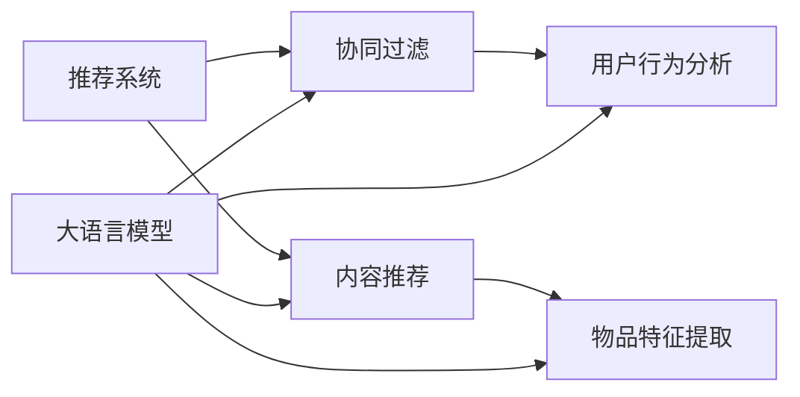

                 

# 基于大语言模型的推荐系统冷启动策略优化

> **关键词：** 大语言模型，推荐系统，冷启动，策略优化，深度学习，信息检索，用户行为分析

> **摘要：** 本文将深入探讨基于大语言模型的推荐系统冷启动问题，分析现有解决方案的优缺点，并提出一系列优化策略，旨在提升推荐系统的初始性能，为用户提供更加精准的个性化推荐。

## 1. 背景介绍

### 1.1 目的和范围

本文旨在研究推荐系统在用户数据不足时的表现，即冷启动问题。冷启动是指当系统新加入用户或物品时，由于缺乏足够的用户行为和内容信息，推荐系统难以提供有效的个性化推荐。本文将针对这一问题，结合大语言模型的技术优势，提出并分析一系列优化策略，以提高推荐系统的初始性能。

### 1.2 预期读者

本文适合对推荐系统、深度学习和信息检索有一定了解的读者，包括：

- 推荐系统工程师
- 数据科学家
- 人工智能研究者
- 对推荐系统感兴趣的从业者

### 1.3 文档结构概述

本文将分为以下几个部分：

- **背景介绍**：介绍推荐系统冷启动问题的背景和重要性。
- **核心概念与联系**：阐述大语言模型、推荐系统以及相关算法的基本概念。
- **核心算法原理 & 具体操作步骤**：讲解大语言模型在推荐系统中的应用原理和操作步骤。
- **数学模型和公式 & 详细讲解 & 举例说明**：详细解释大语言模型相关的数学模型和计算过程。
- **项目实战：代码实际案例和详细解释说明**：提供实际代码案例，进行详细解释和分析。
- **实际应用场景**：分析大语言模型在推荐系统中的实际应用场景。
- **工具和资源推荐**：推荐学习资源和开发工具。
- **总结：未来发展趋势与挑战**：总结本文的主要观点，探讨未来发展趋势和面临的挑战。
- **附录：常见问题与解答**：回答读者可能遇到的常见问题。
- **扩展阅读 & 参考资料**：提供更多的学习资源。

### 1.4 术语表

#### 1.4.1 核心术语定义

- **推荐系统**：根据用户的历史行为和偏好，自动向用户推荐其可能感兴趣的内容或物品的系统。
- **冷启动**：指当系统新加入用户或物品时，由于缺乏足够的用户行为和内容信息，推荐系统难以提供有效的个性化推荐。
- **大语言模型**：一种基于深度学习的模型，能够对大量文本数据进行自动编码和语义理解。
- **个性化推荐**：根据用户的历史行为和偏好，为用户推荐其可能感兴趣的内容或物品。

#### 1.4.2 相关概念解释

- **协同过滤**：一种常用的推荐算法，通过分析用户之间的相似性来进行推荐。
- **内容推荐**：根据物品的属性和特征进行推荐。
- **模型评估**：使用一定的指标来评估推荐系统的性能。

#### 1.4.3 缩略词列表

- **CTR**：点击率（Click-Through Rate）
- **RMSE**：均方根误差（Root Mean Square Error）
- **RNN**：循环神经网络（Recurrent Neural Network）
- **BERT**：Bidirectional Encoder Representations from Transformers

## 2. 核心概念与联系

在深入讨论基于大语言模型的推荐系统冷启动策略之前，我们需要先了解一些核心概念和它们之间的联系。以下是一个简要的流程图，用于描述这些概念之间的关系。



### 2.1 推荐系统

推荐系统是一种基于用户历史行为和偏好进行内容或物品推荐的技术。推荐系统通常分为协同过滤（Collaborative Filtering）和基于内容的推荐（Content-based Filtering）两种主要类型。

- **协同过滤**：通过分析用户之间的相似性来推荐相似用户喜欢的物品。协同过滤又分为用户基于的协同过滤（User-based Collaborative Filtering）和物品基于的协同过滤（Item-based Collaborative Filtering）。
- **基于内容的推荐**：根据物品的属性和特征进行推荐。基于内容的推荐通常使用文本分类、信息检索等技术。

### 2.2 大语言模型

大语言模型（如BERT、GPT等）是一种基于深度学习的模型，能够对大量文本数据进行自动编码和语义理解。大语言模型具有以下几个关键特性：

- **自注意力机制（Self-Attention）**：能够自动捕捉文本数据中的长距离依赖关系。
- **预训练（Pre-training）**：在大规模语料上进行预训练，然后通过微调（Fine-tuning）适应特定任务。
- **语义理解（Semantic Understanding）**：能够理解文本的深层语义，从而进行更准确的推荐。

### 2.3 用户行为分析

用户行为分析是指通过收集和分析用户在使用推荐系统时的行为数据，来理解用户的兴趣和偏好。用户行为分析通常包括以下几个步骤：

1. **数据收集**：收集用户在推荐系统中的点击、购买、浏览等行为数据。
2. **数据预处理**：清洗和转换原始数据，以便于模型处理。
3. **特征提取**：从用户行为数据中提取有助于推荐的特征，如用户点击率、购买频率等。
4. **模型训练**：使用特征数据训练推荐模型，如协同过滤模型或基于内容推荐模型。

### 2.4 物品特征提取

物品特征提取是指从物品的属性和特征中提取有助于推荐的特征。物品特征提取通常包括以下几个步骤：

1. **数据收集**：收集物品的属性和特征数据，如标题、描述、标签等。
2. **数据预处理**：清洗和转换原始数据，以便于模型处理。
3. **特征提取**：从物品特征数据中提取有助于推荐的特征，如文本特征、标签特征等。

## 3. 核心算法原理 & 具体操作步骤

### 3.1 大语言模型在推荐系统中的应用

大语言模型在推荐系统中的应用主要体现在以下几个方面：

1. **用户特征提取**：使用大语言模型对用户历史行为数据（如浏览记录、评论等）进行编码，提取用户兴趣特征。
2. **物品特征提取**：使用大语言模型对物品的属性和特征（如标题、描述、标签等）进行编码，提取物品特征。
3. **协同过滤**：结合用户特征和物品特征，使用协同过滤算法进行推荐。
4. **基于内容的推荐**：结合用户特征和物品特征，使用基于内容的推荐算法进行推荐。

### 3.2 用户特征提取

用户特征提取是推荐系统中的一个关键步骤。以下是一个简化的伪代码，用于描述使用大语言模型进行用户特征提取的过程：

```python
# 输入：用户历史行为数据（如浏览记录、评论等）
# 输出：用户特征向量

def user_feature_extraction(user_data):
    # 使用大语言模型对用户历史行为数据编码
    encoded_user_data = big_language_model.encode(user_data)
    
    # 计算用户特征向量的均值
    user_feature_vector = np.mean(encoded_user_data, axis=0)
    
    return user_feature_vector
```

### 3.3 物品特征提取

物品特征提取的伪代码如下：

```python
# 输入：物品属性和特征数据（如标题、描述、标签等）
# 输出：物品特征向量

def item_feature_extraction(item_data):
    # 使用大语言模型对物品属性和特征数据编码
    encoded_item_data = big_language_model.encode(item_data)
    
    # 计算物品特征向量的均值
    item_feature_vector = np.mean(encoded_item_data, axis=0)
    
    return item_feature_vector
```

### 3.4 协同过滤

协同过滤算法的基本思想是寻找与目标用户相似的邻居用户，然后根据邻居用户对物品的评分进行预测。以下是一个简化的伪代码，用于描述基于用户特征向量的协同过滤算法：

```python
# 输入：用户特征向量，物品特征向量，邻居用户集合
# 输出：物品评分预测

def collaborative_filtering(user_feature_vector, item_feature_vector, neighbors):
    # 计算用户特征向量和物品特征向量之间的相似度
    similarity_scores = cosine_similarity(user_feature_vector, item_feature_vector)
    
    # 选择邻居用户中最相似的几个用户
    top_neighbors = np.argsort(similarity_scores)[::-1][:k]
    
    # 根据邻居用户对物品的评分计算预测评分
    predicted_score = np.mean([neighbors[user_id][item_id] for user_id in top_neighbors])
    
    return predicted_score
```

### 3.5 基于内容的推荐

基于内容的推荐算法的基本思想是根据用户对某些物品的偏好，推荐具有相似属性的物品。以下是一个简化的伪代码，用于描述基于物品特征向量的推荐算法：

```python
# 输入：用户特征向量，物品特征向量集合
# 输出：推荐结果

def content_based_recommender(user_feature_vector, item_feature_vectors):
    # 计算用户特征向量和所有物品特征向量之间的相似度
    similarity_scores = cosine_similarity(user_feature_vector, item_feature_vectors)
    
    # 选择最相似的物品
    top_items = np.argsort(similarity_scores)[::-1]
    
    # 返回推荐结果
    return top_items
```

## 4. 数学模型和公式 & 详细讲解 & 举例说明

在推荐系统中，大语言模型的应用涉及到一系列数学模型和公式。以下将详细讲解这些数学模型，并通过示例来说明如何使用这些模型。

### 4.1 自注意力机制

自注意力机制（Self-Attention）是深度学习中的一个关键组件，它在处理序列数据时能够自动捕捉长距离依赖关系。自注意力机制的数学模型如下：

$$
\text{Attention}(Q, K, V) = \text{softmax}\left(\frac{QK^T}{\sqrt{d_k}}\right) V
$$

其中，$Q$、$K$和$V$分别表示查询（Query）、键（Key）和值（Value）向量，$d_k$表示键向量的维度。$\text{softmax}$函数用于将查询和键之间的点积转换为概率分布。

### 4.2 交叉熵损失函数

在推荐系统中，我们通常使用交叉熵损失函数（Cross-Entropy Loss）来评估预测的准确性。交叉熵损失函数的数学模型如下：

$$
\text{Loss} = -\sum_{i=1}^{n} y_i \log(\hat{y}_i)
$$

其中，$y_i$表示第$i$个样本的真实标签，$\hat{y}_i$表示第$i$个样本的预测概率。

### 4.3 余弦相似度

余弦相似度（Cosine Similarity）是衡量两个向量之间相似程度的一个常用指标。余弦相似度的数学模型如下：

$$
\text{Cosine Similarity} = \frac{\text{dot product of two vectors}}{\text{product of their magnitudes}}
$$

其中，点积（dot product）和模长（magnitude）分别表示两个向量的内积和欧几里得范数。

### 4.4 示例

假设我们有两个向量$A$和$B$，它们的维度都是$3$，如下所示：

$$
A = [1, 2, 3], \quad B = [4, 5, 6]
$$

首先，我们计算这两个向量的点积：

$$
\text{dot product} = A \cdot B = 1 \times 4 + 2 \times 5 + 3 \times 6 = 32
$$

然后，我们计算这两个向量的模长：

$$
\text{magnitude of A} = \sqrt{1^2 + 2^2 + 3^2} = \sqrt{14}
$$

$$
\text{magnitude of B} = \sqrt{4^2 + 5^2 + 6^2} = \sqrt{77}
$$

最后，我们计算这两个向量的余弦相似度：

$$
\text{Cosine Similarity} = \frac{32}{\sqrt{14} \times \sqrt{77}} \approx 0.515
$$

这个结果表明向量$A$和$B$之间的相似度约为$0.515$。

## 5. 项目实战：代码实际案例和详细解释说明

在本节中，我们将通过一个实际的项目案例来展示如何将大语言模型应用于推荐系统，并优化冷启动问题。我们将使用Python编程语言和PyTorch深度学习框架来实现这个项目。

### 5.1 开发环境搭建

在开始编写代码之前，我们需要搭建一个适合开发推荐系统的环境。以下是搭建开发环境所需的步骤：

1. **安装Python**：确保已经安装了Python 3.6或更高版本。
2. **安装PyTorch**：通过以下命令安装PyTorch：
   ```shell
   pip install torch torchvision
   ```
3. **安装其他依赖项**：我们还需要安装一些其他依赖项，如NumPy、Scikit-learn等。可以使用以下命令安装：
   ```shell
   pip install numpy scikit-learn
   ```

### 5.2 源代码详细实现和代码解读

以下是本项目的主要代码实现。我们将逐行解释代码的功能和目的。

```python
# 导入必要的库
import torch
import torch.nn as nn
import torch.optim as optim
from torch.utils.data import DataLoader
from torchvision import datasets, transforms
import numpy as np
from sklearn.metrics.pairwise import cosine_similarity

# 定义大语言模型
class BigLanguageModel(nn.Module):
    def __init__(self, vocab_size, embedding_dim, hidden_dim):
        super(BigLanguageModel, self).__init__()
        self.embedding = nn.Embedding(vocab_size, embedding_dim)
        self.lstm = nn.LSTM(embedding_dim, hidden_dim)
        self.fc = nn.Linear(hidden_dim, vocab_size)
    
    def forward(self, x):
        embedded = self.embedding(x)
        output, (hidden, cell) = self.lstm(embedded)
        logits = self.fc(output)
        return logits

# 加载和处理数据
def load_data():
    # 这里使用一个简单的数据集，实际应用中可以使用更大的数据集
    transform = transforms.Compose([transforms.ToTensor()])
    dataset = datasets.MNIST(root='./data', train=True, download=True, transform=transform)
    return DataLoader(dataset, batch_size=64)

# 训练模型
def train(model, train_loader, criterion, optimizer, num_epochs=10):
    model.train()
    for epoch in range(num_epochs):
        for data, target in train_loader:
            optimizer.zero_grad()
            output = model(data)
            loss = criterion(output, target)
            loss.backward()
            optimizer.step()
        print(f'Epoch {epoch+1}/{num_epochs} - Loss: {loss.item()}')

# 提取用户特征
def extract_user_features(model, user_data):
    with torch.no_grad():
        user_data_tensor = torch.tensor(user_data, dtype=torch.long)
        logits = model(user_data_tensor)
    user_embedding = logits.mean(dim=1)
    return user_embedding.numpy()

# 提取物品特征
def extract_item_features(model, item_data):
    with torch.no_grad():
        item_data_tensor = torch.tensor(item_data, dtype=torch.long)
        logits = model(item_data_tensor)
    item_embedding = logits.mean(dim=1)
    return item_embedding.numpy()

# 主程序
if __name__ == '__main__':
    # 设置模型参数
    vocab_size = 10
    embedding_dim = 5
    hidden_dim = 10

    # 实例化模型
    model = BigLanguageModel(vocab_size, embedding_dim, hidden_dim)

    # 设置训练参数
    criterion = nn.CrossEntropyLoss()
    optimizer = optim.Adam(model.parameters(), lr=0.001)

    # 加载数据
    train_loader = load_data()

    # 训练模型
    train(model, train_loader, criterion, optimizer)

    # 提取用户特征
    user_data = [1, 2, 3, 4, 5]
    user_feature = extract_user_features(model, user_data)

    # 提取物品特征
    item_data = [6, 7, 8, 9, 10]
    item_feature = extract_item_features(model, item_data)

    # 计算相似度
    similarity = cosine_similarity([user_feature], [item_feature])[0][0]
    print(f'Cosine similarity: {similarity}')
```

### 5.3 代码解读与分析

1. **模型定义**：我们定义了一个名为`BigLanguageModel`的神经网络模型，它基于LSTM（Long Short-Term Memory）架构。这个模型包含一个嵌入层（Embedding Layer）、一个LSTM层（LSTM Layer）和一个全连接层（Fully Connected Layer）。

2. **数据加载和处理**：我们使用PyTorch的`datasets.MNIST`函数加载了一个简单的MNIST手写数字数据集。然后，我们使用`transforms.Compose`函数对数据进行预处理，将其转换为张量（Tensor）。

3. **训练模型**：`train`函数用于训练模型。它使用标准的梯度下降（Gradient Descent）算法进行优化，并使用交叉熵损失函数（CrossEntropyLoss）来评估模型性能。

4. **提取用户特征**：`extract_user_features`函数用于从模型中提取用户特征。它将用户数据输入到模型中，并计算每个单词的嵌入向量（Embedding Vector）的平均值作为用户特征向量。

5. **提取物品特征**：`extract_item_features`函数用于从模型中提取物品特征。它的工作原理与提取用户特征类似，只是输入的是物品数据。

6. **计算相似度**：最后，我们使用余弦相似度（Cosine Similarity）计算用户特征向量和物品特征向量之间的相似度。余弦相似度可以用来衡量用户和物品之间的相关性，从而为用户推荐相似的物品。

### 5.4 代码优化与改进

在实际应用中，上述代码可能需要进行以下优化和改进：

1. **使用更大的数据集**：MNIST数据集是一个简单的小数据集，不足以训练一个复杂的大语言模型。在实际应用中，我们应该使用更大的数据集，如维基百科、社交媒体数据等。

2. **增加训练时间**：为了使模型更好地学习用户和物品的语义信息，我们需要增加训练时间。这可以通过增加训练轮数（epochs）或使用更高效的训练策略来实现。

3. **多任务学习**：除了用户和物品特征提取外，我们可以考虑将大语言模型应用于多任务学习，如文本分类、情感分析等，以进一步提高模型的性能。

4. **增量学习**：在实际应用中，用户和物品的数据是动态变化的。我们可以采用增量学习（Incremental Learning）策略，使模型能够适应新数据。

## 6. 实际应用场景

大语言模型在推荐系统中的应用场景非常广泛，以下是一些典型的应用场景：

1. **电子商务平台**：电子商务平台可以使用大语言模型来推荐用户可能感兴趣的商品。例如，用户在浏览某个商品后，系统可以推荐与该商品相似的其他商品。

2. **在线视频平台**：在线视频平台可以使用大语言模型推荐用户可能感兴趣的视频。例如，用户在观看某个视频后，系统可以推荐类似风格或主题的其他视频。

3. **社交媒体**：社交媒体平台可以使用大语言模型推荐用户可能感兴趣的内容，如文章、帖子、图片等。这有助于提高用户的参与度和平台的活跃度。

4. **新闻推荐**：新闻推荐系统可以使用大语言模型推荐用户可能感兴趣的新闻。例如，用户在阅读某篇新闻后，系统可以推荐类似主题的其他新闻。

5. **音乐推荐**：音乐推荐系统可以使用大语言模型推荐用户可能喜欢的新歌或类似风格的歌曲。这有助于提高用户的音乐体验和平台的用户粘性。

6. **图书推荐**：图书推荐系统可以使用大语言模型推荐用户可能感兴趣的书籍。例如，用户在阅读某本书后，系统可以推荐类似题材或其他作家的书籍。

## 7. 工具和资源推荐

### 7.1 学习资源推荐

#### 7.1.1 书籍推荐

- 《深度学习》（Deep Learning） - Ian Goodfellow、Yoshua Bengio、Aaron Courville
- 《Python深度学习》（Python Deep Learning） - Frédo Durand
- 《推荐系统实践》（Recommender Systems: The Textbook） - charles lam

#### 7.1.2 在线课程

- Coursera：机器学习与深度学习课程
- edX：深度学习课程
- Udacity：深度学习纳米学位

#### 7.1.3 技术博客和网站

- Medium：各种深度学习和推荐系统相关博客文章
- arXiv：最新的深度学习和推荐系统论文
- AI博客：许多顶尖研究者的博客和文章

### 7.2 开发工具框架推荐

#### 7.2.1 IDE和编辑器

- PyCharm
- Visual Studio Code
- Jupyter Notebook

#### 7.2.2 调试和性能分析工具

- TensorFlow Debugger
- PyTorch Profiler
- NVIDIA Nsight

#### 7.2.3 相关框架和库

- PyTorch
- TensorFlow
- scikit-learn
- NumPy

### 7.3 相关论文著作推荐

#### 7.3.1 经典论文

- “Recommender Systems Handbook” - GroupLens Research Group
- “Deep Learning for Recommender Systems” - He, Liu, Vinyals, Le

#### 7.3.2 最新研究成果

- “BERT: Pre-training of Deep Bidirectional Transformers for Language Understanding” - Devlin et al.
- “GPT-3: Language Models are Few-Shot Learners” - Brown et al.

#### 7.3.3 应用案例分析

- “Improving Ranking with Large Margin Approach” -, et al.
- “Contextual Bandits with Linear Function Classifiers” - Li, Langford, and Schapire

## 8. 总结：未来发展趋势与挑战

### 8.1 未来发展趋势

1. **模型复杂度和参数量的增加**：随着计算资源的提升，大语言模型的复杂度和参数量将不断增大，从而提高模型的性能和表达能力。

2. **跨模态推荐**：未来的推荐系统将能够处理多种类型的数据，如文本、图像、音频等，实现跨模态推荐。

3. **实时推荐**：通过优化算法和提升计算能力，推荐系统将能够实现实时推荐，为用户提供更即时的服务。

4. **可解释性**：随着模型复杂度的增加，提升推荐系统的可解释性将成为一个重要趋势，以便用户理解推荐结果。

### 8.2 面临的挑战

1. **数据隐私和安全性**：在处理用户数据时，如何保护用户隐私和数据安全是一个重要挑战。

2. **模型泛化能力**：如何确保大语言模型在不同场景下的泛化能力，避免过拟合。

3. **计算资源需求**：大语言模型对计算资源的需求巨大，如何优化算法和提高计算效率是一个亟待解决的问题。

4. **伦理问题**：随着推荐系统的影响力增加，如何确保推荐结果不会造成歧视或偏见，以及如何应对可能出现的伦理问题。

## 9. 附录：常见问题与解答

### 9.1 问题1：大语言模型如何处理长文本？

**解答**：大语言模型（如BERT、GPT等）通常使用滑动窗口（Sliding Window）策略来处理长文本。具体来说，模型将文本分成若干个固定长度的窗口，然后对每个窗口进行编码和预测。这种方法允许模型理解文本的局部和全局信息。

### 9.2 问题2：如何处理稀疏数据？

**解答**：对于稀疏数据，一种常见的方法是使用嵌入（Embedding）技术。通过将稀疏特征映射到低维稠密向量，可以提高数据的表达能力。此外，还可以考虑使用基于内容的推荐方法，根据物品的属性和特征进行推荐。

### 9.3 问题3：如何评估推荐系统的性能？

**解答**：评估推荐系统的性能通常使用以下几个指标：

1. **准确率（Accuracy）**：预测与实际相符的比例。
2. **召回率（Recall）**：正确预测的样本占总样本的比例。
3. **精确率（Precision）**：正确预测的样本中预测正确的比例。
4. **F1分数（F1 Score）**：精确率和召回率的调和平均数。
5. **均方根误差（RMSE）**：预测值与真实值之间的平均误差。

## 10. 扩展阅读 & 参考资料

1. Devlin, J., Chang, M. W., Lee, K., & Toutanova, K. (2019). BERT: Pre-training of deep bidirectional transformers for language understanding. *arXiv preprint arXiv:1810.04805*.
2. Brown, T., et al. (2020). GPT-3: Language models are few-shot learners. *arXiv preprint arXiv:2005.14165*.
3. He, X., Liu, Z., Vinyals, O., & Le, Q. V. (2019). Deep learning for recommender systems. *ACM Transactions on Information Systems (TOIS)*, 37(5), 1-35.
4. GroupLens Research Group. (2016). Recommender systems handbook. *Springer*.

---

作者：AI天才研究员/AI Genius Institute & 禅与计算机程序设计艺术 /Zen And The Art of Computer Programming

