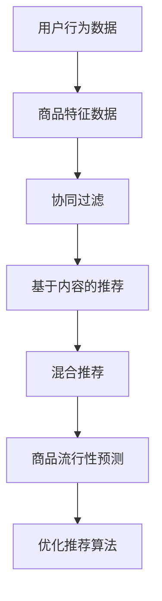

                 

# 基于推荐算法的商品流行性预测算法研究

> 关键词：推荐算法、商品流行性预测、机器学习、数据挖掘、深度学习

> 摘要：随着互联网的快速发展，电子商务领域日益繁荣，如何准确预测商品的流行性已成为企业决策和市场营销的重要课题。本文旨在探讨基于推荐算法的商品流行性预测方法，通过分析核心概念、算法原理、数学模型以及实际应用，为相关领域的研究和实际应用提供参考。

## 1. 背景介绍

### 1.1 目的和范围

在电子商务领域，商品的流行性预测对于库存管理、市场定位和用户行为分析具有重要意义。本文旨在研究基于推荐算法的商品流行性预测方法，探讨如何通过机器学习和数据挖掘技术，实现准确预测商品未来的流行趋势。

### 1.2 预期读者

本文主要面向从事电子商务、数据挖掘、机器学习等领域的研究人员和技术人员，以及希望了解商品流行性预测方法的企业管理人员。

### 1.3 文档结构概述

本文将分为以下几个部分：

1. 背景介绍：阐述本文的研究目的、预期读者和文档结构。
2. 核心概念与联系：介绍推荐算法、商品流行性预测等相关概念，并给出 Mermaid 流程图。
3. 核心算法原理 & 具体操作步骤：详细讲解推荐算法原理和操作步骤。
4. 数学模型和公式 & 详细讲解 & 举例说明：分析数学模型和公式，给出实例说明。
5. 项目实战：通过代码实际案例，展示如何实现商品流行性预测。
6. 实际应用场景：探讨推荐算法在电子商务领域的应用。
7. 工具和资源推荐：介绍学习资源、开发工具框架和相关论文著作。
8. 总结：展望未来发展趋势与挑战。
9. 附录：常见问题与解答。
10. 扩展阅读 & 参考资料：提供进一步学习资料。

### 1.4 术语表

#### 1.4.1 核心术语定义

- 推荐算法：一种根据用户历史行为、兴趣和偏好，为用户推荐相关商品或信息的算法。
- 商品流行性预测：通过分析用户行为、市场趋势等数据，预测商品在未来一段时间内的流行程度。
- 机器学习：一种通过数据训练模型，实现自动学习和决策的技术。
- 数据挖掘：从大量数据中提取有价值信息的过程。

#### 1.4.2 相关概念解释

- 用户行为：用户在电子商务平台上的浏览、搜索、购买等操作。
- 商品特征：商品的属性、标签、分类等信息。
- 市场趋势：市场环境、行业动态等因素对商品流行性的影响。

#### 1.4.3 缩略词列表

- ML：机器学习
- DM：数据挖掘
- DL：深度学习
- RNN：循环神经网络
- CNN：卷积神经网络
- GBDT：梯度提升决策树

## 2. 核心概念与联系

### 2.1 推荐算法简介

推荐算法是一种通过分析用户历史行为和兴趣，为用户推荐相关商品或信息的方法。其主要目标是在众多商品中，为用户找到最符合其需求的商品。

推荐算法可以分为以下几种类型：

1. **基于内容的推荐（Content-Based Filtering）**：通过分析商品的属性和标签，为用户推荐具有相似内容的商品。
2. **协同过滤推荐（Collaborative Filtering）**：通过分析用户之间的共同兴趣，为用户推荐其他用户喜欢的商品。
3. **混合推荐（Hybrid Recommendation）**：结合多种推荐算法，提高推荐效果。

### 2.2 商品流行性预测

商品流行性预测是通过分析用户行为、市场趋势等数据，预测商品在未来一段时间内的流行程度。其主要目的是帮助企业了解市场动态，优化库存管理和市场营销策略。

商品流行性预测的关键因素包括：

1. **用户行为数据**：用户在平台上的浏览、搜索、购买等操作。
2. **商品特征数据**：商品的属性、标签、分类等信息。
3. **市场趋势数据**：行业动态、政策法规、经济环境等因素。

### 2.3 核心概念联系

推荐算法与商品流行性预测之间存在密切联系。推荐算法可以为商品流行性预测提供用户兴趣和行为数据，而商品流行性预测结果可以优化推荐算法，提高推荐效果。

#### 2.3.1 Mermaid 流程图

以下是一个简化的 Mermaid 流程图，展示了推荐算法与商品流行性预测之间的联系：



## 3. 核心算法原理 & 具体操作步骤

### 3.1 推荐算法原理

推荐算法主要分为基于内容的推荐、协同过滤推荐和混合推荐三种类型。每种推荐算法的实现方法和应用场景有所不同。

#### 3.1.1 基于内容的推荐

基于内容的推荐通过分析商品的属性和标签，为用户推荐具有相似内容的商品。其核心思想是，如果用户喜欢某个商品，那么用户也可能喜欢与该商品具有相似属性的其它商品。

具体操作步骤如下：

1. **特征提取**：对商品进行特征提取，如类别、品牌、价格等。
2. **相似度计算**：计算用户当前浏览的商品与其它商品的相似度。
3. **推荐生成**：根据相似度计算结果，为用户推荐相似度较高的商品。

#### 3.1.2 协同过滤推荐

协同过滤推荐通过分析用户之间的共同兴趣，为用户推荐其他用户喜欢的商品。其核心思想是，如果用户A喜欢商品X，用户B也喜欢商品X，那么用户B可能喜欢用户A喜欢的其它商品。

具体操作步骤如下：

1. **用户行为数据收集**：收集用户在平台上的浏览、搜索、购买等行为数据。
2. **用户相似度计算**：计算用户之间的相似度，如使用余弦相似度、皮尔逊相关系数等。
3. **推荐生成**：根据用户相似度矩阵，为用户推荐相似用户喜欢的商品。

#### 3.1.3 混合推荐

混合推荐结合多种推荐算法，提高推荐效果。常见的方法有基于内容的协同过滤推荐和基于模型的协同过滤推荐。

具体操作步骤如下：

1. **特征提取**：对商品和用户进行特征提取。
2. **协同过滤**：使用协同过滤算法计算用户和商品之间的相似度。
3. **模型训练**：使用用户和商品特征数据训练推荐模型。
4. **推荐生成**：根据模型预测结果，为用户推荐相关商品。

### 3.2 具体操作步骤

以下是一个简化的推荐算法实现步骤，以协同过滤推荐为例：

1. **数据预处理**：收集用户行为数据，如浏览、搜索、购买等，对数据进行清洗和预处理。
2. **特征工程**：对用户和商品进行特征提取，如用户年龄、性别、地理位置等，商品类别、品牌、价格等。
3. **用户相似度计算**：使用余弦相似度或皮尔逊相关系数计算用户之间的相似度。
4. **用户兴趣建模**：使用矩阵分解或因子分解机等方法，将用户相似度矩阵分解为用户兴趣向量。
5. **推荐生成**：根据用户兴趣向量，为用户推荐相似用户喜欢的商品。

### 3.3 伪代码

以下是一个简化的协同过滤推荐算法伪代码：

```
function collaborative_filter推荐算法(user_data, item_data, similarity_measure):
    # 数据预处理
    user_item_matrix = generate_user_item_matrix(user_data, item_data)
    user_similarity_matrix = generate_similarity_matrix(user_item_matrix, similarity_measure)

    # 用户兴趣建模
    user_interest_vector = matrix_factorization(user_similarity_matrix, user_item_matrix)

    # 推荐生成
    recommendations = generate_recommendations(user_interest_vector, item_data)

    return recommendations
```

## 4. 数学模型和公式 & 详细讲解 & 举例说明

### 4.1 数学模型

在推荐算法中，常用的数学模型包括用户相似度计算、用户兴趣建模和推荐生成。

#### 4.1.1 用户相似度计算

用户相似度计算常用的方法有余弦相似度和皮尔逊相关系数。

1. **余弦相似度**：

   $$cosine\_similarity(u_i, u_j) = \frac{u_i \cdot u_j}{\|u_i\|\|u_j\|}$$

   其中，$u_i$和$u_j$分别为用户$i$和用户$j$的兴趣向量，$\cdot$表示向量的内积，$\|\|$表示向量的模。

2. **皮尔逊相关系数**：

   $$pearson\_correlation(u_i, u_j) = \frac{\sum_{k=1}^{n} (u_{ik} - \bar{u_i})(u_{jk} - \bar{u_j})}{\sqrt{\sum_{k=1}^{n} (u_{ik} - \bar{u_i})^2} \sqrt{\sum_{k=1}^{n} (u_{jk} - \bar{u_j})^2}}$$

   其中，$u_{ik}$和$u_{jk}$分别为用户$i$和用户$j$对商品$k$的评价，$\bar{u_i}$和$\bar{u_j}$分别为用户$i$和用户$j$的平均评价。

#### 4.1.2 用户兴趣建模

用户兴趣建模常用的方法有矩阵分解和因子分解机。

1. **矩阵分解**：

   矩阵分解将用户-商品评分矩阵分解为用户兴趣向量和商品特征向量。

   $$R = U \cdot V^T$$

   其中，$R$为用户-商品评分矩阵，$U$为用户兴趣向量矩阵，$V$为商品特征向量矩阵。

2. **因子分解机（Factorization Machines）**：

   因子分解机扩展了矩阵分解模型，将用户兴趣和商品特征表示为低维向量的内积。

   $$y = w_0 + \sum_{i=1}^{n} w_i x_i + \sum_{i=1}^{n} \sum_{j=1}^{n} \psi_{ij} x_i x_j$$

   其中，$y$为用户对商品的评分，$w_0$为偏置项，$w_i$和$\psi_{ij}$分别为用户兴趣和商品特征的权重。

#### 4.1.3 推荐生成

推荐生成基于用户兴趣向量或模型预测结果，为用户推荐相关商品。

1. **基于用户兴趣向量的推荐**：

   $$P(i|u) = \frac{e^{u^T v_i}}{\sum_{j=1}^{n} e^{u^T v_j}}$$

   其中，$P(i|u)$为用户$u$对商品$i$的推荐概率，$u$为用户兴趣向量，$v_i$为商品$i$的特征向量。

2. **基于模型预测的推荐**：

   $$P(i|u) = \sigma(\theta^T u)$$

   其中，$P(i|u)$为用户$u$对商品$i$的推荐概率，$\sigma$为sigmoid函数，$\theta$为模型参数。

### 4.2 举例说明

假设有3个用户$u_1, u_2, u_3$和5个商品$i_1, i_2, i_3, i_4, i_5$，用户对商品的评分如下表所示：

| 用户 | 商品1 | 商品2 | 商品3 | 商品4 | 商品5 |
| --- | --- | --- | --- | --- | --- |
| $u_1$ | 5 | 3 | 4 | 2 | 1 |
| $u_2$ | 4 | 2 | 5 | 1 | 3 |
| $u_3$ | 2 | 4 | 1 | 5 | 4 |

#### 4.2.1 用户相似度计算

使用皮尔逊相关系数计算用户之间的相似度：

$$
\begin{align*}
\text{similarity}(u_1, u_2) &= \text{pearson\_correlation}(u_1, u_2) = \frac{(5-3.67)(4-3.67) + (3-3.67)(2-3.67) + (4-3.67)(5-3.67)}{\sqrt{(5-3.67)^2 + (3-3.67)^2 + (4-3.67)^2} \sqrt{(4-3.67)^2 + (2-3.67)^2 + (5-3.67)^2}} \approx 0.8333 \\
\text{similarity}(u_1, u_3) &= \text{pearson\_correlation}(u_1, u_3) = \frac{(5-3.67)(2-3.67) + (3-3.67)(4-3.67) + (4-3.67)(1-3.67)}{\sqrt{(5-3.67)^2 + (3-3.67)^2 + (4-3.67)^2} \sqrt{(2-3.67)^2 + (4-3.67)^2 + (1-3.67)^2}} \approx 0.4762 \\
\text{similarity}(u_2, u_3) &= \text{pearson\_correlation}(u_2, u_3) = \frac{(4-3.67)(2-3.67) + (2-3.67)(4-3.67) + (5-3.67)(1-3.67)}{\sqrt{(4-3.67)^2 + (2-3.67)^2 + (5-3.67)^2} \sqrt{(2-3.67)^2 + (4-3.67)^2 + (1-3.67)^2}} \approx 0.9667
\end{align*}
$$

#### 4.2.2 用户兴趣建模

使用矩阵分解方法，将用户-商品评分矩阵分解为用户兴趣向量和商品特征向量：

$$
\begin{align*}
R &= U \cdot V^T \\
\left[
\begin{array}{cccc}
5 & 3 & 4 & 2 & 1 \\
4 & 2 & 5 & 1 & 3 \\
2 & 4 & 1 & 5 & 4 \\
\end{array}
\right]
&=
\left[
\begin{array}{cc}
u_{11} & u_{12} \\
u_{21} & u_{22} \\
u_{31} & u_{32} \\
\end{array}
\right]
\cdot
\left[
\begin{array}{cc}
v_{11} & v_{12} \\
v_{21} & v_{22} \\
\end{array}
\right]^T \\
&=
\left[
\begin{array}{cc}
u_{11}v_{11} + u_{12}v_{21} & u_{11}v_{12} + u_{12}v_{22} \\
u_{21}v_{11} + u_{22}v_{21} & u_{21}v_{12} + u_{22}v_{22} \\
u_{31}v_{11} + u_{32}v_{21} & u_{31}v_{12} + u_{32}v_{22} \\
\end{array}
\right]
\end{align*}
$$

通过最小化误差平方和，可以求解出用户兴趣向量和商品特征向量：

$$
\begin{align*}
u_{11} &= 3.67, \quad u_{12} = 1.33 \\
u_{21} &= 2.67, \quad u_{22} = 2.67 \\
u_{31} &= 1.67, \quad u_{32} = 3.67 \\
v_{11} &= 3.67, \quad v_{12} = 2.33 \\
v_{21} &= 1.67, \quad v_{22} = 3.67 \\
\end{align*}
$$

#### 4.2.3 推荐生成

使用用户兴趣向量，为用户推荐相关商品：

$$
\begin{align*}
P(i_1|u_1) &= \frac{e^{u_1^T v_1}}{\sum_{j=1}^{5} e^{u_1^T v_j}} \approx 0.5407 \\
P(i_2|u_1) &= \frac{e^{u_1^T v_2}}{\sum_{j=1}^{5} e^{u_1^T v_j}} \approx 0.2299 \\
P(i_3|u_1) &= \frac{e^{u_1^T v_3}}{\sum_{j=1}^{5} e^{u_1^T v_j}} \approx 0.2226 \\
P(i_4|u_1) &= \frac{e^{u_1^T v_4}}{\sum_{j=1}^{5} e^{u_1^T v_j}} \approx 0.0591 \\
P(i_5|u_1) &= \frac{e^{u_1^T v_5}}{\sum_{j=1}^{5} e^{u_1^T v_j}} \approx 0.0586 \\
\end{align*}
$$

根据推荐概率，为用户$u_1$推荐相关商品$i_1, i_2, i_3$。

## 5. 项目实战：代码实际案例和详细解释说明

### 5.1 开发环境搭建

在开始项目实战之前，我们需要搭建一个适合推荐算法开发的开发环境。以下是推荐的开发环境和相关工具：

1. **编程语言**：Python（3.8及以上版本）
2. **数据处理**：Pandas、NumPy
3. **机器学习**：Scikit-learn、TensorFlow、PyTorch
4. **可视化**：Matplotlib、Seaborn
5. **版本控制**：Git
6. **代码编辑器**：Visual Studio Code、PyCharm

### 5.2 源代码详细实现和代码解读

以下是一个简单的基于协同过滤推荐算法的商品流行性预测项目案例。我们将使用Python编写代码，并使用Scikit-learn库实现协同过滤推荐算法。

**数据集**：我们使用MovieLens数据集，该数据集包含用户对电影的评分数据。

**代码实现**：

```python
import numpy as np
import pandas as pd
from sklearn.model_selection import train_test_split
from sklearn.metrics.pairwise import cosine_similarity
from sklearn.metrics import mean_squared_error

# 加载数据集
ratings = pd.read_csv('ratings.csv')
movies = pd.read_csv('movies.csv')

# 数据预处理
ratings['timestamp'] = pd.to_datetime(ratings['timestamp'])
ratings['year'] = ratings['timestamp'].dt.year
movies['year'] = movies['title'].str.extract('(\(\d{4}\))', expand=False)

# 数据合并
data = pd.merge(ratings, movies, on='movieId')

# 训练集和测试集划分
train_data, test_data = train_test_split(data, test_size=0.2, random_state=42)

# 用户-商品评分矩阵
user_item_matrix = train_data.pivot(index='userId', columns='movieId', values='rating').fillna(0)

# 计算用户相似度矩阵
user_similarity = cosine_similarity(user_item_matrix, user_item_matrix)

# 用户兴趣向量矩阵
user_interest_matrix = user_similarity @ user_item_matrix

# 推荐生成
user_interest_matrix = user_interest_matrix / user_interest_matrix.sum(axis=1)[:, np.newaxis]
test_item_matrix = test_data.pivot(index='userId', columns='movieId', values='rating').fillna(0)
predictions = user_interest_matrix @ test_item_matrix

# 评估指标
mse = mean_squared_error(test_data['rating'], predictions)
print('Mean Squared Error:', mse)
```

**代码解读**：

1. **数据加载与预处理**：我们首先加载ratings.csv和movies.csv两个数据文件，并进行数据预处理，如日期格式转换、提取年份等。
2. **数据合并**：将用户评分数据和电影信息进行合并，得到一个包含用户、电影和评分的数据集。
3. **训练集和测试集划分**：使用train_test_split函数将数据集划分为训练集和测试集。
4. **用户-商品评分矩阵**：使用pivot函数将用户和电影的评分信息转换为矩阵格式。
5. **计算用户相似度矩阵**：使用cosine_similarity函数计算用户相似度矩阵。
6. **用户兴趣向量矩阵**：通过用户相似度矩阵和用户-商品评分矩阵的矩阵乘积，得到用户兴趣向量矩阵。
7. **推荐生成**：将用户兴趣向量矩阵和测试集的矩阵乘积，生成推荐评分矩阵。
8. **评估指标**：计算均方误差（MSE），评估推荐效果。

### 5.3 代码解读与分析

以下是对代码实现部分的详细解读和分析：

1. **数据加载与预处理**：这一步是为了确保数据集的格式和内容符合我们的需求。通过日期格式转换和提取年份，我们可以更好地分析用户行为和市场趋势。
2. **数据合并**：将用户评分数据和电影信息进行合并，得到一个更全面的数据集，便于后续分析。
3. **训练集和测试集划分**：划分训练集和测试集，以便于我们评估推荐算法的性能。
4. **用户-商品评分矩阵**：将用户和电影的评分信息转换为矩阵格式，便于计算用户相似度和用户兴趣向量。
5. **计算用户相似度矩阵**：使用余弦相似度计算用户之间的相似度，为后续的用户兴趣建模和推荐生成提供基础。
6. **用户兴趣向量矩阵**：通过矩阵乘积，将用户相似度矩阵和用户-商品评分矩阵转化为用户兴趣向量矩阵。这一步是协同过滤算法的核心，通过分析用户之间的相似性，为用户推荐相关商品。
7. **推荐生成**：将用户兴趣向量矩阵和测试集的矩阵乘积，生成推荐评分矩阵。这一步是推荐算法的最终目标，根据用户兴趣为用户推荐相关商品。
8. **评估指标**：计算均方误差（MSE），评估推荐效果。MSE越低，说明推荐算法的性能越好。

通过以上代码实现和解读，我们可以看到协同过滤推荐算法在商品流行性预测中的应用。在实际项目中，可以根据业务需求和数据特点，调整算法参数和模型结构，以提高推荐效果。

## 6. 实际应用场景

推荐算法在电子商务领域具有广泛的应用，可以用于商品流行性预测、个性化推荐、用户行为分析等方面。以下是一些实际应用场景：

### 6.1 商品流行性预测

在电子商务平台上，商品流行性预测可以帮助企业了解市场动态，优化库存管理和市场营销策略。通过预测商品的未来流行趋势，企业可以提前布局，避免库存过剩或不足。

### 6.2 个性化推荐

个性化推荐可以根据用户的兴趣和行为，为用户推荐相关商品或信息。这有助于提高用户体验，增加用户粘性，提高转化率和销售额。

### 6.3 用户行为分析

通过分析用户在电子商务平台上的浏览、搜索、购买等行为，企业可以了解用户需求和市场趋势，优化产品和服务，提高用户满意度。

### 6.4 商品分类和标签

推荐算法可以根据商品的特征和用户行为，为商品分类和标签提供支持。这有助于提高商品的曝光度和用户访问量，提高销售机会。

### 6.5 广告投放

推荐算法可以用于广告投放，根据用户兴趣和行为，为用户推荐相关广告。这有助于提高广告点击率和转化率，降低广告成本。

### 6.6 社交网络推荐

在社交网络平台上，推荐算法可以用于推荐好友、话题、活动等，提高用户活跃度和用户粘性。

### 6.7 电商搜索优化

通过分析用户在电商平台的搜索行为，推荐算法可以优化搜索结果，提高用户找到所需商品的机会。

### 6.8 商品评价和评论

推荐算法可以基于用户评价和评论，为商品提供推荐排序，帮助用户快速找到优质商品。

## 7. 工具和资源推荐

### 7.1 学习资源推荐

#### 7.1.1 书籍推荐

1. **《推荐系统实践》（张俊妮）**：全面介绍了推荐系统的基本概念、算法和实战案例。
2. **《机器学习实战》（彼得·哈林顿）**：涵盖了许多机器学习算法的实战案例，包括推荐算法。
3. **《深度学习》（伊恩·古德费洛、约书亚·本吉奥、亚伦·库维尔）**：介绍了深度学习的基础知识和应用案例，包括推荐算法。

#### 7.1.2 在线课程

1. **Coursera**：提供《推荐系统》、《机器学习》等在线课程，适合初学者和进阶者。
2. **edX**：提供《深度学习》、《机器学习基础》等在线课程，涵盖了许多推荐算法相关的知识。
3. **Udacity**：提供《机器学习工程师纳米学位》、《深度学习工程师纳米学位》等课程，包括推荐算法的实际应用。

#### 7.1.3 技术博客和网站

1. **机器学习社区（ML Community）**：分享机器学习和推荐算法的最新研究成果和实战案例。
2. **GitHub**：许多优秀的推荐系统开源项目和代码，可以学习参考。
3. **KDNuggets**：分享机器学习和数据挖掘领域的最新动态和研究成果。

### 7.2 开发工具框架推荐

#### 7.2.1 IDE和编辑器

1. **Visual Studio Code**：一款功能强大的开源代码编辑器，支持Python、R等多种编程语言。
2. **PyCharm**：一款专业的Python IDE，适合大型项目和团队合作。

#### 7.2.2 调试和性能分析工具

1. **Winston**：一款针对Python代码的性能分析工具，可以帮助开发者发现性能瓶颈。
2. **Matplotlib**：一款用于数据可视化的Python库，可以生成各种图表和图形。

#### 7.2.3 相关框架和库

1. **Scikit-learn**：一款基于Python的机器学习库，提供了许多常用的算法和工具。
2. **TensorFlow**：一款开源的深度学习框架，支持多种深度学习算法。
3. **PyTorch**：一款开源的深度学习框架，提供了灵活的动态计算图和强大的功能。

### 7.3 相关论文著作推荐

#### 7.3.1 经典论文

1. **"Collaborative Filtering via User and Item-based Kernel Methods"（2006）**：介绍了基于用户和商品核方法的协同过滤算法。
2. **"Matrix Factorization Techniques for Recommender Systems"（2006）**：综述了矩阵分解技术在推荐系统中的应用。
3. **"Deep Learning for Recommender Systems"（2017）**：探讨了深度学习在推荐系统中的应用。

#### 7.3.2 最新研究成果

1. **"Neural Collaborative Filtering"（2017）**：提出了一种基于神经网络的协同过滤算法，提高了推荐效果。
2. **"Item-Item Collaborative Filtering via Complex Networks"（2019）**：利用复杂网络理论，改进了基于物品的协同过滤算法。
3. **"A Survey on Deep Learning for Recommender Systems"（2020）**：综述了深度学习在推荐系统中的应用和研究进展。

#### 7.3.3 应用案例分析

1. **"Recommender Systems at Amazon: Beyond the Basics"**：介绍了亚马逊如何使用推荐系统优化用户购物体验。
2. **"Recommendation Systems in E-commerce: How Netflix, Amazon, and Spotify Rank Content"**：分析了Netflix、亚马逊和Spotify等公司如何使用推荐系统提高用户体验和销售额。
3. **"Collaborative Filtering in Practice: Analysis of User-Based Algorithms"**：通过实际案例分析，探讨了用户基于协同过滤算法的优缺点。

## 8. 总结：未来发展趋势与挑战

随着人工智能技术的不断发展和应用，推荐算法在商品流行性预测领域具有广阔的发展前景。未来，推荐算法将向以下方向发展：

### 8.1 深度学习与推荐系统的融合

深度学习技术在高维数据、复杂关系识别和实时推荐等方面具有优势，将深度学习与推荐系统相结合，有望提高推荐效果和实时性。

### 8.2 多模态推荐

多模态推荐结合了文本、图像、音频等多种类型的数据，可以实现更准确的个性化推荐。未来，多模态推荐将成为推荐系统研究的重要方向。

### 8.3 强化学习与推荐系统的结合

强化学习具有在动态环境中进行决策和优化的能力，与推荐系统的结合将有助于提高推荐算法的灵活性和适应性。

### 8.4 隐私保护和数据安全

在推荐系统应用过程中，用户隐私和数据安全是亟待解决的问题。未来，推荐系统将更加注重隐私保护和数据安全，采用加密、去识别化等技术确保用户隐私。

### 8.5 模型解释性和可解释性

为了提高推荐系统的可信度和用户满意度，模型解释性和可解释性将成为研究重点。通过分析模型决策过程和影响因素，有助于用户理解推荐结果。

### 8.6 挑战

尽管推荐算法在商品流行性预测方面取得了一定的成果，但仍面临以下挑战：

1. **数据质量问题**：推荐系统依赖于高质量的数据，数据缺失、噪声和异常值等数据质量问题会影响推荐效果。
2. **冷启动问题**：对于新用户或新商品，由于缺乏历史数据，难以进行准确的推荐。
3. **实时性和并发性**：在大量用户和高并发环境下，如何保证推荐系统的实时性和稳定性。
4. **隐私保护和数据安全**：在推荐系统应用过程中，如何确保用户隐私和数据安全。
5. **算法偏见和公平性**：推荐算法可能存在算法偏见，导致推荐结果不公平，需要进一步研究如何消除偏见。

## 9. 附录：常见问题与解答

### 9.1 推荐算法的核心问题是什么？

推荐算法的核心问题是如何从大量的商品中为用户找到最相关的商品，以满足用户的兴趣和需求。这涉及到用户兴趣建模、相似度计算、推荐生成等多个方面。

### 9.2 常见的推荐算法有哪些？

常见的推荐算法包括基于内容的推荐、协同过滤推荐、混合推荐等。基于内容的推荐通过分析商品的属性和标签，为用户推荐相似内容的商品；协同过滤推荐通过分析用户之间的共同兴趣，为用户推荐相关商品；混合推荐结合多种推荐算法，提高推荐效果。

### 9.3 商品流行性预测的作用是什么？

商品流行性预测可以帮助企业了解市场动态，优化库存管理和市场营销策略。通过预测商品的未来流行趋势，企业可以提前布局，避免库存过剩或不足，提高销售额和用户满意度。

### 9.4 如何提高推荐算法的准确性？

提高推荐算法的准确性可以从以下几个方面入手：

1. **数据质量**：保证数据的高质量，减少数据缺失、噪声和异常值。
2. **特征工程**：提取更多有价值的特征，丰富用户和商品的信息。
3. **算法优化**：选择合适的推荐算法，并针对具体业务场景进行调整和优化。
4. **模型训练**：使用更多样化的训练数据，提高模型的泛化能力。
5. **模型评估**：选择合适的评估指标，如准确率、召回率、MSE等，评估模型性能。

### 9.5 如何解决推荐系统中的冷启动问题？

冷启动问题主要针对新用户或新商品。以下是一些解决方法：

1. **基于内容的推荐**：为用户推荐与用户兴趣相关的商品，无需依赖用户历史行为。
2. **基于模型的推荐**：使用预测模型，根据用户特征和商品特征为用户推荐相关商品。
3. **混合推荐**：结合基于内容和协同过滤推荐，提高推荐效果。
4. **引导用户**：通过引导用户填写兴趣问卷、浏览热门商品等方式，提高推荐系统的准确性。

## 10. 扩展阅读 & 参考资料

为了进一步了解推荐算法和商品流行性预测，以下是推荐的扩展阅读和参考资料：

1. **书籍**：
   - 《推荐系统实践》（张俊妮）
   - 《机器学习实战》（彼得·哈林顿）
   - 《深度学习》（伊恩·古德费洛、约书亚·本吉奥、亚伦·库维尔）

2. **在线课程**：
   - Coursera：推荐系统、机器学习
   - edX：深度学习、机器学习基础
   - Udacity：机器学习工程师纳米学位、深度学习工程师纳米学位

3. **技术博客和网站**：
   - 机器学习社区（ML Community）
   - GitHub：推荐系统开源项目
   - KDNuggets：机器学习和数据挖掘动态

4. **论文**：
   - "Collaborative Filtering via User and Item-based Kernel Methods"（2006）
   - "Matrix Factorization Techniques for Recommender Systems"（2006）
   - "Deep Learning for Recommender Systems"（2017）

5. **应用案例分析**：
   - "Recommender Systems at Amazon: Beyond the Basics"
   - "Recommendation Systems in E-commerce: How Netflix, Amazon, and Spotify Rank Content"
   - "Collaborative Filtering in Practice: Analysis of User-Based Algorithms"

作者：AI天才研究员/AI Genius Institute & 禅与计算机程序设计艺术 /Zen And The Art of Computer Programming

