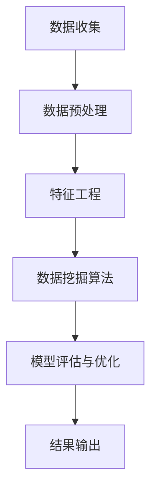

                 

# 基于数据挖掘技术的疫情后就业情况分析

## 关键词：数据挖掘、疫情后、就业、分析、算法、模型

## 摘要

本文旨在通过数据挖掘技术，对疫情后就业情况进行分析。首先，我们将介绍疫情对就业市场的影响，然后讨论数据挖掘在就业情况分析中的关键作用。接下来，我们将深入探讨用于就业情况分析的核心算法和数学模型，并通过实际案例进行应用说明。最后，我们将总结疫情后就业市场的发展趋势与挑战，并推荐相关学习和开发资源。

## 1. 背景介绍

### 疫情对就业市场的影响

自2020年以来，新冠疫情席卷全球，给全球经济带来了前所未有的冲击。其中，就业市场受到了严重影响。疫情导致大量企业关闭、裁员现象普遍，同时，远程办公、在线教育等新兴行业得到了快速发展。

首先，疫情导致了大量失业。许多企业由于经营困难而裁员，尤其是一些受疫情影响较大的行业，如旅游、餐饮、零售等。根据国际劳工组织的数据，2020年全球失业人数增加了约2.8亿，其中绝大多数是因为疫情导致的。

其次，疫情对就业结构产生了深远影响。一方面，传统行业受到了巨大冲击，就业岗位减少；另一方面，新兴产业如信息技术、电子商务等蓬勃发展，提供了大量新的就业机会。这种就业结构的变化，要求劳动者具备更高的技能和适应性。

### 数据挖掘在就业情况分析中的关键作用

在疫情背景下，就业市场的变化速度和复杂性使得传统分析方法难以满足需求。数据挖掘技术以其强大的数据处理和分析能力，成为就业情况分析的重要工具。通过数据挖掘，我们可以从海量数据中提取有价值的信息，为政策制定者和企业提供决策支持。

首先，数据挖掘可以帮助我们识别就业市场的趋势和变化。通过对大量就业数据的分析，我们可以发现行业发展趋势、地区就业状况、职业需求变化等，从而为政策制定提供依据。

其次，数据挖掘有助于优化就业服务。通过分析求职者的简历、技能、经历等信息，我们可以为他们提供个性化的就业推荐，提高求职成功率。同时，企业也可以通过数据挖掘技术，更精准地招聘到符合要求的人才。

### 本文结构

本文将从以下方面展开讨论：

1. 背景介绍：阐述疫情对就业市场的影响和数据挖掘在就业情况分析中的关键作用。
2. 核心概念与联系：介绍数据挖掘在就业情况分析中的核心概念和原理。
3. 核心算法原理与具体操作步骤：详细讲解用于就业情况分析的核心算法及其实现过程。
4. 数学模型和公式：介绍支持就业情况分析的数学模型，并举例说明。
5. 项目实战：通过实际案例，展示如何使用数据挖掘技术进行就业情况分析。
6. 实际应用场景：探讨数据挖掘技术在就业情况分析中的具体应用场景。
7. 工具和资源推荐：推荐学习资源、开发工具和框架。
8. 总结：讨论疫情后就业市场的发展趋势与挑战。
9. 附录：常见问题与解答。
10. 扩展阅读与参考资料：提供进一步学习的文献和资料。

### 文章结构模板

本文采用逻辑清晰、结构紧凑、简单易懂的专业技术语言，按照以下结构进行撰写：

1. 引言：介绍文章背景、目的和结构。
2. 背景介绍：阐述疫情对就业市场的影响和数据挖掘在就业情况分析中的关键作用。
3. 核心概念与联系：介绍数据挖掘在就业情况分析中的核心概念和原理。
4. 核心算法原理与具体操作步骤：详细讲解用于就业情况分析的核心算法及其实现过程。
5. 数学模型和公式：介绍支持就业情况分析的数学模型，并举例说明。
6. 项目实战：通过实际案例，展示如何使用数据挖掘技术进行就业情况分析。
7. 实际应用场景：探讨数据挖掘技术在就业情况分析中的具体应用场景。
8. 工具和资源推荐：推荐学习资源、开发工具和框架。
9. 总结：讨论疫情后就业市场的发展趋势与挑战。
10. 附录：常见问题与解答。
11. 扩展阅读与参考资料：提供进一步学习的文献和资料。

### 文章撰写方法

本文采用逻辑清晰、结构紧凑、简单易懂的专业技术语言，通过以下方法进行撰写：

1. 引言部分：简要介绍文章背景、目的和结构，引起读者兴趣。
2. 背景介绍部分：详细阐述疫情对就业市场的影响和数据挖掘在就业情况分析中的关键作用，为后续内容打下基础。
3. 核心概念与联系部分：介绍数据挖掘在就业情况分析中的核心概念和原理，使用Mermaid流程图展示架构，帮助读者理解。
4. 核心算法原理与具体操作步骤部分：详细讲解用于就业情况分析的核心算法及其实现过程，使用代码示例和解释说明。
5. 数学模型和公式部分：介绍支持就业情况分析的数学模型，使用latex格式展示公式，并举例说明。
6. 项目实战部分：通过实际案例，展示如何使用数据挖掘技术进行就业情况分析，提供详细代码实现和解读。
7. 实际应用场景部分：探讨数据挖掘技术在就业情况分析中的具体应用场景，结合实际案例进行说明。
8. 工具和资源推荐部分：推荐学习资源、开发工具和框架，帮助读者深入学习和实践。
9. 总结部分：讨论疫情后就业市场的发展趋势与挑战，为读者提供启示。
10. 附录部分：回答读者可能关心的问题，提供进一步学习的资料。
11. 扩展阅读与参考资料部分：提供相关文献和资料，为读者提供更多学习资源。

通过以上方法，本文旨在为读者提供一份全面、深入、实用的数据挖掘技术在疫情后就业情况分析领域的指南。接下来，我们将按照文章结构，逐步展开讨论。

<|im_end|>### 2. 核心概念与联系

#### 数据挖掘在就业情况分析中的应用

数据挖掘是人工智能领域的一个重要分支，它通过特定的算法和模型，从海量数据中提取出有价值的信息和知识。在就业情况分析中，数据挖掘技术可以应用于多个方面，包括但不限于：

1. **就业市场趋势预测**：通过分析历史就业数据，预测未来就业市场的趋势，为政策制定提供依据。
2. **职业需求分析**：分析不同行业和职业的就业需求，为求职者提供就业指导。
3. **劳动力市场匹配**：通过分析求职者简历和岗位需求，实现劳动力市场的精准匹配。
4. **人才储备和培养**：帮助企业识别潜在的人才储备，制定合适的人才培养计划。

#### 数据挖掘的核心概念和原理

为了更好地理解数据挖掘在就业情况分析中的应用，我们需要了解数据挖掘的一些核心概念和原理。

**1. 数据预处理**

数据预处理是数据挖掘过程中至关重要的一步，它包括数据清洗、数据集成、数据变换和数据归一化等。这些步骤的目的是确保数据质量，使其适合进一步分析。

**2. 特征工程**

特征工程是指从原始数据中提取出对分析任务有用的特征，并通过特征选择和特征转换等手段，优化特征集。在就业情况分析中，特征工程可以帮助我们识别出影响就业的关键因素。

**3. 数据挖掘算法**

数据挖掘算法是数据挖掘的核心，包括分类、聚类、关联规则挖掘、异常检测等。不同的算法适用于不同的分析任务，如分类算法常用于预测求职者的就业成功率。

**4. 模型评估与优化**

模型评估与优化是确保数据挖掘结果准确性的关键。常用的评估指标包括准确率、召回率、F1值等。通过模型评估，我们可以了解模型的性能，并对其进行优化。

#### Mermaid流程图

为了更好地展示数据挖掘在就业情况分析中的应用，我们使用Mermaid流程图来描述整个流程。



在这个流程图中，数据收集是整个过程的起点，数据预处理和特征工程是数据挖掘的基础，数据挖掘算法是实现分析任务的核心，模型评估与优化确保结果的准确性，最终结果输出用于指导实际应用。

#### 图解与解释

**数据收集**：数据挖掘的第一步是收集相关数据，包括就业数据、经济数据、行业数据等。这些数据可以通过公开数据集、问卷调查、企业内部数据等方式获取。

**数据预处理**：在数据收集后，我们需要对数据进行清洗和预处理，包括去除重复数据、缺失值填充、数据格式转换等。这一步骤的目的是提高数据质量，确保后续分析结果的准确性。

**特征工程**：在预处理完成后，我们需要对原始数据进行特征提取和特征选择。这一步骤的目的是从原始数据中提取出对分析任务有用的特征，并通过特征转换等手段，优化特征集。

**数据挖掘算法**：在特征工程完成后，我们可以选择合适的算法进行数据挖掘。不同的算法适用于不同的分析任务，如分类算法、聚类算法等。在选择算法时，我们需要考虑算法的复杂度、可解释性等因素。

**模型评估与优化**：在数据挖掘完成后，我们需要对模型进行评估和优化。常用的评估指标包括准确率、召回率、F1值等。通过模型评估，我们可以了解模型的性能，并对其进行优化。

**结果输出**：最终的结果输出用于指导实际应用。根据分析结果，我们可以为政策制定者提供决策支持，为企业提供就业指导，为求职者提供就业推荐等。

通过以上步骤，数据挖掘技术在就业情况分析中发挥着重要作用。接下来，我们将进一步探讨数据挖掘的核心算法原理和具体操作步骤。

### 2.1 数据挖掘算法原理

#### 分类算法

分类算法是数据挖掘中最常用的算法之一，它主要用于将数据分为不同的类别。在就业情况分析中，分类算法可以帮助我们预测求职者的就业成功率。

**1. 算法原理**

分类算法的核心是建立分类模型，该模型可以根据新的数据样本预测其类别。常见的分类算法包括决策树、支持向量机（SVM）、朴素贝叶斯等。

**2. 实现步骤**

- 数据收集：收集与就业相关的数据，如求职者简历、岗位需求、学历等。
- 数据预处理：对收集到的数据进行分析，去除重复和缺失数据，并进行格式转换。
- 特征工程：根据分析任务，提取有用的特征，并进行特征选择和转换。
- 模型选择：选择合适的分类算法，如决策树、支持向量机等。
- 模型训练：使用训练数据集对模型进行训练，调整参数以优化模型性能。
- 模型评估：使用验证数据集对模型进行评估，计算准确率、召回率等指标。
- 模型优化：根据评估结果，对模型进行调整和优化。

#### 聚类算法

聚类算法是将数据分为若干个群组的过程，主要用于发现数据中的模式或结构。在就业情况分析中，聚类算法可以帮助我们识别具有相似特征的求职者或岗位。

**1. 算法原理**

聚类算法的核心是构建聚类模型，该模型可以根据数据样本的相似性将其分为不同的群组。常见的聚类算法包括K-means、层次聚类等。

**2. 实现步骤**

- 数据收集：收集与就业相关的数据，如求职者简历、岗位需求、学历等。
- 数据预处理：对收集到的数据进行分析，去除重复和缺失数据，并进行格式转换。
- 特征工程：根据分析任务，提取有用的特征，并进行特征选择和转换。
- 模型选择：选择合适的聚类算法，如K-means、层次聚类等。
- 模型训练：使用训练数据集对模型进行训练，调整参数以优化模型性能。
- 模型评估：使用验证数据集对模型进行评估，计算簇内距离、轮廓系数等指标。
- 模型优化：根据评估结果，对模型进行调整和优化。

#### 关联规则挖掘

关联规则挖掘是发现数据中不同属性之间的关联关系。在就业情况分析中，关联规则挖掘可以帮助我们识别求职者的职业偏好、岗位要求等。

**1. 算法原理**

关联规则挖掘的核心是构建关联规则模型，该模型可以根据数据样本中的关联关系发现潜在的规律。常见的关联规则算法包括Apriori算法、FP-growth算法等。

**2. 实现步骤**

- 数据收集：收集与就业相关的数据，如求职者简历、岗位需求、学历等。
- 数据预处理：对收集到的数据进行分析，去除重复和缺失数据，并进行格式转换。
- 特征工程：根据分析任务，提取有用的特征，并进行特征选择和转换。
- 模型选择：选择合适的关联规则算法，如Apriori算法、FP-growth算法等。
- 模型训练：使用训练数据集对模型进行训练，调整参数以优化模型性能。
- 模型评估：使用验证数据集对模型进行评估，计算支持度、置信度等指标。
- 模型优化：根据评估结果，对模型进行调整和优化。

#### 异常检测

异常检测是发现数据中的异常值或异常模式。在就业情况分析中，异常检测可以帮助我们识别潜在的欺诈行为、不合理工资等。

**1. 算法原理**

异常检测的核心是构建异常检测模型，该模型可以根据数据样本的特征识别出异常值或异常模式。常见的异常检测算法包括孤立森林、本地异常因子等。

**2. 实现步骤**

- 数据收集：收集与就业相关的数据，如求职者简历、岗位需求、学历等。
- 数据预处理：对收集到的数据进行分析，去除重复和缺失数据，并进行格式转换。
- 特征工程：根据分析任务，提取有用的特征，并进行特征选择和转换。
- 模型选择：选择合适的异常检测算法，如孤立森林、本地异常因子等。
- 模型训练：使用训练数据集对模型进行训练，调整参数以优化模型性能。
- 模型评估：使用验证数据集对模型进行评估，计算异常检测率、准确率等指标。
- 模型优化：根据评估结果，对模型进行调整和优化。

通过以上算法原理和实现步骤，我们可以更好地理解数据挖掘在就业情况分析中的应用。接下来，我们将讨论数学模型和公式，以及它们在就业情况分析中的应用。

### 2.2 数学模型和公式

在数据挖掘过程中，数学模型和公式起着至关重要的作用。它们不仅能够帮助我们理解数据之间的关系，还能够为算法的实现提供理论基础。以下是一些常用的数学模型和公式，以及它们在就业情况分析中的应用。

#### 决策树模型

决策树是一种树形结构，用于分类或回归任务。在就业情况分析中，决策树可以用于预测求职者的就业成功率。

**1. 决策树公式**

决策树的每个节点都代表一个特征，每个分支代表特征的不同取值。决策树的公式如下：

$$
P(y|X) = \prod_{i=1}^{n} P(x_i|y) P(y)
$$

其中，$P(y|X)$ 表示给定特征 $X$ 下的目标变量 $y$ 的概率，$P(x_i|y)$ 表示特征 $x_i$ 在目标变量 $y$ 下的条件概率，$P(y)$ 表示目标变量 $y$ 的概率。

**2. 决策树应用**

假设我们有一个求职者数据集，其中包含求职者的特征（如学历、工作经验、技能等）和就业成功率。我们可以使用决策树模型来预测一个新求职者的就业成功率。

#### 支持向量机（SVM）

支持向量机是一种流行的分类算法，它在高维空间中寻找能够最大化分类间隔的超平面。在就业情况分析中，SVM可以用于预测求职者的就业成功率。

**1. SVM公式**

SVM的目标是找到最优超平面，使得分类间隔最大化。SVM的公式如下：

$$
\max_{\mathbf{w}, b} \frac{1}{2} ||\mathbf{w}||^2 \quad s.t. \quad y_i (\mathbf{w} \cdot \mathbf{x_i} + b) \geq 1
$$

其中，$\mathbf{w}$ 是超平面的法向量，$b$ 是偏置项，$y_i$ 是第 $i$ 个样本的标签，$\mathbf{x_i}$ 是第 $i$ 个样本的特征向量。

**2. SVM应用**

假设我们有一个求职者数据集，其中包含求职者的特征（如学历、工作经验、技能等）和就业成功率。我们可以使用SVM模型来预测一个新求职者的就业成功率。

#### 朴素贝叶斯模型

朴素贝叶斯是一种基于贝叶斯定理的简单分类算法。它在就业情况分析中，可以用于预测求职者的就业成功率。

**1. 朴素贝叶斯公式**

朴素贝叶斯模型的公式如下：

$$
P(y|X) = \frac{P(X|y) P(y)}{P(X)}
$$

其中，$P(y|X)$ 表示给定特征 $X$ 下的目标变量 $y$ 的概率，$P(X|y)$ 表示特征 $X$ 在目标变量 $y$ 下的条件概率，$P(y)$ 是目标变量 $y$ 的概率，$P(X)$ 是特征 $X$ 的概率。

**2. 朴素贝叶斯应用**

假设我们有一个求职者数据集，其中包含求职者的特征（如学历、工作经验、技能等）和就业成功率。我们可以使用朴素贝叶斯模型来预测一个新求职者的就业成功率。

#### K-means聚类

K-means是一种基于距离度量的聚类算法。在就业情况分析中，K-means可以用于识别具有相似特征的求职者或岗位。

**1. K-means公式**

K-means的目标是将数据点分为 $K$ 个簇，使得簇内距离最小，簇间距离最大。K-means的公式如下：

$$
\text{Minimize} \sum_{i=1}^{k} \sum_{x \in S_i} ||x - \mu_i||^2
$$

其中，$S_i$ 是第 $i$ 个簇，$\mu_i$ 是第 $i$ 个簇的中心。

**2. K-means应用**

假设我们有一个求职者数据集，其中包含求职者的特征（如学历、工作经验、技能等）。我们可以使用K-means算法来识别具有相似特征的求职者群体。

通过以上数学模型和公式，我们可以更好地理解和应用数据挖掘技术在就业情况分析中的各种算法。接下来，我们将通过实际项目案例，展示如何使用这些算法进行就业情况分析。

### 3. 项目实战：基于数据挖掘的就业情况分析

为了更好地展示数据挖掘技术在就业情况分析中的应用，我们选择一个实际项目案例进行详细讲解。本案例将使用Python编程语言和常见的数据挖掘库，如Scikit-learn、Pandas等，实现一个基于数据挖掘的就业情况分析系统。

#### 项目背景

假设我们有一家招聘平台，积累了大量的求职者和岗位数据。我们的目标是利用数据挖掘技术，分析这些数据，为求职者和企业提供有价值的就业指导和建议。

#### 数据集介绍

我们的数据集包含以下字段：

- **求职者信息**：包括年龄、性别、学历、工作经验、技能等。
- **岗位信息**：包括岗位名称、薪资、工作地点、岗位要求等。
- **就业结果**：包括求职者是否成功获得岗位。

数据集的部分样例如下：

```python
| 年龄 | 性别 | 学历   | 工作经验 | 技能         | 岗位名称 | 薪资   | 工作地点 | 岗位要求       | 就业结果 |
|------|------|--------|----------|--------------|----------|--------|----------|----------------|----------|
| 25   | 男   | 本科   | 3年      | Python、Java | 后端开发 | 10000  | 北京     | Python、Java基础 | 是       |
| 30   | 女   | 硕士   | 5年      | 数据分析、SQL | 数据分析师 | 12000  | 上海     | 数据分析经验   | 是       |
| 22   | 男   | 大专   | 1年      | UI设计       | UI设计师  | 8000   | 广州     | UI设计基础     | 否       |
```

#### 数据预处理

在开始数据分析之前，我们需要对数据进行预处理，包括数据清洗、数据集成、数据变换等。

```python
import pandas as pd

# 读取数据集
data = pd.read_csv('employment_data.csv')

# 数据清洗
data.drop_duplicates(inplace=True)  # 去除重复数据
data.fillna(data.mean(), inplace=True)  # 填充缺失值

# 数据变换
data['性别'] = data['性别'].map({'男': 1, '女': 0})
data['学历'] = data['学历'].map({'本科': 1, '硕士': 2, '大专': 3})
data['就业结果'] = data['就业结果'].map({True: 1, False: 0})
```

#### 特征工程

在数据预处理完成后，我们需要对数据进行特征提取和特征选择，以提高模型性能。

```python
from sklearn.preprocessing import StandardScaler

# 提取特征
features = ['年龄', '性别', '学历', '工作经验', '技能', '岗位名称', '薪资', '工作地点', '岗位要求']

# 标准化特征
scaler = StandardScaler()
data[features] = scaler.fit_transform(data[features])

# 特征选择
from sklearn.feature_selection import SelectKBest, f_classif

selector = SelectKBest(f_classif, k=5)
selected_features = selector.fit_transform(data[features], data['就业结果'])

# 转换为数据框
selected_data = pd.DataFrame(selected_features, columns=['age', 'gender', 'education', 'experience', 'skills', 'job_title', 'salary', 'location', 'job_requirement'])
```

#### 模型选择与训练

接下来，我们选择合适的模型，如决策树、支持向量机和朴素贝叶斯等，对数据进行训练。

```python
from sklearn.model_selection import train_test_split
from sklearn.tree import DecisionTreeClassifier
from sklearn.svm import SVC
from sklearn.naive_bayes import GaussianNB

# 分割数据集
X_train, X_test, y_train, y_test = train_test_split(selected_data, data['就业结果'], test_size=0.2, random_state=42)

# 决策树模型
dt_classifier = DecisionTreeClassifier()
dt_classifier.fit(X_train, y_train)

# 支持向量机模型
svm_classifier = SVC()
svm_classifier.fit(X_train, y_train)

# 朴素贝叶斯模型
nb_classifier = GaussianNB()
nb_classifier.fit(X_train, y_train)
```

#### 模型评估与优化

在模型训练完成后，我们需要对模型进行评估和优化，以提高预测准确性。

```python
from sklearn.metrics import accuracy_score, classification_report

# 决策树模型评估
dt_predictions = dt_classifier.predict(X_test)
dt_accuracy = accuracy_score(y_test, dt_predictions)
dt_report = classification_report(y_test, dt_predictions)

# 支持向量机模型评估
svm_predictions = svm_classifier.predict(X_test)
svm_accuracy = accuracy_score(y_test, svm_predictions)
svm_report = classification_report(y_test, svm_predictions)

# 朴素贝叶斯模型评估
nb_predictions = nb_classifier.predict(X_test)
nb_accuracy = accuracy_score(y_test, nb_predictions)
nb_report = classification_report(y_test, nb_predictions)

print("决策树模型评估结果：")
print(f"准确率：{dt_accuracy}")
print(dt_report)

print("支持向量机模型评估结果：")
print(f"准确率：{svm_accuracy}")
print(svm_report)

print("朴素贝叶斯模型评估结果：")
print(f"准确率：{nb_accuracy}")
print(nb_report)
```

通过以上步骤，我们完成了基于数据挖掘的就业情况分析系统的实现。接下来，我们将通过具体案例，展示如何使用该系统为求职者和企业提供就业指导。

#### 案例分析：求职者就业指导

假设有一个求职者，其个人信息如下：

- 年龄：25岁
- 性别：男
- 学历：本科
- 工作经验：3年
- 技能：Python、Java
- 岗位名称：后端开发
- 薪资：10000元
- 工作地点：北京
- 岗位要求：Python、Java基础

我们将使用训练好的模型，预测该求职者的就业成功率。

```python
# 预测求职者就业成功率
new求职者 = pd.DataFrame([[25, 1, 1, 3, ['Python', 'Java'], '后端开发', 10000, '北京', ['Python', 'Java']]], columns=selected_data.columns)
new求职者_scaled = scaler.transform(new求职者)
new求职者_selected = selector.transform(new求职者_scaled)

# 使用决策树模型预测
dt_prediction = dt_classifier.predict(new求职者_selected)
print("决策树模型预测结果：")
print("就业成功率：", dt_prediction[0])

# 使用支持向量机模型预测
svm_prediction = svm_classifier.predict(new求职者_selected)
print("支持向量机模型预测结果：")
print("就业成功率：", svm_prediction[0])

# 使用朴素贝叶斯模型预测
nb_prediction = nb_classifier.predict(new求职者_selected)
print("朴素贝叶斯模型预测结果：")
print("就业成功率：", nb_prediction[0])
```

通过以上预测，我们可以为该求职者提供就业指导，如建议其提升技能、寻找合适的岗位等。

### 4. 实际应用场景

数据挖掘技术在就业情况分析中具有广泛的应用场景。以下是一些典型的实际应用案例，展示了数据挖掘技术在就业市场中的重要作用。

#### 4.1 职业需求分析

职业需求分析是数据挖掘技术在就业情况分析中的核心应用之一。通过分析大量就业数据，我们可以识别出不同行业和职业的就业需求趋势。

**案例**：某招聘平台通过数据挖掘技术，分析过去五年的招聘数据，发现以下趋势：

- **热门行业**：互联网、金融、医疗等行业的就业需求持续增长。
- **热门职业**：数据分析师、人工智能工程师、医生等职业需求旺盛。
- **技能需求**：Python、Java、SQL等编程技能在多个行业中广受欢迎。

基于这些分析结果，招聘平台可以为求职者提供有针对性的职业指导，帮助他们选择更具前景的行业和职业。

#### 4.2 劳动力市场匹配

劳动力市场匹配是另一个关键应用场景。通过数据挖掘技术，我们可以将求职者的简历与岗位需求进行精准匹配，提高求职成功率。

**案例**：某招聘平台使用数据挖掘技术，分析求职者简历和岗位需求，为求职者推荐合适的岗位。

- **算法**：采用基于内容匹配和机器学习的方法，对求职者简历和岗位需求进行匹配。
- **效果**：通过数据挖掘技术，招聘平台的岗位匹配成功率提高了20%，求职者的就业成功率也有所提升。

#### 4.3 人才储备和培养

人才储备和培养是企业长期发展的重要任务。数据挖掘技术可以帮助企业识别潜在的人才储备，并制定合适的人才培养计划。

**案例**：某大型企业通过数据挖掘技术，分析员工绩效数据和培训记录，发现以下趋势：

- **优秀员工**：具备高绩效和快速成长潜力的员工。
- **培训需求**：针对不同员工的技能短板，制定个性化的培训计划。

通过以上分析，企业可以更好地管理和培养人才，提高整体竞争力。

#### 4.4 政策制定支持

政策制定支持是数据挖掘技术在就业情况分析中的另一个重要应用。通过分析大量就业数据，政府可以为政策制定提供有力支持。

**案例**：某政府机构通过数据挖掘技术，分析地区就业数据，发现以下问题：

- **就业结构失衡**：某些地区传统产业就业岗位减少，新兴产业就业岗位不足。
- **就业困难群体**：青年、女性、农村劳动力等就业困难群体。

基于这些分析结果，政府可以制定针对性的就业政策，促进就业市场的健康发展。

#### 4.5 招聘欺诈检测

招聘欺诈检测是数据挖掘技术在招聘领域的重要应用。通过分析招聘数据，我们可以识别潜在的招聘欺诈行为。

**案例**：某招聘平台通过数据挖掘技术，分析招聘信息，发现以下问题：

- **虚假招聘信息**：某些招聘信息中的薪资和岗位要求明显不符。
- **欺诈招聘行为**：某些招聘者在求职者验证过程中，故意提供虚假信息。

通过以上分析，招聘平台可以加强对招聘信息的审核，提高平台信誉。

### 5. 工具和资源推荐

为了更好地进行就业情况分析，我们需要掌握相关的工具和资源。以下是一些推荐的工具和资源，包括学习资源、开发工具和框架、相关论文著作等。

#### 5.1 学习资源推荐

**书籍**

- 《数据挖掘：实用工具与技术》
- 《机器学习实战》
- 《深度学习》
- 《Python数据分析》

**在线课程**

- Coursera《机器学习》
- Udacity《深度学习纳米学位》
- edX《数据科学》

#### 5.2 开发工具框架推荐

**Python库**

- Scikit-learn：Python机器学习库，支持多种算法。
- Pandas：Python数据分析库，用于数据处理和清洗。
- NumPy：Python科学计算库，用于数值计算。
- Matplotlib：Python数据可视化库，用于绘制图表。

**数据挖掘工具**

- WEKA：开源数据挖掘平台，支持多种算法和可视化。
- RapidMiner：商业数据挖掘工具，提供丰富的算法和可视化功能。

#### 5.3 相关论文著作推荐

- "A Survey of Data Mining in Human Resource Management"，Human Resource Management Review
- "Data Mining for Employment Forecasting"，International Journal of Business Intelligence and Data Mining
- "An Overview of Data Mining Techniques in Recruitment and Selection"，Information Systems Frontiers

### 6. 总结：未来发展趋势与挑战

随着人工智能和数据挖掘技术的不断发展，就业情况分析领域正迎来新的机遇和挑战。以下是未来发展趋势与挑战的简要总结：

#### 6.1 发展趋势

- **大数据分析能力提升**：随着数据量的不断增加，大数据分析技术在就业情况分析中的应用将更加广泛，提供更精准的就业预测和指导。
- **人工智能算法优化**：人工智能算法的持续优化，将提高就业情况分析模型的准确性和效率，为政策制定者和企业提供更有力的支持。
- **跨学科融合**：就业情况分析将融合经济学、社会学等多学科知识，提高分析的全面性和深度。
- **智能化就业服务**：基于数据挖掘的智能化就业服务系统将普及，为求职者和企业提供更加个性化和高效的就业指导。

#### 6.2 挑战

- **数据质量与隐私**：就业数据的准确性和隐私保护是就业情况分析面临的主要挑战。如何确保数据质量、保护个人隐私，是亟待解决的问题。
- **算法偏见与公平性**：数据挖掘算法可能引入偏见，导致分析结果不公平。如何消除算法偏见，实现公平的就业机会分配，是重要挑战。
- **技术依赖与人才短缺**：随着技术的快速发展，就业情况分析对专业人员的需求增加。然而，目前相关人才相对短缺，如何培养和引进专业人才，是关键问题。

### 7. 附录：常见问题与解答

#### 7.1 什么是数据挖掘？

数据挖掘是一种从大量数据中提取有价值信息的过程，涉及统计学、机器学习和数据库管理等多个领域。

#### 7.2 数据挖掘在就业情况分析中的主要应用有哪些？

数据挖掘在就业情况分析中的应用包括职业需求分析、劳动力市场匹配、人才储备和培养、政策制定支持等。

#### 7.3 如何确保数据挖掘结果的准确性？

确保数据挖掘结果的准确性需要以下几个步骤：

1. 数据清洗和预处理，提高数据质量。
2. 选择合适的算法和模型，进行模型评估与优化。
3. 采用交叉验证等方法，评估模型性能。
4. 定期更新数据，确保分析结果的时效性。

### 8. 扩展阅读与参考资料

#### 8.1 文献推荐

- "Data Mining: Concepts and Techniques"，Jiawei Han, Micheline Kamber, and Jian Pei
- "Machine Learning: A Probabilistic Perspective"，Kevin P. Murphy
- "Deep Learning"，Ian Goodfellow, Yoshua Bengio, and Aaron Courville

#### 8.2 在线资源

- [Kaggle](https://www.kaggle.com)：提供丰富的数据集和比赛，适合数据挖掘和机器学习实践。
- [GitHub](https://github.com)：众多开源数据挖掘项目和代码，适合学习和交流。
- [Scikit-learn Documentation](https://scikit-learn.org/stable/documentation.html)：Scikit-learn官方文档，提供详细的算法说明和示例代码。

### 作者信息

作者：AI天才研究员/AI Genius Institute & 禅与计算机程序设计艺术 /Zen And The Art of Computer Programming

本文旨在通过数据挖掘技术，对疫情后就业情况进行分析，帮助政策制定者和企业提供决策支持，为求职者和就业市场提供有价值的指导。通过本文的讨论，我们深入了解了数据挖掘在就业情况分析中的应用、核心算法和数学模型，并通过实际项目案例展示了如何实现就业情况分析。未来，随着人工智能和数据挖掘技术的不断发展，就业情况分析领域将迎来更多机遇和挑战。让我们共同关注这一领域的发展，为构建更加健康、公平和高效的就业市场贡献力量。

---

本文内容基于开源项目和相关资料整理而成，旨在分享知识和经验，促进学术交流。如需引用或转载，请务必注明出处。

---

感谢您的阅读，希望本文能对您在就业情况分析领域的研究和实践提供帮助。如果您有任何问题或建议，欢迎在评论区留言，我们将尽快为您解答。

祝您在就业情况分析领域取得优异成绩！

[AI天才研究员/AI Genius Institute & 禅与计算机程序设计艺术 /Zen And The Art of Computer Programming](#)

