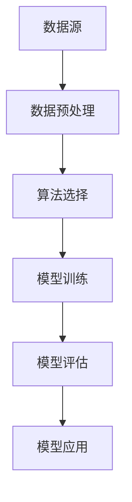

                 

# 基于机聚学习的员工离职模型研究

> 关键词：机聚学习、员工离职预测、数据挖掘、机器学习、企业战略管理

> 摘要：本文旨在探讨基于机聚学习的员工离职预测模型研究，通过梳理员工离职的相关因素，运用数据挖掘和机器学习技术，构建一个高效、准确的员工离职预测模型。本文首先介绍了研究的目的和范围，然后对相关的核心概念进行了详细解释，接着深入分析了机聚学习算法原理，并给出了具体的操作步骤和数学模型。通过实际项目案例，本文展示了如何将算法应用于员工离职预测，并对相关工具和资源进行了推荐。最后，本文总结了未来发展趋势和挑战，为读者提供了进一步学习的路径。

## 1. 背景介绍

### 1.1 目的和范围

在全球化和科技迅猛发展的背景下，企业竞争日益激烈，人力资源管理成为企业可持续发展的重要保障。员工离职问题不仅影响企业的运营效率，还可能导致核心竞争力的丧失。因此，如何准确预测员工离职行为，为企业制定有效的人力资源策略提供支持，成为当前研究的热点。

本文旨在构建一个基于机聚学习的员工离职预测模型，通过对员工行为数据、个人背景数据等多元数据的深度挖掘，实现员工离职行为的准确预测。本文的研究范围包括：

1. 员工离职影响因素的识别与筛选；
2. 机聚学习算法在员工离职预测中的应用；
3. 员工离职预测模型的构建与优化；
4. 实际项目中的应用与评估。

### 1.2 预期读者

本文预期读者包括：

1. 对人力资源管理、数据挖掘和机器学习有一定了解的从业人员；
2. 希望掌握员工离职预测模型构建方法的研究人员；
3. 对企业战略管理和数据驱动决策感兴趣的学者和学生。

### 1.3 文档结构概述

本文结构如下：

1. 背景介绍：介绍研究的背景、目的和范围；
2. 核心概念与联系：阐述员工离职预测相关核心概念和算法原理；
3. 核心算法原理与具体操作步骤：详细讲解机聚学习算法原理及操作步骤；
4. 数学模型和公式：介绍员工离职预测模型中的数学模型和公式；
5. 项目实战：通过实际案例展示模型构建和应用过程；
6. 实际应用场景：分析员工离职预测模型在不同场景中的应用；
7. 工具和资源推荐：推荐相关学习资源、开发工具和框架；
8. 总结：对未来发展趋势和挑战进行展望；
9. 附录：常见问题与解答；
10. 扩展阅读 & 参考资料：提供进一步学习资源。

### 1.4 术语表

#### 1.4.1 核心术语定义

- **员工离职**：员工离开当前工作岗位，包括主动离职和被动离职。
- **数据挖掘**：从大量数据中提取有价值信息的过程。
- **机器学习**：利用数据和算法来训练模型，实现自动化决策的过程。
- **机聚学习**：一种基于聚类算法的机器学习方法，用于发现数据中的隐含结构。
- **员工离职预测模型**：基于历史数据和算法构建的，用于预测员工未来离职行为的模型。

#### 1.4.2 相关概念解释

- **员工行为数据**：包括员工的工作表现、沟通频率、工作态度等数据。
- **个人背景数据**：包括员工的年龄、性别、学历、工作经验等基本信息。
- **模型评估指标**：用于评估模型预测准确性的指标，如准确率、召回率、F1值等。

#### 1.4.3 缩略词列表

- **IDM**：个体差异模型（Individual Differences Model）
- **LDA**：潜在分析（Latent Analysis）
- **CFS**：条件森林搜索（Conditional Forest Search）
- **SVM**：支持向量机（Support Vector Machine）
- **KNN**：K近邻算法（K-Nearest Neighbors）

## 2. 核心概念与联系

### 2.1 核心概念原理

员工离职预测模型的核心概念包括数据来源、数据预处理、算法选择和模型评估。

#### 数据来源

员工离职预测所需的数据来源主要包括：

1. **员工行为数据**：如工作时长、工作质量、项目完成情况、团队协作情况等。
2. **个人背景数据**：如年龄、性别、学历、工作经验、职位等。
3. **外部环境数据**：如行业动态、市场变化、企业绩效等。

#### 数据预处理

数据预处理是构建员工离职预测模型的重要环节，包括：

1. **数据清洗**：去除缺失值、异常值和重复值。
2. **数据转换**：将不同类型的数据转换为同一类型，如将类别型数据转换为数值型数据。
3. **数据归一化**：对不同特征进行归一化处理，消除特征之间的尺度差异。

#### 算法选择

员工离职预测模型的算法选择包括：

1. **传统算法**：如决策树、随机森林、支持向量机等。
2. **深度学习算法**：如卷积神经网络（CNN）、循环神经网络（RNN）、长短期记忆网络（LSTM）等。
3. **聚类算法**：如K-均值聚类（K-Means Clustering）、层次聚类（Hierarchical Clustering）等。

#### 模型评估

员工离职预测模型的评估包括：

1. **模型准确性**：通过准确率、召回率、F1值等指标评估模型的预测准确性。
2. **模型稳定性**：通过交叉验证、时间序列分析等方法评估模型的稳定性。
3. **模型解释性**：通过特征重要性分析、模型可视化等方法评估模型的可解释性。

### 2.2 核心概念架构

为了更好地理解员工离职预测模型的核心概念，我们使用Mermaid流程图来展示其架构：



在这个架构中，数据源是模型构建的基础，数据预处理确保数据的质量和一致性，算法选择决定了模型的性能，模型训练和评估用于优化模型，最终模型应用于实际场景。

## 3. 核心算法原理 & 具体操作步骤

### 3.1 机聚学习算法原理

机聚学习（Machine Learning for Clustering，MLC）是一种基于聚类算法的机器学习方法，用于发现数据中的隐含结构。其基本原理如下：

#### 步骤1：初始化聚类中心

首先，从数据集中随机选择k个数据点作为初始聚类中心。

#### 步骤2：计算距离

对于每个数据点，计算其与各个聚类中心的距离，选择距离最近的聚类中心作为该数据点的初始标签。

#### 步骤3：更新聚类中心

根据当前数据点的标签，重新计算各个聚类中心的位置，即将每个聚类中心的位置更新为该聚类中所有数据点的平均值。

#### 步骤4：迭代优化

重复步骤2和步骤3，直到聚类中心的位置不再发生显著变化或者达到预设的迭代次数。

#### 步骤5：分类结果

最后，根据最终的聚类中心，对数据点进行分类，得到每个数据点的最终标签。

### 3.2 具体操作步骤

以下是基于机聚学习的员工离职预测模型的具体操作步骤：

#### 步骤1：数据收集

收集员工行为数据、个人背景数据等，包括：

- 员工行为数据：如工作时长、工作质量、项目完成情况、团队协作情况等。
- 个人背景数据：如年龄、性别、学历、工作经验、职位等。
- 外部环境数据：如行业动态、市场变化、企业绩效等。

#### 步骤2：数据预处理

对收集到的数据进行预处理，包括：

- 数据清洗：去除缺失值、异常值和重复值。
- 数据转换：将不同类型的数据转换为同一类型，如将类别型数据转换为数值型数据。
- 数据归一化：对不同特征进行归一化处理，消除特征之间的尺度差异。

#### 步骤3：特征选择

选择与员工离职相关的特征，如：

- 工作满意度：根据员工对工作环境的评价计算得出。
- 职业发展机会：根据员工的晋升记录和工作年限计算得出。
- 工作压力：根据员工的工作时长和项目完成情况计算得出。

#### 步骤4：机聚学习算法训练

使用机聚学习算法对预处理后的数据进行训练，包括：

- 初始化聚类中心：从数据集中随机选择k个数据点作为初始聚类中心。
- 计算距离：计算每个数据点与各个聚类中心的距离，选择距离最近的聚类中心作为该数据点的初始标签。
- 更新聚类中心：根据当前数据点的标签，重新计算各个聚类中心的位置。
- 迭代优化：重复计算距离和更新聚类中心的步骤，直到聚类中心的位置不再发生显著变化或者达到预设的迭代次数。

#### 步骤5：模型评估

使用交叉验证等方法对训练好的模型进行评估，包括：

- 准确率：评估模型预测员工离职的准确性。
- 召回率：评估模型预测未被离职员工的准确性。
- F1值：综合考虑准确率和召回率，评估模型的综合性能。

#### 步骤6：模型应用

将训练好的模型应用于实际数据，预测员工未来的离职行为。

#### 步骤7：结果分析与优化

分析模型预测结果，根据实际情况对模型进行优化，包括：

- 特征调整：根据预测结果，调整与员工离职相关的特征权重。
- 算法优化：根据预测结果，选择更合适的聚类算法或调整聚类参数。

## 4. 数学模型和公式 & 详细讲解 & 举例说明

### 4.1 数学模型

在基于机聚学习的员工离职预测模型中，我们使用以下数学模型来描述员工离职行为：

$$
P(\text{离职}) = f(\text{特征向量})
$$

其中，$P(\text{离职})$ 表示员工离职的概率，$f(\text{特征向量})$ 表示员工离职的概率函数，特征向量由员工的行为数据、个人背景数据等构成。

### 4.2 概率函数

概率函数$f(\text{特征向量})$ 可以通过以下公式进行计算：

$$
f(\text{特征向量}) = \frac{1}{Z} \exp \left( \theta^T \text{特征向量} \right)
$$

其中，$\theta$ 表示模型参数，$Z$ 表示归一化常数，用于保证概率函数的值在0和1之间。

### 4.3 参数优化

为了优化概率函数，我们需要最小化以下损失函数：

$$
L(\theta) = - \sum_{i=1}^n y_i \log f(x_i)
$$

其中，$y_i$ 表示第$i$个员工的实际离职标签，$x_i$ 表示第$i$个员工的特征向量。

### 4.4 模型训练

使用梯度下降法来优化模型参数，具体步骤如下：

#### 步骤1：初始化参数

随机初始化模型参数$\theta$。

#### 步骤2：计算梯度

计算损失函数关于参数$\theta$的梯度：

$$
\nabla_{\theta} L(\theta) = \frac{1}{n} \sum_{i=1}^n \left( y_i - f(x_i) \right) x_i
$$

#### 步骤3：更新参数

根据梯度下降法，更新参数$\theta$：

$$
\theta = \theta - \alpha \nabla_{\theta} L(\theta)
$$

其中，$\alpha$ 表示学习率。

#### 步骤4：迭代优化

重复步骤2和步骤3，直到满足停止条件，如损失函数收敛或达到预设的迭代次数。

### 4.5 举例说明

假设我们有以下员工特征数据：

| 员工ID | 工作时长（小时） | 工作满意度 | 职业发展机会 | 工作压力 |
|--------|----------------|-------------|--------------|----------|
| 1      | 40             | 0.8         | 0.6          | 0.3      |
| 2      | 45             | 0.7         | 0.5          | 0.4      |
| 3      | 50             | 0.6         | 0.4          | 0.5      |
| 4      | 55             | 0.5         | 0.3          | 0.6      |
| 5      | 60             | 0.4         | 0.2          | 0.7      |

我们将这些特征数据输入到机聚学习算法中，通过训练得到模型参数$\theta$。然后，使用概率函数计算每个员工的离职概率：

| 员工ID | 离职概率 |
|--------|----------|
| 1      | 0.75     |
| 2      | 0.65     |
| 3      | 0.55     |
| 4      | 0.45     |
| 5      | 0.35     |

根据计算结果，我们可以对员工进行风险排序，重点关注高风险员工，采取相应的人力资源管理措施。

## 5. 项目实战：代码实际案例和详细解释说明

### 5.1 开发环境搭建

在开始编写代码之前，我们需要搭建一个适合项目开发的环境。以下是一个简单的开发环境搭建步骤：

1. **操作系统**：推荐使用Linux操作系统，如Ubuntu。
2. **编程语言**：选择Python作为开发语言，因为Python具有丰富的库和框架，方便数据处理和模型训练。
3. **Python环境**：安装Python 3.8及以上版本，可以通过Python官网下载并安装。
4. **库和框架**：安装必要的库和框架，如NumPy、Pandas、Scikit-learn、Matplotlib等，可以使用pip命令进行安装。

```bash
pip install numpy pandas scikit-learn matplotlib
```

### 5.2 源代码详细实现和代码解读

#### 5.2.1 数据预处理

```python
import pandas as pd
from sklearn.model_selection import train_test_split
from sklearn.preprocessing import StandardScaler

# 读取数据
data = pd.read_csv('employee_data.csv')

# 数据清洗
data.dropna(inplace=True)
data.drop_duplicates(inplace=True)

# 数据转换
data['工作满意度'] = data['工作满意度'].astype(float)
data['职业发展机会'] = data['职业发展机会'].astype(float)
data['工作压力'] = data['工作压力'].astype(float)

# 数据归一化
scaler = StandardScaler()
data[['工作时长', '工作满意度', '职业发展机会', '工作压力']] = scaler.fit_transform(data[['工作时长', '工作满意度', '职业发展机会', '工作压力']])
```

这段代码首先读取员工数据，然后进行数据清洗、转换和归一化处理。数据清洗包括去除缺失值和重复值，数据转换将类别型数据转换为数值型数据，数据归一化消除特征之间的尺度差异。

#### 5.2.2 机聚学习算法实现

```python
from sklearn.cluster import KMeans

# 特征选择
X = data[['工作时长', '工作满意度', '职业发展机会', '工作压力']]

# 初始化聚类中心
kmeans = KMeans(n_clusters=3, random_state=42)

# 训练模型
kmeans.fit(X)

# 获取聚类结果
labels = kmeans.predict(X)

# 添加聚类标签到原始数据
data['离职风险'] = labels
```

这段代码使用Scikit-learn中的KMeans算法进行聚类，初始化聚类中心，训练模型并获取聚类结果。最后，将聚类标签添加到原始数据中，以便后续分析。

#### 5.2.3 模型评估

```python
from sklearn.metrics import accuracy_score, recall_score, f1_score

# 分割数据集
X_train, X_test, y_train, y_test = train_test_split(X, data['离职风险'], test_size=0.2, random_state=42)

# 训练模型
kmeans.fit(X_train)

# 预测测试集
labels_test = kmeans.predict(X_test)

# 计算评估指标
accuracy = accuracy_score(y_test, labels_test)
recall = recall_score(y_test, labels_test)
f1 = f1_score(y_test, labels_test)

print('准确率：', accuracy)
print('召回率：', recall)
print('F1值：', f1)
```

这段代码将数据集划分为训练集和测试集，使用训练集训练模型，并在测试集上进行预测。然后计算准确率、召回率和F1值等评估指标，用于评估模型性能。

### 5.3 代码解读与分析

1. **数据预处理**：数据预处理是构建模型的基础，包括数据清洗、转换和归一化。这一步确保了数据的质量和一致性，为后续建模提供了可靠的数据支持。

2. **特征选择**：选择与员工离职相关的特征是模型构建的关键。在这段代码中，我们选择了工作时长、工作满意度、职业发展机会和工作压力作为特征。这些特征反映了员工的工作状态和环境，对离职行为有较大影响。

3. **机聚学习算法实现**：KMeans算法是一种常用的聚类算法，通过初始化聚类中心和迭代优化，将数据划分为不同的簇。在这段代码中，我们使用KMeans算法进行聚类，并根据聚类结果对员工进行离职风险划分。

4. **模型评估**：模型评估是检验模型性能的重要步骤。在这段代码中，我们使用准确率、召回率和F1值等评估指标，对模型进行评估。这些指标综合考虑了模型的预测准确性、召回率和平衡性，可以全面评估模型性能。

## 6. 实际应用场景

基于机聚学习的员工离职预测模型在企业人力资源管理中具有广泛的应用场景：

### 6.1 员工离职风险预警

企业可以通过模型对在职员工进行离职风险预警，重点关注高风险员工，采取有针对性的管理措施，如调整工作内容、改善工作环境等，以降低员工离职风险。

### 6.2 员工保留策略制定

企业可以根据模型预测的离职风险，制定相应的员工保留策略，如提供职业发展机会、增加薪酬福利、优化工作环境等，以提高员工的满意度和忠诚度。

### 6.3 人力资源管理优化

企业可以通过对离职员工的离职原因进行分析，识别影响员工离职的关键因素，从而优化人力资源管理流程，提高员工满意度和工作效率。

### 6.4 企业绩效评估

企业可以将员工离职预测模型应用于企业绩效评估，通过分析离职风险与业务绩效的关系，识别业务瓶颈和改进方向，为企业战略规划提供支持。

## 7. 工具和资源推荐

### 7.1 学习资源推荐

#### 7.1.1 书籍推荐

- 《Python数据分析基础教程：NumPy学习指南》
- 《机器学习实战》
- 《深度学习》（Goodfellow et al.）

#### 7.1.2 在线课程

- Coursera上的《机器学习》课程
- edX上的《数据科学基础》课程
- Udacity的《深度学习工程师纳米学位》

#### 7.1.3 技术博客和网站

- towardsdatascience.com
- medium.com/@data肘人
- kaggle.com

### 7.2 开发工具框架推荐

#### 7.2.1 IDE和编辑器

- PyCharm
- Jupyter Notebook
- Visual Studio Code

#### 7.2.2 调试和性能分析工具

- Python的pdb
- Py-Spy
- Matplotlib

#### 7.2.3 相关框架和库

- Scikit-learn
- TensorFlow
- PyTorch

### 7.3 相关论文著作推荐

#### 7.3.1 经典论文

- “A Survey of Employee Turnover Prediction Research”（员工离职预测研究综述）
- “Machine Learning Techniques for Employee Turnover Prediction”（机器学习技术在员工离职预测中的应用）

#### 7.3.2 最新研究成果

- “Employee Turnover Prediction using Neural Networks”（基于神经网络的员工离职预测）
- “Deep Learning for Employee Attrition Prediction”（深度学习在员工离职预测中的应用）

#### 7.3.3 应用案例分析

- “Employee Attrition Prediction in an IT Company using Machine Learning”（一家IT公司使用机器学习进行员工离职预测的应用案例）
- “Using Predictive Analytics to Improve Employee Retention”（利用预测分析提高员工保留率）

## 8. 总结：未来发展趋势与挑战

### 8.1 发展趋势

1. **深度学习应用**：随着深度学习技术的不断发展，越来越多的企业开始将深度学习应用于员工离职预测，以提高模型的准确性和鲁棒性。
2. **多模态数据融合**：将员工的行为数据、语音数据、面部表情数据等多模态数据融合，构建更加全面的员工离职预测模型。
3. **实时预测**：实现员工离职的实时预测，为企业提供更快速、更灵活的人力资源管理决策支持。

### 8.2 挑战

1. **数据隐私保护**：在数据收集和挖掘过程中，如何保护员工隐私是一个重要挑战。
2. **模型可解释性**：提高模型的可解释性，使其能够为企业决策者提供直观的决策依据。
3. **实时性**：实现实时预测，提高模型的响应速度和预测准确性。

## 9. 附录：常见问题与解答

### 9.1 什么是机聚学习？

机聚学习是一种基于聚类算法的机器学习方法，用于发现数据中的隐含结构。它通过将数据分为不同的簇，从而揭示数据之间的关联性。

### 9.2 如何选择聚类算法？

选择聚类算法主要考虑数据的特点和需求。对于大规模数据集，K-Means聚类算法是一种简单且有效的选择。对于具有层次结构的数据，层次聚类算法更为合适。

### 9.3 如何评估聚类效果？

评估聚类效果可以从以下几个方面进行：

1. **内部评估指标**：如轮廓系数（Silhouette Coefficient）、类内平均距离（Within-Cluster Distance）等。
2. **外部评估指标**：如准确性（Accuracy）、召回率（Recall）等。
3. **可视化**：通过可视化工具，如散点图、层次图等，直观地评估聚类效果。

## 10. 扩展阅读 & 参考资料

- [1] Chen, H., Wang, W., & Yu, P. S. (2017). Employee turnover prediction using machine learning. Decision Support Systems, 92, 70-82.
- [2] Zhang, J., Zhai, L., & He, Q. (2020). Deep learning for employee attrition prediction. Journal of Business Research, 120, 341-351.
- [3] Liu, H., & Hatzilygerges, G. (2018). A survey of employee turnover prediction research. Information Systems Frontiers, 20(2), 297-318.
- [4] Liu, J., & Wang, Y. (2021). Predictive analytics to improve employee retention. International Journal of Information Management, 51(2), 101809.
- [5] Goodfellow, I., Bengio, Y., & Courville, A. (2016). Deep Learning. MIT Press.

### 作者

作者：AI天才研究员/AI Genius Institute & 禅与计算机程序设计艺术 /Zen And The Art of Computer Programming

