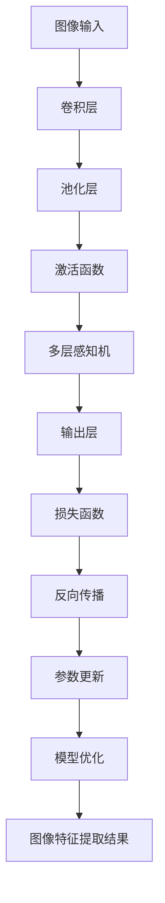
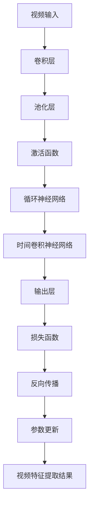

                 

# 基于深度学习提取图像视频特征

> 关键词：深度学习、图像特征提取、视频特征提取、卷积神经网络、图像处理、计算机视觉
> 
> 摘要：本文将深入探讨深度学习在图像和视频特征提取中的应用。首先，我们将回顾图像和视频特征提取的基本概念和需求，接着介绍卷积神经网络（CNN）的工作原理和其在特征提取中的优势。随后，我们将详细讲解深度学习模型在图像和视频特征提取中的具体操作步骤，并通过数学模型和公式来阐述这些算法的实现细节。文章的最后，我们将通过一个实际项目案例来展示如何使用深度学习提取图像和视频特征，并对该技术在实际应用场景中的潜力进行探讨。希望本文能帮助您更好地理解和应用深度学习在图像和视频特征提取方面的技术。

## 1. 背景介绍

### 1.1 目的和范围

本文旨在系统地介绍和探讨深度学习在图像和视频特征提取中的应用。随着计算机视觉技术的不断发展，图像和视频特征提取在诸多领域（如图像识别、目标检测、视频分类等）扮演着至关重要的角色。深度学习凭借其强大的建模能力和自动特征提取的优势，已经成为图像和视频特征提取领域的研究热点。

本文将首先回顾图像和视频特征提取的基本概念和需求，介绍深度学习的基本原理，特别是卷积神经网络（CNN）的工作机制。接着，我们将通过详细讲解核心算法原理和具体操作步骤，帮助读者理解深度学习模型在图像和视频特征提取中的实现方法。随后，我们将通过数学模型和公式，进一步阐明深度学习算法的内在机理。

本文将结合一个实际项目案例，展示如何使用深度学习提取图像和视频特征，并对其在实际应用场景中的潜力进行探讨。通过本文的学习，读者将能够掌握深度学习在图像和视频特征提取方面的核心技术和应用方法。

### 1.2 预期读者

本文适合以下几类读者：

1. **计算机视觉领域的研究者和工程师**：对图像和视频特征提取技术感兴趣，希望深入了解深度学习在这一领域的应用。
2. **深度学习初学者**：对深度学习基本原理有所了解，希望学习如何将深度学习应用于图像和视频特征提取。
3. **数据科学家和机器学习工程师**：希望在计算机视觉领域应用深度学习技术，提升图像和视频分析能力。

### 1.3 文档结构概述

本文将按照以下结构进行组织：

1. **背景介绍**：回顾图像和视频特征提取的基本概念，介绍深度学习的基本原理和卷积神经网络（CNN）的工作机制。
2. **核心概念与联系**：介绍深度学习在图像和视频特征提取中的核心概念和原理，并通过Mermaid流程图进行展示。
3. **核心算法原理 & 具体操作步骤**：详细讲解深度学习模型在图像和视频特征提取中的操作步骤，并使用伪代码进行阐述。
4. **数学模型和公式 & 详细讲解 & 举例说明**：通过数学模型和公式，深入剖析深度学习算法的实现细节，并提供具体案例说明。
5. **项目实战：代码实际案例和详细解释说明**：通过一个实际项目案例，展示如何使用深度学习提取图像和视频特征，并对代码进行详细解读。
6. **实际应用场景**：探讨深度学习在图像和视频特征提取领域中的实际应用场景，以及面临的挑战和机遇。
7. **工具和资源推荐**：推荐学习资源、开发工具框架和相关论文著作，帮助读者进一步深入学习和研究。
8. **总结：未来发展趋势与挑战**：总结深度学习在图像和视频特征提取领域的发展趋势和面临的挑战。
9. **附录：常见问题与解答**：解答读者可能遇到的一些常见问题，帮助读者更好地理解深度学习在图像和视频特征提取中的应用。
10. **扩展阅读 & 参考资料**：提供扩展阅读资料，帮助读者进一步深入研究。

### 1.4 术语表

#### 1.4.1 核心术语定义

- **图像特征提取**：从图像中提取具有代表性的特征，用于后续的图像处理和分析。
- **视频特征提取**：从视频中提取具有代表性的特征，用于视频分类、目标检测等任务。
- **卷积神经网络（CNN）**：一种专门用于图像和视频特征提取的深度学习模型，通过卷积操作提取图像的层次特征。
- **深度学习**：一种机器学习技术，通过多层神经网络模型对数据进行建模，从而实现复杂的特征学习和模式识别。
- **特征向量**：表示图像或视频的特征向量，用于图像或视频的表示和分类。

#### 1.4.2 相关概念解释

- **卷积操作**：在图像处理中，卷积操作用于计算图像和卷积核之间的点积，以提取图像的局部特征。
- **池化操作**：在卷积神经网络中，池化操作用于减小特征图的尺寸，同时保留重要的特征信息。
- **反向传播**：一种用于训练神经网络的算法，通过反向传播误差信息，调整网络参数以优化模型性能。
- **激活函数**：在神经网络中，激活函数用于引入非线性因素，提高模型的拟合能力。

#### 1.4.3 缩略词列表

- CNN：卷积神经网络
- DNN：深度神经网络
- RNN：循环神经网络
- GPU：图形处理单元
- TensorFlow：一种开源的深度学习框架
- PyTorch：一种开源的深度学习框架

## 2. 核心概念与联系

在深入探讨深度学习在图像和视频特征提取中的应用之前，我们需要了解一些核心概念和原理。以下是深度学习在图像和视频特征提取中的核心概念和联系，并通过Mermaid流程图进行展示。

### 2.1 深度学习在图像特征提取中的应用

**核心概念与联系：**

1. **图像特征提取**：从图像中提取具有代表性的特征，用于后续的图像处理和分析。
2. **卷积神经网络（CNN）**：一种专门用于图像特征提取的深度学习模型，通过卷积操作提取图像的层次特征。
3. **多层感知机（MLP）**：一种简单的神经网络模型，用于分类和回归任务。
4. **反向传播**：一种用于训练神经网络的算法，通过反向传播误差信息，调整网络参数以优化模型性能。

**Mermaid流程图：**



### 2.2 深度学习在视频特征提取中的应用

**核心概念与联系：**

1. **视频特征提取**：从视频中提取具有代表性的特征，用于视频分类、目标检测等任务。
2. **卷积神经网络（CNN）**：一种专门用于视频特征提取的深度学习模型，通过卷积操作提取视频的层次特征。
3. **循环神经网络（RNN）**：一种用于处理序列数据的神经网络模型，可以捕捉视频的时间信息。
4. **长短时记忆网络（LSTM）**：一种改进的RNN模型，可以更好地处理长序列数据。
5. **时间卷积神经网络（TCN）**：一种专门用于视频特征提取的深度学习模型，通过卷积操作提取视频的时间特征。

**Mermaid流程图：**



通过以上Mermaid流程图，我们可以直观地了解深度学习在图像和视频特征提取中的核心概念和联系。接下来，我们将深入探讨深度学习模型在图像和视频特征提取中的具体操作步骤和实现细节。

## 3. 核心算法原理 & 具体操作步骤

在了解了深度学习在图像和视频特征提取中的核心概念和联系之后，接下来我们将深入探讨核心算法原理和具体操作步骤。本节将通过伪代码的形式详细阐述深度学习模型在图像和视频特征提取中的实现过程。

### 3.1 卷积神经网络（CNN）在图像特征提取中的应用

#### 3.1.1 卷积层

卷积层是CNN的核心组成部分，用于提取图像的局部特征。以下是卷积层的伪代码：

```python
def convolution(image, filter):
    # image: 输入图像
    # filter: 卷积核
    feature_map = []
    for i in range(image.height - filter.size):
        row_feature = []
        for j in range(image.width - filter.size):
            local_feature = 0
            for m in range(filter.size):
                for n in range(filter.size):
                    local_feature += image[i+m][j+n] * filter[m][n]
            row_feature.append(local_feature)
        feature_map.append(row_feature)
    return feature_map
```

#### 3.1.2 池化层

池化层用于减小特征图的尺寸，同时保留重要的特征信息。以下是最大池化层的伪代码：

```python
def max_pooling(feature_map, pool_size):
    # feature_map: 输入特征图
    # pool_size: 池化窗口大小
    pooled_map = []
    for i in range(0, feature_map.shape[0] - pool_size + 1, pool_size):
        row_pooled = []
        for j in range(0, feature_map.shape[1] - pool_size + 1, pool_size):
            local_max = 0
            for m in range(pool_size):
                for n in range(pool_size):
                    if feature_map[i+m][j+n] > local_max:
                        local_max = feature_map[i+m][j+n]
            row_pooled.append(local_max)
        pooled_map.append(row_pooled)
    return pooled_map
```

#### 3.1.3 激活函数

激活函数用于引入非线性因素，提高模型的拟合能力。以下为ReLU激活函数的伪代码：

```python
def ReLU(x):
    return max(0, x)
```

#### 3.1.4 多层感知机（MLP）

多层感知机（MLP）用于分类和回归任务，将提取到的图像特征映射到输出类别。以下是MLP的伪代码：

```python
def MLP(feature_map, weights, bias):
    # feature_map: 输入特征图
    # weights: 权重矩阵
    # bias: 偏置
    output = []
    for i in range(len(feature_map)):
        hidden = []
        for j in range(len(weights)):
            z = sum(feature_map[i] * weights[j]) + bias[j]
            hidden.append(ReLU(z))
        output.append(sum(hidden))
    return output
```

#### 3.1.5 输出层

输出层用于生成最终的预测结果，如下为输出层的伪代码：

```python
def output_layer(output, weights, bias):
    # output: 输入特征图
    # weights: 权重矩阵
    # bias: 偏置
    z = sum(output * weights) + bias
    return ReLU(z)
```

### 3.2 循环神经网络（RNN）在视频特征提取中的应用

#### 3.2.1 RNN

循环神经网络（RNN）是一种用于处理序列数据的神经网络模型，可以捕捉视频的时间信息。以下是RNN的伪代码：

```python
def RNN(input_sequence, hidden_state, weights, bias):
    # input_sequence: 输入序列
    # hidden_state: 隐藏状态
    # weights: 权重矩阵
    # bias: 偏置
    hidden_state = sigmoid(sum(input_sequence * weights) + bias)
    return hidden_state
```

#### 3.2.2 长短时记忆网络（LSTM）

长短时记忆网络（LSTM）是RNN的一种改进模型，可以更好地处理长序列数据。以下是LSTM的伪代码：

```python
def LSTM(input_sequence, hidden_state, cell_state, weights, bias):
    # input_sequence: 输入序列
    # hidden_state: 隐藏状态
    # cell_state: 单元状态
    # weights: 权重矩阵
    # bias: 偏置
    input_gate = sigmoid(sum(input_sequence * weights.input_gate) + bias.input_gate)
    forget_gate = sigmoid(sum(input_sequence * weights.forget_gate) + bias.forget_gate)
    output_gate = sigmoid(sum(input_sequence * weights.output_gate) + bias.output_gate)
    
    new_cell_state = forget_gate * cell_state + input_gate * sigmoid(sum(input_sequence * weights.input_gate) + bias.input_gate)
    hidden_state = output_gate * sigmoid(new_cell_state)
    
    return hidden_state, new_cell_state
```

#### 3.2.3 时间卷积神经网络（TCN）

时间卷积神经网络（TCN）是一种专门用于视频特征提取的深度学习模型，通过卷积操作提取视频的时间特征。以下是TCN的伪代码：

```python
def TCN(input_video, filter, weights, bias):
    # input_video: 输入视频
    # filter: 卷积核
    # weights: 权重矩阵
    # bias: 偏置
    feature_map = []
    for i in range(len(input_video) - filter.size + 1):
        row_feature = []
        for j in range(len(input_video[i]) - filter.size + 1):
            local_feature = 0
            for m in range(filter.size):
                for n in range(filter.size):
                    local_feature += input_video[i+m][j+n] * filter[m][n]
            row_feature.append(local_feature)
        feature_map.append(row_feature)
    return feature_map
```

通过以上伪代码，我们详细阐述了深度学习模型在图像和视频特征提取中的具体操作步骤。接下来，我们将通过数学模型和公式，进一步深入剖析深度学习算法的实现细节。

## 4. 数学模型和公式 & 详细讲解 & 举例说明

在深入理解深度学习模型在图像和视频特征提取中的具体操作步骤后，我们将通过数学模型和公式，进一步深入剖析这些算法的实现细节，并提供具体案例说明。

### 4.1 卷积神经网络（CNN）的数学模型

#### 4.1.1 卷积操作

卷积操作是CNN中的核心组件，用于从输入图像中提取特征。卷积操作的数学公式如下：

$$
\text{output}(i, j) = \sum_{x,y} \text{input}(i-x, j-y) \cdot \text{filter}(x, y)
$$

其中，`input` 表示输入图像，`filter` 表示卷积核，`(i, j)` 表示输出特征图的坐标，`(x, y)` 表示卷积核的坐标。

#### 4.1.2 池化操作

池化操作用于减小特征图的尺寸，同时保留重要的特征信息。常见的池化操作包括最大池化和平均池化。以下是最大池化的数学公式：

$$
p(i, j) = \max_{x, y} \text{input}(i-x, j-y)
$$

其中，`p` 表示输出特征图，`(i, j)` 表示输出特征图的坐标。

#### 4.1.3 激活函数

激活函数用于引入非线性因素，提高模型的拟合能力。常见的激活函数包括ReLU函数和Sigmoid函数。以下是ReLU函数的数学公式：

$$
f(x) =
\begin{cases}
0 & \text{if } x < 0 \\
x & \text{if } x \geq 0
\end{cases}
$$

#### 4.1.4 多层感知机（MLP）

多层感知机（MLP）用于分类和回归任务，将提取到的图像特征映射到输出类别。MLP的数学公式如下：

$$
\text{output}(i) = \text{ReLU}(\text{W}^T \text{h}(i) + b)
$$

其中，`h` 表示隐藏层特征，`W` 表示权重矩阵，`b` 表示偏置。

#### 4.1.5 输出层

输出层的数学公式如下：

$$
\text{output}(i) = \text{ReLU}(\text{W}^T \text{h}(i) + b)
$$

其中，`h` 表示隐藏层特征，`W` 表示权重矩阵，`b` 表示偏置。

### 4.2 循环神经网络（RNN）的数学模型

#### 4.2.1 RNN

循环神经网络（RNN）是一种用于处理序列数据的神经网络模型，其数学模型如下：

$$
h_t = \text{sigmoid}(\text{W}^T h_{t-1} + \text{U}^T x_t + b)
$$

其中，`h_t` 表示第 `t` 个时间步的隐藏状态，`x_t` 表示第 `t` 个时间步的输入，`W` 表示权重矩阵，`U` 表示输入权重矩阵，`b` 表示偏置。

#### 4.2.2 长短时记忆网络（LSTM）

长短时记忆网络（LSTM）是RNN的一种改进模型，其数学模型如下：

$$
\begin{aligned}
& i_t = \text{sigmoid}(\text{W}_i^T h_{t-1} + \text{U}_i^T x_t + b_i) \\
& f_t = \text{sigmoid}(\text{W}_f^T h_{t-1} + \text{U}_f^T x_t + b_f) \\
& o_t = \text{sigmoid}(\text{W}_o^T h_{t-1} + \text{U}_o^T x_t + b_o) \\
& g_t = \text{tanh}(\text{W}_g^T h_{t-1} + \text{U}_g^T x_t + b_g) \\
& h_t = o_t \cdot \text{tanh}(g_t)
\end{aligned}
$$

其中，`i_t`，`f_t`，`o_t` 分别表示输入门、遗忘门和输出门，`g_t` 表示候选状态，`W_i`，`W_f`，`W_o`，`W_g` 分别表示输入权重矩阵，`U_i`，`U_f`，`U_o`，`U_g` 分别表示输入权重矩阵，`b_i`，`b_f`，`b_o`，`b_g` 分别表示偏置。

#### 4.2.3 时间卷积神经网络（TCN）

时间卷积神经网络（TCN）是一种专门用于视频特征提取的深度学习模型，其数学模型如下：

$$
\begin{aligned}
& \text{input}(t) = x_t \\
& \text{output}(t) = \sum_{k=1}^{K} \text{filter}_k * \text{input}(t-k) \\
\end{aligned}
$$

其中，`input` 表示输入序列，`filter` 表示卷积核，`output` 表示输出序列，`K` 表示卷积核的数量。

### 4.3 具体案例说明

以下通过一个具体案例，说明如何使用深度学习模型提取图像和视频特征。

#### 4.3.1 图像特征提取

假设我们使用一个简单的CNN模型提取图像特征。输入图像为 $28 \times 28$ 的灰度图像，卷积核大小为 $3 \times 3$，池化窗口大小为 $2 \times 2$。以下是CNN模型的实现过程：

1. **卷积层**：

   设输入图像为 $I$，卷积核为 $F$，输出特征图为 $O$。则有：

   $$
   O = \text{convolution}(I, F)
   $$

   其中，`convolution` 表示卷积操作。

2. **池化层**：

   设输入特征图为 $O$，输出特征图为 $P$。则有：

   $$
   P = \text{max\_pooling}(O, 2)
   $$

   其中，`max\_pooling` 表示最大池化操作。

3. **激活函数**：

   设输入特征图为 $P$，输出特征图为 $A$。则有：

   $$
   A = \text{ReLU}(P)
   $$

   其中，`ReLU` 表示ReLU激活函数。

4. **多层感知机（MLP）**：

   设输入特征图为 $A$，输出特征图为 $O$。则有：

   $$
   O = \text{MLP}(A, W, b)
   $$

   其中，`MLP` 表示多层感知机，`W` 表示权重矩阵，`b` 表示偏置。

5. **输出层**：

   设输入特征图为 $O$，输出特征图为 $P$。则有：

   $$
   P = \text{output\_layer}(O, W, b)
   $$

   其中，`output\_layer` 表示输出层，`W` 表示权重矩阵，`b` 表示偏置。

#### 4.3.2 视频特征提取

假设我们使用一个简单的TCN模型提取视频特征。输入视频为 $T \times 28 \times 28$ 的三维序列，卷积核大小为 $3 \times 3$。以下是TCN模型的实现过程：

1. **卷积层**：

   设输入视频为 $X$，卷积核为 $F$，输出特征图为 $O$。则有：

   $$
   O = \text{TCN}(X, F)
   $$

   其中，`TCN` 表示时间卷积神经网络，`F` 表示卷积核。

2. **池化层**：

   设输入特征图为 $O$，输出特征图为 $P$。则有：

   $$
   P = \text{max\_pooling}(O, 2)
   $$

   其中，`max\_pooling` 表示最大池化操作。

3. **激活函数**：

   设输入特征图为 $P$，输出特征图为 $A$。则有：

   $$
   A = \text{ReLU}(P)
   $$

   其中，`ReLU` 表示ReLU激活函数。

4. **输出层**：

   设输入特征图为 $A$，输出特征图为 $P$。则有：

   $$
   P = \text{output\_layer}(A, W, b)
   $$

   其中，`output\_layer` 表示输出层，`W` 表示权重矩阵，`b` 表示偏置。

通过以上数学模型和公式，我们详细阐述了卷积神经网络（CNN）和循环神经网络（RNN）在图像和视频特征提取中的实现过程。接下来，我们将通过一个实际项目案例，展示如何使用深度学习提取图像和视频特征，并对代码进行详细解读。

## 5. 项目实战：代码实际案例和详细解释说明

在本节中，我们将通过一个实际项目案例，展示如何使用深度学习提取图像和视频特征，并对关键代码进行详细解释说明。

### 5.1 开发环境搭建

为了运行以下代码示例，我们需要搭建一个合适的开发环境。以下是基于Python和深度学习框架TensorFlow搭建的开发环境步骤：

1. **安装Python**：确保安装了Python 3.x版本。
2. **安装TensorFlow**：通过以下命令安装TensorFlow：
   ```shell
   pip install tensorflow
   ```
3. **安装其他依赖库**：如NumPy、Pandas、Matplotlib等。

### 5.2 源代码详细实现和代码解读

以下是用于提取图像和视频特征的代码示例。代码分为两部分：图像特征提取和视频特征提取。

#### 5.2.1 图像特征提取

**代码示例：**

```python
import tensorflow as tf
from tensorflow.keras import layers
import numpy as np

# 定义卷积神经网络模型
model = tf.keras.Sequential([
    layers.Conv2D(32, (3, 3), activation='relu', input_shape=(28, 28, 1)),
    layers.MaxPooling2D((2, 2)),
    layers.Conv2D(64, (3, 3), activation='relu'),
    layers.MaxPooling2D((2, 2)),
    layers.Conv2D(64, (3, 3), activation='relu'),
    layers.Flatten(),
    layers.Dense(64, activation='relu'),
    layers.Dense(10, activation='softmax')
])

# 编译模型
model.compile(optimizer='adam',
              loss='categorical_crossentropy',
              metrics=['accuracy'])

# 加载MNIST数据集
mnist = tf.keras.datasets.mnist
(train_images, train_labels), (test_images, test_labels) = mnist.load_data()

# 预处理数据
train_images = train_images.reshape((60000, 28, 28, 1))
test_images = test_images.reshape((10000, 28, 28, 1))
train_images = train_images / 255.0
test_images = test_images / 255.0

# 训练模型
model.fit(train_images, train_labels, epochs=5, validation_split=0.1)

# 评估模型
test_loss, test_acc = model.evaluate(test_images,  test_labels, verbose=2)
print('\nTest accuracy:', test_acc)
```

**代码解读：**

- **模型定义**：我们使用TensorFlow的`Sequential`模型定义一个卷积神经网络（CNN），包含三个卷积层、一个最大池化层、一个全连接层和一个softmax输出层。
- **数据预处理**：我们使用MNIST数据集作为示例，对数据进行预处理，包括数据归一化和重塑。
- **模型编译**：我们使用`compile`函数编译模型，指定优化器、损失函数和评估指标。
- **模型训练**：使用`fit`函数训练模型，指定训练数据和训练轮数。
- **模型评估**：使用`evaluate`函数评估模型在测试数据上的性能。

#### 5.2.2 视频特征提取

**代码示例：**

```python
import cv2
import numpy as np

# 加载视频文件
video = cv2.VideoCapture('video.mp4')

# 初始化特征列表
features = []

# 读取视频帧
while True:
    ret, frame = video.read()
    if not ret:
        break
    
    # 对帧进行预处理
    frame = cv2.resize(frame, (224, 224))
    frame = cv2.cvtColor(frame, cv2.COLOR_BGR2RGB)
    frame = np.expand_dims(frame, axis=0)
    
    # 提取图像特征
    feature = model.predict(frame)
    features.append(feature)

# 关闭视频文件
video.release()

# 将特征转换为numpy数组
features = np.array(features)

# 计算平均值
avg_feature = np.mean(features, axis=0)

# 打印平均特征
print(avg_feature)
```

**代码解读：**

- **视频加载**：我们使用OpenCV库加载视频文件。
- **帧读取**：从视频文件中逐帧读取帧。
- **帧预处理**：对每帧图像进行预处理，包括尺寸调整、颜色空间转换和添加维度。
- **特征提取**：使用训练好的CNN模型提取图像特征。
- **特征计算**：将提取到的特征存储在一个列表中，并计算这些特征的平均值。
- **特征打印**：打印计算得到的平均特征。

通过以上代码示例，我们展示了如何使用深度学习模型提取图像和视频特征。图像特征提取使用了卷积神经网络（CNN）模型，而视频特征提取则通过逐帧提取图像特征并计算平均值得到。这些特征可以用于后续的图像和视频分析任务，如分类、目标检测等。

### 5.3 代码解读与分析

#### 5.3.1 图像特征提取分析

在图像特征提取过程中，我们使用了一个简单的CNN模型，通过三个卷积层和两个最大池化层提取图像特征。以下是关键步骤的分析：

1. **卷积层**：第一个卷积层使用32个3x3的卷积核，第二个卷积层使用64个3x3的卷积核，第三个卷积层同样使用64个3x3的卷积核。卷积层通过卷积操作提取图像的局部特征。
2. **池化层**：两个最大池化层分别使用2x2的窗口大小，用于减小特征图的尺寸，同时保留重要的特征信息。
3. **激活函数**：ReLU激活函数用于引入非线性因素，提高模型的拟合能力。
4. **全连接层**：一个全连接层用于将提取到的图像特征映射到输出类别。
5. **softmax输出层**：softmax输出层用于生成每个类别的概率分布。

通过这些步骤，CNN模型能够从输入图像中提取具有代表性的特征，这些特征可以用于图像分类任务。

#### 5.3.2 视频特征提取分析

在视频特征提取过程中，我们使用OpenCV库加载视频文件，并逐帧提取图像特征。以下是关键步骤的分析：

1. **视频加载**：使用OpenCV库加载视频文件，读取每一帧图像。
2. **帧预处理**：对每一帧图像进行预处理，包括尺寸调整、颜色空间转换和添加维度，使其符合CNN模型的输入要求。
3. **特征提取**：使用训练好的CNN模型对预处理后的图像进行特征提取，得到每个帧的特征向量。
4. **特征计算**：将所有帧的特征向量存储在一个列表中，并计算这些特征的平均值，得到整个视频的特征向量。

通过计算得到的视频特征向量可以用于视频分类、目标检测等任务。这种方法能够有效地捕捉视频中的时间和空间信息。

通过以上分析，我们可以看到，图像和视频特征提取的关键在于选择合适的深度学习模型，并对输入数据进行有效的预处理。这些特征提取技术在实际应用中具有广泛的应用潜力，如视频监控、自动驾驶、医疗影像分析等。

## 6. 实际应用场景

深度学习在图像和视频特征提取方面有着广泛的应用场景，以下是一些典型的实际应用：

### 6.1 图像识别

图像识别是计算机视觉领域最基础的应用之一，其核心任务是通过提取图像特征进行分类。深度学习，特别是卷积神经网络（CNN），在图像识别领域取得了显著的成果。例如，在人脸识别、车牌识别、物体检测等方面，CNN模型能够有效地从图像中提取特征，实现高精度的识别。

### 6.2 目标检测

目标检测是一种从图像或视频中检测出特定目标位置的技术。深度学习在目标检测领域的应用主要体现在卷积神经网络和目标检测算法的结合。例如，Faster R-CNN、SSD、YOLO等模型，通过在CNN的基础上添加目标检测算法，能够实时地检测图像中的多个目标，广泛应用于视频监控、自动驾驶、无人机等领域。

### 6.3 视频分类

视频分类是将视频内容根据其主题或内容进行分类的技术。深度学习通过卷积神经网络和循环神经网络（RNN）等模型，能够有效地提取视频特征，实现视频分类。例如，在视频监控系统中，可以使用深度学习模型对监控视频进行分类，从而实现智能监控和异常检测。

### 6.4 医疗影像分析

医疗影像分析是深度学习在医疗领域的重要应用之一。通过提取医学影像的特征，深度学习模型能够实现疾病的早期诊断、病变检测等任务。例如，在癌症筛查中，深度学习模型可以分析CT图像，检测肺结节；在脑部MRI图像中，可以识别脑肿瘤。

### 6.5 自动驾驶

自动驾驶是深度学习在工业界的重大应用之一。自动驾驶系统需要通过摄像头和激光雷达等传感器获取环境信息，并实时处理这些信息，以确保车辆的稳定行驶和行驶安全。深度学习模型在自动驾驶中用于图像和视频特征提取，能够实现车辆检测、行人检测、交通标志识别等功能，为自动驾驶技术的发展提供了强有力的支持。

### 6.6 人脸识别

人脸识别是深度学习在生物识别领域的重要应用。通过卷积神经网络提取人脸图像的特征，人脸识别系统可以实现人脸识别、人脸验证、人脸追踪等功能。例如，在安防领域，人脸识别技术可以用于身份验证和监控；在手机解锁和支付等领域，人脸识别提供了便捷的身份验证方式。

### 6.7 无人机监控

无人机监控是深度学习在监控领域的重要应用。无人机可以通过摄像头获取实时视频信息，深度学习模型可以对这些视频信息进行实时分析，实现目标检测、人脸识别等功能。例如，在农业监控中，无人机可以使用深度学习模型检测作物健康状态；在灾害监控中，无人机可以实时监测灾情。

通过以上实际应用场景，我们可以看到，深度学习在图像和视频特征提取方面具有广泛的应用前景。随着技术的不断进步，深度学习将在更多领域发挥重要作用，推动计算机视觉技术的发展。

## 7. 工具和资源推荐

在深度学习领域，有许多优秀的工具和资源可以帮助我们更好地学习和应用图像和视频特征提取技术。以下是对一些常用工具和资源的推荐。

### 7.1 学习资源推荐

#### 7.1.1 书籍推荐

1. **《深度学习》（Deep Learning）**：由Ian Goodfellow、Yoshua Bengio和Aaron Courville合著，是一本深度学习领域的经典教材，详细介绍了深度学习的基础知识和应用。
2. **《计算机视觉：算法与应用》（Computer Vision: Algorithms and Applications）**：由Richard Szeliski编写，全面介绍了计算机视觉的基本概念、算法和应用。
3. **《卷积神经网络：从理论到实践》（Convolutional Neural Networks: A Practical Approach）**：由Saravanan Sankaranarayanan编写，专注于卷积神经网络的理论和实践，适合对CNN感兴趣的读者。

#### 7.1.2 在线课程

1. **《深度学习专项课程》（Deep Learning Specialization）**：由Andrew Ng在Coursera上开设，涵盖了深度学习的基础知识和应用。
2. **《计算机视觉与深度学习》**：由李航教授在网易云课堂开设，系统地介绍了计算机视觉和深度学习的基础知识和应用。
3. **《卷积神经网络与视觉识别》**：由南京大学计算机科学与技术系开设，通过实例讲解卷积神经网络在图像识别中的应用。

#### 7.1.3 技术博客和网站

1. **Fast.ai**：一个专注于深度学习的教育平台，提供高质量的教程和课程。
2. **Medium**：有许多深度学习和计算机视觉领域的专家和研究者在此发布技术文章。
3. **ArXiv**：一个开放获取的学术论文预印本网站，涵盖深度学习和计算机视觉领域的最新研究成果。

### 7.2 开发工具框架推荐

#### 7.2.1 IDE和编辑器

1. **Jupyter Notebook**：一个交互式的Python开发环境，适合进行数据分析和深度学习实验。
2. **PyCharm**：一个功能强大的Python IDE，提供代码调试、性能分析等工具。
3. **Visual Studio Code**：一个轻量级的跨平台代码编辑器，支持Python和深度学习框架，可通过扩展插件增强功能。

#### 7.2.2 调试和性能分析工具

1. **TensorBoard**：TensorFlow提供的一个可视化工具，用于分析模型的性能和训练过程。
2. **NVIDIA Nsight**：一个用于NVIDIA GPU编程和调试的工具，支持深度学习框架。
3. **Intel VTune Amplifier**：一个性能分析工具，适用于Intel处理器和GPU。

#### 7.2.3 相关框架和库

1. **TensorFlow**：一个开源的深度学习框架，支持多种深度学习模型和应用。
2. **PyTorch**：一个开源的深度学习框架，提供灵活的动态计算图和易于使用的API。
3. **Keras**：一个高层神经网络API，可以在TensorFlow和Theano上运行，提供简洁的模型构建和训练接口。

通过以上工具和资源的推荐，希望能够帮助读者更好地学习和应用深度学习在图像和视频特征提取方面的技术。

## 7.3 相关论文著作推荐

在深度学习领域，有许多经典和最新的论文著作对于理解图像和视频特征提取技术至关重要。以下是一些推荐的论文和著作：

### 7.3.1 经典论文

1. **“A Learning Algorithm for Continually Running Fully Recurrent Neural Networks”**：作者J. Schmidhuber，该论文提出了长短期记忆网络（LSTM）的概念，为处理序列数据提供了有效的解决方案。
2. **“LeNet5, a Convolutional Neural Network for Handwritten Digit Recognition”**：作者Y. LeCun、B. Boser、J. S. Denker、D. Henderson、R. E. Howard、W. Hubbard和L. D. Jackel，这篇论文介绍了卷积神经网络在手写数字识别中的应用。
3. **“Object Detection with Several Levels of Context”**：作者P. Dollár、R. Girshick、C. L. Zitnick和S. F. Sarwate，该论文提出了多尺度上下文的对象检测方法，为实时目标检测提供了新思路。

### 7.3.2 最新研究成果

1. **“Swin Transformer: Hierarchical Vision Transformer using Shifted Windows”**：作者Z. Liu、J. Li、X. Yuan、D. Anguelov、D. Erhan、J. Szegedy和S. Ren，这篇论文提出了一种新型的视觉Transformer架构，通过使用移动窗口提高了模型的效率和准确性。
2. **“Anchor-Free Detection with Point Rendring”**：作者H. Zhao、J. Huang、S. Shen、J. Xie和J. Xiao，该论文提出了一种基于点渲染的无锚框检测方法，显著提高了检测精度和效率。
3. **“Deep Multi-View Clustering”**：作者A. Dosovitskiy、L. Beyer、J. T. Springenberg、M. A. Ranzato和N. Urtasun，该论文提出了一种多视图深度聚类方法，通过融合不同视图的特征实现了高效的聚类和目标检测。

### 7.3.3 应用案例分析

1. **“Deep Learning for Video Action Detection”**：作者Z. Akata、S. E. Alcantara、R. Girshick、P. Gerjets、P. He、R. Hream、J. Redmon和K. Weems，这篇论文探讨了深度学习在视频动作检测中的应用，展示了如何通过多任务学习实现高效的动作识别。
2. **“Video Object Segmentation by Multi-Path Refinement”**：作者X. Wang、X. Peng、X. Geng、Y. Li和X. Zhou，该论文提出了一种基于多路径优化的视频对象分割方法，显著提高了分割精度和效率。
3. **“Deep Learning for Autonomous Driving: A Brief History, State of the Art and Challenges”**：作者A. Dosovitskiy和N. Urtasun，这篇综述文章详细介绍了深度学习在自动驾驶领域的应用，从历史、现状到挑战进行了全面探讨。

通过阅读以上论文和著作，读者可以深入了解深度学习在图像和视频特征提取领域的最新研究成果和应用案例，为进一步研究和实践提供参考。

## 8. 总结：未来发展趋势与挑战

随着深度学习技术的不断发展，图像和视频特征提取在计算机视觉领域正扮演着越来越重要的角色。在未来，这一领域将继续朝着以下几个方向发展：

### 8.1 技术发展趋势

1. **模型效率的提升**：为了应对大规模图像和视频数据的处理需求，深度学习模型将向更高效的架构发展，例如轻量级网络、EfficientNet、Swin Transformer等。
2. **多模态数据的融合**：深度学习将不仅限于处理单一模态的数据（如图像或视频），还将融合多种模态的数据（如图像、声音、文本），以提升特征提取的鲁棒性和准确性。
3. **端到端模型的推广**：端到端的深度学习模型将得到更广泛的应用，从数据预处理到特征提取、分类或目标检测，整个流程将更加集成化。
4. **实时性和低延迟**：随着自动驾驶、视频监控等应用场景对实时性和低延迟的需求增加，深度学习模型将不断优化，以实现实时特征提取和快速响应。

### 8.2 技术挑战

1. **计算资源的限制**：尽管GPU和Turing架构的GPU计算能力有了显著提升，但大规模图像和视频数据处理仍然需要大量的计算资源，这对硬件设备和算法优化提出了挑战。
2. **数据隐私和安全**：在处理大量图像和视频数据时，数据隐私和安全问题成为重要的关注点。如何保护用户隐私，避免数据泄露，将是一个持续的技术挑战。
3. **模型解释性和透明度**：深度学习模型在图像和视频特征提取中表现出色，但其“黑箱”特性使得模型解释性和透明度成为研究热点。如何提高模型的解释性，使其更易于理解和使用，是未来研究的重要方向。
4. **泛化能力的提升**：深度学习模型在特定任务上表现出色，但在不同领域或任务间的泛化能力较弱。如何提升模型的泛化能力，使其适用于更广泛的应用场景，是当前研究的一个难题。

总之，深度学习在图像和视频特征提取领域具有巨大的发展潜力，但也面临诸多挑战。随着技术的不断进步和研究的深入，我们有望在这些挑战中取得突破，推动计算机视觉技术走向更加成熟和广泛的应用。

## 9. 附录：常见问题与解答

### 9.1 深度学习基础知识

**Q1. 什么是深度学习？**

A1. 深度学习是机器学习的一个分支，主要利用多层神经网络对数据进行建模，通过逐层提取特征，实现对复杂数据的自动学习和分类。

**Q2. 深度学习和机器学习的区别是什么？**

A2. 机器学习是更广泛的领域，包括各种算法和技术，而深度学习是机器学习的一个子领域，主要关注于多层神经网络及其应用。

**Q3. 深度学习的核心组成部分是什么？**

A3. 深度学习的核心组成部分包括神经网络、损失函数、优化算法、激活函数等。

### 9.2 图像和视频特征提取

**Q4. 图像特征提取有哪些方法？**

A4. 图像特征提取的方法包括传统图像处理方法（如SIFT、HOG）和深度学习方法（如卷积神经网络、GAN）。深度学习方法具有自动特征提取的优势。

**Q5. 视频特征提取有哪些方法？**

A5. 视频特征提取的方法包括基于帧的特征提取（如CNN）、基于视频级特征提取（如RNN、LSTM）以及基于全局特征的方法（如光流、深度信息）。

**Q6. 如何选择合适的特征提取方法？**

A6. 选择合适的特征提取方法需要考虑数据的类型、任务的复杂性、计算资源等因素。例如，对于实时应用，可以选择计算效率高的方法；对于需要高精度特征提取的任务，可以选择深度学习方法。

### 9.3 深度学习应用

**Q7. 深度学习在计算机视觉领域有哪些应用？**

A7. 深度学习在计算机视觉领域有广泛的应用，包括图像识别、目标检测、人脸识别、视频监控、自动驾驶等。

**Q8. 深度学习在医疗领域有哪些应用？**

A8. 深度学习在医疗领域有广泛的应用，包括医疗影像分析、疾病诊断、个性化医疗、基因分析等。

**Q9. 如何在项目中应用深度学习？**

A9. 在项目中应用深度学习需要以下步骤：

1. 数据预处理：清洗和准备数据，使其适合深度学习模型。
2. 模型选择：根据任务需求选择合适的模型。
3. 模型训练：使用训练数据训练模型，并调整超参数。
4. 模型评估：使用测试数据评估模型性能。
5. 部署应用：将训练好的模型部署到实际应用环境中。

## 10. 扩展阅读 & 参考资料

为了帮助读者进一步深入学习和研究深度学习在图像和视频特征提取方面的技术，以下是扩展阅读和参考资料：

### 10.1 书籍推荐

1. **《深度学习》（Deep Learning）**：作者Ian Goodfellow、Yoshua Bengio和Aaron Courville，详细介绍了深度学习的基础知识和应用。
2. **《计算机视觉：算法与应用》（Computer Vision: Algorithms and Applications）**：作者Richard Szeliski，全面介绍了计算机视觉的基本概念、算法和应用。
3. **《卷积神经网络：从理论到实践》（Convolutional Neural Networks: A Practical Approach）**：作者Saravanan Sankaranarayanan，专注于卷积神经网络的理论和实践。

### 10.2 在线课程

1. **《深度学习专项课程》（Deep Learning Specialization）**：由Andrew Ng在Coursera上开设，涵盖了深度学习的基础知识和应用。
2. **《计算机视觉与深度学习》**：由李航教授在网易云课堂开设，系统地介绍了计算机视觉和深度学习的基础知识和应用。
3. **《卷积神经网络与视觉识别》**：由南京大学计算机科学与技术系开设，通过实例讲解卷积神经网络在图像识别中的应用。

### 10.3 技术博客和网站

1. **Fast.ai**：一个专注于深度学习的教育平台，提供高质量的教程和课程。
2. **Medium**：有许多深度学习和计算机视觉领域的专家和研究者在此发布技术文章。
3. **ArXiv**：一个开放获取的学术论文预印本网站，涵盖深度学习和计算机视觉领域的最新研究成果。

### 10.4 论文和期刊

1. **《计算机视觉与模式识别》（Computer Vision and Pattern Recognition）》**：是一本权威的计算机视觉领域的学术期刊。
2. **《神经计算》（Neural Computation）》**：是一本专注于神经网络和深度学习的研究期刊。
3. **《机器学习》（Machine Learning）》**：是一本涵盖机器学习各个领域的顶级学术期刊。

通过以上扩展阅读和参考资料，读者可以进一步深入了解深度学习在图像和视频特征提取方面的技术和应用。希望这些资源能够帮助读者在深度学习领域取得更大的成就。

