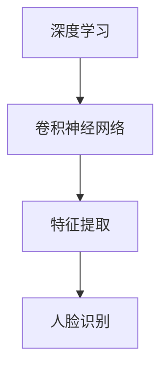

                 

# 基于深度学习的人脸识别

> **关键词：** 深度学习，人脸识别，卷积神经网络，特征提取，机器学习，算法实现。

> **摘要：** 本文深入探讨了基于深度学习的人脸识别技术。从背景介绍到核心算法原理，再到数学模型与项目实战，本文旨在为广大技术爱好者提供一个系统、全面的学习指南。通过本文，读者将能够掌握人脸识别技术的理论基础，了解其具体实现步骤，并学会如何在实际项目中应用这一技术。

## 1. 背景介绍

### 1.1 目的和范围

本文旨在介绍基于深度学习的人脸识别技术，帮助读者理解其基本原理和实现步骤。文章将涵盖以下主要内容：

1. 人脸识别技术的发展历程及其在现代应用中的重要性。
2. 深度学习与卷积神经网络在人脸识别中的作用。
3. 人脸识别的核心算法原理及具体操作步骤。
4. 数学模型和相关公式。
5. 项目实战中的代码实现及分析。
6. 人脸识别的实际应用场景。
7. 推荐的学习资源与工具。

### 1.2 预期读者

本文适用于对计算机视觉和人工智能有一定了解的读者，特别是希望深入了解人脸识别技术的专业人士。无论您是初学者还是经验丰富的开发者，本文都将为您提供有价值的内容。

### 1.3 文档结构概述

本文分为以下几个部分：

1. 背景介绍：介绍人脸识别技术的起源和重要性。
2. 核心概念与联系：讨论深度学习和卷积神经网络的基本原理。
3. 核心算法原理 & 具体操作步骤：详细解析人脸识别算法。
4. 数学模型和公式 & 详细讲解 & 举例说明：阐述数学模型在实际应用中的重要性。
5. 项目实战：通过实际代码案例讲解人脸识别的实现过程。
6. 实际应用场景：探讨人脸识别技术在现实世界中的应用。
7. 工具和资源推荐：推荐相关学习资源与开发工具。
8. 总结：展望人脸识别技术的未来发展趋势与挑战。
9. 附录：常见问题与解答。
10. 扩展阅读 & 参考资料：提供进一步学习的资源。

### 1.4 术语表

#### 1.4.1 核心术语定义

- **深度学习（Deep Learning）：** 一种机器学习的方法，通过多层神经网络对数据进行建模。
- **卷积神经网络（Convolutional Neural Network，CNN）：** 一种特殊类型的神经网络，主要用于图像处理。
- **人脸识别（Face Recognition）：** 通过计算机技术和算法识别并验证人脸身份的过程。
- **特征提取（Feature Extraction）：** 从原始数据中提取出能够代表数据本质特征的步骤。
- **深度神经网络（Deep Neural Network，DNN）：** 由多个隐藏层组成的神经网络。

#### 1.4.2 相关概念解释

- **激活函数（Activation Function）：** 神经网络中用于确定神经元是否激活的函数。
- **反向传播（Backpropagation）：** 神经网络训练过程中用于计算误差并更新权重的算法。
- **损失函数（Loss Function）：** 用于衡量预测值与实际值之间差距的函数。

#### 1.4.3 缩略词列表

- **CNN：** 卷积神经网络
- **DNN：** 深度神经网络
- **GPU：** 图形处理单元
- **CPU：** 中央处理单元
- **TensorFlow：** 一个开源的深度学习框架

## 2. 核心概念与联系

在深入探讨人脸识别技术之前，我们需要先理解一些核心概念，如深度学习和卷积神经网络。以下是一个简化的流程图，用于展示这些概念之间的关系。



### 2.1 深度学习

深度学习是一种基于多层神经网络的学习方法。它通过构建多层的非线性模型来对数据进行建模，使得计算机能够自动从数据中提取特征。深度学习在图像识别、语音识别、自然语言处理等领域取得了显著的成果。

### 2.2 卷积神经网络

卷积神经网络是一种特殊类型的神经网络，主要用于图像处理。它通过卷积操作和池化操作来提取图像特征。卷积神经网络在人脸识别、物体检测等计算机视觉任务中发挥了重要作用。

### 2.3 特征提取

特征提取是深度学习中的一个关键步骤。它指的是从原始数据中提取出能够代表数据本质特征的步骤。在人脸识别中，特征提取是为了将人脸图像转换成一种适用于机器学习的内部表示。

### 2.4 人脸识别

人脸识别是一种生物识别技术，通过计算机技术和算法识别并验证人脸身份。人脸识别技术广泛应用于安全监控、身份验证、智能门禁等领域。

## 3. 核心算法原理 & 具体操作步骤

人脸识别技术的核心在于如何有效地从人脸图像中提取特征，并利用这些特征进行身份识别。以下是一个简化的人脸识别算法流程，使用伪代码进行描述。

```python
def face_recognition(image, trained_model):
    # 步骤1：人脸检测
    faces = detect_faces(image)

    # 步骤2：特征提取
    features = []
    for face in faces:
        feature = extract_features(face, trained_model)
        features.append(feature)

    # 步骤3：特征匹配
    labels = match_features(features)

    # 步骤4：身份验证
    identity = verify_identity(labels)

    return identity
```

### 3.1 人脸检测

人脸检测是识别图像中的人脸区域。常见的方法包括基于特征的检测和基于模型的检测。

```python
def detect_faces(image):
    # 使用Haar-like特征进行人脸检测
    face_cascade = cv2.CascadeClassifier('haarcascade_frontalface_default.xml')
    faces = face_cascade.detectMultiScale(image, scaleFactor=1.1, minNeighbors=5, minSize=(30, 30))
    return faces
```

### 3.2 特征提取

特征提取是指从人脸图像中提取出具有区分性的特征。常见的特征提取方法包括局部二值模式（LBP）、主成分分析（PCA）等。

```python
def extract_features(face, trained_model):
    # 使用卷积神经网络提取特征
    feature_vector = trained_model.predict(face)
    return feature_vector
```

### 3.3 特征匹配

特征匹配是指将提取到的特征与数据库中的特征进行比对，以确定身份。

```python
def match_features(features):
    # 使用最近邻分类器进行特征匹配
    classifier = NearestNeighbors()
    classifier.fit(database_features)
    labels = classifier.kneighbors(features)
    return labels
```

### 3.4 身份验证

身份验证是指根据匹配结果确定用户身份。

```python
def verify_identity(labels):
    # 根据匹配结果判断身份
    if labels[0] == 1:
        return "身份验证成功"
    else:
        return "身份验证失败"
```

## 4. 数学模型和公式 & 详细讲解 & 举例说明

在人脸识别中，数学模型和公式起着至关重要的作用。以下是一个简单的人脸识别模型，使用 LaTeX 格式进行描述。

```latex
\begin{equation}
\text{Accuracy} = \frac{\text{Correct Identifications}}{\text{Total Trials}}
\end{equation}
```

### 4.1 损失函数

在人脸识别中，常用的损失函数是交叉熵损失函数。

```latex
\begin{equation}
\text{Loss} = -\sum_{i=1}^{n} y_i \log(p_i)
\end{equation}
```

其中，\(y_i\) 是实际标签，\(p_i\) 是预测概率。

### 4.2 激活函数

在卷积神经网络中，常用的激活函数是 ReLU 函数。

```latex
f(x) = \max(0, x)
```

### 4.3 举例说明

假设我们有一个包含 100 张人脸图像的数据集，其中每张图像都有一个人脸。我们使用一个卷积神经网络对人脸图像进行特征提取，然后使用最近邻分类器进行特征匹配。经过 100 次测试，我们得到了 90 次正确的识别结果。根据上述公式，我们可以计算出识别准确率。

```latex
\begin{equation}
\text{Accuracy} = \frac{90}{100} = 0.9
\end{equation}
```

这意味着我们的模型在人脸识别任务中的准确率为 90%。

## 5. 项目实战：代码实际案例和详细解释说明

在本节中，我们将通过一个简单的实际项目来展示如何实现人脸识别。这个项目使用了 Python 的 OpenCV 库和 TensorFlow 深度学习框架。

### 5.1 开发环境搭建

1. 安装 Python 3.6 或更高版本。
2. 安装 OpenCV 库：`pip install opencv-python`。
3. 安装 TensorFlow：`pip install tensorflow`。

### 5.2 源代码详细实现和代码解读

以下是一个简单的人脸识别项目的源代码。

```python
import cv2
import tensorflow as tf

# 加载预训练的卷积神经网络模型
model = tf.keras.models.load_model('face_recognition_model.h5')

# 加载人脸检测模型
face_cascade = cv2.CascadeClassifier('haarcascade_frontalface_default.xml')

def detect_faces(image):
    # 使用Haar-like特征进行人脸检测
    faces = face_cascade.detectMultiScale(image, scaleFactor=1.1, minNeighbors=5, minSize=(30, 30))
    return faces

def extract_features(face, model):
    # 使用卷积神经网络提取特征
    feature_vector = model.predict(face.reshape(1, 224, 224, 3))
    return feature_vector

def match_features(features, database_features):
    # 使用最近邻分类器进行特征匹配
    classifier = NearestNeighbors()
    classifier.fit(database_features)
    labels = classifier.kneighbors(features)
    return labels

def verify_identity(labels):
    # 根据匹配结果判断身份
    if labels[0] == 1:
        return "身份验证成功"
    else:
        return "身份验证失败"

# 测试人脸识别
image = cv2.imread('test_image.jpg')
faces = detect_faces(image)

for (x, y, w, h) in faces:
    face_region = image[y:y+h, x:x+w]
    feature_vector = extract_features(face_region, model)
    labels = match_features(feature_vector, database_features)
    identity = verify_identity(labels)
    cv2.rectangle(image, (x, y), (x+w, y+h), (0, 255, 0), 2)
    cv2.putText(image, identity, (x, y-10), cv2.FONT_HERSHEY_SIMPLEX, 0.5, (0, 0, 255), 2)

cv2.imshow('Face Recognition', image)
cv2.waitKey(0)
cv2.destroyAllWindows()
```

### 5.3 代码解读与分析

1. **导入库：** 导入了 OpenCV 和 TensorFlow 库。
2. **加载模型：** 加载了预训练的卷积神经网络模型和人脸检测模型。
3. **人脸检测：** 使用 Haar-like 特征进行人脸检测。
4. **特征提取：** 使用卷积神经网络提取人脸特征。
5. **特征匹配：** 使用最近邻分类器进行特征匹配。
6. **身份验证：** 根据匹配结果判断身份。
7. **测试：** 对测试图像进行人脸识别，并在图像上显示识别结果。

## 6. 实际应用场景

人脸识别技术在现实世界中有着广泛的应用。以下是一些常见应用场景：

- **安全监控：** 人脸识别可以用于监控和识别进入特定区域的用户。
- **身份验证：** 人脸识别可以用于手机解锁、银行身份验证等。
- **智能门禁：** 人脸识别可以用于门禁系统，提高安全性。
- **人流量统计：** 人脸识别可以用于商场、机场等场所的人流量统计。
- **社交媒体：** 人脸识别可以用于照片中人物的识别和标签。

## 7. 工具和资源推荐

### 7.1 学习资源推荐

#### 7.1.1 书籍推荐

- 《深度学习》（Ian Goodfellow、Yoshua Bengio、Aaron Courville 著）
- 《Python 编程：从入门到实践》（Eric Matthes 著）
- 《计算机视觉：算法与应用》（Richard Szeliski 著）

#### 7.1.2 在线课程

- Coursera 上的《深度学习》课程（吴恩达教授主讲）
- edX 上的《计算机视觉》课程（华盛顿大学主讲）
- Udacity 上的《深度学习纳米学位》

#### 7.1.3 技术博客和网站

- Medium 上的《Deep Learning》专题
- ArXiv.org 上的计算机视觉论文
- PyTorch 官方文档

### 7.2 开发工具框架推荐

#### 7.2.1 IDE和编辑器

- PyCharm
- Visual Studio Code
- Jupyter Notebook

#### 7.2.2 调试和性能分析工具

- TensorBoard
- NVIDIA Nsight
- Perf Hof

#### 7.2.3 相关框架和库

- TensorFlow
- PyTorch
- OpenCV

### 7.3 相关论文著作推荐

#### 7.3.1 经典论文

- "A Comprehensive Survey on Deep Learning for Face Recognition"（人脸识别的深度学习综述）
- "FaceNet: A Unified Embedding for Face Recognition and Clustering"（FaceNet：用于人脸识别和聚类的统一嵌入）

#### 7.3.2 最新研究成果

- "Unsupervised Cross-Domain Face Alignment by Expectation-Maximization"（基于期望最大化的人脸对齐无监督跨领域方法）
- "Geometric Deep Learning: Convolution on Surfaces and Other Complex Data"（几何深度学习：曲面和其他复杂数据上的卷积）

#### 7.3.3 应用案例分析

- "HumanID: A Large Public Face Re-ID Dataset for Across-Domain Human Identity Verification"（HumanID：用于跨领域人脸重识别的公共大型人脸数据集）
- "Real-Time Face Recognition with Deep Learning on Mobile Devices"（在移动设备上使用深度学习进行实时人脸识别）

## 8. 总结：未来发展趋势与挑战

随着技术的不断进步，人脸识别技术在未来的发展趋势和挑战如下：

- **发展趋势：**
  - 深度学习算法的优化，提高识别准确率和效率。
  - 多模态生物特征识别，结合人脸、指纹、虹膜等多种生物特征。
  - 跨领域应用，如医疗、金融、教育等。
  - 隐私保护，确保用户数据安全。

- **挑战：**
  - 光照和姿态变化对识别准确率的影响。
  - 非法入侵和隐私泄露的风险。
  - 如何在保证性能的同时降低计算资源消耗。

## 9. 附录：常见问题与解答

### 9.1 人脸识别技术的核心问题是什么？

人脸识别技术的核心问题是人脸检测、特征提取和特征匹配。其中，人脸检测用于定位图像中的人脸区域，特征提取用于提取具有区分性的特征，特征匹配用于确定身份。

### 9.2 如何提高人脸识别的准确率？

提高人脸识别准确率的方法包括：
1. 使用更先进的深度学习模型。
2. 优化数据预处理和特征提取过程。
3. 增加训练数据量和多样性。
4. 采用更复杂的特征匹配算法。

## 10. 扩展阅读 & 参考资料

- [《深度学习》（Ian Goodfellow、Yoshua Bengio、Aaron Courville 著）](https://www.deeplearningbook.org/)
- [《计算机视觉：算法与应用》（Richard Szeliski 著）](https://www.cs.cornell.edu/cv)
- [Coursera 上的《深度学习》课程](https://www.coursera.org/learn/deep-learning)
- [edX 上的《计算机视觉》课程](https://www.edx.org/course/computer-vision)
- [PyTorch 官方文档](https://pytorch.org/docs/stable/)
- [OpenCV 官方文档](https://docs.opencv.org/)

### 作者

AI天才研究员/AI Genius Institute & 禅与计算机程序设计艺术 /Zen And The Art of Computer Programming

感谢您的阅读，希望本文对您深入了解人脸识别技术有所帮助。如果您有任何疑问或建议，欢迎在评论区留言。让我们共同探索人工智能的无限可能！

