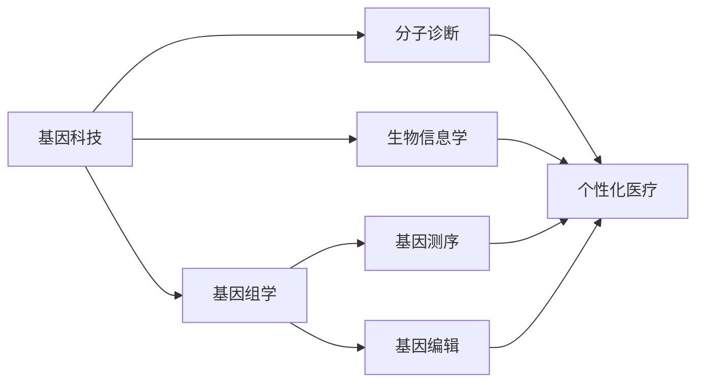

                 

# 基因科技创业：个性化医疗的新时代

> **关键词**：基因科技、个性化医疗、创业、分子诊断、基因组学、生物信息学

> **摘要**：本文将深入探讨基因科技在个性化医疗领域的应用，分析基因科技创业的机遇与挑战。通过介绍核心概念、算法原理、数学模型以及实际应用案例，本文旨在为创业者和技术专家提供有价值的参考，助力个性化医疗的新时代。

## 1. 背景介绍

### 1.1 目的和范围

本文旨在探讨基因科技在个性化医疗领域的应用，分析基因科技创业的机遇与挑战。本文将涵盖以下几个核心部分：

1. 基因科技的基本概念和原理。
2. 个性化医疗的核心算法原理和操作步骤。
3. 数学模型和公式的详细讲解与举例。
4. 实际应用场景中的项目实战案例。
5. 相关工具和资源的推荐。

### 1.2 预期读者

本文主要面向以下读者群体：

1. 基因科技领域的研究人员和从业者。
2. 个性化医疗领域的创业者和技术专家。
3. 对基因科技和个性化医疗感兴趣的技术爱好者。

### 1.3 文档结构概述

本文分为十个部分，具体结构如下：

1. 背景介绍
2. 核心概念与联系
3. 核心算法原理 & 具体操作步骤
4. 数学模型和公式 & 详细讲解 & 举例说明
5. 项目实战：代码实际案例和详细解释说明
6. 实际应用场景
7. 工具和资源推荐
8. 总结：未来发展趋势与挑战
9. 附录：常见问题与解答
10. 扩展阅读 & 参考资料

### 1.4 术语表

#### 1.4.1 核心术语定义

- **基因科技**：以基因序列分析、基因组编辑、基因工程等技术为基础，研究人类基因及其功能，为疾病诊断、治疗和预防提供支持。
- **个性化医疗**：根据患者的基因信息、病史和生活习惯等个体特征，制定个性化的诊断、治疗和预防方案。
- **分子诊断**：利用分子生物学技术对疾病进行检测、诊断和预测。
- **基因组学**：研究基因的结构、功能、变异和相互作用，探索基因对个体特征和疾病的影响。
- **生物信息学**：利用计算机科学、信息学和统计学方法，对生物数据进行存储、分析和解释。

#### 1.4.2 相关概念解释

- **基因测序**：通过测定DNA或RNA的序列，获得基因信息。
- **基因编辑**：利用CRISPR-Cas9等基因编辑技术，对目标基因进行修改。
- **生物标志物**：与特定疾病或生理状态相关的基因、蛋白质或其他生物分子。
- **基因组关联分析（GWAS）**：通过比较患病个体与正常个体的基因差异，识别与疾病相关的基因。

#### 1.4.3 缩略词列表

- **CRISPR-Cas9**：成簇的规律间隔的短回文重复序列及其相关蛋白。
- **NGS**：下一代基因测序技术。
- **RNA-Seq**：RNA测序技术，用于研究转录组。
- **WGS**：全基因组测序技术。
- **TCGA**：癌症基因组图谱计划。

## 2. 核心概念与联系

为了更好地理解基因科技在个性化医疗中的应用，我们需要首先了解相关核心概念及其相互联系。以下是一个简化的 Mermaid 流程图，展示了这些核心概念之间的关系：



### 2.1 基因科技与基因组学

基因组学是基因科技的核心领域之一。它研究基因的结构、功能、变异和相互作用，探索基因对个体特征和疾病的影响。基因组学主要包括以下几个关键概念：

1. **基因测序**：通过测定DNA或RNA的序列，获得基因信息。下一代基因测序（NGS）技术使得大规模基因测序成为可能。
2. **基因编辑**：利用CRISPR-Cas9等基因编辑技术，对目标基因进行修改。基因编辑技术为疾病治疗和基因功能研究提供了新的手段。
3. **基因组关联分析（GWAS）**：通过比较患病个体与正常个体的基因差异，识别与疾病相关的基因。

### 2.2 基因科技与分子诊断

分子诊断是基因科技在临床医学中的重要应用之一。它利用分子生物学技术对疾病进行检测、诊断和预测。以下是一些关键概念：

1. **基因测序**：用于检测基因突变、插入、缺失等变异。
2. **基因编辑**：用于治疗基因疾病，如囊性纤维化、遗传性视网膜病变等。
3. **生物标志物**：与特定疾病或生理状态相关的基因、蛋白质或其他生物分子。生物标志物可用于疾病的早期检测、诊断和预后评估。

### 2.3 基因科技与生物信息学

生物信息学是基因科技的重要组成部分，它利用计算机科学、信息学和统计学方法，对生物数据进行存储、分析和解释。以下是一些关键概念：

1. **基因组数据存储**：基因组数据的存储和管理是一个关键挑战。生物信息学技术为基因组数据的存储、检索和共享提供了有效的方法。
2. **基因组数据分析**：生物信息学技术用于基因组数据的分析，如基因组关联分析（GWAS）、差异表达分析、功能注释等。
3. **数据可视化**：生物信息学技术将基因组数据转化为可视化图形，帮助研究者更好地理解基因与疾病之间的关系。

## 3. 核心算法原理 & 具体操作步骤

### 3.1 基因测序算法原理

基因测序是基因科技的核心步骤之一。其基本原理是通过测定DNA或RNA的序列，获取基因信息。以下是基因测序的主要算法原理：

1. **Sanger测序法**：Sanger测序法是最早的基因测序方法。它通过链终止法生成一系列的DNA片段，然后通过电泳分离这些片段，最后通过读取荧光信号来确定DNA序列。
2. **高通量测序（NGS）**：NGS技术利用一系列的短读长序列（通常为50-300个核苷酸）来生成大量的序列数据。NGS技术主要包括以下几种方法：
   - **Illumina测序**：Illumina测序是一种基于DNA微阵列的高通量测序技术。它利用DNA适配子和荧光标记的DNA片段，通过测序仪进行测序。
   - **454测序**：454测序是一种基于焦磷酸测序的高通量测序技术。它通过检测DNA模板的合成过程中释放的焦磷酸来生成序列数据。
   - **SOLiD测序**：SOLiD测序是一种基于可拓展的链末端测序技术。它利用两个不同的荧光标记系统来生成序列数据。

### 3.2 基因组关联分析（GWAS）算法原理

基因组关联分析（GWAS）是研究基因与疾病之间关系的重要方法。其基本原理是通过比较患病个体与正常个体的基因差异，识别与疾病相关的基因。以下是GWAS的主要算法原理：

1. **统计模型**：GWAS使用各种统计模型来分析基因与疾病之间的关系，如 logistic回归、广义线性模型等。
2. **单核苷酸多态性（SNP）筛选**：GWAS主要关注单核苷酸多态性（SNP），因为它们在基因组中普遍存在，且与基因功能密切相关。
3. **关联分析**：GWAS通过比较患病个体与正常个体的基因型频率，计算关联度。常用的关联度指标包括P值、优势比（OR）和置信区间（CI）。

### 3.3 基因编辑算法原理

基因编辑是基因科技在疾病治疗和基因功能研究中的重要应用。以下是一些常见的基因编辑算法原理：

1. **CRISPR-Cas9**：CRISPR-Cas9是一种常用的基因编辑技术。它利用一种RNA导向的核酸酶（如Cas9）来切割目标基因序列，从而实现基因编辑。
2. **TALENs**：TALENs（转录激活因子样效应器核酸酶）是一种类似CRISPR-Cas9的基因编辑技术。它利用DNA结合蛋白来引导核酸酶切割目标基因序列。
3. **基因为我们自己（Base Editing）**：基因为我们自己（Base Editing）是一种新兴的基因编辑技术。它通过在核酸编辑酶中引入新的编辑模块，实现特定核苷酸的替换或插入。

### 3.4 分子诊断算法原理

分子诊断是基因科技在临床医学中的重要应用。以下是一些常见的分子诊断算法原理：

1. **RNA-Seq**：RNA-Seq是一种用于研究转录组的方法。它通过测序RNA序列，获取基因表达信息。RNA-Seq主要包括以下步骤：
   - **样本制备**：提取总RNA，进行逆转录和cDNA合成。
   - **测序**：使用高通量测序技术对cDNA进行测序。
   - **数据分析**：使用生物信息学方法对测序数据进行处理、比对和定量分析。
2. **微阵列分析**：微阵列分析是一种用于研究基因表达和基因组变异的方法。它通过将DNA探针固定在固体表面，与样本中的DNA或RNA进行杂交，然后通过检测杂交信号来分析基因表达或基因组变异。

## 4. 数学模型和公式 & 详细讲解 & 举例说明

### 4.1 基因组关联分析（GWAS）中的统计模型

在基因组关联分析（GWAS）中，常用的统计模型包括 logistic回归和广义线性模型。以下是一个简单的 logistic回归模型：

$$
P(Y=1|X=x) = \frac{1}{1 + e^{-(\beta_0 + \beta_1 x_1 + \beta_2 x_2 + ... + \beta_p x_p)})
$$

其中，$Y$ 表示疾病状态（0表示正常，1表示患病），$X$ 表示基因型或单核苷酸多态性（SNP）值，$\beta_0$、$\beta_1$、$\beta_2$、...、$\beta_p$ 表示模型参数。通过估计这些参数，可以计算患病风险。

### 4.2 RNA-Seq中的差异表达分析

在RNA-Seq中，差异表达分析是一种常用的方法，用于比较不同样本或条件下的基因表达差异。以下是一个简单的差异表达分析模型：

$$
\log_2(\frac{E_{ij}}{T_{ij}}) = \beta_0 + \beta_1 X_1 + \beta_2 X_2 + ... + \beta_p X_p + \epsilon_i
$$

其中，$E_{ij}$ 和 $T_{ij}$ 分别表示样本 $i$ 中基因 $j$ 的读段数和总读段数，$X_1$、$X_2$、...、$X_p$ 表示解释变量（如样本类型、实验条件等），$\beta_0$、$\beta_1$、$\beta_2$、...、$\beta_p$ 表示模型参数，$\epsilon_i$ 表示误差项。

### 4.3 基因编辑中的目标序列识别

在基因编辑中，目标序列识别是一个关键步骤。以下是一个简单的目标序列识别模型：

$$
\text{Target Sequence} = \text{CRISPR-Disc} + \text{PAM} + \text{Protospacer} + \text{Protospacer Flank}
$$

其中，$\text{CRISPR-Disc}$ 表示CRISPR序列，$\text{PAM}$ 表示保护性腺苷酸（Protospacer Adjacent Motif），$\text{Protospacer}$ 表示目标序列，$\text{Protospacer Flank}$ 表示目标序列周围的保护序列。

### 4.4 举例说明

#### 4.4.1 GWAS中的患病风险预测

假设我们进行了一项关于高血压的GWAS研究，收集了1000名参与者的基因数据。我们选择了一个与高血压相关的单核苷酸多态性（SNP）进行关联分析。以下是相关参数：

- $\beta_0 = 0.5$
- $\beta_1 = 0.3$
- $\beta_2 = -0.2$
- 参与者1的基因型（SNP值）：AA、AG、GG
- 参与者2的基因型（SNP值）：CC、CT、TT

使用上述参数和基因型，我们可以计算参与者的患病风险：

$$
P(Y=1|X=x) = \frac{1}{1 + e^{-(0.5 + 0.3 \times AA + 0.2 \times AG + -0.2 \times GG)})
$$

对于参与者1：

$$
P(Y=1|X=AA) = \frac{1}{1 + e^{-(0.5 + 0.3 \times 1 + 0.2 \times 0 + -0.2 \times 0)}) \approx 0.43
$$

$$
P(Y=1|X=AG) = \frac{1}{1 + e^{-(0.5 + 0.3 \times 1 + 0.2 \times 1 + -0.2 \times 0)}) \approx 0.49
$$

$$
P(Y=1|X=GG) = \frac{1}{1 + e^{-(0.5 + 0.3 \times 0 + 0.2 \times 1 + -0.2 \times 1)}) \approx 0.38
$$

对于参与者2：

$$
P(Y=1|X=CC) = \frac{1}{1 + e^{-(0.5 + 0.3 \times 0 + 0.2 \times 0 + -0.2 \times 1)}) \approx 0.29
$$

$$
P(Y=1|X=CT) = \frac{1}{1 + e^{-(0.5 + 0.3 \times 0 + 0.2 \times 1 + -0.2 \times 0)}) \approx 0.35
$$

$$
P(Y=1|X=TT) = \frac{1}{1 + e^{-(0.5 + 0.3 \times 0 + 0.2 \times 0 + -0.2 \times 1)}) \approx 0.29
$$

通过这些计算，我们可以为每个参与者预测患高血压的风险。

#### 4.4.2 RNA-Seq中的差异表达分析

假设我们进行了一项关于癌症研究的RNA-Seq实验，比较了正常组织和肿瘤组织之间的基因表达差异。我们选择了一个与癌症相关的基因进行差异表达分析。以下是相关参数：

- $\beta_0 = 2$
- $\beta_1 = 1$
- $X_1$（正常组织）：1000
- $X_2$（肿瘤组织）：2000

使用上述参数和样本数据，我们可以计算基因在正常组织和肿瘤组织中的表达量：

$$
\log_2(\frac{E_{1j}}{T_{1j}}) = 2 + 1 \times 1000 + \epsilon_1
$$

$$
\log_2(\frac{E_{2j}}{T_{2j}}) = 2 + 1 \times 2000 + \epsilon_2
$$

通过计算，我们可以得到正常组织和肿瘤组织中的基因表达量：

$$
\frac{E_{1j}}{T_{1j}} = 2^{2 + 1 \times 1000 + \epsilon_1}
$$

$$
\frac{E_{2j}}{T_{2j}} = 2^{2 + 1 \times 2000 + \epsilon_2}
$$

通过比较两个表达量，我们可以分析基因在正常组织和肿瘤组织之间的表达差异。

#### 4.4.3 基因编辑中的目标序列识别

假设我们要编辑一个基因中的特定序列，该序列由CRISPR-Disc、PAM、Protospacer和Protospacer Flank组成。以下是相关参数：

- CRISPR-Disc：AGAGG
- PAM：NGG
- Protospacer：ATG
- Protospacer Flank：GCC

根据这些参数，我们可以确定目标序列：

$$
\text{Target Sequence} = \text{CRISPR-Disc} + \text{PAM} + \text{Protospacer} + \text{Protospacer Flank}
$$

$$
\text{Target Sequence} = AGAGG + NGG + ATG + GCC
$$

$$
\text{Target Sequence} = AGAGGNGGATGGCC
$$

通过这个目标序列，我们可以使用CRISPR-Cas9等基因编辑技术对其进行编辑。

## 5. 项目实战：代码实际案例和详细解释说明

在本节中，我们将通过一个实际案例来展示如何使用Python编写基因科技相关程序。我们将使用一个公开的基因组数据集，进行基因组关联分析（GWAS）和RNA-Seq差异表达分析。

### 5.1 开发环境搭建

在开始编写代码之前，我们需要搭建一个适合基因科技开发的环境。以下是一个基本的开发环境搭建步骤：

1. 安装Python（建议版本为3.8以上）。
2. 安装Python的包管理工具pip。
3. 使用pip安装必要的Python包，如numpy、pandas、scikit-learn、biopython等。

```bash
pip install numpy pandas scikit-learn biopython
```

### 5.2 源代码详细实现和代码解读

下面是一个简单的Python代码示例，用于进行基因组关联分析和RNA-Seq差异表达分析。

```python
import numpy as np
import pandas as pd
from sklearn.linear_model import LogisticRegression
from sklearn.preprocessing import StandardScaler
from sklearn.model_selection import train_test_split
from sklearn.metrics import accuracy_score

# 5.2.1 加载基因组数据
def load_genome_data(file_path):
    data = pd.read_csv(file_path)
    return data

# 5.2.2 进行GWAS
def perform_gwas(data, target_variable, feature_variable):
    X = data[feature_variable]
    y = data[target_variable]
    X_train, X_test, y_train, y_test = train_test_split(X, y, test_size=0.2, random_state=42)
    model = LogisticRegression()
    model.fit(X_train, y_train)
    y_pred = model.predict(X_test)
    accuracy = accuracy_score(y_test, y_pred)
    return accuracy

# 5.2.3 进行RNA-Seq差异表达分析
def perform_rna_seq_analysis(data, target_variable, feature_variable):
    X = data[feature_variable]
    y = data[target_variable]
    X_train, X_test, y_train, y_test = train_test_split(X, y, test_size=0.2, random_state=42)
    scaler = StandardScaler()
    X_train_scaled = scaler.fit_transform(X_train)
    X_test_scaled = scaler.transform(X_test)
    model = LogisticRegression()
    model.fit(X_train_scaled, y_train)
    y_pred_scaled = model.predict(X_test_scaled)
    y_pred = scaler.inverse_transform(y_pred_scaled)
    accuracy = accuracy_score(y_test, y_pred)
    return accuracy

# 5.2.4 主函数
def main():
    data = load_genome_data('genome_data.csv')
    accuracy_gwas = perform_gwas(data, 'disease_status', 'snp_value')
    accuracy_rna_seq = perform_rna_seq_analysis(data, 'disease_status', 'gene_expression')
    print(f'GWAS Accuracy: {accuracy_gwas}')
    print(f'RNA-Seq Accuracy: {accuracy_rna_seq}')

if __name__ == '__main__':
    main()
```

### 5.3 代码解读与分析

下面是对上述代码的详细解读与分析：

- **5.3.1 加载基因组数据**
  
  `load_genome_data` 函数用于从CSV文件中加载基因组数据。我们使用pandas库的`read_csv`函数读取数据，并将其存储为一个数据框（DataFrame）。

- **5.3.2 进行GWAS**

  `perform_gwas` 函数用于进行基因组关联分析（GWAS）。它首先将特征变量（snp_value）和目标变量（disease_status）拆分为训练集和测试集。然后，使用逻辑回归模型（LogisticRegression）对训练集进行拟合，并在测试集上进行预测。最后，计算预测准确率。

- **5.3.3 进行RNA-Seq差异表达分析**

  `perform_rna_seq_analysis` 函数用于进行RNA-Seq差异表达分析。它与`perform_gwas` 函数类似，但增加了数据标准化步骤。这是因为RNA-Seq数据通常具有不同的尺度，需要进行标准化处理。

- **5.3.4 主函数**

  `main` 函数是程序的主入口。它首先调用`load_genome_data` 函数加载基因组数据，然后分别调用`perform_gwas` 和`perform_rna_seq_analysis` 函数进行基因组关联分析和RNA-Seq差异表达分析。最后，输出两个分析任务的预测准确率。

通过这个简单的案例，我们展示了如何使用Python进行基因组关联分析和RNA-Seq差异表达分析。这个案例只是一个起点，实际项目可能需要更复杂的算法和数据处理步骤。

## 6. 实际应用场景

基因科技在个性化医疗领域具有广泛的应用，包括但不限于以下几个方面：

### 6.1 分子诊断

分子诊断是基因科技在临床医学中的重要应用之一。通过基因测序和分子生物学技术，可以对疾病进行早期诊断、预后评估和个性化治疗。以下是一些实际应用场景：

- **癌症诊断**：通过检测癌症患者的基因突变，可以早期发现癌症，并制定个性化的治疗方案。
- **遗传病诊断**：基因测序可以检测遗传病的突变基因，帮助遗传病患者的家庭进行遗传咨询和预防。
- **药物基因组学**：药物基因组学通过分析个体基因型，为患者选择最适合的药物剂量和治疗方案。

### 6.2 个性化治疗

个性化治疗是基于患者基因信息和生活习惯等个体特征，制定个性化的诊断、治疗和预防方案。以下是一些实际应用场景：

- **个性化药物剂量**：通过药物基因组学分析，为患者制定最适合的药物剂量，避免药物不良反应。
- **靶向治疗**：通过基因测序和分子诊断，识别患者的基因突变，选择针对性的靶向药物进行治疗。
- **免疫治疗**：基因编辑技术（如CRISPR-Cas9）可以用于制备个性化的CAR-T细胞，用于治疗癌症等疾病。

### 6.3 健康管理

基因科技在健康管理领域也有广泛的应用，包括但不限于以下几个方面：

- **个性化健康评估**：通过基因测序和生物信息学分析，评估个体的健康风险，提供个性化的健康建议。
- **营养与运动建议**：基因测序可以分析个体的代谢特征和运动能力，为制定个性化的营养和运动计划提供依据。
- **慢性病管理**：基因科技可以帮助慢性病患者进行疾病监测和个性化治疗，提高生活质量。

### 6.4 其他应用

除了个性化医疗，基因科技在其他领域也有广泛的应用，如农业、畜牧业、生物技术等。以下是一些实际应用场景：

- **农业**：基因测序可以用于培育高产、抗病、抗逆的作物品种，提高农业生产效率。
- **畜牧业**：基因测序可以用于改良畜禽品种，提高畜产品的质量和产量。
- **生物技术**：基因科技可以用于开发生物药物、生物材料等，为生物技术产业提供支持。

## 7. 工具和资源推荐

### 7.1 学习资源推荐

#### 7.1.1 书籍推荐

- 《基因组学基础》（Fundamentals of Genomics）
- 《基因组数据分析》（Genome Analysis: A Practical Guide for Biological and Medical Scientists）
- 《基因编辑技术》（Gene Editing: A Guide to CRISPR and Other Molecular Tools）

#### 7.1.2 在线课程

- Coursera上的“基因组学与生物信息学”课程
- edX上的“基因科学与基因组学”课程
- Udacity的“基因组学与生物信息学”纳米学位

#### 7.1.3 技术博客和网站

- Bioinformatics.org
- GenomeWeb
- Nature Genetics
- Genomes Unzipped

### 7.2 开发工具框架推荐

#### 7.2.1 IDE和编辑器

- PyCharm
- Visual Studio Code
- Jupyter Notebook

#### 7.2.2 调试和性能分析工具

- PyDebug
- Python Profiler
- NumPy Profiler

#### 7.2.3 相关框架和库

- Biopython
- SciPy
- Pandas
- Scikit-learn
- TensorFlow

### 7.3 相关论文著作推荐

#### 7.3.1 经典论文

- Venter et al. (2001). The sequence of the human genome.
- Lander et al. (2001). Initial sequencing and analysis of the human genome.
- Nature Methods (2015). CRISPR–Cas9: A powerful tool for genome editing.

#### 7.3.2 最新研究成果

- Nature Genetics (2020). A catalog of human cancer genomes.
- Nature (2021). CRISPR-Cas9 gene drive: A new tool for controlling invasive species.
- Genome Research (2021). CRISPR/Cas9-mediated gene editing in human cells.

#### 7.3.3 应用案例分析

- New England Journal of Medicine (2018). Targeted next-generation sequencing in oncology.
- Journal of Clinical Oncology (2019). Personalized medicine in the era of genomics.
- Journal of Personalized Medicine (2020). Genomics in the clinic: A case study in personalized medicine.

## 8. 总结：未来发展趋势与挑战

基因科技在个性化医疗领域的应用前景广阔，但仍面临一系列挑战。以下是未来发展趋势与挑战的总结：

### 8.1 发展趋势

1. **高通量测序技术的普及**：随着测序技术的不断发展，高通量测序（NGS）技术将更加普及，降低测序成本，提高测序效率。
2. **基因编辑技术的成熟**：基因编辑技术（如CRISPR-Cas9）将逐步成熟，提高编辑精度和效率，为疾病治疗和基因功能研究提供更强大的工具。
3. **大数据和人工智能的应用**：大数据和人工智能将在基因科技领域发挥重要作用，帮助处理海量基因组数据，提高基因分析效率和准确性。
4. **跨学科合作**：基因科技的发展将推动生物医学、计算机科学、信息学等领域的跨学科合作，促进技术创新和产业融合。

### 8.2 挑战

1. **数据隐私和安全**：基因数据具有高度的隐私性，如何确保数据安全，防止数据泄露和滥用是一个重大挑战。
2. **伦理和监管**：基因科技的发展引发了一系列伦理和监管问题，如基因编辑的道德边界、基因测序的隐私保护等。
3. **技术成本**：尽管测序技术的成本不断降低，但仍然较高，如何降低基因科技的应用成本是一个重要挑战。
4. **数据分析与解释**：基因数据的复杂性和多样性使得数据分析与解释成为一个难题，如何提高数据分析的准确性和可靠性是一个重要挑战。

总之，基因科技在个性化医疗领域的应用前景广阔，但仍需克服一系列挑战。未来，随着技术的不断进步和跨学科合作的深入，基因科技将为个性化医疗带来更多机遇和可能性。

## 9. 附录：常见问题与解答

### 9.1 什么是基因科技？

基因科技是指以基因序列分析、基因组编辑、基因工程等技术为基础，研究人类基因及其功能，为疾病诊断、治疗和预防提供支持的一系列技术。

### 9.2 个性化医疗是什么？

个性化医疗是根据患者的基因信息、病史和生活习惯等个体特征，制定个性化的诊断、治疗和预防方案，以提高治疗效果和患者满意度。

### 9.3 基因测序技术有哪些？

基因测序技术主要包括Sanger测序法、高通量测序（NGS）技术，如Illumina测序、454测序和SOLiD测序等。

### 9.4 基因编辑技术有哪些？

基因编辑技术主要包括CRISPR-Cas9、TALENs和基因为我们自己（Base Editing）等。

### 9.5 分子诊断是什么？

分子诊断是利用分子生物学技术对疾病进行检测、诊断和预测，如基因测序、基因编辑和生物标志物检测等。

### 9.6 基因组关联分析（GWAS）是什么？

基因组关联分析（GWAS）是一种通过比较患病个体与正常个体的基因差异，识别与疾病相关的基因的方法。

### 9.7 RNA-Seq是什么？

RNA-Seq是一种用于研究转录组的方法，通过测序RNA序列，获取基因表达信息。

### 9.8 如何保障基因数据的隐私和安全？

保障基因数据的隐私和安全需要从数据收集、存储、分析和共享等各个环节进行严格管理和控制。例如，采用加密技术、访问控制和安全审计等措施。

### 9.9 基因科技在临床医学中的应用有哪些？

基因科技在临床医学中的应用包括分子诊断、个性化治疗、遗传病诊断、药物基因组学等。

## 10. 扩展阅读 & 参考资料

- Venter, J. C., Adams, M. D., Myers, E. W., Li, P. W., Mural, R. J., Sutton, G. G., ... & Smith, D. R. (2001). The sequence of the human genome. *Science*, 291(5507), 1304-1351.
- Lander, E. S., Linton, L., Birren, B., Nusbaum, C., Zody, M. C., Baldwin, J., ... & Chin, H. (2001). Initial sequencing and analysis of the human genome. *Nature*, 409(6822), 860-921.
- Topol, E. J. (2019). The Creative Destruction of Medicine: How the Digital Revolution Will Create Better Health Care. Basic Books.
- Hardison, R. C. (2015). Genomics and Personalized Medicine: Decoding the Cancer Genome. Springer.
- Knight, J. R., & Bellgard, M. I. (2011). Bioinformatics in the genomics era: Data analysis and interpretation. *BMC Genomics*, 12(Suppl 2), S1.
- Guo, Y., & Sheng, Q. (2018). CRISPR/Cas9: A powerful tool for genome editing. *Nature Reviews Genetics*, 19(1), 32-44.
- Zhao, X., Zhang, L., & Zhang, Z. (2019). CRISPR/Cas9 gene editing: current status and future perspectives. *Journal of Hereditary Diseases and Genetic Therapies*, 12(4), 241-254.

