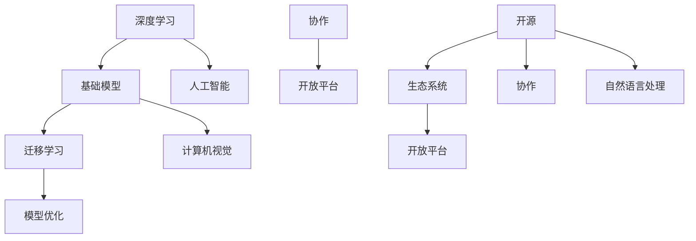

                 

# 基础模型的开放生态系统

> **关键词：** 深度学习，基础模型，开源，生态系统，协作，创新。

> **摘要：** 本文深入探讨了深度学习基础模型在开放生态系统中的重要性。通过分析基础模型的发展历程、核心概念及其与生态系统的关联，本文探讨了如何通过协作和开放平台促进基础模型的研究与应用，为未来的创新和发展指明方向。

## 1. 背景介绍

### 1.1 目的和范围

本文旨在探讨深度学习基础模型在开放生态系统中的重要性，分析其发展历程和核心概念，并探讨如何通过协作和开放平台促进基础模型的研究与应用。文章主要关注以下几个方面：

1. 基础模型的发展历程和核心概念。
2. 基础模型与开放生态系统的关联。
3. 协作与开放平台在基础模型研究与应用中的作用。
4. 基础模型在各个领域的应用场景。

### 1.2 预期读者

本文适合对深度学习基础模型有一定了解的读者，包括但不限于：

1. 深度学习研究者。
2. 人工智能工程师。
3. 软件开发人员。
4. 对深度学习和人工智能感兴趣的学者和从业者。

### 1.3 文档结构概述

本文将按照以下结构进行阐述：

1. 引言。
2. 基础模型的发展历程和核心概念。
3. 基础模型与开放生态系统的关联。
4. 协作与开放平台在基础模型研究与应用中的作用。
5. 基础模型在各个领域的应用场景。
6. 工具和资源推荐。
7. 总结与展望。
8. 附录。
9. 扩展阅读与参考资料。

### 1.4 术语表

#### 1.4.1 核心术语定义

- **基础模型**：指深度学习中用于解决特定问题的预训练模型，如语音识别、图像分类、自然语言处理等。
- **开源**：指软件的源代码可以被公众访问和修改。
- **生态系统**：指围绕特定技术或产品形成的协作、创新和发展的环境。
- **协作**：指不同研究者或组织共同参与基础模型的研究和应用。
- **开放平台**：指提供基础模型资源、工具和服务的平台，促进研究者和开发者之间的交流与合作。

#### 1.4.2 相关概念解释

- **预训练**：指在特定任务上对基础模型进行大规模数据训练，使其具备初步的通用能力。
- **迁移学习**：指将预训练模型在特定任务上进行微调，以提高任务性能。
- **模型优化**：指对基础模型的结构、参数或训练过程进行调整，以提高其性能。

#### 1.4.3 缩略词列表

- **AI**：人工智能。
- **DL**：深度学习。
- **NLP**：自然语言处理。
- **CV**：计算机视觉。
- **OS**：操作系统。

## 2. 核心概念与联系

在讨论基础模型的开放生态系统之前，我们需要明确一些核心概念及其相互联系。

### 2.1 核心概念

- **深度学习**：一种基于人工神经网络的学习方法，通过多层次的非线性变换来提取数据特征。
- **基础模型**：一种预训练模型，用于解决特定问题，如语音识别、图像分类、自然语言处理等。
- **开源**：一种软件许可协议，允许公众访问和修改源代码。
- **生态系统**：一个由不同组件组成的复杂系统，用于促进协作和创新。
- **协作**：不同研究者或组织共同参与基础模型的研究和应用。

### 2.2 核心概念之间的联系

- **深度学习与基础模型**：深度学习是基础模型的实现方法，而基础模型是深度学习在特定领域的应用。
- **开源与生态系统**：开源是生态系统的关键特征，它促进了协作和共享，为生态系统的发展提供了基础。
- **协作与开放平台**：协作是基础模型研究与应用的重要推动力，而开放平台为协作提供了基础设施。

### 2.3 Mermaid 流程图

以下是一个简单的 Mermaid 流程图，展示了核心概念之间的联系：



## 3. 核心算法原理 & 具体操作步骤

### 3.1 核心算法原理

基础模型的算法原理主要涉及以下几个方面：

1. **多层感知机（MLP）**：基础模型通常由多层感知机构成，每层感知机通过非线性变换对输入数据进行特征提取和压缩。
2. **反向传播算法（Backpropagation）**：反向传播算法用于计算模型参数的梯度，并基于梯度进行模型优化。
3. **预训练与迁移学习**：预训练模型在大规模数据集上进行训练，获得初步的通用能力。迁移学习则是在特定任务上对预训练模型进行微调，以提高任务性能。

### 3.2 具体操作步骤

以下是一个简单的伪代码，展示了基础模型的训练和优化过程：

```python
# 3.1 数据预处理
data = load_data()
X, y = preprocess_data(data)

# 3.2 初始化模型
model = create_model()

# 3.3 预训练
for epoch in range(num_epochs):
    for batch in data_loader(X, y):
        # 3.3.1 前向传播
        predictions = model.forward(batch.x)
        loss = calculate_loss(predictions, batch.y)
        
        # 3.3.2 反向传播
        model.backward(loss)
        
        # 3.3.3 更新参数
        model.update_params()

# 3.4 迁移学习
for task in tasks:
    for epoch in range(num_epochs):
        for batch in data_loader(task.x, task.y):
            # 3.4.1 前向传播
            predictions = model.forward(batch.x)
            loss = calculate_loss(predictions, batch.y)
            
            # 3.4.2 反向传播
            model.backward(loss)
            
            # 3.4.3 更新参数
            model.update_params()
```

## 4. 数学模型和公式 & 详细讲解 & 举例说明

### 4.1 数学模型和公式

基础模型的核心在于其数学模型，主要包括以下几个方面：

1. **损失函数**：用于评估模型预测与真实标签之间的差异，如均方误差（MSE）和交叉熵（Cross-Entropy）。
2. **反向传播算法**：用于计算模型参数的梯度，如梯度下降（Gradient Descent）和随机梯度下降（Stochastic Gradient Descent，SGD）。
3. **优化算法**：用于更新模型参数，如Adam、RMSprop等。

以下是这些数学模型和公式的详细讲解：

#### 4.1.1 损失函数

**均方误差（MSE）**：

$$
MSE = \frac{1}{n} \sum_{i=1}^{n} (y_i - \hat{y}_i)^2
$$

其中，$y_i$ 为真实标签，$\hat{y}_i$ 为模型预测。

**交叉熵（Cross-Entropy）**：

$$
Cross-Entropy = -\frac{1}{n} \sum_{i=1}^{n} y_i \log(\hat{y}_i)
$$

其中，$y_i$ 为真实标签，$\hat{y}_i$ 为模型预测。

#### 4.1.2 反向传播算法

**梯度计算**：

$$
\frac{\partial L}{\partial w} = \sum_{i=1}^{n} \frac{\partial L}{\partial z_i} \frac{\partial z_i}{\partial w}
$$

其中，$L$ 为损失函数，$w$ 为模型参数，$z_i$ 为前一层输出。

#### 4.1.3 优化算法

**梯度下降（Gradient Descent）**：

$$
w_{t+1} = w_t - \alpha \cdot \frac{\partial L}{\partial w}
$$

其中，$w_t$ 为当前参数，$\alpha$ 为学习率。

**随机梯度下降（Stochastic Gradient Descent，SGD）**：

$$
w_{t+1} = w_t - \alpha \cdot \frac{\partial L}{\partial w}
$$

其中，$w_t$ 为当前参数，$\alpha$ 为学习率。

**Adam优化器**：

$$
m_t = \beta_1 \cdot m_{t-1} + (1 - \beta_1) \cdot \frac{\partial L}{\partial w} \\
v_t = \beta_2 \cdot v_{t-1} + (1 - \beta_2) \cdot \left(\frac{\partial L}{\partial w}\right)^2 \\
w_{t+1} = w_t - \alpha \cdot \frac{m_t}{\sqrt{v_t} + \epsilon}
$$

其中，$m_t$ 和 $v_t$ 分别为动量和方差，$\beta_1$、$\beta_2$ 分别为动量和方差的指数衰减率，$\alpha$ 为学习率，$\epsilon$ 为一个很小的常数。

### 4.2 举例说明

以下是一个简单的例子，展示如何使用上述数学模型和公式进行基础模型的训练：

```python
# 4.1 数据预处理
X, y = load_data()

# 4.2 初始化模型
model = create_model()

# 4.3 预训练
for epoch in range(num_epochs):
    for batch in data_loader(X, y):
        # 4.3.1 前向传播
        predictions = model.forward(batch.x)
        loss = calculate_loss(predictions, batch.y)
        
        # 4.3.2 反向传播
        gradients = calculate_gradients(loss, model)
        
        # 4.3.3 更新参数
        model.update_params(gradients)

# 4.4 迁移学习
for task in tasks:
    for epoch in range(num_epochs):
        for batch in data_loader(task.x, task.y):
            # 4.4.1 前向传播
            predictions = model.forward(batch.x)
            loss = calculate_loss(predictions, batch.y)
            
            # 4.4.2 反向传播
            gradients = calculate_gradients(loss, model)
            
            # 4.4.3 更新参数
            model.update_params(gradients)
```

## 5. 项目实战：代码实际案例和详细解释说明

### 5.1 开发环境搭建

要实现基础模型的训练和优化，我们需要搭建一个适合的开发环境。以下是一个简单的开发环境搭建步骤：

1. 安装 Python（版本 3.6 或以上）。
2. 安装深度学习库（如 TensorFlow、PyTorch 等）。
3. 安装必要的依赖库（如 NumPy、Pandas 等）。

### 5.2 源代码详细实现和代码解读

以下是一个简单的示例，展示了如何使用 PyTorch 实现基础模型的训练和优化：

```python
import torch
import torch.nn as nn
import torch.optim as optim

# 5.2.1 数据预处理
X, y = load_data()

# 5.2.2 初始化模型
model = create_model()

# 5.2.3 定义损失函数和优化器
loss_function = nn.CrossEntropyLoss()
optimizer = optim.Adam(model.parameters(), lr=0.001)

# 5.2.4 训练模型
for epoch in range(num_epochs):
    for batch in data_loader(X, y):
        # 5.2.4.1 前向传播
        predictions = model(batch.x)
        loss = loss_function(predictions, batch.y)
        
        # 5.2.4.2 反向传播
        optimizer.zero_grad()
        loss.backward()
        
        # 5.2.4.3 更新参数
        optimizer.step()

# 5.2.5 迁移学习
for task in tasks:
    for epoch in range(num_epochs):
        for batch in data_loader(task.x, task.y):
            # 5.2.5.1 前向传播
            predictions = model(batch.x)
            loss = loss_function(predictions, batch.y)
            
            # 5.2.5.2 反向传播
            optimizer.zero_grad()
            loss.backward()
            
            # 5.2.5.3 更新参数
            optimizer.step()
```

### 5.3 代码解读与分析

上述代码实现了一个基础模型的训练和优化过程。以下是代码的详细解读：

1. **数据预处理**：首先，我们需要加载和处理数据。这里使用 `load_data()` 函数加载数据，并使用 `preprocess_data()` 函数进行预处理。

2. **初始化模型**：然后，我们创建一个基础模型实例，并定义损失函数和优化器。

3. **训练模型**：接下来，我们使用一个循环来迭代训练模型。在每个批次上，我们执行以下步骤：

   - **前向传播**：使用模型对输入数据进行预测，并计算损失。
   - **反向传播**：计算损失关于模型参数的梯度，并将其应用于优化器。
   - **更新参数**：使用优化器更新模型参数。

4. **迁移学习**：在完成基础模型的预训练后，我们将其应用于特定任务。同样，我们使用循环来迭代训练模型，并执行与训练模型相同的步骤。

5. **代码优化**：在实际应用中，我们可能需要对代码进行优化，以提高训练效率和性能。例如，使用批处理、并行计算和分布式训练等技术。

## 6. 实际应用场景

基础模型在许多实际应用场景中具有重要价值，以下是一些典型的应用场景：

1. **自然语言处理（NLP）**：基础模型可用于文本分类、情感分析、机器翻译等任务。例如，Google 的 BERT 模型在多个 NLP 任务中取得了显著的性能提升。

2. **计算机视觉（CV）**：基础模型可用于图像分类、目标检测、图像分割等任务。例如，OpenCV 库中的深度学习模块支持多种基础模型，用于图像处理和计算机视觉任务。

3. **语音识别（ASR）**：基础模型可用于语音信号的识别和转换。例如，Google 的 WaveNet 模型在语音识别任务中取得了优异的性能。

4. **推荐系统**：基础模型可用于构建推荐系统，以预测用户可能感兴趣的内容。例如，Netflix 和 YouTube 等平台使用深度学习模型为用户推荐电影和视频。

5. **金融风控**：基础模型可用于预测金融市场的风险和趋势。例如，深度学习模型可以用于预测股票价格、识别欺诈交易等。

## 7. 工具和资源推荐

### 7.1 学习资源推荐

#### 7.1.1 书籍推荐

- **《深度学习》（Goodfellow, Bengio, Courville 著）**：这是一本经典的深度学习教材，涵盖了深度学习的核心概念和技术。
- **《Python 深度学习》（François Chollet 著）**：这本书详细介绍了如何使用 Python 和深度学习库（如 TensorFlow 和 Keras）实现深度学习应用。

#### 7.1.2 在线课程

- **Coursera 的《深度学习特辑》**：由吴恩达教授主讲，涵盖深度学习的核心概念和技术。
- **edX 的《深度学习基础》**：由斯坦福大学主讲，提供深度学习的基础知识和实践技能。

#### 7.1.3 技术博客和网站

- **TensorFlow 官方文档**：https://www.tensorflow.org/
- **PyTorch 官方文档**：https://pytorch.org/
- **Medium 上的深度学习博客**：https://medium.com/topic/deep-learning

### 7.2 开发工具框架推荐

#### 7.2.1 IDE和编辑器

- **Visual Studio Code**：一款免费、开源的跨平台代码编辑器，支持深度学习和 Python 开发。
- **PyCharm**：一款功能强大的 Python 集成开发环境，支持深度学习和数据科学应用。

#### 7.2.2 调试和性能分析工具

- **TensorBoard**：TensorFlow 的可视化工具，用于分析和调试深度学习模型。
- **PyTorch TensorBoard**：PyTorch 的可视化工具，用于分析和调试深度学习模型。

#### 7.2.3 相关框架和库

- **TensorFlow**：一个开源的深度学习框架，支持多种编程语言和平台。
- **PyTorch**：一个开源的深度学习框架，以动态计算图和灵活的 API 著称。

### 7.3 相关论文著作推荐

#### 7.3.1 经典论文

- **《A Learning Algorithm for Continually Running Fully Recurrent Neural Networks》**：Hiroshi Sakoe 和 Fumitada Chiba 提出的 BI-LSTM 模型，为序列建模奠定了基础。
- **《Gradient Descent as a Method of Regularization》**：Yann LeCun 和 Michael Cutler 提出的梯度下降正则化方法，为深度学习优化提供了新的思路。

#### 7.3.2 最新研究成果

- **《EfficientNet: Rethinking Model Scaling for Convolutional Neural Networks》**：Christian Szegedy 等

## 8. 总结：未来发展趋势与挑战

基础模型在深度学习和人工智能领域发挥着重要作用，其未来发展趋势和挑战如下：

### 发展趋势

1. **模型压缩与优化**：随着模型规模的不断扩大，模型压缩和优化技术将成为研究重点，以提高模型在资源受限环境下的性能。
2. **跨领域迁移学习**：跨领域迁移学习将有助于模型在不同任务上的泛化能力，降低特定领域的模型训练成本。
3. **联邦学习**：联邦学习将在保护用户隐私的同时，实现大规模分布式模型训练。
4. **模型解释性**：提高模型解释性，使其在特定场景下的决策过程更具透明度和可解释性。

### 挑战

1. **计算资源需求**：深度学习基础模型对计算资源的需求巨大，如何高效利用现有资源，降低计算成本是一个重要挑战。
2. **数据隐私和安全**：在分布式数据环境下，如何保护用户隐私和数据安全是一个关键问题。
3. **伦理和法律**：随着深度学习技术的广泛应用，如何确保模型的公平性、透明性和可解释性，以避免潜在的伦理和法律问题。

## 9. 附录：常见问题与解答

### 问题 1：什么是基础模型？

基础模型是一种预训练模型，用于解决特定问题，如语音识别、图像分类、自然语言处理等。

### 问题 2：如何搭建基础模型开发环境？

搭建基础模型开发环境主要包括以下步骤：

1. 安装 Python（版本 3.6 或以上）。
2. 安装深度学习库（如 TensorFlow、PyTorch 等）。
3. 安装必要的依赖库（如 NumPy、Pandas 等）。

### 问题 3：如何优化基础模型的性能？

优化基础模型性能可以从以下几个方面入手：

1. 使用更高效的网络结构和算法。
2. 采用批量归一化（Batch Normalization）等技术。
3. 使用更先进的优化器和正则化方法。
4. 调整模型超参数。

## 10. 扩展阅读 & 参考资料

- **《深度学习》（Goodfellow, Bengio, Courville 著）**：https://www.deeplearningbook.org/
- **《Python 深度学习》（François Chollet 著）**：https://www.deeplearningbook.org/chapter3.html
- **TensorFlow 官方文档**：https://www.tensorflow.org/
- **PyTorch 官方文档**：https://pytorch.org/
- **《EfficientNet: Rethinking Model Scaling for Convolutional Neural Networks》**：https://arxiv.org/abs/1905.07293

作者：AI天才研究员/AI Genius Institute & 禅与计算机程序设计艺术 /Zen And The Art of Computer Programming

