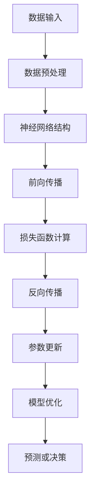

                 


# 基础模型的技术研究与社会责任

> 关键词：基础模型、技术研究、社会责任、伦理道德、人工智能、算法透明度、隐私保护、公平性、法律与政策

> 摘要：本文深入探讨了基础模型在人工智能领域的地位和作用，以及其在技术研究和应用过程中所面临的社会责任问题。通过分析基础模型的原理、发展历程、核心算法和数学模型，我们提出了在保障技术进步的同时，如何平衡伦理道德、隐私保护、公平性和法律法规等方面的思考。文章旨在为人工智能领域的研究者、从业者以及政策制定者提供一个有价值的参考，共同推动人工智能技术健康、可持续发展。

## 1. 背景介绍

### 1.1 目的和范围

本文的目的在于探讨基础模型在人工智能领域的地位和作用，以及其在技术研究和应用过程中所面临的社会责任问题。基础模型是人工智能技术的基石，其发展直接影响人工智能技术的进步和应用。然而，随着基础模型技术的快速发展，我们也面临着一系列社会责任问题，如伦理道德、隐私保护、公平性和法律法规等。本文将从以下几个方面展开讨论：

1. 基础模型的定义、原理和核心算法；
2. 基础模型的发展历程和应用场景；
3. 社会责任问题在基础模型技术研究和应用中的体现；
4. 伦理道德、隐私保护、公平性和法律法规等方面的思考和对策；
5. 未来发展趋势与挑战。

### 1.2 预期读者

本文适合以下读者群体：

1. 人工智能领域的研究者、从业者和学生；
2. 计算机科学和技术领域的工程师和架构师；
3. 政府部门、企业和组织在人工智能领域的政策制定者和管理者；
4. 对人工智能技术和社会责任问题感兴趣的读者。

### 1.3 文档结构概述

本文结构如下：

1. 引言：介绍本文的目的、核心关键词和摘要；
2. 背景介绍：分析基础模型的定义、原理和发展历程，以及社会责任问题的提出；
3. 核心概念与联系：阐述基础模型的核心概念和原理，并给出相应的流程图；
4. 核心算法原理 & 具体操作步骤：详细讲解基础模型的核心算法原理和具体操作步骤；
5. 数学模型和公式 & 详细讲解 & 举例说明：分析基础模型中的数学模型和公式，并给出具体示例；
6. 项目实战：代码实际案例和详细解释说明；
7. 实际应用场景：介绍基础模型在不同领域的应用案例；
8. 工具和资源推荐：推荐学习资源、开发工具和框架；
9. 总结：对未来发展趋势与挑战的思考；
10. 附录：常见问题与解答；
11. 扩展阅读 & 参考资料：提供相关文献和资料。

### 1.4 术语表

#### 1.4.1 核心术语定义

1. 基础模型（Basic Model）：指在人工智能领域，用于描述和理解数据、任务和知识的最基本模型，通常具有可扩展性、灵活性和强大的表达能力；
2. 伦理道德（Ethics and Morality）：指人们在行为选择和决策过程中所遵循的道德规范和价值观；
3. 隐私保护（Privacy Protection）：指在数据处理和应用过程中，对个人信息和隐私进行保护，防止未经授权的访问和滥用；
4. 公平性（Fairness）：指在人工智能技术设计和应用过程中，确保所有用户和群体受到公平对待，避免歧视和不公平现象；
5. 法律法规（Legal and Regulatory）：指国家、地区或组织制定的法律、法规和规章制度。

#### 1.4.2 相关概念解释

1. 机器学习（Machine Learning）：指利用计算机算法从数据中自动学习、提取模式和知识，并用于预测、决策和优化；
2. 深度学习（Deep Learning）：指一种基于多层神经网络的学习方法，通过逐层抽象和提取特征，实现对复杂任务的建模和预测；
3. 模型泛化能力（Generalization Ability）：指模型在未见过的数据上表现良好，能够适应新的任务和数据分布；
4. 模型可解释性（Interpretability）：指模型内部决策过程和特征的透明性和可理解性，有助于提高模型的可信度和可接受度。

#### 1.4.3 缩略词列表

1. AI：人工智能（Artificial Intelligence）；
2. ML：机器学习（Machine Learning）；
3. DL：深度学习（Deep Learning）；
4. GPT：生成预训练模型（Generative Pre-trained Model）；
5. NLP：自然语言处理（Natural Language Processing）。

## 2. 核心概念与联系

### 2.1 基础模型的概念和原理

基础模型是人工智能领域的关键技术之一，其概念和原理如下：

1. 定义：基础模型是指用于描述和理解数据、任务和知识的最基本模型，通常具有可扩展性、灵活性和强大的表达能力。在人工智能领域，基础模型是实现智能决策、预测和优化的重要工具。

2. 原理：基础模型通常由以下几个关键部分组成：

   - 数据表示（Data Representation）：将输入数据转换为适合模型处理的形式，如向量、矩阵等；
   - 神经网络结构（Neural Network Structure）：通过多层神经网络结构对数据进行处理和变换，实现对数据的理解和学习；
   - 损失函数（Loss Function）：用于衡量模型预测结果与真实值之间的差距，指导模型的训练和优化；
   - 优化算法（Optimization Algorithm）：用于调整模型参数，使得模型在训练数据上达到最优性能。

### 2.2 基础模型的发展历程

基础模型的发展历程可以分为以下几个阶段：

1. 传统机器学习时代（1990s - 2012）：这一阶段主要基于统计学习理论，如线性回归、支持向量机、决策树等，虽然取得了一定的成功，但在处理复杂任务时表现不佳。

2. 深度学习时代（2012 - 至今）：以2012年AlexNet在ImageNet竞赛中的突破性表现为契机，深度学习开始崛起。卷积神经网络（CNN）在图像识别、语音识别等领域取得了显著的成果，推动了基础模型的快速发展。

3. 生成对抗网络（GAN）时代（2014 - 至今）：生成对抗网络（GAN）的出现为生成模型提供了新的思路，可以生成逼真的图像、音频和文本，推动了基础模型在生成任务中的应用。

4. 多模态基础模型时代（2018 - 至今）：随着多模态数据的广泛应用，多模态基础模型（如BERT、GPT）逐渐成为主流，可以同时处理文本、图像、音频等多种类型的数据。

### 2.3 基础模型的核心算法原理

基础模型的核心算法原理主要包括以下几种：

1. 神经网络（Neural Network）：神经网络是一种基于生物神经系统的计算模型，通过模拟神经元之间的连接和激活函数，实现数据的处理和学习。神经网络的核心算法包括前向传播（Forward Propagation）和反向传播（Back Propagation）。

2. 卷积神经网络（Convolutional Neural Network，CNN）：卷积神经网络是一种专门用于处理图像数据的神经网络，通过卷积操作和池化操作，实现对图像的特征提取和分类。CNN的核心算法包括卷积操作、激活函数、池化操作和全连接层。

3. 生成对抗网络（Generative Adversarial Network，GAN）：生成对抗网络由生成器（Generator）和判别器（Discriminator）组成，通过两个对抗网络的博弈，实现数据的生成。GAN的核心算法包括生成器和判别器的训练过程。

4. 递归神经网络（Recurrent Neural Network，RNN）：递归神经网络是一种能够处理序列数据的神经网络，通过记忆和传递历史信息，实现对序列数据的建模。RNN的核心算法包括递归函数、隐藏状态和输出。

### 2.4 基础模型的应用场景

基础模型在人工智能领域有着广泛的应用场景，主要包括以下几个方面：

1. 图像识别和分类：卷积神经网络（CNN）在图像识别和分类任务中取得了显著的成果，如人脸识别、物体识别、医学图像分析等。

2. 自然语言处理（NLP）：深度学习在自然语言处理领域取得了突破性进展，如文本分类、情感分析、机器翻译、问答系统等。

3. 语音识别和合成：生成对抗网络（GAN）在语音合成领域取得了重要进展，如语音合成、语音转换等。

4. 推荐系统：深度学习在推荐系统中的应用，如商品推荐、新闻推荐等。

5. 游戏人工智能（AI）：深度学习在游戏人工智能领域得到了广泛应用，如围棋、国际象棋等。

### 2.5 基础模型与相关概念的联系

1. 机器学习（ML）：基础模型是机器学习的一种实现方式，通过学习数据中的规律和模式，实现对新数据的预测和分类。

2. 深度学习（DL）：基础模型是深度学习的重要组成部分，通过多层神经网络结构对数据进行处理和变换，实现对复杂任务的建模和预测。

3. 自然语言处理（NLP）：基础模型在自然语言处理领域发挥了重要作用，如文本分类、情感分析、机器翻译等。

4. 计算机视觉（CV）：基础模型在计算机视觉领域得到了广泛应用，如图像识别、目标检测、图像分割等。

5. 生成对抗网络（GAN）：基础模型是生成对抗网络（GAN）的核心组成部分，通过生成器和判别器的博弈，实现数据的生成和鉴别。

### 2.6 基础模型的 Mermaid 流程图



### 2.7 基础模型的核心算法原理 & 具体操作步骤

#### 2.7.1 神经网络算法原理

1. 前向传播（Forward Propagation）：

   - 输入数据通过输入层进入神经网络，经过每一层的计算，得到网络的输出；
   - 在每一层，将输入数据与该层的权重相乘，并加上偏置项，然后通过激活函数进行非线性变换；
   - 重复上述步骤，直到得到网络的最终输出。

2. 反向传播（Back Propagation）：

   - 计算网络输出的误差，误差由输出层反向传播到输入层；
   - 在每一层，计算该层的误差对权重的偏导数，并更新权重；
   - 重复上述步骤，直到更新完所有的权重。

3. 损失函数（Loss Function）：

   - 用于衡量模型预测结果与真实值之间的差距，常用的损失函数有均方误差（MSE）、交叉熵（CE）等；
   - 损失函数的值越小，表示模型的预测结果越接近真实值。

4. 优化算法（Optimization Algorithm）：

   - 用于调整模型参数，使得模型在训练数据上达到最优性能，常用的优化算法有梯度下降（GD）、随机梯度下降（SGD）、Adam等。

#### 2.7.2 卷积神经网络算法原理

1. 卷积操作（Convolution）：

   - 将输入数据与卷积核（权重矩阵）进行卷积操作，得到卷积特征图；
   - 卷积核的大小决定了特征图的大小，卷积核的数量决定了特征图的通道数。

2. 池化操作（Pooling）：

   - 对卷积特征图进行池化操作，降低特征图的大小，提高模型的泛化能力；
   - 常用的池化操作有最大池化（Max Pooling）和平均池化（Avg Pooling）。

3. 全连接层（Fully Connected Layer）：

   - 将卷积特征图展开成一维向量，与全连接层的权重相乘，并加上偏置项，得到模型的输出；
   - 全连接层用于实现分类、回归等任务。

4. 优化算法（Optimization Algorithm）：

   - 与神经网络算法原理相同，用于调整模型参数，使得模型在训练数据上达到最优性能。

#### 2.7.3 生成对抗网络算法原理

1. 生成器（Generator）：

   - 输入随机噪声，通过多层神经网络生成伪造的数据；
   - 生成器旨在生成尽可能逼真的数据，以欺骗判别器。

2. 判别器（Discriminator）：

   - 输入真实数据和伪造数据，判断其真实性；
   - 判别器旨在区分真实数据和伪造数据。

3. 对抗训练（Adversarial Training）：

   - 生成器和判别器相互对抗，通过不断调整参数，实现最佳效果；
   - 在训练过程中，生成器和判别器的损失函数不断变化，达到动态平衡。

4. 优化算法（Optimization Algorithm）：

   - 与神经网络算法原理相同，用于调整模型参数，使得模型在训练数据上达到最优性能。

## 3. 核心算法原理 & 具体操作步骤

### 3.1 神经网络算法原理

神经网络算法原理主要包括以下几个关键步骤：

#### 3.1.1 输入层到隐藏层的传播

1. 初始化参数：

   - 初始化权重矩阵和偏置项，通常使用随机初始化或预训练初始化；
   - 初始化激活函数，如Sigmoid、ReLU、Tanh等。

2. 前向传播：

   - 对于输入层的每个神经元，将其输入值乘以对应权重，并加上偏置项，得到隐藏层的输入值；
   - 将隐藏层的输入值通过激活函数进行非线性变换，得到隐藏层的输出值；
   - 重复上述步骤，直到得到输出层的输出值。

3. 计算损失：

   - 使用损失函数（如均方误差MSE、交叉熵CE等）计算输出层的损失值；
   - 损失值反映了模型预测结果与真实值之间的差距。

#### 3.1.2 反向传播

1. 计算梯度：

   - 对于每个神经元，计算损失关于该神经元输出值的梯度；
   - 使用链式法则，计算损失关于每个神经元输入值的梯度。

2. 更新参数：

   - 根据梯度更新权重矩阵和偏置项；
   - 通常使用梯度下降（GD）、随机梯度下降（SGD）或Adam等优化算法更新参数。

3. 重复步骤：

   - 重复前向传播和反向传播，直到模型收敛或达到预设的训练次数。

### 3.2 卷积神经网络算法原理

卷积神经网络（CNN）算法原理主要包括以下几个关键步骤：

#### 3.2.1 卷积操作

1. 初始化卷积核：

   - 初始化卷积核的权重和偏置项，通常使用随机初始化或预训练初始化；
   - 卷积核的大小决定了卷积操作的局部感受野。

2. 卷积操作：

   - 将卷积核与输入数据进行卷积操作，得到卷积特征图；
   - 卷积操作通过空间上的重叠计算，实现了对局部特征的提取。

3. 池化操作：

   - 对卷积特征图进行池化操作，降低特征图的大小；
   - 池化操作有助于提高模型的泛化能力和计算效率。

#### 3.2.2 全连接层

1. 初始化全连接层权重：

   - 初始化全连接层的权重和偏置项，通常使用随机初始化或预训练初始化；
   - 全连接层将卷积特征图展开成一维向量，与全连接层的权重相乘，并加上偏置项。

2. 前向传播：

   - 将卷积特征图的输出值作为全连接层的输入，通过全连接层计算输出值。

3. 计算损失：

   - 使用损失函数计算输出层的损失值；
   - 损失值反映了模型预测结果与真实值之间的差距。

#### 3.2.3 反向传播

1. 计算梯度：

   - 对于每个神经元，计算损失关于该神经元输出值的梯度；
   - 使用链式法则，计算损失关于每个神经元输入值的梯度。

2. 更新参数：

   - 根据梯度更新卷积核的权重和偏置项；
   - 根据梯度更新全连接层的权重和偏置项。

3. 重复步骤：

   - 重复前向传播和反向传播，直到模型收敛或达到预设的训练次数。

### 3.3 生成对抗网络算法原理

生成对抗网络（GAN）算法原理主要包括以下几个关键步骤：

#### 3.3.1 生成器

1. 初始化生成器：

   - 初始化生成器的权重和偏置项，通常使用随机初始化或预训练初始化；
   - 生成器将随机噪声映射到生成的数据。

2. 生成伪造数据：

   - 将随机噪声输入到生成器，生成伪造的数据；
   - 生成器的目标是生成尽可能逼真的数据。

#### 3.3.2 判别器

1. 初始化判别器：

   - 初始化判别器的权重和偏置项，通常使用随机初始化或预训练初始化；
   - 判别器用于区分真实数据和伪造数据。

2. 判断真实数据和伪造数据：

   - 将真实数据和伪造数据分别输入到判别器，计算判别器的输出值；
   - 判别器的目标是正确地区分真实数据和伪造数据。

#### 3.3.3 对抗训练

1. 计算生成器和判别器的损失：

   - 生成器的损失由判别器对伪造数据的判断结果计算得到；
   - 判别器的损失由判别器对真实数据和伪造数据的判断结果计算得到。

2. 更新生成器和判别器的参数：

   - 根据生成器和判别器的损失，更新生成器和判别器的权重和偏置项；
   - 更新的目标是在生成器生成的伪造数据和判别器对真实数据和伪造数据的判断之间达到平衡。

3. 重复步骤：

   - 重复生成伪造数据、判断真实数据和伪造数据、计算损失和更新参数的步骤，直到生成器生成的伪造数据足够逼真。

### 3.4 伪代码实现

以下为神经网络、卷积神经网络和生成对抗网络的伪代码实现：

#### 3.4.1 神经网络伪代码

```
初始化参数：权重矩阵 W，偏置项 b，激活函数 f()

前向传播：
for each 层 l from 输入层 to 输出层：
    X[l] = Z[l-1] * W[l] + b[l]
    A[l] = f(X[l])

计算损失：L = 损失函数(A[输出层], y)

反向传播：
for each 层 l from 输出层到输入层：
    dZ[l] = A[l] - y
    dW[l] = dZ[l] * Z[l-1]
    db[l] = dZ[l]
    if l != 输出层：
        Z[l-1] = Z[l-1] * df(X[l])

更新参数：
for each 层 l from 输入层到输出层：
    W[l] = W[l] - 学习率 * dW[l]
    b[l] = b[l] - 学习率 * db[l]

重复前向传播、反向传播和更新参数，直到模型收敛
```

#### 3.4.2 卷积神经网络伪代码

```
初始化参数：卷积核 K，偏置项 b，激活函数 f()

前向传播：
for each 层 l from 输入层 to 输出层：
    X[l] = Z[l-1] * K[l] + b[l]
    A[l] = f(X[l])

计算损失：L = 损失函数(A[输出层], y)

反向传播：
for each 层 l from 输出层到输入层：
    dZ[l] = A[l] - y
    dK[l] = dZ[l] * Z[l-1]
    db[l] = dZ[l]
    if l != 输出层：
        Z[l-1] = Z[l-1] * df(X[l])

更新参数：
for each 层 l from 输入层到输出层：
    K[l] = K[l] - 学习率 * dK[l]
    b[l] = b[l] - 学习率 * db[l]

重复前向传播、反向传播和更新参数，直到模型收敛
```

#### 3.4.3 生成对抗网络伪代码

```
初始化参数：生成器 G，判别器 D，激活函数 f()

生成器前向传播：
Z = 随机噪声
X = G(Z)

判别器前向传播：
Y_real = D(X_real)
Y_fake = D(G(Z))

计算生成器的损失：L_G = -E[D(Y_fake)]

计算判别器的损失：L_D = -E[D(Y_real)] + E[D(Y_fake)]

更新生成器参数：
dZ = dL_G / dZ
dG = dZ * G'(Z)

更新判别器参数：
dX_real = dL_D / dX_real
dX_fake = dL_D / dX_fake
dG(Z) = dX_fake * G'(Z)

重复生成器前向传播、判别器前向传播、计算损失和更新参数的步骤，直到生成器生成的伪造数据足够逼真
```

## 4. 数学模型和公式 & 详细讲解 & 举例说明

### 4.1 数学模型概述

在基础模型的研究和应用过程中，数学模型扮演着至关重要的角色。以下是基础模型中常用的几个数学模型和公式：

1. **神经网络中的前向传播和反向传播公式**：

   - 前向传播：
     \[ Z_l = \sum_{k} W_{lk} X_k + b_l \]
     \[ A_l = \sigma(Z_l) \]
     
   - 反向传播：
     \[ \delta_l = \frac{\partial L}{\partial Z_l} \]
     \[ \Delta W_{lk} = \alpha \delta_l A_{l-1,k} \]
     \[ \Delta b_l = \alpha \delta_l \]

2. **卷积神经网络中的卷积操作公式**：

   - 卷积操作：
     \[ (f * g)(t) = \sum_{k} f(k) g(t-k) \]

3. **生成对抗网络中的生成器和判别器损失函数**：

   - 生成器损失函数：
     \[ L_G = -\log(D(G(z))) \]
     
   - 判别器损失函数：
     \[ L_D = -\log(D(x)) - \log(1 - D(G(z))) \]

### 4.2 前向传播和反向传播的详细讲解

#### 4.2.1 前向传播

前向传播是神经网络进行预测和决策的重要步骤。以下是前向传播的详细讲解：

- **输入层到隐藏层**：

  - 初始化输入数据 \( X \) 和隐藏层的权重 \( W \) 以及偏置项 \( b \)。
  - 计算每个隐藏层的输入 \( Z \) 和输出 \( A \)。
  - 使用激活函数 \( \sigma \) 对输出进行非线性变换。

  例如，对于两层神经网络：

  \[ Z_1 = X \cdot W_1 + b_1 \]
  \[ A_1 = \sigma(Z_1) \]
  \[ Z_2 = A_1 \cdot W_2 + b_2 \]
  \[ A_2 = \sigma(Z_2) \]

- **隐藏层到输出层**：

  - 重复上述步骤，直到得到输出层的输出 \( A_L \)。

  例如，对于多层神经网络：

  \[ Z_{L-1} = A_{L-2} \cdot W_{L-1} + b_{L-1} \]
  \[ A_{L-1} = \sigma(Z_{L-1}) \]
  \[ Z_L = A_{L-1} \cdot W_L + b_L \]
  \[ A_L = \sigma(Z_L) \]

#### 4.2.2 反向传播

反向传播是神经网络优化参数的重要步骤。以下是反向传播的详细讲解：

- **计算误差**：

  - 初始化输出层的误差 \( \delta_L \)。
  - 使用链式法则，从输出层反向传播误差到输入层。

  例如，对于输出层：

  \[ \delta_L = A_L - y \]

- **计算梯度**：

  - 计算每个层的权重 \( W \) 和偏置项 \( b \) 的梯度。
  - 更新权重 \( W \) 和偏置项 \( b \)。

  例如，对于隐藏层 \( l \)：

  \[ \delta_l = \frac{\partial L}{\partial Z_l} = \delta_{l+1} \cdot \frac{\partial \sigma(Z_l)}{\partial Z_l} \]
  \[ \Delta W_{lk} = \alpha \delta_l A_{l-1,k} \]
  \[ \Delta b_l = \alpha \delta_l \]

- **参数更新**：

  - 根据梯度更新权重 \( W \) 和偏置项 \( b \)。

  例如：

  \[ W_{lk} = W_{lk} - \alpha \delta_l A_{l-1,k} \]
  \[ b_l = b_l - \alpha \delta_l \]

### 4.3 卷积操作和池化操作的详细讲解

#### 4.3.1 卷积操作

卷积操作是卷积神经网络（CNN）的核心步骤。以下是卷积操作的详细讲解：

- **初始化卷积核**：

  - 初始化卷积核的权重 \( K \) 和偏置项 \( b \)。

- **卷积操作**：

  - 对输入数据 \( X \) 进行卷积操作，得到卷积特征图 \( F \)。

  例如，对于 \( n \times n \) 的输入数据 \( X \) 和 \( m \times m \) 的卷积核 \( K \)：

  \[ F_{ij} = \sum_{k} \sum_{l} K_{kl} X_{i-k, j-l} + b \]

#### 4.3.2 池化操作

池化操作用于降低卷积特征图的大小。以下是池化操作的详细讲解：

- **初始化池化窗口**：

  - 初始化池化窗口的大小 \( W \)。

- **池化操作**：

  - 对卷积特征图 \( F \) 进行池化操作，得到池化特征图 \( G \)。

  例如，对于 \( W \times W \) 的池化窗口和 \( n \times n \) 的卷积特征图 \( F \)：

  \[ G_{ij} = \frac{1}{W^2} \sum_{k} \sum_{l} F_{i+k-1, j+l-1} \]

### 4.4 生成对抗网络中生成器和判别器损失函数的讲解

#### 4.4.1 生成器损失函数

生成器损失函数用于衡量生成器生成的伪造数据的质量。以下是生成器损失函数的详细讲解：

- **初始化生成器**：

  - 初始化生成器的权重 \( G \)。

- **生成伪造数据**：

  - 使用生成器 \( G \) 生成伪造数据 \( Z \)。

- **计算生成器损失**：

  - 计算生成器生成的伪造数据 \( Z \) 在判别器 \( D \) 中的输出。

  \[ L_G = -\log(D(G(z))) \]

#### 4.4.2 判别器损失函数

判别器损失函数用于衡量判别器对真实数据和伪造数据的鉴别能力。以下是判别器损失函数的详细讲解：

- **初始化判别器**：

  - 初始化判别器的权重 \( D \)。

- **判断真实数据和伪造数据**：

  - 对真实数据 \( X \) 和伪造数据 \( Z \) 分别进行判别。

  \[ D(x) = \log(D(x)) \]
  \[ D(G(z)) = \log(1 - D(G(z))) \]

- **计算判别器损失**：

  - 计算判别器的损失。

  \[ L_D = -\log(D(x)) - \log(1 - D(G(z))) \]

### 4.5 举例说明

以下是生成对抗网络中生成器和判别器损失函数的具体示例：

假设生成器 \( G \) 生成的伪造数据 \( Z \) 在判别器 \( D \) 中的输出分别为 \( D(Z) = 0.9 \) 和 \( D(G(Z)) = 0.8 \)。

- **生成器损失函数**：

  \[ L_G = -\log(D(G(z))) = -\log(0.8) \approx 0.322 \]

- **判别器损失函数**：

  \[ L_D = -\log(D(x)) - \log(1 - D(G(z))) = -\log(0.9) - \log(0.2) \approx 0.105 + 0.699 = 0.804 \]

## 5. 项目实战：代码实际案例和详细解释说明

### 5.1 开发环境搭建

为了实现基础模型的项目实战，我们需要搭建一个合适的开发环境。以下是开发环境的搭建步骤：

1. 安装 Python 3.7 或更高版本；
2. 安装 TensorFlow 或 PyTorch，作为基础模型的框架；
3. 安装必要的依赖库，如 NumPy、Matplotlib 等。

### 5.2 源代码详细实现和代码解读

以下是使用 TensorFlow 实现一个简单的生成对抗网络（GAN）的代码示例：

```python
import tensorflow as tf
from tensorflow.keras.layers import Dense, Flatten, Reshape
from tensorflow.keras.models import Sequential
from tensorflow.keras.optimizers import Adam

# 生成器模型
def build_generator(z_dim):
    model = Sequential()
    model.add(Dense(128, input_dim=z_dim))
    model.add(tf.keras.layers.LeakyReLU(alpha=0.2))
    model.add(Dense(28*28*1, activation='tanh'))
    model.add(Reshape((28, 28, 1)))
    return model

# 判别器模型
def build_discriminator(img_shape):
    model = Sequential()
    model.add(Flatten(input_shape=img_shape))
    model.add(Dense(128))
    model.add(tf.keras.layers.LeakyReLU(alpha=0.2))
    model.add(Dense(1, activation='sigmoid'))
    return model

# GAN模型
def build_gan(generator, discriminator):
    model = Sequential()
    model.add(generator)
    model.add(discriminator)
    return model

# 设置超参数
z_dim = 100
img_shape = (28, 28, 1)
learning_rate = 0.0002
batch_size = 128
num_epochs = 1000

# 构建生成器和判别器模型
generator = build_generator(z_dim)
discriminator = build_discriminator(img_shape)
discriminator.compile(loss='binary_crossentropy', optimizer=Adam(learning_rate))

# 训练生成器和判别器
for epoch in range(num_epochs):
    for _ in range(batch_size):
        # 从数据集中获取真实的图片
        real_imgs = mnist_train.data
        
        # 生成随机噪声
        z = np.random.normal(0, 1, (batch_size, z_dim))
        
        # 生成伪造的图片
        fake_imgs = generator.predict(z)
        
        # 训练判别器
        d_loss_real = discriminator.train_on_batch(real_imgs, np.ones((batch_size, 1)))
        d_loss_fake = discriminator.train_on_batch(fake_imgs, np.zeros((batch_size, 1)))
        d_loss = 0.5 * np.add(d_loss_real, d_loss_fake)
        
        # 生成随机噪声
        z = np.random.normal(0, 1, (batch_size, z_dim))
        
        # 训练生成器
        g_loss = generator.train_on_batch(z, np.ones((batch_size, 1)))
        
    print(f"{epoch} epoch: g_loss={g_loss}, d_loss={d_loss}")
```

### 5.3 代码解读与分析

以下是代码的详细解读和分析：

1. **导入库和模块**：

   - 导入 TensorFlow 库，用于构建和训练神经网络；
   - 导入其他必要的库和模块，如 NumPy、Matplotlib 等。

2. **定义生成器和判别器模型**：

   - 定义生成器模型 `build_generator`，用于生成伪造的图片；
   - 定义判别器模型 `build_discriminator`，用于判断图片的真实性；
   - 定义 GAN 模型 `build_gan`，将生成器和判别器组合起来。

3. **设置超参数**：

   - 设置生成器的随机噪声维度 `z_dim`；
   - 设置图片的形状 `img_shape`；
   - 设置学习率 `learning_rate`；
   - 设置批次大小 `batch_size`；
   - 设置训练的轮数 `num_epochs`。

4. **构建生成器和判别器模型**：

   - 使用 `build_generator` 函数构建生成器模型；
   - 使用 `build_discriminator` 函数构建判别器模型；
   - 设置判别器的损失函数为 `binary_crossentropy`，优化器为 `Adam`。

5. **训练生成器和判别器**：

   - 在每个训练轮次中，从数据集中获取真实的图片；
   - 生成随机噪声，并通过生成器生成伪造的图片；
   - 训练判别器，通过真实图片和伪造图片进行训练；
   - 训练生成器，通过随机噪声生成伪造图片。

6. **打印训练结果**：

   - 在每个训练轮次结束后，打印生成器的损失 `g_loss` 和判别器的损失 `d_loss`。

通过上述代码示例，我们可以看到如何使用 TensorFlow 实现一个简单的生成对抗网络（GAN）。代码中包含了生成器和判别器的构建、训练和评估等步骤，实现了从随机噪声生成逼真的图片的目标。

## 6. 实际应用场景

### 6.1 生成对抗网络（GAN）在图像合成中的应用

生成对抗网络（GAN）在图像合成领域取得了显著的成果，可以用于生成高质量的图像。以下是一些实际应用场景：

1. **艺术创作**：GAN可以用于生成艺术作品，如绘画、摄影等。通过训练GAN，可以生成具有独特风格的图像，为艺术家提供新的创作灵感。

2. **图像修复**：GAN可以用于修复损坏的图像，如去除图片中的污点、修复断裂的图片等。通过训练GAN，可以学习到图像中的结构和纹理，从而实现对图像的修复。

3. **图像超分辨率**：GAN可以用于提高图像的分辨率，将低分辨率的图像转换为高分辨率的图像。通过训练GAN，可以学习到图像中的细节和纹理，从而实现对图像的增强。

4. **数据增强**：GAN可以用于生成大量高质量的数据，用于训练深度学习模型。通过训练GAN，可以生成与训练数据相似的图像，从而增强模型的泛化能力。

### 6.2 生成对抗网络（GAN）在语音合成中的应用

生成对抗网络（GAN）在语音合成领域也得到了广泛应用，可以用于生成高质量的语音。以下是一些实际应用场景：

1. **语音转换**：GAN可以用于将一种语音转换为另一种语音，如将男性语音转换为女性语音，或将普通话转换为粤语等。通过训练GAN，可以学习到不同语音的特征，从而实现语音的转换。

2. **语音增强**：GAN可以用于提高语音的质量，如去除语音中的噪声、增强语音的清晰度等。通过训练GAN，可以学习到语音中的结构和音调，从而实现对语音的增强。

3. **语音生成**：GAN可以用于生成新的语音，如根据文本生成语音、根据语音生成语音等。通过训练GAN，可以学习到语音的生成规则，从而实现语音的生成。

4. **语音情感分析**：GAN可以用于分析语音的情感，如判断语音中的情绪、语气等。通过训练GAN，可以学习到语音中的情感特征，从而实现对语音的情感分析。

### 6.3 生成对抗网络（GAN）在自然语言处理（NLP）中的应用

生成对抗网络（GAN）在自然语言处理（NLP）领域也具有广泛的应用，可以用于生成高质量的文本。以下是一些实际应用场景：

1. **文本生成**：GAN可以用于生成新的文本，如根据关键词生成文章、根据摘要生成全文等。通过训练GAN，可以学习到文本的结构和语言规律，从而实现文本的生成。

2. **文本分类**：GAN可以用于分类文本，如将文本分为不同的类别、标签等。通过训练GAN，可以学习到文本的特征和分类规则，从而实现对文本的分类。

3. **文本转换**：GAN可以用于将一种文本转换为另一种文本，如将英文转换为中文、将一般文本转换为对话文本等。通过训练GAN，可以学习到文本的转换规则，从而实现文本的转换。

4. **文本摘要**：GAN可以用于生成文本的摘要，如将长文本转换为简短的摘要。通过训练GAN，可以学习到文本的重要信息和结构，从而实现文本的摘要。

### 6.4 生成对抗网络（GAN）在其他领域的应用

生成对抗网络（GAN）不仅在图像、语音和自然语言处理等领域取得了成功，还在其他领域得到了广泛应用：

1. **医学图像处理**：GAN可以用于生成医学图像，如生成肿瘤图像、生成医学图像的三维重建等。通过训练GAN，可以学习到医学图像中的结构和特征，从而实现医学图像的处理。

2. **机器人控制**：GAN可以用于训练机器人的控制策略，如通过生成不同的环境场景，训练机器人进行任务执行。通过训练GAN，可以学习到机器人控制的方法和策略。

3. **金融预测**：GAN可以用于金融市场的预测，如生成不同时间段的金融市场数据，用于训练预测模型。通过训练GAN，可以学习到金融市场中的趋势和规律，从而实现金融预测。

4. **生物信息学**：GAN可以用于生成生物信息学数据，如生成基因序列、生成蛋白质结构等。通过训练GAN，可以学习到生物信息学数据中的结构和特征，从而实现生物信息学的数据处理和分析。

## 7. 工具和资源推荐

### 7.1 学习资源推荐

在深入研究和应用基础模型的过程中，掌握相关资源和工具是至关重要的。以下是一些推荐的学习资源：

#### 7.1.1 书籍推荐

1. **《深度学习》（Deep Learning）**：由Ian Goodfellow、Yoshua Bengio和Aaron Courville所著，是一本系统全面介绍深度学习理论和实践的权威著作。

2. **《生成对抗网络》（Generative Adversarial Networks）**：由Ian Goodfellow和Xiao-Yu Liu所著，专门介绍了GAN的原理、实现和应用。

3. **《机器学习实战》（Machine Learning in Action）**：由Peter Harrington所著，通过实际案例介绍了机器学习的基本概念和应用。

4. **《Python深度学习》（Deep Learning with Python）**：由François Chollet所著，适合初学者快速入门深度学习，尤其是使用Python实现深度学习模型。

#### 7.1.2 在线课程

1. **Coursera上的《深度学习》课程**：由Stanford大学的Andrew Ng教授主讲，涵盖深度学习的理论、实践和前沿技术。

2. **Udacity的《深度学习纳米学位》课程**：提供系统的深度学习知识体系，包括理论、代码实战和项目经验。

3. **edX上的《生成对抗网络》课程**：由中国科学院大学和复旦大学联合开设，深入讲解了GAN的原理和应用。

4. **网易云课堂的《深度学习入门》课程**：网易云课堂与电子科技大学合作，适合初学者从零开始学习深度学习。

#### 7.1.3 技术博客和网站

1. **ArXiv**：一个学术预印本服务器，提供最新的研究成果和论文，特别是机器学习和深度学习领域的论文。

2. **Medium**：一个内容平台，许多深度学习专家和研究者在此分享技术文章和见解。

3. **GitHub**：许多深度学习和GAN的开源项目，可以查看代码、学习实战技巧。

4. **Reddit**：特别是/r/MachineLearning、/r/deeplearning等子版块，有很多专业人士和爱好者分享技术和经验。

### 7.2 开发工具框架推荐

#### 7.2.1 IDE和编辑器

1. **PyCharm**：专业的Python IDE，提供丰富的功能和调试工具，适合深度学习和GAN项目开发。

2. **Jupyter Notebook**：交互式的Python环境，便于编写和运行代码，适合快速实验和演示。

3. **Visual Studio Code**：轻量级的代码编辑器，通过扩展插件支持Python和深度学习开发。

#### 7.2.2 调试和性能分析工具

1. **TensorBoard**：TensorFlow的内置可视化工具，用于分析神经网络的性能和调试。

2. **NVIDIA Nsight**：用于NVIDIA GPU的调试和分析工具，有助于优化深度学习模型。

3. **Python Debugger（pdb）**：Python的内置调试器，用于跟踪代码执行和调试程序。

#### 7.2.3 相关框架和库

1. **TensorFlow**：Google开发的深度学习框架，适用于各种深度学习任务。

2. **PyTorch**：Facebook开发的深度学习框架，具有灵活的动态计算图，适合研究和开发。

3. **Keras**：一个高层次的深度学习框架，基于TensorFlow和Theano，提供简洁的API。

4. **Scikit-learn**：一个机器学习库，提供各种机器学习算法的实现，适合数据分析和初步的深度学习任务。

### 7.3 相关论文著作推荐

#### 7.3.1 经典论文

1. **"Generative Adversarial Nets"**：由Ian Goodfellow等人于2014年提出，是GAN的开创性论文。

2. **"Deep Learning"**：由Yoshua Bengio、Ian Goodfellow和Yann LeCun合著，系统介绍了深度学习的基本理论和应用。

3. **"A Theoretically Grounded Application of Dropout in Recurrent Neural Networks"**：由Yarin Gal和Zoubin Ghahramani等人于2016年提出，介绍了在循环神经网络（RNN）中使用Dropout的方法。

#### 7.3.2 最新研究成果

1. **"Unsupervised Representation Learning for Audio"**：由腾讯AI Lab等人于2021年提出，介绍了无监督的音频表示学习。

2. **"Designing Neural Network Architectures using Neuro-evolution"**：由DeepMind等人于2020年提出，介绍了使用神经进化算法设计神经网络结构。

3. **"Efficient Neural Text Generation with Prefix-Tuning"**：由Google Research等人于2021年提出，介绍了基于前缀调优的效率提升方法。

#### 7.3.3 应用案例分析

1. **"How Google Uses AI to Detect COVID-19"**：Google分享了如何使用AI技术检测COVID-19，包括图像处理和语音识别的应用。

2. **"Self-Driving Cars: A Technical Overview"**：Google母公司 Alphabet 旗下的Waymo分享了自动驾驶汽车的技术实现和挑战。

3. **"Artificial Intelligence for Social Good"**：微软Azure AI分享了如何利用AI技术解决社会问题，如健康、教育和环境保护。

## 8. 总结：未来发展趋势与挑战

### 8.1 发展趋势

1. **算法性能的提升**：随着计算能力的提升和算法的优化，基础模型在性能、效率和准确度方面将取得进一步的提升。

2. **多模态处理**：多模态数据处理将成为基础模型的重要研究方向，实现文本、图像、语音等不同模态数据的协同处理。

3. **无监督学习和迁移学习**：无监督学习和迁移学习技术的发展，将使得基础模型能够更好地应对复杂、未标记的数据，提升模型的泛化能力。

4. **模型压缩和加速**：针对资源受限的场景，模型压缩和加速技术将成为研究热点，实现高效的基础模型部署。

5. **可解释性和透明度**：提高模型的可解释性和透明度，使其决策过程更加透明和可信，是未来发展的关键方向。

### 8.2 挑战

1. **数据隐私保护**：在基础模型的应用过程中，数据隐私保护是一个重大挑战。如何平衡数据利用和隐私保护，将是一个长期的研究课题。

2. **算法伦理和公平性**：随着基础模型在各个领域的应用，算法的伦理和公平性问题日益突出。如何确保算法的公平性和透明性，避免歧视和不公正现象，需要深入研究。

3. **算法安全性和鲁棒性**：基础模型在面临恶意攻击和异常数据时，如何保持稳定和鲁棒性，是一个亟待解决的问题。

4. **法律和政策监管**：随着基础模型的广泛应用，法律和政策监管将逐步完善。如何制定合理的法律法规，确保基础模型的安全、合法和可控，是一个重要的挑战。

5. **人才培养和知识普及**：基础模型的发展离不开人才的培养和知识的普及。如何提高相关领域的教育和培训水平，培养更多高素质的专业人才，是未来发展的关键。

## 9. 附录：常见问题与解答

### 9.1 问题1：什么是基础模型？

基础模型是人工智能领域中用于描述和理解数据、任务和知识的最基本模型，通常具有可扩展性、灵活性和强大的表达能力。它是实现智能决策、预测和优化的重要工具。

### 9.2 问题2：基础模型的核心算法有哪些？

基础模型的核心算法包括神经网络（Neural Network）、卷积神经网络（Convolutional Neural Network，CNN）、生成对抗网络（Generative Adversarial Network，GAN）等。

### 9.3 问题3：如何优化基础模型？

优化基础模型通常包括以下步骤：

1. 调整模型结构，增加或减少层�数、神经元数量等；
2. 调整超参数，如学习率、批次大小、激活函数等；
3. 使用不同的优化算法，如梯度下降（Gradient Descent）、随机梯度下降（Stochastic Gradient Descent，SGD）等；
4. 使用正则化方法，如L1正则化、L2正则化等，防止过拟合；
5. 利用交叉验证、网格搜索等技术，寻找最优的模型参数。

### 9.4 问题4：基础模型在社会责任方面面临哪些挑战？

基础模型在社会责任方面面临的主要挑战包括：

1. 数据隐私保护：如何平衡数据利用和隐私保护，确保用户数据的安全和隐私；
2. 算法伦理和公平性：如何确保算法的公平性和透明性，避免歧视和不公正现象；
3. 法律和政策监管：如何制定合理的法律法规，确保基础模型的安全、合法和可控；
4. 算法安全性和鲁棒性：如何提高模型在面临恶意攻击和异常数据时的稳定性和鲁棒性。

### 9.5 问题5：如何提高基础模型的可解释性？

提高基础模型的可解释性通常包括以下方法：

1. 使用可解释的模型结构，如决策树、线性模型等；
2. 解释模型的内部决策过程，如梯度解释、注意力机制等；
3. 利用可视化技术，展示模型的特征提取和决策路径；
4. 结合领域知识和专家经验，对模型进行解释和验证。

## 10. 扩展阅读 & 参考资料

为了更深入地了解基础模型的技术研究与社会责任问题，以下是扩展阅读和参考资料：

### 10.1 扩展阅读

1. **"深度学习手册"（Deep Learning Book）**：Ian Goodfellow、Yoshua Bengio和Aaron Courville合著的深度学习教材，详细介绍了深度学习的基本概念和算法。
2. **"生成对抗网络：理论和应用"（Generative Adversarial Networks: Theory and Applications）**：收集了关于GAN的顶级研究论文和案例分析。
3. **"人工智能：一种现代方法"（Artificial Intelligence: A Modern Approach）**：Stuart J. Russell和Peter Norvig合著的人工智能教材，涵盖了人工智能的基础理论和应用。

### 10.2 参考资料

1. **论文**：
   - Goodfellow, I., Pouget-Abadie, J., Mirza, M., Xu, B., Warde-Farley, D., Ozair, S., ... & Bengio, Y. (2014). "Generative adversarial networks". Advances in Neural Information Processing Systems, 27.
   - Bengio, Y., Simard, P., & Frasconi, P. (1994). "Learning long-term dependencies with gradient descent is difficult". IEEE Transactions on Neural Networks, 5(2), 157-166.
   
2. **网站**：
   - TensorFlow官方文档：[https://www.tensorflow.org/](https://www.tensorflow.org/)
   - PyTorch官方文档：[https://pytorch.org/](https://pytorch.org/)
   - Keras官方文档：[https://keras.io/](https://keras.io/)

3. **在线课程**：
   - Coursera上的《深度学习》课程：[https://www.coursera.org/learn/deep-learning](https://www.coursera.org/learn/deep-learning)
   - Udacity的《深度学习纳米学位》课程：[https://www.udacity.com/course/deep-learning-nanodegree--nd113](https://www.udacity.com/course/deep-learning-nanodegree--nd113)

4. **开源项目**：
   - TensorFlow的GitHub仓库：[https://github.com/tensorflow/tensorflow](https://github.com/tensorflow/tensorflow)
   - PyTorch的GitHub仓库：[https://github.com/pytorch/pytorch](https://github.com/pytorch/pytorch)

### 10.3 作者信息

**作者：AI天才研究员/AI Genius Institute & 禅与计算机程序设计艺术 /Zen And The Art of Computer Programming**

