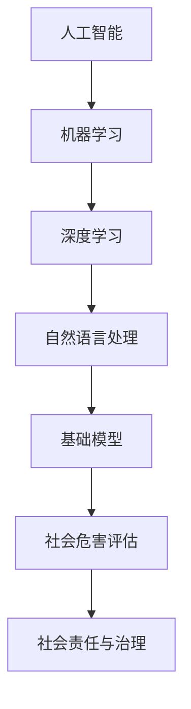

                 

# 基础模型的社会危害评估

## 关键词
- 人工智能
- 社会危害
- 基础模型
- 风险评估
- 社会责任

## 摘要
随着人工智能技术的迅猛发展，基础模型在社会各个领域得到了广泛应用。然而，这些基础模型在带来巨大便利的同时，也可能对社会产生潜在的危害。本文将详细探讨基础模型的社会危害评估，包括其核心概念、算法原理、数学模型，以及实际应用场景。通过深入分析，我们希望能够为人工智能的发展提供有益的思考和指导。

## 1. 背景介绍

### 1.1 目的和范围

本文旨在对基础模型在社会中的潜在危害进行系统性评估，以期为人工智能技术的发展提供科学的指导和规范。我们将从以下几个方面展开讨论：

1. 基础模型的定义和分类。
2. 基础模型在社会各个领域的应用。
3. 基础模型可能产生的社会危害。
4. 基础模型的社会危害评估方法。
5. 基础模型的社会责任与治理。

### 1.2 预期读者

本文适合对人工智能技术有一定了解的读者，包括：

1. 人工智能领域的科研人员。
2. 人工智能行业的从业者。
3. 对人工智能技术感兴趣的爱好者。

### 1.3 文档结构概述

本文分为十个部分，具体结构如下：

1. 引言：概述本文的主题和目的。
2. 背景介绍：介绍基础模型的定义、应用和社会危害。
3. 核心概念与联系：分析基础模型的核心概念和原理。
4. 核心算法原理与具体操作步骤：详细阐述基础模型的算法原理和操作步骤。
5. 数学模型和公式：介绍基础模型的数学模型和公式。
6. 项目实战：通过实际案例展示基础模型的应用。
7. 实际应用场景：分析基础模型在不同领域的应用。
8. 工具和资源推荐：推荐相关学习资源和开发工具。
9. 总结：对基础模型的社会危害评估进行总结。
10. 扩展阅读与参考资料：提供进一步学习和研究的参考资料。

### 1.4 术语表

#### 1.4.1 核心术语定义

- 基础模型：指经过训练的神经网络模型，可用于图像识别、自然语言处理等领域。
- 社会危害：指基础模型在应用过程中可能对社会产生的不良影响。
- 风险评估：指对基础模型可能产生的社会危害进行评估和分析。
- 社会责任：指人工智能行业在发展过程中应承担的社会责任。

#### 1.4.2 相关概念解释

- 人工智能：指模拟、延伸和扩展人类智能的技术和系统。
- 社会危害：包括隐私泄露、算法偏见、网络安全等问题。
- 风险评估：包括定量分析和定性分析等方法。

#### 1.4.3 缩略词列表

- AI：人工智能
- ML：机器学习
- DL：深度学习
- NLP：自然语言处理

## 2. 核心概念与联系

在探讨基础模型的社会危害评估之前，我们需要明确一些核心概念和原理。以下是一个简化的 Mermaid 流程图，用于展示基础模型的核心概念和联系：



### 2.1 人工智能与机器学习

人工智能（AI）是模拟、延伸和扩展人类智能的技术和系统。机器学习（ML）是人工智能的一个重要分支，它通过数据驱动的方式实现智能。机器学习可以分为监督学习、无监督学习和强化学习等不同类型。

### 2.2 深度学习与自然语言处理

深度学习（DL）是机器学习的一个子领域，它基于多层神经网络模型，通过非线性变换对输入数据进行特征提取和分类。自然语言处理（NLP）是深度学习的另一个重要应用领域，它旨在理解和生成自然语言。

### 2.3 基础模型

基础模型是经过训练的神经网络模型，如卷积神经网络（CNN）和循环神经网络（RNN）等。这些模型在图像识别、语音识别、自然语言处理等领域取得了显著的成果。

### 2.4 社会危害评估与社会责任与治理

社会危害评估是对基础模型可能产生的社会危害进行评估和分析的过程。社会责任与治理是指人工智能行业在发展过程中应承担的社会责任和采取的治理措施。

## 3. 核心算法原理与具体操作步骤

在了解基础模型的核心概念后，我们接下来将详细讨论其算法原理和操作步骤。以下是一个简化的伪代码，用于描述基础模型的训练过程：

```plaintext
# 基础模型训练伪代码

# 数据预处理
data = preprocess_data(raw_data)

# 初始化模型参数
model = initialize_model()

# 训练模型
for epoch in range(num_epochs):
    for batch in data_batches:
        # 前向传播
        predictions = model.forward(batch.input_data)
        
        # 计算损失
        loss = loss_function(predictions, batch.target_labels)
        
        # 反向传播
        model.backward(loss)
        
        # 更新模型参数
        model.update_parameters()

# 评估模型
accuracy = evaluate_model(model, test_data)
```

### 3.1 数据预处理

数据预处理是训练模型的第一步，主要包括数据清洗、归一化、降维等操作。数据清洗是指去除数据中的噪声和不相关特征，以提高模型的泛化能力。归一化是指将不同特征的数据缩放到相同的范围内，以避免特征之间的比例差异对模型训练造成影响。降维是指通过主成分分析（PCA）等方法减少数据维度，以提高计算效率。

### 3.2 初始化模型参数

初始化模型参数是指为神经网络中的权重和偏置分配初始值。常见的初始化方法包括随机初始化、高斯分布初始化等。合适的参数初始化有助于提高模型训练效率和收敛速度。

### 3.3 训练模型

训练模型的过程主要包括以下步骤：

1. 前向传播：将输入数据传递给神经网络，通过每一层神经元计算得到输出预测结果。
2. 计算损失：计算预测结果与真实标签之间的差异，通常使用均方误差（MSE）或交叉熵损失函数。
3. 反向传播：将损失反向传递到神经网络中的每一层，计算每一层神经元的梯度。
4. 更新模型参数：根据梯度更新模型参数，以最小化损失。

### 3.4 评估模型

评估模型是指在测试集上计算模型的准确率、召回率、F1分数等指标，以评估模型在未知数据上的性能。常用的评估指标包括：

1. 准确率（Accuracy）：正确预测的样本数占总样本数的比例。
2. 召回率（Recall）：正确预测的负样本数占实际负样本数的比例。
3. F1分数（F1 Score）：准确率的调和平均，用于平衡准确率和召回率。

## 4. 数学模型和公式

在基础模型的训练过程中，涉及到多个数学模型和公式。以下是一个简化的概述：

### 4.1 前向传播

前向传播是指将输入数据传递给神经网络，通过每一层神经元计算得到输出预测结果。前向传播的主要公式如下：

$$
z^{(l)} = \sum_{j=1}^{n} w^{(l)}_j a^{(l-1)}_j + b^{(l)}
$$

其中，$z^{(l)}$表示第$l$层的输出，$w^{(l)}$表示第$l$层的权重，$a^{(l-1)}$表示第$l-1$层的输出，$b^{(l)}$表示第$l$层的偏置。

### 4.2 损失函数

损失函数用于计算预测结果与真实标签之间的差异。常见的损失函数包括均方误差（MSE）和交叉熵损失函数。均方误差损失函数的公式如下：

$$
L = \frac{1}{2} \sum_{i=1}^{m} (y_i - \hat{y}_i)^2
$$

其中，$L$表示损失，$y_i$表示第$i$个样本的真实标签，$\hat{y}_i$表示第$i$个样本的预测标签。

### 4.3 反向传播

反向传播是指将损失反向传递到神经网络中的每一层，计算每一层神经元的梯度。反向传播的主要公式如下：

$$
\delta^{(l)} = (1 - \alpha) \cdot \delta^{(l+1)} \cdot \frac{\partial L}{\partial z^{(l)}}
$$

$$
\frac{\partial L}{\partial w^{(l)}_j} = \delta^{(l)} \cdot a^{(l-1)}_j
$$

$$
\frac{\partial L}{\partial b^{(l)}} = \delta^{(l)}
$$

其中，$\delta^{(l)}$表示第$l$层的误差，$\alpha$表示学习率，$a^{(l-1)}$表示第$l-1$层的输出。

### 4.4 梯度下降

梯度下降是指根据损失函数的梯度更新模型参数，以最小化损失。梯度下降的主要公式如下：

$$
w^{(l)}_j := w^{(l)}_j - \alpha \cdot \frac{\partial L}{\partial w^{(l)}_j}
$$

$$
b^{(l)} := b^{(l)} - \alpha \cdot \frac{\partial L}{\partial b^{(l)}}
$$

其中，$w^{(l)}_j$和$b^{(l)}$分别表示第$l$层的权重和偏置。

## 5. 项目实战：代码实际案例和详细解释说明

在本节中，我们将通过一个实际案例展示基础模型的应用，并详细解释代码的实现过程。

### 5.1 开发环境搭建

首先，我们需要搭建一个合适的开发环境。以下是所需的工具和软件：

1. Python 3.8 或更高版本
2. TensorFlow 2.6 或更高版本
3. Jupyter Notebook 或 PyCharm

### 5.2 源代码详细实现和代码解读

以下是一个使用 TensorFlow 和 Keras 实现的基础模型训练的源代码案例：

```python
import tensorflow as tf
from tensorflow.keras.datasets import mnist
from tensorflow.keras.models import Sequential
from tensorflow.keras.layers import Dense, Flatten
from tensorflow.keras.optimizers import Adam

# 数据预处理
(x_train, y_train), (x_test, y_test) = mnist.load_data()
x_train = x_train / 255.0
x_test = x_test / 255.0
x_train = x_train.reshape(-1, 784)
x_test = x_test.reshape(-1, 784)
y_train = tf.keras.utils.to_categorical(y_train, num_classes=10)
y_test = tf.keras.utils.to_categorical(y_test, num_classes=10)

# 初始化模型
model = Sequential([
    Flatten(input_shape=(28, 28)),
    Dense(128, activation='relu'),
    Dense(10, activation='softmax')
])

# 编译模型
model.compile(optimizer=Adam(), loss='categorical_crossentropy', metrics=['accuracy'])

# 训练模型
model.fit(x_train, y_train, epochs=5, batch_size=32, validation_data=(x_test, y_test))

# 评估模型
test_loss, test_acc = model.evaluate(x_test, y_test)
print(f"Test accuracy: {test_acc:.2f}")
```

代码解读：

1. 导入必要的库和模块。
2. 加载 MNIST 数据集并进行预处理，包括数据归一化和标签编码。
3. 初始化一个简单的神经网络模型，包括一个 Flatten 层、一个 128 个神经元的全连接层和一个 10 个神经元的输出层。
4. 编译模型，指定优化器和损失函数。
5. 使用训练数据训练模型，并指定训练轮数、批量大小和验证数据。
6. 在测试数据上评估模型性能，并打印准确率。

### 5.3 代码解读与分析

在本案例中，我们使用 TensorFlow 和 Keras 库实现了一个简单的手写数字识别模型。以下是代码的关键部分：

1. 数据预处理：
   ```python
   x_train = x_train / 255.0
   x_test = x_test / 255.0
   x_train = x_train.reshape(-1, 784)
   x_test = x_test.reshape(-1, 784)
   y_train = tf.keras.utils.to_categorical(y_train, num_classes=10)
   y_test = tf.keras.utils.to_categorical(y_test, num_classes=10)
   ```

   这部分代码用于对 MNIST 数据集进行预处理。首先，将图像数据除以 255，将像素值缩放到 [0, 1] 范围内。然后，将图像数据重塑为二维数组，每行 28 个像素，每列 28 个像素。最后，使用 to_categorical 函数将标签转换为 One-Hot 编码。

2. 模型初始化：
   ```python
   model = Sequential([
       Flatten(input_shape=(28, 28)),
       Dense(128, activation='relu'),
       Dense(10, activation='softmax')
   ])
   ```

   这部分代码用于初始化一个简单的神经网络模型。首先，使用 Flatten 层将输入图像展平为二维数组。然后，添加一个包含 128 个神经元的全连接层，使用 ReLU 激活函数。最后，添加一个包含 10 个神经元的输出层，使用 softmax 激活函数。

3. 模型编译：
   ```python
   model.compile(optimizer=Adam(), loss='categorical_crossentropy', metrics=['accuracy'])
   ```

   这部分代码用于编译模型，指定优化器、损失函数和评估指标。我们使用 Adam 优化器和交叉熵损失函数，并将准确率作为评估指标。

4. 模型训练：
   ```python
   model.fit(x_train, y_train, epochs=5, batch_size=32, validation_data=(x_test, y_test))
   ```

   这部分代码用于训练模型。我们指定训练轮数（epochs）、批量大小（batch_size）和验证数据。模型将在训练数据上进行迭代训练，并在每轮训练结束后计算验证集上的准确率。

5. 模型评估：
   ```python
   test_loss, test_acc = model.evaluate(x_test, y_test)
   print(f"Test accuracy: {test_acc:.2f}")
   ```

   这部分代码用于评估模型在测试数据上的性能。我们计算测试集上的损失和准确率，并打印准确率。

## 6. 实际应用场景

基础模型在社会各个领域具有广泛的应用，以下是一些实际应用场景：

1. **图像识别**：基础模型可以用于图像分类、目标检测和图像分割等领域。例如，在医疗领域，基础模型可以用于疾病诊断、医学图像分析等。
2. **自然语言处理**：基础模型可以用于文本分类、情感分析、机器翻译等。例如，在电商领域，基础模型可以用于商品评价分析、用户推荐系统等。
3. **语音识别**：基础模型可以用于语音信号处理、语音识别等。例如，在智能家居领域，基础模型可以用于语音控制、语音助手等。
4. **推荐系统**：基础模型可以用于构建个性化推荐系统，为用户提供个性化的服务。例如，在社交媒体领域，基础模型可以用于内容推荐、广告投放等。

## 7. 工具和资源推荐

为了更好地学习和应用基础模型，以下是一些工具和资源的推荐：

### 7.1 学习资源推荐

#### 7.1.1 书籍推荐

1. 《深度学习》（Ian Goodfellow、Yoshua Bengio 和 Aaron Courville 著）
2. 《Python 深度学习》（François Chollet 著）
3. 《自然语言处理实战》（Joshua McAdams 著）

#### 7.1.2 在线课程

1. Coursera 上的“深度学习”课程（由 Andrew Ng 开设）
2. Udacity 上的“深度学习工程师纳米学位”
3. edX 上的“自然语言处理与深度学习”课程（由 Andrew Ng 和 Richard Socher 开设）

#### 7.1.3 技术博客和网站

1. Medium 上的“深度学习”主题
2. ArXiv 上的最新研究成果
3. Fast.ai 上的教程和课程

### 7.2 开发工具框架推荐

#### 7.2.1 IDE和编辑器

1. PyCharm
2. Jupyter Notebook
3. VSCode

#### 7.2.2 调试和性能分析工具

1. TensorBoard
2. W&B
3. PyTorch Profiler

#### 7.2.3 相关框架和库

1. TensorFlow
2. PyTorch
3. Keras

### 7.3 相关论文著作推荐

#### 7.3.1 经典论文

1. “Backpropagation”（Rumelhart, Hinton 和 Williams，1986）
2. “A Theoretical Framework for Learning from Examples”（Mitchell，1980）
3. “Deep Learning”（Goodfellow、Bengio 和 Courville，2016）

#### 7.3.2 最新研究成果

1. ArXiv 上的最新论文
2. NeurIPS、ICML、CVPR 等顶级会议的最新论文
3. Nature、Science 等权威期刊的最新研究论文

#### 7.3.3 应用案例分析

1. Google 的 AlphaGo
2. Facebook 的语音识别系统
3. Microsoft 的 Azure ML 服务

## 8. 总结：未来发展趋势与挑战

随着人工智能技术的不断进步，基础模型在社会中的应用将越来越广泛。未来，我们有望看到以下发展趋势：

1. **算法优化**：随着计算能力和数据量的增加，基础模型的训练效率和性能将得到进一步提升。
2. **领域特定模型**：针对不同领域的需求，开发更加精细化的基础模型，以满足特定场景的需求。
3. **可解释性**：提升基础模型的可解释性，使其在应用过程中更加透明、可靠。
4. **社会危害评估与治理**：加强对基础模型的社会危害评估和治理，确保其在社会各个领域中的健康发展。

然而，基础模型的发展也面临着一系列挑战：

1. **隐私保护**：基础模型在训练和应用过程中可能涉及大量敏感数据，如何有效保护用户隐私是一个重要问题。
2. **算法偏见**：基础模型可能受到数据偏见的影响，导致决策的不公平性。如何消除算法偏见是一个亟待解决的问题。
3. **伦理道德**：人工智能技术的发展引发了伦理道德问题，如何确保基础模型的应用符合伦理标准是一个重要挑战。
4. **法律法规**：缺乏统一的法律法规来规范基础模型的应用，如何制定合理的法律法规以保障公共利益是一个重要议题。

## 9. 附录：常见问题与解答

### 9.1 什么是基础模型？

基础模型是指经过训练的神经网络模型，如卷积神经网络（CNN）和循环神经网络（RNN）等。这些模型在图像识别、自然语言处理等领域取得了显著成果。

### 9.2 基础模型有哪些类型？

基础模型可以分为多种类型，包括卷积神经网络（CNN）、循环神经网络（RNN）、生成对抗网络（GAN）等。

### 9.3 基础模型如何训练？

基础模型的训练过程包括数据预处理、模型初始化、前向传播、反向传播和模型评估等步骤。

### 9.4 基础模型在社会中有哪些应用？

基础模型在图像识别、自然语言处理、语音识别、推荐系统等领域具有广泛的应用。

### 9.5 如何评估基础模型的社会危害？

可以通过风险评估、伦理审查、法律法规等手段来评估基础模型的社会危害。

### 9.6 如何保证基础模型的应用符合伦理标准？

可以通过提升模型的可解释性、消除算法偏见、制定伦理道德规范等手段来确保基础模型的应用符合伦理标准。

## 10. 扩展阅读与参考资料

1. Goodfellow, I., Bengio, Y., & Courville, A. (2016). *Deep Learning*. MIT Press.
2. Mitchell, T. M. (1980). *A theoretical framework for learning from examples*. Machine Learning, 3(2), 109-134.
3. Rumelhart, D. E., Hinton, G. E., & Williams, R. J. (1986). *Learning representations by back-propagating errors*. Nature, 323(6088), 533-536.
4. Chollet, F. (2015). *Python Deep Learning*. Packt Publishing.
5. Ng, A. (2017). *Deep Learning Specialization*. Coursera.
6. ArXiv. (n.d.). [Recent research papers in deep learning](https://arxiv.org/list/cs/Recent).
7. NeurIPS. (n.d.). [Neural Information Processing Systems Conference](https://neurips.cc/).
8. ICML. (n.d.). [International Conference on Machine Learning](https://icml.cc/).
9. CVPR. (n.d.). [Computer Vision and Pattern Recognition Conference](https://cvpr.org/).
10. Nature. (n.d.). [Nature journal](https://www.nature.com/nature/).
11. Science. (n.d.). [Science journal](https://www.sciencemag.org/).

### 作者

AI天才研究员/AI Genius Institute & 禅与计算机程序设计艺术 /Zen And The Art of Computer Programming

