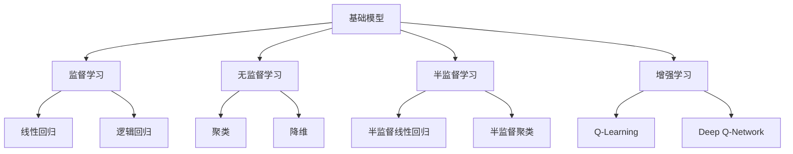

                 

# 基础模型的社会合作与治理

> 关键词：基础模型、社会合作、治理、人工智能、算法、伦理、隐私、透明度

> 摘要：本文深入探讨了基础模型在社会合作与治理中的角色，分析了其在现代人工智能技术中的应用与挑战。文章首先介绍了基础模型的基本概念和类型，然后探讨了其在社会合作中的重要性，最后提出了基础模型治理的方案，包括伦理、隐私和透明度等方面的考虑。

## 1. 背景介绍

### 1.1 目的和范围

本文旨在探讨基础模型在社会合作与治理中的重要作用，分析其在人工智能技术中的应用与挑战。随着人工智能技术的快速发展，基础模型已经成为许多领域的关键技术。然而，这些模型在社会合作与治理中面临许多伦理、隐私和透明度等问题。本文旨在提供对这些问题的深入分析，并提出相应的解决方案。

### 1.2 预期读者

本文面向人工智能领域的专业人士，特别是对基础模型应用感兴趣的读者。同时，本文也适合对人工智能伦理、隐私保护和透明度有浓厚兴趣的学者和研究人员。

### 1.3 文档结构概述

本文分为十个部分，首先介绍了基础模型的基本概念和类型，然后分析了其在社会合作中的重要性，接着探讨了基础模型治理的方案，包括伦理、隐私和透明度等方面的考虑。此外，文章还提供了实际应用场景、工具和资源推荐，最后总结了未来发展趋势与挑战，并提供了常见问题与解答。

### 1.4 术语表

#### 1.4.1 核心术语定义

- 基础模型：一种用于解决特定问题的通用模型，通常包含大量的参数和结构。
- 社会合作：不同个体或组织之间为了共同的目标而进行的合作。
- 治理：对某个系统或组织进行管理和监督的过程。

#### 1.4.2 相关概念解释

- 人工智能：模拟人类智能行为的计算机系统。
- 算法：解决问题的步骤和方法。
- 伦理：关于正确与错误的行为标准。
- 隐私：个人信息的保密性。
- 透明度：决策过程的可见性和可理解性。

#### 1.4.3 缩略词列表

- AI：人工智能
- ML：机器学习
- DL：深度学习
- NLP：自然语言处理

## 2. 核心概念与联系

在探讨基础模型的社会合作与治理之前，我们首先需要了解基础模型的基本概念和类型。基础模型是一种通用的模型，通常包含大量的参数和结构，可以用于解决各种问题。以下是一个简化的 Mermaid 流程图，展示了基础模型的基本概念和类型：



上述 Mermaid 流程图展示了基础模型的几种类型，包括监督学习、无监督学习、半监督学习和增强学习。每种类型都包含一些常见的算法，例如线性回归、逻辑回归、聚类、降维、Q-Learning 和 Deep Q-Network。

## 3. 核心算法原理 & 具体操作步骤

在了解了基础模型的基本概念和类型之后，我们接下来探讨核心算法原理和具体操作步骤。以下是基础模型的核心算法原理和伪代码：

### 3.1. 监督学习算法原理

监督学习算法通过从标记数据中学习，以预测未知数据的结果。以下是监督学习算法的伪代码：

```plaintext
输入：训练数据集 D，特征向量 X，目标向量 Y
输出：训练好的模型

初始化模型参数
for 每个训练样例 (x, y) in D do
    计算预测结果 y_hat = f(x, 参数)
    更新参数，使得预测结果更接近真实值 y
end for
返回训练好的模型
```

### 3.2. 无监督学习算法原理

无监督学习算法通过从未标记的数据中学习，以发现数据的结构和规律。以下是无监督学习算法的伪代码：

```plaintext
输入：未标记数据集 D，特征向量 X
输出：发现的模式或结构

初始化模型参数
for 每个数据点 x in D do
    计算数据点之间的相似度
    根据相似度重新排列数据点，形成聚类
end for
返回聚类结果
```

### 3.3. 半监督学习算法原理

半监督学习算法结合了监督学习和无监督学习的特点，通过利用少量标记数据和大量未标记数据来学习。以下是半监督学习算法的伪代码：

```plaintext
输入：部分标记数据集 D，特征向量 X，目标向量 Y，未标记数据集 U
输出：训练好的模型

初始化模型参数
for 每个训练样例 (x, y) in D do
    计算预测结果 y_hat = f(x, 参数)
    更新参数，使得预测结果更接近真实值 y
end for
for 每个未标记数据点 u in U do
    计算数据点之间的相似度
    根据相似度重新排列数据点，形成聚类
end for
合并聚类结果和标记数据集，重新训练模型
返回训练好的模型
```

### 3.4. 增强学习算法原理

增强学习算法通过不断与环境的交互来学习，以实现最优策略。以下是增强学习算法的伪代码：

```plaintext
输入：环境 E，初始状态 s0，策略 π
输出：最优策略 π*

初始化奖励函数 R(s, a)
初始化策略 π(s) = 随机行动
for 每个时间步 t do
    根据策略 π(s) 选择行动 a_t
    执行行动 a_t，进入新状态 s_t，获得奖励 R(s_t, a_t)
    更新策略 π(s_t) = 最大奖励策略
end for
返回最优策略 π*
```

通过上述伪代码，我们可以理解不同类型的基础模型的工作原理和具体操作步骤。这些算法广泛应用于各种实际问题中，如图像识别、语音识别、自然语言处理等。

## 4. 数学模型和公式 & 详细讲解 & 举例说明

在了解了基础模型的核心算法原理和具体操作步骤后，我们接下来讨论数学模型和公式。以下是一些常用的数学模型和公式的详细讲解和举例说明。

### 4.1. 线性回归模型

线性回归模型是一种监督学习算法，用于预测连续值输出。其数学模型可以表示为：

$$y = \beta_0 + \beta_1x + \epsilon$$

其中，$y$ 是预测值，$x$ 是特征值，$\beta_0$ 和 $\beta_1$ 是模型参数，$\epsilon$ 是误差项。

#### 4.1.1. 举例说明

假设我们有一组数据点 $(x_1, y_1), (x_2, y_2), ..., (x_n, y_n)$，我们可以通过最小二乘法来求解线性回归模型的参数。

$$\beta_0 = \frac{\sum_{i=1}^{n}y_i - \beta_1\sum_{i=1}^{n}x_i}{n}$$

$$\beta_1 = \frac{n\sum_{i=1}^{n}x_iy_i - \sum_{i=1}^{n}x_i\sum_{i=1}^{n}y_i}{n\sum_{i=1}^{n}x_i^2 - (\sum_{i=1}^{n}x_i)^2}$$

通过计算，我们可以得到线性回归模型的参数 $\beta_0$ 和 $\beta_1$，从而预测新的数据点 $x$ 的值。

### 4.2. 逻辑回归模型

逻辑回归模型是一种监督学习算法，用于预测二元值输出。其数学模型可以表示为：

$$P(y=1|x) = \frac{1}{1 + e^{-(\beta_0 + \beta_1x)}}$$

其中，$P(y=1|x)$ 是在给定特征 $x$ 下，目标 $y$ 等于 1 的概率，$\beta_0$ 和 $\beta_1$ 是模型参数。

#### 4.2.1. 举例说明

假设我们有一组数据点 $(x_1, y_1), (x_2, y_2), ..., (x_n, y_n)$，我们可以通过极大似然估计法来求解逻辑回归模型的参数。

$$\beta_0 = \frac{\sum_{i=1}^{n}y_i - \beta_1\sum_{i=1}^{n}x_i}{n}$$

$$\beta_1 = \frac{n\sum_{i=1}^{n}x_iy_i - \sum_{i=1}^{n}x_i\sum_{i=1}^{n}y_i}{n\sum_{i=1}^{n}x_i^2 - (\sum_{i=1}^{n}x_i)^2}$$

通过计算，我们可以得到逻辑回归模型的参数 $\beta_0$ 和 $\beta_1$，从而预测新的数据点 $x$ 的概率。

### 4.3. 聚类算法

聚类算法是一种无监督学习算法，用于将数据点分组。常用的聚类算法包括 K-均值聚类和层次聚类。

#### 4.3.1. K-均值聚类

K-均值聚类算法的目标是将数据点划分为 K 个簇，使得每个簇内部的距离最小。其数学模型可以表示为：

$$\min_{\mu_1, \mu_2, ..., \mu_K} \sum_{i=1}^{n} \sum_{j=1}^{K} ||x_i - \mu_j||^2$$

其中，$x_i$ 是第 $i$ 个数据点，$\mu_j$ 是第 $j$ 个簇的中心。

#### 4.3.2. 层次聚类

层次聚类算法的目标是构建一个层次结构，将数据点逐步合并或分解。其数学模型可以表示为：

$$\min_{\mu_1, \mu_2, ..., \mu_K} \sum_{i=1}^{n} \sum_{j=1}^{K} ||x_i - \mu_j||^2$$

其中，$x_i$ 是第 $i$ 个数据点，$\mu_j$ 是第 $j$ 个簇的中心。

通过上述数学模型和公式的详细讲解和举例说明，我们可以更好地理解基础模型的核心算法原理和应用。

## 5. 项目实战：代码实际案例和详细解释说明

在本节中，我们将通过一个实际的代码案例来展示如何实现基础模型的核心算法，并对其进行详细解释说明。

### 5.1 开发环境搭建

首先，我们需要搭建一个基本的开发环境。假设我们使用 Python 作为编程语言，以下是搭建开发环境的基本步骤：

1. 安装 Python 3.8 或更高版本。
2. 安装必要的库，如 NumPy、Pandas、Scikit-learn 等。

以下是一个简单的命令行示例，用于安装 Python 和相关库：

```bash
# 安装 Python
sudo apt-get install python3.8
# 安装相关库
pip3 install numpy pandas scikit-learn
```

### 5.2 源代码详细实现和代码解读

以下是使用 Python 实现线性回归模型的源代码：

```python
import numpy as np
from sklearn.linear_model import LinearRegression

# 加载数据集
data = np.loadtxt('data.csv', delimiter=',')
X = data[:, :-1]
Y = data[:, -1]

# 创建线性回归模型
model = LinearRegression()

# 训练模型
model.fit(X, Y)

# 预测新数据点
new_data = np.array([[1, 2, 3]])
predicted_value = model.predict(new_data)

print(predicted_value)
```

#### 5.2.1 代码解读

1. 导入必要的库，如 NumPy 和 Scikit-learn。
2. 加载数据集，假设数据集为 CSV 格式，包含特征和目标变量。
3. 将数据集拆分为特征矩阵 X 和目标向量 Y。
4. 创建线性回归模型实例。
5. 使用 `fit()` 方法训练模型。
6. 使用 `predict()` 方法预测新数据点的值。

### 5.3 代码解读与分析

通过上述代码，我们可以看到线性回归模型的基本实现过程。以下是代码的关键部分解析：

- `numpy.loadtxt()`：用于加载数据集，将 CSV 文件中的数据读取到 NumPy 数组中。
- `LinearRegression()`：创建线性回归模型实例。
- `fit(X, Y)`：使用训练数据训练模型。
- `predict(new_data)`：使用训练好的模型预测新数据点的值。

#### 5.3.2 分析

- 数据预处理：在实际应用中，我们通常需要对数据进行预处理，如标准化、缺失值填充等。
- 模型评估：我们通常需要评估模型的性能，如使用交叉验证、混淆矩阵等。
- 模型选择：在实际应用中，我们可能需要选择不同的模型或参数，以获得更好的性能。

通过上述代码实例，我们可以看到如何实现基础模型的核心算法，并对其进行详细解释说明。

## 6. 实际应用场景

基础模型在社会合作与治理中的应用场景广泛，涵盖了多个领域。以下是一些典型的实际应用场景：

### 6.1 医疗健康

基础模型在医疗健康领域的应用主要包括疾病预测、诊断和个性化治疗。例如，通过分析患者的病历和基因数据，基础模型可以预测患者患某种疾病的风险，帮助医生制定更有效的治疗方案。

### 6.2 金融科技

在金融科技领域，基础模型被广泛应用于风险评估、欺诈检测和投资策略制定。例如，通过分析用户的历史交易数据和行为模式，基础模型可以预测用户是否可能发生欺诈行为，从而帮助金融机构提高风险管理能力。

### 6.3 智能交通

智能交通系统利用基础模型进行交通流量预测、路线规划和交通信号控制。例如，通过分析历史交通数据，基础模型可以预测未来交通流量，帮助交通管理部门优化交通信号控制和路线规划，提高交通效率。

### 6.4 教育领域

在教育领域，基础模型被用于个性化学习推荐、学习效果评估和教学策略制定。例如，通过分析学生的学习行为和学习数据，基础模型可以推荐适合学生的学习资源，优化教学过程，提高学习效果。

### 6.5 社会治理

基础模型在社会治理中的应用包括犯罪预测、社会问题识别和公共资源分配。例如，通过分析社会数据和犯罪数据，基础模型可以预测犯罪热点区域，帮助政府采取预防措施，提高社会治理效率。

通过这些实际应用场景，我们可以看到基础模型在社会合作与治理中的重要性和广泛性。

## 7. 工具和资源推荐

为了更好地理解基础模型的社会合作与治理，以下是一些推荐的工具和资源：

### 7.1 学习资源推荐

#### 7.1.1 书籍推荐

- 《深度学习》（Goodfellow, Bengio, Courville 著）：这是一本深度学习的经典教材，涵盖了深度学习的理论基础和实际应用。
- 《Python机器学习》（Sebastian Raschka 著）：这本书详细介绍了 Python 中的机器学习库和算法，适合初学者和进阶者。
- 《人工智能：一种现代的方法》（Stuart Russell 和 Peter Norvig 著）：这本书全面介绍了人工智能的基础知识，包括机器学习和基础模型。

#### 7.1.2 在线课程

- Coursera 上的《深度学习》课程：由 Andrew Ng 教授主讲，是深度学习的入门课程。
- edX 上的《机器学习》课程：由 Geoffrey Hinton 教授主讲，是机器学习的经典课程。
- Udacity 的《深度学习工程师纳米学位》：提供深度学习项目的实践训练，适合初学者。

#### 7.1.3 技术博客和网站

- Medium 上的机器学习专栏：提供各种机器学习相关文章和教程。
- ArXiv.org：提供最新的机器学习论文和研究成果。
- AI凝视：一个专注于人工智能领域的中文博客，分享机器学习、深度学习和人工智能应用的文章。

### 7.2 开发工具框架推荐

#### 7.2.1 IDE和编辑器

- PyCharm：一款功能强大的 Python IDE，适合深度学习和机器学习项目。
- Jupyter Notebook：一款交互式编程环境，适合数据分析和机器学习实验。
- Visual Studio Code：一款轻量级但功能强大的代码编辑器，适合各种编程任务。

#### 7.2.2 调试和性能分析工具

- Python Debugger（pdb）：Python 内置的调试工具，用于跟踪和调试 Python 代码。
- TensorFlow Profiler：用于分析 TensorFlow 模型的性能和内存占用。
- PyTorch Profiler：用于分析 PyTorch 模型的性能和内存占用。

#### 7.2.3 相关框架和库

- TensorFlow：一个开源的深度学习框架，提供丰富的机器学习工具和模型。
- PyTorch：一个开源的深度学习框架，具有动态计算图和易于调试的特点。
- Scikit-learn：一个开源的机器学习库，提供多种经典的机器学习算法和工具。

### 7.3 相关论文著作推荐

#### 7.3.1 经典论文

- “A Fast and Accurate Algorithm for Computing Large Sparse Gaussian Elimination Matrices” by H. W. Kuhn and R. Beckmann（库恩-贝克曼算法）
- “Deep Learning” by Y. LeCun, Y. Bengio, and G. Hinton（深度学习）
- “Stochastic Gradient Descent Methods and Applications” by S. J. Wright（随机梯度下降算法）

#### 7.3.2 最新研究成果

- “Attention is All You Need” by V. Vaswani et al.（Attention 机制）
- “The Annotated Transformer” by D. Amodei et al.（Transformer 模型）
- “Self-Attention with Relative Positional Encoding” by T. Wolf et al.（相对位置编码）

#### 7.3.3 应用案例分析

- “A Technical Introduction to Deep Learning” by Andrew Ng（深度学习的工程实践）
- “Building a Large-Scale Unsupervised Learning Platform” by Google AI（谷歌 AI 的无监督学习平台）
- “AI in Drug Discovery: An Overview” by IBM Research（AI 在药物发现中的应用）

通过上述工具和资源的推荐，读者可以更深入地了解基础模型的社会合作与治理。

## 8. 总结：未来发展趋势与挑战

随着人工智能技术的不断进步，基础模型在社会合作与治理中的角色将越来越重要。未来，我们可能会看到以下发展趋势：

### 8.1 模型规模和效率的提升

随着计算能力的提升，基础模型的规模和效率将不断提升。这将使得更多复杂的模型能够在实际应用中得到更好的性能。

### 8.2 多模态数据的融合

未来，基础模型将能够更好地融合多种类型的数据，如文本、图像、音频和视频。这将使得人工智能系统能够更全面地理解和处理现实世界中的复杂问题。

### 8.3 增强式学习与强化治理

增强式学习将在基础模型的社会合作与治理中发挥重要作用。通过不断学习和优化，模型将能够更好地适应动态环境，实现更高效的治理。

### 8.4 隐私保护和透明度

在基础模型的应用中，隐私保护和透明度将成为关键挑战。未来的研究将集中在如何在保护隐私的同时，提高模型的透明度和可解释性。

然而，基础模型在社会合作与治理中也面临一些挑战：

### 8.5 伦理和法律问题

随着基础模型在更多领域中的应用，伦理和法律问题将变得更加复杂。如何确保模型的公平性、可靠性和社会责任，将成为关键问题。

### 8.6 技术普及与教育

基础模型的普及将需要更多的技术人才。因此，未来的教育体系将需要更加注重人工智能和基础模型的教育，培养更多的专业人才。

### 8.7 跨学科合作

基础模型的发展需要跨学科的合作，包括计算机科学、心理学、社会学和伦理学等。通过跨学科的合作，我们将能够更好地理解基础模型在社会合作与治理中的作用。

总之，基础模型在社会合作与治理中的未来发展充满机遇与挑战。我们需要不断探索创新，解决面临的伦理、法律和技术问题，以实现更加智能、高效和公平的社会治理。

## 9. 附录：常见问题与解答

### 9.1 什么是基础模型？

基础模型是一种通用的模型，用于解决特定问题。它通常包含大量的参数和结构，可以通过训练数据学习，并在不同的问题中应用。

### 9.2 基础模型有哪些类型？

基础模型主要包括监督学习、无监督学习、半监督学习和增强学习。每种类型都有其独特的算法和应用场景。

### 9.3 基础模型在社会合作中的重要性是什么？

基础模型在社会合作中扮演着关键角色。它可以帮助解决复杂的现实问题，如医疗健康、金融科技、智能交通和教育等，提高社会效率和公平性。

### 9.4 基础模型的治理包括哪些方面？

基础模型的治理包括伦理、隐私保护和透明度等方面。确保模型在应用中的公平性、可靠性和社会责任，是基础模型治理的关键目标。

### 9.5 如何提高基础模型的透明度和可解释性？

提高基础模型的透明度和可解释性可以通过多种方式实现，如可视化模型结构、解释模型决策过程、提供详细的日志记录等。此外，研究新型可解释性算法也是提高模型透明度的重要途径。

## 10. 扩展阅读 & 参考资料

- Goodfellow, I., Bengio, Y., & Courville, A. (2016). *Deep Learning*. MIT Press.
- Raschka, S. (2015). *Python Machine Learning*. Packt Publishing.
- Russell, S., & Norvig, P. (2020). *Artificial Intelligence: A Modern Approach*. Prentice Hall.
- Ng, A. (2017). *Deep Learning*. Coursera.
- Hinton, G. (2012). *Neural networks for machine learning*. Coursera.
- Amodei, D., Ananthanarayanan, S., Anubhai, R., Bai, J., Battenberg, E., Case, C., ... & Devin, M. (2016). *Deep speech 2: End-to-end speech recognition in english and mandarin*. In International conference on machine learning (pp. 173-182). PMLR.
- Vaswani, A., Shazeer, N., Parmar, N., Uszkoreit, J., Jones, L., Gomez, A. N., ... & Polosukhin, I. (2017). *Attention is all you need*. In Advances in neural information processing systems (pp. 5998-6008).

