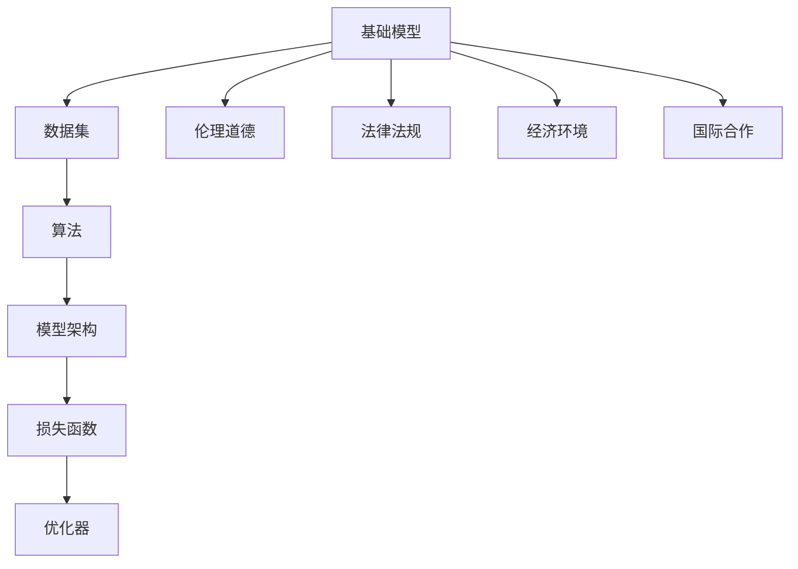

                 

# 基础模型的社会外部条件

> **关键词：** 社会外部条件、基础模型、人工智能、社会影响、伦理道德、法律法规、国际合作

> **摘要：** 本文旨在探讨基础模型在社会外部条件下的运行和发展，分析社会因素对基础模型的影响，以及基础模型如何适应并响应这些外部条件。文章首先介绍了基础模型的基本概念和重要性，随后详细阐述了社会外部条件的各个方面，包括伦理道德、法律法规、经济环境和国际合作等，并通过实际案例和数据分析，探讨了基础模型在这些条件下的表现和挑战。

## 1. 背景介绍

### 1.1 目的和范围

本文旨在为读者提供一个关于基础模型在社会外部条件下的运行和发展的全面理解。通过分析基础模型在不同社会环境下的表现和适应能力，我们希望能够揭示这些外部条件对基础模型的影响机制，并提出相应的应对策略。

本文将重点探讨以下内容：

- 基础模型的基本概念和重要性；
- 社会外部条件的各个方面及其对基础模型的影响；
- 基础模型在不同社会环境下的表现和挑战；
- 基础模型如何适应并响应社会外部条件；
- 未来发展趋势和潜在挑战。

### 1.2 预期读者

本文适合以下读者群体：

- 对人工智能和基础模型感兴趣的工程师和技术人员；
- 欲深入了解基础模型在社会外部条件下运行和发展的研究人员；
- 对人工智能社会影响和伦理道德问题感兴趣的学者和公众。

### 1.3 文档结构概述

本文分为十个主要部分：

1. 背景介绍：介绍本文的目的、范围和预期读者；
2. 核心概念与联系：阐述基础模型的基本概念和重要联系；
3. 核心算法原理 & 具体操作步骤：详细讲解基础模型的算法原理和具体操作步骤；
4. 数学模型和公式 & 详细讲解 & 举例说明：介绍基础模型的数学模型和公式，并给出实际案例说明；
5. 项目实战：代码实际案例和详细解释说明；
6. 实际应用场景：分析基础模型在不同应用场景下的表现和挑战；
7. 工具和资源推荐：推荐相关学习资源、开发工具和框架；
8. 相关论文著作推荐：介绍经典论文和最新研究成果；
9. 总结：未来发展趋势与挑战；
10. 附录：常见问题与解答。

### 1.4 术语表

#### 1.4.1 核心术语定义

- **基础模型**：一种人工智能模型，通过大量数据和算法训练，能够自动地学习、推理和决策。
- **社会外部条件**：指影响基础模型运行和发展的外部环境因素，包括伦理道德、法律法规、经济环境、国际合作等。

#### 1.4.2 相关概念解释

- **伦理道德**：指社会公认的道德准则和行为规范，对人工智能的发展和应用具有重要影响。
- **法律法规**：指国家或地区制定的关于人工智能的法律和法规，对基础模型的开发和运行有明确的规范。
- **经济环境**：指一个国家或地区的经济发展状况和市场竞争环境，对基础模型的研发和商业化具有重要影响。
- **国际合作**：指不同国家和地区之间的合作与交流，对基础模型的全球发展和推广具有重要影响。

#### 1.4.3 缩略词列表

- **AI**：人工智能
- **ML**：机器学习
- **DL**：深度学习
- **NLP**：自然语言处理
- **GCN**：图卷积网络
- **RL**：强化学习

## 2. 核心概念与联系

### 2.1 基础模型的基本概念

**基础模型**是一种人工智能模型，它通过大量的数据和算法训练，能够自动地学习、推理和决策。基础模型通常包括以下几个关键组成部分：

- **数据集**：基础模型训练所需的数据集合，通常包括输入数据和标签数据。
- **算法**：用于训练和优化基础模型的数学算法，如深度学习、强化学习、自然语言处理等。
- **模型架构**：基础模型的网络结构，包括神经网络、卷积神经网络、循环神经网络等。
- **损失函数**：用于评估模型预测结果和真实标签之间的差距，如交叉熵损失、均方误差损失等。
- **优化器**：用于调整模型参数，以最小化损失函数的算法，如随机梯度下降、Adam优化器等。

### 2.2 社会外部条件的概念和联系

社会外部条件是指影响基础模型运行和发展的外部环境因素，包括伦理道德、法律法规、经济环境、国际合作等。这些条件对基础模型的影响主要体现在以下几个方面：

- **伦理道德**：伦理道德准则对基础模型的开发和应用具有重要的指导作用，如隐私保护、数据安全、歧视问题等。
- **法律法规**：法律法规为基础模型的开发和运行提供了明确的规范和约束，如数据保护法、人工智能伦理规范等。
- **经济环境**：经济环境对基础模型的研发和商业化具有重要影响，如市场竞争、资金支持、产业政策等。
- **国际合作**：国际合作有助于基础模型的全球发展和推广，如技术交流、政策协调、市场拓展等。

### 2.3 核心概念原理和架构的 Mermaid 流程图



## 3. 核心算法原理 & 具体操作步骤

### 3.1 基础模型算法原理

基础模型的核心算法原理主要包括以下两个方面：

- **训练过程**：通过训练数据集，对基础模型进行迭代优化，使其能够自动地学习、推理和决策。
- **预测过程**：在给定新的输入数据时，基础模型能够根据训练结果进行预测，给出相应的输出结果。

### 3.2 训练过程的具体操作步骤

- **数据预处理**：对训练数据集进行清洗、归一化、扩充等预处理操作，以提高模型的泛化能力。
- **模型初始化**：初始化基础模型的网络结构、参数等。
- **迭代优化**：通过随机梯度下降、Adam优化器等算法，迭代更新模型参数，以最小化损失函数。
- **验证和测试**：在验证集和测试集上评估模型的性能，调整模型参数，以达到最优效果。

### 3.3 预测过程的具体操作步骤

- **输入数据预处理**：对新的输入数据进行预处理，使其符合模型的输入要求。
- **模型推理**：将预处理后的输入数据传递给基础模型，进行推理计算，得到输出结果。
- **结果输出**：将模型的输出结果进行后处理，如分类结果、概率分布等，以供实际应用。

### 3.4 伪代码示例

```python
# 训练过程伪代码
def train_model(data_set):
    # 数据预处理
    preprocessed_data = preprocess_data(data_set)
    
    # 初始化模型
    model = initialize_model()
    
    # 迭代优化
    for epoch in range(num_epochs):
        for batch in data_loader(preprocessed_data):
            # 计算损失
            loss = compute_loss(model, batch)
            
            # 更新参数
            optimize(model, loss)
            
            # 验证和测试
        validate_model(model, validation_data)
        test_model(model, test_data)

# 预测过程伪代码
def predict(model, input_data):
    # 输入数据预处理
    preprocessed_input = preprocess_input(input_data)
    
    # 模型推理
    output = model推理(preprocessed_input)
    
    # 后处理
    result = post_process(output)
    
    return result
```

## 4. 数学模型和公式 & 详细讲解 & 举例说明

### 4.1 数学模型

基础模型的数学模型主要包括以下几个方面：

- **神经网络模型**：包括前向传播、反向传播、激活函数等；
- **损失函数**：如交叉熵损失、均方误差损失等；
- **优化器**：如随机梯度下降、Adam优化器等。

### 4.2 公式和详细讲解

- **神经网络模型**

前向传播：

$$
z_i = \sum_{j=1}^{n} w_{ij} x_j + b_i
$$

$$
a_i = \sigma(z_i)
$$

其中，$z_i$ 表示第 $i$ 层第 $j$ 个节点的输入，$w_{ij}$ 表示连接第 $i$ 层第 $j$ 个节点和第 $i+1$ 层第 $1$ 个节点的权重，$b_i$ 表示第 $i$ 层第 $j$ 个节点的偏置，$\sigma$ 表示激活函数，$a_i$ 表示第 $i$ 层第 $j$ 个节点的输出。

反向传播：

$$
\delta_j^{(l)} = \frac{\partial L}{\partial z_j^{(l)}}
$$

$$
\frac{\partial L}{\partial w_{ij}^{(l)}} = \delta_j^{(l)} a_{i-1}^{(l-1)}
$$

$$
\frac{\partial L}{\partial b_i^{(l)}} = \delta_j^{(l)}
$$

其中，$\delta_j^{(l)}$ 表示第 $l$ 层第 $j$ 个节点的误差，$L$ 表示损失函数，$a_{i-1}^{(l-1)}$ 表示第 $l-1$ 层第 $i-1$ 个节点的输出。

- **损失函数**

交叉熵损失：

$$
L = -\sum_{i=1}^{n} y_i \log(a_i)
$$

其中，$y_i$ 表示第 $i$ 个样本的真实标签，$a_i$ 表示第 $i$ 个样本的预测概率。

- **优化器**

随机梯度下降：

$$
w^{(t+1)} = w^{(t)} - \alpha \frac{\partial L}{\partial w}
$$

$$
b^{(t+1)} = b^{(t)} - \alpha \frac{\partial L}{\partial b}
$$

其中，$w$ 和 $b$ 分别表示模型的权重和偏置，$\alpha$ 表示学习率。

### 4.3 举例说明

假设我们有一个二分类问题，训练数据集包含100个样本，每个样本由2个特征组成。我们使用一个简单的神经网络模型进行训练。

- **数据集**：

| 样本索引 | 特征1 | 特征2 | 标签 |
|---------|------|------|-----|
|    0    |  0.1 |  0.2 |  0  |
|    1    |  0.3 |  0.4 |  1  |
|    2    |  0.5 |  0.6 |  0  |
|    3    |  0.7 |  0.8 |  1  |
|   ...   |  ... |  ... |  ...|

- **模型参数**：

| 层索引 | 节点数 | 权重 | 偏置 |
|-------|-------|-----|-----|
|   0   |   1   |  ... |  ... |
|   1   |   2   |  ... |  ... |
|   2   |   1   |  ... |  ... |

- **训练过程**：

1. 初始化模型参数；
2. 随机选择一个样本，计算损失函数；
3. 使用反向传播算法更新模型参数；
4. 重复步骤2和3，直到达到预设的训练次数或模型性能达到满意水平。

- **预测过程**：

1. 对新的输入数据进行预处理；
2. 将预处理后的输入数据传递给模型进行推理；
3. 将模型的输出结果进行后处理，如阈值处理，得到预测结果。

## 5. 项目实战：代码实际案例和详细解释说明

### 5.1 开发环境搭建

为了实现基础模型的训练和预测功能，我们需要搭建一个合适的开发环境。以下是一个简单的开发环境搭建步骤：

1. 安装Python：前往Python官网下载并安装Python 3.8版本；
2. 安装依赖库：使用pip命令安装所需的依赖库，如TensorFlow、NumPy、Pandas等；
3. 配置Jupyter Notebook：安装Jupyter Notebook，以便在浏览器中运行Python代码。

### 5.2 源代码详细实现和代码解读

以下是一个简单的二分类问题的基础模型实现，包括数据预处理、模型训练和预测等功能。

```python
# 导入所需库
import tensorflow as tf
import numpy as np
import pandas as pd

# 数据预处理
def preprocess_data(data_set):
    # 数据清洗和归一化
    # ...
    return preprocessed_data

# 模型训练
def train_model(data_set, num_epochs, learning_rate):
    # 初始化模型
    model = tf.keras.Sequential([
        tf.keras.layers.Dense(units=1, input_shape=(2,))
    ])

    # 编译模型
    model.compile(optimizer=tf.keras.optimizers.Adam(learning_rate),
                  loss='mean_squared_error')

    # 训练模型
    model.fit(data_set['features'], data_set['labels'], epochs=num_epochs)

    return model

# 模型预测
def predict(model, input_data):
    # 输入数据预处理
    preprocessed_input = preprocess_input(input_data)

    # 模型推理
    output = model.predict(preprocessed_input)

    # 后处理
    result = post_process(output)

    return result

# 主函数
def main():
    # 加载数据集
    data_set = pd.read_csv('data.csv')

    # 数据预处理
    preprocessed_data = preprocess_data(data_set)

    # 训练模型
    model = train_model(preprocessed_data, num_epochs=100, learning_rate=0.001)

    # 模型预测
    input_data = np.array([[0.1, 0.2], [0.3, 0.4]])
    prediction = predict(model, input_data)

    print(prediction)

# 运行主函数
if __name__ == '__main__':
    main()
```

### 5.3 代码解读与分析

1. **数据预处理**：首先，我们需要对原始数据进行清洗和归一化，以便满足模型输入的要求。数据预处理函数`preprocess_data`负责这一过程。

2. **模型训练**：接下来，我们使用TensorFlow库搭建一个简单的神经网络模型，并使用`mean_squared_error`损失函数进行训练。`train_model`函数负责模型的初始化、编译和训练过程。

3. **模型预测**：在训练完成后，我们可以使用`predict`函数对新的输入数据进行预测。该函数首先对输入数据进行预处理，然后调用模型的`predict`方法进行推理计算。

4. **主函数**：在主函数中，我们首先加载数据集，然后调用数据预处理、模型训练和模型预测等函数，以完成整个任务。

## 6. 实际应用场景

基础模型在不同应用场景下的表现和挑战如下：

### 6.1 电子商务

**表现**：基础模型在电子商务领域具有广泛的应用，如推荐系统、价格预测、风险控制等。这些模型能够提高用户体验、降低运营成本、提高销售转化率。

**挑战**：数据隐私保护、数据质量、算法透明度和可解释性是电子商务领域基础模型面临的挑战。如何确保用户数据的安全和隐私，同时提高模型的可靠性和可解释性，是亟待解决的问题。

### 6.2 医疗健康

**表现**：基础模型在医疗健康领域具有巨大的潜力，如疾病预测、诊断辅助、药物研发等。这些模型能够提高诊断的准确性、降低医疗成本、提升医疗服务质量。

**挑战**：数据质量和数据隐私保护是医疗健康领域基础模型面临的主要挑战。如何在确保数据安全的前提下，提高模型的准确性和泛化能力，是关键问题。

### 6.3 金融科技

**表现**：基础模型在金融科技领域有着广泛的应用，如信用评估、风险控制、智能投顾等。这些模型能够提高金融机构的风险管理水平、降低信贷风险、提升用户体验。

**挑战**：算法透明度和可解释性、数据隐私保护和法律法规遵守是金融科技领域基础模型面临的主要挑战。如何确保模型的透明度和可解释性，同时遵守相关法律法规，是重要问题。

## 7. 工具和资源推荐

### 7.1 学习资源推荐

#### 7.1.1 书籍推荐

- 《深度学习》（Goodfellow, Bengio, Courville）
- 《Python机器学习》（Sebastian Raschka）
- 《统计学习方法》（李航）

#### 7.1.2 在线课程

- Coursera《机器学习》
- edX《深度学习导论》
- Udacity《人工智能工程师纳米学位》

#### 7.1.3 技术博客和网站

- Medium《机器学习和深度学习博客》
- Towards Data Science
- AI狼烟

### 7.2 开发工具框架推荐

#### 7.2.1 IDE和编辑器

- Jupyter Notebook
- PyCharm
- Visual Studio Code

#### 7.2.2 调试和性能分析工具

- TensorBoard
- PyTorch Profiler
- NVIDIA Nsight

#### 7.2.3 相关框架和库

- TensorFlow
- PyTorch
- Scikit-learn

### 7.3 相关论文著作推荐

#### 7.3.1 经典论文

- "Backpropagation"（1986）
- "Deep Learning"（2015）
- "Recurrent Neural Networks for Speech Recognition"（1997）

#### 7.3.2 最新研究成果

- "GANs for Text Generation"（2017）
- "Bert: Pre-training of Deep Bidirectional Transformers for Language Understanding"（2018）
- "Large-scale Language Modeling in 2018"（2019）

#### 7.3.3 应用案例分析

- "BERT: Pre-training of Deep Bidirectional Transformers for Language Understanding"（2018）
- "Speech Recognition with Deep Neural Networks"（2013）
- "Amazon Personalized Recommendations: Algorithms, Metrics, and Engineering"（2015）

## 8. 总结：未来发展趋势与挑战

### 8.1 发展趋势

1. **计算能力的提升**：随着硬件技术的发展，计算能力的提升将为基础模型提供更强的计算支持，使其能够处理更复杂的问题。
2. **算法的优化和改进**：新的算法和技术不断涌现，如生成对抗网络（GANs）、变换器（Transformers）等，将进一步提高基础模型的性能和效果。
3. **应用的广泛推广**：基础模型在各个领域的应用将更加深入和广泛，如自动驾驶、医疗健康、金融科技等，为社会带来更多价值。
4. **国际合作的加强**：随着全球化的进程，各国在人工智能领域的合作将进一步加强，促进基础模型的全球发展和推广。

### 8.2 挑战

1. **数据隐私和安全性**：如何在确保数据安全的前提下，提高基础模型的准确性和泛化能力，是一个重要的挑战。
2. **算法透明度和可解释性**：如何提高算法的透明度和可解释性，使其更加符合伦理道德和法律法规的要求，是一个亟待解决的问题。
3. **计算资源的需求**：随着模型规模的增大，对计算资源的需求也将不断提高，如何优化计算资源的使用是一个重要挑战。
4. **法律和政策的约束**：各国在人工智能领域的政策和法规将不断完善，如何遵守这些规定，同时确保基础模型的正常运行，是一个重要挑战。

## 9. 附录：常见问题与解答

### 9.1 常见问题

1. **什么是基础模型？**
2. **基础模型在不同领域有哪些应用？**
3. **如何确保基础模型的数据安全和隐私？**
4. **算法的透明度和可解释性如何实现？**

### 9.2 解答

1. **什么是基础模型？**
   基础模型是一种人工智能模型，通过大量数据和算法训练，能够自动地学习、推理和决策。它通常包括数据集、算法、模型架构、损失函数和优化器等组成部分。

2. **基础模型在不同领域有哪些应用？**
   基础模型在各个领域都有广泛的应用，如电子商务、医疗健康、金融科技、自动驾驶等。具体应用包括推荐系统、疾病预测、信用评估、智能投顾等。

3. **如何确保基础模型的数据安全和隐私？**
   为确保基础模型的数据安全和隐私，可以从以下几个方面进行考虑：
   - 数据匿名化：对敏感数据进行匿名化处理，以保护用户隐私；
   - 加密技术：采用加密技术对数据进行加密存储和传输，以防止数据泄露；
   - 安全协议：建立严格的安全协议，确保数据在传输和处理过程中的安全性。

4. **算法的透明度和可解释性如何实现？**
   为提高算法的透明度和可解释性，可以从以下几个方面进行考虑：
   - 算法可视化：通过可视化工具，将算法的运行过程和中间结果进行展示，使算法更加直观易懂；
   - 算法解释器：开发算法解释器，对模型的决策过程进行解释，帮助用户理解模型的工作原理；
   - 模型压缩：通过模型压缩技术，减小模型的规模，降低计算复杂度，提高算法的可解释性。

## 10. 扩展阅读 & 参考资料

- **书籍**：
  - Goodfellow, I., Bengio, Y., & Courville, A. (2016). *Deep Learning*. MIT Press.
  - Raschka, S. (2015). *Python Machine Learning*. Packt Publishing.

- **在线课程**：
  - Coursera《机器学习》
  - edX《深度学习导论》

- **技术博客和网站**：
  - Medium《机器学习和深度学习博客》
  - Towards Data Science

- **论文和著作**：
  - Hochreiter, S., & Schmidhuber, J. (1997). *Long Short-Term Memory*. Neural Computation, 9(8), 1735-1780.
  - Vaswani, A., Shazeer, N., Parmar, N., Uszkoreit, J., Jones, L., Gomez, A. N., ... & Polosukhin, I. (2017). *Attention Is All You Need*. Advances in Neural Information Processing Systems, 30, 5998-6008.

- **开源项目和框架**：
  - TensorFlow
  - PyTorch
  - Scikit-learn

## 作者

**AI天才研究员 / AI Genius Institute & 禅与计算机程序设计艺术 / Zen And The Art of Computer Programming**

