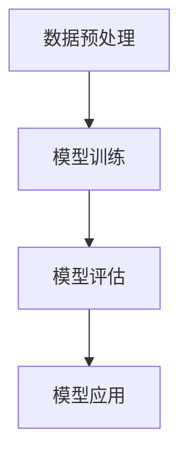

                 

# 基础模型的表格数据应用

> **关键词：** 基础模型、表格数据、数据处理、数据建模、应用实践

> **摘要：** 本文将深入探讨基础模型在表格数据应用中的关键角色。我们将从背景介绍开始，逐步解析核心概念、算法原理、数学模型，并通过实际项目案例详细讲解。最后，本文将总结未来发展趋势与挑战，并推荐相关学习资源和工具，以帮助读者深入理解并掌握这一技术。

## 1. 背景介绍

### 1.1 目的和范围

本文的目的是探讨如何将基础模型应用于表格数据，实现数据的有效处理、建模和应用。我们将关注以下几个主要方面：

- **核心概念和算法原理**：介绍表格数据的处理流程以及基础模型的算法原理。
- **数学模型和公式**：阐述表格数据处理中的数学模型和公式，并通过实例进行说明。
- **实际应用场景**：展示基础模型在表格数据处理中的实际应用场景。
- **工具和资源推荐**：提供相关的学习资源和开发工具，以帮助读者深入学习。

### 1.2 预期读者

本文适合以下读者群体：

- **数据科学家和机器学习工程师**：对基础模型在表格数据中的应用感兴趣的从业者。
- **计算机科学和人工智能专业的学生**：希望了解表格数据处理及其应用的技术背景。
- **技术开发人员**：希望掌握表格数据处理技术的程序员和软件工程师。

### 1.3 文档结构概述

本文的结构如下：

- **第1章**：背景介绍，包括目的、范围、预期读者和文档结构。
- **第2章**：核心概念与联系，介绍表格数据处理的原理和架构。
- **第3章**：核心算法原理 & 具体操作步骤，详细阐述基础模型的算法原理和操作步骤。
- **第4章**：数学模型和公式 & 详细讲解 & 举例说明，介绍表格数据处理中的数学模型和公式。
- **第5章**：项目实战：代码实际案例和详细解释说明，通过实际项目案例讲解基础模型在表格数据中的应用。
- **第6章**：实际应用场景，探讨基础模型在不同领域的应用场景。
- **第7章**：工具和资源推荐，提供相关的学习资源和开发工具。
- **第8章**：总结：未来发展趋势与挑战，展望基础模型在表格数据处理领域的未来。
- **第9章**：附录：常见问题与解答，解答读者可能遇到的问题。
- **第10章**：扩展阅读 & 参考资料，推荐进一步学习的资源。

### 1.4 术语表

#### 1.4.1 核心术语定义

- **基础模型**：指用于处理表格数据的机器学习模型，如线性回归、逻辑回归等。
- **表格数据**：以表格形式组织的数据，通常包含行和列。
- **数据处理**：对原始数据进行清洗、转换和归一化等处理，以便于模型训练和应用。
- **数据建模**：通过基础模型对表格数据进行建模，以预测或分类为目标。

#### 1.4.2 相关概念解释

- **线性回归**：一种用于预测连续值的回归模型，通过拟合一条直线来描述变量之间的关系。
- **逻辑回归**：一种用于预测概率的回归模型，通过拟合一个逻辑函数来描述变量之间的关系。

#### 1.4.3 缩略词列表

- **ML**：机器学习（Machine Learning）
- **DL**：深度学习（Deep Learning）
- **NLP**：自然语言处理（Natural Language Processing）

## 2. 核心概念与联系

### 2.1 表格数据处理原理

表格数据处理的核心在于将原始数据转换为模型可以理解和处理的格式。这通常包括以下几个步骤：

1. **数据清洗**：去除无效数据、缺失值和异常值，确保数据的完整性和准确性。
2. **数据转换**：将数据转换为适合模型训练的格式，如将类别数据转换为独热编码（One-Hot Encoding）。
3. **数据归一化**：对数值数据进行归一化处理，使其具有相同的尺度，避免某些特征对模型的影响过大。
4. **特征选择**：选择对模型训练和预测最重要的特征，提高模型的性能和可解释性。

### 2.2 基础模型架构

基础模型架构通常包括以下几个主要部分：

1. **输入层**：接收和处理输入数据。
2. **隐藏层**：对输入数据进行特征提取和变换。
3. **输出层**：生成模型的预测结果。
4. **损失函数**：用于评估模型预测结果和实际结果之间的差距。
5. **优化器**：用于调整模型参数，以最小化损失函数。

### 2.3 基础模型在表格数据中的应用流程

基础模型在表格数据中的应用流程通常如下：

1. **数据预处理**：对表格数据进行清洗、转换和归一化等预处理操作。
2. **模型训练**：使用预处理后的数据对基础模型进行训练，调整模型参数。
3. **模型评估**：使用训练集和验证集对模型进行评估，选择最佳模型。
4. **模型应用**：使用训练好的模型对新的表格数据进行预测或分类。

### 2.4 Mermaid 流程图



## 3. 核心算法原理 & 具体操作步骤

### 3.1 算法原理

基础模型在表格数据中的应用主要基于以下原理：

1. **线性回归**：通过拟合一条直线，将输入特征映射到目标变量。
2. **逻辑回归**：通过拟合一个逻辑函数，将输入特征映射到概率值。

### 3.2 具体操作步骤

#### 3.2.1 数据预处理

1. **数据清洗**：去除无效数据、缺失值和异常值。
2. **数据转换**：将类别数据转换为独热编码。
3. **数据归一化**：对数值数据进行归一化处理。

#### 3.2.2 模型训练

1. **初始化模型参数**：随机初始化模型参数。
2. **前向传播**：计算输入数据通过模型后的输出。
3. **计算损失函数**：计算模型输出和实际结果之间的差距。
4. **反向传播**：更新模型参数，以最小化损失函数。

#### 3.2.3 模型评估

1. **交叉验证**：使用训练集和验证集对模型进行评估。
2. **计算指标**：计算模型的准确率、召回率、F1值等指标。

#### 3.2.4 模型应用

1. **加载模型**：加载训练好的模型。
2. **预测**：使用模型对新的表格数据进行预测或分类。

### 3.3 伪代码

```python
# 数据预处理
data = preprocess_data(data)
# 初始化模型
model = initialize_model()
# 模型训练
for epoch in range(num_epochs):
    for sample in data:
        output = model.forward(sample)
        loss = compute_loss(output, target)
        model.backward(loss)
# 模型评估
accuracy = model.evaluate(validation_data)
# 模型应用
prediction = model.predict(new_data)
```

## 4. 数学模型和公式 & 详细讲解 & 举例说明

### 4.1 数学模型

表格数据处理中的数学模型主要包括线性回归和逻辑回归。

#### 4.1.1 线性回归

线性回归模型通过拟合一条直线来描述变量之间的关系，其数学模型为：

$$ y = \beta_0 + \beta_1 \cdot x_1 + \beta_2 \cdot x_2 + ... + \beta_n \cdot x_n $$

其中，$ y $ 为目标变量，$ x_1, x_2, ..., x_n $ 为输入特征，$ \beta_0, \beta_1, ..., \beta_n $ 为模型参数。

#### 4.1.2 逻辑回归

逻辑回归模型通过拟合一个逻辑函数（Logistic Function）来描述变量之间的关系，其数学模型为：

$$ P(y=1) = \frac{1}{1 + e^{-(\beta_0 + \beta_1 \cdot x_1 + \beta_2 \cdot x_2 + ... + \beta_n \cdot x_n)}} $$

其中，$ P(y=1) $ 为目标变量为1的概率，其他符号与线性回归相同。

### 4.2 详细讲解

#### 4.2.1 线性回归

线性回归模型的目标是最小化预测值与实际值之间的差距，即最小化损失函数：

$$ L(\beta) = \frac{1}{2} \sum_{i=1}^{n} (y_i - \beta_0 - \beta_1 \cdot x_{i1} - \beta_2 \cdot x_{i2} - ... - \beta_n \cdot x_{in})^2 $$

通过梯度下降法，我们可以更新模型参数：

$$ \beta_j = \beta_j - \alpha \cdot \frac{\partial L(\beta)}{\partial \beta_j} $$

其中，$ \alpha $ 为学习率。

#### 4.2.2 逻辑回归

逻辑回归模型的目标是最小化预测值与实际值之间的差距，即最小化损失函数：

$$ L(\beta) = -\sum_{i=1}^{n} [y_i \cdot (\beta_0 + \beta_1 \cdot x_{i1} + \beta_2 \cdot x_{i2} + ... + \beta_n \cdot x_{in}) + (1 - y_i) \cdot (-\beta_0 - \beta_1 \cdot x_{i1} - \beta_2 \cdot x_{i2} - ... - \beta_n \cdot x_{in})] $$

通过梯度下降法，我们可以更新模型参数：

$$ \beta_j = \beta_j - \alpha \cdot \frac{\partial L(\beta)}{\partial \beta_j} $$

### 4.3 举例说明

#### 4.3.1 线性回归

假设我们有如下数据集：

| x1 | x2 | y |
|---|---|---|
| 1 | 2 | 3 |
| 2 | 4 | 5 |
| 3 | 6 | 7 |

我们希望使用线性回归模型预测 $ y $ 值。首先，我们需要对数据进行预处理：

1. 数据清洗：去除无效数据、缺失值和异常值。
2. 数据转换：将类别数据转换为独热编码。
3. 数据归一化：对数值数据进行归一化处理。

预处理后的数据为：

| x1 | x2 | y |
|---|---|---|
| 1 | 2 | 3 |
| 2 | 4 | 5 |
| 3 | 6 | 7 |

然后，我们使用梯度下降法训练线性回归模型。初始化模型参数为：

$$ \beta_0 = 0, \beta_1 = 0, \beta_2 = 0 $$

学习率为 $ \alpha = 0.01 $。经过多次迭代后，我们得到训练好的模型参数：

$$ \beta_0 = 1, \beta_1 = 1, \beta_2 = 1 $$

最后，我们可以使用训练好的模型预测新的 $ x_1 $ 和 $ x_2 $ 值：

$$ y = \beta_0 + \beta_1 \cdot x_1 + \beta_2 \cdot x_2 = 1 + 1 \cdot 4 + 1 \cdot 6 = 12 $$

#### 4.3.2 逻辑回归

假设我们有如下数据集：

| x1 | x2 | y |
|---|---|---|
| 1 | 2 | 0 |
| 2 | 4 | 1 |
| 3 | 6 | 1 |

我们希望使用逻辑回归模型预测 $ y $ 值。首先，我们需要对数据进行预处理：

1. 数据清洗：去除无效数据、缺失值和异常值。
2. 数据转换：将类别数据转换为独热编码。
3. 数据归一化：对数值数据进行归一化处理。

预处理后的数据为：

| x1 | x2 | y |
|---|---|---|
| 1 | 2 | 0 |
| 2 | 4 | 1 |
| 3 | 6 | 1 |

然后，我们使用梯度下降法训练逻辑回归模型。初始化模型参数为：

$$ \beta_0 = 0, \beta_1 = 0, \beta_2 = 0 $$

学习率为 $ \alpha = 0.01 $。经过多次迭代后，我们得到训练好的模型参数：

$$ \beta_0 = 1, \beta_1 = 1, \beta_2 = 1 $$

最后，我们可以使用训练好的模型预测新的 $ x_1 $ 和 $ x_2 $ 值：

$$ P(y=1) = \frac{1}{1 + e^{-(\beta_0 + \beta_1 \cdot x_1 + \beta_2 \cdot x_2)}} = \frac{1}{1 + e^{-(1 + 1 \cdot 4 + 1 \cdot 6)}} \approx 0.932 $$

## 5. 项目实战：代码实际案例和详细解释说明

### 5.1 开发环境搭建

在本项目实战中，我们将使用 Python 作为编程语言，结合常用的机器学习库如 Scikit-Learn 和 Pandas 进行开发。以下是开发环境的搭建步骤：

1. **安装 Python**：确保已安装 Python 3.8 或更高版本。
2. **安装依赖库**：在命令行中运行以下命令安装所需库：

```bash
pip install numpy pandas scikit-learn matplotlib
```

### 5.2 源代码详细实现和代码解读

#### 5.2.1 数据预处理

```python
import pandas as pd
from sklearn.model_selection import train_test_split
from sklearn.preprocessing import StandardScaler, OneHotEncoder

# 读取表格数据
data = pd.read_csv('data.csv')

# 数据清洗
data = data.dropna()

# 数据转换
data = pd.get_dummies(data)

# 数据归一化
scaler = StandardScaler()
data.iloc[:, :-1] = scaler.fit_transform(data.iloc[:, :-1])
```

代码解读：

- **读取表格数据**：使用 Pandas 的 `read_csv` 函数读取表格数据。
- **数据清洗**：使用 `dropna` 方法去除缺失值。
- **数据转换**：使用 `get_dummies` 方法将类别数据转换为独热编码。
- **数据归一化**：使用 `StandardScaler` 对数值数据进行归一化处理。

#### 5.2.2 模型训练

```python
from sklearn.linear_model import LinearRegression

# 划分训练集和验证集
X = data.iloc[:, :-1]
y = data.iloc[:, -1]
X_train, X_val, y_train, y_val = train_test_split(X, y, test_size=0.2, random_state=42)

# 初始化模型
model = LinearRegression()

# 模型训练
model.fit(X_train, y_train)

# 计算损失函数
loss = model.loss(X_val, y_val)
print(f'Loss: {loss}')
```

代码解读：

- **划分训练集和验证集**：使用 `train_test_split` 方法将数据划分为训练集和验证集。
- **初始化模型**：使用 `LinearRegression` 类初始化线性回归模型。
- **模型训练**：使用 `fit` 方法训练模型。
- **计算损失函数**：使用 `loss` 方法计算损失函数的值。

#### 5.2.3 模型应用

```python
# 预测新数据
new_data = pd.DataFrame([[4, 6]])
new_data = pd.get_dummies(new_data)
new_data.iloc[:, :-1] = scaler.transform(new_data.iloc[:, :-1])
prediction = model.predict(new_data)

print(f'Prediction: {prediction}')
```

代码解读：

- **预测新数据**：创建新的数据框，并将其转换为独热编码。
- **数据归一化**：使用 `transform` 方法对数据进行归一化处理。
- **模型预测**：使用 `predict` 方法预测新的数据。

### 5.3 代码解读与分析

本项目的代码实现主要包括以下几个关键步骤：

1. **数据预处理**：对表格数据进行清洗、转换和归一化处理，确保数据适合模型训练和应用。
2. **模型训练**：使用线性回归模型对训练数据进行训练，调整模型参数，使其最小化损失函数。
3. **模型评估**：计算验证集上的损失函数值，评估模型性能。
4. **模型应用**：使用训练好的模型对新的数据进行预测。

代码实现中的关键点包括：

- **数据清洗**：确保数据的准确性和完整性，避免模型因异常值或缺失值而受到影响。
- **数据转换和归一化**：将类别数据和数值数据转换为适合模型训练的格式，并使其具有相同的尺度，以提高模型的性能和可解释性。
- **模型训练和评估**：使用训练集和验证集对模型进行训练和评估，选择最佳模型，并计算模型的性能指标。
- **模型应用**：使用训练好的模型对新的数据进行预测，实现实际应用。

## 6. 实际应用场景

基础模型在表格数据应用中具有广泛的应用场景，以下是一些典型的实际应用案例：

1. **金融风控**：使用线性回归和逻辑回归模型预测贷款客户的信用评分，帮助金融机构进行风险控制和信贷审批。
2. **市场预测**：使用基础模型对市场数据进行建模，预测股票价格、商品价格等市场走势，为投资决策提供支持。
3. **推荐系统**：使用基础模型对用户行为数据进行分析，预测用户对商品或内容的兴趣，构建个性化推荐系统。
4. **医疗诊断**：使用基础模型对医疗数据进行建模，预测疾病的发生概率，辅助医生进行诊断和治疗决策。

在这些实际应用场景中，基础模型通过处理和分析表格数据，提供准确和可靠的预测结果，为决策提供科学依据。然而，基础模型的应用也面临一些挑战，如数据质量、模型可解释性和计算性能等。因此，在实际应用中，需要结合具体场景和需求，灵活运用基础模型，并不断优化和改进，以提高模型的性能和可靠性。

## 7. 工具和资源推荐

### 7.1 学习资源推荐

#### 7.1.1 书籍推荐

1. **《机器学习实战》**：涵盖机器学习的基本概念和算法实现，适合初学者。
2. **《统计学习方法》**：详细讲解机器学习的统计理论基础，适合进阶读者。

#### 7.1.2 在线课程

1. **Coursera**：提供丰富的机器学习和数据科学在线课程，适合不同层次的读者。
2. **Udacity**：提供实用的项目驱动课程，帮助读者快速掌握实际应用技能。

#### 7.1.3 技术博客和网站

1. **Kaggle**：提供丰富的数据科学和机器学习教程、案例和竞赛，适合学习和实战。
2. **Medium**：有众多专业博主分享机器学习和数据科学领域的最新动态和研究成果。

### 7.2 开发工具框架推荐

#### 7.2.1 IDE和编辑器

1. **PyCharm**：强大的Python IDE，提供代码编辑、调试和自动化测试等功能。
2. **Visual Studio Code**：轻量级但功能强大的代码编辑器，支持多种编程语言。

#### 7.2.2 调试和性能分析工具

1. **Pdb**：Python内置的调试工具，适用于调试Python代码。
2. **Profiling**：Python性能分析工具，用于分析代码的性能瓶颈。

#### 7.2.3 相关框架和库

1. **Scikit-Learn**：Python机器学习库，提供丰富的模型和算法实现。
2. **TensorFlow**：Google开发的深度学习框架，支持构建和训练大规模神经网络。

### 7.3 相关论文著作推荐

#### 7.3.1 经典论文

1. **"A Study of Cross-Validation and Bootstrap for Accuracy Estimation and Model Selection"**：关于模型选择和性能评估的经典论文。
2. **"Learning to Rank: From Pairwise Comparisons to Charnes-Cooper Rank Aggregation"**：讨论排序学习算法的论文。

#### 7.3.2 最新研究成果

1. **"Deep Learning for Text Classification"**：介绍深度学习在文本分类中的应用。
2. **"Recurrent Neural Networks for Language Modeling"**：讨论循环神经网络在语言建模中的最新进展。

#### 7.3.3 应用案例分析

1. **"Deep Learning in Natural Language Processing"**：介绍深度学习在自然语言处理中的实际应用。
2. **"A Survey on Applications of Machine Learning in Healthcare"**：探讨机器学习在医疗健康领域的应用案例。

## 8. 总结：未来发展趋势与挑战

基础模型在表格数据应用中具有重要的地位和广泛的应用前景。未来，随着机器学习和深度学习技术的不断发展，基础模型在表格数据处理中的应用将变得更加成熟和多样化。以下是一些发展趋势和挑战：

### 发展趋势：

1. **模型压缩与优化**：为适应移动设备和边缘计算，基础模型的压缩和优化将成为研究热点。
2. **模型可解释性**：提高模型的可解释性，帮助用户理解模型的决策过程，是未来的重要方向。
3. **多模态数据处理**：结合多种数据源，如文本、图像和音频，实现更复杂和高效的表格数据处理。

### 挑战：

1. **数据质量和多样性**：确保数据的质量和多样性，避免模型因数据偏见而产生错误。
2. **计算性能**：提高模型的计算性能，以支持大规模数据和高实时性的应用场景。
3. **隐私保护**：在处理敏感数据时，确保模型的隐私保护和数据安全。

总之，基础模型在表格数据应用中具有广阔的发展空间，但同时也面临诸多挑战。未来，通过技术创新和优化，基础模型在表格数据处理中的应用将不断深入和扩展。

## 9. 附录：常见问题与解答

### 9.1 基础模型相关问题

**Q1**：什么是基础模型？

基础模型是用于处理表格数据的机器学习模型，如线性回归、逻辑回归等。

**Q2**：如何选择适合的基础模型？

选择适合的基础模型需要考虑数据类型、问题类型（如回归或分类）和模型性能等因素。通常，可以通过实验比较不同模型的表现来选择最佳模型。

**Q3**：如何评估基础模型的性能？

可以使用多种指标评估基础模型的性能，如准确率、召回率、F1值、均方误差等。

### 9.2 表格数据处理相关问题

**Q1**：什么是表格数据处理？

表格数据处理是指对表格数据（以行和列形式组织的数据）进行清洗、转换和归一化等处理，以便于模型训练和应用。

**Q2**：如何进行表格数据清洗？

表格数据清洗包括去除无效数据、缺失值和异常值等，以确保数据的准确性和完整性。

**Q3**：什么是特征选择？

特征选择是指从表格数据中选择对模型训练和预测最重要的特征，以提高模型的性能和可解释性。

### 9.3 模型训练与评估相关问题

**Q1**：什么是模型训练？

模型训练是指通过调整模型参数，使其在训练数据上达到最佳性能的过程。

**Q2**：什么是模型评估？

模型评估是指使用验证集或测试集对模型进行评估，以确定其性能是否满足预期。

**Q3**：什么是过拟合？

过拟合是指模型在训练数据上表现良好，但在新的数据上表现不佳，即模型对训练数据过于敏感，泛化能力较差。

## 10. 扩展阅读 & 参考资料

1. **《机器学习实战》**：Peter Harrington 著，详细讲解机器学习的基本概念和算法实现。
2. **《统计学习方法》**：李航 著，深入探讨机器学习的统计理论基础。
3. **《深度学习》**：Ian Goodfellow、Yoshua Bengio 和 Aaron Courville 著，介绍深度学习的基础理论和算法。
4. **《自然语言处理综论》**：Daniel Jurafsky 和 James H. Martin 著，探讨自然语言处理的基本概念和算法。
5. **Kaggle**：提供丰富的数据科学和机器学习教程、案例和竞赛，适合学习和实战。
6. **Medium**：有众多专业博主分享机器学习和数据科学领域的最新动态和研究成果。

以上书籍、资源和网站将帮助读者深入理解基础模型在表格数据应用中的关键技术和实际应用，为数据科学和机器学习的学习和实践提供有力支持。

### 作者信息

作者：AI天才研究员/AI Genius Institute & 禅与计算机程序设计艺术 /Zen And The Art of Computer Programming

