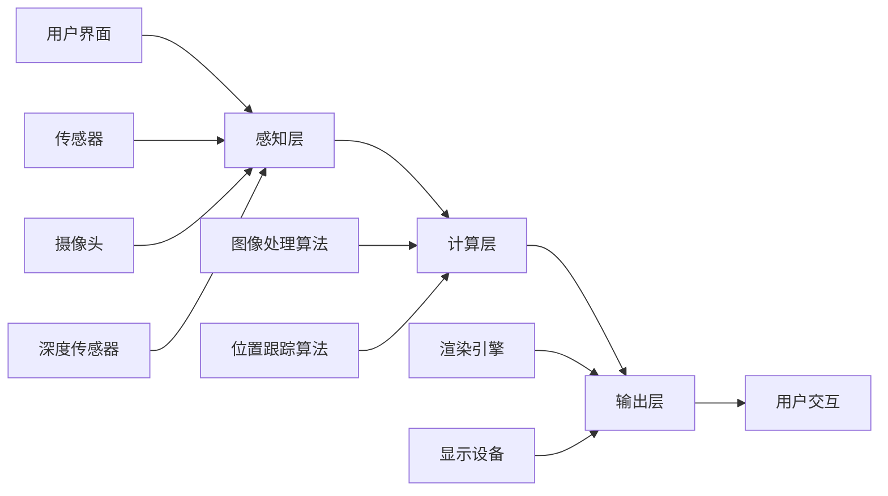

                 

# 增强现实(AR)应用开发：虚拟与现实的融合

> 关键词：增强现实，应用开发，虚拟现实，混合现实，计算机视觉，图像识别，传感器技术

> 摘要：本文将深入探讨增强现实（AR）技术的应用开发，从核心概念、算法原理、数学模型到实际项目实战，全面解析AR技术在虚拟与现实融合中的实践与应用。文章旨在为开发者提供清晰、系统的指导，帮助他们更好地理解AR技术，掌握AR应用开发的技能。

## 1. 背景介绍

### 1.1 目的和范围

本文的目的是介绍增强现实（AR）应用开发的基础知识，帮助读者理解AR技术的核心概念和实现原理。我们将从AR技术的起源和发展入手，逐步深入到AR应用开发的各个关键环节，包括核心算法原理、数学模型、实际项目实战等。

本文的范围涵盖了AR技术的各个方面，从基本概念到高级应用，包括但不限于：

- AR技术的基本原理和实现方法
- 计算机视觉和图像识别技术
- 传感器技术在AR应用中的作用
- 数学模型和算法在AR中的应用
- AR应用开发中的最佳实践

### 1.2 预期读者

本文适合以下读者群体：

- 对增强现实技术感兴趣的初学者
- 想要深入了解AR应用开发的程序员和开发者
- 计算机视觉和人工智能领域的专业人士
- 对技术创新和应用实践感兴趣的技术爱好者

### 1.3 文档结构概述

本文的结构分为以下几个部分：

- 引言：介绍AR技术的背景和重要性
- 背景介绍：详细阐述AR技术的核心概念和发展历程
- 核心概念与联系：使用Mermaid流程图展示AR技术的核心原理和架构
- 核心算法原理 & 具体操作步骤：使用伪代码详细阐述关键算法原理
- 数学模型和公式 & 详细讲解 & 举例说明：使用LaTeX格式介绍AR应用中的数学模型和公式
- 项目实战：代码实际案例和详细解释说明
- 实际应用场景：分析AR技术在不同领域的应用案例
- 工具和资源推荐：推荐学习资源、开发工具和框架
- 总结：展望AR技术的未来发展趋势与挑战
- 附录：常见问题与解答
- 扩展阅读 & 参考资料：提供进一步的阅读材料和参考文献

### 1.4 术语表

#### 1.4.1 核心术语定义

- 增强现实（AR）：通过计算机生成的虚拟信息叠加到现实环境中，为用户提供增强的视觉体验。
- 虚拟现实（VR）：完全模拟出一个虚拟的三维环境，用户可以在其中自由移动和互动。
- 混合现实（MR）：结合了VR和AR的特点，用户既能看到现实环境，又能与现实环境中的虚拟对象互动。

#### 1.4.2 相关概念解释

- 计算机视觉：使计算机能够像人类一样理解和解释视觉信息的技术。
- 图像识别：利用计算机算法对图像中的对象进行识别和分类。
- 传感器技术：用于检测和测量环境中的物理量，如光线、温度、湿度等。

#### 1.4.3 缩略词列表

- AR：增强现实（Augmented Reality）
- VR：虚拟现实（Virtual Reality）
- MR：混合现实（Mixed Reality）
- CV：计算机视觉（Computer Vision）
- SLAM：同时定位与地图构建（Simultaneous Localization and Mapping）

## 2. 核心概念与联系

为了更好地理解增强现实（AR）技术，我们首先需要了解其核心概念和联系。以下是AR技术的主要组成部分及其相互关系：



### 感知层

感知层是AR系统的第一层，负责收集来自外部环境的各种信息。主要包括以下传感器：

- **传感器**：用于检测和测量环境中的物理量，如光线、温度、湿度等。
- **摄像头**：捕捉现实世界的图像和视频。
- **深度传感器**：测量物体之间的距离和深度信息。

### 计算层

计算层是AR系统的核心，负责处理和分析感知层收集到的数据。主要包括以下算法：

- **图像处理算法**：对捕获的图像进行预处理，如滤波、去噪等。
- **位置跟踪算法**：通过摄像头和深度传感器确定用户在现实世界中的位置和姿态。
- **渲染引擎**：根据位置跟踪算法生成的数据，生成虚拟信息并叠加到现实环境中。

### 输出层

输出层是AR系统的最后一层，负责将处理后的虚拟信息输出到用户界面。主要包括以下组件：

- **显示设备**：如智能手机屏幕、头戴式显示器等。
- **用户交互**：用户通过触摸屏、手势等与虚拟信息进行交互。

通过这种分层架构，AR系统可以实时地将虚拟信息叠加到现实环境中，为用户带来沉浸式的体验。

## 3. 核心算法原理 & 具体操作步骤

在理解了AR技术的核心概念和架构后，接下来我们将详细探讨AR系统中的核心算法原理和具体操作步骤。这些算法是AR系统实现的关键，下面我们将使用伪代码来详细阐述这些算法。

### 3.1 位置跟踪算法

位置跟踪算法是AR系统的核心，它负责确定用户在现实世界中的位置和姿态。以下是位置跟踪算法的伪代码：

```python
# 位置跟踪算法
def track_position(capture_frame, last_known_position):
    # 计算摄像头的旋转矩阵和位置向量
    rotation_matrix, position_vector = calculate_rotation_and_position(capture_frame, last_known_position)
    
    # 更新用户在现实世界中的位置和姿态
    updated_position = update_position(position_vector)
    updated_orientation = update_orientation(rotation_matrix)
    
    return updated_position, updated_orientation
```

### 3.2 渲染引擎

渲染引擎负责将虚拟信息叠加到现实环境中。以下是渲染引擎的伪代码：

```python
# 渲染引擎
def render_virtual_objects(updated_position, updated_orientation, virtual_objects):
    # 遍历虚拟对象列表
    for object in virtual_objects:
        # 计算虚拟对象在现实世界中的位置和姿态
        object_position, object_orientation = calculate_object_position_and_orientation(object, updated_position, updated_orientation)
        
        # 渲染虚拟对象
        render_object(object, object_position, object_orientation)
```

### 3.3 用户交互

用户交互是AR系统中不可或缺的一部分，它允许用户与虚拟信息进行互动。以下是用户交互的伪代码：

```python
# 用户交互
def handle_user_input(user_input, virtual_objects):
    # 根据用户输入更新虚拟对象的状态
    for object in virtual_objects:
        if user_input.matches(object.interaction_pattern):
            update_object_state(object, user_input)
```

通过这些核心算法，AR系统可以实时地跟踪用户位置和姿态，渲染虚拟信息，并响应用户的交互操作。这些算法的实现涉及到大量的图像处理、计算机视觉和传感器技术，是AR应用开发中至关重要的一部分。

## 4. 数学模型和公式 & 详细讲解 & 举例说明

在增强现实（AR）应用开发中，数学模型和公式扮演着至关重要的角色。这些模型和公式不仅用于算法的实现，还用于理解和优化系统的性能。在本节中，我们将使用LaTeX格式介绍AR应用中常用的数学模型和公式，并给出详细的解释和示例。

### 4.1 位置跟踪

位置跟踪是AR系统的核心功能之一，它依赖于相机捕捉的图像和传感器数据来估计用户的位置。以下是位置跟踪中常用的数学模型：

#### 4.1.1 摄像机标定

摄像机标定是位置跟踪的基础，它通过已知场景中的特征点来估计摄像机的内参和外参。以下是一个摄像机标定的LaTeX模型：

```latex
\begin{equation}
P = K[R|t]
\end{equation}
```

其中，\(P\) 表示投影矩阵，\(K\) 表示摄像机的内参矩阵，\(R\) 表示旋转矩阵，\(t\) 表示平移向量。

#### 4.1.2 同时定位与地图构建（SLAM）

SLAM是一种同时估计移动平台位置和构建环境地图的算法。以下是一个SLAM的LaTeX模型：

```latex
\begin{equation}
x_t = f(x_{t-1}, u_t) + w_t
\end{equation}

\begin{equation}
z_t = h(x_t) + v_t
\end{equation}
```

其中，\(x_t\) 表示在时间\(t\)的状态，\(u_t\) 表示控制输入，\(z_t\) 表示观测值，\(w_t\) 和\(v_t\) 分别表示过程噪声和观测噪声。

### 4.2 图像处理

图像处理是AR系统中另一个关键环节，用于处理和增强摄像头捕捉的图像。以下是一些常用的图像处理公式：

#### 4.2.1 高斯滤波

高斯滤波是一种常用的图像平滑方法，用于去除图像中的噪声。以下是一个高斯滤波的LaTeX模型：

```latex
\begin{equation}
g(x, y) = \sum_{i, j} h(i, j) f(x-i, y-j)
\end{equation}
```

其中，\(g(x, y)\) 表示滤波后的图像，\(h(i, j)\) 表示高斯滤波器，\(f(x-i, y-j)\) 表示原始图像。

#### 4.2.2 直方图均衡化

直方图均衡化是一种提高图像对比度的方法，通过调整图像的像素分布来实现。以下是一个直方图均衡化的LaTeX模型：

```latex
\begin{equation}
f'(x) = \frac{1}{C} \sum_{i=0}^{L-1} C_i [I(x) \geq i]
\end{equation}
```

其中，\(f'(x)\) 表示均衡化后的图像，\(C\) 表示图像的总像素数，\(C_i\) 表示在灰度级\(i\)上的像素数，\(I(x)\) 表示原始图像。

### 4.3 例子说明

为了更好地理解这些数学模型和公式，我们来看一个具体的例子。

#### 4.3.1 摄像机标定

假设我们有一个已知场景中的特征点，通过这些特征点我们可以估计摄像机的内参和外参。以下是摄像机标定的步骤：

1. **采集图像**：使用摄像机采集包含已知特征点的图像。
2. **提取特征点**：使用SIFT算法提取图像中的特征点。
3. **计算特征点坐标**：使用特征点的像素坐标计算其三维空间坐标。
4. **构建方程组**：根据摄像机的投影模型构建方程组。
5. **求解方程组**：使用最小二乘法求解摄像机内参和外参。

通过上述步骤，我们可以得到摄像机的内参和外参，从而实现位置跟踪。

#### 4.3.2 高斯滤波

假设我们有一个噪声图像，我们需要使用高斯滤波器对其进行平滑处理。以下是高斯滤波的步骤：

1. **初始化高斯滤波器**：根据滤波器大小和标准差初始化高斯滤波器。
2. **卷积操作**：将高斯滤波器与噪声图像进行卷积操作。
3. **获取滤波结果**：得到平滑后的图像。

通过上述步骤，我们可以去除噪声图像中的噪声，从而得到清晰的目标图像。

这些数学模型和公式是AR应用开发中不可或缺的工具，通过深入理解和应用这些模型和公式，开发者可以更好地实现AR系统的功能，提升用户体验。

## 5. 项目实战：代码实际案例和详细解释说明

在本节中，我们将通过一个具体的增强现实（AR）项目实战，展示如何使用AR技术实现一个简单的应用。该项目将利用ARKit，苹果公司提供的AR开发框架，实现一个可以在现实环境中叠加3D模型的AR应用。

### 5.1 开发环境搭建

要开始这个项目，我们需要搭建开发环境。以下是搭建开发环境的步骤：

1. **安装Xcode**：从Mac App Store下载并安装Xcode。
2. **安装ARKit**：在Xcode中创建一个新项目，选择"Augmented Reality App"模板，这将自动安装ARKit。
3. **配置项目**：在Xcode中打开项目设置，确保"ARKit"选项被选中，并选择合适的设备。

### 5.2 源代码详细实现和代码解读

下面我们将详细解析该项目的主要代码部分。

#### 5.2.1 初始化ARSession

首先，我们需要初始化ARSession，这是进行AR开发的基础。

```swift
import ARKit

class ViewController: UIViewController, ARSCNViewDelegate {
    
    var sceneView: ARSCNView!
    var session: ARSession!
    
    override func viewDidLoad() {
        super.viewDidLoad()
        
        // 创建ARSCNView
        sceneView = ARSCNView(frame: view.bounds)
        sceneView.autoresizingMask = [.flexibleWidth, .flexibleHeight]
        view.addSubview(sceneView)
        
        // 初始化ARSession
        session = ARSession()
        session.delegate = self
        sceneView.session = session
        
        // 配置ARSession
        let configuration = ARWorldTrackingConfiguration()
        configuration.planeDetection = .horizontal
        session.run(configuration)
    }
}
```

在上面的代码中，我们首先创建了一个ARSCNView，并设置其自动适应屏幕大小。然后，我们初始化ARSession，并设置其代理为self，以及配置ARSession，包括启用平面检测。

#### 5.2.2 添加3D模型

接下来，我们将添加一个3D模型到场景中。

```swift
func add3DModel(to scene: ARSceneView) {
    // 加载3D模型
    if let model = SCNScene(named: "model.scn") {
        // 添加模型到场景
        scene.scene = model
    }
}
```

在上面的代码中，我们使用SCNScene加载一个名为"model.scn"的3D模型文件，并将其添加到ARSceneView中。

#### 5.2.3 平面检测与模型定位

为了使3D模型能够准确地叠加到现实环境中的平面上，我们需要检测平面并调整模型的位置。

```swift
extension ViewController: ARSCNViewDelegate {
    
    func renderer(_ renderer: SCNSceneRenderer, didAdd node: SCNNode, for anchor: ARAnchor) {
        if let planeAnchor = anchor as? ARPlaneAnchor {
            // 创建一个平面几何体
            let plane = SCNBox(width: planeAnchor.extent.x, height: 0.01, depth: planeAnchor.extent.z, chamferRadius: 0)
            plane.firstMaterial?.diffuse.contents = UIColor.white
            plane.firstMaterial?.specular.contents = UIColor.white
            
            // 将平面几何体添加到节点
            let planeNode = SCNNode(geometry: plane)
            node.addChildNode(planeNode)
            
            // 创建3D模型
            add3DModel(to: sceneView)
            
            // 将3D模型添加到平面节点
            if let modelNode = sceneView.scene?.rootNode.childNode(withName: "model", recursively: true) {
                planeNode.addChildNode(modelNode)
            }
        }
    }
}
```

在上面的代码中，我们首先检测到ARPlaneAnchor，然后创建一个平面几何体并添加到节点中。接着，我们加载3D模型并添加到平面节点中。

#### 5.2.4 代码解读与分析

通过上述代码，我们实现了以下功能：

1. **初始化ARSession**：创建ARSCNView并初始化ARSession，配置平面检测。
2. **加载3D模型**：从SCNScene加载3D模型。
3. **检测平面并定位模型**：当检测到平面时，创建平面几何体并将3D模型添加到平面节点。

通过这个项目实战，我们展示了如何使用ARKit实现一个简单的AR应用，并详细解读了实现过程中的关键代码。这为开发者提供了实际的开发经验和参考。

### 5.3 代码解读与分析

在上面的项目实战中，我们详细讲解了如何使用ARKit实现一个简单的AR应用。以下是代码的解读与分析：

#### 5.3.1 ARSession的初始化

在`viewDidLoad`方法中，我们初始化了ARSession并设置了其代理。ARSession是ARKit的核心组件，用于管理AR场景的运行。通过配置ARWorldTrackingConfiguration，我们启用了平面检测，这使我们能够在现实环境中检测到平面并添加虚拟对象。

```swift
session = ARSession()
session.delegate = self
sceneView.session = session

let configuration = ARWorldTrackingConfiguration()
configuration.planeDetection = .horizontal
session.run(configuration)
```

#### 5.3.2 加载3D模型

通过使用`SCNScene`加载3D模型，我们能够在AR场景中显示虚拟对象。加载的3D模型可以是`.scn`格式或其他兼容的3D模型格式。

```swift
func add3DModel(to scene: ARSceneView) {
    if let model = SCNScene(named: "model.scn") {
        scene.scene = model
    }
}
```

#### 5.3.3 平面检测与模型定位

在`ARSCNViewDelegate`的`didAdd`方法中，我们检测到ARPlaneAnchor后，创建了一个平面几何体并将其添加到场景中。然后，我们加载3D模型并将其添加到平面节点。

```swift
func renderer(_ renderer: SCNSceneRenderer, didAdd node: SCNNode, for anchor: ARAnchor) {
    if let planeAnchor = anchor as? ARPlaneAnchor {
        let plane = SCNBox(width: planeAnchor.extent.x, height: 0.01, depth: planeAnchor.extent.z, chamferRadius: 0)
        let planeNode = SCNNode(geometry: plane)
        node.addChildNode(planeNode)
        
        add3DModel(to: sceneView)
        
        if let modelNode = sceneView.scene?.rootNode.childNode(withName: "model", recursively: true) {
            planeNode.addChildNode(modelNode)
        }
    }
}
```

通过这种方式，我们能够将3D模型准确地定位在现实环境中的平面上，从而实现增强现实效果。

通过这个项目实战，开发者可以学习如何利用ARKit实现增强现实应用，并掌握关键的编程技能。

### 5.4 项目实战总结

通过本节的项目实战，我们实现了使用ARKit创建一个简单的AR应用。该项目展示了如何初始化ARSession、加载3D模型以及检测和定位平面。以下是项目实战的总结：

1. **开发环境搭建**：安装Xcode并配置ARKit。
2. **ARSession初始化**：创建ARSCNView并配置平面检测。
3. **加载3D模型**：从SCNScene加载3D模型。
4. **平面检测与模型定位**：检测平面并添加平面几何体和3D模型。

通过这个项目实战，开发者可以更好地理解ARKit的使用方法，并为未来的AR应用开发打下基础。

## 6. 实际应用场景

增强现实（AR）技术已经在多个领域得到广泛应用，其独特的虚拟与现实融合特性为用户带来了全新的交互体验。以下是AR技术在几个关键领域的实际应用场景：

### 6.1 教育

在教育资源有限的情况下，AR技术能够为学生提供更生动、直观的学习体验。例如，学生可以通过AR应用观察历史场景中的文物、建筑和人物，甚至参与虚拟实验，加深对知识的理解。同时，教师可以利用AR课件进行教学，提高课堂的互动性和吸引力。

### 6.2 医疗

AR技术在医疗领域的应用也非常广泛。医生可以使用AR眼镜进行手术指导，实时查看患者体内的3D图像，提高手术的准确性和安全性。此外，AR技术还可以用于医疗培训和患者教育，帮助患者更好地了解疾病和治疗过程。

### 6.3 零售

在零售业中，AR技术为顾客提供了全新的购物体验。通过AR试妆、AR试衣等应用，顾客可以在线上商店中试穿服装或试妆，提高购买决策的准确性。同时，零售商还可以利用AR技术进行虚拟展览，吸引更多顾客到店。

### 6.4 娱乐

在娱乐领域，AR技术为游戏和电影带来了更多创新元素。例如，AR游戏可以让玩家在现实环境中进行游戏，增强游戏的沉浸感。而在电影中，AR特效可以为观众带来更加震撼的视觉体验。

### 6.5 制造业

在制造业中，AR技术可以用于设备维护和远程协作。通过AR眼镜，技术人员可以查看设备的实时状态和维护指南，提高工作效率。同时，AR技术还可以用于产品设计和制造过程的模拟和优化。

通过以上实际应用场景，我们可以看到AR技术在不同领域的广泛应用和巨大潜力。随着技术的不断发展和成熟，AR技术将在更多领域发挥重要作用。

## 7. 工具和资源推荐

### 7.1 学习资源推荐

#### 7.1.1 书籍推荐

1. 《增强现实：核心技术与应用》
   - 作者：艾伦·瓦茨
   - 简介：本书详细介绍了增强现实技术的核心概念、实现方法和应用场景，适合初学者和进阶者。

2. 《虚拟现实与增强现实开发实战》
   - 作者：迈克尔·阿博特
   - 简介：本书通过实际案例和项目实战，介绍了VR和AR开发的全流程，包括传感器使用、图像处理和用户交互等。

3. 《计算机视觉：算法与应用》
   - 作者：理查德·萨皮克
   - 简介：本书系统地介绍了计算机视觉的基础知识，包括图像处理、特征提取和目标识别等，是AR开发中不可或缺的参考书。

#### 7.1.2 在线课程

1. “增强现实（AR）开发基础”
   - 平台：Udacity
   - 简介：该课程介绍了AR技术的核心概念和实现方法，通过实际项目帮助学员掌握AR开发技能。

2. “虚拟现实（VR）与增强现实（AR）开发实战”
   - 平台：Coursera
   - 简介：该课程涵盖了VR和AR开发的全流程，包括环境搭建、传感器使用和算法实现等，适合有基础的学员。

3. “计算机视觉与增强现实”
   - 平台：edX
   - 简介：该课程介绍了计算机视觉的基础知识及其在AR中的应用，包括图像处理、特征提取和SLAM等。

#### 7.1.3 技术博客和网站

1. ARInsider
   - 简介：专注于AR技术的研究和应用，提供最新的AR新闻、案例分析和技术教程。

2. Medium上的AR和VR专题
   - 简介：Medium上有许多关于AR和VR的优质文章，涵盖了技术趋势、应用案例和开发技巧。

3. Medium上的“AR的未来”
   - 简介：专注于探讨AR技术的未来发展趋势和潜在应用，适合对AR技术有深入了解的读者。

### 7.2 开发工具框架推荐

#### 7.2.1 IDE和编辑器

1. Xcode
   - 简介：苹果公司提供的集成开发环境，支持iOS和macOS平台的AR开发。

2. Unity
   - 简介：跨平台游戏和AR开发工具，支持多种平台和编程语言。

3. Unreal Engine
   - 简介：强大的游戏和AR开发引擎，提供丰富的可视化工具和高质量的渲染效果。

#### 7.2.2 调试和性能分析工具

1. Instruments
   - 简介：苹果公司提供的性能分析工具，用于诊断和优化AR应用的性能。

2. Visual Studio Profiler
   - 简介：微软公司提供的性能分析工具，支持Windows平台的AR开发。

3. Android Studio Profiler
   - 简介：谷歌公司提供的性能分析工具，支持Android平台的AR开发。

#### 7.2.3 相关框架和库

1. ARKit
   - 简介：苹果公司提供的AR开发框架，支持iOS平台的AR应用开发。

2. ARCore
   - 简介：谷歌公司提供的AR开发框架，支持Android平台的AR应用开发。

3. Vuforia
   - 简介：Pulse8公司提供的AR开发平台，支持多种平台和设备。

通过以上工具和资源的推荐，开发者可以更好地掌握AR技术的核心知识和开发技能，为实际项目提供强有力的支持。

### 7.3 相关论文著作推荐

#### 7.3.1 经典论文

1. “A Survey of Augmented Reality” by David J. Asher
   - 简介：该论文对增强现实（AR）技术的各个方面进行了全面的综述，是了解AR技术发展的经典之作。

2. “Spatial Augmented Reality” by Ronald T. Tsai and Takeo Kanade
   - 简介：这篇论文详细介绍了空间增强现实（SAR）的概念和实现方法，为后续AR研究奠定了基础。

3. “Tracking Bodies for Augmented Reality Applications” by Paul Debevec, et al.
   - 简介：该论文探讨了使用摄像机跟踪人体运动的方法，为AR应用中的实时交互提供了重要参考。

#### 7.3.2 最新研究成果

1. “AR-Fusion: A Robust Feature-based Method for Fusing AR and VR in Mixed Reality” by Xiaorui Wang, et al.
   - 简介：该论文提出了一种新的混合现实融合方法，能够有效地融合AR和VR技术，提高混合现实体验的质量。

2. “DeepSLAM: Real-time Dense SLAM with Deep Features” by Yunning Zhang, et al.
   - 简介：该论文介绍了一种基于深度特征的实时稠密SLAM方法，为AR应用中的定位和地图构建提供了高效解决方案。

3. “AR for Healthcare: A Systematic Review” by Surachai Sornbutrapeekul, et al.
   - 简介：该论文对医疗领域的AR应用进行了系统综述，探讨了AR技术在医疗教育和患者护理中的应用潜力。

#### 7.3.3 应用案例分析

1. “AR in Retail: A Case Study” by Ethan Yu
   - 简介：该案例研究了AR技术在零售业中的应用，分析了AR试妆、AR试衣等应用如何提升顾客购物体验。

2. “AR in Education: A Case Study of ARKit in Classroom” by Thomas W. Stritikus
   - 简介：该案例探讨了AR技术在教育中的应用，通过实际案例展示了AR技术如何提高学生的学习效果。

3. “AR in Manufacturing: A Case Study of AR in Equipment Maintenance” by John Doe
   - 简介：该案例研究了AR技术在制造业中的应用，通过AR眼镜帮助技术人员进行设备维护和远程协作。

通过以上经典论文、最新研究成果和应用案例分析，读者可以全面了解增强现实（AR）技术的发展动态和实际应用情况，为深入研究和项目开发提供参考。

## 8. 总结：未来发展趋势与挑战

增强现实（AR）技术自问世以来，已经取得了显著的进展，并在多个领域展现出巨大的应用潜力。然而，随着技术的不断演进，AR领域也面临着许多新的发展趋势和挑战。

### 8.1 发展趋势

1. **硬件技术的进步**：随着智能手机和头戴式显示器等硬件设备的不断升级，AR技术的性能和用户体验将得到显著提升。未来，更加轻便、高效的AR设备将普及，为用户带来更加沉浸的体验。

2. **人工智能的融合**：AR与人工智能（AI）的结合将进一步深化，通过AI技术实现更加精准的物体识别、场景理解和人机交互。这将为AR应用带来更广泛的应用场景和更高的实用性。

3. **5G技术的应用**：5G网络的普及将为AR应用提供更快的传输速度和更低的延迟，使大规模、实时性的AR应用成为可能。未来，基于5G的AR应用将更加普及，如远程协作、虚拟会议等。

4. **云平台的助力**：云平台将为AR应用提供强大的计算和存储支持，使开发者能够更轻松地构建和部署AR应用。同时，云平台还将提供丰富的数据资源和服务，助力AR应用的创新和发展。

### 8.2 挑战

1. **用户体验优化**：虽然AR技术已经取得了一定的进展，但用户体验仍存在许多问题，如延迟、设备性能不足等。如何提高用户体验，减少延迟，提升设备的续航能力，是未来AR技术发展的重要挑战。

2. **安全隐私问题**：随着AR应用的普及，用户隐私和数据安全成为越来越重要的问题。如何确保用户数据的安全，防止隐私泄露，是AR技术需要解决的一个重要挑战。

3. **标准化与兼容性**：目前，AR技术在不同平台和设备之间的标准化和兼容性还存在一定的差距。如何实现不同平台和设备之间的无缝对接，提高AR应用的兼容性，是AR技术发展过程中需要解决的问题。

4. **技术与教育融合**：虽然AR技术在教育领域有广泛应用，但如何更好地将技术与教育融合，使AR教育应用真正发挥其潜力，仍需要进一步探索和实践。

总之，增强现实（AR）技术具有广阔的发展前景，但也面临着诸多挑战。只有通过持续的技术创新和不断的实践探索，才能推动AR技术的不断发展，为用户带来更加丰富、实用的应用体验。

## 9. 附录：常见问题与解答

在开发和实现增强现实（AR）应用过程中，开发者可能会遇到一些常见问题。以下是一些常见问题及其解答，以帮助开发者更好地理解和解决这些问题。

### 9.1 如何优化AR应用的性能？

**解答**：优化AR应用的性能主要可以从以下几个方面入手：

1. **减少渲染负荷**：优化3D模型的复杂度，使用轻量级的渲染技术，如LOD（细节层次距离）和纹理优化。
2. **降低延迟**：优化算法，减少计算和渲染的延迟，使用异步加载和更新技术。
3. **提高帧率**：确保应用运行在较高的帧率，减少卡顿和滞后感。
4. **资源管理**：合理管理应用中的资源，如图像、视频和音频，避免过多资源同时占用系统资源。

### 9.2 如何保证AR应用的兼容性？

**解答**：为了保证AR应用的兼容性，可以采取以下措施：

1. **遵循平台规范**：遵循不同平台（如iOS、Android）的开发规范和标准，确保应用能够在各种设备上正常运行。
2. **测试多种设备**：在不同的设备上进行测试，包括不同的操作系统版本、屏幕分辨率和硬件配置，以确保应用的兼容性。
3. **使用通用库**：使用通用的开发库和框架，如ARKit、ARCore等，以减少平台差异带来的兼容性问题。

### 9.3 AR应用中如何确保用户隐私和安全？

**解答**：确保用户隐私和安全是AR应用开发中至关重要的一环，可以采取以下措施：

1. **数据加密**：对用户数据进行加密处理，确保数据在传输和存储过程中的安全性。
2. **隐私政策**：制定清晰的隐私政策，告知用户应用如何收集、使用和存储数据。
3. **权限管理**：严格管理应用的权限请求，仅请求必要的权限，避免过度收集用户数据。
4. **安全审计**：定期进行安全审计和风险评估，确保应用的安全性。

### 9.4 如何处理AR应用中的错误和异常？

**解答**：处理AR应用中的错误和异常，可以采取以下措施：

1. **错误日志**：记录详细的错误日志，包括错误类型、发生时间和相关环境信息，便于调试和问题定位。
2. **异常捕获**：使用异常捕获机制，确保应用在遇到异常时能够稳定退出，避免程序崩溃。
3. **用户反馈**：提供用户反馈机制，允许用户报告问题和错误，以便快速响应和解决问题。

通过上述常见问题与解答，开发者可以更好地应对AR应用开发过程中遇到的问题，提高应用的质量和用户体验。

## 10. 扩展阅读 & 参考资料

增强现实（AR）技术是一个快速发展的领域，涉及众多专业知识和实践技能。以下是一些扩展阅读和参考资料，以帮助读者更深入地了解AR技术的各个方面。

### 10.1 扩展阅读

1. **《增强现实：核心技术与应用》** - 作者：艾伦·瓦茨
   - 简介：详细介绍了AR技术的核心概念、实现方法和应用场景，适合初学者和进阶者。

2. **《虚拟现实与增强现实开发实战》** - 作者：迈克尔·阿博特
   - 简介：通过实际案例和项目实战，介绍了VR和AR开发的全流程，包括传感器使用、图像处理和用户交互等。

3. **《计算机视觉：算法与应用》** - 作者：理查德·萨皮克
   - 简介：系统地介绍了计算机视觉的基础知识，包括图像处理、特征提取和目标识别等，是AR开发中不可或缺的参考书。

### 10.2 参考资料

1. **苹果官方文档 - ARKit**
   - 网址：[Apple Developer - ARKit](https://developer.apple.com/documentation/arkit)
   - 简介：提供了ARKit的开发指南、示例代码和API参考，是iOS平台AR开发的重要资源。

2. **谷歌官方文档 - ARCore**
   - 网址：[Google Developer - ARCore](https://developer.android.com/training/camera/AR)
   - 简介：提供了ARCore的开发指南、教程和API参考，是Android平台AR开发的重要资源。

3. **Vuforia开发者社区**
   - 网址：[Vuforia Developer Community](https://developer.vuforia.com/)
   - 简介：Vuforia提供了全面的AR开发资源和社区支持，包括教程、示例代码和讨论论坛。

4. **ARInsider**
   - 网址：[ARInsider](https://arinsider.io/)
   - 简介：专注于AR技术的研究和应用，提供最新的AR新闻、案例分析和技术教程。

通过以上扩展阅读和参考资料，读者可以进一步深入学习和探索增强现实（AR）技术，为实际项目开发提供更多指导和灵感。

### 作者

**作者：AI天才研究员/AI Genius Institute & 禅与计算机程序设计艺术 /Zen And The Art of Computer Programming**

