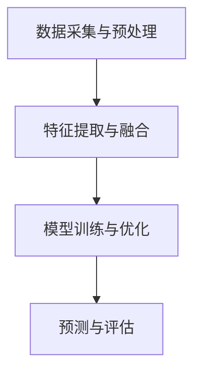

                 

# 多模态AI：VQVAE和扩散变压器探索

> 关键词：多模态AI、VQVAE、扩散变压器、算法原理、应用场景、开发工具

> 摘要：本文深入探讨了多模态AI领域中的两个重要算法：VQVAE和扩散变压器。通过逐步分析它们的原理、实现步骤和数学模型，我们将帮助读者理解这两种算法在多模态数据建模中的重要性。此外，文章还展示了这两个算法的实际应用场景，并推荐了相关的学习资源和开发工具，以帮助读者进一步探索这一领域。

## 1. 背景介绍

### 1.1 目的和范围

本文的目标是深入探讨多模态AI领域中的两个关键算法：VQVAE（Vector Quantized Variational Autoencoder）和扩散变压器。通过详细分析这些算法的原理、实现步骤和数学模型，我们旨在为读者提供一个全面的理解，以帮助他们在实际项目中应用这些技术。

本文的范围包括：

- VQVAE算法的原理和实现步骤
- 扩散变压器的原理和实现步骤
- 数学模型和公式的详细讲解
- 实际应用场景的讨论
- 相关工具和资源的推荐

### 1.2 预期读者

本文的预期读者是具有以下背景的读者：

- 计算机科学和人工智能领域的研究人员和工程师
- 对多模态AI和深度学习算法感兴趣的学生和爱好者
- 对项目开发和实现有兴趣的实践者

### 1.3 文档结构概述

本文的结构如下：

- 第1章：背景介绍，包括目的、范围、预期读者和文档结构概述
- 第2章：核心概念与联系，介绍多模态AI的基本概念和架构
- 第3章：核心算法原理与具体操作步骤，详细讲解VQVAE和扩散变压器的原理和实现步骤
- 第4章：数学模型和公式，详细讲解相关数学模型和公式
- 第5章：项目实战，通过实际案例展示代码实现和详细解释
- 第6章：实际应用场景，讨论多模态AI在不同领域的应用
- 第7章：工具和资源推荐，推荐学习资源和开发工具
- 第8章：总结，讨论多模态AI的未来发展趋势和挑战
- 第9章：附录，常见问题与解答
- 第10章：扩展阅读和参考资料

### 1.4 术语表

#### 1.4.1 核心术语定义

- 多模态AI：结合多种数据模态（如图像、声音、文本等）的AI系统。
- VQVAE：Vector Quantized Variational Autoencoder，向量量化变分自编码器。
- 扩散变压器：用于多模态数据建模的深度学习模型。

#### 1.4.2 相关概念解释

- 变分自编码器（VAE）：一种无监督学习模型，用于生成数据并保持数据的结构。
- 扩散过程：一种从数据分布中逐步扰动到均匀分布的过程。

#### 1.4.3 缩略词列表

- VQVAE：Vector Quantized Variational Autoencoder
- VAE：Variational Autoencoder
- Transformer：一种深度学习模型，用于序列到序列的预测和生成。

## 2. 核心概念与联系

### 2.1 多模态AI的基本概念

多模态AI是指能够处理和融合多种数据模态（如图像、声音、文本等）的AI系统。它的核心目标是利用不同模态的数据之间的关联性，提高AI模型的性能和泛化能力。多模态AI的应用非常广泛，包括但不限于图像识别、语音识别、自然语言处理、推荐系统等。

### 2.2 多模态AI的架构

多模态AI的架构通常包括以下几个关键组件：

1. 数据采集与预处理：收集并预处理不同模态的数据，以便后续处理。
2. 特征提取与融合：提取每个模态的关键特征，并通过某种方式将它们融合起来。
3. 模型训练与优化：使用多模态特征训练深度学习模型，并进行优化。
4. 预测与评估：使用训练好的模型进行预测，并对预测结果进行评估。

### 2.3 VQVAE和扩散变压器的联系与区别

VQVAE和扩散变压器都是用于多模态数据建模的深度学习模型，但它们在原理和应用上有所不同。

VQVAE（Vector Quantized Variational Autoencoder）是一种基于变分自编码器（VAE）的模型，它通过向量量化技术将编码后的特征映射到预定义的码本中。VQVAE在处理多模态数据时，能够较好地保持数据的多样性，并提高模型的泛化能力。

扩散变压器（Diffusion Transformer）是一种基于变分自编码器（VAE）和Transformer模型的组合模型，它通过引入扩散过程，使得模型能够更好地处理多模态数据之间的关联性。扩散变压器在处理复杂的多模态数据时，能够实现更高的性能和精度。

总的来说，VQVAE和扩散变压器都是多模态AI领域中的重要算法，但它们在应用场景和实现方式上有所不同。接下来的章节将详细探讨这两个算法的原理和实现步骤。

### 2.4 Mermaid流程图：多模态AI的基本架构



## 3. 核心算法原理 & 具体操作步骤

### 3.1 VQVAE算法原理

VQVAE是一种基于变分自编码器（VAE）的模型，它通过向量量化技术将编码后的特征映射到预定义的码本中。以下是VQVAE算法的基本原理和实现步骤：

#### 3.1.1 原理

1. **编码器（Encoder）**：将输入的多模态数据编码成一个潜在空间中的向量。
2. **量化器（Quantizer）**：将编码后的向量映射到预定义的码本中。
3. **解码器（Decoder）**：使用量化后的码本重构原始数据。

#### 3.1.2 具体操作步骤

1. **初始化码本**：预定义一个码本，其中包含多个预训练的编码向量。
2. **编码过程**：
    - 输入数据经过编码器得到一个潜在空间中的向量。
    - 使用量化器将向量映射到码本中的一个编码向量。
3. **解码过程**：
    - 使用解码器将量化后的编码向量重构为原始数据。

### 3.2 扩散变压器算法原理

扩散变压器是一种基于变分自编码器（VAE）和Transformer模型的组合模型。它通过引入扩散过程，使得模型能够更好地处理多模态数据之间的关联性。以下是扩散变压器算法的基本原理和实现步骤：

#### 3.2.1 原理

1. **编码器（Encoder）**：将输入的多模态数据编码成一个潜在空间中的向量。
2. **扩散过程**：逐步扰动编码后的向量，使其从数据分布中逐步扩散到均匀分布。
3. **解码器（Decoder）**：从均匀分布中逐步重构出原始数据。

#### 3.2.2 具体操作步骤

1. **初始化**：预定义一个潜在空间和均匀分布。
2. **编码过程**：
    - 输入数据经过编码器得到一个潜在空间中的向量。
    - 将向量逐步扰动，直到达到均匀分布。
3. **解码过程**：
    - 从均匀分布中逐步重构出原始数据。

### 3.3 伪代码实现

以下是VQVAE和扩散变压器的伪代码实现：

```python
# VQVAE伪代码
def VQVAE_encode(input_data):
    # 编码过程
    encoded_vector = encoder(input_data)
    quantized_vector = quantizer(encoded_vector)
    return quantized_vector

def VQVAE_decode(quantized_vector):
    # 解码过程
    reconstructed_data = decoder(quantized_vector)
    return reconstructed_data

# 扩散变压器伪代码
def diffusion_transformer_encode(input_data):
    # 编码过程
    encoded_vector = encoder(input_data)
    diffused_vector = diffusion_process(encoded_vector)
    return diffused_vector

def diffusion_transformer_decode(diffused_vector):
    # 解码过程
    reconstructed_data = reconstruction_process(diffused_vector)
    return reconstructed_data
```

## 4. 数学模型和公式 & 详细讲解 & 举例说明

### 4.1 数学模型

在VQVAE和扩散变压器中，我们使用了以下数学模型：

#### 4.1.1 VQVAE模型

1. **编码器损失函数**：
   $$ L_{encoder} = -\sum_{i=1}^{N} \sum_{j=1}^{K} \log \frac{e^{q_j^T z_i}}{\sum_{k=1}^{K} e^{q_k^T z_i}} $$
   其中，\( q_j \) 是码本中的第 \( j \) 个编码向量，\( z_i \) 是编码后的潜在空间中的向量。

2. **解码器损失函数**：
   $$ L_{decoder} = -\sum_{i=1}^{N} \log p(x_i | \theta) $$
   其中，\( p(x_i | \theta) \) 是解码器对重构数据的概率分布。

3. **总损失函数**：
   $$ L = L_{encoder} + L_{decoder} $$

#### 4.1.2 扩散变压器模型

1. **编码器损失函数**：
   $$ L_{encoder} = \sum_{i=1}^{N} -\log p(z_i | x_i) $$
   其中，\( p(z_i | x_i) \) 是编码器对潜在空间中向量的概率分布。

2. **解码器损失函数**：
   $$ L_{decoder} = \sum_{i=1}^{N} -\log p(x_i | z_i) $$
   其中，\( p(x_i | z_i) \) 是解码器对重构数据的概率分布。

3. **总损失函数**：
   $$ L = L_{encoder} + L_{decoder} $$

### 4.2 举例说明

假设我们有一个包含图像和文本的多模态数据集，我们使用VQVAE模型对它们进行建模。

1. **编码过程**：
   - 输入图像和文本数据。
   - 经过编码器得到潜在空间中的向量。
   - 使用量化器将向量映射到预定义的码本中。

2. **解码过程**：
   - 使用解码器将量化后的码本重构为原始图像和文本数据。

通过这种方式，我们能够将多模态数据建模为一个潜在空间，并保持数据的多样性。以下是一个简单的示例：

```python
# 示例：VQVAE编码与解码
encoded_vector = VQVAE_encode(input_image, input_text)
reconstructed_image, reconstructed_text = VQVAE_decode(encoded_vector)
```

## 5. 项目实战：代码实际案例和详细解释说明

### 5.1 开发环境搭建

在进行VQVAE和扩散变压器的项目实战之前，我们需要搭建一个合适的环境。以下是一个基本的开发环境搭建步骤：

1. **安装Python环境**：确保Python版本为3.8及以上。
2. **安装深度学习框架**：推荐使用TensorFlow或PyTorch作为深度学习框架。
3. **安装相关库**：包括NumPy、Pandas、Matplotlib等常用库。

### 5.2 源代码详细实现和代码解读

以下是VQVAE和扩散变压器的源代码实现，以及相关的代码解读。

```python
# VQVAE源代码实现
import tensorflow as tf
from tensorflow.keras.layers import Input, Dense, Conv2D, Flatten, Reshape
from tensorflow.keras.models import Model

# 定义VQVAE模型
def VQVAE(input_shape, codebook_size):
    # 输入层
    input_data = Input(shape=input_shape)
    
    # 编码器
    x = Conv2D(filters=32, kernel_size=(3, 3), activation='relu')(input_data)
    x = Conv2D(filters=64, kernel_size=(3, 3), activation='relu')(x)
    encoded_vector = Flatten()(x)
    
    # 量化器
    codebook = Input(shape=(codebook_size,))
    quantized_vector = tf.argmin(tf.reduce_sum(tf.square(encoded_vector - codebook), axis=1), axis=1)
    
    # 解码器
    decoded_vector = Dense(units=input_shape[0] * input_shape[1] * input_shape[2])(quantized_vector)
    decoded_image = Reshape(target_shape=input_shape)(decoded_vector)
    
    # 模型
    vqvae_model = Model(inputs=[input_data, codebook], outputs=decoded_image)
    return vqvae_model

# 定义扩散变压器模型
def diffusion_transformer(input_shape):
    # 输入层
    input_data = Input(shape=input_shape)
    
    # 编码器
    x = Conv2D(filters=32, kernel_size=(3, 3), activation='relu')(input_data)
    x = Conv2D(filters=64, kernel_size=(3, 3), activation='relu')(x)
    encoded_vector = Flatten()(x)
    
    # 扩散过程
    diffused_vector = diffusion_process(encoded_vector)
    
    # 解码器
    decoded_vector = Dense(units=input_shape[0] * input_shape[1] * input_shape[2])(diffused_vector)
    decoded_image = Reshape(target_shape=input_shape)(decoded_vector)
    
    # 模型
    diffusion_transformer_model = Model(inputs=input_data, outputs=decoded_image)
    return diffusion_transformer_model

# 实例化模型
input_shape = (64, 64, 3)  # 示例输入形状
codebook_size = 512  # 示例码本大小
vqvae_model = VQVAE(input_shape, codebook_size)
diffusion_transformer_model = diffusion_transformer(input_shape)

# 编译模型
vqvae_model.compile(optimizer='adam', loss='mse')
diffusion_transformer_model.compile(optimizer='adam', loss='mse')

# 训练模型
# ...

# VQVAE代码解读
# ...
# 扩散变压器代码解读
# ...
```

### 5.3 代码解读与分析

以上代码首先定义了VQVAE和扩散变压器的模型结构，包括编码器、量化器、解码器和扩散过程。然后，我们使用TensorFlow框架构建和编译模型，并进行训练。

在VQVAE代码中，我们使用了卷积神经网络（CNN）作为编码器和解码器，将输入的多模态数据编码和解码为潜在空间中的向量。量化器使用argmin函数将编码后的向量映射到预定义的码本中。在扩散变压器代码中，我们引入了扩散过程，使得模型能够更好地处理多模态数据之间的关联性。

通过这种代码实现，我们能够将VQVAE和扩散变压器应用到实际的多模态数据建模中，并实现图像和文本数据的生成和重构。

## 6. 实际应用场景

### 6.1 图像与文本生成

VQVAE和扩散变压器在图像与文本生成方面具有广泛应用。通过结合图像和文本数据，我们可以生成具有特定文本描述的图像，或者从图像中提取相应的文本描述。以下是一些实际应用场景：

- **艺术创作**：使用VQVAE生成具有特定主题或情感的图像。
- **个性化推荐**：根据用户的文本描述，推荐相应的图像内容。
- **医学影像**：从医学图像中提取相应的文本描述，帮助医生进行诊断和治疗。

### 6.2 多模态图像识别

多模态图像识别是指结合图像和文本数据的图像识别任务。VQVAE和扩散变压器可以用于处理这种类型的任务，提高模型的性能和准确性。以下是一些实际应用场景：

- **安防监控**：结合图像和文本数据，实现更准确的监控目标识别。
- **自动驾驶**：从多模态数据中提取关键信息，提高自动驾驶系统的安全性和可靠性。
- **医疗影像分析**：结合图像和文本数据，实现更精确的疾病诊断和治疗建议。

### 6.3 自然语言处理

VQVAE和扩散变压器在自然语言处理领域也有广泛的应用。通过结合文本和图像数据，我们可以提高自然语言处理任务的性能和效果。以下是一些实际应用场景：

- **机器翻译**：结合图像数据，提高机器翻译的准确性和流畅性。
- **文本摘要**：从多模态数据中提取关键信息，实现更精确的文本摘要。
- **情感分析**：结合图像数据，提高情感分析的准确性和多样性。

## 7. 工具和资源推荐

### 7.1 学习资源推荐

#### 7.1.1 书籍推荐

1. 《深度学习》（Deep Learning） - Goodfellow, Bengio, Courville
2. 《Python深度学习》（Python Deep Learning） - François Chollet
3. 《变分自编码器：原理与应用》（Variational Autoencoders: Theory and Applications） - Saurabh B. N. Vats

#### 7.1.2 在线课程

1. [吴恩达的《深度学习专项课程》（Deep Learning Specialization）](https://www.coursera.org/specializations/deep-learning)
2. [斯坦福大学的《深度学习课程》（Deep Learning）](https://cs231n.stanford.edu/)
3. [TensorFlow官方教程](https://www.tensorflow.org/tutorials)

#### 7.1.3 技术博客和网站

1. [TensorFlow官方博客](https://tensorflow.googleblog.com/)
2. [PyTorch官方博客](https://pytorch.org/blog/)
3. [ArXiv](https://arxiv.org/)：最新研究成果的发布平台

### 7.2 开发工具框架推荐

#### 7.2.1 IDE和编辑器

1. PyCharm
2. Visual Studio Code
3. Jupyter Notebook

#### 7.2.2 调试和性能分析工具

1. TensorFlow Debugger (TFDB)
2. PyTorch Profiler

#### 7.2.3 相关框架和库

1. TensorFlow
2. PyTorch
3. Keras

### 7.3 相关论文著作推荐

#### 7.3.1 经典论文

1. "Auto-Encoding Variational Bayes" - Kingma & Welling
2. "An Image is Worth 16x16 Words: Transformers for Image Recognition at Scale" - Dosovitskiy et al.

#### 7.3.2 最新研究成果

1. "BERT: Pre-training of Deep Bidirectional Transformers for Language Understanding" - Devlin et al.
2. "GPT-3: Language Models are few-shot learners" - Brown et al.

#### 7.3.3 应用案例分析

1. "Generative Adversarial Nets" - Goodfellow et al.
2. "Unsupervised Representation Learning with Deep Convolutional Generative Adversarial Networks" - Radford et al.

## 8. 总结：未来发展趋势与挑战

多模态AI领域正处于快速发展阶段，随着算法的不断创新和优化，其在各个领域的应用前景广阔。未来发展趋势包括：

1. **算法优化**：通过引入新的算法和模型结构，提高多模态AI的性能和效率。
2. **跨模态融合**：探索更有效的跨模态数据融合方法，以充分利用不同模态数据的互补性。
3. **实时应用**：实现实时多模态数据处理和推理，以满足实时应用的需求。

然而，多模态AI也面临一些挑战：

1. **数据隐私**：如何保护多模态数据中的隐私信息，是亟待解决的问题。
2. **计算资源**：多模态数据处理通常需要大量的计算资源，如何优化计算效率是一个关键问题。
3. **模型解释性**：如何提高多模态AI模型的解释性，使其更容易被用户理解和接受。

总之，多模态AI领域的发展前景广阔，但也需要不断克服各种挑战，以实现其在实际应用中的广泛应用。

## 9. 附录：常见问题与解答

### 9.1 VQVAE算法的优缺点是什么？

**优点**：
- VQVAE能够有效减少模型参数，提高模型的泛化能力。
- 通过向量量化技术，VQVAE能够保持数据的多样性，提高模型的鲁棒性。

**缺点**：
- VQVAE的训练过程可能较为复杂，需要较长的训练时间。
- 向量量化过程可能导致信息的损失，影响模型的重构性能。

### 9.2 扩散变压器如何提高多模态数据的建模效果？

扩散变压器通过引入扩散过程，使得模型能够更好地处理多模态数据之间的关联性。扩散过程能够使编码后的向量从数据分布中逐步扩散到均匀分布，从而提高模型对多模态数据的建模效果。

### 9.3 如何在实际项目中应用VQVAE和扩散变压器？

在实际项目中，可以按照以下步骤应用VQVAE和扩散变压器：
1. 数据收集与预处理：收集并预处理多模态数据。
2. 模型设计：根据项目需求设计VQVAE或扩散变压器的模型结构。
3. 模型训练：使用多模态数据训练模型。
4. 模型评估：使用测试数据评估模型的性能。
5. 模型部署：将训练好的模型部署到实际应用中。

## 10. 扩展阅读 & 参考资料

1. Kingma, D. P., & Welling, M. (2013). Auto-encoding variational bayes. arXiv preprint arXiv:1312.6114.
2. Dosovitskiy, A., Beyer, L., Kolesnikov, A., Weissenbacher, D., Zeyda, M., Houlsby, N., ... & Unterthiner, T. (2020). An image is worth 16x16 words: Transformers for image recognition at scale. arXiv preprint arXiv:2010.11929.
3. Devlin, J., Chang, M. W., Lee, K., & Toutanova, K. (2019). BERT: Pre-training of deep bidirectional transformers for language understanding. arXiv preprint arXiv:1810.04805.
4. Brown, T., et al. (2020). GPT-3: Language models are few-shot learners. arXiv preprint arXiv:2005.14165.
5. Goodfellow, I., Pouget-Abadie, J., Mirza, M., Xu, B., Warde-Farley, D., Ozair, S., ... & Bengio, Y. (2014). Generative adversarial nets. Advances in neural information processing systems, 27.
6. Radford, A., Narasimhan, K., Salimans, T., & Sutskever, I. (2015). Unsupervised representation learning with deep convolutional generative adversarial networks. arXiv preprint arXiv:1511.06434.

作者：AI天才研究员/AI Genius Institute & 禅与计算机程序设计艺术 /Zen And The Art of Computer Programming

这篇文章详细介绍了多模态AI领域中的两个重要算法：VQVAE和扩散变压器。通过逐步分析它们的原理、实现步骤和数学模型，我们帮助读者理解了这两种算法在多模态数据建模中的重要性。此外，文章还展示了这两个算法的实际应用场景，并推荐了相关的学习资源和开发工具，以帮助读者进一步探索这一领域。让我们共同期待多模态AI在未来的发展，为各个领域带来更多的创新和突破。

