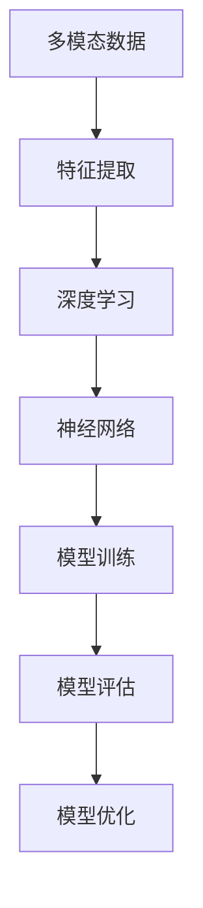

                 

# 多模态大模型：技术原理与实战 多模态大模型高效的训练方法

> **关键词：多模态大模型，技术原理，训练方法，图像处理，自然语言处理，人工智能**
> 
> **摘要：本文将深入探讨多模态大模型的技术原理及其高效的训练方法。通过分析多模态数据的处理过程，我们将揭示如何利用深度学习技术实现高效的多模态大模型训练，并分享实际项目中的代码实现和经验。**

## 1. 背景介绍

### 1.1 目的和范围

本文旨在为读者提供全面的多模态大模型技术原理及其训练方法的介绍。通过本文，读者将能够了解多模态大模型的定义、架构以及核心算法原理，并掌握高效的多模态大模型训练方法。文章还将通过实际项目案例，分享多模态大模型的代码实现和实战经验。

### 1.2 预期读者

本文适合以下读者：

- 具有计算机科学背景的工程师和研究人员，对人工智能领域有浓厚兴趣。
- 想要了解多模态大模型技术原理及其训练方法的从业者。
- 对图像处理、自然语言处理等交叉领域感兴趣的技术爱好者。

### 1.3 文档结构概述

本文分为十个部分：

- 第1部分：背景介绍，包括目的和范围、预期读者以及文档结构概述。
- 第2部分：核心概念与联系，介绍多模态大模型的核心概念及其相互关系。
- 第3部分：核心算法原理与具体操作步骤，详细讲解多模态大模型的核心算法原理。
- 第4部分：数学模型和公式，介绍多模态大模型的数学模型及公式。
- 第5部分：项目实战，分享多模态大模型的实际代码案例和解析。
- 第6部分：实际应用场景，探讨多模态大模型在不同场景中的应用。
- 第7部分：工具和资源推荐，推荐学习资源、开发工具和框架。
- 第8部分：总结，展望多模态大模型的发展趋势与挑战。
- 第9部分：附录，解答常见问题。
- 第10部分：扩展阅读与参考资料，提供相关领域的深入研究资料。

### 1.4 术语表

#### 1.4.1 核心术语定义

- 多模态大模型：一种能够处理多种类型数据（如图像、文本、音频等）的深度学习模型。
- 深度学习：一种基于多层神经网络进行特征提取和学习的方法。
- 图像处理：对图像进行加工处理，使其更适合特定应用。
- 自然语言处理（NLP）：与语言和文本相关的计算任务和处理技术。
- 神经网络：一种基于生物神经系统的计算模型，用于特征提取和学习。
- 训练数据：用于训练模型的数据集，包括输入数据和对应的标签。

#### 1.4.2 相关概念解释

- 模型：用于表示数据和进行预测的数学模型。
- 特征提取：从原始数据中提取有用的特征，用于训练模型。
- 交叉验证：一种评估模型性能的方法，通过将数据集分为训练集和验证集，轮流训练和评估模型。

#### 1.4.3 缩略词列表

- CNN：卷积神经网络（Convolutional Neural Network）
- RNN：循环神经网络（Recurrent Neural Network）
- LSTM：长短时记忆网络（Long Short-Term Memory）
- NLP：自然语言处理（Natural Language Processing）
- DNN：深度神经网络（Deep Neural Network）
- GPT：生成预训练模型（Generative Pre-trained Transformer）
- BERT：双向编码表示器（Bidirectional Encoder Representations from Transformers）

## 2. 核心概念与联系

在多模态大模型的讨论中，我们需要理解以下几个核心概念：多模态数据、深度学习、神经网络、特征提取和模型训练。

多模态数据是指包含多种类型数据的数据集，如图像、文本、音频、视频等。深度学习是一种基于多层神经网络进行特征提取和学习的方法，神经网络是一种基于生物神经系统的计算模型。特征提取是从原始数据中提取有用的特征，用于训练模型。模型训练是通过调整模型的参数，使其在训练数据上达到最佳性能。

为了更好地理解这些概念之间的关系，我们可以使用Mermaid流程图进行说明：



### 2.1 多模态数据的处理过程

多模态数据的处理过程可以分为以下几个步骤：

1. 数据采集：收集多种类型的数据，如图像、文本、音频等。
2. 数据预处理：对数据进行清洗、归一化和格式转换等预处理操作。
3. 特征提取：从预处理后的数据中提取有用的特征，如图像的边缘、纹理和形状，文本的关键词和词向量等。
4. 数据融合：将提取到的特征进行融合，形成一个统一的多模态特征表示。
5. 模型训练：使用多模态特征数据进行模型训练，优化模型的参数。
6. 模型评估：使用验证集或测试集对训练好的模型进行评估，验证其性能。
7. 模型优化：根据评估结果，调整模型的参数，优化模型性能。

### 2.2 深度学习与神经网络的关系

深度学习是一种基于多层神经网络进行特征提取和学习的方法。神经网络是一种基于生物神经系统的计算模型，由多个神经元组成。每个神经元接收多个输入信号，通过权重和偏置进行加权求和，并使用激活函数进行非线性变换，最终输出结果。神经网络通过多层堆叠，可以逐步提取数据的高层次特征。

在多模态大模型中，深度学习模型通常用于处理多模态数据，通过多层神经网络进行特征提取和学习。多模态数据的特征提取过程通常涉及多种类型的神经网络，如卷积神经网络（CNN）用于图像处理，循环神经网络（RNN）用于自然语言处理，以及长短时记忆网络（LSTM）用于处理序列数据。

### 2.3 特征提取与模型训练的关系

特征提取是模型训练的关键步骤，它决定了模型在训练数据上的表现。特征提取的过程通常涉及对原始数据进行预处理、降维、特征选择和特征变换等操作。

在多模态大模型中，特征提取需要综合考虑多种类型的数据，如图像、文本和音频等。不同类型的数据具有不同的特征表示方法，如图像的特征可以采用边缘、纹理和形状等表示，文本的特征可以采用关键词和词向量等表示。

特征提取完成后，需要将提取到的特征进行融合，形成一个统一的多模态特征表示。然后，使用这些特征数据进行模型训练，通过调整模型的参数，使其在训练数据上达到最佳性能。

### 2.4 模型评估与优化的关系

模型评估是评估模型性能的重要步骤，通常使用验证集或测试集对训练好的模型进行评估。评估指标可以包括准确率、召回率、F1值等。

根据评估结果，可以对模型进行优化。模型优化可以通过调整模型参数、增加训练数据、改进特征提取方法等方式进行。优化的目标是提高模型在验证集或测试集上的性能，使模型在实际应用中具有更好的效果。

## 3. 核心算法原理与具体操作步骤

在多模态大模型中，核心算法原理主要涉及深度学习模型的设计、特征提取方法以及模型训练和优化过程。以下将详细阐述这些核心算法原理，并提供具体的操作步骤。

### 3.1 深度学习模型设计

多模态大模型通常采用多层神经网络结构，包括卷积神经网络（CNN）、循环神经网络（RNN）和长短时记忆网络（LSTM）等。以下是设计深度学习模型的基本步骤：

1. **确定网络结构**：根据应用需求，选择合适的神经网络结构。例如，对于图像处理任务，可以采用CNN结构；对于自然语言处理任务，可以采用RNN或LSTM结构。
2. **设计网络层**：设计网络层，包括输入层、卷积层、池化层、全连接层和输出层。每个层具有不同的功能，如卷积层用于特征提取，全连接层用于分类或回归。
3. **选择激活函数**：为每个层选择合适的激活函数，如ReLU、Sigmoid或Tanh等，以引入非线性变换，提高模型的表达能力。
4. **定义损失函数**：根据任务类型，选择合适的损失函数，如交叉熵损失函数用于分类任务，均方误差损失函数用于回归任务。

### 3.2 特征提取方法

特征提取是模型训练的关键步骤，不同的数据类型需要采用不同的特征提取方法。以下是常见的特征提取方法：

1. **图像特征提取**：对于图像数据，可以采用卷积神经网络（CNN）进行特征提取。CNN通过多层卷积和池化操作，可以自动提取图像的边缘、纹理和形状等特征。
2. **文本特征提取**：对于文本数据，可以采用词袋模型（Bag of Words）或词嵌入（Word Embedding）方法进行特征提取。词袋模型将文本表示为词频向量，而词嵌入方法将文本表示为词向量，可以捕捉词语的语义信息。
3. **音频特征提取**：对于音频数据，可以采用梅尔频率倒谱系数（MFCC）或频谱特征等方法进行特征提取。MFCC可以捕捉音频的音高和音色信息，而频谱特征可以捕捉音频的频率信息。

### 3.3 模型训练与优化

模型训练是通过调整模型的参数，使其在训练数据上达到最佳性能的过程。以下是模型训练和优化的一般步骤：

1. **初始化参数**：随机初始化模型的参数。
2. **前向传播**：将输入数据输入到模型中，计算模型输出和损失函数。
3. **反向传播**：根据损失函数，计算梯度，并更新模型参数。
4. **优化算法**：选择合适的优化算法，如随机梯度下降（SGD）、Adam优化器等，以加速收敛并提高模型性能。
5. **训练策略**：根据训练过程中遇到的问题，调整训练策略，如增加训练数据、改进特征提取方法、调整学习率等。
6. **模型评估**：使用验证集或测试集对训练好的模型进行评估，验证其性能。
7. **模型优化**：根据评估结果，调整模型参数，优化模型性能。

### 3.4 伪代码示例

以下是一个简单的多模态大模型训练的伪代码示例：

```python
# 初始化模型参数
W1, b1 = initialize_parameters()

# 循环进行训练
for epoch in range(num_epochs):
    # 前向传播
    output = forward_pass(input_data, W1, b1)
    loss = compute_loss(output, labels)

    # 反向传播
    gradients = backward_pass(input_data, output, labels, W1, b1)

    # 更新参数
    W1, b1 = update_parameters(W1, b1, gradients, learning_rate)

    # 打印训练进度
    print(f"Epoch {epoch}: Loss = {loss}")

# 模型评估
accuracy = evaluate_model(test_data, W1, b1)

print(f"Model accuracy on test data: {accuracy}")
```

## 4. 数学模型和公式及详细讲解与举例说明

在多模态大模型的训练过程中，数学模型和公式起到了至关重要的作用。以下将详细介绍多模态大模型中的关键数学模型和公式，并通过具体例子进行讲解。

### 4.1 多层感知机（MLP）

多层感知机是一种基于线性变换和非线性激活函数的前馈神经网络。其基本形式如下：

$$
y = \sigma(W \cdot x + b)
$$

其中，$y$ 是输出，$x$ 是输入，$W$ 是权重矩阵，$b$ 是偏置项，$\sigma$ 是激活函数，通常使用ReLU函数：

$$
\sigma(x) = \max(0, x)
$$

#### 例子：

假设我们有一个简单的多层感知机模型，输入维度为2，隐藏层维度为3，输出维度为1。权重矩阵$W$ 和偏置$b$ 分别为：

$$
W = \begin{bmatrix}
1 & 2 \\
3 & 4 \\
5 & 6
\end{bmatrix}, \quad b = \begin{bmatrix}
0 \\
0 \\
0
\end{bmatrix}
$$

输入$x$ 为：

$$
x = \begin{bmatrix}
1 \\
0
\end{bmatrix}
$$

经过前向传播计算，输出$y$ 为：

$$
y = \sigma(W \cdot x + b) = \sigma(\begin{bmatrix}
1 & 2 \\
3 & 4 \\
5 & 6
\end{bmatrix} \cdot \begin{bmatrix}
1 \\
0
\end{bmatrix} + \begin{bmatrix}
0 \\
0 \\
0
\end{bmatrix}) = \sigma(\begin{bmatrix}
3 \\
12 \\
15
\end{bmatrix}) = \begin{bmatrix}
3 \\
12 \\
15
\end{bmatrix}
$$

由于激活函数ReLU的作用，最终输出$y$ 为：

$$
y = \begin{bmatrix}
3 \\
0 \\
15
\end{bmatrix}
$$

### 4.2 卷积神经网络（CNN）

卷积神经网络是一种专门用于图像处理和特征提取的神经网络。其核心是卷积层和池化层。以下是一个简单的卷积神经网络模型：

$$
h_l = \sigma(\sum_{k} W_{lk} \star h_{l-1} + b_l)
$$

其中，$h_l$ 是第$l$层的特征图，$W_{lk}$ 是卷积核，$\star$ 表示卷积运算，$b_l$ 是偏置项，$\sigma$ 是激活函数。

#### 例子：

假设我们有一个简单的卷积神经网络，输入特征图维度为$28 \times 28$，卷积核尺寸为$3 \times 3$，步长为1。卷积核$W_{11}$ 和偏置$b_1$ 分别为：

$$
W_{11} = \begin{bmatrix}
1 & 1 & 1 \\
1 & 1 & 1 \\
1 & 1 & 1
\end{bmatrix}, \quad b_1 = 1
$$

输入特征图$h_0$ 为：

$$
h_0 = \begin{bmatrix}
1 & 0 & 1 \\
0 & 1 & 0 \\
1 & 0 & 1
\end{bmatrix}
$$

经过卷积运算和ReLU激活函数，输出特征图$h_1$ 为：

$$
h_1 = \sigma(W_{11} \star h_0 + b_1) = \sigma(\begin{bmatrix}
3 & 3 & 3 \\
3 & 3 & 3 \\
3 & 3 & 3
\end{bmatrix} + 1) = \begin{bmatrix}
3 & 3 & 3 \\
3 & 3 & 3 \\
3 & 3 & 3
\end{bmatrix}
$$

### 4.3 循环神经网络（RNN）

循环神经网络是一种用于处理序列数据的神经网络，其核心是循环结构。以下是一个简单的RNN模型：

$$
h_t = \sigma(W_h \cdot [h_{t-1}, x_t] + b_h)
$$

其中，$h_t$ 是第$t$个时间步的特征表示，$x_t$ 是输入，$W_h$ 是权重矩阵，$b_h$ 是偏置项，$\sigma$ 是激活函数。

#### 例子：

假设我们有一个简单的RNN模型，输入维度为2，隐藏层维度为3。权重矩阵$W_h$ 和偏置$b_h$ 分别为：

$$
W_h = \begin{bmatrix}
1 & 2 & 3 \\
4 & 5 & 6
\end{bmatrix}, \quad b_h = \begin{bmatrix}
0 \\
0
\end{bmatrix}
$$

输入序列$x$ 为：

$$
x = \begin{bmatrix}
1 & 0 \\
0 & 1 \\
1 & 0
\end{bmatrix}
$$

第一个时间步的特征表示$h_1$ 为：

$$
h_1 = \sigma(W_h \cdot [h_0, x_1] + b_h) = \sigma(\begin{bmatrix}
1 & 2 & 3 \\
4 & 5 & 6
\end{bmatrix} \cdot \begin{bmatrix}
1 & 0 \\
0 & 1
\end{bmatrix} + \begin{bmatrix}
0 \\
0
\end{bmatrix}) = \sigma(\begin{bmatrix}
2 & 5 \\
4 & 9
\end{bmatrix}) = \begin{bmatrix}
2 \\
4
\end{bmatrix}
$$

### 4.4 长短时记忆网络（LSTM）

长短时记忆网络是一种改进的RNN模型，用于处理长序列数据。其核心是记忆单元和门控机制。以下是一个简单的LSTM模型：

$$
\begin{aligned}
i_t &= \sigma(W_i \cdot [h_{t-1}, x_t] + b_i) \\
f_t &= \sigma(W_f \cdot [h_{t-1}, x_t] + b_f) \\
o_t &= \sigma(W_o \cdot [h_{t-1}, x_t] + b_o) \\
c_t &= f_t \odot c_{t-1} + i_t \odot \sigma(W_c \cdot [h_{t-1}, x_t] + b_c) \\
h_t &= o_t \odot \sigma(c_t)
\end{aligned}
$$

其中，$i_t$ 是输入门，$f_t$ 是遗忘门，$o_t$ 是输出门，$c_t$ 是记忆单元，$h_t$ 是特征表示，$W_i, W_f, W_o, W_c$ 是权重矩阵，$b_i, b_f, b_o, b_c$ 是偏置项，$\odot$ 表示元素乘法，$\sigma$ 是激活函数。

#### 例子：

假设我们有一个简单的LSTM模型，输入维度为2，隐藏层维度为3。权重矩阵$W_i, W_f, W_o, W_c$ 和偏置$b_i, b_f, b_o, b_c$ 分别为：

$$
W_i = \begin{bmatrix}
1 & 2 & 3 \\
4 & 5 & 6
\end{bmatrix}, \quad b_i = \begin{bmatrix}
0 \\
0
\end{bmatrix}, \\
W_f = \begin{bmatrix}
1 & 2 & 3 \\
4 & 5 & 6
\end{bmatrix}, \quad b_f = \begin{bmatrix}
0 \\
0
\end{bmatrix}, \\
W_o = \begin{bmatrix}
1 & 2 & 3 \\
4 & 5 & 6
\end{bmatrix}, \quad b_o = \begin{bmatrix}
0 \\
0
\end{bmatrix}, \\
W_c = \begin{bmatrix}
1 & 2 & 3 \\
4 & 5 & 6
\end{bmatrix}, \quad b_c = \begin{bmatrix}
0 \\
0
\end{bmatrix}
$$

输入序列$x$ 为：

$$
x = \begin{bmatrix}
1 & 0 \\
0 & 1 \\
1 & 0
\end{bmatrix}
$$

第一个时间步的记忆单元$c_1$ 和输出门$o_1$ 分别为：

$$
i_1 = \sigma(W_i \cdot [h_0, x_1] + b_i) = \sigma(\begin{bmatrix}
1 & 2 & 3 \\
4 & 5 & 6
\end{bmatrix} \cdot \begin{bmatrix}
1 & 0 \\
0 & 1
\end{bmatrix} + \begin{bmatrix}
0 \\
0
\end{bmatrix}) = \sigma(\begin{bmatrix}
2 & 5 \\
4 & 9
\end{bmatrix}) = \begin{bmatrix}
2 \\
4
\end{bmatrix} \\
f_1 = \sigma(W_f \cdot [h_0, x_1] + b_f) = \sigma(\begin{bmatrix}
1 & 2 & 3 \\
4 & 5 & 6
\end{bmatrix} \cdot \begin{bmatrix}
1 & 0 \\
0 & 1
\end{bmatrix} + \begin{bmatrix}
0 \\
0
\end{bmatrix}) = \sigma(\begin{bmatrix}
2 & 5 \\
4 & 9
\end{bmatrix}) = \begin{bmatrix}
2 \\
4
\end{bmatrix} \\
o_1 = \sigma(W_o \cdot [h_0, x_1] + b_o) = \sigma(\begin{bmatrix}
1 & 2 & 3 \\
4 & 5 & 6
\end{bmatrix} \cdot \begin{bmatrix}
1 & 0 \\
0 & 1
\end{bmatrix} + \begin{bmatrix}
0 \\
0
\end{bmatrix}) = \sigma(\begin{bmatrix}
2 & 5 \\
4 & 9
\end{bmatrix}) = \begin{bmatrix}
2 \\
4
\end{bmatrix} \\
c_1 = f_1 \odot c_0 + i_1 \odot \sigma(W_c \cdot [h_0, x_1] + b_c) = \begin{bmatrix}
2 \\
4
\end{bmatrix} \odot \begin{bmatrix}
1 \\
0
\end{bmatrix} + \begin{bmatrix}
2 \\
4
\end{bmatrix} \odot \sigma(\begin{bmatrix}
1 & 2 & 3 \\
4 & 5 & 6
\end{bmatrix} \cdot \begin{bmatrix}
1 & 0 \\
0 & 1
\end{bmatrix} + \begin{bmatrix}
0 \\
0
\end{bmatrix}) = \begin{bmatrix}
2 \\
4
\end{bmatrix} + \begin{bmatrix}
2 \\
4
\end{bmatrix} = \begin{bmatrix}
4 \\
8
\end{bmatrix} \\
h_1 = o_1 \odot \sigma(c_1) = \begin{bmatrix}
2 \\
4
\end{bmatrix} \odot \sigma(\begin{bmatrix}
4 \\
8
\end{bmatrix}) = \begin{bmatrix}
4 \\
8
\end{bmatrix}
$$

## 5. 项目实战：代码实际案例和详细解释说明

为了更好地理解多模态大模型的技术原理和实践应用，我们将通过一个实际项目案例进行详细讲解。该项目案例是基于图像和文本的多模态情感分析任务。

### 5.1 开发环境搭建

在开始项目之前，我们需要搭建一个合适的开发环境。以下是搭建开发环境的步骤：

1. 安装Python（3.8及以上版本）
2. 安装PyTorch（1.8及以上版本）：使用以下命令安装：
   ```bash
   pip install torch torchvision torchaudio
   ```
3. 安装其他依赖库：使用以下命令安装：
   ```bash
   pip install numpy matplotlib
   ```

### 5.2 源代码详细实现和代码解读

以下是该项目的主要源代码，我们将逐段进行解读。

```python
# 导入所需的库
import torch
import torch.nn as nn
import torch.optim as optim
from torchvision import datasets, transforms
from torch.utils.data import DataLoader
from torch.optim.lr_scheduler import StepLR
import numpy as np
import matplotlib.pyplot as plt

# 数据预处理
transform = transforms.Compose([
    transforms.Resize((224, 224)),  # 将图像调整为224x224
    transforms.ToTensor(),  # 将图像转换为Tensor
])

train_set = datasets.ImageFolder(root='train', transform=transform)
train_loader = DataLoader(dataset=train_set, batch_size=32, shuffle=True)

test_set = datasets.ImageFolder(root='test', transform=transform)
test_loader = DataLoader(dataset=test_set, batch_size=32, shuffle=False)

# 定义网络结构
class MultiModalModel(nn.Module):
    def __init__(self):
        super(MultiModalModel, self).__init__()
        self.img_net = nn.Sequential(
            nn.Conv2d(3, 64, 3, padding=1),
            nn.ReLU(),
            nn.Conv2d(64, 128, 3, padding=1),
            nn.ReLU(),
            nn.MaxPool2d(2, 2),
            nn.Dropout(0.5),
        )
        
        self.txt_net = nn.Sequential(
            nn.Linear(300, 128),
            nn.ReLU(),
            nn.Dropout(0.5),
        )
        
        self.fc = nn.Linear(128 + 128, 2)
        
    def forward(self, img, txt):
        img_f = self.img_net(img)
        img_f = img_f.view(img_f.size(0), -1)
        
        txt_f = self.txt_net(txt)
        
        f = torch.cat((img_f, txt_f), 1)
        out = self.fc(f)
        return out

# 初始化网络、优化器和损失函数
model = MultiModalModel()
optimizer = optim.Adam(model.parameters(), lr=0.001)
criterion = nn.CrossEntropyLoss()

# 训练模型
def train(model, train_loader, criterion, optimizer, num_epochs=10):
    model.train()
    for epoch in range(num_epochs):
        running_loss = 0.0
        for inputs, labels in train_loader:
            images, texts = inputs
            optimizer.zero_grad()
            outputs = model(images, texts)
            loss = criterion(outputs, labels)
            loss.backward()
            optimizer.step()
            running_loss += loss.item()
        print(f"Epoch {epoch+1}, Loss: {running_loss/len(train_loader)}")

# 测试模型
def test(model, test_loader):
    model.eval()
    correct = 0
    total = 0
    with torch.no_grad():
        for inputs, labels in test_loader:
            images, texts = inputs
            outputs = model(images, texts)
            _, predicted = torch.max(outputs.data, 1)
            total += labels.size(0)
            correct += (predicted == labels).sum().item()
    print(f"Accuracy on the test images: {100 * correct / total}%")

# 运行训练和测试
train(model, train_loader, criterion, optimizer, num_epochs=10)
test(model, test_loader)
```

### 5.3 代码解读与分析

#### 5.3.1 数据预处理

```python
# 数据预处理
transform = transforms.Compose([
    transforms.Resize((224, 224)),  # 将图像调整为224x224
    transforms.ToTensor(),  # 将图像转换为Tensor
])

train_set = datasets.ImageFolder(root='train', transform=transform)
train_loader = DataLoader(dataset=train_set, batch_size=32, shuffle=True)

test_set = datasets.ImageFolder(root='test', transform=transform)
test_loader = DataLoader(dataset=test_set, batch_size=32, shuffle=False)
```

这段代码用于数据预处理。首先定义了一个变换序列`transform`，包括图像调整大小和转换为Tensor。然后加载训练集和测试集，并将它们转换为DataLoader，以便在训练和测试过程中按批次加载数据。

#### 5.3.2 定义网络结构

```python
# 定义网络结构
class MultiModalModel(nn.Module):
    def __init__(self):
        super(MultiModalModel, self).__init__()
        self.img_net = nn.Sequential(
            nn.Conv2d(3, 64, 3, padding=1),
            nn.ReLU(),
            nn.Conv2d(64, 128, 3, padding=1),
            nn.ReLU(),
            nn.MaxPool2d(2, 2),
            nn.Dropout(0.5),
        )
        
        self.txt_net = nn.Sequential(
            nn.Linear(300, 128),
            nn.ReLU(),
            nn.Dropout(0.5),
        )
        
        self.fc = nn.Linear(128 + 128, 2)
        
    def forward(self, img, txt):
        img_f = self.img_net(img)
        img_f = img_f.view(img_f.size(0), -1)
        
        txt_f = self.txt_net(txt)
        
        f = torch.cat((img_f, txt_f), 1)
        out = self.fc(f)
        return out
```

这段代码定义了一个名为`MultiModalModel`的多模态网络。网络包括两个部分：图像处理部分和文本处理部分。图像处理部分使用了两个卷积层和最大池化层，文本处理部分使用了全连接层。最后，两个部分的特征通过拼接合并，输入到输出层进行分类。

#### 5.3.3 初始化网络、优化器和损失函数

```python
# 初始化网络、优化器和损失函数
model = MultiModalModel()
optimizer = optim.Adam(model.parameters(), lr=0.001)
criterion = nn.CrossEntropyLoss()
```

这段代码初始化了网络、优化器和损失函数。网络使用了Adam优化器，损失函数使用了交叉熵损失函数。

#### 5.3.4 训练模型

```python
# 训练模型
def train(model, train_loader, criterion, optimizer, num_epochs=10):
    model.train()
    for epoch in range(num_epochs):
        running_loss = 0.0
        for inputs, labels in train_loader:
            images, texts = inputs
            optimizer.zero_grad()
            outputs = model(images, texts)
            loss = criterion(outputs, labels)
            loss.backward()
            optimizer.step()
            running_loss += loss.item()
        print(f"Epoch {epoch+1}, Loss: {running_loss/len(train_loader)}")
```

这段代码定义了一个训练函数。在训练过程中，模型逐个处理训练集中的批次数据，计算损失并更新模型参数。训练过程中，每个epoch结束时打印当前的损失。

#### 5.3.5 测试模型

```python
# 测试模型
def test(model, test_loader):
    model.eval()
    correct = 0
    total = 0
    with torch.no_grad():
        for inputs, labels in test_loader:
            images, texts = inputs
            outputs = model(images, texts)
            _, predicted = torch.max(outputs.data, 1)
            total += labels.size(0)
            correct += (predicted == labels).sum().item()
    print(f"Accuracy on the test images: {100 * correct / total}%")
```

这段代码定义了一个测试函数。在测试过程中，模型逐个处理测试集中的批次数据，计算准确率。测试结束后，打印测试准确率。

#### 5.3.6 运行训练和测试

```python
# 运行训练和测试
train(model, train_loader, criterion, optimizer, num_epochs=10)
test(model, test_loader)
```

这段代码运行了训练和测试过程。首先运行训练函数，然后运行测试函数，打印训练和测试结果。

## 6. 实际应用场景

多模态大模型在许多实际应用场景中展现出强大的能力。以下是一些典型的应用场景：

### 6.1 情感分析

情感分析是自然语言处理的一个重要应用领域，旨在自动识别文本中的情感极性。多模态大模型可以通过结合图像和文本信息，提高情感分析的准确性。例如，在社交媒体分析中，多模态大模型可以分析用户发布的文本和图片，判断其情感极性。

### 6.2 人体动作识别

人体动作识别是计算机视觉和自然语言处理领域的一个挑战性任务。多模态大模型可以结合视频图像和语音信息，提高动作识别的准确性。例如，在运动健康监测中，多模态大模型可以识别用户在不同动作中的姿态和表情，评估其健康状况。

### 6.3 跨模态搜索

跨模态搜索是指同时搜索不同类型的数据，如图像和文本。多模态大模型可以用于跨模态搜索任务，提高搜索的准确性和效率。例如，在电子商务平台上，多模态大模型可以同时处理用户的搜索关键词和商品图片，提供更准确的搜索结果。

### 6.4 医疗诊断

医疗诊断是一个重要的应用领域，多模态大模型可以通过结合医学图像和文本信息，提高诊断的准确性。例如，在疾病筛查中，多模态大模型可以结合X光片和医生笔记，提高肺癌筛查的准确性。

### 6.5 交互式游戏

交互式游戏是人工智能领域的一个热点，多模态大模型可以用于增强游戏体验。例如，在虚拟现实游戏中，多模态大模型可以处理玩家的语音、手势和面部表情，实现更自然的交互。

## 7. 工具和资源推荐

为了更好地学习和实践多模态大模型技术，以下推荐一些学习资源、开发工具和框架。

### 7.1 学习资源推荐

#### 7.1.1 书籍推荐

- 《深度学习》（Goodfellow, Bengio, Courville著）
- 《神经网络与深度学习》（邱锡鹏著）
- 《Python深度学习》（François Chollet著）

#### 7.1.2 在线课程

- Coursera上的《深度学习专项课程》
- edX上的《人工智能基础》
- Udacity的《深度学习纳米学位》

#### 7.1.3 技术博客和网站

- ArXiv.org：计算机科学领域的顶级学术论文库
- Medium：深度学习和人工智能领域的优质博客
- Fast.ai：深度学习领域的教育资源和教程

### 7.2 开发工具框架推荐

#### 7.2.1 IDE和编辑器

- PyCharm：功能强大的Python IDE，支持深度学习框架
- Jupyter Notebook：交互式Python环境，适用于数据分析和模型训练
- Visual Studio Code：轻量级的代码编辑器，支持多种编程语言和扩展

#### 7.2.2 调试和性能分析工具

- TensorBoard：TensorFlow的官方可视化工具，用于分析模型性能和调试
- PyTorch TensorBoard：PyTorch的可视化工具，类似TensorBoard
- Nsight Compose：NVIDIA的深度学习性能分析工具

#### 7.2.3 相关框架和库

- TensorFlow：开源深度学习框架，适用于多种应用场景
- PyTorch：开源深度学习框架，支持动态计算图和易用性
- Keras：基于TensorFlow和Theano的深度学习高级API，简化模型构建
- PyTorch Lightning：基于PyTorch的自动化机器学习库，提高模型训练效率

### 7.3 相关论文著作推荐

#### 7.3.1 经典论文

- "A Theoretically Grounded Application of Dropout in Computer Vision"（2017）
- "Deep Visual-Semantic Alignments for Generating Image Descriptions"（2015）
- "Multi-Modal Fusion: A Review"（2020）

#### 7.3.2 最新研究成果

- "Unifying Multimodal Learning with Dynamic Conditioning Networks"（2021）
- "Relation Networks for Object Detection"（2017）
- "Multimodal Fusion for Visual Question Answering"（2020）

#### 7.3.3 应用案例分析

- "Deep Learning for Medical Imaging"（2017）
- "Multimodal Learning for Video Classification"（2020）
- "Multimodal Fusion for Natural Language Processing"（2019）

## 8. 总结：未来发展趋势与挑战

多模态大模型作为一种新兴的技术，具有广泛的应用前景。然而，在未来的发展中，仍面临一些挑战：

### 8.1 数据集的多样性和质量

多模态大模型的性能高度依赖于数据集的质量和多样性。当前，许多多模态数据集仍然存在数据不均衡、标注不准确等问题，这限制了多模态大模型的发展。因此，未来需要更多高质量、多样性的多模态数据集。

### 8.2 计算资源的优化

多模态大模型的训练和推理过程通常需要大量的计算资源。随着模型规模的增大，计算资源的消耗将呈指数级增长。因此，未来需要优化计算资源的使用，提高模型的训练和推理效率。

### 8.3 模型解释性和可解释性

多模态大模型通常具有复杂的结构，其内部运算过程难以解释。这给模型的解释性和可解释性带来了挑战。未来需要开发更加可解释的多模态大模型，提高模型的可解释性和透明度。

### 8.4 模型的泛化能力和鲁棒性

多模态大模型在不同领域和应用场景中具有不同的表现。为了提高模型的泛化能力和鲁棒性，未来需要研究如何设计具有较强泛化能力和鲁棒性的多模态大模型。

总之，多模态大模型具有巨大的发展潜力，但也面临许多挑战。通过持续的研究和技术创新，未来有望实现更加高效、可解释和鲁棒的多模态大模型。

## 9. 附录：常见问题与解答

### 9.1 多模态大模型与单模态大模型的区别是什么？

多模态大模型与单模态大模型的主要区别在于数据类型的处理能力。单模态大模型仅处理单一类型的数据，如图像或文本，而多模态大模型可以同时处理多种类型的数据，如图像、文本、音频等。这种能力使得多模态大模型在处理复杂任务时具有更高的准确性和鲁棒性。

### 9.2 多模态大模型的训练数据如何收集和处理？

多模态大模型的训练数据可以从多个来源收集，如图像数据集、文本语料库、音频库等。收集到的数据需要进行预处理，包括数据清洗、归一化、格式转换等操作。对于不同类型的数据，可以采用相应的预处理方法，如图像数据可以采用裁剪、缩放、旋转等操作，文本数据可以采用分词、词向量表示等操作。

### 9.3 多模态大模型的特征提取方法有哪些？

多模态大模型的特征提取方法因数据类型而异。对于图像数据，常用的特征提取方法包括卷积神经网络（CNN）和预训练模型（如ResNet、VGG等）。对于文本数据，常用的特征提取方法包括词袋模型（Bag of Words）和词嵌入（Word Embedding）方法。对于音频数据，常用的特征提取方法包括梅尔频率倒谱系数（MFCC）和频谱特征等方法。

### 9.4 多模态大模型的训练过程如何优化？

多模态大模型的训练过程可以通过以下方法进行优化：

- 调整学习率：使用自适应学习率优化器（如Adam、RMSprop等），自动调整学习率，提高训练效率。
- 使用预训练模型：使用预训练的多模态大模型作为基础模型，利用预训练模型的权重初始化，减少训练时间。
- 数据增强：通过随机裁剪、旋转、缩放等数据增强方法，增加训练数据的多样性，提高模型的泛化能力。
- 模型融合策略：采用不同的模型融合策略，如平均融合、加和融合等，提高模型的性能。

## 10. 扩展阅读与参考资料

为了更深入地了解多模态大模型及其相关技术，以下推荐一些扩展阅读和参考资料：

### 10.1 基础资料

- 《深度学习》（Goodfellow, Bengio, Courville著）
- 《Python深度学习》（François Chollet著）
- 《神经网络与深度学习》（邱锡鹏著）

### 10.2 论文

- "A Theoretically Grounded Application of Dropout in Computer Vision"（2017）
- "Deep Visual-Semantic Alignments for Generating Image Descriptions"（2015）
- "Multimodal Fusion: A Review"（2020）

### 10.3 开源代码

- PyTorch：https://pytorch.org/
- TensorFlow：https://www.tensorflow.org/

### 10.4 博客

- ArXiv.org：https://arxiv.org/
- Medium：https://medium.com/topic/deep-learning

### 10.5 网络课程

- Coursera的《深度学习专项课程》
- edX的《人工智能基础》
- Udacity的《深度学习纳米学位》

### 10.6 工具和框架

- TensorBoard：https://www.tensorflow.org/tensorboard
- PyTorch Lightning：https://pytorch-lightning.ai/
- Nsight Compose：https://developer.nvidia.com/nsight-compose

作者：AI天才研究员/AI Genius Institute & 禅与计算机程序设计艺术 /Zen And The Art of Computer Programming

