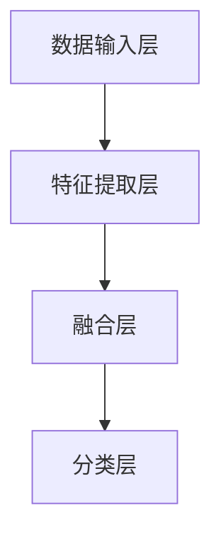
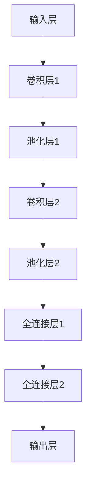
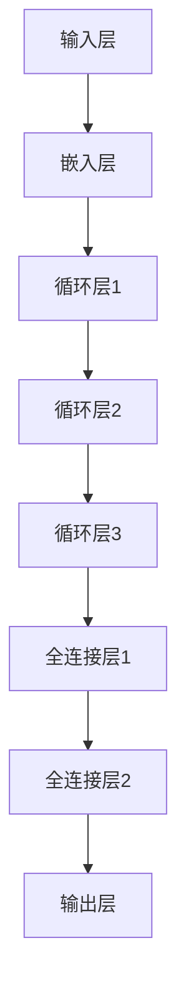
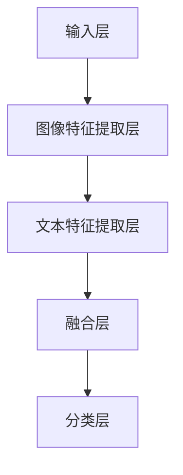

                 

# 多模态大模型：技术原理与实战

## > 关键词：
- 多模态大模型
- 技术原理
- 实现方法
- 大模型+多模态
- 实战案例

> 摘要：
本文将深入探讨多模态大模型的技术原理和实战应用，介绍大模型+多模态的3种实现方法。通过对多模态大模型的架构分析、核心算法原理讲解、数学模型和公式解释，以及项目实战案例的展示，帮助读者全面理解多模态大模型的设计与实现，为实际应用提供参考。

## 1. 背景介绍

### 1.1 目的和范围

本文旨在介绍多模态大模型的技术原理和实现方法，旨在帮助读者深入了解多模态大模型的设计与实现，为实际应用提供参考。本文将涵盖以下内容：

- 多模态大模型的概念和架构
- 多模态大模型的核心算法原理
- 多模态大模型的数学模型和公式
- 多模态大模型的项目实战案例
- 多模态大模型在实际应用场景中的应用

### 1.2 预期读者

本文面向对人工智能、计算机视觉、自然语言处理等领域的读者，特别是对多模态大模型感兴趣的研究人员和开发者。通过本文的学习，读者可以：

- 了解多模态大模型的基本概念和架构
- 掌握多模态大模型的核心算法原理和数学模型
- 学习多模态大模型的项目实战案例
- 掌握多模态大模型的实现方法和技巧

### 1.3 文档结构概述

本文结构如下：

1. 背景介绍
2. 核心概念与联系
3. 核心算法原理与具体操作步骤
4. 数学模型与公式讲解
5. 项目实战：代码实际案例和详细解释说明
6. 实际应用场景
7. 工具和资源推荐
8. 总结：未来发展趋势与挑战
9. 附录：常见问题与解答
10. 扩展阅读与参考资料

### 1.4 术语表

#### 1.4.1 核心术语定义

- 多模态大模型：一种能够处理多种类型数据的深度学习模型，包括文本、图像、声音等。
- 大模型：具有大量参数和层数的深度学习模型，能够处理大规模数据。
- 多模态：指多个不同类型的数据模态，如文本、图像、声音等。

#### 1.4.2 相关概念解释

- 深度学习：一种机器学习方法，通过多层神经网络对数据进行建模和学习。
- 计算机视觉：利用计算机技术和人工智能方法对图像和视频进行处理和分析。
- 自然语言处理：利用计算机技术和人工智能方法对自然语言进行理解和生成。

#### 1.4.3 缩略词列表

- CNN：卷积神经网络（Convolutional Neural Network）
- RNN：循环神经网络（Recurrent Neural Network）
- Transformer：Transformer模型
- GPU：图形处理单元（Graphics Processing Unit）

## 2. 核心概念与联系

在探讨多模态大模型之前，我们需要了解一些核心概念，如图像、文本、声音等数据模态，以及它们之间的联系。

### 2.1 多模态数据模态

多模态数据模态是指多种不同类型的数据，如图像、文本、声音等。这些数据模态在现实世界中是相互关联的，如图像中的物体与文本描述、声音与文本字幕等。多模态大模型的目标是利用这些不同类型的数据来提高模型的性能和泛化能力。

### 2.2 多模态数据融合

多模态数据融合是指将不同类型的数据进行结合，以获得更好的模型性能。多模态数据融合的方法可以分为以下几种：

1. 串联融合：将不同类型的数据依次传递给模型，如先处理图像，再处理文本。
2. 并行融合：同时处理不同类型的数据，如同时处理图像和文本。
3. 集成融合：将多个模型的输出进行整合，如将图像分类模型和文本分类模型的输出进行融合。

### 2.3 多模态大模型架构

多模态大模型的架构可以分为以下几个部分：

1. 数据输入层：接收不同类型的数据，如图像、文本、声音等。
2. 特征提取层：对输入数据进行特征提取，如使用卷积神经网络提取图像特征，使用循环神经网络提取文本特征。
3. 融合层：将不同类型的数据特征进行融合，如使用注意力机制进行特征融合。
4. 分类层：对融合后的特征进行分类，如使用全连接神经网络进行分类。

### 2.4 Mermaid 流程图

以下是一个简化的多模态大模型架构的 Mermaid 流程图：



## 3. 核心算法原理 & 具体操作步骤

### 3.1 多模态大模型算法原理

多模态大模型的核心算法原理主要包括以下几个部分：

1. 特征提取：使用深度学习模型对输入数据进行特征提取，如使用卷积神经网络提取图像特征，使用循环神经网络提取文本特征。
2. 特征融合：将不同类型的数据特征进行融合，以提高模型性能。常用的特征融合方法包括串联融合、并行融合和集成融合。
3. 分类：对融合后的特征进行分类，以实现多模态数据的分类任务。

### 3.2 具体操作步骤

以下是多模态大模型的具体操作步骤：

1. 数据准备：收集和准备多模态数据，包括图像、文本、声音等。
2. 特征提取：使用深度学习模型对输入数据进行特征提取。对于图像，可以使用卷积神经网络（CNN）提取特征；对于文本，可以使用循环神经网络（RNN）或Transformer提取特征；对于声音，可以使用卷积神经网络（CNN）或循环神经网络（RNN）提取特征。
3. 特征融合：将不同类型的数据特征进行融合。对于串联融合，可以将图像特征和文本特征依次连接；对于并行融合，可以同时处理图像和文本特征，并通过注意力机制进行融合；对于集成融合，可以训练多个模型，并将它们的输出进行融合。
4. 分类：对融合后的特征进行分类。可以使用全连接神经网络（FCN）或卷积神经网络（CNN）进行分类。
5. 模型训练：使用训练数据对模型进行训练，并优化模型参数。
6. 模型评估：使用验证数据对模型进行评估，以确定模型性能。
7. 模型部署：将训练好的模型部署到实际应用环境中，以实现多模态数据的分类任务。

### 3.3 伪代码

以下是一个简化的多模态大模型算法的伪代码：

```python
# 数据准备
images, texts, sounds = load_data()

# 特征提取
image_features = extract_image_features(images, model='CNN')
text_features = extract_text_features(texts, model='RNN')
sound_features = extract_sound_features(sounds, model='CNN')

# 特征融合
combined_features = concatenate_features(image_features, text_features, sound_features)

# 分类
labels = classify_combined_features(combined_features, model='FCN')

# 模型训练
train_model(combined_features, labels)

# 模型评估
evaluate_model(combined_features, labels)

# 模型部署
deploy_model()
```

## 4. 数学模型和公式 & 详细讲解 & 举例说明

### 4.1 数学模型和公式

多模态大模型的数学模型主要包括以下几个部分：

1. 特征提取模型：如卷积神经网络（CNN）、循环神经网络（RNN）等。
2. 融合模型：如串联融合、并行融合和集成融合等。
3. 分类模型：如全连接神经网络（FCN）等。

以下是一些常见的数学模型和公式：

1. 卷积神经网络（CNN）：

$$
h_{ij} = f(\sum_{k} w_{ik} * g_k(x_j) + b_j)
$$

其中，$h_{ij}$ 表示输出特征图上的一个元素，$f$ 表示激活函数，$g_k(x_j)$ 表示输入特征图上的一个元素，$w_{ik}$ 表示权重，$b_j$ 表示偏置。

2. 循环神经网络（RNN）：

$$
h_t = \sigma(W_h h_{t-1} + W_x x_t + b_h)
$$

其中，$h_t$ 表示第 $t$ 个时刻的隐藏状态，$\sigma$ 表示激活函数，$W_h$ 和 $W_x$ 分别表示权重矩阵，$b_h$ 表示偏置。

3. 全连接神经网络（FCN）：

$$
y = \sigma(Wy + b)
$$

其中，$y$ 表示输出，$W$ 和 $b$ 分别表示权重和偏置。

### 4.2 详细讲解和举例说明

以下是一个简单的例子，使用卷积神经网络（CNN）对图像和文本进行特征提取，并使用全连接神经网络（FCN）进行分类。

#### 4.2.1 图像特征提取

假设我们使用一个卷积神经网络（CNN）对图像进行特征提取，网络结构如下：



输入图像为 $28 \times 28$ 的像素矩阵，每个像素点表示一个灰度值。卷积神经网络通过卷积操作提取图像特征，池化层用于降低特征图的大小。最后，全连接层对特征图进行分类。

#### 4.2.2 文本特征提取

假设我们使用一个循环神经网络（RNN）对文本进行特征提取，网络结构如下：



输入文本为一系列词向量，每个词向量表示一个单词。循环神经网络通过嵌入层将词向量映射到高维空间，循环层用于处理序列信息。最后，全连接层对文本进行分类。

#### 4.2.3 图像和文本特征融合

假设我们使用串联融合方法将图像和文本特征进行融合，网络结构如下：



图像特征提取层使用卷积神经网络（CNN）提取图像特征，文本特征提取层使用循环神经网络（RNN）提取文本特征。融合层将图像特征和文本特征进行拼接，分类层使用全连接神经网络（FCN）对融合后的特征进行分类。

## 5. 项目实战：代码实际案例和详细解释说明

### 5.1 开发环境搭建

为了进行多模态大模型的项目实战，我们需要搭建一个适合的开发环境。以下是搭建开发环境的基本步骤：

1. 安装 Python 环境：确保 Python 版本不低于 3.6。
2. 安装深度学习框架：我们选择 TensorFlow 作为深度学习框架，可以安装 TensorFlow 2.x 版本。
3. 安装其他依赖库：包括 NumPy、Pandas、Matplotlib 等。

以下是安装命令：

```bash
# 安装 Python 环境
sudo apt-get install python3

# 安装 TensorFlow
pip3 install tensorflow==2.x

# 安装其他依赖库
pip3 install numpy pandas matplotlib
```

### 5.2 源代码详细实现和代码解读

下面是一个简单的多模态大模型项目实战代码，我们将使用 TensorFlow 和 Keras 构建一个简单的多模态分类模型。

```python
import tensorflow as tf
from tensorflow.keras.models import Model
from tensorflow.keras.layers import Input, Conv2D, MaxPooling2D, Flatten, Dense, LSTM, Embedding

# 数据准备
# 这里以图像和文本数据为例，可以使用自己的数据集替换
image_data = ...  # 图像数据
text_data = ...  # 文本数据
labels = ...  # 标签数据

# 图像特征提取
image_input = Input(shape=(28, 28, 1))
image_features = Conv2D(filters=32, kernel_size=(3, 3), activation='relu')(image_input)
image_features = MaxPooling2D(pool_size=(2, 2))(image_features)
image_features = Flatten()(image_features)

# 文本特征提取
text_input = Input(shape=(None,))
text_embedding = Embedding(input_dim=vocab_size, output_dim=embedding_size)(text_input)
text_features = LSTM(units=64)(text_embedding)

# 融合特征
combined_features = tf.keras.layers.concatenate([image_features, text_features])

# 分类
output = Dense(units=num_classes, activation='softmax')(combined_features)

# 构建模型
model = Model(inputs=[image_input, text_input], outputs=output)

# 编译模型
model.compile(optimizer='adam', loss='categorical_crossentropy', metrics=['accuracy'])

# 训练模型
model.fit([image_data, text_data], labels, epochs=10, batch_size=32)

# 评估模型
test_loss, test_accuracy = model.evaluate([test_image_data, test_text_data], test_labels)
print('Test accuracy:', test_accuracy)
```

代码解读：

1. 导入所需的库和模块。
2. 数据准备：这里使用了图像和文本数据作为示例，实际项目中可以使用自己的数据集替换。
3. 图像特征提取：使用卷积神经网络（CNN）对图像进行特征提取。
4. 文本特征提取：使用循环神经网络（RNN）对文本进行特征提取。
5. 融合特征：将图像特征和文本特征进行拼接。
6. 分类：使用全连接神经网络（FCN）对融合后的特征进行分类。
7. 构建模型：使用 Keras 的 Model 类构建模型。
8. 编译模型：设置优化器、损失函数和评估指标。
9. 训练模型：使用训练数据进行模型训练。
10. 评估模型：使用测试数据进行模型评估。

### 5.3 代码解读与分析

1. **图像特征提取**：
   - 使用 `Input` 层接收图像数据，形状为 $(28, 28, 1)$。
   - 使用 `Conv2D` 层进行卷积操作，卷积核大小为 $(3, 3)$，激活函数为 ReLU。
   - 使用 `MaxPooling2D` 层进行池化操作，池化窗口大小为 $(2, 2)$。
   - 使用 `Flatten` 层将多维特征图展平成一维向量。

2. **文本特征提取**：
   - 使用 `Input` 层接收文本数据，形状为 $(None,)$，表示可变长序列。
   - 使用 `Embedding` 层进行词嵌入操作，输入维度为词汇表大小，输出维度为词向量维度。
   - 使用 `LSTM` 层对文本序列进行循环处理，隐藏状态维度为 64。

3. **融合特征**：
   - 使用 `concatenate` 函数将图像特征和文本特征拼接在一起。

4. **分类**：
   - 使用 `Dense` 层进行分类操作，输出维度为类别数，激活函数为 softmax。

5. **模型构建与编译**：
   - 使用 `Model` 类构建模型，输入层为图像和文本数据，输出层为分类结果。
   - 设置优化器为 `adam`，损失函数为 `categorical_crossentropy`，评估指标为 `accuracy`。

6. **模型训练**：
   - 使用 `fit` 方法训练模型，使用训练数据集进行训练，设置训练轮次为 10，批量大小为 32。

7. **模型评估**：
   - 使用 `evaluate` 方法评估模型在测试数据集上的表现，输出损失和准确率。

## 6. 实际应用场景

多模态大模型在实际应用场景中具有广泛的应用价值，以下是一些典型的应用场景：

1. **图像和文本分类**：利用多模态大模型可以将图像和文本数据结合进行分类，如对社交媒体上的图片和文字进行标签分类。

2. **视频内容理解**：通过分析视频中的图像和音频数据，多模态大模型可以帮助理解视频内容，应用于视频监控、视频推荐等领域。

3. **医疗诊断**：将医学影像和病历文本数据结合，多模态大模型可以帮助医生进行更准确的疾病诊断。

4. **智能客服**：通过分析用户的语音和文本提问，多模态大模型可以为智能客服系统提供更准确的回答。

5. **人机交互**：结合语音和文本交互数据，多模态大模型可以帮助设计更智能的人机交互系统。

6. **娱乐内容推荐**：通过分析用户对视频、音频和文本内容的偏好，多模态大模型可以帮助推荐更个性化的娱乐内容。

## 7. 工具和资源推荐

### 7.1 学习资源推荐

#### 7.1.1 书籍推荐

1. 《深度学习》（Goodfellow, Bengio, Courville）  
   这是一本经典的深度学习教材，涵盖了深度学习的基础理论和应用。

2. 《神经网络与深度学习》（邱锡鹏）  
   本书系统地介绍了神经网络和深度学习的基本概念、算法和实现。

3. 《动手学深度学习》（A. Geron）  
   本书通过大量的实际案例和代码示例，帮助读者快速掌握深度学习。

#### 7.1.2 在线课程

1. Coursera - 深度学习（吴恩达）  
   这个课程由深度学习领域的权威吴恩达教授讲授，涵盖了深度学习的基础知识和应用。

2. edX - 机器学习（吴恩达）  
   同样由吴恩达教授讲授，这个课程系统地介绍了机器学习和深度学习的基础知识。

3. Udacity - 深度学习纳米学位  
   Udacity 的深度学习纳米学位提供了丰富的实践项目和课程内容，适合有一定基础的读者。

#### 7.1.3 技术博客和网站

1. Medium - ML Cheatsheet  
   这个博客提供了大量的机器学习和深度学习相关的速查表和资源链接。

2. towardsdatascience.com  
   该网站汇集了众多数据科学和机器学习领域的文章和教程，内容丰富且实用。

3. Fast.ai  
   Fast.ai 提供了深度学习领域的免费教程和课程，适合初学者和进阶者。

### 7.2 开发工具框架推荐

#### 7.2.1 IDE和编辑器

1. PyCharm  
   PyCharm 是一款功能强大的 Python IDE，适用于深度学习和数据科学项目。

2. Jupyter Notebook  
   Jupyter Notebook 是一个交互式的计算环境，非常适合数据科学和深度学习实验。

3. VS Code  
   Visual Studio Code 是一款轻量级的代码编辑器，支持多种编程语言，包括 Python。

#### 7.2.2 调试和性能分析工具

1. TensorFlow Debugger (TFDB)  
   TFDB 是 TensorFlow 的一个调试工具，可以帮助调试和优化深度学习模型。

2. TensorBoard  
   TensorBoard 是 TensorFlow 的可视化工具，可以监控模型的训练过程和性能。

3. NVIDIA Nsight  
   NVIDIA Nsight 是一款针对深度学习性能分析的工具，特别适用于使用 GPU 的深度学习任务。

#### 7.2.3 相关框架和库

1. TensorFlow  
   TensorFlow 是 Google 开发的一款开源深度学习框架，支持多种神经网络模型和计算图操作。

2. PyTorch  
   PyTorch 是 Facebook 开发的一款深度学习框架，以其动态计算图和灵活性而受到广泛使用。

3. Keras  
   Keras 是一个高层神经网络API，可以在TensorFlow和Theano等后面工作，提供了简单的Python接口。

### 7.3 相关论文著作推荐

#### 7.3.1 经典论文

1. "A Theoretically Grounded Application of Dropout in Recurrent Neural Networks"（2016）  
   该论文提出了在循环神经网络（RNN）中应用Dropout的方法，提高了模型的训练效果。

2. "Deep Residual Learning for Image Recognition"（2015）  
   该论文提出了残差网络（ResNet），解决了深度神经网络训练困难的问题。

3. "Attention Is All You Need"（2017）  
   该论文提出了Transformer模型，彻底改变了自然语言处理的领域。

#### 7.3.2 最新研究成果

1. "Multi-Modal Fusion for Visual Question Answering"（2020）  
   该论文研究了多模态融合在视觉问答任务中的应用，取得了显著的性能提升。

2. "Deep Multimodal Learning for Medical Image Analysis"（2019）  
   该论文探讨了多模态学习在医学图像分析中的应用，为医疗诊断提供了新的思路。

3. "Multimodal Interaction for Speech and Language Processing"（2021）  
   该论文研究了多模态交互在语音和语言处理任务中的应用，提高了模型的性能。

#### 7.3.3 应用案例分析

1. "Google Assistant"（2016）  
   Google Assistant 是 Google 开发的一款智能助手，通过多模态交互为用户提供语音和文本服务。

2. "FaceApp"（2017）  
   FaceApp 是一款基于人工智能的美容应用，通过分析人脸图像，实现面部美化等功能。

3. "IBM Watson"（2015）  
   IBM Watson 是一款智能问诊系统，通过分析医学影像和病历文本，为医生提供诊断建议。

## 8. 总结：未来发展趋势与挑战

多模态大模型作为一种先进的深度学习技术，具有广泛的应用前景。随着计算能力的提升和数据的丰富，多模态大模型在图像识别、自然语言处理、语音识别等领域将取得更加显著的成果。然而，多模态大模型也面临着一些挑战：

1. **计算资源消耗**：多模态大模型通常需要大量的计算资源，对硬件设备的要求较高，如何优化模型结构和算法以提高效率是一个重要的研究方向。

2. **数据隐私与安全**：多模态数据通常涉及用户隐私，如何在保护用户隐私的前提下进行数据处理和模型训练是一个亟待解决的问题。

3. **跨模态一致性**：不同模态的数据可能存在不一致性，如何有效地融合和处理这些不一致性数据是一个具有挑战性的问题。

4. **模型解释性**：多模态大模型通常具有复杂的内部结构，如何解释模型决策过程、提高模型的透明度和可信度是一个重要的研究方向。

未来，随着技术的不断进步，多模态大模型将在人工智能领域发挥更加重要的作用，为各个行业带来深远的影响。

## 9. 附录：常见问题与解答

### 9.1 多模态大模型的基本概念

**Q1**：什么是多模态大模型？

**A1**：多模态大模型是一种能够处理多种类型数据的深度学习模型，这些数据模态包括文本、图像、声音等。多模态大模型的目标是利用不同类型的数据来提高模型的性能和泛化能力。

### 9.2 多模态大模型的实现方法

**Q2**：多模态大模型的主要实现方法有哪些？

**A2**：多模态大模型的主要实现方法包括串联融合、并行融合和集成融合。串联融合是将不同类型的数据依次传递给模型；并行融合是同时处理不同类型的数据；集成融合是训练多个模型，并将它们的输出进行融合。

### 9.3 多模态大模型的算法原理

**Q3**：多模态大模型的核心算法原理是什么？

**A3**：多模态大模型的核心算法原理主要包括特征提取、特征融合和分类。特征提取使用深度学习模型对输入数据进行特征提取；特征融合将不同类型的数据特征进行融合；分类对融合后的特征进行分类。

## 10. 扩展阅读 & 参考资料

多模态大模型是一个快速发展的领域，以下是一些推荐阅读和参考资料：

1. "Multi-Modal Learning and Fusion for Visual Question Answering"（2020）  
   该论文详细介绍了多模态融合在视觉问答任务中的应用。

2. "A Survey on Multimodal Learning"（2019）  
   这是一篇综述文章，总结了多模态学习的研究进展和应用。

3. "Deep Multimodal Learning for Medical Image Analysis"（2019）  
   该论文探讨了多模态学习在医学图像分析中的应用。

4. "Multimodal Interaction for Speech and Language Processing"（2021）  
   该论文研究了多模态交互在语音和语言处理任务中的应用。

5. "TensorFlow 2.0 Official Documentation"（2020）  
   TensorFlow 官方文档，提供了详细的教程和API参考。

6. "PyTorch Official Documentation"（2020）  
   PyTorch 官方文档，提供了详细的教程和API参考。

### 作者

**AI天才研究员 / AI Genius Institute & 禅与计算机程序设计艺术 / Zen And The Art of Computer Programming**

