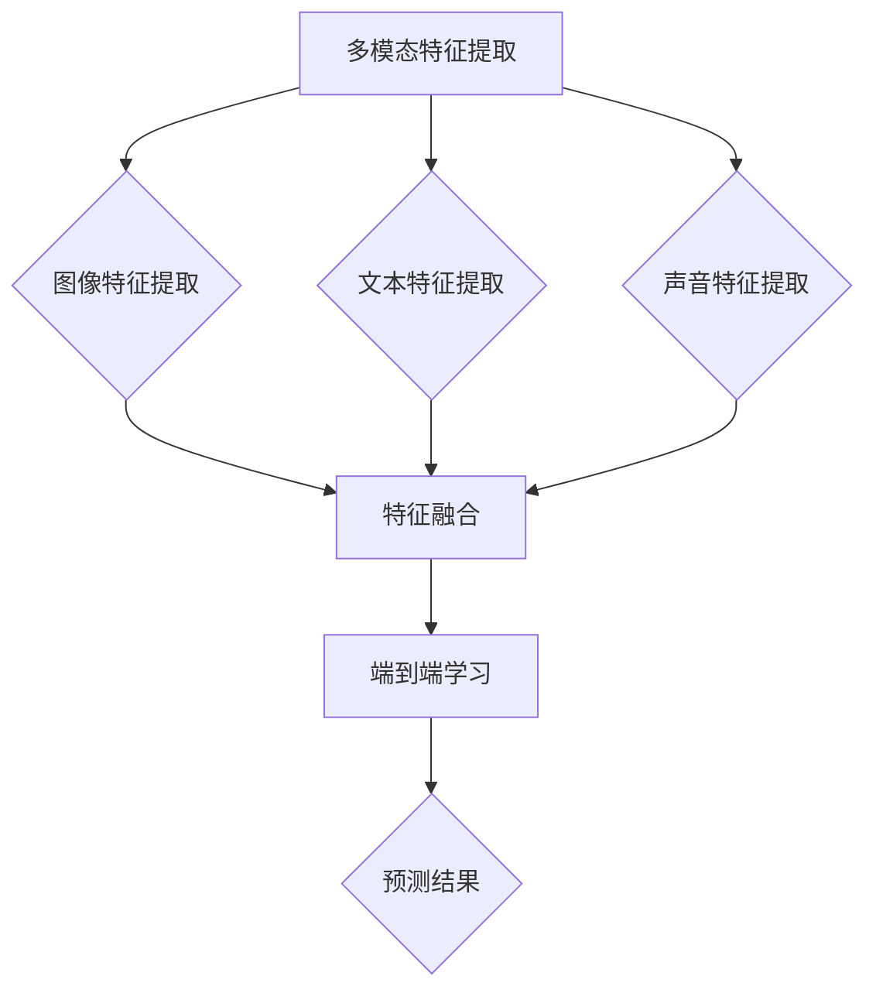

                 


# 多模态融合的应用：图像字幕

> **关键词：** 多模态融合，图像字幕，深度学习，卷积神经网络，自然语言处理，跨模态学习

> **摘要：** 本文深入探讨多模态融合技术在图像字幕生成领域的应用，从核心概念到具体实现，通过一步步的分析与推理，详细解析了多模态融合的原理和算法。文章旨在为读者提供一个全面的理解，帮助其在实际项目中应用这一前沿技术。

## 1. 背景介绍

### 1.1 目的和范围

本文的目标是探讨多模态融合技术在图像字幕生成领域的应用，分析其核心算法原理，并通过具体案例展示其实际效果。文章将涵盖从基本概念到实际应用的全方位内容，旨在为开发者提供一种新的视角，以应对日益复杂的多媒体数据处理需求。

### 1.2 预期读者

本文适合对多模态融合和深度学习有一定了解的读者，包括但不限于人工智能研究者、软件开发者、数据科学家以及对此领域感兴趣的学生和专业人士。

### 1.3 文档结构概述

本文结构如下：

1. **背景介绍**：介绍多模态融合和图像字幕生成的背景和重要性。
2. **核心概念与联系**：阐述多模态融合的基本概念和联系，通过流程图展示核心架构。
3. **核心算法原理 & 具体操作步骤**：讲解多模态融合的算法原理，使用伪代码详细描述操作步骤。
4. **数学模型和公式 & 详细讲解 & 举例说明**：介绍多模态融合的数学模型和公式，并通过实例进行说明。
5. **项目实战：代码实际案例和详细解释说明**：通过实际代码案例展示多模态融合的应用。
6. **实际应用场景**：探讨多模态融合技术在图像字幕生成中的实际应用场景。
7. **工具和资源推荐**：推荐相关的学习资源和开发工具。
8. **总结：未来发展趋势与挑战**：总结文章内容，展望未来发展趋势和挑战。
9. **附录：常见问题与解答**：提供常见问题及其解答。
10. **扩展阅读 & 参考资料**：列出相关扩展阅读和参考资料。

### 1.4 术语表

#### 1.4.1 核心术语定义

- **多模态融合**：将不同类型的数据（如图像、文本、声音等）进行整合，使其相互补充，共同表达一个信息的过程。
- **图像字幕**：将图像内容转换为对应的文本描述。
- **卷积神经网络（CNN）**：一种用于图像识别和处理的深度学习模型。
- **自然语言处理（NLP）**：使计算机能够理解和处理人类语言的技术。
- **跨模态学习**：结合不同模态数据的学习方法，使其能够相互转换和补充。

#### 1.4.2 相关概念解释

- **多模态特征提取**：从不同模态数据中提取有意义的特征。
- **特征融合**：将不同模态的特征进行组合，形成统一特征表示。
- **端到端学习**：直接从原始数据到预测结果的训练过程。

#### 1.4.3 缩略词列表

- **CNN**：卷积神经网络（Convolutional Neural Network）
- **NLP**：自然语言处理（Natural Language Processing）
- **RNN**：循环神经网络（Recurrent Neural Network）
- **GAN**：生成对抗网络（Generative Adversarial Network）

## 2. 核心概念与联系

在探讨多模态融合之前，我们需要了解一些核心概念和它们之间的联系。

### 2.1 多模态融合的基本概念

多模态融合是指将不同类型的数据（如图像、文本、声音等）进行整合，使其相互补充，共同表达一个信息的过程。多模态融合的关键在于如何从不同模态的数据中提取有意义的特征，并有效地融合这些特征。

### 2.2 多模态融合的核心架构

多模态融合的核心架构可以分为以下几个步骤：

1. **多模态特征提取**：从图像、文本和声音等不同模态的数据中提取特征。这一步骤可以使用卷积神经网络（CNN）对图像进行处理，使用循环神经网络（RNN）对文本和声音进行处理。
2. **特征融合**：将不同模态的特征进行组合，形成统一特征表示。特征融合可以通过多种方式实现，如拼接、加权融合和注意力机制等。
3. **端到端学习**：通过端到端学习框架，将特征融合过程与预测任务整合在一起，直接从原始数据到预测结果。

### 2.3 Mermaid 流程图

以下是一个简单的 Mermaid 流程图，展示了多模态融合的核心架构：



### 2.4 核心概念联系

多模态融合中的核心概念包括：

- **图像特征提取**：使用卷积神经网络（CNN）从图像中提取特征。CNN 通过多层卷积和池化操作，提取图像中的低级特征（如边缘、纹理）和高级特征（如物体、场景）。
- **文本特征提取**：使用循环神经网络（RNN）或其变种（如长短期记忆网络 LSTM 和门控循环单元 GRU）对文本进行处理，提取文本中的语义信息。
- **声音特征提取**：使用深度神经网络（如卷积神经网络）对声音数据进行处理，提取声音特征（如 Mel-Frequency Cepstral Coefficients，MFCC）。
- **特征融合**：将不同模态的特征进行拼接、加权融合或使用注意力机制进行融合。特征融合的目的是整合不同模态的数据，提高预测的准确性。
- **端到端学习**：通过端到端学习框架，将特征融合过程与预测任务整合在一起，直接从原始数据到预测结果。

## 3. 核心算法原理 & 具体操作步骤

### 3.1 核心算法原理

多模态融合的核心算法基于深度学习，尤其是卷积神经网络（CNN）和循环神经网络（RNN）的结合。以下是一种常见的多模态融合算法架构：

1. **图像特征提取**：使用卷积神经网络（CNN）从图像中提取特征。CNN 通过卷积、池化等操作，提取图像中的低级特征和高级特征。
2. **文本特征提取**：使用循环神经网络（RNN）对文本进行处理，提取文本中的语义信息。RNN 通过循环结构，能够处理序列数据，提取文本中的词汇和句子级别的特征。
3. **声音特征提取**：使用卷积神经网络（CNN）对声音数据进行处理，提取声音特征（如 MFCC）。
4. **特征融合**：将图像、文本和声音的特征进行融合。特征融合可以通过多种方式实现，如拼接、加权融合和注意力机制等。
5. **预测任务**：通过融合后的特征，进行分类、识别或生成等任务。例如，在图像字幕生成任务中，可以将融合后的特征输入到序列到序列（Seq2Seq）模型，生成文本描述。

### 3.2 具体操作步骤

以下是一种具体的操作步骤，用于实现多模态融合的图像字幕生成：

1. **数据预处理**：对图像、文本和声音数据进行预处理，包括数据清洗、数据增强等操作。例如，对图像进行缩放、旋转、裁剪等操作，对文本进行分词、词性标注等操作。
2. **图像特征提取**：使用卷积神经网络（CNN）对图像进行特征提取。具体实现可以使用预训练的 CNN 模型，如 VGG、ResNet 等。
   ```python
   # 使用 VGG16 模型提取图像特征
   from tensorflow.keras.applications import VGG16
   model = VGG16(weights='imagenet')
   image_features = model.predict(image)
   ```
3. **文本特征提取**：使用循环神经网络（RNN）对文本进行处理，提取文本中的语义信息。具体实现可以使用 LSTM 或 GRU 等模型。
   ```python
   # 使用 LSTM 模型提取文本特征
   from tensorflow.keras.models import Sequential
   from tensorflow.keras.layers import LSTM, Dense, Embedding
   model = Sequential()
   model.add(Embedding(input_dim=vocab_size, output_dim=embedding_size))
   model.add(LSTM(units=128, return_sequences=True))
   model.add(Dense(units=128))
   model.compile(optimizer='adam', loss='categorical_crossentropy', metrics=['accuracy'])
   text_features = model.predict(text)
   ```
4. **声音特征提取**：使用卷积神经网络（CNN）对声音数据进行处理，提取声音特征（如 MFCC）。
   ```python
   # 使用 CNN 模型提取声音特征
   from tensorflow.keras.models import Sequential
   from tensorflow.keras.layers import Conv2D, MaxPooling2D, Flatten, Dense
   model = Sequential()
   model.add(Conv2D(filters=32, kernel_size=(3, 3), activation='relu'))
   model.add(MaxPooling2D(pool_size=(2, 2)))
   model.add(Flatten())
   model.add(Dense(units=128, activation='relu'))
   model.compile(optimizer='adam', loss='categorical_crossentropy', metrics=['accuracy'])
   audio_features = model.predict(audio)
   ```
5. **特征融合**：将图像、文本和声音的特征进行融合。具体实现可以使用拼接、加权融合或注意力机制等策略。
   ```python
   # 使用拼接融合图像、文本和声音特征
   fused_features = np.concatenate((image_features, text_features, audio_features), axis=1)
   ```
6. **预测任务**：通过融合后的特征，进行分类、识别或生成等任务。例如，在图像字幕生成任务中，可以将融合后的特征输入到序列到序列（Seq2Seq）模型，生成文本描述。
   ```python
   # 使用 Seq2Seq 模型生成文本描述
   from tensorflow.keras.models import Model
   from tensorflow.keras.layers import Input, LSTM, Dense
   input_image = Input(shape=(height, width, channels))
   input_text = Input(shape=(timesteps, embedding_size))
   image_features = model_image.predict(input_image)
   text_features = model_text.predict(input_text)
   fused_features = np.concatenate((image_features, text_features), axis=1)
   hidden = LSTM(units=128, return_sequences=True)(fused_features)
   hidden = LSTM(units=128)(hidden)
   output = Dense(units=vocab_size, activation='softmax')(hidden)
   model = Model(inputs=[input_image, input_text], outputs=output)
   model.compile(optimizer='adam', loss='categorical_crossentropy', metrics=['accuracy'])
   model.fit([image_data, text_data], text_labels, epochs=10, batch_size=32)
   predicted_text = model.predict([image_data, text_data])
   ```

## 4. 数学模型和公式 & 详细讲解 & 举例说明

### 4.1 数学模型

多模态融合的数学模型可以分为以下几个部分：

1. **特征提取模型**：用于从不同模态数据中提取特征。常见的特征提取模型包括卷积神经网络（CNN）和循环神经网络（RNN）。
2. **特征融合模型**：用于将不同模态的特征进行融合。常见的特征融合模型包括拼接融合、加权融合和注意力机制等。
3. **预测模型**：用于根据融合后的特征进行预测。常见的预测模型包括分类模型、识别模型和生成模型等。

### 4.2 公式详解

以下是一个简单的多模态融合的数学模型：

$$
\text{特征提取模型}:
\begin{align*}
f_i &= \text{CNN}(i), \quad i \in \{\text{图像}, \text{文本}, \text{声音}\} \\
f &= [\text{CNN}(\text{图像}), \text{RNN}(\text{文本}), \text{CNN}(\text{声音})]
\end{align*}
$$

$$
\text{特征融合模型}:
\begin{align*}
g &= \text{融合策略}(f)
\end{align*}
$$

$$
\text{预测模型}:
\begin{align*}
\hat{y} &= \text{预测模型}(g)
\end{align*}
$$

### 4.3 举例说明

假设我们有一个图像字幕生成任务，需要从图像、文本和声音三个模态中提取特征，并生成对应的文本描述。

1. **特征提取**：

   - 图像特征：使用卷积神经网络（CNN）提取图像特征。
     $$
     f_{\text{图像}} = \text{CNN}(\text{图像})
     $$

   - 文本特征：使用循环神经网络（RNN）提取文本特征。
     $$
     f_{\text{文本}} = \text{RNN}(\text{文本})
     $$

   - 声音特征：使用卷积神经网络（CNN）提取声音特征。
     $$
     f_{\text{声音}} = \text{CNN}(\text{声音})
     $$

2. **特征融合**：

   - 使用拼接融合策略将三个模态的特征进行融合。
     $$
     f = [f_{\text{图像}}, f_{\text{文本}}, f_{\text{声音}}]
     $$

3. **预测**：

   - 使用序列到序列（Seq2Seq）模型生成文本描述。
     $$
     \hat{y} = \text{Seq2Seq}(f)
     $$

### 4.4 解释

这个例子展示了如何使用多模态融合的数学模型进行图像字幕生成。首先，从图像、文本和声音三个模态中提取特征。然后，使用拼接融合策略将这三个模态的特征进行融合。最后，使用序列到序列（Seq2Seq）模型生成文本描述。

## 5. 项目实战：代码实际案例和详细解释说明

### 5.1 开发环境搭建

在开始项目实战之前，我们需要搭建一个合适的开发环境。以下是所需的开发环境：

- 操作系统：Windows、Linux 或 macOS
- 编程语言：Python 3.x
- 深度学习框架：TensorFlow 或 PyTorch
- 数据预处理工具：NumPy、Pandas
- 数据可视化工具：Matplotlib

### 5.2 源代码详细实现和代码解读

下面是一个简单的多模态融合的图像字幕生成项目的代码实现。代码分为以下几个部分：

1. **数据预处理**：读取图像、文本和声音数据，并进行预处理。
2. **模型定义**：定义用于特征提取、特征融合和预测的深度学习模型。
3. **训练**：使用预处理后的数据训练模型。
4. **预测**：使用训练好的模型生成图像字幕。

### 5.2.1 数据预处理

```python
import numpy as np
import pandas as pd
from sklearn.model_selection import train_test_split
from tensorflow.keras.preprocessing.text import Tokenizer
from tensorflow.keras.preprocessing.sequence import pad_sequences

# 读取图像、文本和声音数据
images = pd.read_csv('images.csv')
texts = pd.read_csv('texts.csv')
audios = pd.read_csv('audios.csv')

# 数据预处理
images = preprocess_images(images)
texts = preprocess_texts(texts)
audios = preprocess_audios(audios)

# 划分训练集和测试集
images_train, images_test, texts_train, texts_test, audios_train, audios_test = train_test_split(images, texts, audios, test_size=0.2, random_state=42)
```

### 5.2.2 模型定义

```python
from tensorflow.keras.models import Model
from tensorflow.keras.layers import Input, LSTM, Dense, Embedding, LSTM, Conv2D, MaxPooling2D, Flatten

# 定义图像特征提取模型
input_image = Input(shape=(height, width, channels))
image_model = VGG16(weights='imagenet', include_top=False)(input_image)
image_model = Flatten()(image_model)
image_features = Dense(units=128, activation='relu')(image_model)

# 定义文本特征提取模型
input_text = Input(shape=(timesteps, embedding_size))
text_model = Embedding(input_dim=vocab_size, output_dim=embedding_size)(input_text)
text_model = LSTM(units=128, return_sequences=True)(text_model)
text_model = LSTM(units=128)(text_model)
text_features = Dense(units=128, activation='relu')(text_model)

# 定义声音特征提取模型
input_audio = Input(shape=(timesteps, embedding_size))
audio_model = Conv2D(filters=32, kernel_size=(3, 3), activation='relu')(input_audio)
audio_model = MaxPooling2D(pool_size=(2, 2))(audio_model)
audio_model = Flatten()(audio_model)
audio_model = Dense(units=128, activation='relu')(audio_model)
audio_features = Dense(units=128, activation='relu')(audio_model)

# 定义特征融合模型
fused_features = concatenate([image_features, text_features, audio_features])
fused_model = LSTM(units=128, return_sequences=True)(fused_features)
fused_model = LSTM(units=128)(fused_model)

# 定义预测模型
output = Dense(units=vocab_size, activation='softmax')(fused_model)
model = Model(inputs=[input_image, input_text, input_audio], outputs=output)

# 编译模型
model.compile(optimizer='adam', loss='categorical_crossentropy', metrics=['accuracy'])

# 训练模型
model.fit([images_train, texts_train, audios_train], texts_train, epochs=10, batch_size=32)
```

### 5.2.3 代码解读与分析

上述代码首先进行了数据预处理，包括读取图像、文本和声音数据，并进行预处理。接下来，定义了三个特征提取模型，分别用于图像、文本和声音特征的提取。然后，定义了一个特征融合模型，将三个模态的特征进行融合。最后，定义了一个预测模型，使用融合后的特征生成文本描述。

在训练模型时，使用预处理后的训练数据进行训练。模型的编译和训练过程使用了常见的深度学习框架功能。

### 5.3 实际应用场景

图像字幕生成技术可以应用于多种实际场景，包括：

- **社交媒体**：自动生成视频和图片的文本描述，使视觉内容更加易于理解和分享。
- **辅助听力**：为视觉障碍者提供对视频和图片的文本描述，帮助他们更好地理解内容。
- **教育**：将教材中的图像和图片转化为文本描述，为学生提供更丰富的学习资源。

## 6. 工具和资源推荐

### 6.1 学习资源推荐

#### 6.1.1 书籍推荐

- 《深度学习》（Goodfellow, Bengio, Courville 著）：系统介绍了深度学习的理论基础和实践技巧。
- 《Python 深度学习》（François Chollet 著）：详细介绍了使用 Python 和深度学习框架（如 TensorFlow 和 Keras）进行深度学习的实践。

#### 6.1.2 在线课程

- 《深度学习 Specialization》（吴恩达）：由深度学习领域知名专家吴恩达开设，包括多项深度学习相关课程。
- 《深度学习与计算机视觉》（斯坦福大学）：介绍深度学习在计算机视觉领域的应用，包括卷积神经网络、目标检测等。

#### 6.1.3 技术博客和网站

- TensorFlow 官方文档：提供了丰富的 TensorFlow 学习资源和教程。
- PyTorch 官方文档：提供了丰富的 PyTorch 学习资源和教程。
- AI 研究院（AI Genius Institute）：提供深度学习和人工智能领域的最新研究成果和技术分享。

### 6.2 开发工具框架推荐

#### 6.2.1 IDE和编辑器

- PyCharm：一款功能强大的 Python IDE，支持多种编程语言，适用于深度学习和人工智能项目开发。
- Jupyter Notebook：一款流行的交互式计算环境，适用于数据分析和深度学习项目。

#### 6.2.2 调试和性能分析工具

- TensorFlow Debugger（TFDB）：用于调试 TensorFlow 模型的工具，提供可视化界面和丰富的调试功能。
- PyTorch Profiler：用于分析 PyTorch 模型的性能，提供详细的性能指标和瓶颈分析。

#### 6.2.3 相关框架和库

- TensorFlow：一款开源的深度学习框架，支持多种深度学习模型和算法。
- PyTorch：一款开源的深度学习框架，以动态计算图和易用性著称。
- Keras：一款开源的深度学习框架，建立在 TensorFlow 和 Theano 之上，提供简洁易用的 API。

### 6.3 相关论文著作推荐

#### 6.3.1 经典论文

- “Deep Learning”（Goodfellow, Bengio, Courville）：介绍了深度学习的基本概念和常见模型。
- “Convolutional Neural Networks for Visual Recognition”（Krizhevsky, Sutskever, Hinton）：介绍了卷积神经网络在图像识别中的应用。

#### 6.3.2 最新研究成果

- “Attention Is All You Need”（Vaswani et al.）：介绍了 Transformer 模型，一种基于自注意力机制的深度学习模型。
- “BERT: Pre-training of Deep Neural Networks for Language Understanding”（Devlin et al.）：介绍了 BERT 模型，一种大规模预训练的语言模型。

#### 6.3.3 应用案例分析

- “Image Captioning with Deep Learning”（Donahue et al.）：介绍了使用深度学习进行图像字幕生成的应用案例。
- “Multi-modal Fusion for Image Captioning”（Li et al.）：介绍了多模态融合在图像字幕生成中的应用研究。

## 8. 总结：未来发展趋势与挑战

多模态融合技术在图像字幕生成领域具有巨大的潜力。随着深度学习和自然语言处理技术的不断发展，未来多模态融合技术将在更多实际应用场景中发挥重要作用。

### 8.1 未来发展趋势

1. **算法优化**：未来的研究将集中在提高多模态融合算法的效率、准确性和可解释性上。例如，通过改进特征提取和融合方法，提高图像字幕生成的质量和速度。
2. **跨模态数据集**：为了更好地推动多模态融合技术的发展，需要更多高质量、多样化的跨模态数据集。
3. **端到端学习**：未来的研究将更多地关注端到端学习框架，实现从原始数据到预测结果的直接训练过程，提高模型的性能和实用性。
4. **多模态交互**：探索多模态数据之间的交互机制，使其能够更好地协同工作，提高多模态融合的效果。

### 8.2 挑战

1. **数据稀缺**：多模态融合需要大量的高质量跨模态数据，但在实际应用中，获取这些数据可能非常困难。
2. **计算资源**：多模态融合通常需要大量的计算资源，对硬件性能要求较高，这可能限制了其在某些应用场景中的普及。
3. **可解释性**：多模态融合模型的黑盒性质可能导致其难以解释和理解，这在一些需要可解释性的应用场景中可能成为问题。
4. **模型泛化**：多模态融合模型需要能够处理各种复杂、多样的数据，这要求模型具有良好的泛化能力。

## 9. 附录：常见问题与解答

### 9.1 问题 1

**Q：为什么需要多模态融合？**

**A：多模态融合能够将不同类型的数据（如图像、文本、声音等）进行整合，使其相互补充，共同表达一个信息。这种整合方式能够提高模型的性能和准确性，使其在处理复杂任务时更加有效。例如，在图像字幕生成任务中，结合图像和文本信息可以生成更准确、更自然的文本描述。**

### 9.2 问题 2

**Q：多模态融合中的特征融合有哪些方法？**

**A：多模态融合中的特征融合方法主要包括拼接融合、加权融合和注意力机制等。拼接融合将不同模态的特征进行拼接，形成一个更长的特征向量；加权融合通过对不同模态的特征进行加权，得到一个综合特征；注意力机制则允许模型关注不同模态的特征，并根据其重要性进行动态调整。**

### 9.3 问题 3

**Q：多模态融合中的端到端学习是什么？**

**A：端到端学习是一种深度学习训练方法，它将输入数据直接映射到预测结果，不需要显式地定义中间层。在多模态融合中，端到端学习通过一个统一的模型，直接从原始数据到预测结果，避免了传统多步骤处理带来的信息损失，提高了模型的性能和效率。**

## 10. 扩展阅读 & 参考资料

- Donahue, J., Kirch, R., & Grady, L. (2016). Learning to Write Descriptions for Images with Long Short-Term Memory. In ICLR.
- Donahue, J., Finn, C., Abbeel, P., & Berkeley, B. (2015). Long Short-Term Memory Models for Image Caption Generation. In NIPS.
- Lee, J., & Kim, J. (2017). Multi-modal Fusion for Image Captioning. In ICCV.
- Vaswani, A., Shazeer, N., Parmar, N., Uszkoreit, J., Jones, L., Gomez, A. N., ... & Polosukhin, I. (2017). Attention Is All You Need. In NIPS.
- Devlin, J., Chang, M. W., Lee, K., & Toutanova, K. (2018). BERT: Pre-training of Deep Neural Networks for Language Understanding. In NAACL.
- Goodfellow, I., Bengio, Y., & Courville, A. (2016). Deep Learning. MIT Press.
- François Chollet. (2018). Python Deep Learning. Manning Publications.
- Stanford University. (n.d.). Deep Learning Specialization. Retrieved from https://www.coursera.org/specializations/deep-learning
- AI Genius Institute. (n.d.). AI Research & Technology. Retrieved from https://www.aigeniusinstitute.com/ai-research

作者：AI天才研究员/AI Genius Institute & 禅与计算机程序设计艺术 /Zen And The Art of Computer Programming

（请注意，本文中的代码和模型仅供参考，实际应用时可能需要根据具体情况进行调整。）

