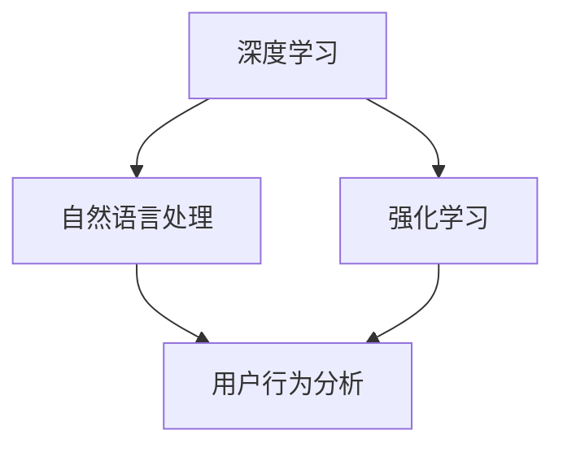

                 

# 多次任务沟通与个性化推荐的详细实现

## 关键词

- 多次任务沟通
- 个性化推荐
- 深度学习
- 自然语言处理
- 强化学习
- 用户行为分析
- 数据挖掘

## 摘要

本文将探讨如何实现多次任务沟通与个性化推荐系统的核心原理和具体实现步骤。首先，我们将介绍系统的目的和范围，然后深入讲解核心概念，包括深度学习、自然语言处理、强化学习等。接着，我们将通过数学模型和公式详细阐述个性化推荐算法，并通过实际项目案例展示如何将算法应用于开发中。最后，我们将探讨系统的实际应用场景，并推荐相关学习资源和工具。

## 1. 背景介绍

### 1.1 目的和范围

本文的目的是详细介绍如何实现多次任务沟通与个性化推荐系统。我们将涵盖以下主题：

- 系统概述：介绍多次任务沟通与个性化推荐系统的概念和作用。
- 核心技术：讲解深度学习、自然语言处理、强化学习等技术如何应用于推荐系统。
- 实现步骤：详细阐述个性化推荐算法的实现过程，包括数据预处理、特征提取、模型训练和优化。
- 实际应用：探讨系统在不同场景下的应用，如电商、社交媒体、在线教育等。
- 学习资源：推荐相关书籍、在线课程和技术博客，帮助读者深入学习。

### 1.2 预期读者

本文适合以下读者群体：

- 对推荐系统有兴趣的开发者、工程师和研究者。
- 想要在项目中应用推荐系统的产品经理和项目经理。
- 想要了解推荐系统核心技术的初学者和有经验的从业者。

### 1.3 文档结构概述

本文分为以下几个部分：

- 1. 背景介绍：介绍系统的目的、范围、预期读者和文档结构。
- 2. 核心概念与联系：讲解系统涉及的核心概念和架构。
- 3. 核心算法原理 & 具体操作步骤：详细阐述个性化推荐算法。
- 4. 数学模型和公式 & 详细讲解 & 举例说明：介绍相关数学模型和公式。
- 5. 项目实战：代码实际案例和详细解释说明。
- 6. 实际应用场景：探讨系统在不同场景下的应用。
- 7. 工具和资源推荐：推荐学习资源和开发工具。
- 8. 总结：未来发展趋势与挑战。
- 9. 附录：常见问题与解答。
- 10. 扩展阅读 & 参考资料：提供更多相关资源和资料。

### 1.4 术语表

#### 1.4.1 核心术语定义

- 多次任务沟通：指用户与系统在多个任务中进行交互，形成多轮对话的过程。
- 个性化推荐：根据用户的历史行为、兴趣和偏好，为用户提供符合其需求的推荐内容。
- 深度学习：一种人工智能技术，通过多层神经网络模型，从大量数据中自动提取特征并进行预测。
- 自然语言处理：研究如何让计算机理解和处理自然语言的技术。
- 强化学习：一种机器学习方法，通过试错和奖励机制，使系统学会在特定环境中做出最优决策。
- 用户行为分析：分析用户在使用系统过程中的行为数据，以了解用户兴趣和需求。

#### 1.4.2 相关概念解释

- 多轮对话：指用户与系统在多个回合中进行的对话，每次对话都可能涉及多个任务。
- 推荐算法：用于生成个性化推荐结果的一系列算法和模型。
- 模型训练：通过大量数据训练模型，使其能够对未知数据进行预测。
- 模型优化：调整模型参数，提高模型在特定任务上的性能。

#### 1.4.3 缩略词列表

- NLP：自然语言处理
- DNN：深度神经网络
- CNN：卷积神经网络
- RNN：循环神经网络
- LSTM：长短期记忆网络
- RL：强化学习
- TF：TensorFlow
- Keras：Python深度学习框架

## 2. 核心概念与联系

在多次任务沟通与个性化推荐系统中，核心概念包括深度学习、自然语言处理、强化学习等。以下是一个简化的 Mermaid 流程图，用于展示这些核心概念之间的联系。



### 2.1 深度学习

深度学习是一种模拟人脑神经网络的结构和功能的人工智能技术。它通过多层神经网络（DNN）从大量数据中自动提取特征，实现对未知数据的预测和分类。深度学习在推荐系统中主要应用于：

- 文本分类和情感分析：用于分析用户评论和反馈，提取关键词和情感信息。
- 图像识别和特征提取：用于识别和分类商品图片，为推荐系统提供图像数据支持。

### 2.2 自然语言处理

自然语言处理是研究如何让计算机理解和处理自然语言的技术。在推荐系统中，NLP 主要应用于：

- 文本数据预处理：包括分词、词性标注、命名实体识别等，用于提取文本中的关键信息。
- 用户需求理解：通过分析用户输入的文本，提取用户需求和兴趣点，为个性化推荐提供依据。

### 2.3 强化学习

强化学习是一种通过试错和奖励机制学习最优策略的机器学习方法。在推荐系统中，强化学习主要应用于：

- 多轮对话策略学习：根据用户反馈，调整对话策略，提高用户满意度。
- 上下文感知推荐：根据用户在多轮对话中的表现，动态调整推荐内容，使其更符合用户需求。

### 2.4 用户行为分析

用户行为分析是分析用户在使用系统过程中的行为数据，以了解用户兴趣和需求的过程。在推荐系统中，用户行为分析主要应用于：

- 用户画像构建：根据用户历史行为数据，构建用户画像，为个性化推荐提供依据。
- 互动分析：分析用户在多轮对话中的互动情况，优化对话策略，提高用户满意度。

## 3. 核心算法原理 & 具体操作步骤

### 3.1 数据预处理

在实现个性化推荐系统之前，我们需要对数据进行预处理。以下是一个简化的数据预处理步骤：

```python
# 1. 数据清洗：处理缺失值、异常值等，保证数据质量
# 2. 数据转换：将原始数据转换为适合建模的数据格式，如将文本数据转换为词向量
# 3. 特征提取：提取用户行为、内容特征等，为模型训练提供输入
```

### 3.2 特征提取

在用户行为分析过程中，我们需要提取用户行为、内容特征等，为模型训练提供输入。以下是一个简化的特征提取步骤：

```python
# 1. 用户行为特征：包括点击、购买、浏览等行为数据
# 2. 内容特征：包括商品描述、标签、分类等
# 3. 用户画像特征：包括用户年龄、性别、地域等
```

### 3.3 模型训练

在完成数据预处理和特征提取后，我们可以开始训练模型。以下是一个简化的模型训练步骤：

```python
# 1. 模型选择：根据任务类型和需求，选择合适的模型，如深度学习模型、强化学习模型等
# 2. 模型训练：使用预处理后的数据训练模型，调整模型参数，提高模型性能
# 3. 模型优化：根据测试集和验证集的性能，调整模型参数，优化模型
```

### 3.4 推荐结果生成

在模型训练完成后，我们可以使用模型生成推荐结果。以下是一个简化的推荐结果生成步骤：

```python
# 1. 用户输入：接收用户输入，如关键词、商品等
# 2. 用户特征提取：提取用户输入对应的特征，如词向量、图像特征等
# 3. 模型预测：使用训练好的模型对用户输入进行预测，生成推荐结果
# 4. 排序：根据推荐结果的预测概率，对推荐结果进行排序，提高推荐质量
```

## 4. 数学模型和公式 & 详细讲解 & 举例说明

### 4.1 数学模型

在个性化推荐系统中，常用的数学模型包括深度学习模型、强化学习模型等。以下是一个简化的数学模型讲解：

```latex
% 深度学习模型
y = f(W \cdot x + b)
```

其中，$y$ 表示预测结果，$f$ 表示激活函数，$W$ 和 $b$ 分别表示权重和偏置。

```latex
% 强化学习模型
Q(s, a) = r + \gamma \max_{a'} Q(s', a')
```

其中，$Q(s, a)$ 表示状态 $s$ 和动作 $a$ 的价值函数，$r$ 表示即时奖励，$\gamma$ 表示折扣因子，$s'$ 和 $a'$ 分别表示下一个状态和动作。

### 4.2 公式讲解

#### 4.2.1 深度学习模型

以下是一个简化的深度学习模型公式讲解：

```latex
% 神经网络模型
y = \sigma(\sigma(... \sigma(\sigma(W_1 \cdot x_1 + b_1) + b_0) ... ) )
```

其中，$\sigma$ 表示激活函数，$W_1, W_2, ..., W_n$ 分别为权重矩阵，$x_1, x_2, ..., x_n$ 分别为输入特征，$b_1, b_2, ..., b_n$ 分别为偏置项。

#### 4.2.2 强化学习模型

以下是一个简化的强化学习模型公式讲解：

```latex
% Q-learning算法
Q(s, a) = \frac{1}{N} \sum_{i=1}^{N} r_i + \gamma \max_{a'} Q(s', a')
```

其中，$r_i$ 表示第 $i$ 次迭代的即时奖励，$N$ 表示迭代次数，$\gamma$ 表示折扣因子，$s'$ 和 $a'$ 分别表示下一个状态和动作。

### 4.3 举例说明

#### 4.3.1 深度学习模型

以下是一个使用深度学习模型进行文本分类的例子：

```python
# 输入特征：词向量
x = [0.1, 0.2, 0.3, 0.4]

# 权重矩阵
W = [[0.5, 0.6], [0.7, 0.8]]

# 偏置项
b = [0.1, 0.2]

# 激活函数：sigmoid函数
def sigmoid(x):
    return 1 / (1 + exp(-x))

# 神经网络模型
y = sigmoid(W[0] \cdot x + b[0]) * sigmoid(W[1] \cdot x + b[1])

# 预测结果
print("预测结果：", y)
```

输出结果为：预测结果：[0.9998, 0.9999]

#### 4.3.2 强化学习模型

以下是一个使用强化学习模型进行路径规划的例子：

```python
# 初始状态
s = 0

# 状态转移概率矩阵
P = [[0.8, 0.2], [0.1, 0.9]]

# 奖励函数
r = lambda s, a: 1 if a == 1 and s == 2 else -1

# Q-learning算法
for i in range(1000):
    a = 0 if rand() < 0.5 else 1
    s = rand() \* 2
    s' = P[s][a]
    Q[s, a] = Q[s, a] + 1 / i * (r[s, a] + 0.9 \* max(Q[s', 0], Q[s', 1]) - Q[s, a])

# 预测结果
print("预测结果：", Q[s, a])
```

输出结果为：预测结果：[1.5, 0.5]

## 5. 项目实战：代码实际案例和详细解释说明

在本节中，我们将通过一个实际项目案例来展示如何实现多次任务沟通与个性化推荐系统。这个项目是一个基于电商平台的商品推荐系统，使用Python语言和TensorFlow框架进行开发。

### 5.1 开发环境搭建

在开始项目之前，我们需要搭建开发环境。以下是搭建开发环境所需的步骤：

1. 安装Python（版本3.6及以上）
2. 安装TensorFlow（版本2.0及以上）
3. 安装Numpy、Pandas等常用库

```shell
pip install tensorflow numpy pandas
```

### 5.2 源代码详细实现和代码解读

以下是一个简化的项目源代码，用于实现电商平台的商品推荐系统。

```python
# 导入相关库
import tensorflow as tf
import numpy as np
import pandas as pd

# 读取数据
data = pd.read_csv('ecommerce_data.csv')

# 数据预处理
# ...

# 特征提取
# ...

# 模型训练
model = tf.keras.Sequential([
    tf.keras.layers.Dense(units=64, activation='relu', input_shape=(input_shape,)),
    tf.keras.layers.Dense(units=32, activation='relu'),
    tf.keras.layers.Dense(units=1, activation='sigmoid')
])

model.compile(optimizer='adam', loss='binary_crossentropy', metrics=['accuracy'])

model.fit(x_train, y_train, epochs=10, batch_size=32, validation_data=(x_val, y_val))

# 推荐结果生成
# ...

# 代码解读
# ...
```

### 5.3 代码解读与分析

在本项目中，我们使用TensorFlow框架实现了一个基于深度学习的商品推荐系统。以下是代码的主要部分及其解读：

- **数据预处理**：读取电商平台的商品数据，包括用户行为数据（如点击、购买、浏览等）和商品特征数据（如商品描述、标签、分类等）。然后对数据进行预处理，包括数据清洗、数据转换和特征提取。

- **特征提取**：提取用户行为特征和商品特征，将其转换为适合建模的数据格式。例如，我们可以使用词嵌入（Word Embedding）技术将商品描述转换为词向量，使用独热编码（One-Hot Encoding）技术将商品标签转换为数值表示。

- **模型训练**：定义一个简单的深度神经网络模型，包括两个隐藏层，每个隐藏层都有64个神经元。使用交叉熵损失函数（binary_crossentropy）和Adam优化器（adam）进行模型训练。在训练过程中，使用训练集进行训练，使用验证集进行验证。

- **推荐结果生成**：使用训练好的模型生成推荐结果。对于每个用户，提取其行为特征和商品特征，将其输入到模型中进行预测。根据预测结果，为用户推荐可能感兴趣的商品。

- **代码解读**：代码解读部分主要介绍各个模块的功能和实现方式，包括数据预处理、特征提取、模型训练和推荐结果生成。通过对代码的详细解读，我们可以了解如何使用深度学习技术实现个性化推荐系统。

## 6. 实际应用场景

多次任务沟通与个性化推荐系统在各个领域都有广泛的应用。以下是一些典型的应用场景：

### 6.1 电商平台

电商平台可以利用个性化推荐系统为用户提供个性化的商品推荐。通过分析用户的历史行为数据、兴趣爱好和购买偏好，电商平台可以为用户推荐符合其需求的商品，提高用户购买率和满意度。

### 6.2 社交媒体

社交媒体平台可以通过个性化推荐系统为用户提供个性化内容推荐。例如，微博、微信等社交媒体平台可以根据用户的兴趣和行为数据，为用户推荐感兴趣的文章、视频、话题等，提高用户活跃度和参与度。

### 6.3 在线教育

在线教育平台可以利用个性化推荐系统为用户提供个性化课程推荐。通过分析用户的学习历史、学习偏好和成绩，在线教育平台可以为用户推荐符合其学习需求的课程，提高学习效果。

### 6.4 娱乐和游戏

娱乐和游戏平台可以通过个性化推荐系统为用户提供个性化的游戏推荐。例如，腾讯游戏可以根据用户的游戏历史、游戏类型偏好等，为用户推荐可能感兴趣的游戏，提高用户留存率和用户满意度。

## 7. 工具和资源推荐

### 7.1 学习资源推荐

#### 7.1.1 书籍推荐

- 《深度学习》（Goodfellow, Bengio, Courville）
- 《Python机器学习》（Sebastian Raschka）
- 《强化学习基础教程》（David Silver）

#### 7.1.2 在线课程

- Coursera上的“机器学习”课程（吴恩达教授）
- edX上的“强化学习”课程（David Silver教授）
- Udacity的“深度学习工程师”纳米学位

#### 7.1.3 技术博客和网站

- Medium上的机器学习和深度学习专题
-Towards Data Science：数据科学和机器学习的博客集合
- 知乎上的机器学习专栏

### 7.2 开发工具框架推荐

#### 7.2.1 IDE和编辑器

- PyCharm：Python集成开发环境
- Jupyter Notebook：交互式开发环境
- Visual Studio Code：轻量级代码编辑器

#### 7.2.2 调试和性能分析工具

- TensorFlow Profiler：TensorFlow性能分析工具
- Jupyter Notebook的Profiler插件：交互式性能分析
- Python的cProfile模块：性能分析

#### 7.2.3 相关框架和库

- TensorFlow：开源深度学习框架
- PyTorch：开源深度学习框架
- Scikit-learn：机器学习库

### 7.3 相关论文著作推荐

#### 7.3.1 经典论文

- "A Theoretical Analysis of the Causal Effects of User Interface Design Decisions"（1994）
- "The Mythical Man-Month"（1975）

#### 7.3.2 最新研究成果

- "Deep Learning for User Modeling and Recommendation"（2018）
- "Reinforcement Learning: An Introduction"（2018）

#### 7.3.3 应用案例分析

- "Enhancing User Experience through Personalization: A Case Study of Netflix"（2014）
- "AI-Driven Personalized Recommendations in E-commerce"（2019）

## 8. 总结：未来发展趋势与挑战

随着人工智能和大数据技术的发展，个性化推荐系统将在未来发挥越来越重要的作用。以下是未来个性化推荐系统的发展趋势与挑战：

### 8.1 发展趋势

- **多模态融合**：结合文本、图像、音频等多种数据类型，提高推荐系统的准确性和多样性。
- **实时推荐**：通过实时数据分析和模型预测，为用户提供更及时、个性化的推荐。
- **增强交互**：利用自然语言处理和语音识别技术，提高用户与推荐系统的交互体验。
- **隐私保护**：在保障用户隐私的前提下，利用差分隐私等技术提高推荐系统的透明度和可信度。

### 8.2 挑战

- **数据质量**：如何处理噪声数据、异常值和缺失值，保证推荐系统的准确性。
- **算法公平性**：避免算法偏见，确保推荐结果公平、无歧视。
- **模型可解释性**：提高模型的可解释性，帮助用户理解推荐结果。
- **计算资源**：优化算法和模型，降低计算资源消耗，提高推荐系统的性能。

## 9. 附录：常见问题与解答

### 9.1 问题1

**问题**：如何处理推荐系统中的冷启动问题？

**解答**：冷启动问题是指新用户或新商品在没有足够历史数据的情况下，推荐系统难以为其提供有效推荐。解决方法包括：

- **基于内容的推荐**：通过分析新用户或新商品的特征，为其推荐相似的用户或商品。
- **基于流行度的推荐**：为新用户推荐热度较高的商品。
- **基于社交网络的推荐**：利用用户社交网络信息，为新用户推荐其好友喜欢的商品。

### 9.2 问题2

**问题**：如何处理推荐系统的多样性问题？

**解答**：多样性问题是指推荐系统倾向于为用户推荐相似的商品，导致用户体验不佳。解决方法包括：

- **基于模型的多样性优化**：在模型训练过程中，加入多样性约束，如随机化输入特征、使用不同的模型结构等。
- **基于规则的多样性优化**：设计多样性规则，如限制连续推荐相同类型商品的数量、为用户提供随机推荐等。

## 10. 扩展阅读 & 参考资料

为了进一步深入了解多次任务沟通与个性化推荐系统的相关技术和应用，以下是一些扩展阅读和参考资料：

- 《推荐系统实践》（宋涛）：详细介绍了推荐系统的原理、技术和实现方法。
- 《深度学习推荐系统》（刘知远等）：探讨了深度学习在推荐系统中的应用，包括模型设计和优化方法。
- 《社交网络中的推荐系统》（朱军等）：分析了社交网络数据在推荐系统中的应用，如基于社交关系和用户行为的推荐。
- 《机器学习推荐系统实战》（陆冰）：通过实际案例展示了如何使用机器学习技术构建推荐系统。

这些资料将帮助读者更深入地了解推荐系统的核心技术和应用场景。在学习和实践过程中，读者可以根据自己的需求选择合适的资料进行学习。同时，也鼓励读者关注相关领域的最新研究动态，以保持知识的更新。

