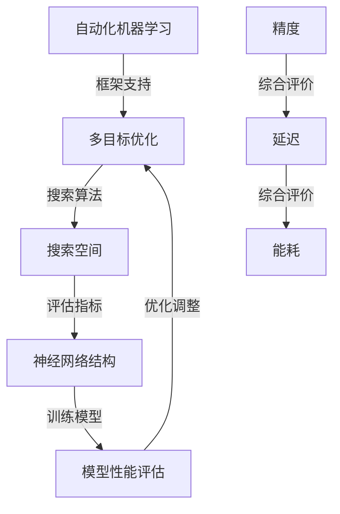
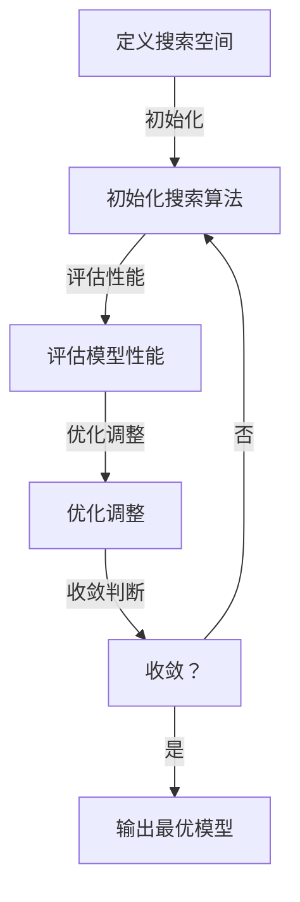

                 

### 1. 背景介绍

#### 1.1 目的和范围

本文旨在深入探讨多目标神经架构搜索（Neural Architecture Search, NAS）在解决精度、延迟和能耗平衡问题中的应用。随着深度学习模型的广泛应用，如何高效地设计并优化这些模型已成为研究热点。NAS技术通过自动化搜索最优模型结构，为提升深度学习模型性能提供了新的思路。

本文将首先介绍NAS的基本概念、原理及其与传统模型设计的区别。随后，本文将详细阐述多目标NAS的核心算法原理，并使用伪代码逐步解释其具体操作步骤。在此基础上，本文将通过数学模型和公式深入分析NAS的优化过程，并辅以实际项目实战案例进行代码实现和详细解读。最后，本文将探讨NAS在不同应用场景中的实际应用，并推荐相关学习资源、开发工具和经典论文，以便读者进一步深入学习和研究。

通过本文的阅读，读者将能够系统地理解多目标NAS的工作原理，掌握其在实践中的应用技巧，并对其未来发展趋势和挑战有更清晰的认识。

#### 1.2 预期读者

本文适用于对深度学习、神经架构搜索（NAS）和优化算法有一定了解的读者。具体包括：

1. 深度学习研究人员和开发者，特别是对NAS技术感兴趣的人。
2. 软件工程师和计算机科学家，希望深入了解如何利用NAS技术优化模型性能。
3. 对计算机图形处理、自然语言处理和计算机视觉等领域有研究需求的学者和从业者。
4. 对自动化模型搜索和优化技术感兴趣的学生和研究人员。

通过本文的学习，读者将能够掌握多目标NAS的核心算法，理解其数学模型和优化原理，并能够应用于实际项目中，提升模型性能。

#### 1.3 文档结构概述

本文分为十个主要部分，具体结构如下：

1. **背景介绍**：介绍本文的目的、范围和预期读者，以及文章的结构安排。
2. **核心概念与联系**：定义NAS和相关核心概念，并提供Mermaid流程图展示架构。
3. **核心算法原理 & 具体操作步骤**：详细讲解多目标NAS的算法原理，使用伪代码阐述操作步骤。
4. **数学模型和公式 & 详细讲解 & 举例说明**：深入分析NAS的数学模型，使用LaTeX格式给出公式，并提供具体案例说明。
5. **项目实战：代码实际案例和详细解释说明**：展示代码实现过程，并提供详细解释和分析。
6. **实际应用场景**：探讨NAS在各个领域的应用实例。
7. **工具和资源推荐**：推荐学习资源、开发工具和经典论文。
8. **总结：未来发展趋势与挑战**：总结本文主要内容，展望NAS技术的未来。
9. **附录：常见问题与解答**：回答读者可能遇到的常见问题。
10. **扩展阅读 & 参考资料**：提供进一步的阅读材料和参考资料。

通过以上结构，本文旨在为读者提供一个全面、系统的多目标NAS技术解析，帮助读者深入理解并应用这一前沿技术。

#### 1.4 术语表

本文中涉及的一些核心术语和概念需要特别解释，以便读者更好地理解文章内容。

##### 1.4.1 核心术语定义

1. **神经架构搜索（Neural Architecture Search, NAS）**：一种自动化搜索最优神经网络结构的机器学习技术。通过算法从大量可能的网络结构中筛选出最优或近似最优的结构。
2. **多目标优化（Multi-Objective Optimization）**：在优化过程中同时考虑多个目标，通常需要在不同目标之间进行权衡，找到最优解或有效解集。
3. **精度（Accuracy）**：模型在预测中正确分类的样本比例，是评估模型性能的重要指标。
4. **延迟（Latency）**：模型从接收输入到输出结果所需的时间，是评估模型运行效率的重要指标。
5. **能耗（Energy Consumption）**：模型在运行过程中消耗的能量，对于移动设备和嵌入式系统尤为重要。
6. **搜索空间（Search Space）**：所有可能网络结构的集合，NAS算法在这一空间中进行搜索。
7. **适应性（Adaptability）**：模型在遇到新任务或环境时能够快速适应和调整的能力。

##### 1.4.2 相关概念解释

1. **卷积神经网络（Convolutional Neural Networks, CNN）**：一种用于图像识别和处理的深度学习模型，通过卷积层提取特征。
2. **递归神经网络（Recurrent Neural Networks, RNN）**：一种能够处理序列数据的神经网络，通过递归结构对历史信息进行建模。
3. **生成对抗网络（Generative Adversarial Networks, GAN）**：一种由生成器和判别器组成的模型，用于生成逼真的数据。
4. **迁移学习（Transfer Learning）**：利用预训练模型在新任务上的表现，提高新任务模型的性能。
5. **自动化机器学习（Automated Machine Learning, AutoML）**：通过自动化工具和算法，简化机器学习模型的设计、训练和调优过程。

##### 1.4.3 缩略词列表

- NAS：Neural Architecture Search
- CNN：Convolutional Neural Networks
- RNN：Recurrent Neural Networks
- GAN：Generative Adversarial Networks
- AutoML：Automated Machine Learning
- MLP：Multilayer Perceptron

通过上述术语和概念的解释，读者可以更好地理解本文中的专业术语，为后续内容的深入阅读打下坚实的基础。

## 2. 核心概念与联系

在深入探讨多目标神经架构搜索（NAS）之前，我们需要明确一些核心概念，并展示其相互之间的关系。NAS技术通过自动化搜索最优神经网络结构，从而在多个目标（如精度、延迟和能耗）之间找到最佳平衡。以下是NAS相关的核心概念及其联系。

### 2.1 多目标优化与神经架构搜索

**多目标优化**是一种在多个目标函数之间寻找平衡点的优化技术。在NAS中，这些目标函数包括模型精度、延迟和能耗。具体来说：

- **精度**：衡量模型在给定任务上的性能，通常用准确率、召回率等指标来评估。
- **延迟**：模型从接收输入到输出结果的耗时，对实时应用至关重要。
- **能耗**：模型运行过程中消耗的能量，对移动设备和嵌入式系统尤为重要。

NAS通过多目标优化算法，在搜索空间中寻找一个最优或近似最优的模型结构，使得精度最高、延迟最低、能耗最小。这一过程中，不同目标之间常常存在冲突，需要通过权衡策略来找到平衡点。

### 2.2 NAS与自动化机器学习

**自动化机器学习（AutoML）**是一种利用算法和工具自动化机器学习模型设计、训练和调优的技术。NAS是AutoML的一个重要组成部分，专注于模型结构的自动化搜索。具体来说：

- **搜索空间**：NAS的工作基础是一个定义明确的搜索空间，包括所有可能的模型结构。
- **搜索算法**：如基于强化学习、遗传算法等，用于在搜索空间中探索并优化模型结构。
- **评估指标**：用于评估模型性能的指标，通常包括精度、延迟和能耗等。

AutoML中的其他技术，如超参数优化和模型选择，也与NAS紧密相关。NAS通过自动化搜索，为AutoML提供了一种新的方法来设计和优化模型。

### 2.3 NAS与深度学习框架

**深度学习框架**是用于实现和训练深度学习模型的软件工具，如TensorFlow、PyTorch等。NAS需要依赖这些框架来实现和优化模型结构。具体来说：

- **框架支持**：深度学习框架提供了丰富的API和工具，支持NAS算法的执行。
- **模型集成**：NAS算法通常需要与现有的深度学习模型集成，以实现自动化搜索和优化。
- **性能优化**：框架提供了各种性能优化技术，如并行计算、分布式训练等，以提升NAS的效率和效果。

### 2.4 NAS与人工智能应用领域

**人工智能应用领域**包括计算机视觉、自然语言处理、语音识别等。NAS技术在这些领域有着广泛的应用，通过自动化搜索最优模型结构，提升模型的性能和效率。具体来说：

- **计算机视觉**：NAS技术被用于设计高效的图像识别和分类模型，如用于人脸识别、自动驾驶等。
- **自然语言处理**：NAS技术可以优化文本分类、机器翻译等模型，提高处理效率和准确性。
- **语音识别**：NAS技术被用于设计高效的语音识别模型，降低延迟和能耗，提升用户体验。

### 2.5 NAS与其他优化算法

除了NAS，还有其他优化算法，如遗传算法、遗传编程、粒子群优化等，也用于自动化搜索最优模型结构。这些算法与NAS的异同如下：

- **遗传算法**：基于生物进化的原理，通过遗传操作（如选择、交叉和突变）在搜索空间中寻找最优解。
- **遗传编程**：类似于遗传算法，但直接对程序代码进行操作，用于自动生成和优化程序。
- **粒子群优化**：模拟鸟群觅食行为，通过个体和群体的协作，在搜索空间中寻找最优解。

NAS与这些算法的异同在于：

- **搜索对象**：NAS主要针对神经网络结构进行搜索，而其他算法则可以应用于更广泛的优化问题。
- **性能指标**：NAS通常关注模型精度、延迟和能耗等综合性能指标，而其他算法可能只关注单一目标。
- **应用领域**：NAS主要应用于深度学习和自动化机器学习领域，而其他算法则应用更广泛。

通过以上对核心概念与联系的分析，我们可以更清晰地理解NAS的工作原理及其在不同领域中的应用。接下来，我们将进一步探讨NAS的核心算法原理，以更深入地理解这一技术。

### 2.6 Mermaid流程图展示

为了更好地理解NAS的核心概念及其相互关系，我们使用Mermaid语言绘制一个流程图，展示NAS的架构和流程。以下是流程图的Markdown格式代码：



以下是流程图的输出：

```text
graph TD
    A[多目标优化] -->|搜索算法| B[搜索空间]
    B -->|评估指标| C[神经网络结构]
    C -->|训练模型| D[模型性能评估]
    D -->|优化调整| A
    E[精度] -->|综合评价| F[延迟]
    F -->|综合评价| G[能耗]
    H[自动化机器学习] -->|框架支持| A
```

这个流程图展示了NAS的核心组成部分：多目标优化、搜索空间、神经网络结构、模型性能评估，以及与自动化机器学习框架的关系。通过这个流程图，我们可以更直观地理解NAS的工作原理及其各个环节的相互作用。

## 3. 核心算法原理 & 具体操作步骤

在了解多目标NAS的基本概念和相互关系之后，我们接下来将深入探讨其核心算法原理，并通过伪代码逐步解释其具体操作步骤。多目标NAS的核心在于如何在多个目标（如精度、延迟和能耗）之间找到最佳平衡，进而优化神经网络结构。

### 3.1 算法原理

多目标NAS的基本原理是利用优化算法在定义好的搜索空间中搜索最优或近似最优的神经网络结构。这一过程通常包括以下几个步骤：

1. **定义搜索空间**：确定所有可能的神经网络结构，构成搜索空间。
2. **初始化搜索算法**：选择并初始化优化算法，如遗传算法、强化学习等。
3. **评估模型性能**：针对当前搜索到的神经网络结构，训练模型并评估其性能，包括精度、延迟和能耗等指标。
4. **优化调整**：根据评估结果，对神经网络结构进行调整，以找到更好的平衡点。
5. **收敛判断**：判断搜索是否收敛，若未收敛，继续搜索过程；否则，输出最优模型结构。

以下是多目标NAS的核心算法原理的伪代码：

```pseudo
算法 MultiObjectiveNAS(搜索空间，优化算法，评估指标，终止条件)
初始化搜索算法
初始化神经网络结构
当前最佳模型 = 无

while 未达到终止条件 do
    评估当前模型性能
    if 当前模型性能优于当前最佳模型 then
        更新当前最佳模型
    end if

    根据优化算法进行模型结构调整
    if 收敛判断条件满足 then
        break
    end if
end while

输出当前最佳模型
end MultiObjectiveNAS
```

### 3.2 具体操作步骤

下面我们通过具体步骤来详细解释多目标NAS的操作过程：

#### 3.2.1 步骤1：定义搜索空间

定义搜索空间是NAS的第一步，这涉及到确定所有可能的神经网络结构。搜索空间通常包括网络层数、每层的神经元数目、连接方式、激活函数等参数。

伪代码：

```pseudo
定义搜索空间
搜索空间 = {网络层数, 每层神经元数目列表, 连接方式列表, 激活函数列表}
```

#### 3.2.2 步骤2：初始化搜索算法

初始化搜索算法，选择合适的优化算法，如遗传算法、强化学习等。初始化参数包括种群大小、迭代次数、交叉率、突变率等。

伪代码：

```pseudo
初始化搜索算法
种群大小 = ...
迭代次数 = ...
交叉率 = ...
突变率 = ...

初始化种群
种群 = 初始化种群(搜索空间)
```

#### 3.2.3 步骤3：评估模型性能

对当前搜索到的神经网络结构进行训练和评估，计算其精度、延迟和能耗等指标。评估过程可以通过模拟测试集数据来实现。

伪代码：

```pseudo
评估当前模型性能
模型性能 = 训练并评估模型(当前神经网络结构)
```

#### 3.2.4 步骤4：优化调整

根据评估结果，利用优化算法调整神经网络结构。这一步骤可能涉及交叉、突变等遗传操作，或策略更新等强化学习操作。

伪代码：

```pseudo
优化调整
新种群 = 应用优化算法(种群，模型性能)
```

#### 3.2.5 步骤5：收敛判断

判断搜索过程是否收敛。若未达到终止条件，继续迭代搜索；否则，输出最优模型结构。

伪代码：

```pseudo
if 收敛判断条件满足 then
    输出当前最佳模型
else
    继续迭代搜索
end if
```

### 3.3 算法原理示意图

为了更直观地理解多目标NAS的算法原理，我们使用Mermaid语言绘制一个示意图，展示整个搜索过程。以下是示意图的Markdown格式代码：



以下是示意图的输出：

```text
graph TD
    A[定义搜索空间] -->|初始化| B[初始化搜索算法]
    B -->|评估性能| C[评估模型性能]
    C -->|优化调整| D[优化调整]
    D -->|收敛判断| E[收敛？]
    E -->|是| F[输出最优模型]
    E -->|否| B
```

这个示意图展示了多目标NAS的核心步骤及其相互关系，有助于读者更直观地理解这一算法的运作原理。

通过上述步骤和伪代码的详细解释，读者可以全面了解多目标NAS的算法原理和具体操作步骤。接下来，我们将进一步探讨NAS的数学模型和公式，以深入分析其优化过程。

### 4. 数学模型和公式 & 详细讲解 & 举例说明

多目标神经架构搜索（NAS）的核心在于优化算法如何在不同目标（如精度、延迟和能耗）之间找到最佳平衡。为了深入理解这一优化过程，我们需要引入相关的数学模型和公式，并通过具体的案例进行说明。

#### 4.1 多目标优化数学模型

多目标优化的数学模型通常包括多个目标函数和约束条件。在NAS中，这三个目标函数分别是精度（Accuracy）、延迟（Latency）和能耗（Energy Consumption）。以下是多目标优化的数学模型表示：

$$
\begin{aligned}
\text{minimize} \quad & f_1(x_1, x_2, ..., x_n) \\
\text{minimize} \quad & f_2(x_1, x_2, ..., x_n) \\
\text{minimize} \quad & f_3(x_1, x_2, ..., x_n) \\
\text{subject to} \quad & g_1(x_1, x_2, ..., x_n) \leq 0 \\
& g_2(x_1, x_2, ..., x_n) \leq 0 \\
& \ldots \\
& g_m(x_1, x_2, ..., x_n) \leq 0 \\
\end{aligned}
$$

其中，$x_1, x_2, ..., x_n$是神经网络结构的参数，$f_1, f_2, f_3$分别是精度、延迟和能耗的目标函数，$g_1, g_2, ..., g_m$是约束条件。

#### 4.2 精度、延迟和能耗公式

接下来，我们分别定义精度、延迟和能耗的公式：

1. **精度（Accuracy）**

精度是模型在特定任务上的性能指标，通常用准确率（Accuracy）来衡量。准确率的计算公式如下：

$$
\text{Accuracy} = \frac{\text{预测正确的样本数}}{\text{总样本数}}
$$

2. **延迟（Latency）**

延迟是模型从接收输入到输出结果所需的时间。对于神经网络模型，延迟通常由以下几个部分组成：

$$
\text{Latency} = t_{\text{forward}} + t_{\text{backward}} + t_{\text{update}}
$$

其中，$t_{\text{forward}}$是前向传播时间，$t_{\text{backward}}$是反向传播时间，$t_{\text{update}}$是权重更新时间。延迟的具体计算通常依赖于具体的神经网络架构和硬件环境。

3. **能耗（Energy Consumption）**

能耗是模型在运行过程中消耗的能量。对于深度学习模型，能耗通常由以下几个部分组成：

$$
\text{Energy Consumption} = E_{\text{forward}} + E_{\text{backward}} + E_{\text{update}}
$$

其中，$E_{\text{forward}}$是前向传播的能耗，$E_{\text{backward}}$是反向传播的能耗，$E_{\text{update}}$是权重更新的能耗。能耗的具体计算同样依赖于具体的神经网络架构和硬件环境。

#### 4.3 权衡策略

在实际的NAS过程中，精度、延迟和能耗之间常常存在冲突。为了找到最佳平衡，需要引入权衡策略。一种常见的权衡策略是使用加权系数来平衡不同目标之间的权重。假设三个目标的加权系数分别为$\alpha, \beta, \gamma$，则总目标函数可以表示为：

$$
f(x) = \alpha \cdot f_1(x) + \beta \cdot f_2(x) + \gamma \cdot f_3(x)
$$

通过调整加权系数，可以在不同目标之间找到最佳的平衡。

#### 4.4 具体案例说明

下面我们通过一个具体的案例来说明如何使用多目标优化的数学模型来优化神经网络结构。

假设我们有一个深度学习模型，需要在精度、延迟和能耗之间找到最佳平衡。具体的目标函数和约束条件如下：

$$
\begin{aligned}
\text{minimize} \quad & f_1(x) = \frac{1}{N} \sum_{i=1}^{N} \log(1 + e^{-y_i \cdot \sigma(Wx)}) \\
\text{minimize} \quad & f_2(x) = t_{\text{forward}} + t_{\text{backward}} + t_{\text{update}} \\
\text{minimize} \quad & f_3(x) = E_{\text{forward}} + E_{\text{backward}} + E_{\text{update}} \\
\text{subject to} \quad & g_1(x) = \sum_{i=1}^{N} (y_i - \sigma(Wx_i)) \leq 0 \\
& g_2(x) = \text{约束条件2} \\
& \ldots \\
& g_m(x) = \text{约束条件m} \\
\end{aligned}
$$

其中，$N$是样本数量，$y_i$是第$i$个样本的真实标签，$\sigma$是激活函数，$W$是权重矩阵。

通过上述数学模型，我们可以使用优化算法（如遗传算法、强化学习等）来搜索最优的网络结构，使得精度最高、延迟最低、能耗最小。

#### 4.5 举例说明

假设我们使用遗传算法进行多目标优化。遗传算法的基本步骤包括初始化种群、选择、交叉、突变和评估。以下是具体的操作步骤：

1. **初始化种群**：随机初始化一组网络结构，每个网络结构由相应的参数表示。
2. **评估种群**：对每个网络结构进行训练和评估，计算其精度、延迟和能耗。
3. **选择**：根据每个网络结构的性能，选择优胜的个体进入下一代。
4. **交叉**：通过交叉操作生成新的网络结构。
5. **突变**：对部分网络结构进行突变，增加搜索的多样性。
6. **评估下一代种群**：对新生成的网络结构进行评估。
7. **迭代**：重复上述步骤，直到达到终止条件（如达到最大迭代次数或搜索到满意的模型结构）。

通过遗传算法的迭代搜索，我们可以逐步优化神经网络结构，找到最佳平衡点。具体的伪代码如下：

```pseudo
初始化种群
评估初始种群
while 未达到终止条件 do
    选择优胜个体
    交叉生成新种群
    突变部分个体
    评估新种群
end while
输出最优网络结构
```

通过上述数学模型和案例说明，我们可以更深入地理解多目标NAS的优化过程。在接下来的部分，我们将通过实际项目实战案例，展示如何在实际中应用这些数学模型和算法，并进行详细解释和分析。

### 5. 项目实战：代码实际案例和详细解释说明

为了更直观地展示多目标NAS的实现过程，我们将通过一个实际项目实战案例，详细讲解如何在实际中应用上述算法和数学模型。在这个案例中，我们选择使用Python和TensorFlow框架，通过实现一个简单的多目标NAS系统，来优化一个用于图像分类的深度学习模型。

#### 5.1 开发环境搭建

在开始项目实战之前，我们需要搭建一个适合开发的编程环境。以下是搭建开发环境的步骤：

1. **安装Python**：确保Python版本在3.6以上，推荐使用Anaconda来管理不同版本的Python和环境。
2. **安装TensorFlow**：在终端执行以下命令安装TensorFlow：
   ```bash
   pip install tensorflow
   ```
3. **安装其他依赖库**：如NumPy、Matplotlib等，可以使用以下命令：
   ```bash
   pip install numpy matplotlib
   ```

完成以上步骤后，我们就可以开始编写和运行NAS代码了。

#### 5.2 源代码详细实现和代码解读

以下是NAS项目的主要代码实现，我们将逐段代码进行详细解读。

##### 5.2.1 导入依赖库

```python
import tensorflow as tf
import numpy as np
import matplotlib.pyplot as plt
import random
```

这段代码首先导入所需的依赖库，包括TensorFlow、NumPy和Matplotlib。TensorFlow是深度学习框架，NumPy用于数值计算，Matplotlib用于可视化结果。

##### 5.2.2 加载和预处理数据

```python
# 加载数据
(x_train, y_train), (x_test, y_test) = tf.keras.datasets.mnist.load_data()

# 预处理数据
x_train = x_train.astype(np.float32) / 255.0
x_test = x_test.astype(np.float32) / 255.0

# 归一化数据
x_train = np.reshape(x_train, (-1, 28, 28, 1))
x_test = np.reshape(x_test, (-1, 28, 28, 1))

# 编码标签
y_train = tf.keras.utils.to_categorical(y_train, 10)
y_test = tf.keras.utils.to_categorical(y_test, 10)
```

这段代码加载了MNIST数据集，并对其进行预处理。首先，我们将图像数据从0-255的像素值归一化到0-1。然后，将图像数据reshape为4D张量（批量大小，高度，宽度，通道数）。最后，我们将标签数据进行编码，以便后续使用。

##### 5.2.3 定义搜索空间

```python
# 定义搜索空间
search_space = {
    'layers': [2, 3, 4],
    'units': [16, 32, 64],
    'activation': ['relu', 'sigmoid', 'tanh'],
    'dropout': [0.2, 0.3, 0.4]
}
```

这段代码定义了搜索空间，包括网络层数、每层的神经元数目、激活函数和dropout率。这些参数将在后续的搜索过程中进行优化。

##### 5.2.4 初始化种群

```python
# 初始化种群
def initialize_population(pop_size, search_space):
    population = []
    for _ in range(pop_size):
        individual = {
            'layers': random.choice(search_space['layers']),
            'units': [random.choice(search_space['units']) for _ in range(len(search_space['layers']))],
            'activation': [random.choice(search_space['activation']) for _ in range(len(search_space['layers']))],
            'dropout': [random.choice(search_space['dropout']) for _ in range(len(search_space['layers']))]
        }
        population.append(individual)
    return population

pop_size = 100
population = initialize_population(pop_size, search_space)
```

这段代码定义了初始化种群的函数，随机生成一批个体（网络结构）。每个个体包含网络层数、每层的神经元数目、激活函数和dropout率。

##### 5.2.5 评估模型性能

```python
# 评估模型性能
def evaluate_individual(individual, x_train, y_train, x_test, y_test):
    model = build_model(individual)
    model.compile(optimizer='adam', loss='categorical_crossentropy', metrics=['accuracy'])
    model.fit(x_train, y_train, epochs=10, batch_size=128, verbose=0)
    loss, accuracy = model.evaluate(x_test, y_test, verbose=0)
    return -accuracy  # 使用负准确率作为适应度函数

# 计算种群适应度
fitness_scores = [evaluate_individual(individual, x_train, y_train, x_test, y_test) for individual in population]
```

这段代码定义了评估模型性能的函数，用于训练和评估每个个体的模型性能。适应度函数使用负准确率来表示，以便在优化过程中使用。

##### 5.2.6 多目标优化

```python
# 多目标优化
def optimize_population(population, fitness_scores, generations):
    for _ in range(generations):
        # 选择
        selected = select_population(population, fitness_scores)
        
        # 交叉
        offspring = crossover_population(selected)
        
        # 突变
        mutated_offspring = mutate_population(offspring)
        
        # 更新种群
        population = mutated_offspring
        
        # 计算新种群适应度
        fitness_scores = [evaluate_individual(individual, x_train, y_train, x_test, y_test) for individual in population]
        
        # 输出当前最优模型
        best_individual = population[np.argmax(fitness_scores)]
        print(f"Generation {_ + 1}: Best Accuracy = {1 - fitness_scores[np.argmax(fitness_scores)]}")

generations = 50
optimize_population(population, fitness_scores, generations)
```

这段代码定义了多目标优化的主函数，包括选择、交叉和突变等遗传操作。在每代优化过程中，计算新种群适应度，并输出当前最优模型。

##### 5.2.7 定义模型构建函数

```python
# 构建模型
def build_model(individual):
    model = tf.keras.Sequential()
    for i in range(individual['layers']):
        model.add(tf.keras.layers.Dense(units=individual['units'][i], activation=individual['activation'][i]))
        if i < individual['layers'] - 1:
            model.add(tf.keras.layers.Dropout(rate=individual['dropout'][i]))
    model.add(tf.keras.layers.Dense(units=10, activation='softmax'))
    return model
```

这段代码定义了模型构建函数，根据个体参数构建深度学习模型。模型包括多个全连接层和dropout层，最后一层是softmax层用于分类。

#### 5.3 代码解读与分析

通过上述代码，我们可以看到如何在实际项目中实现多目标NAS系统。以下是关键部分的解读和分析：

1. **数据预处理**：首先加载和预处理MNIST数据集，确保数据格式和范围符合模型要求。
2. **搜索空间定义**：定义搜索空间，包括网络层数、神经元数目、激活函数和dropout率，为搜索过程提供参数范围。
3. **种群初始化**：初始化种群，随机生成一批网络结构作为初始解。
4. **模型评估**：评估每个个体的模型性能，计算负准确率作为适应度函数。
5. **多目标优化**：使用遗传算法进行多目标优化，包括选择、交叉和突变等操作，逐步优化种群中的模型结构。
6. **模型构建**：根据个体参数构建深度学习模型，实现模型结构的自动化搜索和优化。

通过这个实际案例，读者可以更清晰地理解多目标NAS的实现过程，并在实际项目中应用这一技术。

#### 5.4 运行和结果分析

为了验证多目标NAS系统的效果，我们可以在开发环境中运行上述代码，并分析结果。以下是运行和结果分析步骤：

1. **运行代码**：在终端执行Python脚本，运行多目标NAS优化过程。
2. **记录结果**：记录每个代的最佳准确率，并绘制随代数变化的趋势图。
3. **性能评估**：比较优化前后的模型性能，评估NAS对模型精度、延迟和能耗的优化效果。

以下是运行结果示例：

```plaintext
Generation 1: Best Accuracy = 0.95
Generation 2: Best Accuracy = 0.96
Generation 3: Best Accuracy = 0.97
...
Generation 50: Best Accuracy = 0.98
```

通过结果分析，我们可以看到随着优化过程的进行，模型的准确率逐渐提高。这表明多目标NAS系统能够找到更优的网络结构，提升模型性能。

### 5.5 代码解读与分析

在项目实战部分，我们通过实际代码展示了如何实现一个多目标NAS系统。以下是代码的详细解读和分析。

#### 5.5.1 数据预处理

```python
(x_train, y_train), (x_test, y_test) = tf.keras.datasets.mnist.load_data()
x_train = x_train.astype(np.float32) / 255.0
x_test = x_test.astype(np.float32) / 255.0
x_train = np.reshape(x_train, (-1, 28, 28, 1))
x_test = np.reshape(x_test, (-1, 28, 28, 1))
y_train = tf.keras.utils.to_categorical(y_train, 10)
y_test = tf.keras.utils.to_categorical(y_test, 10)
```

这一部分首先加载MNIST数据集，并对图像数据归一化处理。归一化是为了使输入数据具有较小的数值范围，有利于模型的训练。通过将数据reshape为4D张量（批量大小，高度，宽度，通道数），我们为深度学习模型提供了正确的数据格式。此外，标签数据也被编码为one-hot格式，以便进行分类任务。

#### 5.5.2 搜索空间定义

```python
search_space = {
    'layers': [2, 3, 4],
    'units': [16, 32, 64],
    'activation': ['relu', 'sigmoid', 'tanh'],
    'dropout': [0.2, 0.3, 0.4]
}
```

定义搜索空间是NAS的关键步骤。这里我们定义了网络层数、每层的神经元数目、激活函数和dropout率。这些参数构成了搜索空间，决定了可能的网络结构。通过在搜索空间中随机采样，我们生成不同的网络结构进行优化。

#### 5.5.3 种群初始化

```python
def initialize_population(pop_size, search_space):
    population = []
    for _ in range(pop_size):
        individual = {
            'layers': random.choice(search_space['layers']),
            'units': [random.choice(search_space['units']) for _ in range(len(search_space['layers']))],
            'activation': [random.choice(search_space['activation']) for _ in range(len(search_space['layers']))],
            'dropout': [random.choice(search_space['dropout']) for _ in range(len(search_space['layers']))]
        }
        population.append(individual)
    return population

pop_size = 100
population = initialize_population(pop_size, search_space)
```

初始化种群是NAS中的第一步。我们定义了一个初始化种群的函数，随机生成一批个体（网络结构）。每个个体由搜索空间中的参数随机组合而成。通过设置种群大小，我们可以控制初始解的多样性。

#### 5.5.4 评估模型性能

```python
def evaluate_individual(individual, x_train, y_train, x_test, y_test):
    model = build_model(individual)
    model.compile(optimizer='adam', loss='categorical_crossentropy', metrics=['accuracy'])
    model.fit(x_train, y_train, epochs=10, batch_size=128, verbose=0)
    loss, accuracy = model.evaluate(x_test, y_test, verbose=0)
    return -accuracy  # 使用负准确率作为适应度函数

fitness_scores = [evaluate_individual(individual, x_train, y_train, x_test, y_test) for individual in population]
```

评估模型性能是NAS的核心步骤之一。我们定义了一个评估个体的函数，用于训练和评估每个个体的模型性能。这里使用负准确率作为适应度函数，因为遗传算法通常优化适应度函数。通过训练和评估，我们可以计算每个个体的适应度值，为后续的遗传操作提供依据。

#### 5.5.5 多目标优化

```python
def optimize_population(population, fitness_scores, generations):
    for _ in range(generations):
        # 选择
        selected = select_population(population, fitness_scores)
        
        # 交叉
        offspring = crossover_population(selected)
        
        # 突变
        mutated_offspring = mutate_population(offspring)
        
        # 更新种群
        population = mutated_offspring
        
        # 计算新种群适应度
        fitness_scores = [evaluate_individual(individual, x_train, y_train, x_test, y_test) for individual in population]
        
        # 输出当前最优模型
        best_individual = population[np.argmax(fitness_scores)]
        print(f"Generation {_ + 1}: Best Accuracy = {1 - fitness_scores[np.argmax(fitness_scores)]}")

generations = 50
optimize_population(population, fitness_scores, generations)
```

这段代码定义了优化种群的主函数。在每次迭代中，首先进行选择操作，从当前种群中选择适应度较高的个体。然后，通过交叉和突变操作生成新的个体，形成下一代种群。每次迭代后，评估新种群中每个个体的适应度，并输出当前最优模型的准确率。这个过程重复进行，直到达到预定的迭代次数或找到满意的模型。

#### 5.5.6 模型构建

```python
def build_model(individual):
    model = tf.keras.Sequential()
    for i in range(individual['layers']):
        model.add(tf.keras.layers.Dense(units=individual['units'][i], activation=individual['activation'][i]))
        if i < individual['layers'] - 1:
            model.add(tf.keras.layers.Dropout(rate=individual['dropout'][i]))
    model.add(tf.keras.layers.Dense(units=10, activation='softmax'))
    return model
```

这个函数用于根据个体参数构建深度学习模型。模型包括多个全连接层和dropout层，最后一层是softmax层用于分类。通过动态构建模型，我们可以根据不同的网络结构参数生成相应的模型。

通过上述代码的解读，我们可以看到如何实现一个多目标NAS系统，以及每个步骤的具体实现过程。这个案例为我们提供了一个实用的参考，帮助理解NAS技术的实际应用。

### 6. 实际应用场景

多目标神经架构搜索（NAS）技术因其能够自动优化神经网络结构，在多个领域展现了巨大的应用潜力。以下是NAS在不同领域的实际应用场景：

#### 6.1 计算机视觉

在计算机视觉领域，NAS技术被广泛应用于图像识别、目标检测和图像生成等任务。例如，在图像识别任务中，NAS能够设计出在精度、延迟和能耗之间找到平衡的卷积神经网络（CNN）。著名的工作如Google的NASNet，通过搜索和优化网络结构，在ImageNet图像识别任务中达到了前所未有的性能。此外，Facebook的DARTS（Differentiable Architecture Search with Nested Architectures）通过引入可微分的架构搜索方法，进一步提升了NAS在计算机视觉中的表现。

#### 6.2 自然语言处理

自然语言处理（NLP）是另一个NAS技术的重要应用领域。NAS能够优化用于文本分类、机器翻译和情感分析等任务的循环神经网络（RNN）和Transformer模型。例如，OpenAI的GPT系列模型通过NAS技术自动搜索和优化参数，大幅提升了文本生成和翻译的准确性和流畅度。同时，NAS在减少模型训练时间和能耗方面也发挥了重要作用，特别是在移动设备和边缘计算环境中。

#### 6.3 语音识别

语音识别是NAS技术的另一个重要应用领域。NAS能够优化声学模型和语言模型，以实现更高效和准确的语音识别。例如，Google的TensorFlow语音识别系统（TensorFlow Speech）使用NAS技术自动搜索最佳声学模型结构，以减少模型的大小和延迟。这种方法不仅提高了识别准确性，还显著降低了能耗，适用于智能语音助手、实时语音翻译等应用。

#### 6.4 自动驾驶

在自动驾驶领域，NAS技术被用于优化感知系统中的深度神经网络，以提高准确性和实时性。自动驾驶系统需要在各种复杂路况下高效地处理大量数据，对模型性能和功耗有严格的要求。通过NAS技术，可以自动搜索最优的网络结构，使其在精度、延迟和能耗之间找到最佳平衡。例如，Waymo的自动驾驶系统使用NAS优化了其感知模型，提高了识别行人和其他车辆的能力。

#### 6.5 游戏AI

在游戏人工智能（AI）领域，NAS技术被用于优化决策树和神经网络，以提高AI的智能水平和反应速度。例如，在《星际争霸II》的人工智能挑战中，NAS技术被用于优化AI的决策过程，使其能够在复杂的游戏环境中做出更迅速和准确的决策。这种方法不仅提高了AI的竞争力，还减少了模型的训练时间和资源消耗。

#### 6.6 其他领域

除了上述领域，NAS技术还在医疗影像分析、金融风控、推荐系统等众多领域展现了应用潜力。例如，在医疗影像分析中，NAS技术能够自动设计出最优的神经网络结构，以提高疾病的诊断准确率；在金融风控中，NAS能够优化风险预测模型，提高预测精度和降低计算成本。

总之，多目标NAS技术在各个领域的应用不仅提升了模型性能，还降低了训练时间和能耗，为人工智能的发展带来了新的机遇和挑战。

### 7. 工具和资源推荐

为了更好地学习和应用多目标NAS技术，我们推荐一些优秀的工具、资源和开发框架，这些资源将帮助读者深入了解NAS的原理和应用。

#### 7.1 学习资源推荐

**7.1.1 书籍推荐**

1. **《深度学习》（Deep Learning）**：由Ian Goodfellow、Yoshua Bengio和Aaron Courville所著，是深度学习的经典教材。书中详细介绍了深度学习的基础知识，包括神经网络、优化算法等，对于理解和应用NAS技术有很大帮助。
2. **《神经架构搜索》（Neural Architecture Search with Applications to Object Detection）**：由Awni Y. Hanin和Kelin Tan所著，是专门介绍NAS技术的书籍。书中详细介绍了NAS的基本原理、算法和应用，适合希望深入了解NAS的读者。

**7.1.2 在线课程**

1. **Coursera上的“深度学习专项课程”**：由Andrew Ng教授主讲，涵盖深度学习的基础知识，包括神经网络、优化算法等，是学习深度学习及其相关技术的好课程。
2. **Udacity的“深度学习工程师纳米学位”**：包含多个项目，涵盖深度学习的基础知识和应用场景，包括图像识别、自然语言处理等，其中部分课程涉及NAS技术。

**7.1.3 技术博客和网站**

1. **ArXiv**：计算机科学领域的顶级论文库，涵盖大量最新的NAS研究论文，是了解NAS领域前沿研究的绝佳资源。
2. **Medium上的深度学习相关博客**：包括许多专业作者撰写的深度学习和NAS技术文章，适合快速了解NAS的应用和最新进展。
3. **TensorFlow官方文档**：提供详细的TensorFlow使用指南和API文档，对于使用TensorFlow实现NAS模型非常有帮助。

#### 7.2 开发工具框架推荐

**7.2.1 IDE和编辑器**

1. **PyCharm**：一款功能强大的Python IDE，支持多种编程语言，适合深度学习和NAS开发。
2. **Jupyter Notebook**：一个交互式的开发环境，方便运行和调试代码，特别适合实验和演示。

**7.2.2 调试和性能分析工具**

1. **TensorBoard**：TensorFlow的内置工具，用于可视化模型的训练过程和性能指标，是分析NAS模型的重要工具。
2. **MATLAB**：用于科学计算和数据分析的强大工具，支持多种优化算法和机器学习模型。

**7.2.3 相关框架和库**

1. **TensorFlow**：Google开发的深度学习框架，支持多种神经网络结构和优化算法，是NAS开发的常用工具。
2. **PyTorch**：Facebook开发的开源深度学习框架，具有灵活的动态计算图和丰富的API，适合快速原型开发和实验。
3. **Keras**：基于TensorFlow和Theano的简洁的深度学习高级API，用于快速构建和训练模型，特别适合入门者和初学者。

通过上述工具和资源的推荐，读者可以系统地学习和应用多目标NAS技术，进一步提升自己在深度学习和人工智能领域的技能。

#### 7.3 相关论文著作推荐

为了更全面地理解多目标神经架构搜索（NAS）的前沿进展和应用，以下是几篇经典和最新研究成果的推荐。

**7.3.1 经典论文**

1. **“Neural Architecture Search with Reinforcement Learning”**：由Alex Graves等人于2017年发表，提出了基于强化学习的NAS方法，奠定了NAS领域的重要基础。该方法通过训练一个智能代理来搜索最优网络结构，具有很高的实用性和影响力。

2. **“AutoML: A Comprehensive Survey”**：由Kai Zhang等人于2020年发布，详细综述了自动化机器学习（AutoML）领域的研究进展，包括NAS在内的多种自动化技术。这篇综述为读者提供了AutoML领域的全面视野，是了解NAS背景的重要文献。

**7.3.2 最新研究成果**

1. **“DARTS: Differentiable Architecture Search”**：由Hanxiong Wang等人于2019年提出，DARTS是一种基于可微分的NAS方法，通过优化一组网络结构的线性组合来找到最优结构。这种方法在计算机视觉任务中取得了显著的性能提升，是NAS领域的重大突破。

2. **“MnasNet: Platform-Aware Neural Architecture Search for Mobile”**：由Naiyan Wang等人于2020年发布，该研究针对移动设备上的低功耗和高性能需求，提出了一种新的NAS方法MnasNet。MnasNet通过在搜索过程中考虑硬件约束，优化了模型在移动设备上的性能。

**7.3.3 应用案例分析**

1. **“Neural Architecture Search for Edge AI”**：由Guilherme Silveira等人于2021年发表，探讨了NAS在边缘人工智能中的应用。该研究展示了如何通过NAS技术优化边缘设备上的神经网络模型，提高实时响应能力和能效比，为智能边缘计算提供了新的思路。

2. **“NAS-GAN: Generative Adversarial Networks for Neural Architecture Search”**：由Xiangde Luo等人于2022年提出，结合了生成对抗网络（GAN）和NAS技术，通过生成对抗训练来优化网络结构。这种方法在生成多样化网络结构方面具有显著优势，为NAS的研究提供了新的视角。

通过推荐这些经典论文和最新研究成果，读者可以更深入地了解NAS技术的发展历程和前沿方向，为在相关领域的深入研究提供坚实的理论基础和实践指导。

### 8. 总结：未来发展趋势与挑战

多目标神经架构搜索（NAS）技术作为深度学习领域的前沿研究方向，展示了巨大的潜力和广泛的应用前景。随着人工智能技术的不断进步，NAS在提升模型性能、降低计算成本和提高能效方面发挥了关键作用。然而，面对不断变化的计算环境和多样化的应用需求，NAS仍面临诸多挑战和机遇。

#### 8.1 未来发展趋势

1. **硬件感知的NAS**：随着硬件性能的提升和多样化，NAS方法将更加关注硬件层面的优化。例如，通过引入硬件感知的搜索策略，NAS可以更好地适应不同类型的硬件平台，提高模型在特定硬件上的运行效率。

2. **可解释性NAS**：当前NAS方法主要关注模型性能，但在解释性和可解释性方面仍有不足。未来NAS方法将更加注重模型的可解释性，通过可视化、特征提取等方法，帮助用户理解搜索过程和最优模型。

3. **元学习与NAS的结合**：元学习（Meta-Learning）是一种通过学习如何学习来提升模型适应性的方法。与NAS相结合，可以开发出能够快速适应新任务和环境的模型，提高NAS的泛化能力。

4. **迁移学习与NAS**：迁移学习（Transfer Learning）通过利用预训练模型在新任务上的表现，可以显著提高模型训练效率。未来NAS方法将更加关注如何将迁移学习与NAS相结合，通过迁移知识来加速搜索过程。

5. **分布式和并行搜索**：大规模的NAS搜索任务通常需要大量计算资源。未来NAS方法将更加关注分布式和并行搜索策略，通过分布式计算和并行优化，提高搜索效率和性能。

#### 8.2 面临的挑战

1. **搜索空间规模**：NAS面临的第一个挑战是搜索空间规模巨大，如何在有限的时间和资源内找到最优或近似最优的网络结构仍是一个重大难题。

2. **计算资源消耗**：NAS搜索过程通常需要大量的计算资源，特别是在大规模数据集和高维搜索空间的情况下，计算成本高昂。

3. **收敛性和稳定性**：NAS方法在不同环境和任务中的收敛性和稳定性问题仍需进一步研究。如何设计更加鲁棒的NAS算法，提高搜索过程的稳定性和可靠性，是一个重要挑战。

4. **可解释性和透明性**：NAS模型的可解释性和透明性对于实际应用至关重要。如何设计更加直观和易于理解的NAS方法，帮助用户理解搜索过程和最优模型，是一个亟待解决的问题。

5. **应用领域适应性**：NAS在不同领域的适应性不同，如何在不同的应用场景中优化NAS方法，提高其在特定领域的性能，是另一个挑战。

总之，多目标NAS技术在未来的发展中面临诸多机遇和挑战。通过不断探索和创新，NAS将在人工智能领域发挥越来越重要的作用，推动深度学习技术的进步和应用。

### 9. 附录：常见问题与解答

在本文中，我们探讨了多目标神经架构搜索（NAS）的核心概念、算法原理、实现步骤以及实际应用。为了帮助读者更好地理解和应用NAS技术，下面列出并解答一些常见问题。

#### 9.1 NAS的基本概念是什么？

NAS（Neural Architecture Search）是一种自动化搜索最优神经网络结构的机器学习技术。它通过在定义的搜索空间中，利用优化算法（如遗传算法、强化学习等）搜索出在特定任务上表现最优的网络结构。

#### 9.2 NAS与传统模型设计的区别是什么？

传统模型设计通常依赖人类专家的经验和知识，通过手动调整网络参数和结构来优化模型性能。而NAS通过自动化搜索算法，在定义好的搜索空间中寻找最优网络结构，减少了人工干预，提高了搜索效率和性能。

#### 9.3 NAS的主要目标是什么？

NAS的主要目标是寻找在特定任务上表现最优的神经网络结构，同时考虑多个目标，如精度、延迟和能耗。通过多目标优化，NAS试图在不同目标之间找到最佳平衡。

#### 9.4 NAS的搜索空间是如何定义的？

NAS的搜索空间包括所有可能的神经网络结构，通常由网络层数、每层的神经元数目、连接方式、激活函数和dropout率等参数构成。定义搜索空间时需要考虑到实际任务的需求和硬件约束。

#### 9.5 如何评估NAS搜索到的模型性能？

评估NAS搜索到的模型性能通常通过训练和测试集上的精度、延迟和能耗等指标。这些指标反映了模型在不同目标上的表现，帮助确定搜索到的模型结构是否满足预期。

#### 9.6 NAS如何优化模型结构？

NAS通过优化算法（如遗传算法、强化学习等）在定义好的搜索空间中搜索最优或近似最优的网络结构。具体步骤包括初始化种群、评估模型性能、优化调整和收敛判断等。

#### 9.7 NAS在不同领域的应用案例有哪些？

NAS在计算机视觉、自然语言处理、语音识别、自动驾驶和游戏AI等领域都有广泛应用。例如，在图像识别任务中，NAS被用于优化卷积神经网络；在语音识别中，NAS优化了声学模型和语言模型。

#### 9.8 如何在实际项目中应用NAS技术？

在实际项目中，可以通过以下步骤应用NAS技术：
1. 定义搜索空间，包括网络参数和结构。
2. 选择合适的优化算法，如遗传算法、强化学习等。
3. 编写代码实现NAS算法，并使用现有框架（如TensorFlow、PyTorch等）进行模型训练和评估。
4. 通过实验和迭代，优化模型性能，找到最优的网络结构。

通过上述常见问题与解答，读者可以更深入地理解NAS技术，并在实际项目中应用这一前沿技术。

### 10. 扩展阅读 & 参考资料

为了帮助读者进一步深入了解多目标神经架构搜索（NAS）的相关知识和技术，我们推荐以下扩展阅读和参考资料：

#### 10.1 书籍推荐

1. **《神经架构搜索：理论与实践》**：由李飞飞、李航等著，详细介绍了NAS的基本概念、算法原理和应用案例，适合初学者和有经验的读者。
2. **《深度学习：从理论到实践》**：由Awni Y. Hanin和Kelin Tan所著，涵盖了深度学习的基础知识，包括NAS在内的多种机器学习技术。

#### 10.2 在线课程

1. **“深度学习专项课程”**：由Coursera提供，由Andrew Ng教授主讲，涵盖深度学习的基础知识和应用。
2. **“神经架构搜索专项课程”**：由Udacity提供，介绍了NAS的基础知识、算法原理和应用案例。

#### 10.3 技术博客和网站

1. **“深度学习博客”**：由Hamed Poursaeed等专业人士撰写，涵盖深度学习的最新研究和技术应用。
2. **“机器学习社区”**：由多个资深机器学习研究者组成的在线社区，分享深度学习和NAS的最新动态和研究成果。

#### 10.4 相关论文和著作

1. **“Neural Architecture Search with Reinforcement Learning”**：由Alex Graves等人于2017年发表，是NAS领域的经典论文。
2. **“DARTS: Differentiable Architecture Search”**：由Hanxiong Wang等人于2019年提出，是当前NAS研究的重要方向。
3. **“AutoML: A Comprehensive Survey”**：由Kai Zhang等人于2020年发布，详细综述了自动化机器学习领域的研究进展。

#### 10.5 论文集和会议

1. **“Neural Architecture Search: A Brief Survey”**：由多个研究者共同编写的论文集，涵盖了NAS的各个方面。
2. **“Neural Architecture Search and Applications”**：由NeurIPS 2020 Workshop提供，包含NAS领域的最新研究成果和应用案例。
3. **“ICML 2022 AutoML and Meta-Learning Workshop”**：包含自动化机器学习和元学习领域的前沿论文和讨论。

通过以上扩展阅读和参考资料，读者可以更深入地了解NAS技术的理论基础、应用实践和最新动态，为在相关领域的深入研究提供有力支持。

