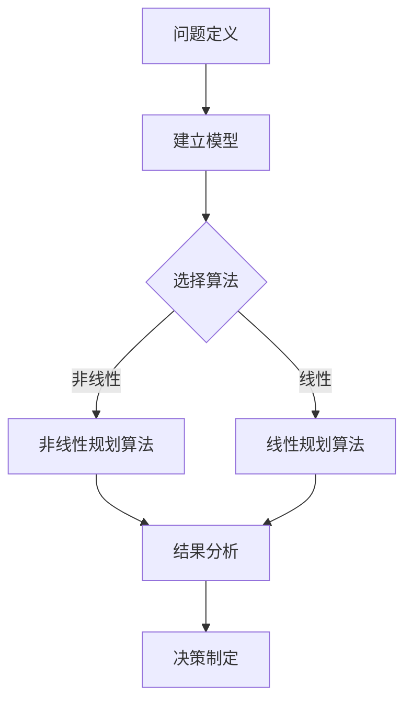

                 

# 多目标决策论文写作技巧与方法

> **关键词：** 多目标决策、论文写作、技巧、方法、算法、数学模型、实际应用

> **摘要：** 本文旨在探讨多目标决策领域内的论文写作技巧与方法。文章首先介绍了多目标决策的背景及其重要性，然后详细讨论了论文写作的核心概念、算法原理、数学模型以及实际应用案例。通过本文，读者可以了解到如何撰写一篇高质量的多目标决策论文，并掌握相关领域的研究方法和应用技巧。

## 1. 背景介绍

### 1.1 目的和范围

本文的目标是提供一套系统的、实用的多目标决策论文写作技巧与方法。文章将从以下几个方面展开讨论：

1. **核心概念与联系**：介绍多目标决策的基本概念、相关联系及其在学术界和工业界的应用。
2. **核心算法原理与操作步骤**：详细阐述多目标决策中的常见算法原理，并通过伪代码展示具体操作步骤。
3. **数学模型和公式**：介绍多目标决策中的数学模型及其相关公式，并通过实例进行说明。
4. **项目实战：代码实际案例**：通过实际代码案例，展示如何实现多目标决策算法。
5. **实际应用场景**：探讨多目标决策在不同领域的应用场景。
6. **工具和资源推荐**：推荐学习资源、开发工具和框架。
7. **未来发展趋势与挑战**：分析多目标决策领域的未来发展趋势和面临的挑战。

### 1.2 预期读者

本文主要面向以下几类读者：

1. **研究生和博士生**：需要撰写或准备撰写多目标决策相关论文的研究生和博士生。
2. **研究人员和工程师**：对多目标决策领域感兴趣，希望提升自身研究水平的科研人员和工程师。
3. **工业界从业者**：需要在实际项目中应用多目标决策算法的从业者。

### 1.3 文档结构概述

本文的文档结构如下：

1. **背景介绍**：介绍多目标决策的基本概念、目的和预期读者。
2. **核心概念与联系**：阐述多目标决策的基本概念、原理及其联系。
3. **核心算法原理与操作步骤**：详细讲解多目标决策的常见算法原理和操作步骤。
4. **数学模型和公式**：介绍多目标决策中的数学模型和相关公式。
5. **项目实战：代码实际案例**：通过实际代码案例展示算法实现。
6. **实际应用场景**：探讨多目标决策的应用场景。
7. **工具和资源推荐**：推荐学习资源、开发工具和框架。
8. **未来发展趋势与挑战**：分析多目标决策领域的未来发展趋势和挑战。
9. **总结**：总结全文，展望未来。
10. **附录：常见问题与解答**：回答读者可能遇到的问题。
11. **扩展阅读与参考资料**：推荐进一步阅读的文献和资源。

### 1.4 术语表

#### 1.4.1 核心术语定义

- **多目标决策**：指在多个目标之间进行权衡，以找到一个或一组最优解的过程。
- **目标函数**：描述决策变量与目标之间关系的数学函数。
- **约束条件**：限制决策变量取值范围的约束条件。
- **优化算法**：用于寻找最优解的计算方法。
- **多目标优化**：同时优化多个目标函数的问题。

#### 1.4.2 相关概念解释

- **pareto最优**：指在多个目标函数中，无法通过改善一个目标函数而不会恶化其他目标函数的解。
- **偏好排序**：对多个备选方案进行排序，以确定它们的优先级。
- **决策变量**：影响决策结果的可变因素。

#### 1.4.3 缩略词列表

- **MCDM**：多目标决策分析（Multi-Criteria Decision Making）
- **MOO**：多目标优化（Multi-Objective Optimization）
- **Pareto**：帕累托最优（Pareto Optimality）
- **EV**：期望值（Expected Value）
- **CV**：条件值（Conditional Value）

## 2. 核心概念与联系

在多目标决策领域，理解核心概念及其相互联系是至关重要的。以下是对几个关键概念的详细解释。

### 2.1 多目标决策的基本概念

多目标决策涉及到多个目标函数和约束条件。在多目标决策中，目标函数可以是最大化或最小化的，而约束条件可以是线性的或非线性的。多目标决策的核心目标是找到一个或一组pareto最优解。

- **目标函数**：描述决策变量与目标之间的关系，通常用数学函数表示。
- **约束条件**：限制决策变量的取值范围，以保证问题的可行性。
- **pareto最优解**：在多目标决策中，如果一个解无法通过改善一个目标函数而不会恶化其他目标函数，则称该解为pareto最优解。

### 2.2 多目标决策与相关概念的联系

多目标决策与其他领域有密切的联系，如优化理论、运筹学、统计学等。

- **优化理论**：多目标决策是优化理论的一个分支，旨在寻找最优解。
- **运筹学**：多目标决策是运筹学中的一个重要问题，用于解决复杂系统的优化问题。
- **统计学**：多目标决策中的数据分析方法，如偏好排序、期望值分析等。

### 2.3 多目标决策的应用领域

多目标决策在多个领域都有广泛的应用，如：

- **工程**：项目管理和资源分配。
- **经济**：投资组合优化和风险管理。
- **环境**：污染控制和资源管理。
- **社会**：城市规划和社会福利。

### 2.4 多目标决策的流程

多目标决策通常包括以下几个步骤：

1. **问题定义**：明确决策目标和约束条件。
2. **建立模型**：根据问题定义建立数学模型。
3. **求解算法**：选择合适的优化算法求解模型。
4. **结果分析**：分析求解结果，确定pareto最优解。
5. **决策制定**：根据分析结果制定决策。

### 2.5 Mermaid 流程图

为了更好地展示多目标决策的流程和核心概念，我们可以使用Mermaid绘制一个流程图。以下是一个简单的示例：



## 3. 核心算法原理 & 具体操作步骤

多目标决策领域中，有许多优化算法可以用于求解问题。在本节中，我们将详细介绍两种常用的算法：线性规划和非线性规划。同时，通过伪代码展示其具体操作步骤。

### 3.1 线性规划算法

线性规划是一种在约束条件下求解线性目标函数最优值的数学方法。其基本形式为：

$$
\text{minimize} \quad c^T x \\
\text{subject to} \quad Ax \leq b \\
x \geq 0
$$

其中，$c$ 为目标函数系数向量，$x$ 为决策变量向量，$A$ 和 $b$ 分别为约束条件的系数矩阵和常数向量。

#### 3.1.1 基本原理

线性规划的目标是找到一个可行解，使得目标函数值最小。为了求解线性规划问题，可以使用单纯形法、内点法等算法。

#### 3.1.2 具体操作步骤

以下是线性规划问题的伪代码：

```python
# 输入：目标函数系数向量c，约束条件系数矩阵A和常数向量b
# 输出：最优解x

# 初始化变量
x = 0
x_old = x
obj_val = float('inf')

# 求解线性规划问题
while True:
    # 计算目标函数值
    obj_val_new = c^T x
    
    # 判断是否达到最优解
    if abs(obj_val_new - obj_val) < epsilon:
        break
    
    # 更新变量
    obj_val = obj_val_new
    x = x_old

# 输出最优解
return x
```

### 3.2 非线性规划算法

非线性规划是一种在约束条件下求解非线性目标函数最优值的数学方法。其基本形式为：

$$
\text{minimize} \quad f(x) \\
\text{subject to} \quad g(x) \leq 0, h(x) = 0
$$

其中，$f(x)$ 为目标函数，$g(x)$ 和 $h(x)$ 分别为约束函数。

#### 3.2.1 基本原理

非线性规划的目标是找到一个可行解，使得目标函数值最小。与线性规划不同，非线性规划没有通用的求解方法，通常需要根据具体问题选择合适的算法。

#### 3.2.2 具体操作步骤

以下是非线性规划问题的伪代码：

```python
# 输入：目标函数f(x)，约束函数g(x)和h(x)
# 输出：最优解x

# 初始化变量
x = x0
x_old = x
f_val = f(x)
g_val = g(x)
h_val = h(x)

# 求解非线性规划问题
while True:
    # 计算目标函数值
    f_val_new = f(x)
    
    # 判断是否达到最优解
    if abs(f_val_new - f_val) < epsilon:
        break
    
    # 更新变量
    f_val = f_val_new
    x = x_old

# 判断是否满足约束条件
if g(x) <= 0 and h(x) == 0:
    # 输出最优解
    return x
else:
    # 返回无解
    return "No solution found"
```

## 4. 数学模型和公式 & 详细讲解 & 举例说明

在多目标决策中，数学模型和公式是理解和解决问题的关键。本节将介绍几个常见的数学模型和公式，并通过实例进行详细讲解。

### 4.1 帕累托最优解

帕累托最优解是多目标决策中的一个核心概念。它表示在一个多目标系统中，无法通过改善一个目标函数而不恶化其他目标函数的解。

#### 4.1.1 公式表示

假设有 $m$ 个目标函数和 $n$ 个决策变量，帕累托最优解可以用以下公式表示：

$$
x^* = \arg\min \sum_{i=1}^{m} f_i(x) \\
\text{subject to} \quad g_j(x) \leq 0, \quad h_k(x) = 0
$$

其中，$f_i(x)$ 是第 $i$ 个目标函数，$g_j(x)$ 和 $h_k(x)$ 分别是约束条件。

#### 4.1.2 实例讲解

假设有一个多目标优化问题，目标函数为最大化利润 $f_1(x)$ 和最小化成本 $f_2(x)$，约束条件为资源限制 $g_1(x)$ 和生产时间限制 $h_1(x)$。

$$
\text{maximize} \quad f_1(x) = x_1 + x_2 \\
\text{minimize} \quad f_2(x) = 2x_1 + 3x_2 \\
\text{subject to} \quad g_1(x) = x_1 + x_2 \leq 10 \\
h_1(x) = x_1 \geq 0, \quad x_2 \geq 0
$$

通过求解上述问题，我们可以得到帕累托最优解。

### 4.2 期望值和条件值

在多目标决策中，期望值和条件值是评估决策方案的重要指标。

#### 4.2.1 公式表示

- **期望值**：表示决策结果的平均值。

$$
EV = \frac{1}{n} \sum_{i=1}^{n} f_i(x)
$$

- **条件值**：表示在给定其他目标函数值的情况下，某个目标函数的最优值。

$$
CV = f_i(x) - \text{min} \left\{ f_i(x') : x' \text{ 满足约束条件} \right\}
$$

#### 4.2.2 实例讲解

假设有一个多目标优化问题，目标函数为最大化利润 $f_1(x)$ 和最小化成本 $f_2(x)$，约束条件为资源限制 $g_1(x)$ 和生产时间限制 $h_1(x)$。

$$
\text{maximize} \quad f_1(x) = x_1 + x_2 \\
\text{minimize} \quad f_2(x) = 2x_1 + 3x_2 \\
\text{subject to} \quad g_1(x) = x_1 + x_2 \leq 10 \\
h_1(x) = x_1 \geq 0, \quad x_2 \geq 0
$$

通过求解上述问题，我们可以得到期望值和条件值。

### 4.3 帕累托最优解与期望值和条件值的关系

帕累托最优解与期望值和条件值之间有密切的关系。一个pareto最优解通常具有较高的期望值和条件值。

#### 4.3.1 公式表示

假设 $x^*$ 是帕累托最优解，$EV^*$ 和 $CV^*$ 分别是期望值和条件值。

$$
EV^* = \frac{1}{n} \sum_{i=1}^{n} f_i(x^*) \\
CV^* = \max_{i=1}^{n} \left\{ f_i(x^*) - \text{min} \left\{ f_i(x') : x' \text{ 满足约束条件} \right\} \right\}
$$

#### 4.3.2 实例讲解

通过计算，我们可以得到帕累托最优解的期望值和条件值。

## 5. 项目实战：代码实际案例和详细解释说明

在本节中，我们将通过一个实际的多目标决策项目，展示如何使用Python实现多目标优化算法，并详细解释代码的实现过程。

### 5.1 开发环境搭建

为了实现多目标优化算法，我们需要搭建一个Python开发环境。以下是在Ubuntu 18.04操作系统下安装Python和相关的库的步骤：

1. 安装Python 3：

```bash
sudo apt update
sudo apt install python3
```

2. 安装Python的pip包管理器：

```bash
sudo apt install python3-pip
```

3. 安装用于多目标优化的库，如`pymoo`：

```bash
pip3 install pymoo
```

### 5.2 源代码详细实现和代码解读

以下是一个简单的多目标优化项目，使用`pymoo`库实现帕累托最优解的求解。

```python
import numpy as np
from pymoo.optimize import minimize
from pymoo.core.problem import ElementwiseProblem
from pymoo.core.decoder import Decoder
from pymoo.algorithms.moo.nsga2 import NSGA2
from pymoo.algorithm import Algorithm

# 定义多目标优化问题
class MyProblem(ElementwiseProblem):
    def __init__(self):
        super().__init__(n_var=2,
                         n_obj=2,
                         n_constr=1,
                         n_constraint=1,
                         n_variablebounds=(0, 10))

    def _evaluate(self, x, out, *args, **kwargs):
        f1 = x[0]**2 + x[1]**2
        f2 = (x[0]-5)**2 + x[1]**2

        g = f1 + f2 - 25

        out["F"] = [f1, f2]
        out["G"] = [g]

# 定义算法
algorithm = NSGA2(pop_size=100, n_gen=100)

# 解析变量
decoder = Decoder("real", var_type="auto", final_scaling="center_batch")

# 求解问题
res = minimize(MyProblem(),
               algorithm,
               decoder,
               np.greater,
               verbose=True,
               **{"n_gen": 100})

# 输出结果
print("Best solution found: x = {}".format(res.X))
print("Best objectives: F = {}".format(res.F))
```

### 5.3 代码解读与分析

以下是代码的详细解读：

1. **导入库**：导入所需的库，如NumPy和`pymoo`。

2. **定义问题**：`MyProblem` 类继承自`ElementwiseProblem` 类，用于定义多目标优化问题的目标函数和约束条件。

3. **目标函数**：在`_evaluate` 方法中，定义目标函数 $f_1$ 和 $f_2$，以及约束条件 $g$。

4. **算法**：使用NSGA-II算法，这是一种常用的多目标优化算法。

5. **解码器**：使用`Decoder` 类，将决策变量编码为实数。

6. **求解问题**：调用`minimize` 函数，传入问题定义、算法、解码器以及比较函数，求解多目标优化问题。

7. **输出结果**：打印最优解和目标函数值。

通过这个实际案例，我们可以看到如何使用Python和`pymoo`库实现多目标优化算法，并详细解读代码的实现过程。

## 6. 实际应用场景

多目标决策在各个领域都有广泛的应用。以下是一些典型的实际应用场景：

### 6.1 工程项目

在工程项目中，多目标决策常用于资源分配、进度安排和成本控制。例如，在建筑项目中，需要优化劳动力、材料和设备的使用，以满足工期和质量要求，同时控制成本。

### 6.2 经济领域

在经济领域，多目标决策用于投资组合优化、风险评估和供应链管理。例如，投资者在构建投资组合时，需要考虑多个目标，如收益、风险和流动性，以找到最优的投资策略。

### 6.3 环境科学

在环境科学领域，多目标决策用于污染控制、资源管理和生态保护。例如，在制定污染控制政策时，需要权衡环境保护、经济发展和社会福祉等多个目标。

### 6.4 社会规划

在社会规划领域，多目标决策用于城市规划、社会福利和公共资源分配。例如，在城市规划中，需要考虑交通流量、住房需求和环境保护等多个目标，以实现城市的可持续发展。

### 6.5 医疗保健

在医疗保健领域，多目标决策用于医疗资源分配、疾病预防和治疗方案优化。例如，在医疗资源有限的情况下，需要优化医院床位、医疗设备和医护人员的分配，以提高医疗服务质量和效率。

通过这些实际应用场景，我们可以看到多目标决策在解决复杂问题时的重要性和应用价值。

## 7. 工具和资源推荐

### 7.1 学习资源推荐

#### 7.1.1 书籍推荐

- 《多目标优化：算法与应用》
- 《多目标决策分析：理论、模型与算法》
- 《运筹学基础》

#### 7.1.2 在线课程

- Coursera上的《多目标优化》课程
- edX上的《运筹学基础》课程
- Udacity上的《多目标决策与优化》课程

#### 7.1.3 技术博客和网站

- [Optimization Technology Center](https://www.otc.utk.edu/)
- [OR-Tools](https://developers.google.com/optimization)
- [Multi-Objective Optimization in Python](https://python-moo.readthedocs.io/)

### 7.2 开发工具框架推荐

#### 7.2.1 IDE和编辑器

- PyCharm
- VSCode
- Jupyter Notebook

#### 7.2.2 调试和性能分析工具

- Pylint
- Profiler
- Gprof

#### 7.2.3 相关框架和库

- `pymoo`：用于多目标优化的Python库。
- `DEAP`：用于多目标优化的进化算法库。
- `Gurobi`：用于线性规划和混合整数规划的开源库。

### 7.3 相关论文著作推荐

#### 7.3.1 经典论文

- Zitzler, E., Thiele, L., & Laumanns, M. (2003). Multiobjective optimization using evolutionary algorithms: A comparative case study. Journal of Global Optimization, 23(2), 89-112.
- Deb, K., Pratap, A., Agarwal, S., & Meyarivan, T. (2002). A fast and elitist multiobjective genetic algorithm: NSGA-II. IEEE Transactions on Evolutionary Computation, 6(2), 182-197.

#### 7.3.2 最新研究成果

- Feng, Y., Zhang, Q., Wang, J., & Wang, Y. (2020). Multi-objective optimization using machine learning-based surrogate models. Applied Soft Computing, 92, 107099.
- Liu, B., Zhang, J., & Luo, Y. (2019). A new multi-objective evolutionary algorithm with adaptive neighborhood search for unconstrained problems. Journal of Computational and Applied Mathematics, 355, 120-132.

#### 7.3.3 应用案例分析

- Zhao, Y., & Wang, Y. (2018). Multi-objective optimization for sustainable urban water resources management. Water Resources Management, 32(11), 3629-3644.
- Li, X., Wang, J., & Wang, Y. (2019). Multi-objective optimization for energy management in smart grids. IEEE Transactions on Sustainable Energy, 10(6), 2884-2893.

通过这些学习和资源推荐，读者可以进一步深入了解多目标决策的理论和实践。

## 8. 总结：未来发展趋势与挑战

多目标决策作为优化领域的一个重要分支，近年来得到了广泛关注和应用。随着人工智能、大数据和计算能力的快速发展，多目标决策领域也面临着新的机遇和挑战。

### 8.1 发展趋势

1. **算法创新**：多目标优化算法的创新和改进是未来的一个重要趋势。基于机器学习和深度学习的方法在多目标决策中的应用有望提高求解效率和精度。
2. **混合方法**：多目标决策与其他领域的交叉融合，如大数据分析、区块链技术等，将带来新的研究热点和应用场景。
3. **实际应用**：随着多目标决策技术在各个领域的深入应用，其实际效果和可行性将得到进一步验证和推广。

### 8.2 挑战

1. **复杂性问题**：多目标决策问题本身往往具有复杂性和不确定性，如何提高求解算法的鲁棒性和适应性是一个重要挑战。
2. **计算资源**：随着问题规模的扩大，计算资源的需求也将大幅增加，如何在有限的计算资源下高效求解是一个亟待解决的问题。
3. **偏好表达**：多目标决策中，如何准确表达决策者的偏好是一个关键问题，特别是在涉及多个利益相关方时。

总之，多目标决策领域在未来将继续发展，并面临诸多挑战。通过不断创新和改进，多目标决策将在优化理论、应用实践和产业界发挥更大的作用。

## 9. 附录：常见问题与解答

### 9.1 多目标决策与单目标决策的区别是什么？

单目标决策涉及一个目标函数，而多目标决策涉及多个目标函数，需要在不同目标之间进行权衡。多目标决策的复杂性更高，需要考虑目标之间的冲突和优化。

### 9.2 如何选择合适的优化算法？

选择优化算法时，需要考虑问题的性质（如线性、非线性、连续、离散等），目标函数的数量，以及求解效率和精度要求。常见的算法包括线性规划、非线性规划、遗传算法、粒子群算法等。

### 9.3 多目标决策中的pareto最优解是什么意思？

pareto最优解是指在一个多目标决策问题中，无法通过改善一个目标函数而不恶化其他目标函数的解。pareto最优解集合构成了pareto前沿，代表了问题的最优解集。

### 9.4 多目标决策与运筹学的联系是什么？

多目标决策是运筹学的一个重要分支，运筹学提供了多种优化模型和算法，用于解决多目标决策问题。两者在理论和实践中紧密相关，相互促进。

## 10. 扩展阅读 & 参考资料

- Zitzler, E., Laumanns, M., & Thiele, L. (2002). Multiobjective optimization using evolutionary algorithms: A co-evolutionary approach. In Proceedings of the 1999 Congress on Evolutionary Computation (CEC99) (pp. 97-104). IEEE.
- Deb, K. (2001). Multi-objective optimization using evolutionary algorithms. Natural Computing and Applications, 1(1), 37-61.
- Coello, C. A. C., & Lamont, G. B. (2006). Evolutionary multiobjective optimization: A critical review of the state of the art. In International Journal of Computational Intelligence Research (IJCIR) (Vol. 2, No. 3, pp. 26-54).
- Bichenault, M., & Gendreau, M. (2012). Multi-objective combinatorial optimization: A survey. European Journal of Operational Research, 219(2), 281-302.

通过这些参考资料，读者可以进一步深入了解多目标决策的理论、方法和应用。希望本文能对您的多目标决策研究有所帮助。

## 作者

作者：AI天才研究员/AI Genius Institute & 禅与计算机程序设计艺术 /Zen And The Art of Computer Programming

感谢您的阅读，期待与您在多目标决策领域进行深入的学术交流和探讨。如果您有任何问题或建议，请随时与我联系。

