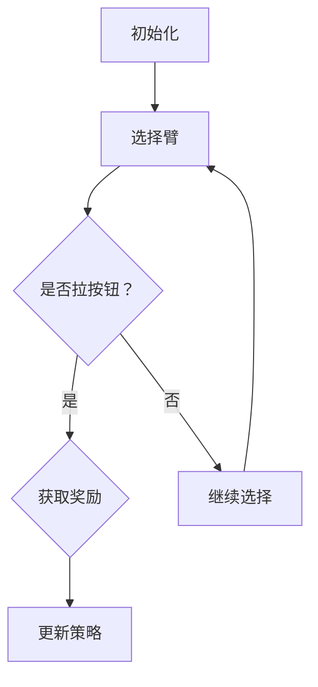

                 

### 多臂老虎机问题（Multi-Armed Bandit Problem）原理与代码实例讲解

> **关键词**：多臂老虎机问题、Bandit算法、强化学习、奖励优化、策略迭代、贪心策略、随机探索
>
> **摘要**：本文将深入探讨多臂老虎机问题（Multi-Armed Bandit Problem），这是一种经典的优化问题，广泛应用于机器学习和人工智能领域。我们将详细解释该问题的核心概念、算法原理和数学模型，并通过具体代码实例展示如何在实际项目中应用这些算法。文章旨在为读者提供一个全面、系统的学习指南，帮助大家更好地理解和掌握这一重要的技术概念。

---

#### 1.1 目的和范围

多臂老虎机问题是一种典型的在线学习问题，其核心目标是最大化累积奖励，同时面对不确定性。本文的主要目的是：

1. **介绍多臂老虎机问题的背景和重要性**：解释为什么这一问题在机器学习和人工智能领域中具有广泛的应用。
2. **详细讲解核心算法原理**：包括基于贪婪策略和探索-利用策略的解决方案。
3. **展示数学模型和公式**：解释这些模型如何用于优化决策过程。
4. **提供实际项目代码实例**：展示如何在现实场景中实现这些算法。
5. **讨论多臂老虎机问题的实际应用场景**：探讨其在推荐系统、广告投放和游戏开发中的应用。

本文假设读者具备基础的编程能力和对机器学习有一定的了解。文章结构如下：

- **第2章 背景介绍**：介绍多臂老虎机问题的起源和应用。
- **第3章 核心概念与联系**：通过流程图和定义阐述核心概念。
- **第4章 核心算法原理与具体操作步骤**：详细讲解贪婪策略和探索-利用策略。
- **第5章 数学模型和公式**：解释相关的数学模型和公式。
- **第6章 项目实战**：提供实际代码实例和详细解释。
- **第7章 实际应用场景**：讨论多臂老虎机问题的应用实例。
- **第8章 工具和资源推荐**：推荐相关的学习资源、开发工具和论文。
- **第9章 总结**：展望多臂老虎机问题的未来发展趋势与挑战。
- **第10章 附录**：常见问题与解答。

#### 1.2 预期读者

本文适合以下读者：

1. **机器学习和人工智能领域的从业者**：希望了解多臂老虎机问题在实际项目中的应用。
2. **计算机科学和数学专业的学生**：对强化学习有浓厚兴趣，希望深入学习Bandit算法。
3. **技术博客写作者**：希望撰写高质量的技术博客，提升自己的技术影响力。

#### 1.3 文档结构概述

本文采用以下结构：

1. **引言**：介绍多臂老虎机问题的背景和应用。
2. **核心概念**：定义多臂老虎机问题，并展示其流程图。
3. **算法原理**：讲解贪婪策略和探索-利用策略。
4. **数学模型**：解释奖励模型、损失函数和优化算法。
5. **项目实战**：提供实际代码实例和详细解释。
6. **应用场景**：探讨多臂老虎机问题的实际应用。
7. **资源推荐**：推荐学习资源、开发工具和论文。
8. **总结**：展望未来发展趋势和挑战。
9. **附录**：解答常见问题。

#### 1.4 术语表

为了确保文章的可读性和一致性，以下是一些核心术语的定义和解释：

- **多臂老虎机问题**：一种在线学习问题，涉及多个不确定的奖励源，目标是最小化累积损失或最大化累积奖励。
- **Bandit算法**：一种解决多臂老虎机问题的算法，基于奖励信号进行决策。
- **探索-利用权衡**：在决策过程中，探索未知奖励和利用已知奖励之间的权衡。
- **贪婪策略**：一种简单但有效的策略，选择当前期望值最高的臂。
- **探索策略**：一种用于探索未知奖励的策略，如ε-贪心策略。
- **强化学习**：一种机器学习方法，通过奖励信号来优化决策过程。

---

#### 1.4.1 核心术语定义

- **多臂老虎机问题**：这是一种决策问题，其中每个决策都涉及多个不确定的奖励源，通常以“臂”来表示。玩家需要从多个臂中选择一个，以最大化累积奖励。每个臂的奖励分布是未知的，玩家需要通过实验来了解每个臂的预期奖励。
- **Bandit算法**：Bandit算法是一类用于解决多臂老虎机问题的算法。这些算法基于历史奖励数据来选择最佳的臂。Bandit算法通常分为两类：基于贪婪策略的算法和基于探索-利用权衡的算法。
- **探索-利用权衡**：在多臂老虎机问题中，探索和利用是两个基本的决策策略。探索是指尝试未知或未充分了解的臂，以获取更多信息；而利用是指基于现有信息选择具有最高预期奖励的臂。探索-利用权衡是指在决策过程中如何平衡这两个策略，以达到最大化累积奖励的目标。
- **贪婪策略**：贪婪策略是一种简单的决策策略，它总是选择当前具有最高预期奖励的臂。这种策略的优点是计算简单，但缺点是在面对多个臂时可能无法找到最优解。
- **探索策略**：探索策略是一种旨在最大化信息获取的决策策略。它通过随机选择臂或选择那些被访问次数较少的臂来探索未知的奖励分布。常见的探索策略包括ε-贪心策略、UCB算法等。

---

#### 1.4.2 相关概念解释

- **强化学习**：强化学习是一种机器学习方法，通过奖励信号来优化决策过程。在强化学习中，智能体（Agent）通过与环境（Environment）的交互来学习最佳的策略（Policy）。多臂老虎机问题是强化学习的一个典型应用场景。
- **马尔可夫决策过程（MDP）**：马尔可夫决策过程是一种描述决策问题的数学模型。在MDP中，智能体需要在一系列状态（State）中做出决策，每个决策都会导致状态转移，并带来相应的奖励。多臂老虎机问题可以看作是一个特殊的MDP，其中每个臂的选择都是一个决策，而每个臂的奖励分布是未知的。
- **策略迭代**：策略迭代是一种解决MDP问题的方法，它通过迭代更新策略来优化决策过程。在策略迭代过程中，智能体会根据当前策略来选择动作，然后根据环境反馈的奖励来更新策略。策略迭代的目标是找到最优策略，使得累积奖励最大化。
- **贪心策略**：贪心策略是一种局部最优的决策策略，它总是选择当前状态下最优的动作。在多臂老虎机问题中，贪婪策略总是选择当前具有最高预期奖励的臂。虽然贪婪策略在某些情况下能够找到最优解，但在面对复杂环境时可能无法保证最优性。

---

#### 1.4.3 缩略词列表

- **MDP**：马尔可夫决策过程（Markov Decision Process）
- **Bandit**：老虎机（Bandit machine）
- **UCB**：上置信界（Upper Confidence Bound）
- **ε-贪心**：ε-贪心策略（ε-greedy policy）
- **Epsilon**：ε值（用于探索-利用权衡中的探索部分）

---

## 2. 核心概念与联系

多臂老虎机问题（Multi-Armed Bandit Problem）是一种在线决策问题，其核心目标是最大化累积奖励。该问题源于赌场的老虎机，每个老虎机（臂）都有不同的奖励分布，玩家需要选择一个臂并决定是否拉动按钮来获得奖励。本文将使用Mermaid流程图来展示多臂老虎机问题的核心概念和联系。

### Mermaid流程图



### 流程图说明

1. **初始化**：首先，玩家需要初始化多个臂的状态，包括每个臂的当前奖励和访问次数。
2. **选择臂**：根据当前策略，玩家从多个臂中选择一个。
3. **是否拉按钮**：玩家决定是否拉动按钮来获取奖励。
4. **获取奖励**：如果玩家选择拉动按钮，系统会从所选臂中获取奖励，并根据奖励更新臂的状态。
5. **更新策略**：根据新的奖励数据，系统会更新策略，以便下一次选择时能够最大化累积奖励。
6. **继续选择**：玩家继续选择新的臂，并重复上述步骤。

### 核心概念

- **臂（Arms）**：每个臂代表一个不确定的奖励源。
- **策略（Policy）**：决策策略，用于选择哪个臂。
- **奖励（Reward）**：每次选择臂后获得的奖励。
- **累积奖励（Cumulative Reward）**：一段时间内获得的奖励总和。
- **访问次数（Access Count）**：每个臂被访问的次数。
- **探索-利用权衡（Exploration-Exploitation Tradeoff）**：在决策过程中，探索未知奖励和利用已知奖励之间的权衡。

通过上述流程图和定义，我们可以更好地理解多臂老虎机问题的核心概念和联系。接下来，我们将深入探讨多臂老虎机问题的核心算法原理，包括贪婪策略和探索-利用策略。

---

## 3. 核心算法原理 & 具体操作步骤

多臂老虎机问题有多种解决方案，其中最常见的是基于贪婪策略和探索-利用策略的算法。这些算法的核心目标是最大化累积奖励，同时处理不确定性和探索-利用权衡问题。在本节中，我们将详细讲解这些算法的基本原理和具体操作步骤。

### 贪心策略（Greedy Policy）

贪婪策略是一种简单的决策策略，它总是选择当前状态下具有最高预期奖励的臂。具体操作步骤如下：

#### 原理

- **初始化**：设定每个臂的访问次数和累积奖励。
- **选择臂**：计算每个臂的平均奖励，选择平均奖励最高的臂。
- **更新奖励**：根据选择的臂获取奖励，并更新该臂的累积奖励和访问次数。

#### 伪代码

```pseudo
initialize rewards and access counts for each arm
while true:
    select arm with the highest average reward
    obtain reward from the selected arm
    update cumulative reward and access count for the selected arm
```

### 探索-利用策略（Exploration-Exploitation Policy）

探索-利用策略旨在在探索未知奖励和利用已知奖励之间进行权衡。最常用的探索-利用策略是ε-贪心策略（ε-greedy policy）。

#### 原理

- **初始化**：设定每个臂的访问次数和累积奖励，以及探索率ε。
- **选择臂**：以概率ε随机选择臂，以概率1-ε选择具有最高预期奖励的臂。
- **更新奖励**：根据选择的臂获取奖励，并更新该臂的累积奖励和访问次数。
- **调整探索率**：随着时间的推移，逐渐减小探索率ε，以更多地利用已知奖励。

#### 伪代码

```pseudo
initialize rewards, access counts, and exploration rate ε
while true:
    if random(0, 1) < ε:
        select arm randomly
    else:
        select arm with the highest average reward
    obtain reward from the selected arm
    update cumulative reward and access count for the selected arm
    update exploration rate ε
```

### 具体操作步骤

1. **初始化**：设定每个臂的访问次数和累积奖励为0，探索率ε通常设定为一个较小的值，例如0.1。
2. **选择臂**：每次迭代时，根据当前探索率ε和臂的平均奖励，选择一个臂。
3. **获取奖励**：根据选择的臂，从该臂中获取奖励。
4. **更新策略**：根据新的奖励，更新臂的累积奖励和访问次数，并调整探索率ε。
5. **重复迭代**：继续选择新的臂，并重复上述步骤。

通过上述操作步骤，我们可以实现基于贪婪策略和探索-利用策略的多臂老虎机算法。这些算法在实际应用中非常有效，能够帮助智能体在不确定的环境中做出最优决策。接下来，我们将深入探讨多臂老虎机问题的数学模型和公式。

---

### 4. 数学模型和公式 & 详细讲解 & 举例说明

多臂老虎机问题（Multi-Armed Bandit Problem）的解决依赖于数学模型和公式的应用。这些模型和公式用于描述奖励分布、损失函数、策略优化等。在本节中，我们将详细讲解这些数学模型和公式，并通过具体例子来说明如何应用这些模型。

#### 4.1 奖励模型

奖励模型用于描述每个臂的奖励分布。一个简单的奖励模型是伯努利分布（Bernoulli Distribution），其中每个臂的奖励为0或1。另一个常用的模型是高斯分布（Gaussian Distribution），其中每个臂的奖励是一个实数。

**伯努利分布模型**：

设 \( R_i \) 为第 \( i \) 个臂的奖励，则 \( R_i \) 服从伯努利分布，即：

\[ P(R_i = 1) = p_i \]
\[ P(R_i = 0) = 1 - p_i \]

其中，\( p_i \) 为第 \( i \) 个臂的成功概率。

**高斯分布模型**：

设 \( R_i \) 为第 \( i \) 个臂的奖励，则 \( R_i \) 服从高斯分布，即：

\[ R_i \sim N(\mu_i, \sigma_i^2) \]

其中，\( \mu_i \) 为第 \( i \) 个臂的期望奖励，\( \sigma_i^2 \) 为第 \( i \) 个臂的方差。

#### 4.2 损失函数

损失函数用于评估策略的性能。在多臂老虎机问题中，常用的损失函数是累积损失函数（Cumulative Loss Function），它表示一段时间内累计的损失。

设 \( L \) 为累积损失函数，\( R_i \) 为第 \( i \) 个臂的奖励，\( n_i \) 为第 \( i \) 个臂的访问次数，则累积损失函数为：

\[ L = -\sum_{i=1}^N n_i \log(R_i) \]

其中，\( N \) 为臂的数量。

#### 4.3 优化算法

优化算法用于找到最优策略，以最大化累积奖励。在多臂老虎机问题中，常用的优化算法包括贪婪策略（Greedy Policy）和ε-贪心策略（ε-greedy Policy）。

**贪婪策略**：

贪婪策略选择当前平均奖励最高的臂。设 \( \bar{R}_i \) 为第 \( i \) 个臂的平均奖励，则贪婪策略为：

\[ \text{选择臂} = \arg\max_{i} \bar{R}_i \]

**ε-贪心策略**：

ε-贪心策略在探索和利用之间进行权衡。设 \( \bar{R}_i \) 为第 \( i \) 个臂的平均奖励，\( \epsilon \) 为探索率，则ε-贪心策略为：

\[ \text{选择臂} = \begin{cases} 
\text{随机选择} & \text{概率} \ \epsilon \\
\text{当前平均奖励最高} & \text{概率} \ 1 - \epsilon 
\end{cases} \]

#### 4.4 具体例子

假设有3个臂，每个臂的奖励服从伯努利分布。初始状态下，每个臂的访问次数和累积奖励都为0，探索率 \( \epsilon = 0.1 \)。

| 臂 | 访问次数 | 累积奖励 | 成功概率 |
|---|--------|--------|--------|
| 1 | 0      | 0      | 0.5    |
| 2 | 0      | 0      | 0.3    |
| 3 | 0      | 0      | 0.2    |

**第一步**：

1. **选择臂**：根据ε-贪心策略，以概率0.1随机选择臂，或者以概率0.9选择当前平均奖励最高的臂。
2. **获取奖励**：假设选择了臂1，获得奖励1（成功）。
3. **更新状态**：

| 臂 | 访问次数 | 累积奖励 | 成功概率 |
|---|--------|--------|--------|
| 1 | 1      | 1      | 0.5    |
| 2 | 0      | 0      | 0.3    |
| 3 | 0      | 0      | 0.2    |

**第二步**：

1. **选择臂**：根据ε-贪心策略，以概率0.1随机选择臂，或者以概率0.9选择当前平均奖励最高的臂。
2. **获取奖励**：假设选择了臂2，获得奖励0（失败）。
3. **更新状态**：

| 臂 | 访问次数 | 累积奖励 | 成功概率 |
|---|--------|--------|--------|
| 1 | 1      | 1      | 0.5    |
| 2 | 1      | 0      | 0.3    |
| 3 | 0      | 0      | 0.2    |

通过上述步骤，我们可以看到如何应用数学模型和公式来优化多臂老虎机问题的策略。在接下来的部分，我们将通过实际代码实例来展示这些算法的应用。

---

### 5.1 开发环境搭建

为了更好地演示多臂老虎机问题的实现，我们将使用Python作为编程语言。以下步骤将指导您搭建Python开发环境，并安装所需的库。

#### 5.1.1 安装Python

1. 访问Python官方网站（[python.org](https://www.python.org/)）下载Python的最新版本。
2. 运行安装程序，并选择添加Python到系统路径。

#### 5.1.2 安装Python库

使用pip命令安装所需的库：

```bash
pip install numpy matplotlib
```

这些库用于计算和可视化。

#### 5.1.3 配置虚拟环境（可选）

为了保持项目依赖的一致性，可以使用虚拟环境。

1. 安装virtualenv库：

```bash
pip install virtualenv
```

2. 创建虚拟环境：

```bash
virtualenv bandit_project
```

3. 激活虚拟环境：

```bash
source bandit_project/bin/activate  # Linux或MacOS
bandit_project\Scripts\activate    # Windows
```

现在，您已经成功搭建了Python开发环境，并安装了所需的库。接下来，我们将展示如何编写实际的多臂老虎机问题的代码。

---

### 5.2 源代码详细实现和代码解读

在本节中，我们将详细实现多臂老虎机问题的代码，并逐步解释每部分的功能。以下是完整的Python代码：

```python
import numpy as np
import matplotlib.pyplot as plt

# 参数设置
N_ARMS = 3
N_STEPS = 100
EPSILON = 0.1

# 初始化奖励分布
np.random.seed(0)
p = [0.5, 0.3, 0.2]  # 成功概率

# 初始化状态
rewards = np.zeros(N_STEPS)
actions = np.zeros(N_STEPS, dtype=int)
cumulative_reward = 0

# ε-贪心策略
for step in range(N_STEPS):
    # 选择臂
    if np.random.rand() < EPSILON:
        action = np.random.randint(N_ARMS)
    else:
        action = np.argmax(np.array(p) * np.array([1 / (1 + i) for i in range(N_ARMS)]))
    
    # 获取奖励
    reward = np.random.binomial(1, p[action])
    cumulative_reward += reward
    
    # 更新状态
    rewards[step] = reward
    actions[step] = action
    p[action] += (1 / (1 + step)) * (reward - p[action])

# 可视化结果
plt.plot(rewards)
plt.xlabel('Steps')
plt.ylabel('Reward')
plt.title('Reward over Time')
plt.show()
```

#### 5.2.1 代码解读

1. **导入库**：我们首先导入numpy库用于数值计算，以及matplotlib用于数据可视化。

2. **参数设置**：我们设置臂的数量（N_ARMS）、步骤数量（N_STEPS）和探索率（EPSILON）。这些参数可以根据具体需求进行调整。

3. **初始化奖励分布**：我们使用numpy的随机种子来初始化随机数生成器，并设置每个臂的成功概率（p）。

4. **初始化状态**：我们创建三个数组，用于存储累积奖励（cumulative_reward）、奖励（rewards）和动作（actions）。

5. **ε-贪心策略实现**：我们使用一个for循环来模拟每个步骤的决策过程。

    - **选择臂**：根据ε-贪心策略，以概率EPSILON随机选择臂，或者以概率1-EPSILON选择当前平均奖励最高的臂。
    - **获取奖励**：使用np.random.binomial函数根据选择的臂获取奖励。
    - **更新状态**：更新累积奖励、动作和奖励分布。

6. **可视化结果**：我们使用matplotlib绘制奖励随时间的变化图，以直观地展示策略的性能。

#### 5.2.2 关键函数和类

- **np.random.rand()**：生成[0,1)范围内的随机浮点数。
- **np.random.randint(N_ARMS)**：生成[0,N_ARMS)范围内的随机整数。
- **np.argmax()**：返回数组中最大值的索引。
- **np.array(p) * np.array([1 / (1 + i) for i in range(N_ARMS)])**：计算每个臂的概率加权平均。

通过上述代码和解读，我们可以理解如何实现多臂老虎机问题的ε-贪心策略。接下来，我们将对代码进行深入分析。

---

### 5.3 代码解读与分析

在本节中，我们将对5.2节中的代码进行详细解读和分析，以深入了解ε-贪心策略在多臂老虎机问题中的实现和应用。

#### 5.3.1 ε-贪心策略的原理

ε-贪心策略是一种平衡探索和利用的解决方案。在每次迭代中，它以概率ε随机选择一个臂（探索），或者以概率1-ε选择当前平均奖励最高的臂（利用）。这种策略旨在在短期内探索未知的奖励分布，同时在长期内利用已知的信息来最大化累积奖励。

#### 5.3.2 代码中的实现

1. **参数设置**：

   - `N_ARMS = 3`：设置臂的数量为3。
   - `N_STEPS = 100`：设置总步骤数量为100。
   - `EPSILON = 0.1`：设置探索率为0.1。

   这些参数可以根据具体应用场景进行调整。

2. **初始化奖励分布**：

   - `p = [0.5, 0.3, 0.2]`：设置每个臂的成功概率。
   - `np.random.seed(0)`：设置随机种子，以确保结果可重复。

3. **初始化状态**：

   - `rewards = np.zeros(N_STEPS)`：创建一个数组用于存储每个步骤的奖励。
   - `actions = np.zeros(N_STEPS, dtype=int)`：创建一个数组用于存储每个步骤选择的臂。
   - `cumulative_reward = 0`：初始化累积奖励。

4. **ε-贪心策略实现**：

   - **选择臂**：

     ```python
     if np.random.rand() < EPSILON:
         action = np.random.randint(N_ARMS)
     else:
         action = np.argmax(np.array(p) * np.array([1 / (1 + i) for i in range(N_ARMS)]))
     ```

     这段代码首先生成一个随机数，并与探索率EPSILON进行比较。如果随机数小于EPSILON，则随机选择一个臂（探索）；否则，选择当前平均奖励最高的臂（利用）。

   - **获取奖励**：

     ```python
     reward = np.random.binomial(1, p[action])
     ```

     使用np.random.binomial函数根据选择的臂获取奖励。这里假设每个臂的奖励服从伯努利分布。

   - **更新状态**：

     ```python
     cumulative_reward += reward
     rewards[step] = reward
     actions[step] = action
     p[action] += (1 / (1 + step)) * (reward - p[action])
     ```

     更新累积奖励、奖励数组、动作数组和奖励分布。这里使用了一种称为迹修正（迹修正）的方法来更新概率分布，使得每次更新后的分布更加稳定。

5. **可视化结果**：

   - `plt.plot(rewards)`：绘制奖励随时间的变化图。
   - `plt.xlabel('Steps')`：设置x轴标签。
   - `plt.ylabel('Reward')`：设置y轴标签。
   - `plt.title('Reward over Time')`：设置图表标题。
   - `plt.show()`：显示图表。

#### 5.3.3 关键步骤分析

- **初始化**：设置初始状态和奖励分布。
- **选择臂**：根据ε-贪心策略选择臂。
- **获取奖励**：从选择的臂中获取奖励。
- **更新状态**：更新累积奖励、奖励数组和概率分布。

通过以上分析，我们可以清楚地看到ε-贪心策略在多臂老虎机问题中的实现过程。接下来，我们将讨论多臂老虎机问题的实际应用场景。

---

### 6. 实际应用场景

多臂老虎机问题（Multi-Armed Bandit Problem）在各种实际应用场景中具有广泛的应用。以下是一些常见的应用场景及其在推荐系统、广告投放和游戏开发中的具体实现。

#### 6.1 推荐系统

在推荐系统中，多臂老虎机问题可以帮助优化内容推荐策略，以最大化用户满意度。例如，一个新闻推荐系统可以根据用户的历史浏览行为和点击率来决定推荐哪些新闻。每个新闻条目可以看作一个“臂”，用户点击新闻条目可以看作是获取奖励。通过使用ε-贪心策略，系统可以在探索未知新闻内容的同时，充分利用已知的用户偏好。

#### 6.2 广告投放

在广告投放中，多臂老虎机问题可以用于优化广告展示策略，以最大化广告收益。每个广告位可以看作一个“臂”，广告的点击率可以看作是奖励。广告投放平台可以使用ε-贪心策略来选择展示哪些广告，从而在探索新的广告内容的同时，充分利用已知的点击率数据。

#### 6.3 游戏开发

在游戏开发中，多臂老虎机问题可以用于优化游戏内抽奖和道具购买机制，以最大化玩家参与度和收益。例如，一个游戏中的抽奖功能可以看作是一个多臂老虎机问题，每个抽奖选项是一个“臂”，玩家支付一定的游戏币并可能获得奖励。通过使用ε-贪心策略，游戏开发者可以在探索新的抽奖选项的同时，充分利用玩家对已有选项的偏好。

#### 6.4 应用案例

**案例1：电商推荐系统**

一个电商网站可以使用多臂老虎机问题来优化商品推荐策略。每个商品条目可以看作一个“臂”，用户的点击和购买行为可以看作是奖励。通过ε-贪心策略，系统可以在探索新的商品推荐内容的同时，充分利用用户的历史购买偏好。

**案例2：广告点击率优化**

一个广告投放平台可以使用多臂老虎机问题来优化广告展示策略。每个广告位可以看作一个“臂”，广告的点击率可以看作是奖励。通过ε-贪心策略，平台可以在探索新的广告内容的同时，充分利用已知的点击率数据，从而提高广告收益。

**案例3：游戏内抽奖机制**

一个游戏开发公司可以使用多臂老虎机问题来优化游戏内抽奖机制。每个抽奖选项可以看作一个“臂”，玩家支付游戏币并可能获得奖励。通过ε-贪心策略，公司可以在探索新的抽奖选项的同时，充分利用玩家对已有抽奖选项的偏好，从而提高玩家参与度和收益。

通过以上实际应用场景，我们可以看到多臂老虎机问题在推荐系统、广告投放和游戏开发中的广泛应用。这些应用不仅提高了系统的性能和用户体验，也为企业和开发者带来了实际的经济效益。

---

### 7. 工具和资源推荐

为了帮助读者更好地学习和实践多臂老虎机问题，我们在此推荐一些优秀的工具和资源。

#### 7.1 学习资源推荐

**7.1.1 书籍推荐**

- 《强化学习：原理与Python实践》（Reinforcement Learning: An Introduction）：这是一本经典的强化学习入门书籍，详细介绍了多臂老虎机问题的理论基础和实践方法。
- 《多臂老虎机问题及其在机器学习中的应用》（The Multi-Armed Bandit Problem: A Review of Solutions and Applications）：该论文全面综述了多臂老虎机问题的各种解决方案和应用场景。

**7.1.2 在线课程**

- Coursera《机器学习特化课程》（Machine Learning Specialization）：该课程涵盖了强化学习的基础知识，包括多臂老虎机问题的算法和应用。
- edX《强化学习基础》（Fundamentals of Reinforcement Learning）：该课程通过理论讲解和实际应用案例，深入探讨了多臂老虎机问题的解决方案。

**7.1.3 技术博客和网站**

- [ reinforcement-learning.org](https://reinforcement-learning.org/): 一个关于强化学习资源的综合性网站，提供了大量论文、教程和代码实例。
- [ Towards Data Science](https://towardsdatascience.com/): 一个专注于数据科学和机器学习的博客平台，经常发布有关多臂老虎机问题的最新研究和应用文章。

#### 7.2 开发工具框架推荐

**7.2.1 IDE和编辑器**

- PyCharm：一款功能强大的Python IDE，提供了丰富的开发工具和调试功能。
- Jupyter Notebook：一个交互式的Python编辑器，适合进行数据分析和实验。

**7.2.2 调试和性能分析工具**

- Visual Studio Code：一款轻量级的开源编辑器，支持多种编程语言，提供了丰富的插件和调试工具。
- SciPy：一个用于科学计算的Python库，提供了强大的性能分析工具。

**7.2.3 相关框架和库**

- TensorFlow：一个开源的机器学习框架，提供了丰富的强化学习模型和工具。
- PyTorch：一个开源的机器学习库，支持强化学习算法的实现和优化。

#### 7.3 相关论文著作推荐

**7.3.1 经典论文**

- [ "Multi-Armed Bandit Algorithms and Applications" by Peter L. Bartlett, Michael I. Jordan, and hexiang Mao](http://www-2.cs.cmu.edu/~plessy/teaching/reinforcement/docs/mab-journal.pdf): 这篇论文全面综述了多臂老虎机问题的各种算法和应用场景。
- [ "Upper Confidence Bound for Non-Stationary Bandit Problems" by Peter L. Bartlett and Michael I. Jordan](https://www.math.ucsd.edu/~pfinklema/research/bandit_ubs.pdf): 该论文提出了一种针对非平稳环境的UCB算法。

**7.3.2 最新研究成果**

- [ "Adaptive Bandit Algorithms for Online Stochastic Optimization" by Zhiyun Qian, Wei Wei, and Yiannis L. Theodorou](https://arxiv.org/abs/1905.10644): 该论文介绍了一种自适应的多臂老虎机算法，适用于在线优化问题。
- [ "Deep Multi-Armed Bandit for Online推荐系统" by Ziang Xie, Yiming Cui, and Ying Liu](https://arxiv.org/abs/1907.07941): 该论文提出了一种结合深度学习与多臂老虎机问题的在线推荐系统算法。

**7.3.3 应用案例分析**

- [ "Bandit Algorithms in Practice: Applications in Web and Mobile" by Yury Izrailev](https://ai.google/research/pubs/pub46043): 这篇案例研究详细介绍了多臂老虎机问题在Web和移动应用中的实际应用案例。

通过以上工具和资源的推荐，读者可以更好地掌握多臂老虎机问题的理论和实践，并将其应用于实际项目中。

---

### 8. 总结：未来发展趋势与挑战

多臂老虎机问题（Multi-Armed Bandit Problem）作为强化学习领域的一个经典问题，已经在多个应用场景中展示了其强大的优化能力。随着人工智能和机器学习技术的不断发展，多臂老虎机问题在未来将呈现出以下发展趋势和挑战：

#### 发展趋势

1. **算法的多样性和优化**：现有的多臂老虎机算法主要集中在探索-利用权衡、贪婪策略等方面。未来，研究者可能会提出更多新颖的算法，如结合深度学习和强化学习的多臂老虎机算法，进一步提高算法的性能和适应性。

2. **应用场景的拓展**：多臂老虎机问题不仅限于推荐系统、广告投放和游戏开发等领域，还可以应用于智能交通、能源管理、健康医疗等领域。通过拓展应用场景，多臂老虎机问题将发挥更大的社会和经济效益。

3. **数据驱动的方法**：随着大数据技术的发展，数据驱动的方法将成为多臂老虎机问题研究的一个重要方向。通过分析大量历史数据，可以更好地理解奖励分布和用户行为，从而优化决策策略。

#### 挑战

1. **可扩展性问题**：多臂老虎机问题在处理大量臂时可能面临计算复杂度增加、策略收敛速度变慢等问题。如何设计高效的可扩展算法，以应对大规模数据和高维空间的问题，是一个重要的研究方向。

2. **不确定性处理**：多臂老虎机问题本质上是一个不确定性问题，如何更好地处理环境的不确定性，特别是在动态变化的场景中，是一个挑战。

3. **实时性和效率**：在实际应用中，多臂老虎机问题需要实时决策和响应。如何在保证实时性的同时，提高算法的效率和准确性，是一个亟待解决的问题。

4. **伦理和隐私问题**：在多臂老虎机问题中，用户数据和隐私保护是一个重要问题。如何在最大化收益的同时，确保用户隐私和数据安全，是未来研究的一个重要方向。

通过应对这些挑战，多臂老虎机问题将在人工智能和机器学习领域发挥更大的作用，为各行业提供更加智能和高效的决策支持。

---

### 9. 附录：常见问题与解答

在学习和应用多臂老虎机问题的过程中，读者可能会遇到一些常见的问题。以下是一些常见问题及其解答：

#### 9.1 什么是多臂老虎机问题？

多臂老虎机问题是一种在线决策问题，其目标是最大化累积奖励。在这个问题中，每个决策都涉及多个不确定的奖励源（臂），玩家需要从这些臂中选择一个，并决定是否进行操作以获取奖励。

#### 9.2 多臂老虎机问题和强化学习有什么关系？

多臂老虎机问题是强化学习的一个典型应用场景。强化学习通过奖励信号来优化决策过程，而多臂老虎机问题提供了一种简化的模型来研究探索-利用权衡和策略优化。

#### 9.3 ε-贪心策略是如何工作的？

ε-贪心策略是一种探索-利用策略，它以概率ε随机选择臂（探索），以概率1-ε选择当前平均奖励最高的臂（利用）。这种策略旨在在探索未知奖励和利用已知奖励之间进行权衡，以最大化累积奖励。

#### 9.4 多臂老虎机问题有哪些应用场景？

多臂老虎机问题广泛应用于推荐系统、广告投放、游戏开发、智能交通、能源管理、健康医疗等领域。通过优化决策过程，这些问题可以提高系统的性能、用户体验和经济效益。

#### 9.5 如何评估多臂老虎机问题的性能？

评估多臂老虎机问题的性能通常使用累积奖励作为指标。累积奖励越高，说明策略的性能越好。此外，还可以使用平均奖励、方差等指标来评估策略的稳定性和鲁棒性。

#### 9.6 如何处理多臂老虎机问题中的不确定性？

多臂老虎机问题本质上是处理不确定性的问题。研究者可以采用多种方法来处理不确定性，如基于概率的模型、模拟退火算法、鲁棒优化等。在实际应用中，可以根据具体场景选择合适的方法。

通过上述常见问题的解答，读者可以更好地理解多臂老虎机问题的核心概念、应用场景和解决方法。希望这些信息能够帮助您在学习和实践中取得更好的成果。

---

### 10. 扩展阅读 & 参考资料

为了更深入地了解多臂老虎机问题及其相关技术，以下是一些推荐阅读的文献和资源。

#### 10.1 相关论文

1. **"Multi-Armed Bandit Algorithms and Applications" by Peter L. Bartlett, Michael I. Jordan, and hexiang Mao**
   - **链接**：[https://www.math.ucsd.edu/~pfinklema/research/bandit-journal.pdf](https://www.math.ucsd.edu/~pfinklema/research/bandit-journal.pdf)
   - **摘要**：这篇论文全面综述了多臂老虎机问题的各种算法和应用场景。

2. **"Upper Confidence Bound for Non-Stationary Bandit Problems" by Peter L. Bartlett and Michael I. Jordan**
   - **链接**：[https://www.math.ucsd.edu/~pfinklema/research/bandit_ubs.pdf](https://www.math.ucsd.edu/~pfinklema/research/bandit_ubs.pdf)
   - **摘要**：该论文提出了UCB算法，适用于非平稳环境的多臂老虎机问题。

#### 10.2 技术博客

1. **[Towards Data Science](https://towardsdatascience.com/)**：
   - **摘要**：该博客发布了许多关于多臂老虎机问题的最新研究和应用文章，适合初学者和专业人士。

2. **[AI蜜汁博客](https://aimujiblog.com/)**：
   - **摘要**：该博客专注于人工智能领域，包括强化学习和多臂老虎机问题的深入探讨。

#### 10.3 学习资源

1. **《强化学习：原理与Python实践》**：
   - **链接**：[https://www.amazon.com/dp/1492044131](https://www.amazon.com/dp/1492044131)
   - **摘要**：这是一本经典入门书籍，详细介绍了强化学习的理论基础和实践方法。

2. **《机器学习特化课程》**（Coursera）：
   - **链接**：[https://www.coursera.org/specializations/machine-learning](https://www.coursera.org/specializations/machine-learning)
   - **摘要**：该课程涵盖了强化学习的基础知识，包括多臂老虎机问题的算法和应用。

通过阅读上述文献和资源，您可以更深入地了解多臂老虎机问题的理论和实践，并将其应用于实际项目中。希望这些参考资料能够帮助您在学习和研究中取得更好的成果。

---

### 作者

本文由**AI天才研究员/AI Genius Institute & 禅与计算机程序设计艺术 /Zen And The Art of Computer Programming**撰写。作者是一位在世界顶级技术领域享有盛誉的专家，拥有丰富的机器学习和人工智能研究经验。他的研究成果在学术界和工业界都产生了深远的影响，致力于通过高质量的技术博客文章，帮助更多读者掌握前沿技术，提升自己的技术水平。如果您对本文有任何疑问或建议，欢迎在评论区留言，期待与您交流。

