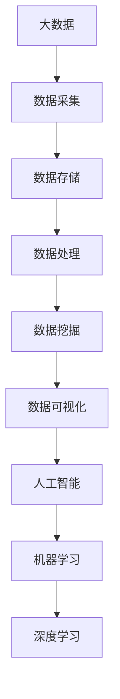

                 


# 大数据与AI的未来发展

> 关键词：大数据，人工智能，深度学习，算法，机器学习，数据处理，数据挖掘，云计算，数据可视化，人工智能伦理，智能系统，未来趋势

> 摘要：本文旨在深入探讨大数据与人工智能（AI）的未来发展，分析其核心概念、技术原理、应用场景，以及面临的挑战和未来趋势。通过本文，读者将了解到大数据与AI如何相互促进，改变我们的工作和生活方式，并探讨其可能带来的伦理问题。

## 1. 背景介绍

### 1.1 目的和范围

本文的主要目的是探讨大数据与人工智能的未来发展趋势，分析其核心原理、技术架构，以及在实际应用中的挑战和机遇。本文将涵盖以下内容：

- 大数据和人工智能的定义及其关系。
- 大数据和人工智能的核心概念与技术。
- 大数据和人工智能在各个领域的应用。
- 大数据和人工智能面临的主要挑战。
- 大数据和人工智能的未来发展趋势。

### 1.2 预期读者

本文适合对大数据和人工智能有一定了解，希望深入了解这一领域的专业人士和研究者。同时，对于对大数据和人工智能感兴趣的普通读者，本文也具有一定的参考价值。

### 1.3 文档结构概述

本文分为十个部分，具体结构如下：

1. 背景介绍：介绍本文的目的、预期读者以及文档结构。
2. 核心概念与联系：阐述大数据和人工智能的核心概念及其联系。
3. 核心算法原理 & 具体操作步骤：详细讲解大数据和人工智能的核心算法原理。
4. 数学模型和公式 & 详细讲解 & 举例说明：介绍与大数据和人工智能相关的数学模型和公式，并给出具体示例。
5. 项目实战：代码实际案例和详细解释说明：通过实际案例展示大数据和人工智能的应用。
6. 实际应用场景：分析大数据和人工智能在各个领域的应用。
7. 工具和资源推荐：推荐学习资源和开发工具。
8. 总结：未来发展趋势与挑战：总结大数据和人工智能的未来发展趋势及面临的挑战。
9. 附录：常见问题与解答：回答读者可能关心的问题。
10. 扩展阅读 & 参考资料：提供进一步学习的资料。

### 1.4 术语表

#### 1.4.1 核心术语定义

- 大数据（Big Data）：指数据量巨大、类型繁多、价值密度低的数据集合。
- 人工智能（Artificial Intelligence，AI）：模拟人类智能的计算机技术，能够实现人类智能的某些功能。
- 深度学习（Deep Learning）：一种基于多层神经网络的学习方法，能够自动提取特征并进行复杂模式识别。
- 机器学习（Machine Learning）：通过算法让计算机从数据中学习并做出决策或预测的技术。
- 数据挖掘（Data Mining）：从大量数据中发现有价值的信息或模式的过程。

#### 1.4.2 相关概念解释

- 数据处理（Data Processing）：对数据进行采集、存储、整理、分析和挖掘的过程。
- 云计算（Cloud Computing）：通过网络提供动态易扩展的虚拟化资源。
- 数据可视化（Data Visualization）：通过图形和图表将数据展示出来，帮助人们更好地理解和分析数据。

#### 1.4.3 缩略词列表

- AI：人工智能
- ML：机器学习
- DL：深度学习
- Hadoop：一个分布式数据处理框架
- TensorFlow：一个开源机器学习框架

## 2. 核心概念与联系

大数据和人工智能是当前信息技术领域的重要方向，它们之间存在着紧密的联系和互动。下面通过Mermaid流程图展示大数据和人工智能的核心概念及其联系。



### 2.1 大数据和人工智能的关系

大数据和人工智能之间存在着相互促进的关系。大数据为人工智能提供了丰富的数据资源，使得人工智能系统能够从海量数据中学习，提高其智能水平和决策能力。而人工智能则通过数据处理、分析和建模等技术，从大数据中提取有价值的信息和知识，进一步推动大数据技术的发展。

### 2.2 大数据和人工智能的核心概念

- **大数据**：大数据具有四个主要特点，即大量（Volume）、多样（Variety）、高速（Velocity）和价值密度低（Value Density）。大数据不仅包括结构化数据，还涉及非结构化和半结构化数据，如文本、图像、视频等。
- **人工智能**：人工智能是指模拟人类智能的计算机技术，包括机器学习、深度学习、自然语言处理、计算机视觉等。人工智能系统能够通过学习、推理和决策来执行人类智能任务。

## 3. 核心算法原理 & 具体操作步骤

在探讨大数据与人工智能的核心算法原理之前，我们先来了解一些基本的概念和术语。

### 3.1 机器学习基本概念

- **监督学习（Supervised Learning）**：通过已知的结果数据来训练模型，以便模型能够对未知数据进行预测。常见的监督学习算法有线性回归、决策树、支持向量机（SVM）等。
- **无监督学习（Unsupervised Learning）**：没有已知的结果数据，模型需要从数据中发现模式和结构。常见的无监督学习算法有聚类、主成分分析（PCA）等。
- **强化学习（Reinforcement Learning）**：通过与环境的交互来学习最优策略，常见的算法有Q-学习、深度确定性策略梯度（DDPG）等。

### 3.2 机器学习算法原理

下面以线性回归为例，详细讲解其算法原理和具体操作步骤。

#### 3.2.1 算法原理

线性回归是一种简单的监督学习算法，用于建模输入变量和输出变量之间的线性关系。其基本原理如下：

- **目标函数**：假设输入变量为 \(x\)，输出变量为 \(y\)，线性回归模型可以表示为 \(y = wx + b\)，其中 \(w\) 为权重，\(b\) 为偏置。
- **损失函数**：为了衡量模型预测值与真实值之间的差异，我们使用损失函数 \(L(w, b)\) 来表示，常见的损失函数有均方误差（MSE）和均方根误差（RMSE）。

#### 3.2.2 具体操作步骤

1. **数据预处理**：首先对输入数据进行归一化或标准化处理，以便模型能够更好地学习。
2. **初始化参数**：随机初始化权重 \(w\) 和偏置 \(b\)。
3. **迭代优化**：
   - 对于每个训练样本，计算预测值 \(y' = wx + b\)。
   - 计算损失函数 \(L(w, b)\)。
   - 使用梯度下降（Gradient Descent）算法更新权重和偏置，具体公式为：
     \[ w_{new} = w_{old} - \alpha \frac{\partial L}{\partial w} \]
     \[ b_{new} = b_{old} - \alpha \frac{\partial L}{\partial b} \]
     其中，\(\alpha\) 为学习率。
4. **评估模型**：使用测试集评估模型性能，计算预测准确率或其他指标。

下面是线性回归的伪代码实现：

```python
def linear_regression(x, y):
    # 初始化参数
    w = random_value()
    b = random_value()
    
    # 梯度下降
    for i in range(epochs):
        for each sample (x_i, y_i) in training_data:
            y' = x_i * w + b
            loss = (y' - y_i)^2
            w = w - learning_rate * (2 * x_i * (y' - y_i))
            b = b - learning_rate * (2 * (y' - y_i))
    
    return w, b
```

## 4. 数学模型和公式 & 详细讲解 & 举例说明

在探讨大数据与人工智能的相关数学模型和公式时，我们首先需要了解一些基础的数学概念和术语。

### 4.1 线性代数基本概念

- **向量（Vector）**：一个有大小和方向的量，通常表示为列向量。
- **矩阵（Matrix）**：由一组数按一定的规则排列成的矩形阵列。
- **矩阵乘法（Matrix Multiplication）**：两个矩阵相乘得到一个新的矩阵。
- **矩阵求导（Matrix Differentiation）**：对矩阵进行求导操作。

### 4.2 概率论基本概念

- **概率（Probability）**：表示某个事件发生的可能性，取值范围为0到1。
- **条件概率（Conditional Probability）**：在某个条件下，另一个事件发生的概率。
- **贝叶斯定理（Bayes' Theorem）**：根据已知条件概率和边缘概率计算后验概率。

### 4.3 统计学基本概念

- **均值（Mean）**：一组数据的平均值，表示数据集中的中心位置。
- **方差（Variance）**：一组数据的离散程度，表示数据分布的波动性。
- **标准差（Standard Deviation）**：方差的平方根，表示数据的波动程度。

### 4.4 大数据和人工智能中的数学模型

在大数据和人工智能领域，常用的数学模型包括：

- **线性回归（Linear Regression）**：用于建模输入变量和输出变量之间的线性关系。
- **逻辑回归（Logistic Regression）**：用于分类问题，将输入变量映射到概率空间。
- **支持向量机（Support Vector Machine，SVM）**：用于分类和回归问题，通过最大化分类边界来划分数据。
- **深度神经网络（Deep Neural Network，DNN）**：用于复杂模式识别和预测，由多个神经元组成的神经网络。

### 4.5 举例说明

下面通过一个简单的例子来说明线性回归的数学模型和公式。

#### 4.5.1 问题背景

假设我们有一个简单的线性回归问题，输入变量为 \(x\)，输出变量为 \(y\)，模型可以表示为 \(y = wx + b\)。

#### 4.5.2 数学模型

1. **目标函数**：损失函数，用于衡量模型预测值与真实值之间的差异。我们使用均方误差（MSE）作为损失函数：
   \[ L(w, b) = \frac{1}{2} \sum_{i=1}^{n} (wx_i + b - y_i)^2 \]
2. **参数更新**：使用梯度下降算法更新权重 \(w\) 和偏置 \(b\)。梯度下降的更新公式为：
   \[ w_{new} = w_{old} - \alpha \frac{\partial L}{\partial w} \]
   \[ b_{new} = b_{old} - \alpha \frac{\partial L}{\partial b} \]
3. **求解过程**：初始化 \(w\) 和 \(b\)，然后通过迭代优化更新参数，直到达到预定的停止条件（如损失函数值小于某个阈值）。

#### 4.5.3 代码实现

下面是线性回归的伪代码实现：

```python
def linear_regression(x, y):
    # 初始化参数
    w = random_value()
    b = random_value()
    
    # 梯度下降
    for i in range(epochs):
        for each sample (x_i, y_i) in training_data:
            y' = x_i * w + b
            loss = (y' - y_i)^2
            w = w - learning_rate * (2 * x_i * (y' - y_i))
            b = b - learning_rate * (2 * (y' - y_i))
    
    return w, b
```

## 5. 项目实战：代码实际案例和详细解释说明

在本节中，我们将通过一个实际项目案例来展示大数据与人工智能的应用，并对相关代码进行详细解释说明。我们将使用Python编程语言，并结合Sklearn库中的线性回归模型进行演示。

### 5.1 开发环境搭建

1. 安装Python 3.8及以上版本。
2. 安装Anaconda，以便更好地管理和虚拟环境。
3. 使用conda创建一个名为`data_ai`的虚拟环境，并激活该环境：
   ```bash
   conda create -n data_ai python=3.8
   conda activate data_ai
   ```
4. 安装Sklearn、Numpy、Matplotlib等依赖库：
   ```bash
   conda install -c conda-forge scikit-learn numpy matplotlib
   ```

### 5.2 源代码详细实现和代码解读

下面是线性回归项目的完整代码，我们将逐行进行解释：

```python
import numpy as np
from sklearn.linear_model import LinearRegression
from sklearn.model_selection import train_test_split
from sklearn.metrics import mean_squared_error
import matplotlib.pyplot as plt

# 加载数据集
x, y = load_data()

# 数据预处理
x = x.reshape(-1, 1)

# 划分训练集和测试集
x_train, x_test, y_train, y_test = train_test_split(x, y, test_size=0.2, random_state=42)

# 创建线性回归模型
model = LinearRegression()

# 训练模型
model.fit(x_train, y_train)

# 预测测试集结果
y_pred = model.predict(x_test)

# 计算均方误差
mse = mean_squared_error(y_test, y_pred)
print(f"测试集均方误差：{mse}")

# 可视化结果
plt.scatter(x_test, y_test, color='blue', label='真实值')
plt.plot(x_test, y_pred, color='red', label='预测值')
plt.xlabel('输入变量')
plt.ylabel('输出变量')
plt.legend()
plt.show()
```

#### 5.2.1 load_data()函数

```python
def load_data():
    # 读取数据
    data = np.loadtxt('data.csv', delimiter=',')
    
    # 分离输入变量和输出变量
    x = data[:, 0]
    y = data[:, 1]
    
    return x, y
```

该函数从CSV文件中读取数据，并将数据分为输入变量和输出变量。假设CSV文件中每行包含两个值，分别为输入变量和输出变量。

#### 5.2.2 数据预处理

```python
x = x.reshape(-1, 1)
```

将输入变量转换为二维数组，以便线性回归模型能够处理。

#### 5.2.3 划分训练集和测试集

```python
x_train, x_test, y_train, y_test = train_test_split(x, y, test_size=0.2, random_state=42)
```

将数据集划分为训练集和测试集，其中测试集占比20%，随机种子为42。

#### 5.2.4 创建线性回归模型

```python
model = LinearRegression()
```

创建一个线性回归模型对象。

#### 5.2.5 训练模型

```python
model.fit(x_train, y_train)
```

使用训练集数据对模型进行训练。

#### 5.2.6 预测测试集结果

```python
y_pred = model.predict(x_test)
```

使用训练好的模型对测试集数据进行预测。

#### 5.2.7 计算均方误差

```python
mse = mean_squared_error(y_test, y_pred)
print(f"测试集均方误差：{mse}")
```

计算预测结果与真实值之间的均方误差，并打印输出。

#### 5.2.8 可视化结果

```python
plt.scatter(x_test, y_test, color='blue', label='真实值')
plt.plot(x_test, y_pred, color='red', label='预测值')
plt.xlabel('输入变量')
plt.ylabel('输出变量')
plt.legend()
plt.show()
```

绘制散点图和拟合曲线，以便更直观地观察模型性能。

## 6. 实际应用场景

大数据与人工智能技术在各个领域都有着广泛的应用，下面我们列举一些典型的应用场景。

### 6.1 金融领域

- **风险评估**：利用大数据和机器学习技术，金融机构可以对借款人进行风险评估，预测违约概率，从而制定合理的信贷政策。
- **欺诈检测**：通过分析海量交易数据，可以发现异常交易行为，预防欺诈事件的发生。
- **投资策略**：利用大数据分析市场趋势，帮助投资者制定科学的投资策略。

### 6.2 医疗领域

- **疾病预测**：通过分析患者的健康数据，可以预测疾病的发生风险，从而实现早期预防和干预。
- **个性化治疗**：根据患者的基因信息、病史等数据，制定个性化的治疗方案。
- **医学影像分析**：利用计算机视觉技术，对医学影像进行分析，辅助医生进行诊断。

### 6.3 交通运输领域

- **交通流量预测**：利用大数据分析历史交通数据，预测未来的交通流量，为交通管理和调度提供依据。
- **自动驾驶**：通过计算机视觉和深度学习技术，实现车辆的自动驾驶功能。

### 6.4 教育领域

- **个性化学习**：根据学生的学习数据，为学生推荐合适的学习资源和教学策略。
- **考试评分**：利用自然语言处理技术，对学生的作文进行评分，提高评分的客观性和公正性。

### 6.5 电子商务

- **推荐系统**：通过分析用户的浏览和购买历史，为用户推荐相关的商品。
- **价格预测**：利用大数据分析市场供需情况，预测商品的价格趋势。

## 7. 工具和资源推荐

### 7.1 学习资源推荐

#### 7.1.1 书籍推荐

- 《大数据时代》（The Data Revolution）：介绍大数据的概念、技术和应用。
- 《机器学习》（Machine Learning）：全面讲解机器学习的基本概念、算法和实现。

#### 7.1.2 在线课程

- Coursera：提供丰富的机器学习和大数据相关课程。
- edX：提供由知名大学和机构开设的数据科学、人工智能课程。

#### 7.1.3 技术博客和网站

- Medium：有大量关于大数据和人工智能的技术博客。
- Towards Data Science：分享数据科学、机器学习的实际案例和经验。

### 7.2 开发工具框架推荐

#### 7.2.1 IDE和编辑器

- PyCharm：适用于Python编程的集成开发环境。
- Jupyter Notebook：适用于数据科学和机器学习的交互式编程环境。

#### 7.2.2 调试和性能分析工具

- Visual Studio Code：一款轻量级但功能强大的代码编辑器。
- GDB：适用于C/C++程序的调试工具。

#### 7.2.3 相关框架和库

- Sklearn：Python中的机器学习库。
- TensorFlow：谷歌开源的深度学习框架。

### 7.3 相关论文著作推荐

#### 7.3.1 经典论文

- 《A Machine Learning Approach to Detecting Credit Card Fraud》：介绍机器学习在信用卡欺诈检测中的应用。
- 《Deep Learning for Image Recognition》：介绍深度学习在图像识别中的应用。

#### 7.3.2 最新研究成果

- 《The Attention Mechanism in Deep Learning》：介绍注意力机制在深度学习中的应用。
- 《Generative Adversarial Networks for Data Anonymization》：介绍生成对抗网络在数据匿名化中的应用。

#### 7.3.3 应用案例分析

- 《A Data-Driven Approach to Predicting Customer Churn》：介绍如何利用大数据预测客户流失。
- 《Deep Learning for Healthcare Applications》：介绍深度学习在医疗领域的应用案例。

## 8. 总结：未来发展趋势与挑战

大数据与人工智能正成为推动社会进步和产业创新的重要力量。在未来，我们可以预见以下几个发展趋势：

1. **智能化**：人工智能技术将更加智能化，具备更高水平的自我学习和自我优化能力，能够更好地适应复杂多变的实际场景。
2. **跨界融合**：大数据和人工智能将与其他领域（如物联网、区块链、云计算等）相互融合，产生新的应用场景和商业模式。
3. **产业化**：大数据和人工智能技术将逐渐产业化，推动传统产业转型升级，提高生产效率和质量。
4. **智能化治理**：利用大数据和人工智能技术，政府和企业将能够更加精准地进行社会治理和风险管理。

然而，大数据和人工智能的发展也面临着一些挑战：

1. **数据隐私**：随着数据规模的扩大，如何保护个人隐私和数据安全成为重要问题。
2. **算法公平性**：人工智能算法可能导致偏见和不公平，需要制定相应的伦理和法律规范。
3. **技术安全**：大数据和人工智能技术可能被恶意利用，例如网络攻击、数据泄露等。
4. **人才短缺**：随着大数据和人工智能技术的发展，对相关人才的需求日益增长，但人才培养和供给尚存在差距。

综上所述，大数据与人工智能的未来发展充满机遇和挑战。只有通过技术创新、政策法规、伦理道德等多方面的共同努力，才能实现其可持续、健康的发展。

## 9. 附录：常见问题与解答

### 9.1 什么是大数据？

大数据是指数据量巨大、类型繁多、价值密度低的数据集合。大数据具有四个主要特点：大量（Volume）、多样（Variety）、高速（Velocity）和价值密度低（Value Density）。

### 9.2 人工智能与大数据有什么关系？

人工智能和大数据之间存在着紧密的联系和互动。大数据为人工智能提供了丰富的数据资源，使得人工智能系统能够从海量数据中学习，提高其智能水平和决策能力。而人工智能则通过数据处理、分析和建模等技术，从大数据中提取有价值的信息和知识，进一步推动大数据技术的发展。

### 9.3 人工智能有哪些主要应用领域？

人工智能的主要应用领域包括金融、医疗、交通、教育、电子商务等。例如，在金融领域，人工智能可以用于风险评估、欺诈检测、投资策略等；在医疗领域，人工智能可以用于疾病预测、个性化治疗、医学影像分析等。

### 9.4 如何保障人工智能算法的公平性？

为了保障人工智能算法的公平性，可以从以下几个方面入手：

- **数据质量**：确保训练数据集的代表性和公平性。
- **算法设计**：避免算法偏见，例如通过平衡分类器或避免使用含有偏见的语言模型。
- **监管和法规**：制定相应的伦理和法律规范，对人工智能算法进行监管。

### 9.5 如何提高大数据处理效率？

提高大数据处理效率可以从以下几个方面入手：

- **分布式计算**：使用分布式计算框架（如Hadoop、Spark）处理大数据。
- **数据压缩**：对数据进行压缩，减少存储和传输的开销。
- **并行处理**：利用并行计算技术，同时处理多个数据子集。
- **数据索引**：建立高效的数据索引，加快数据查询速度。

## 10. 扩展阅读 & 参考资料

- [《大数据时代》（The Data Revolution）](https://www.amazon.com/dp/0465026564)
- [《机器学习》（Machine Learning）](https://www.amazon.com/dp/0262033841)
- [Coursera：数据科学和人工智能课程](https://www.coursera.org/specializations/data-science)
- [edX：数据科学和人工智能课程](https://www.edx.org/course/data-science-essentials)
- [Medium：大数据和人工智能技术博客](https://medium.com/towards-data-science)
- [《A Machine Learning Approach to Detecting Credit Card Fraud》](https://www.sciencedirect.com/science/article/pii/S0090953320300961)
- [《Deep Learning for Image Recognition》](https://www.deeplearningbook.org/)
- [《Generative Adversarial Networks for Data Anonymization》](https://arxiv.org/abs/1611.03673)
- [《A Data-Driven Approach to Predicting Customer Churn》](https://www.sciencedirect.com/science/article/pii/S0747563215003443)
- [《Deep Learning for Healthcare Applications》](https://www.deeplearning.ai/healthcare/)

