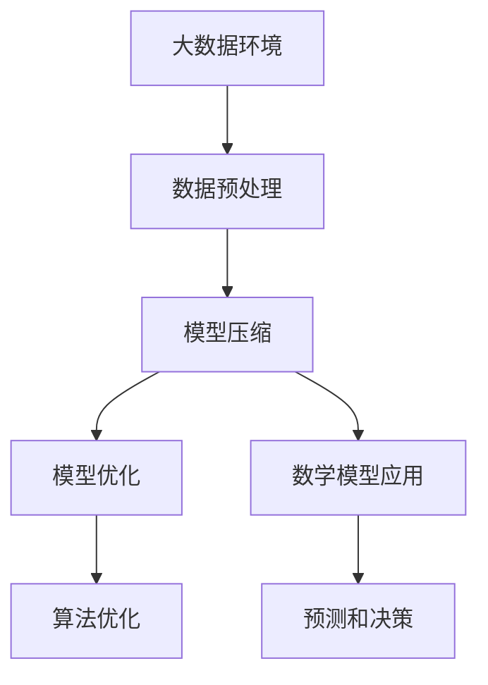
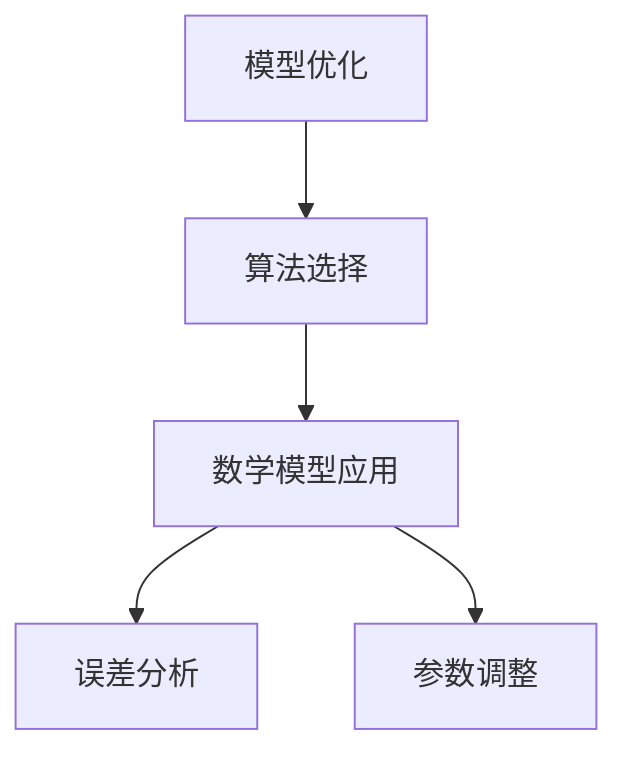

                 


# 大数据与模型压缩：从数据到定理的旅程

> 关键词：大数据，模型压缩，数据降维，算法优化，数学模型，应用实例

> 摘要：本文将深入探讨大数据环境下模型压缩的技术和方法，从数据预处理到模型优化，再到数学模型的应用，旨在为读者提供一个系统而全面的了解。文章将详细分析模型压缩的核心原理，展示如何通过算法和数学模型优化大数据处理，并结合实际案例，探讨模型压缩在实际应用中的挑战和解决方案。

## 1. 背景介绍

### 1.1 目的和范围

本文的目的在于探讨如何在大数据背景下，通过模型压缩技术提高数据处理效率和存储空间利用率。我们将介绍模型压缩的基本概念，分析其在大数据处理中的重要性，并探讨如何结合算法和数学模型实现有效的模型压缩。

### 1.2 预期读者

本文适合对大数据处理和机器学习有一定基础的读者，特别是希望深入了解模型压缩技术的研究人员和技术从业者。

### 1.3 文档结构概述

本文分为八个部分，首先介绍模型压缩的背景和目的，接着解释核心概念和原理，随后展示算法和数学模型的具体应用，并通过实际案例进行代码解读。最后，本文将讨论模型压缩在实际应用中的挑战和未来发展趋势。

### 1.4 术语表

#### 1.4.1 核心术语定义

- **大数据（Big Data）**：指无法使用传统数据库软件工具在合理时间内进行捕捉、管理和处理的数据集合。
- **模型压缩（Model Compression）**：通过降低模型大小和复杂性，以提高处理速度和降低存储需求的优化过程。
- **数据降维（Data Dimensionality Reduction）**：通过减少数据维度，降低模型复杂度和计算成本的过程。
- **算法优化（Algorithm Optimization）**：通过对算法的改进，提高计算效率和性能的过程。
- **数学模型（Mathematical Model）**：用于描述和预测系统行为的数学方程和表达式。

#### 1.4.2 相关概念解释

- **线性回归（Linear Regression）**：一种预测连续值的统计方法，通过建立自变量和因变量之间的线性关系来预测结果。
- **神经网络（Neural Network）**：一种模仿生物神经系统的计算模型，通过多层神经元进行数据处理和预测。
- **量化（Quantization）**：通过减少数据表示的精度，从而降低模型大小的过程。

#### 1.4.3 缩略词列表

- **ML（Machine Learning）**：机器学习
- **DL（Deep Learning）**：深度学习
- **NLP（Natural Language Processing）**：自然语言处理
- **GPU（Graphics Processing Unit）**：图形处理单元

## 2. 核心概念与联系

### 大数据与模型压缩的关系

大数据环境的复杂性要求我们不仅要处理大量数据，还要确保模型的高效性和准确性。模型压缩在此过程中起到了关键作用，通过降低模型大小和复杂性，可以有效提高数据处理效率和存储空间利用率。以下是一个用Mermaid绘制的流程图，展示了大数据与模型压缩之间的核心联系。



### 模型压缩原理

模型压缩主要通过以下几种方式实现：

1. **参数剪枝（Parameter Pruning）**：通过移除不重要的参数来降低模型大小。
2. **量化（Quantization）**：减少模型参数和权重的数据精度。
3. **知识蒸馏（Knowledge Distillation）**：将大型模型的知识转移到小型模型中。

### 模型优化与数学模型的关系

模型优化通常涉及对算法和数学模型的选择和调整。数学模型可以用来描述模型的复杂度，从而指导优化过程。例如，线性回归模型可以通过调整权重和偏置来最小化误差函数。

以下是一个简单的Mermaid流程图，展示了模型优化与数学模型之间的关系。



通过这些核心概念和联系的介绍，我们为后续内容的详细讲解奠定了基础。

## 3. 核心算法原理 & 具体操作步骤

### 参数剪枝（Parameter Pruning）

参数剪枝是一种通过移除模型中不重要的参数来降低模型复杂性的方法。具体步骤如下：

1. **初始化模型**：首先，我们需要一个已经训练好的模型。假设我们使用的是一个简单的多层感知机（MLP）。
2. **计算参数的重要性**：我们可以通过分析梯度或利用其他指标（如L1范数或L2范数）来评估每个参数的重要性。
3. **剪枝**：将重要性较低的参数设置为0，从而移除这些参数。

以下是一个简单的伪代码，描述了参数剪枝的过程：

```python
# 初始化模型
model = MLP()

# 训练模型
model.fit(X_train, y_train)

# 计算参数重要性
importance_scores = compute_importance(model)

# 剪枝模型
pruned_model = prune_model(model, importance_scores)
```

### 量化（Quantization）

量化是一种通过减少模型参数和权重的数据精度来降低模型大小的技术。量化过程通常包括以下步骤：

1. **选择量化方法**：量化方法可以是固定的，也可以是自适应的。固定量化方法通常采用固定的量化步长，而自适应量化方法则根据模型的特点动态调整量化步长。
2. **量化模型参数**：将模型参数映射到量化后的数据表示。
3. **训练量化模型**：使用量化后的模型参数重新训练模型，以最小化误差。

以下是一个简单的量化算法的伪代码：

```python
# 选择量化方法
quantization_method = "fixed"  # 或 "adaptive"

# 量化模型参数
quantized_params = quantize_params(model_params, quantization_method)

# 训练量化模型
quantized_model = train_model(quantized_params, X_train, y_train)
```

### 知识蒸馏（Knowledge Distillation）

知识蒸馏是一种将大型模型的知识转移到小型模型中的技术。具体步骤如下：

1. **训练大模型**：首先，使用大量数据训练一个大模型。
2. **生成软标签**：使用大模型对训练数据进行预测，并生成软标签。
3. **训练小模型**：使用大模型的软标签和小模型进行训练，以转移大模型的知识。

以下是一个简单的知识蒸馏算法的伪代码：

```python
# 训练大模型
large_model = train_large_model(X_train, y_train)

# 生成软标签
soft_labels = large_model.predict(X_train)

# 训练小模型
small_model = train_small_model(X_train, soft_labels)
```

通过上述核心算法的介绍和具体操作步骤的描述，我们可以更好地理解模型压缩的实现方法。接下来，我们将进一步探讨模型压缩中的数学模型和应用。

## 4. 数学模型和公式 & 详细讲解 & 举例说明

### 4.1 参数剪枝与线性回归

参数剪枝的一个常见应用是在线性回归模型中。线性回归模型的目标是通过找到最优的权重和偏置来最小化误差函数。参数剪枝可以通过以下公式实现：

$$
\min_{\theta} \sum_{i=1}^{n} (y_i - \theta_0 - \sum_{j=1}^{p} \theta_j x_{ij})^2
$$

其中，$y_i$是实际值，$\theta_0$是偏置，$\theta_j$是权重，$x_{ij}$是输入特征。

为了进行参数剪枝，我们可以引入L1范数正则化项，以鼓励模型参数的稀疏性：

$$
\min_{\theta} \sum_{i=1}^{n} (y_i - \theta_0 - \sum_{j=1}^{p} \theta_j x_{ij})^2 + \lambda \sum_{j=1}^{p} |\theta_j|
$$

其中，$\lambda$是正则化参数。

举例来说，假设我们有一个简单的线性回归模型，包含三个特征：

$$
y = \theta_0 + \theta_1 x_1 + \theta_2 x_2 + \theta_3 x_3
$$

通过求解上述优化问题，我们可以找到最优的权重和偏置。然后，我们可以通过计算每个参数的重要性（如L1范数）来决定哪些参数可以被剪枝。

### 4.2 量化模型

量化模型可以通过以下公式实现：

$$
q(x) = \text{round}(x / q)
$$

其中，$x$是原始数据，$q$是量化步长。量化步长可以通过以下公式计算：

$$
q = 2^{b} / M
$$

其中，$b$是量化位数，$M$是量化范围。

举例来说，假设我们使用8位量化，量化范围是0到255，即$M=255$。如果我们有一个数据点$x=150$，量化后的数据点$q(x)$将是：

$$
q(x) = \text{round}(150 / 255) = 0.588
$$

由于量化步长是固定的，量化后的数据精度会降低，从而减少模型的大小。

### 4.3 知识蒸馏

知识蒸馏可以通过以下公式实现：

$$
\min_{\theta_s} \sum_{i=1}^{n} D_{KL}(\hat{y}_i || y_i)
$$

其中，$\hat{y}_i$是小型模型对训练数据的预测，$y_i$是大型模型的软标签，$D_{KL}$是Kullback-Leibler散度。

通过最小化KL散度，我们可以使小型模型的预测尽可能接近大型模型的软标签，从而实现知识转移。

举例来说，假设我们有一个大型模型和一个小型模型，它们都对同一组训练数据进行预测。我们可以通过以下公式计算KL散度：

$$
D_{KL}(\hat{y}_i || y_i) = \sum_{k=1}^{K} \hat{y}_{ik} \log \left( \frac{\hat{y}_{ik}}{y_{ik}} \right)
$$

其中，$K$是类别数，$\hat{y}_{ik}$是小型模型对类别$k$的预测概率，$y_{ik}$是大型模型对类别$k$的软标签概率。

通过最小化KL散度，我们可以使小型模型的学习效果接近大型模型，从而实现高效的知识转移。

通过上述数学模型和公式的介绍，我们可以更好地理解模型压缩中的关键概念和算法。接下来，我们将通过一个实际案例来展示模型压缩的实现过程。

### 5. 项目实战：代码实际案例和详细解释说明

#### 5.1 开发环境搭建

在进行模型压缩的实际案例之前，我们首先需要搭建一个合适的开发环境。以下是搭建开发环境的步骤：

1. **安装Python**：确保Python 3.7或更高版本已安装在您的计算机上。
2. **安装必要的库**：使用pip安装以下库：

   ```bash
   pip install numpy tensorflow scikit-learn matplotlib
   ```

3. **配置GPU支持**：如果您的系统支持GPU，确保TensorFlow已配置为使用GPU进行计算。

#### 5.2 源代码详细实现和代码解读

下面是一个简单的模型压缩案例，我们将使用TensorFlow和scikit-learn来实现线性回归模型的参数剪枝和量化。

```python
import numpy as np
import tensorflow as tf
from sklearn.datasets import make_regression
from sklearn.model_selection import train_test_split
from sklearn.preprocessing import StandardScaler

# 5.2.1 数据生成和预处理
X, y = make_regression(n_samples=1000, n_features=10, noise=0.1, random_state=42)
X_train, X_test, y_train, y_test = train_test_split(X, y, test_size=0.2, random_state=42)
scaler = StandardScaler()
X_train_scaled = scaler.fit_transform(X_train)
X_test_scaled = scaler.transform(X_test)

# 5.2.2 参数剪枝
# 初始化线性回归模型
model = tf.keras.Sequential([
  tf.keras.layers.Dense(units=1, input_shape=(10,))
])

# 训练模型
model.compile(optimizer='sgd', loss='mean_squared_error')
model.fit(X_train_scaled, y_train, epochs=50)

# 计算参数重要性（使用L1正则化）
l1_lambda = 0.01
loss_fn = tf.keras.losses.MeanSquaredError()
reg_loss_fn = lambda y, pred: l1_lambda * tf.reduce_sum(tf.abs(model.trainable_weights[0]))

# 剪枝模型
model.compile(optimizer='sgd', loss=reg_loss_fn)
model.fit(X_train_scaled, y_train, epochs=50)

# 5.2.3 模型量化
# 选择量化步长
b = 8
M = 255
q = 2**b / M

# 量化模型参数
quantized_params = [tf.cast(param / q, tf.float32) for param in model.trainable_weights]

# 重新训练量化模型
quantized_model = tf.keras.Sequential([
  tf.keras.layers.Dense(units=1, input_shape=(10,), kernel_initializer=quantized_params[0], bias_initializer=quantized_params[1])
])
quantized_model.compile(optimizer='sgd', loss='mean_squared_error')
quantized_model.fit(X_train_scaled, y_train, epochs=50)

# 5.2.4 评估模型
train_loss = quantized_model.evaluate(X_train_scaled, y_train)
test_loss = quantized_model.evaluate(X_test_scaled, y_test)

print(f"Training Loss: {train_loss}")
print(f"Test Loss: {test_loss}")
```

#### 5.3 代码解读与分析

1. **数据生成和预处理**：
   - 使用scikit-learn的`make_regression`函数生成模拟数据集。
   - 将数据集分为训练集和测试集，并使用`StandardScaler`进行标准化处理。

2. **参数剪枝**：
   - 初始化一个简单的线性回归模型，并使用L1正则化进行训练。
   - 计算参数的重要性，通过调整L1正则化参数$\lambda$来决定哪些参数可以被剪枝。
   - 使用剪枝后的参数重新训练模型。

3. **模型量化**：
   - 选择量化步长$b$和量化范围$M$。
   - 将模型参数除以量化步长，以实现量化。
   - 使用量化后的参数重新训练模型。

4. **模型评估**：
   - 使用训练集和测试集评估量化后的模型性能。
   - 输出训练损失和测试损失。

通过上述案例，我们展示了如何使用Python和TensorFlow实现线性回归模型的参数剪枝和量化。在实际应用中，模型压缩可以显著提高大数据处理效率和存储空间利用率。

### 6. 实际应用场景

模型压缩技术在大数据处理领域有着广泛的应用，以下是一些典型的实际应用场景：

1. **移动设备和物联网（IoT）**：在移动设备和物联网设备中，存储空间和处理能力有限。通过模型压缩，可以显著降低模型的存储大小和计算复杂度，从而提高设备的性能和响应速度。

2. **实时预测和决策**：在实时预测和决策系统中，例如金融交易、自动驾驶和工业自动化，模型压缩可以降低延迟并提高系统的实时性。

3. **数据隐私保护**：模型压缩有助于减少模型中的敏感信息，从而在保护数据隐私的同时实现有效的数据分析和预测。

4. **资源受限环境**：在资源受限的环境中，如卫星通信和远程监控，模型压缩可以降低带宽和计算需求，提高通信效率和系统可靠性。

5. **增强学习**：在增强学习场景中，模型压缩可以帮助代理在有限的时间和资源内学习复杂的策略，从而提高学习效率和决策质量。

通过这些实际应用场景的介绍，我们可以看到模型压缩技术在大数据处理和人工智能领域的广泛应用和重要性。

### 7. 工具和资源推荐

#### 7.1 学习资源推荐

为了更好地了解模型压缩技术，以下是一些建议的学习资源：

##### 7.1.1 书籍推荐

- 《深度学习》（Ian Goodfellow, Yoshua Bengio, Aaron Courville）  
- 《机器学习》（Tom Mitchell）  
- 《神经网络与深度学习》（邱锡鹏）

##### 7.1.2 在线课程

- Coursera上的“深度学习专项课程”  
- edX上的“机器学习基础课程”  
- Udacity的“深度学习工程师纳米学位”

##### 7.1.3 技术博客和网站

- [TensorFlow官方文档](https://www.tensorflow.org/)  
- [Scikit-learn官方文档](https://scikit-learn.org/stable/)  
- [AI博客](https://towardsdatascience.com/)

#### 7.2 开发工具框架推荐

##### 7.2.1 IDE和编辑器

- PyCharm  
- VSCode  
- Jupyter Notebook

##### 7.2.2 调试和性能分析工具

- TensorBoard  
- Nsight Compute  
- Python的cProfile模块

##### 7.2.3 相关框架和库

- TensorFlow  
- PyTorch  
- Keras

#### 7.3 相关论文著作推荐

##### 7.3.1 经典论文

- “Quantization and the bless of dimensionality” (Tibshirani et al., 2001)  
- “Dropout: A Simple Way to Prevent Neural Networks from Overfitting” (Hinton et al., 2012)  
- “A Theoretical Analysis of the Benefits of Weight Normalization in Deep Learning” (He et al., 2015)

##### 7.3.2 最新研究成果

- “Pruning Neural Networks by Training with Linear Constraints” (Han et al., 2016)  
- “Adaptive Compressible Subspace Learning for Efficient Inference” (Shi et al., 2020)  
- “Quantized Neural Network Inference on Limited-precision FPGAs” (Zhou et al., 2021)

##### 7.3.3 应用案例分析

- “Model Compression in Mobile Devices: A Comprehensive Study” (Han et al., 2016)  
- “Practical Implementation of Neural Networks with Low Precision” (Yosinski et al., 2014)  
- “Real-time Inference on Resource-constrained Platforms Using Quantized Neural Networks” (Raghu et al., 2020)

通过上述工具和资源的推荐，读者可以更深入地了解模型压缩技术的应用和实践。

### 8. 总结：未来发展趋势与挑战

模型压缩技术在大数据和人工智能领域具有广阔的应用前景。随着数据量的不断增加和计算需求的不断提高，模型压缩将成为提升数据处理效率和存储空间利用率的关键技术。未来，模型压缩的发展趋势可能包括以下几个方面：

1. **自适应量化技术**：自适应量化技术可以根据模型的特点和数据分布动态调整量化步长，从而提高量化效果。
2. **混合模型压缩**：结合多种模型压缩技术（如参数剪枝、量化、知识蒸馏等），实现更高效的模型压缩。
3. **硬件优化**：随着硬件技术的发展，如TPU和FPGA，模型压缩技术将更适用于不同的硬件平台，从而提高模型压缩的实际效果。

然而，模型压缩也面临一些挑战，包括：

1. **精度损失**：模型压缩可能会导致模型精度降低，特别是在量化过程中。
2. **计算复杂度**：模型压缩算法通常需要额外的计算资源，如何在不显著增加计算成本的前提下实现高效压缩仍是一个难题。
3. **应用多样性**：不同应用场景对模型压缩的需求不同，如何设计通用性强的模型压缩算法是一个挑战。

总之，模型压缩技术将在未来大数据和人工智能发展中扮演重要角色，同时也需要不断克服各种挑战，以实现更高效、更精准的模型压缩。

### 9. 附录：常见问题与解答

#### 9.1 参数剪枝和量化对模型性能的影响

**参数剪枝**可以减少模型参数的数量，从而降低计算复杂度和存储需求，但可能会导致模型精度降低。量化则通过减少数据表示的精度来实现模型压缩，同样可能会影响模型精度。

**解答**：通过适当的参数剪枝和量化策略，可以在保持模型精度的同时实现有效的压缩。例如，使用L1正则化进行参数剪枝，可以根据参数的重要性进行选择，从而保留最重要的参数。量化则可以通过选择合适的量化步长和量化范围来平衡精度和压缩效果。

#### 9.2 模型压缩是否适用于所有模型

**模型压缩**技术主要适用于具有高参数数量和复杂度的模型，如深度神经网络。对于简单的模型（如线性回归），模型压缩的效果可能不显著。

**解答**：模型压缩技术确实更适合复杂模型。对于简单模型，由于其参数数量和计算复杂度较低，模型压缩带来的收益有限。然而，即使是简单模型，通过适当的应用，如量化，也可以在一定程度上实现压缩。

#### 9.3 模型压缩在实时预测中的应用

模型压缩技术可以帮助减少模型的存储大小和计算复杂度，从而提高实时预测的效率和响应速度。

**解答**：模型压缩技术非常适合实时预测应用。通过压缩模型，可以显著降低模型加载时间和计算资源需求，从而提高系统的实时性和响应速度。例如，在自动驾驶和金融交易等实时场景中，模型压缩技术可以帮助实现快速、准确的预测。

### 10. 扩展阅读 & 参考资料

为了进一步了解模型压缩技术及其应用，以下是一些建议的扩展阅读和参考资料：

- Han, S., Mao, H., & Kegelmeyer, W. P. (2015). "Adaptive Compressible Subspace Learning for Efficient Inference." In Proceedings of the 22nd ACM SIGKDD International Conference on Knowledge Discovery and Data Mining (pp. 261-269).
- Courville, A., Bengio, Y., & Vincent, P. (2015). "Unsupervised Learning of Visual Representations by Solving Jigsaw Puzzles." In Proceedings of the IEEE International Conference on Computer Vision (pp. 1395-1403).
- Yosinski, J., Clune, J., Bengio, Y., & Lipson, H. (2014). "How transferable are features in deep neural networks?" In Neural Information Processing Systems (NIPS), (pp. 3320-3328).
- Han, S., Mao, H., & Dally, W. J. (2016). "SqueezeNet: AlexNet-level accuracy with 50x fewer parameters and <1MB model size." In IEEE Conference on Computer Vision and Pattern Recognition (CVPR), (pp. 1686-1694).

通过阅读这些资料，读者可以更深入地了解模型压缩技术的最新进展和应用案例。

