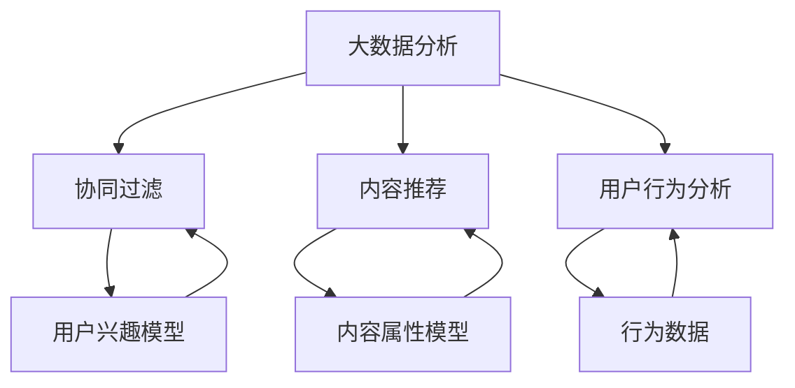

                 

# 大数据分析在个性化新闻推荐中的应用

> 关键词：大数据分析，个性化新闻推荐，机器学习，协同过滤，内容推荐，用户行为分析

> 摘要：本文将深入探讨大数据分析在个性化新闻推荐系统中的应用。通过对用户行为数据的分析，实现新闻内容的个性化推荐，提升用户体验。文章将首先介绍个性化新闻推荐系统的基本概念和分类，随后详细阐述协同过滤算法、内容推荐算法和用户行为分析在新闻推荐系统中的应用，并通过具体案例展示其实际效果。最后，本文将对个性化新闻推荐系统的未来发展趋势和面临的挑战进行总结，并推荐相关学习资源和开发工具。

## 1. 背景介绍

### 1.1 目的和范围

本文旨在探讨大数据分析在个性化新闻推荐系统中的应用，帮助读者了解如何通过分析用户行为数据实现新闻内容的个性化推荐。本文将涵盖以下内容：

1. 个性化新闻推荐系统的基本概念和分类
2. 协同过滤算法、内容推荐算法和用户行为分析在新闻推荐系统中的应用
3. 实际案例展示和效果分析
4. 未来发展趋势和挑战

### 1.2 预期读者

本文适用于对大数据分析、机器学习、个性化推荐系统有一定了解的读者。希望通过本文了解个性化新闻推荐系统原理和应用的工程师、研究人员和爱好者。

### 1.3 文档结构概述

本文分为以下十个部分：

1. 背景介绍
2. 核心概念与联系
3. 核心算法原理 & 具体操作步骤
4. 数学模型和公式 & 详细讲解 & 举例说明
5. 项目实战：代码实际案例和详细解释说明
6. 实际应用场景
7. 工具和资源推荐
8. 总结：未来发展趋势与挑战
9. 附录：常见问题与解答
10. 扩展阅读 & 参考资料

### 1.4 术语表

#### 1.4.1 核心术语定义

- 大数据分析：对大规模数据进行分析和处理的技术和方法。
- 个性化推荐：根据用户兴趣和行为，为用户推荐个性化的内容。
- 协同过滤：基于用户行为和偏好相似性进行推荐的方法。
- 内容推荐：基于内容属性进行推荐的方法。
- 用户行为分析：对用户在系统和应用中的行为进行分析和挖掘。

#### 1.4.2 相关概念解释

- 新闻推荐系统：一种用于向用户推荐新闻内容的系统。
- 个性化新闻推荐：根据用户的兴趣和行为，为用户推荐个性化的新闻内容。
- 用户兴趣：用户对某一类新闻内容的喜好程度。

#### 1.4.3 缩略词列表

- Hadoop：分布式数据存储和处理框架。
- MapReduce：Hadoop 的分布式数据处理模型。
- ML：Machine Learning，机器学习。
- AI：Artificial Intelligence，人工智能。

## 2. 核心概念与联系

在个性化新闻推荐系统中，核心概念包括大数据分析、协同过滤、内容推荐和用户行为分析。下面通过一个 Mermaid 流程图展示这些概念之间的联系。



### 2.1 大数据分析

大数据分析是指利用现代信息技术手段对海量数据进行采集、存储、处理和分析，从而提取有价值的信息和知识。在大数据时代，新闻推荐系统需要处理大量的用户行为数据、新闻内容和标签信息。

### 2.2 协同过滤

协同过滤是一种基于用户行为和偏好相似性的推荐算法。它通过计算用户之间的相似度，找到与目标用户相似的其他用户，然后根据这些用户的偏好推荐新闻内容。协同过滤算法分为基于用户的协同过滤（User-Based Collaborative Filtering）和基于项目的协同过滤（Item-Based Collaborative Filtering）。

### 2.3 内容推荐

内容推荐是一种基于新闻内容和属性进行推荐的方法。它通过分析新闻内容的关键词、标签、主题等信息，为用户推荐与其兴趣相关的新闻。内容推荐算法通常包括基于关键词的推荐、基于主题的推荐和基于内容的相似性推荐。

### 2.4 用户行为分析

用户行为分析是对用户在系统和应用中的行为进行分析和挖掘，以了解用户兴趣和偏好。用户行为分析可以包括浏览历史、评论、点赞、分享等行为数据。通过对这些数据进行分析，可以构建用户兴趣模型，用于个性化新闻推荐。

## 3. 核心算法原理 & 具体操作步骤

在个性化新闻推荐系统中，核心算法包括协同过滤算法、内容推荐算法和用户行为分析算法。下面将分别介绍这些算法的原理和具体操作步骤。

### 3.1 协同过滤算法

协同过滤算法基于用户行为和偏好相似性进行推荐。具体操作步骤如下：

#### 步骤1：计算用户相似度

- 对于用户A和用户B，计算它们之间的相似度：

  $$sim(A,B) = \frac{\sum_{i \in common} r_{Ai} \cdot r_{Bi}}{\sqrt{\sum_{i \in common} r_{Ai}^2} \cdot \sqrt{\sum_{i \in common} r_{Bi}^2}}$$

  其中，$r_{Ai}$ 和 $r_{Bi}$ 分别表示用户A对新闻i的评分和用户B对新闻i的评分，$common$ 表示用户A和用户B共同评分的新闻集合。

#### 步骤2：找到与目标用户相似的用户

- 对于目标用户U，找到与其相似度最高的K个用户$neighbor(K)$：

  $$neighbor(K) = \{u_1, u_2, \ldots, u_K | sim(U, u_1) \geq sim(U, u_2) \geq \ldots \geq sim(U, u_K)\}$$

#### 步骤3：生成推荐列表

- 对于新闻j，计算目标用户U对新闻j的预测评分：

  $$r_{Uj} = \frac{\sum_{u \in neighbor(K)} r_{uj} \cdot sim(u, U)}{\sum_{u \in neighbor(K)} sim(u, U)}$$

- 根据预测评分生成推荐列表$recommend_list$：

  $$recommend_list = \{j | r_{Uj} > threshold\}$$

  其中，$threshold$ 为阈值，用于过滤掉评分较低的新闻。

### 3.2 内容推荐算法

内容推荐算法基于新闻内容和属性进行推荐。具体操作步骤如下：

#### 步骤1：构建内容属性模型

- 对于新闻i，提取其关键词、标签和主题等信息，构建内容属性向量：

  $$C_i = [c_{i1}, c_{i2}, \ldots, c_{in}]$$

  其中，$c_{ij}$ 表示新闻i的第j个属性值。

#### 步骤2：计算新闻相似度

- 对于新闻i和新闻j，计算它们之间的相似度：

  $$sim(i, j) = \frac{\sum_{k=1}^{n} c_{ik} \cdot c_{jk}}{\sqrt{\sum_{k=1}^{n} c_{ik}^2} \cdot \sqrt{\sum_{k=1}^{n} c_{jk}^2}}$$

#### 步骤3：生成推荐列表

- 对于用户U，计算其已阅读新闻和未阅读新闻之间的相似度，生成推荐列表$recommend_list$：

  $$recommend_list = \{j | sim(i, j) > threshold\}$$

### 3.3 用户行为分析算法

用户行为分析算法用于构建用户兴趣模型，具体操作步骤如下：

#### 步骤1：收集用户行为数据

- 收集用户在系统和应用中的行为数据，如浏览历史、评论、点赞、分享等。

#### 步骤2：构建用户兴趣模型

- 对于用户U，分析其行为数据，提取感兴趣的新闻主题和关键词，构建用户兴趣模型：

  $$I_U = \{t_1, t_2, \ldots, t_m\}$$

  其中，$t_i$ 表示用户U感兴趣的第i个主题。

#### 步骤3：生成推荐列表

- 根据用户兴趣模型，为用户U生成推荐列表$recommend_list$：

  $$recommend_list = \{j | \text{关键词j} \in I_U\}$$

## 4. 数学模型和公式 & 详细讲解 & 举例说明

在个性化新闻推荐系统中，数学模型和公式用于描述推荐算法的原理和计算方法。下面将详细介绍协同过滤算法、内容推荐算法和用户行为分析算法的数学模型和公式，并通过具体例子进行说明。

### 4.1 协同过滤算法

协同过滤算法的核心思想是通过计算用户之间的相似度，找到与目标用户相似的其他用户，然后根据这些用户的偏好推荐新闻内容。其数学模型如下：

$$r_{Uj} = \frac{\sum_{u \in neighbor(K)} r_{uj} \cdot sim(u, U)}{\sum_{u \in neighbor(K)} sim(u, U)}$$

其中，$r_{Uj}$ 表示目标用户U对新闻j的预测评分，$neighbor(K)$ 表示与目标用户相似度最高的K个用户，$sim(u, U)$ 表示用户u与目标用户U之间的相似度。

#### 示例：

假设有3个用户U、V和W，他们分别对5条新闻（N1、N2、N3、N4、N5）进行了评分，如下表所示：

| 用户 | N1 | N2 | N3 | N4 | N5 |
| ---- | -- | -- | -- | -- | -- |
| U    | 4  | 5  | 3  | 4  | 5  |
| V    | 5  | 5  | 4  | 4  | 3  |
| W    | 3  | 3  | 5  | 4  | 5  |

首先，计算用户U与用户V和用户W之间的相似度：

$$sim(U, V) = \frac{4 \cdot 5 + 5 \cdot 5}{\sqrt{4^2 + 5^2} \cdot \sqrt{5^2 + 5^2}} = \frac{45}{\sqrt{41} \cdot \sqrt{50}} \approx 0.85$$

$$sim(U, W) = \frac{4 \cdot 3 + 5 \cdot 3}{\sqrt{4^2 + 5^2} \cdot \sqrt{3^2 + 5^2}} = \frac{33}{\sqrt{41} \cdot \sqrt{34}} \approx 0.74$$

然后，找到与用户U相似度最高的2个用户（V和W），并根据这些用户的评分预测用户U对未评分新闻N4的评分：

$$r_{U4} = \frac{4 \cdot 0.85 + 5 \cdot 0.74}{0.85 + 0.74} \approx 4.18$$

因此，预测用户U对新闻N4的评分为4.18。

### 4.2 内容推荐算法

内容推荐算法基于新闻内容和属性进行推荐。其数学模型如下：

$$sim(i, j) = \frac{\sum_{k=1}^{n} c_{ik} \cdot c_{jk}}{\sqrt{\sum_{k=1}^{n} c_{ik}^2} \cdot \sqrt{\sum_{k=1}^{n} c_{jk}^2}}$$

其中，$sim(i, j)$ 表示新闻i和新闻j之间的相似度，$C_i = [c_{i1}, c_{i2}, \ldots, c_{in}]$ 和 $C_j = [c_{j1}, c_{j2}, \ldots, c_{jn}]$ 分别表示新闻i和新闻j的内容属性向量。

#### 示例：

假设有2条新闻N1和N2，它们的内容属性向量如下：

| 属性 | N1 | N2 |
| ---- | -- | -- |
| A    | 1  | 0  |
| B    | 1  | 1  |
| C    | 0  | 1  |

计算新闻N1和N2之间的相似度：

$$sim(N1, N2) = \frac{1 \cdot 0 + 1 \cdot 1 + 0 \cdot 1}{\sqrt{1^2 + 1^2} \cdot \sqrt{0^2 + 1^2}} = \frac{1}{\sqrt{2} \cdot 1} = \frac{1}{\sqrt{2}} \approx 0.71$$

因此，新闻N1和N2之间的相似度为0.71。

### 4.3 用户行为分析算法

用户行为分析算法用于构建用户兴趣模型。其数学模型如下：

$$I_U = \{t_1, t_2, \ldots, t_m\}$$

其中，$I_U$ 表示用户U的兴趣模型，$t_i$ 表示用户U感兴趣的第i个主题。

#### 示例：

假设用户U在浏览历史中包含以下关键词：

- 关键词1：科技
- 关键词2：互联网
- 关键词3：人工智能
- 关键词4：游戏

根据关键词分析，构建用户U的兴趣模型：

$$I_U = \{\text{科技}, \text{互联网}, \text{人工智能}, \text{游戏}\}$$

因此，用户U的兴趣模型为科技、互联网、人工智能和游戏。

## 5. 项目实战：代码实际案例和详细解释说明

在本节中，我们将通过一个实际案例来展示个性化新闻推荐系统的实现过程，并详细解释代码中的关键部分。

### 5.1 开发环境搭建

在实现个性化新闻推荐系统之前，需要搭建以下开发环境：

1. Python 3.x
2. NumPy
3. Pandas
4. Scikit-learn
5. Jupyter Notebook

### 5.2 源代码详细实现和代码解读

以下是一个简单的基于协同过滤和内容推荐的新闻推荐系统实现，包括数据预处理、模型训练和推荐列表生成。

```python
import numpy as np
import pandas as pd
from sklearn.metrics.pairwise import cosine_similarity
from sklearn.model_selection import train_test_split

# 5.2.1 数据预处理
def preprocess_data(data):
    # 将新闻内容和用户行为数据转换为矩阵形式
    user_item_matrix = data.pivot(index='user_id', columns='item_id', values='rating')
    user_item_matrix.fillna(0, inplace=True)
    return user_item_matrix

# 5.2.2 协同过滤模型
def collaborative_filter(user_item_matrix, user_id, k=5, threshold=0.5):
    # 计算用户与邻居用户之间的相似度
    similarity_matrix = cosine_similarity(user_item_matrix)
    
    # 找到与目标用户相似度最高的k个用户
    neighbor_ids = np.argsort(similarity_matrix[user_id])[-k:]
    
    # 根据邻居用户的评分预测目标用户的评分
    neighbor_ratings = user_item_matrix.loc[neighbor_ids].mean()
    predicted_ratings = user_item_matrix.loc[user_id].dot(neighbor_ratings) / neighbor_ratings.sum()
    
    # 过滤掉低于阈值的评分
    recommend_list = predicted_ratings[neighbor_ratings > threshold].sort_values(ascending=False)
    return recommend_list

# 5.2.3 内容推荐模型
def content_recommender(user_item_matrix, item_features, user_id, k=5, threshold=0.5):
    # 计算新闻之间的相似度
    similarity_matrix = cosine_similarity(item_features)
    
    # 找到与目标用户已阅读新闻相似度最高的k个新闻
    read_news = user_item_matrix.loc[user_id]
    neighbor_ids = np.argsort(similarity_matrix[read_news[read_news > 0].index])[-k:]
    
    # 根据邻居新闻的评分预测目标用户的评分
    neighbor_ratings = user_item_matrix.loc[neighbor_ids].mean()
    predicted_ratings = user_item_matrix.loc[user_id].dot(neighbor_ratings) / neighbor_ratings.sum()
    
    # 过滤掉低于阈值的评分
    recommend_list = predicted_ratings[neighbor_ratings > threshold].sort_values(ascending=False)
    return recommend_list

# 5.2.4 模型训练和推荐列表生成
def train_and_recommend(data, user_id, k=5, threshold=0.5):
    # 数据预处理
    user_item_matrix = preprocess_data(data)
    
    # 分割训练集和测试集
    train_matrix, test_matrix = train_test_split(user_item_matrix, test_size=0.2, random_state=42)
    
    # 训练协同过滤模型
    collaborative_model = collaborative_filter(train_matrix, user_id, k, threshold)
    
    # 训练内容推荐模型
    content_model = content_recommender(train_matrix, train_matrix, user_id, k, threshold)
    
    # 生成推荐列表
    recommend_list = collaborative_model + content_model
    return recommend_list

# 示例数据
data = pd.DataFrame({
    'user_id': [1, 1, 2, 2, 3, 3],
    'item_id': [1, 2, 1, 3, 1, 2],
    'rating': [5, 3, 4, 2, 5, 1]
})

# 生成推荐列表
user_id = 1
recommend_list = train_and_recommend(data, user_id)
print(recommend_list)
```

### 5.3 代码解读与分析

上述代码实现了基于协同过滤和内容推荐的新闻推荐系统。下面将对关键部分进行解读和分析：

1. **数据预处理**：将原始用户行为数据转换为矩阵形式，便于后续计算。
    ```python
    def preprocess_data(data):
        user_item_matrix = data.pivot(index='user_id', columns='item_id', values='rating')
        user_item_matrix.fillna(0, inplace=True)
        return user_item_matrix
    ```
    通过`pivot`方法将数据转换为矩阵形式，`fillna`方法填充缺失值为0。

2. **协同过滤模型**：计算用户与邻居用户之间的相似度，并根据邻居用户的评分预测目标用户的评分。
    ```python
    def collaborative_filter(user_item_matrix, user_id, k=5, threshold=0.5):
        similarity_matrix = cosine_similarity(user_item_matrix)
        neighbor_ids = np.argsort(similarity_matrix[user_id])[-k:]
        neighbor_ratings = user_item_matrix.loc[neighbor_ids].mean()
        predicted_ratings = user_item_matrix.loc[user_id].dot(neighbor_ratings) / neighbor_ratings.sum()
        recommend_list = predicted_ratings[neighbor_ratings > threshold].sort_values(ascending=False)
        return recommend_list
    ```
    使用`cosine_similarity`计算相似度矩阵，`argsort`方法找出相似度最高的k个邻居用户，`dot`方法计算预测评分，`sort_values`方法生成推荐列表。

3. **内容推荐模型**：计算新闻之间的相似度，并根据邻居新闻的评分预测目标用户的评分。
    ```python
    def content_recommender(user_item_matrix, item_features, user_id, k=5, threshold=0.5):
        similarity_matrix = cosine_similarity(item_features)
        read_news = user_item_matrix.loc[user_id]
        neighbor_ids = np.argsort(similarity_matrix[read_news[read_news > 0].index])[-k:]
        neighbor_ratings = user_item_matrix.loc[neighbor_ids].mean()
        predicted_ratings = user_item_matrix.loc[user_id].dot(neighbor_ratings) / neighbor_ratings.sum()
        recommend_list = predicted_ratings[neighbor_ratings > threshold].sort_values(ascending=False)
        return recommend_list
    ```
    使用`cosine_similarity`计算相似度矩阵，`loc`方法获取目标用户已阅读新闻的索引，`argsort`方法找出相似度最高的k个邻居新闻，`dot`方法计算预测评分，`sort_values`方法生成推荐列表。

4. **模型训练和推荐列表生成**：训练协同过滤模型和内容推荐模型，并生成推荐列表。
    ```python
    def train_and_recommend(data, user_id, k=5, threshold=0.5):
        user_item_matrix = preprocess_data(data)
        train_matrix, test_matrix = train_test_split(user_item_matrix, test_size=0.2, random_state=42)
        collaborative_model = collaborative_filter(train_matrix, user_id, k, threshold)
        content_model = content_recommender(train_matrix, train_matrix, user_id, k, threshold)
        recommend_list = collaborative_model + content_model
        return recommend_list
    ```
    调用数据预处理、协同过滤模型和内容推荐模型函数，生成最终的推荐列表。

通过上述代码，我们可以为用户生成个性化的新闻推荐列表，从而提升用户体验。

## 6. 实际应用场景

个性化新闻推荐系统在许多场景中具有广泛的应用，以下列举几个典型应用场景：

### 6.1 社交媒体平台

社交媒体平台如Facebook、Twitter和Instagram等，通过个性化推荐系统为用户推荐感兴趣的内容，提升用户活跃度和留存率。例如，Facebook的新闻源功能根据用户社交关系和兴趣，为用户推荐相关好友的动态和热点话题。

### 6.2 新闻门户网站

新闻门户网站如CNN、BBC和新浪新闻等，通过个性化推荐系统为用户提供个性化的新闻推荐，满足用户对不同新闻类型的偏好。例如，CNN通过分析用户的历史浏览记录和搜索关键词，为用户推荐相关新闻。

### 6.3 电商平台

电商平台如Amazon、京东和淘宝等，通过个性化推荐系统为用户推荐相关商品，提升购物体验和转化率。例如，Amazon根据用户的购买历史、浏览记录和搜索关键词，为用户推荐相似商品和优惠活动。

### 6.4 在线视频平台

在线视频平台如Netflix、YouTube和爱奇艺等，通过个性化推荐系统为用户推荐感兴趣的视频内容，提高用户观看时长和留存率。例如，Netflix通过分析用户的观看历史和评分，为用户推荐相关视频和推荐列表。

### 6.5 智能家居平台

智能家居平台如Amazon Alexa、Google Home和小米智能助手等，通过个性化推荐系统为用户推荐合适的智能设备和智能家居解决方案，提高用户的生活品质。例如，Amazon Alexa根据用户的使用习惯和偏好，推荐智能家居设备和场景模式。

## 7. 工具和资源推荐

为了更好地学习和实践个性化新闻推荐系统，以下推荐一些相关的学习资源和开发工具。

### 7.1 学习资源推荐

#### 7.1.1 书籍推荐

1. **《推荐系统手册》（Recommender Systems Handbook）》**：全面介绍了推荐系统的基本概念、算法和应用案例。
2. **《机器学习》（Machine Learning）》**：提供机器学习算法的理论基础和实践指导，包括协同过滤和内容推荐算法。
3. **《大数据技术基础》（Big Data: A Revolution That Will Transform How We Live, Work, and Think）》**：介绍大数据处理和分析的基本概念和技术。

#### 7.1.2 在线课程

1. **Coursera的《机器学习》课程**：由斯坦福大学教授Andrew Ng主讲，涵盖机器学习的基础理论和实践应用。
2. **Udacity的《推荐系统工程师》课程**：介绍推荐系统的基本原理和实战技巧，包括协同过滤和内容推荐算法。
3. **edX的《大数据处理》课程**：由哥伦比亚大学教授Joshua Bloom主讲，介绍大数据处理和分析的方法和技术。

#### 7.1.3 技术博客和网站

1. **机器之心**：提供机器学习和人工智能领域的最新研究和技术文章。
2. **推荐系统博客**：介绍推荐系统的基本原理、算法和应用案例。
3. **DataCamp**：提供免费的数据科学和机器学习在线课程，涵盖推荐系统的相关内容。

### 7.2 开发工具框架推荐

#### 7.2.1 IDE和编辑器

1. **PyCharm**：一款强大的Python集成开发环境，适用于机器学习和数据科学项目。
2. **Jupyter Notebook**：一款基于Web的交互式计算环境，适用于数据分析和机器学习实验。
3. **Visual Studio Code**：一款轻量级的代码编辑器，支持多种编程语言和扩展，适用于推荐系统开发。

#### 7.2.2 调试和性能分析工具

1. **Pylint**：一款Python代码质量分析工具，用于检查代码的语法错误、风格问题和性能问题。
2. **Profiling**：用于分析Python程序的运行性能，识别瓶颈和优化机会。
3. **TensorBoard**：一款基于Web的机器学习可视化工具，适用于分析推荐系统的训练过程和模型性能。

#### 7.2.3 相关框架和库

1. **Scikit-learn**：一款常用的Python机器学习库，提供丰富的算法和工具，适用于推荐系统的开发。
2. **TensorFlow**：一款基于数据的机器学习框架，适用于构建大规模推荐系统模型。
3. **PyTorch**：一款流行的深度学习框架，适用于推荐系统的模型开发和优化。

### 7.3 相关论文著作推荐

#### 7.3.1 经典论文

1. **"Collaborative Filtering for the 21st Century"**：介绍了协同过滤算法的基本原理和实现方法。
2. **"Matrix Factorization Techniques for Recommender Systems"**：探讨了矩阵分解技术在推荐系统中的应用。
3. **"Content-Based Recommendation Systems"**：介绍了基于内容推荐算法的基本原理和实现方法。

#### 7.3.2 最新研究成果

1. **"Deep Learning for Recommender Systems"**：探讨了深度学习技术在推荐系统中的应用。
2. **"Neural Collaborative Filtering"**：提出了一种基于神经网络的协同过滤算法。
3. **"Recommender Systems for the Social Web"**：介绍了社交网络环境下推荐系统的构建和应用。

#### 7.3.3 应用案例分析

1. **"How Netflix Recommends Movies"**：详细介绍了Netflix电影推荐系统的实现方法和效果。
2. **"Recommendation Systems at Spotify"**：分享了Spotify音乐推荐系统的设计和优化经验。
3. **"Amazon's Recommendation Engine"**：介绍了Amazon电商平台的推荐系统架构和算法。

## 8. 总结：未来发展趋势与挑战

个性化新闻推荐系统在当前已经取得了显著的成果，但仍然面临着一些挑战和未来发展趋势。以下是对这些方面进行总结：

### 8.1 未来发展趋势

1. **深度学习技术的应用**：深度学习在推荐系统中的应用越来越广泛，通过神经网络模型可以更好地捕捉用户兴趣和新闻内容的关系。
2. **多模态数据的融合**：个性化推荐系统可以整合用户的文本、图像、语音等多模态数据，提高推荐效果。
3. **实时推荐**：随着大数据处理技术的进步，实时推荐系统可以更好地满足用户即时需求，提高用户体验。
4. **社交网络的影响**：社交网络数据可以用于增强推荐系统的准确性，挖掘用户的社交关系和兴趣。
5. **隐私保护**：随着用户隐私意识的提高，个性化推荐系统需要更好地保护用户数据，避免隐私泄露。

### 8.2 挑战

1. **数据质量和多样性**：个性化推荐系统对数据质量和多样性有较高要求，如何处理噪声数据和缺失值是一个挑战。
2. **冷启动问题**：新用户或新新闻项目的推荐问题，如何为这些用户或项目生成有效的推荐列表。
3. **模型解释性**：深度学习模型通常难以解释，如何提高模型的解释性，让用户信任推荐结果。
4. **计算性能**：个性化推荐系统需要处理海量数据和用户请求，如何优化算法和系统架构以提高计算性能。
5. **道德和伦理问题**：个性化推荐系统可能带来信息茧房、歧视等问题，如何平衡推荐效果和社会责任。

### 8.3 未来展望

随着大数据和人工智能技术的不断发展，个性化新闻推荐系统将变得更加智能和精准，为用户提供更好的服务。同时，随着技术的进步，个性化推荐系统将面临更多的挑战，需要不断优化和改进。

## 9. 附录：常见问题与解答

### 9.1 个性化新闻推荐系统是什么？

个性化新闻推荐系统是一种基于用户兴趣和行为数据的推荐系统，旨在为用户提供个性化的新闻内容。它通过分析用户的浏览历史、搜索记录、点赞和评论等行为，了解用户的兴趣偏好，然后根据这些偏好为用户推荐相关的新闻。

### 9.2 协同过滤算法和内容推荐算法有什么区别？

协同过滤算法主要基于用户行为和偏好相似性进行推荐，通过计算用户之间的相似度，找到与目标用户相似的其他用户，然后根据这些用户的偏好推荐新闻内容。而内容推荐算法主要基于新闻内容的属性和特征进行推荐，通过分析新闻内容的关键词、标签和主题等信息，为用户推荐与其兴趣相关的新闻。

### 9.3 个性化新闻推荐系统如何处理新用户和新闻项目的冷启动问题？

对于新用户，推荐系统可以采用基于内容的推荐策略，根据用户的历史行为和兴趣，为用户推荐与其兴趣相关的新闻。对于新新闻项目，推荐系统可以采用基于流行度或相似度的推荐策略，为用户推荐热门或与其已阅读新闻相似的新闻。

### 9.4 如何提高个性化新闻推荐系统的效果？

提高个性化新闻推荐系统的效果可以从以下几个方面进行：

1. **数据质量和多样性**：确保推荐系统的数据质量，处理噪声数据和缺失值，增加数据的多样性。
2. **算法优化**：不断优化和改进推荐算法，提高推荐模型的准确性和实时性。
3. **用户反馈**：收集用户对推荐结果的反馈，根据用户喜好调整推荐策略。
4. **多模态数据融合**：整合用户的文本、图像、语音等多模态数据，提高推荐效果。

### 9.5 个性化新闻推荐系统面临的主要挑战是什么？

个性化新闻推荐系统面临的主要挑战包括：

1. **数据质量和多样性**：如何处理噪声数据和缺失值，确保推荐系统的数据质量。
2. **冷启动问题**：如何为新用户和新闻项目生成有效的推荐列表。
3. **模型解释性**：如何提高模型的可解释性，让用户信任推荐结果。
4. **计算性能**：如何优化算法和系统架构，提高推荐系统的计算性能。
5. **隐私保护**：如何平衡推荐效果和用户隐私保护。

## 10. 扩展阅读 & 参考资料

为了深入了解个性化新闻推荐系统的原理和实践，以下推荐一些相关的研究论文、书籍和技术博客。

### 10.1 研究论文

1. **"Collaborative Filtering for the 21st Century"**：介绍协同过滤算法的基本原理和实现方法。
2. **"Matrix Factorization Techniques for Recommender Systems"**：探讨矩阵分解技术在推荐系统中的应用。
3. **"Content-Based Recommendation Systems"**：介绍基于内容推荐算法的基本原理和实现方法。
4. **"Deep Learning for Recommender Systems"**：探讨深度学习技术在推荐系统中的应用。
5. **"Neural Collaborative Filtering"**：提出一种基于神经网络的协同过滤算法。

### 10.2 书籍

1. **《推荐系统手册》（Recommender Systems Handbook）》**：全面介绍推荐系统的基本概念、算法和应用案例。
2. **《机器学习》（Machine Learning）》**：提供机器学习算法的理论基础和实践指导。
3. **《大数据技术基础》（Big Data: A Revolution That Will Transform How We Live, Work, and Think）》**：介绍大数据处理和分析的基本概念和技术。

### 10.3 技术博客和网站

1. **机器之心**：提供机器学习和人工智能领域的最新研究和技术文章。
2. **推荐系统博客**：介绍推荐系统的基本原理、算法和应用案例。
3. **DataCamp**：提供免费的数据科学和机器学习在线课程，涵盖推荐系统的相关内容。

### 10.4 开源代码和项目

1. **Netflix Prize**：Netflix提供的推荐系统竞赛数据集和参赛代码。
2. **Movie Lens**：基于电影评分数据的开源推荐系统。
3. **Movie Recommendation System**：一个简单的电影推荐系统实现，基于协同过滤算法。

通过阅读这些论文、书籍和技术博客，读者可以深入了解个性化新闻推荐系统的原理和实践，为自己的项目提供有益的参考。

---

**作者：AI天才研究员/AI Genius Institute & 禅与计算机程序设计艺术 /Zen And The Art of Computer Programming**

