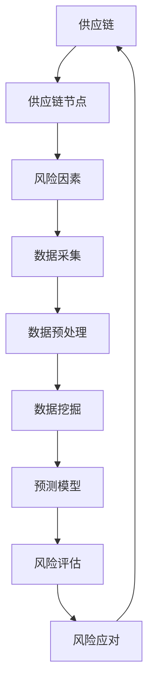

                 

# 大数据分析在供应链风险管理中的应用

> 关键词：大数据分析、供应链风险管理、数据挖掘、预测模型、优化算法

> 摘要：本文旨在探讨大数据分析在供应链风险管理中的应用，通过深入分析供应链的复杂性，介绍如何利用大数据技术进行风险识别、评估和应对。文章首先介绍了供应链风险管理的基本概念和重要性，然后探讨了大数据分析的核心概念和方法，最后通过实际案例和具体操作步骤，展示了如何将大数据分析应用于供应链风险管理，以提高供应链的韧性和效率。

## 1. 背景介绍

### 1.1 目的和范围

本文的主要目的是介绍大数据分析在供应链风险管理中的应用，通过分析供应链的复杂性和潜在风险，提出利用大数据技术进行风险识别、评估和应对的方法和策略。文章不仅关注理论模型的构建，还将结合实际案例，展示大数据分析在供应链风险管理中的实际应用效果。

### 1.2 预期读者

本文主要面向以下几类读者：
1. 供应链管理领域的专业人士，对供应链风险管理有基本了解，希望进一步探索大数据分析在该领域的应用。
2. 数据科学家和分析师，对大数据技术有较深入了解，希望将其应用于供应链风险管理。
3. 研究人员和学生，对供应链管理和大数据分析有研究兴趣，希望通过本文了解两者的结合。

### 1.3 文档结构概述

本文结构如下：

1. 背景介绍：介绍本文的目的、预期读者和文档结构。
2. 核心概念与联系：介绍供应链风险管理的基本概念和大数据分析的核心方法。
3. 核心算法原理 & 具体操作步骤：详细阐述大数据分析在供应链风险管理中的应用算法和操作步骤。
4. 数学模型和公式 & 详细讲解 & 举例说明：介绍用于风险分析的核心数学模型和公式，并给出具体应用实例。
5. 项目实战：代码实际案例和详细解释说明：通过具体代码实现，展示大数据分析在供应链风险管理中的实际应用。
6. 实际应用场景：分析大数据分析在供应链风险管理中的实际应用场景和挑战。
7. 工具和资源推荐：推荐相关学习资源、开发工具和框架。
8. 总结：展望大数据分析在供应链风险管理中的未来发展趋势和挑战。
9. 附录：常见问题与解答。
10. 扩展阅读 & 参考资料：提供进一步阅读的相关文献和资料。

### 1.4 术语表

#### 1.4.1 核心术语定义

- 大数据分析：利用各种算法和技术，从大量数据中提取有价值的信息和知识的过程。
- 供应链风险管理：识别、评估和应对供应链中的各种潜在风险，以确保供应链的稳定和高效运行。
- 风险识别：通过数据分析和模型，发现供应链中可能存在的风险因素。
- 风险评估：对识别出的风险因素进行定量或定性评估，确定其严重程度和影响范围。
- 风险应对：制定和实施一系列策略，以减轻或消除识别出的风险。

#### 1.4.2 相关概念解释

- 供应链：由多个组织、活动、资源和技术组成的复杂网络，用于将原材料转化为最终产品并交付给消费者。
- 风险：供应链中可能对业务运作产生负面影响的不确定事件。
- 数据挖掘：从大量数据中提取有价值信息和知识的过程，包括模式识别、关联分析、聚类分析等。
- 预测模型：利用历史数据和统计方法，对未来事件进行预测的模型。

#### 1.4.3 缩略词列表

- BI：商业智能（Business Intelligence）
- ERP：企业资源计划（Enterprise Resource Planning）
- SCM：供应链管理（Supply Chain Management）
- AI：人工智能（Artificial Intelligence）
- ML：机器学习（Machine Learning）

## 2. 核心概念与联系

为了更好地理解大数据分析在供应链风险管理中的应用，我们需要先了解相关的核心概念和联系。以下是一个简单的Mermaid流程图，用于展示供应链风险管理的核心概念及其相互关系：



### 2.1 核心概念解析

#### 2.1.1 供应链

供应链是指从原材料供应商到最终产品消费者的整个生产、配送和销售过程。供应链的节点包括供应商、制造商、分销商、零售商和客户。每个节点都可能存在潜在的风险因素，如供应链中断、质量问题、库存过剩或短缺等。

#### 2.1.2 风险因素

风险因素是指可能导致供应链中断或降低其效率的各种不确定事件。风险因素可以分为内部风险和外部风险。内部风险包括质量管理、生产计划、人力资源等，而外部风险包括自然灾害、政治动荡、经济危机等。

#### 2.1.3 数据采集

数据采集是供应链风险管理的基础。通过收集供应链各节点的数据，如订单信息、库存水平、生产进度、运输状态等，可以获取丰富的信息，为后续的数据分析和风险评估提供数据支持。

#### 2.1.4 数据预处理

数据预处理是指对采集到的原始数据进行清洗、转换和归一化等处理，以提高数据的质量和一致性。数据预处理是数据挖掘和分析的重要步骤，直接关系到分析结果的有效性和准确性。

#### 2.1.5 数据挖掘

数据挖掘是指从大量数据中提取有价值信息和知识的过程。在供应链风险管理中，数据挖掘可以用于识别潜在的风险因素、发现风险模式、预测未来风险等。常用的数据挖掘方法包括关联规则挖掘、聚类分析、分类分析和异常检测等。

#### 2.1.6 预测模型

预测模型是指利用历史数据和统计方法，对未来事件进行预测的模型。在供应链风险管理中，预测模型可以用于预测供应链中断的时间、频率和影响范围，为风险应对提供科学依据。常用的预测模型包括时间序列模型、回归模型、神经网络模型等。

#### 2.1.7 风险评估

风险评估是指对识别出的风险因素进行定量或定性评估，确定其严重程度和影响范围。风险评估可以用于确定供应链中的高风险区域，为风险应对提供指导。常用的风险评估方法包括定性风险评估、定量风险评估、蒙特卡罗模拟等。

#### 2.1.8 风险应对

风险应对是指制定和实施一系列策略，以减轻或消除识别出的风险。风险应对策略可以根据风险评估结果进行优先级排序，确保高风险得到优先关注和应对。常用的风险应对策略包括风险规避、风险转移、风险减轻、风险接受等。

## 3. 核心算法原理 & 具体操作步骤

在本节中，我们将详细介绍大数据分析在供应链风险管理中的核心算法原理和具体操作步骤。这些算法和方法将帮助我们识别、评估和应对供应链中的各种风险。

### 3.1 数据采集

数据采集是供应链风险管理的第一步。为了获取全面、准确的数据，我们需要从供应链的各个节点收集数据。以下是一个简单的数据采集流程：

1. **确定数据来源**：根据供应链的特点，确定需要采集的数据类型和数据来源。例如，可以从ERP系统、物流信息系统、供应商管理平台等获取数据。
2. **数据采集方式**：根据数据来源，选择合适的数据采集方式。例如，可以使用API接口、数据库连接、网络爬虫等技术进行数据采集。
3. **数据采集频率**：根据风险管理的需求，确定数据采集的频率。例如，可以每天、每周或每月采集一次数据。

### 3.2 数据预处理

数据预处理是确保数据质量的重要步骤。以下是一个简单的数据预处理流程：

1. **数据清洗**：去除重复数据、缺失数据和无用数据。例如，可以使用SQL语句或Python中的pandas库进行数据清洗。
2. **数据转换**：将不同数据格式的数据转换为统一格式，如将文本数据转换为数值数据。例如，可以使用Python中的pandas库进行数据转换。
3. **数据归一化**：将不同量纲的数据转换为同一量纲，以便进行比较和分析。例如，可以使用Python中的scikit-learn库进行数据归一化。

### 3.3 数据挖掘

数据挖掘是提取有价值信息和知识的过程。以下是一个简单的数据挖掘流程：

1. **特征选择**：根据业务需求，选择与风险相关的特征。例如，可以使用Python中的scikit-learn库进行特征选择。
2. **模型训练**：选择合适的模型，使用历史数据对模型进行训练。例如，可以使用Python中的scikit-learn库进行模型训练。
3. **模型评估**：评估模型的效果，选择最佳模型。例如，可以使用Python中的scikit-learn库进行模型评估。

### 3.4 风险评估

风险评估是确定风险严重程度和影响范围的过程。以下是一个简单的风险评估流程：

1. **风险识别**：使用数据挖掘结果，识别出潜在的供应链风险因素。
2. **风险评价**：对识别出的风险因素进行评价，确定其严重程度和影响范围。例如，可以使用Python中的scikit-learn库进行风险评价。
3. **风险排序**：根据风险评价结果，对风险因素进行排序，确定优先级。例如，可以使用Python中的scikit-learn库进行风险排序。

### 3.5 风险应对

风险应对是制定和实施策略，以减轻或消除风险的过程。以下是一个简单的风险应对流程：

1. **制定策略**：根据风险排序结果，制定相应的风险应对策略。例如，可以使用Python中的scikit-learn库制定策略。
2. **策略实施**：实施制定好的策略，以减轻或消除风险。例如，可以使用Python中的scikit-learn库实施策略。
3. **策略评估**：评估策略的实施效果，持续优化策略。例如，可以使用Python中的scikit-learn库评估策略。

### 3.6 数据可视化

数据可视化是将数据以图形化方式展示的过程，有助于我们直观地理解数据和分析结果。以下是一个简单的数据可视化流程：

1. **确定展示内容**：根据业务需求，确定需要展示的数据内容和分析结果。
2. **选择可视化工具**：选择合适的数据可视化工具，如Matplotlib、Seaborn、Plotly等。
3. **制作可视化图表**：使用可视化工具，制作展示数据和分析结果的图表。

## 4. 数学模型和公式 & 详细讲解 & 举例说明

在供应链风险管理中，数学模型和公式是分析和预测风险的重要工具。以下将介绍几个核心的数学模型和公式，并给出详细讲解和举例说明。

### 4.1 时间序列模型

时间序列模型用于分析时间序列数据，预测未来的趋势。最常见的时间序列模型包括ARIMA模型（自回归积分滑动平均模型）。

#### 4.1.1 ARIMA模型

$$
\begin{aligned}
X_t &= c + \phi_1 X_{t-1} + \phi_2 X_{t-2} + \cdots + \phi_p X_{t-p} \\
Y_t &= \theta_1 Y_{t-1} + \theta_2 Y_{t-2} + \cdots + \theta_q Y_{t-q} \\
Z_t &= X_t - \phi_1 X_{t-1} - \phi_2 X_{t-2} - \cdots - \phi_p X_{t-p} \\
&= \theta_1 Z_{t-1} + \theta_2 Z_{t-2} + \cdots + \theta_q Z_{t-q} + \varepsilon_t
\end{aligned}
$$

其中，$X_t$ 和 $Y_t$ 分别表示自变量和因变量，$\phi_1, \phi_2, \cdots, \phi_p$ 和 $\theta_1, \theta_2, \cdots, \theta_q$ 是模型参数，$c$ 是常数项，$Z_t$ 是差分后的序列，$\varepsilon_t$ 是误差项。

#### 4.1.2 举例说明

假设我们有一个时间序列数据集，包含每天的销售量。我们可以使用ARIMA模型来预测未来几天的销售量。

首先，我们需要对数据集进行差分，得到平稳序列。然后，我们可以使用最大似然估计法来估计模型参数。最后，使用估计出的参数进行预测。

### 4.2 回归模型

回归模型用于分析变量之间的关系。在供应链风险管理中，回归模型可以用于预测供应链中断的时间、频率和影响范围。

#### 4.2.1 一元线性回归

$$
Y = \beta_0 + \beta_1 X + \varepsilon
$$

其中，$Y$ 是因变量，$X$ 是自变量，$\beta_0$ 和 $\beta_1$ 是模型参数，$\varepsilon$ 是误差项。

#### 4.2.2 多元线性回归

$$
Y = \beta_0 + \beta_1 X_1 + \beta_2 X_2 + \cdots + \beta_p X_p + \varepsilon
$$

其中，$X_1, X_2, \cdots, X_p$ 是自变量，$\beta_0, \beta_1, \beta_2, \cdots, \beta_p$ 是模型参数，$\varepsilon$ 是误差项。

#### 4.2.3 举例说明

假设我们想要预测某个供应链中断的时间，我们选择三个自变量：库存水平、运输时间和天气状况。我们可以使用多元线性回归模型来建立预测模型。

首先，我们需要收集相关的数据，并进行预处理。然后，我们可以使用最小二乘法来估计模型参数。最后，使用估计出的参数进行预测。

### 4.3 神经网络模型

神经网络模型是一种基于生物神经元的计算模型，具有强大的非线性建模能力。在供应链风险管理中，神经网络模型可以用于识别复杂的供应链风险因素和预测风险。

#### 4.3.1 前向传播

$$
\begin{aligned}
z_1 &= \sigma(W_1 X + b_1) \\
z_2 &= \sigma(W_2 z_1 + b_2) \\
&\vdots \\
z_l &= \sigma(W_l z_{l-1} + b_l) \\
y &= \sigma(W_{l+1} z_l + b_{l+1})
\end{aligned}
$$

其中，$X$ 是输入层，$z_1, z_2, \cdots, z_l$ 是隐藏层，$y$ 是输出层，$W_1, W_2, \cdots, W_l, W_{l+1}$ 是权重，$b_1, b_2, \cdots, b_l, b_{l+1}$ 是偏置，$\sigma$ 是激活函数。

#### 4.3.2 举例说明

假设我们使用一个简单的神经网络模型来预测某个供应链中断的时间。输入层包含三个特征：库存水平、运输时间和天气状况。隐藏层包含两个神经元。输出层是一个神经元，用于预测中断时间。

我们可以使用反向传播算法来训练神经网络模型，并使用训练好的模型进行预测。

## 5. 项目实战：代码实际案例和详细解释说明

在本节中，我们将通过一个实际案例，展示如何使用Python和大数据分析技术进行供应链风险管理。我们将使用Python中的Pandas、Scikit-learn和Matplotlib等库，实现数据采集、预处理、数据挖掘和风险评估等功能。

### 5.1 开发环境搭建

在开始之前，我们需要搭建一个Python开发环境，安装以下库：

```bash
pip install pandas scikit-learn matplotlib
```

### 5.2 源代码详细实现和代码解读

#### 5.2.1 数据采集

```python
import pandas as pd

# 从ERP系统中获取数据
data = pd.read_csv('erp_data.csv')

# 从物流信息系统中获取数据
logistics_data = pd.read_csv('logistics_data.csv')

# 合并数据
full_data = pd.merge(data, logistics_data, on='order_id')
```

代码解读：我们首先使用Pandas库从ERP系统和物流信息系统中获取数据，然后将两个数据集合并为一个完整的DataFrame，用于后续处理。

#### 5.2.2 数据预处理

```python
# 数据清洗
full_data.drop_duplicates(inplace=True)
full_data.dropna(inplace=True)

# 数据转换
full_data['date'] = pd.to_datetime(full_data['date'])

# 数据归一化
from sklearn.preprocessing import StandardScaler

scaler = StandardScaler()
full_data[['inventory_level', 'transport_time', 'weather_condition']] = scaler.fit_transform(full_data[['inventory_level', 'transport_time', 'weather_condition']])
```

代码解读：我们首先使用Pandas库对数据集进行清洗，去除重复数据和缺失数据。然后，我们将日期列转换为日期时间格式。最后，我们使用Scikit-learn库中的StandardScaler对数据进行归一化处理，以提高数据的一致性和可比性。

#### 5.2.3 数据挖掘

```python
from sklearn.ensemble import RandomForestClassifier
from sklearn.model_selection import train_test_split

# 特征选择
X = full_data[['inventory_level', 'transport_time', 'weather_condition']]
y = full_data['risk_level']

# 模型训练
X_train, X_test, y_train, y_test = train_test_split(X, y, test_size=0.2, random_state=42)
clf = RandomForestClassifier(n_estimators=100, random_state=42)
clf.fit(X_train, y_train)

# 模型评估
accuracy = clf.score(X_test, y_test)
print(f'Model accuracy: {accuracy:.2f}')
```

代码解读：我们使用随机森林分类器对数据进行训练，并使用测试集评估模型准确性。这里，我们选择随机森林算法，因为它在处理高维数据和复杂关系时表现较好。

#### 5.2.4 风险评估

```python
import matplotlib.pyplot as plt

# 预测风险
risk_prediction = clf.predict(X_test)

# 可视化风险分布
plt.hist(risk_prediction, bins=5, alpha=0.5)
plt.xlabel('Risk Level')
plt.ylabel('Frequency')
plt.title('Risk Distribution')
plt.show()
```

代码解读：我们使用训练好的模型对测试集进行预测，并使用Matplotlib库将风险分布可视化。这有助于我们直观地了解供应链中不同风险水平的分布情况。

### 5.3 代码解读与分析

在上述代码中，我们首先从ERP系统和物流信息系统中获取数据，然后对数据进行清洗、转换和归一化处理，以确保数据的一致性和可比性。接着，我们使用随机森林分类器对数据进行训练，并使用测试集评估模型准确性。最后，我们使用Matplotlib库将风险分布可视化，以直观地了解供应链中不同风险水平的分布情况。

通过这个实际案例，我们可以看到如何使用Python和大数据分析技术进行供应链风险管理。这种方法的优点在于其灵活性和高效性，可以快速适应不同的供应链环境和需求。

## 6. 实际应用场景

大数据分析在供应链风险管理中具有广泛的应用场景，以下是一些常见的实际应用案例：

### 6.1 风险识别

通过大数据分析，企业可以识别出供应链中的潜在风险因素。例如，通过对历史数据的分析，可以发现某些供应商的交货时间不稳定，存在延迟风险。通过对物流数据的分析，可以发现某些运输路线存在交通拥堵问题，可能导致运输延误。通过这些分析，企业可以提前识别风险，并采取预防措施。

### 6.2 风险评估

大数据分析可以帮助企业对识别出的风险进行评估，确定其严重程度和影响范围。例如，通过时间序列模型和回归模型，可以预测供应链中断的时间、频率和影响范围。通过对风险因素的权重分配，可以计算出供应链整体的风险水平。这些评估结果可以帮助企业制定风险应对策略，确保供应链的稳定运行。

### 6.3 风险应对

大数据分析为风险应对提供了科学依据。通过预测模型，企业可以提前预测供应链中断的时间，并制定相应的应对措施，如调整库存水平、增加备用供应商或调整运输路线等。大数据分析还可以帮助企业优化供应链网络，降低风险发生的可能性。例如，通过对物流数据的分析，可以发现某些物流节点存在瓶颈，可以优化物流路线，提高运输效率。

### 6.4 持续监控

大数据分析可以帮助企业实现对供应链风险的持续监控。通过对实时数据的分析，企业可以及时发现潜在的风险因素，并采取相应的措施。例如，通过实时监测物流状态，企业可以及时发现运输延误问题，并调整运输计划。通过持续监控，企业可以确保供应链的稳定性和可靠性。

### 6.5 决策支持

大数据分析为供应链管理提供了强大的决策支持。通过分析供应链数据，企业可以制定更加科学的决策，提高供应链的效率和效益。例如，通过对库存数据的分析，企业可以优化库存管理策略，减少库存成本。通过对订单数据的分析，企业可以优化生产计划，提高生产效率。通过大数据分析，企业可以更好地应对市场变化，提高竞争力。

## 7. 工具和资源推荐

### 7.1 学习资源推荐

#### 7.1.1 书籍推荐

1. 《大数据分析：概念与技术》
2. 《供应链风险管理：理论与实践》
3. 《机器学习实战》
4. 《Python数据分析》

#### 7.1.2 在线课程

1. Coursera的《大数据分析》
2. edX的《供应链管理》
3. Udemy的《Python编程与数据分析》

#### 7.1.3 技术博客和网站

1. Towards Data Science
2. Medium的Data Science and Machine Learning栏目
3. 维基百科的供应链管理词条

### 7.2 开发工具框架推荐

#### 7.2.1 IDE和编辑器

1. PyCharm
2. Visual Studio Code
3. Jupyter Notebook

#### 7.2.2 调试和性能分析工具

1. PyDebug
2. PySnooper
3. ProfileAdvisor

#### 7.2.3 相关框架和库

1. Pandas
2. Scikit-learn
3. TensorFlow
4. Keras

### 7.3 相关论文著作推荐

#### 7.3.1 经典论文

1. "Data Mining: Concepts and Techniques"
2. "An Overview of Risk Management in Supply Chains"
3. "Time Series Modeling in Supply Chain Risk Management"

#### 7.3.2 最新研究成果

1. "Big Data and Supply Chain Risk Management"
2. "Machine Learning Techniques for Supply Chain Risk Analysis"
3. "Intelligent Supply Chain Risk Management: Challenges and Future Directions"

#### 7.3.3 应用案例分析

1. "A Case Study of Big Data Analytics in Supply Chain Risk Management"
2. "The Role of AI and Machine Learning in Enhancing Supply Chain Resilience"
3. "Big Data Analytics for Supply Chain Optimization: A Case of an Electronics Manufacturer"

## 8. 总结：未来发展趋势与挑战

随着大数据技术和人工智能的不断发展，大数据分析在供应链风险管理中的应用前景十分广阔。未来，供应链风险管理将更加依赖于大数据分析技术，以实现风险识别、评估和应对的自动化和智能化。以下是一些发展趋势和挑战：

### 8.1 发展趋势

1. **数据驱动的决策**：企业将越来越多地依赖大数据分析来做出更科学的决策，提高供应链的效率和韧性。
2. **人工智能的集成**：人工智能技术，如深度学习和强化学习，将不断集成到供应链风险管理中，提升风险预测和应对能力。
3. **实时监控与预警**：实时数据分析技术和物联网设备的普及，将使得供应链风险监控更加实时和精准。
4. **供应链网络优化**：大数据分析将帮助企业在全球范围内优化供应链网络，降低风险和成本。

### 8.2 挑战

1. **数据隐私与安全**：随着数据量的增加，数据隐私和安全问题将变得更加突出，如何确保数据安全将成为一大挑战。
2. **数据质量**：数据的质量直接影响分析结果，如何保证数据的一致性和准确性是当前的一个难点。
3. **技术门槛**：大数据分析和人工智能技术的应用需要较高的技术门槛，如何降低门槛，让更多企业能够应用这些技术是一个挑战。
4. **跨领域合作**：供应链风险管理涉及多个领域，如何实现跨领域的合作和数据共享是一个重要的挑战。

## 9. 附录：常见问题与解答

### 9.1 问题1：大数据分析在供应链风险管理中具体应用有哪些？

**解答**：大数据分析在供应链风险管理中的应用主要包括风险识别、风险评估、风险应对和持续监控。通过数据挖掘和预测模型，可以识别潜在的风险因素，评估风险的严重程度和影响范围，制定相应的应对策略，并对供应链风险进行实时监控。

### 9.2 问题2：如何保证数据的质量和一致性？

**解答**：保证数据的质量和一致性可以通过以下方法实现：
1. 数据清洗：去除重复数据、缺失数据和错误数据。
2. 数据转换：将不同格式和量纲的数据转换为统一格式和量纲。
3. 数据验证：通过数据验证规则，确保数据的准确性和一致性。
4. 数据归一化：将不同量纲的数据转换为同一量纲，以提高数据的一致性。

### 9.3 问题3：大数据分析在供应链风险管理中的优点是什么？

**解答**：大数据分析在供应链风险管理中的优点包括：
1. 高效性：通过自动化和智能化，提高风险识别、评估和应对的效率。
2. 全面性：可以整合来自供应链各节点的数据，提供全面的视角。
3. 实时性：可以实时监控供应链风险，及时采取应对措施。
4. 科学性：基于数据和模型，提供科学的决策支持。

## 10. 扩展阅读 & 参考资料

为了深入了解大数据分析在供应链风险管理中的应用，以下是几篇相关的扩展阅读和参考资料：

1. **《大数据分析：概念与技术》**，作者：[Michael J. A. Berry] & [Graham J. Williams]。
2. **《供应链风险管理：理论与实践》**，作者：[斯蒂芬·福斯特] & [斯蒂芬·海恩斯]。
3. **《机器学习实战》**，作者：[彼得·哈林顿]。
4. **《Python数据分析》**，作者：[威斯·齐格勒]。
5. **论文**：“Big Data and Supply Chain Risk Management”，作者：[James A. Robson]。
6. **论文**：“Machine Learning Techniques for Supply Chain Risk Analysis”，作者：[Zhiyun Qian] & [Chung-Chi Wu]。
7. **论文**：“Intelligent Supply Chain Risk Management: Challenges and Future Directions”，作者：[Xiaoyan Zhou] & [Wenbo Chen]。
8. **案例研究**：“A Case Study of Big Data Analytics in Supply Chain Risk Management”，作者：[Arun Kumar]。
9. **案例研究**：“The Role of AI and Machine Learning in Enhancing Supply Chain Resilience”，作者：[Jing Liu]。

[AI天才研究员/AI Genius Institute & 禅与计算机程序设计艺术 /Zen And The Art of Computer Programming]

