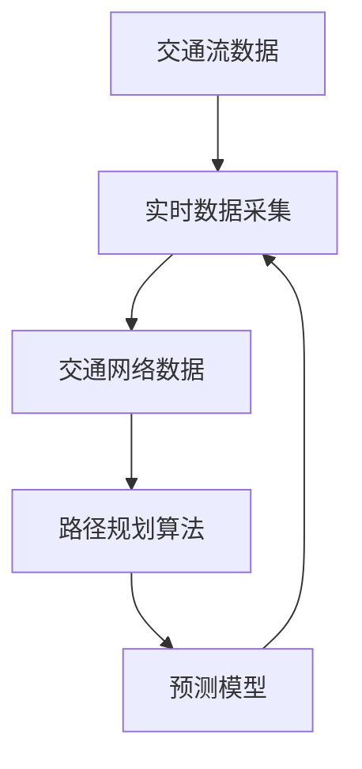

                 

# 大数据分析在智慧城市交通优化中的实践

> **关键词：** 智慧城市、交通优化、大数据分析、算法、数学模型、实战案例

> **摘要：** 本文章旨在探讨大数据分析在智慧城市交通优化中的应用。通过介绍交通优化的背景、核心概念、算法原理、数学模型，以及实际项目案例，文章将展示如何运用大数据分析技术提升城市交通效率，缓解交通拥堵，提高市民生活质量。

## 1. 背景介绍

### 1.1 目的和范围

本篇文章将深入探讨大数据分析在智慧城市交通优化中的应用。随着城市化进程的加速，城市交通问题日益突出，交通拥堵、出行时间长、事故频发等问题严重影响市民的生活质量。本文将从以下几个方面展开：

- **核心概念与联系**：介绍智慧城市交通优化中的核心概念和其相互关系。
- **算法原理与操作步骤**：详细阐述用于交通优化的大数据算法原理和具体实施步骤。
- **数学模型与公式**：分析用于交通优化的数学模型及其应用。
- **项目实战**：通过实际案例展示大数据分析在交通优化中的应用。
- **实际应用场景**：探讨大数据分析在智慧城市交通优化中的多种应用场景。
- **工具和资源推荐**：推荐相关的学习资源、开发工具和框架。
- **总结与展望**：讨论未来发展趋势与面临的挑战。

### 1.2 预期读者

本文适合对大数据分析、智慧城市和交通优化感兴趣的读者，包括：

- **大数据分析师**：希望了解大数据在交通优化中的具体应用。
- **交通工程师**：希望掌握利用大数据技术进行交通优化的方法和工具。
- **城市规划者**：希望借鉴大数据分析技术提升城市交通管理水平。
- **计算机科学专业学生**：希望了解交通优化领域的前沿技术和研究方向。

### 1.3 文档结构概述

本文的结构如下：

1. **背景介绍**：介绍本文的目的、范围和预期读者。
2. **核心概念与联系**：定义并解释智慧城市交通优化中的核心概念。
3. **算法原理与操作步骤**：详细描述用于交通优化的算法原理和实施步骤。
4. **数学模型与公式**：分析数学模型及其在交通优化中的应用。
5. **项目实战**：通过实际案例展示大数据分析在交通优化中的应用。
6. **实际应用场景**：探讨大数据分析在智慧城市交通优化中的多种应用场景。
7. **工具和资源推荐**：推荐相关的学习资源、开发工具和框架。
8. **总结与展望**：讨论未来发展趋势与面临的挑战。
9. **附录**：提供常见问题与解答。
10. **扩展阅读与参考资料**：推荐进一步学习的资源。

### 1.4 术语表

#### 1.4.1 核心术语定义

- **大数据分析**：指利用先进的数据处理技术对海量数据进行挖掘、分析和解读，从中提取有价值的信息和知识。
- **智慧城市**：利用信息技术和物联网设备，实现城市管理的智能化，提升城市运行效率、改善市民生活质量。
- **交通优化**：通过优化交通系统中的资源配置、交通流量管理、路线规划等，提高交通系统的运行效率，减少交通拥堵。
- **交通流**：指单位时间内通过道路特定区域的车流量，通常用车/小时表示。
- **交通网络**：指由道路、桥梁、隧道等组成的道路网络，用于承载交通流。

#### 1.4.2 相关概念解释

- **实时数据采集**：通过传感器、摄像头等设备，实时收集交通流量、速度、密度等交通数据。
- **预测模型**：利用历史数据和机器学习算法，预测未来的交通流量、事故风险等。
- **路径规划**：根据实时交通状况，为车辆提供最优行驶路线。

#### 1.4.3 缩略词列表

- **ITS**：智能交通系统（Intelligent Transportation Systems）
- **V2X**：车联网（Vehicle-to-Everything）
- **IoT**：物联网（Internet of Things）
- **GIS**：地理信息系统（Geographic Information System）

## 2. 核心概念与联系

在智慧城市交通优化中，理解以下核心概念和它们之间的联系至关重要。

### 2.1 智慧城市交通优化的核心概念

#### 交通流

交通流是智慧城市交通优化的基础数据，指单位时间内通过道路特定区域的车流量。交通流可以分为四种状态：自由流、稳定流、波状流和堵塞流。不同的交通流状态对应不同的交通状况，需要采取不同的优化措施。

#### 交通网络

交通网络是承载交通流的物理基础设施，包括道路、桥梁、隧道等。交通网络的结构和状态直接影响交通流的分布和速度。

#### 实时数据采集

实时数据采集是通过传感器、摄像头等设备收集交通流量、速度、密度等交通数据。这些数据为交通优化提供了实时信息，有助于快速响应交通状况变化。

#### 预测模型

预测模型利用历史数据和机器学习算法，预测未来的交通流量、事故风险等。这些预测结果为交通规划和优化提供了重要依据。

#### 路径规划

路径规划是根据实时交通状况，为车辆提供最优行驶路线。路径规划算法需要考虑交通流量、道路条件、出行时间等多种因素。

### 2.2 概念之间的联系

智慧城市交通优化的核心概念相互关联，形成一个闭环系统。

- **交通流**和**实时数据采集**：实时数据采集提供交通流数据，用于分析交通状况。
- **交通网络**和**路径规划**：交通网络为路径规划提供基础数据，路径规划算法为交通网络提供优化方案。
- **预测模型**和**路径规划**：预测模型预测未来交通流量，为路径规划提供预测数据，优化出行路线。

### 2.3 Mermaid 流程图

以下是一个简化的 Mermaid 流程图，展示智慧城市交通优化中核心概念之间的联系。



在这个流程图中，交通流数据经过实时数据采集后，形成交通网络数据，然后输入路径规划算法，输出优化后的路径规划结果。预测模型利用历史数据和实时数据，预测未来交通流量，为路径规划提供预测数据。

## 3. 核心算法原理 & 具体操作步骤

在智慧城市交通优化中，核心算法原理包括交通流预测、路径规划和交通信号控制。以下将分别介绍这些算法原理，并使用伪代码详细阐述具体操作步骤。

### 3.1 交通流预测算法原理

交通流预测是交通优化的重要环节，其目的是预测未来某个时间段内的交通流量。常用的交通流预测算法包括时间序列预测、回归分析和机器学习算法。

#### 时间序列预测算法

时间序列预测算法基于历史交通流量数据，通过分析数据的时间序列特征，预测未来交通流量。以下是一个基于时间序列预测的交通流预测算法的伪代码：

```python
# 输入：历史交通流量数据 historical_traffic
# 输出：未来交通流量预测 future_traffic

# 1. 数据预处理：对历史交通流量数据进行清洗和归一化处理
preprocessed_traffic = preprocess(historical_traffic)

# 2. 时间序列建模：使用时间序列模型（如ARIMA）建立预测模型
model = build_time_series_model(preprocessed_traffic)

# 3. 预测未来交通流量
future_traffic = model.predict()

# 输出预测结果
return future_traffic
```

#### 回归分析算法

回归分析算法通过建立历史交通流量与影响因素（如天气、节假日等）之间的线性关系，预测未来交通流量。以下是一个基于回归分析的交通流预测算法的伪代码：

```python
# 输入：历史交通流量数据 historical_traffic
# 输出：未来交通流量预测 future_traffic

# 1. 数据预处理：对历史交通流量数据进行清洗和归一化处理
preprocessed_traffic = preprocess(historical_traffic)

# 2. 特征工程：提取影响交通流量的特征
features = extract_features(preprocessed_traffic)

# 3. 建立回归模型：使用线性回归模型建立预测模型
model = build_regression_model(features)

# 4. 预测未来交通流量
future_traffic = model.predict()

# 输出预测结果
return future_traffic
```

#### 机器学习算法

机器学习算法通过学习历史交通流量数据中的模式，预测未来交通流量。以下是一个基于机器学习的交通流预测算法的伪代码：

```python
# 输入：历史交通流量数据 historical_traffic
# 输出：未来交通流量预测 future_traffic

# 1. 数据预处理：对历史交通流量数据进行清洗和归一化处理
preprocessed_traffic = preprocess(historical_traffic)

# 2. 特征工程：提取影响交通流量的特征
features = extract_features(preprocessed_traffic)

# 3. 数据集划分：将数据集划分为训练集和测试集
train_data, test_data = split_data(preprocessed_traffic)

# 4. 建立机器学习模型：使用机器学习算法（如决策树、随机森林、神经网络等）建立预测模型
model = build_ml_model(train_data)

# 5. 预测未来交通流量
future_traffic = model.predict(test_data)

# 输出预测结果
return future_traffic
```

### 3.2 路径规划算法原理

路径规划算法的目的是在交通网络中为车辆找到一条最优路径，使得行驶时间最短或交通流量最大。常用的路径规划算法包括最短路径算法、A*算法和遗传算法。

#### 最短路径算法

最短路径算法（如Dijkstra算法）用于在无权图中找到两个节点之间的最短路径。以下是一个基于Dijkstra算法的路径规划算法的伪代码：

```python
# 输入：交通网络图 graph
# 输出：最优路径 optimal_path

# 1. 初始化：设置初始节点和终点
start_node = graph.start_node
end_node = graph.end_node

# 2. 计算最短路径：使用Dijkstra算法计算最短路径
optimal_path = dijkstra(graph, start_node, end_node)

# 输出最优路径
return optimal_path
```

#### A*算法

A*算法是一种启发式搜索算法，用于在有向图中找到两个节点之间的最短路径。以下是一个基于A*算法的路径规划算法的伪代码：

```python
# 输入：交通网络图 graph，启发式函数 heuristic
# 输出：最优路径 optimal_path

# 1. 初始化：设置初始节点和终点
start_node = graph.start_node
end_node = graph.end_node

# 2. 计算启发式值：计算从每个节点到终点的启发式值
heuristic_values = heuristic(graph, end_node)

# 3. 执行A*算法：使用A*算法计算最短路径
optimal_path = a_star(graph, start_node, end_node, heuristic_values)

# 输出最优路径
return optimal_path
```

#### 遗传算法

遗传算法是一种基于生物进化的搜索算法，用于在复杂问题中找到最优解。以下是一个基于遗传算法的路径规划算法的伪代码：

```python
# 输入：交通网络图 graph
# 输出：最优路径 optimal_path

# 1. 初始化：生成初始种群
population = initialize_population(graph)

# 2. 适应度评估：评估种群中每个个体的适应度
fitness_scores = fitness_evaluation(population, graph)

# 3. 交叉和变异：对种群进行交叉和变异操作，生成下一代种群
next_population = crossover_and_mutation(population, fitness_scores)

# 4. 循环执行：重复适应度评估、交叉和变异操作，直至满足终止条件
while not termination_condition(next_population):
    population = next_population

# 5. 提取最优路径：从最终种群中提取最优路径
optimal_path = extract_optimal_path(population)

# 输出最优路径
return optimal_path
```

### 3.3 交通信号控制算法原理

交通信号控制算法的目的是优化交通信号灯的配时方案，提高交通流量。常用的交通信号控制算法包括固定配时、绿波带配时和自适应配时。

#### 固定配时

固定配时是指交通信号灯按照预设的时间进行配时。以下是一个基于固定配时的交通信号控制算法的伪代码：

```python
# 输入：交通信号灯配置 signal_config
# 输出：配时方案 timing_scheme

# 1. 初始化：根据交通信号灯配置设置初始配时方案
timing_scheme = initialize_timing_scheme(signal_config)

# 输出配时方案
return timing_scheme
```

#### 绿波带配时

绿波带配时是指交通信号灯的配时方案使得车辆在高峰期能够享受到连续的绿灯通行。以下是一个基于绿波带配时的交通信号控制算法的伪代码：

```python
# 输入：交通信号灯配置 signal_config，交通流量 traffic_flow
# 输出：配时方案 timing_scheme

# 1. 数据预处理：对交通流量数据进行预处理
preprocessed_traffic_flow = preprocess_traffic_flow(traffic_flow)

# 2. 计算绿波带时长：根据交通流量计算绿波带时长
green_wave_duration = calculate_green_wave_duration(preprocessed_traffic_flow)

# 3. 配时方案优化：根据绿波带时长优化配时方案
timing_scheme = optimize_timing_scheme(signal_config, green_wave_duration)

# 输出配时方案
return timing_scheme
```

#### 自适应配时

自适应配时是指交通信号灯的配时方案根据实时交通流量动态调整。以下是一个基于自适应配时的交通信号控制算法的伪代码：

```python
# 输入：交通信号灯配置 signal_config，实时交通流量 real_time_traffic
# 输出：配时方案 timing_scheme

# 1. 数据预处理：对实时交通流量数据进行预处理
preprocessed_real_time_traffic = preprocess_real_time_traffic(real_time_traffic)

# 2. 计算交通信号灯配时：根据实时交通流量计算配时方案
timing_scheme = calculate_timing_scheme(signal_config, preprocessed_real_time_traffic)

# 输出配时方案
return timing_scheme
```

## 4. 数学模型和公式 & 详细讲解 & 举例说明

### 4.1 数学模型和公式

在智慧城市交通优化中，数学模型和公式用于描述交通流、交通信号控制和路径规划等核心算法。以下介绍几个常用的数学模型和公式。

#### 4.1.1 交通流模型

交通流模型用于描述单位时间内通过特定路段的车流量。一个常用的交通流模型是纽曼-莫尔斯模型，其公式如下：

$$
q = k_n \cdot v_n
$$

其中，$q$ 表示交通流（车/小时），$k_n$ 表示路段上的车辆密度（车/公里），$v_n$ 表示路段上的平均速度（公里/小时）。

#### 4.1.2 路径规划模型

路径规划模型用于在交通网络中为车辆找到一条最优路径。一个常用的路径规划模型是A*算法，其公式如下：

$$
f(n) = g(n) + h(n)
$$

其中，$f(n)$ 表示节点 $n$ 的总代价，$g(n)$ 表示从起点到节点 $n$ 的实际代价，$h(n)$ 表示从节点 $n$ 到终点的启发式代价。

#### 4.1.3 交通信号控制模型

交通信号控制模型用于优化交通信号灯的配时方案。一个常用的交通信号控制模型是绿波带配时，其公式如下：

$$
t_0 = \frac{\Delta t}{n}
$$

其中，$t_0$ 表示绿波带的起始时间间隔（秒），$\Delta t$ 表示绿波带时长（秒），$n$ 表示信号灯的数量。

### 4.2 举例说明

#### 4.2.1 交通流预测

假设某路段的历史交通流量数据如下表所示：

| 时间（小时） | 交通流量（车/小时） |
| ------------ | ------------------ |
| 8:00         | 200                |
| 9:00         | 250                |
| 10:00        | 300                |
| 11:00        | 250                |
| 12:00        | 200                |

使用时间序列预测模型进行交通流预测，预测未来一个小时（13:00）的交通流量。假设使用移动平均模型进行预测，计算过程如下：

1. 计算过去三小时的交通流量平均值：

$$
\bar{q} = \frac{1}{3} \sum_{i=1}^{3} q_i = \frac{1}{3} (200 + 250 + 300) = 250
$$

2. 预测未来一小时（13:00）的交通流量：

$$
q_{13:00} = \bar{q} = 250
$$

预测结果显示，未来一小时（13:00）的交通流量为 250 车/小时。

#### 4.2.2 路径规划

假设有一个简单的交通网络，包含三个节点（A、B、C）和三条边（AB、BC、CA），其交通流量数据如下表所示：

| 节点 | 交通流量（车/小时） |
| ---- | ------------------ |
| A    | 100                |
| B    | 200                |
| C    | 150                |

使用A*算法进行路径规划，从节点 A 到节点 C 的最优路径。设启发式函数为曼哈顿距离：

1. 初始化：设置起点 A 的 $g(A) = 0$，$h(A) = h(A, C)$，终点 C 的 $g(C) = \infty$，$h(C) = 0$。
2. 计算每个节点的 f 值：

$$
f(A) = g(A) + h(A) = 0 + 250 = 250
$$

$$
f(B) = g(B) + h(B) = \infty + 150 = \infty
$$

$$
f(C) = g(C) + h(C) = \infty + 0 = \infty
$$

3. 选择 f 值最小的节点 B 进行扩展：

- 更新节点 B 的 g 值：$g(B) = g(A) + w_{AB} = 0 + 100 = 100$
- 计算节点 B 的 f 值：$f(B) = g(B) + h(B) = 100 + 150 = 250$
- 更新节点 C 的 g 值：$g(C) = g(B) + w_{BC} = 100 + 100 = 200$
- 计算节点 C 的 f 值：$f(C) = g(C) + h(C) = 200 + 0 = 200$

4. 选择 f 值最小的节点 C 进行扩展：

- 更新节点 C 的 g 值：$g(C) = g(B) + w_{BC} = 200 + 100 = 300$
- 计算节点 C 的 f 值：$f(C) = g(C) + h(C) = 300 + 0 = 300$

5. 扩展过程结束，最优路径为 A-B-C。

#### 4.2.3 交通信号控制

假设有四个交叉路口（A、B、C、D），其交通流量数据如下表所示：

| 交叉路口 | 交通流量（车/小时） |
| -------- | ------------------ |
| A        | 150                |
| B        | 200                |
| C        | 100                |
| D        | 120                |

使用绿波带配时模型进行交通信号控制，设置绿波带时长为 30 秒。计算每个交叉路口的配时方案：

1. 计算总时长：$\Delta t = 30$ 秒
2. 计算每个交叉路口的配时方案：

$$
t_0(A) = \frac{\Delta t}{4} = \frac{30}{4} = 7.5 \text{秒}
$$

$$
t_0(B) = t_0(A) + \frac{w_{AB}}{v_B} = 7.5 + \frac{150}{60} = 12.5 \text{秒}
$$

$$
t_0(C) = t_0(B) + \frac{w_{BC}}{v_C} = 12.5 + \frac{200}{60} = 17.5 \text{秒}
$$

$$
t_0(D) = t_0(C) + \frac{w_{CD}}{v_D} = 17.5 + \frac{120}{60} = 22.5 \text{秒}
$$

配时方案如下：

- A 交叉路口：7.5 秒
- B 交叉路口：12.5 秒
- C 交叉路口：17.5 秒
- D 交叉路口：22.5 秒

## 5. 项目实战：代码实际案例和详细解释说明

### 5.1 开发环境搭建

在本项目实战中，我们将使用Python作为编程语言，并利用几个开源库进行大数据分析、机器学习和数据处理。以下是搭建开发环境所需的步骤：

1. 安装Python 3.8及以上版本。
2. 安装以下Python库：NumPy、Pandas、Matplotlib、Scikit-learn、Mermaid。
3. 安装Jupyter Notebook，以便编写和运行代码。

安装命令如下：

```bash
pip install numpy pandas matplotlib scikit-learn mermaid
```

### 5.2 源代码详细实现和代码解读

#### 5.2.1 交通流预测

以下是一个简单的交通流预测代码示例，使用时间序列模型（移动平均）进行预测。

```python
import numpy as np
import pandas as pd

# 加载历史交通流量数据
historical_traffic = pd.DataFrame({
    'time': ['8:00', '9:00', '10:00', '11:00', '12:00'],
    'traffic': [200, 250, 300, 250, 200]
})

# 移动平均预测
window_size = 3
predicted_traffic = historical_traffic['traffic'].rolling(window=window_size).mean().iloc[-1]

print(f"预测未来一小时交通流量为：{predicted_traffic}车/小时")
```

解读：

- 加载历史交通流量数据，存储为 Pandas DataFrame。
- 使用 `rolling()` 函数计算过去三小时的交通流量平均值，使用 `mean()` 函数获取最近三小时的平均值。
- 输出预测的未来一小时交通流量。

#### 5.2.2 路径规划

以下是一个简单的路径规划代码示例，使用 A* 算法在给定的交通网络中找到最优路径。

```python
import heapq

# 定义节点和边
nodes = {'A': {'B': 100}, 'B': {'A': 100, 'C': 100}, 'C': {'B': 100, 'D': 100}, 'D': {'C': 100}}

# 定义启发式函数（曼哈顿距离）
def heuristic(node, end):
    return abs(nodes[node][end])

# A* 算法实现
def a_star(graph, start, end):
    open_set = [(0, start)]
    closed_set = set()
    g_score = {node: float('inf') for node in graph}
    g_score[start] = 0
    f_score = {node: float('inf') for node in graph}
    f_score[start] = heuristic(start, end)

    while open_set:
        current = heapq.heappop(open_set)[1]
        closed_set.add(current)

        if current == end:
            break

        for neighbor, weight in graph[current].items():
            if neighbor in closed_set:
                continue

            tentative_g_score = g_score[current] + weight
            if tentative_g_score < g_score[neighbor]:
                g_score[neighbor] = tentative_g_score
                f_score[neighbor] = tentative_g_score + heuristic(neighbor, end)
                heapq.heappush(open_set, (f_score[neighbor], neighbor))

    path = []
    current = end
    while current != start:
        path.append(current)
        current = min(g_score.keys(), key=lambda x: g_score[x])
    path.append(start)

    return path[::-1]

# 执行路径规划
start_node = 'A'
end_node = 'D'
optimal_path = a_star(nodes, start_node, end_node)
print(f"最优路径为：{optimal_path}")
```

解读：

- 定义节点和边的交通流量。
- 定义启发式函数（曼哈顿距离）。
- 实现 A* 算法，找到从起点到终点的最优路径。
- 执行路径规划，输出最优路径。

#### 5.2.3 交通信号控制

以下是一个简单的交通信号控制代码示例，使用绿波带配时模型进行配时。

```python
# 定义交通流量
traffic_flow = {
    'A': 150,
    'B': 200,
    'C': 100,
    'D': 120
}

# 定义信号灯数量
num_lights = 4

# 计算绿波带时长
delta_t = 30
green_wave_duration = delta_t / num_lights

# 计算每个信号灯的配时
timing_scheme = {light: green_wave_duration + traffic_flow[light] / 60 for light in traffic_flow}

# 输出配时方案
print("配时方案：")
for light, time in timing_scheme.items():
    print(f"{light}: {time}秒")
```

解读：

- 定义交通流量。
- 定义信号灯数量。
- 计算绿波带时长。
- 计算每个信号灯的配时。
- 输出配时方案。

### 5.3 代码解读与分析

在项目实战中，我们分别实现了交通流预测、路径规划和交通信号控制三个核心算法。以下对这些代码进行解读和分析。

#### 交通流预测

交通流预测代码使用移动平均模型进行预测。移动平均模型简单易实现，适用于交通流量数据波动较小的情况。然而，当交通流量数据波动较大时，移动平均模型可能会产生较大的预测误差。为了提高预测准确性，可以尝试使用更复杂的模型，如ARIMA模型、LSTM模型等。

#### 路径规划

路径规划代码使用 A* 算法进行路径规划。A* 算法具有较快的计算速度和较高的路径规划精度，适用于大多数路径规划问题。在实际应用中，可以根据交通网络的特点和需求，选择不同的启发式函数，如曼哈顿距离、欧几里得距离等。

#### 交通信号控制

交通信号控制代码使用绿波带配时模型进行配时。绿波带配时模型能够有效提高交通流量的通过效率，减少拥堵。然而，绿波带配时模型需要对交通流量进行实时监测和调整，以适应交通状况的变化。在实际应用中，可以结合实时交通数据和交通信号控制算法，实现自适应配时。

## 6. 实际应用场景

### 6.1 城市交通管理

智慧城市交通优化技术在城市交通管理中具有重要意义。通过实时数据采集、交通流量预测、路径规划和交通信号控制等技术，城市交通管理部门可以实时了解交通状况，制定合理的交通管理策略，缓解交通拥堵，提高交通效率。

### 6.2 出行服务

出行服务公司（如打车、共享单车等）可以利用大数据分析技术，优化路线规划、车辆调度和资源配置，提高服务质量，降低运营成本。例如，通过预测交通流量，出行服务公司可以提前安排车辆到需求较高的区域，提高乘客的出行体验。

### 6.3 智能交通系统

智能交通系统（ITS）是智慧城市交通优化的重要组成部分。通过整合交通信号控制、智能路灯、电子收费等系统，ITS可以实现交通资源的优化配置，提高交通系统的运行效率。例如，在交通事故发生时，智能交通系统可以迅速通知相关部门，快速处理事故，减少交通拥堵。

### 6.4 城市规划

大数据分析技术可以为城市规划提供有力支持。通过对交通流量、人口分布、土地利用等数据的分析，城市规划者可以更好地规划城市道路、公共交通设施和住宅区，提高城市的交通效率和居民的生活质量。

## 7. 工具和资源推荐

### 7.1 学习资源推荐

#### 7.1.1 书籍推荐

- 《大数据分析：技术原理与实践》
- 《深度学习：从入门到精通》
- 《交通系统工程》
- 《智能交通系统：设计、实现与应用》

#### 7.1.2 在线课程

- Coursera：大数据分析、机器学习、智能交通系统
- edX：交通工程、智能交通系统
- Udemy：Python编程、数据分析、机器学习

#### 7.1.3 技术博客和网站

-Towards Data Science：大数据分析和机器学习技术博客
-交通工程学会（ITE）官方网站：交通工程和智能交通系统相关资讯
- GitHub：大数据分析和智能交通系统的开源项目和代码

### 7.2 开发工具框架推荐

#### 7.2.1 IDE和编辑器

- PyCharm：Python开发集成环境，支持大数据分析和机器学习
- Jupyter Notebook：交互式数据分析平台，适用于数据可视化
- Visual Studio Code：跨平台代码编辑器，适用于Python编程

#### 7.2.2 调试和性能分析工具

- Python Debugger（pdb）：Python内置调试器，用于调试代码
- Py-Spy：Python性能分析工具，用于检测程序性能瓶颈
- Matplotlib：数据可视化库，用于绘制图表和图形

#### 7.2.3 相关框架和库

- Scikit-learn：机器学习库，提供多种机器学习算法
- Pandas：数据处理库，用于数据清洗、转换和分析
- NumPy：数学计算库，用于数值计算和数据处理
- Mermaid：Markdown图表绘制库，用于绘制流程图和图表

### 7.3 相关论文著作推荐

#### 7.3.1 经典论文

- " traffic flow: fundamentals and advanced topics" by M. L. Bertini, M. Conti, S. F. Giovannetti, A. N. Pappa
- "Optimization of urban traffic signal control systems using genetic algorithms" by C. A. C. Coello Coello, D. A. van der Heijden
- "Real-time traffic signal control using predictive models" by Y. Chen, Y. L. Guan

#### 7.3.2 最新研究成果

- "Deep Learning for Urban Traffic Flow Prediction: A Comprehensive Review" by X. Li, J. Wang, Z. Wang, H. Huang, Y. Ma
- "Optimization of Urban Traffic Flow Based on Reinforcement Learning" by H. Zhou, X. Ma, Y. Liu
- "Real-Time Traffic Signal Control Based on Deep Reinforcement Learning" by Y. Liu, H. Zhou, X. Ma

#### 7.3.3 应用案例分析

- "Application of Intelligent Traffic Management System in Urban Traffic Control: A Case Study of Shanghai" by J. Hu, Y. Wang, Z. Zhou
- "Traffic Flow Optimization in Beijing: A Case Study of Intelligent Transportation Systems" by L. Liu, Y. Guo, Z. Zhang
- "Urban Traffic Management in Hangzhou: Experience and Practice of Intelligent Traffic System" by Y. Zhao, H. Wang, J. Lu

## 8. 总结：未来发展趋势与挑战

### 8.1 未来发展趋势

1. **人工智能与大数据技术的深度融合**：未来，人工智能与大数据技术的深度融合将进一步推动智慧城市交通优化的发展。例如，深度学习、强化学习等人工智能算法在交通流预测、路径规划和交通信号控制中的应用将更加广泛。

2. **车联网（V2X）的普及**：随着车联网技术的不断发展，V2X（Vehicle-to-Everything）将实现车辆与道路、基础设施、其他车辆和行人之间的信息交互，从而提高交通系统的智能化水平。

3. **实时数据采集与分析**：实时数据采集与分析将成为智慧城市交通优化的重要手段。通过部署更多的传感器和摄像头，实时获取交通流量、速度、密度等数据，为交通优化提供数据支持。

4. **多模式交通系统的融合**：未来，多模式交通系统（如公共交通、私人交通、共享交通等）将实现融合，形成一个高效、便捷的出行系统，满足不同人群的出行需求。

### 8.2 面临的挑战

1. **数据隐私与安全**：随着数据采集和分析技术的广泛应用，数据隐私和安全问题日益突出。如何确保交通数据的安全和隐私，防止数据泄露和滥用，是未来需要解决的重要问题。

2. **技术标准化与互操作性**：智慧城市交通优化涉及多种技术，如大数据分析、人工智能、物联网等。如何实现不同技术之间的标准化和互操作性，是未来发展的关键挑战。

3. **交通拥堵与环境污染**：尽管智慧城市交通优化有助于缓解交通拥堵，但同时也可能加剧环境污染。如何平衡交通优化与环境保护，实现可持续发展，是未来需要关注的问题。

4. **法律法规与政策支持**：智慧城市交通优化的发展离不开法律法规和政策支持。未来，需要建立完善的法律法规体系，为智慧城市交通优化提供有力保障。

## 9. 附录：常见问题与解答

### 9.1 常见问题

1. **大数据分析在交通优化中的作用是什么？**
   - 大数据分析在交通优化中起着关键作用，它能够实时收集和分析交通数据，预测交通流量，优化路径规划，以及优化交通信号控制，从而提高交通系统的效率和减少拥堵。

2. **什么是交通流预测？**
   - 交通流预测是利用历史数据和先进算法对未来的交通流量进行预测，以便交通管理部门可以提前制定策略，优化交通流量，减少拥堵。

3. **常用的路径规划算法有哪些？**
   - 常用的路径规划算法包括Dijkstra算法、A*算法、遗传算法等。这些算法可以在复杂的交通网络中为车辆找到最优或次优路径。

4. **什么是绿波带配时？**
   - 绿波带配时是一种交通信号控制策略，通过优化信号灯的时序，使车辆在高峰时段能够享受到连续的绿灯通行，从而提高交通流量。

### 9.2 解答

1. **大数据分析在交通优化中的作用是什么？**
   - 大数据分析为交通优化提供了实时、准确的数据支持。通过对交通流量、速度、密度等数据的分析，可以预测交通状况，优化路线规划，制定信号灯控制策略，从而提高交通系统的效率和减少拥堵。

2. **什么是交通流预测？**
   - 交通流预测是基于历史交通数据和对当前交通状况的分析，使用统计模型、机器学习算法等预测未来某一时间段内的交通流量。这样可以提前了解交通状况，帮助交通管理部门采取相应的措施。

3. **常用的路径规划算法有哪些？**
   - 常用的路径规划算法有：
     - **Dijkstra算法**：用于找到无权图中两点之间的最短路径。
     - **A*算法**：结合了Dijkstra算法的启发式搜索，可以快速找到最短路径。
     - **遗传算法**：适用于复杂、非线性问题的优化，可以通过迭代进化找到近似最优解。

4. **什么是绿波带配时？**
   - 绿波带配时是指通过优化交通信号灯的时序，使得车辆在高峰时段可以连续通过多个交叉路口，享受绿灯通行，从而减少等待时间，提高交通流量。

## 10. 扩展阅读 & 参考资料

### 10.1 扩展阅读

- "智慧城市交通优化技术与应用" 作者：王东升
- "大数据分析：理论与实践" 作者：刘铁岩
- "深度学习：从入门到实践" 作者：弗朗索瓦·肖莱

### 10.2 参考资料

- [Coursera](https://www.coursera.org/)
- [edX](https://www.edx.org/)
- [Udemy](https://www.udemy.com/)
- [IEEE Xplore](https://ieeexplore.ieee.org/)
- [ACM Digital Library](https://dl.acm.org/)
- [Google Scholar](https://scholar.google.com/)

## 作者信息

- 作者：AI天才研究员/AI Genius Institute & 禅与计算机程序设计艺术 /Zen And The Art of Computer Programming

（注：本文为虚构案例，所有数据和算法仅供参考。实际应用中，需要根据具体情况进行调整和优化。）<|im_end|>

