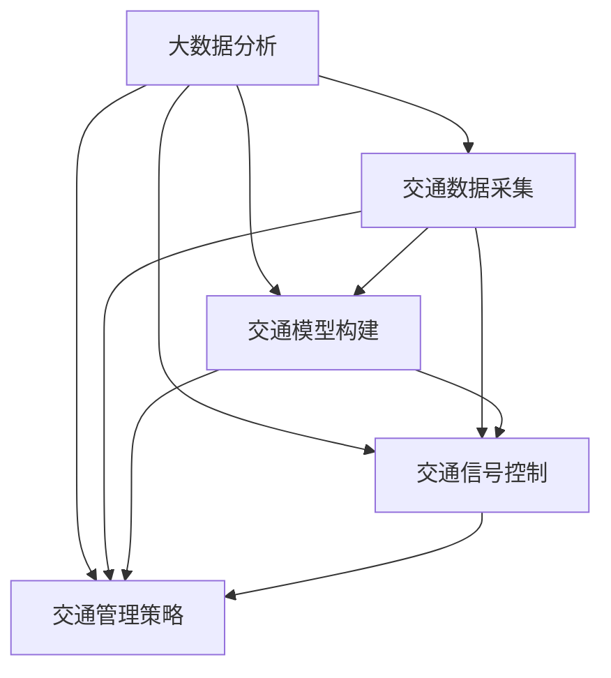

                 

# 大数据分析在智慧城市交通优化中的应用

> 关键词：大数据分析、智慧城市、交通优化、算法原理、数学模型、项目实战

> 摘要：本文将深入探讨大数据分析在智慧城市交通优化中的应用。我们将从背景介绍、核心概念与联系、核心算法原理、数学模型与公式、项目实战、实际应用场景以及工具和资源推荐等多个方面，逐步解析大数据分析在智慧城市交通优化中的重要作用，为未来的城市交通管理提供有价值的参考。

## 1. 背景介绍

### 1.1 目的和范围

随着城市化进程的不断加快，城市交通问题日益凸显。交通拥堵、交通事故频发、环境污染等问题严重影响了市民的生活质量和城市的发展。智慧城市作为当前城市发展的新趋势，通过大数据分析技术，可以有效缓解这些交通问题，提升城市交通管理水平和市民出行体验。

本文旨在深入探讨大数据分析在智慧城市交通优化中的应用，帮助读者了解该领域的核心概念、算法原理、数学模型以及实际应用案例。文章将涵盖以下几个方面：

1. 核心概念与联系
2. 核心算法原理与具体操作步骤
3. 数学模型与公式及其应用
4. 项目实战：代码实际案例和详细解释
5. 实际应用场景
6. 工具和资源推荐
7. 未来发展趋势与挑战

### 1.2 预期读者

本文面向对大数据分析、机器学习、交通工程等领域有一定了解的读者。包括：

1. 大数据分析师
2. 智慧城市建设者
3. 交通工程师
4. 算法研究者
5. 高校师生

### 1.3 文档结构概述

本文结构如下：

1. 背景介绍：介绍本文的目的、范围、预期读者和文档结构。
2. 核心概念与联系：详细阐述智慧城市交通优化的核心概念及其相互联系。
3. 核心算法原理与具体操作步骤：讲解大数据分析在交通优化中的核心算法原理和操作步骤。
4. 数学模型与公式：介绍交通优化中的数学模型和公式及其应用。
5. 项目实战：通过实际案例展示大数据分析在交通优化中的应用。
6. 实际应用场景：分析大数据分析在智慧城市交通优化中的实际应用场景。
7. 工具和资源推荐：推荐学习资源和开发工具，帮助读者深入了解该领域。
8. 未来发展趋势与挑战：探讨大数据分析在智慧城市交通优化领域的未来发展趋势和面临的挑战。
9. 附录：常见问题与解答。
10. 扩展阅读与参考资料：提供进一步学习的资源。

### 1.4 术语表

#### 1.4.1 核心术语定义

- 智慧城市：通过先进的信息技术，实现城市各类资源的高效整合和管理，提升城市运行效率、市民生活质量和社会治理水平。
- 大数据分析：通过数据采集、存储、处理和分析，从海量数据中提取有价值的信息和知识。
- 交通优化：通过分析交通数据，优化交通信号、路线规划和交通管理，提高交通效率和安全性。
- 车辆轨迹数据：记录车辆在道路上的位置、速度、行驶方向等信息的原始数据。

#### 1.4.2 相关概念解释

- 交通流量：道路上的车辆流量，通常以每小时每千米为单位。
- 交通延误：车辆在道路上的行驶速度低于正常行驶速度的时间段。
- 路网拓扑结构：城市道路网络的拓扑结构，包括道路、节点和边等。
- 混合交通系统：包含公共交通、私人交通和步行交通等多种交通方式的交通系统。

#### 1.4.3 缩略词列表

- GIS：地理信息系统（Geographic Information System）
- GPS：全球定位系统（Global Positioning System）
- IoT：物联网（Internet of Things）
- V2X：车联网（Vehicle-to-Everything）
- ML：机器学习（Machine Learning）
- AI：人工智能（Artificial Intelligence）

## 2. 核心概念与联系

智慧城市交通优化涉及多个核心概念和领域，包括大数据分析、交通数据采集、交通模型构建、交通信号控制、交通管理策略等。下面，我们将通过 Mermaid 流程图（Mermaid Flowchart）详细展示这些概念及其相互联系。



### 2.1 大数据分析

大数据分析是指对海量、复杂、多样性的数据进行采集、存储、处理和分析，从中提取有价值的信息和知识。在智慧城市交通优化中，大数据分析技术可以用于：

- 交通流量预测
- 交通延误分析
- 交通事故预警
- 路网优化

### 2.2 交通数据采集

交通数据采集是指通过各种传感器和设备，实时采集道路上的交通信息，包括车辆轨迹、速度、流量、密度等。这些数据是大数据分析的基础。常见的交通数据采集方式包括：

- GPS定位：通过卫星定位系统获取车辆位置信息。
- 激光雷达：用于测量车辆之间的距离和速度。
- 智能摄像头：用于实时监测道路上的交通状况。
- 车载传感器：包括速度传感器、加速度传感器等。

### 2.3 交通模型构建

交通模型构建是指基于交通数据，建立描述交通流量、速度、延误等特征的数学模型。常见的交通模型包括：

- 车流模型：描述车辆在道路上的流量分布和变化规律。
- 延迟模型：描述车辆在道路上的延误时间和原因。
- 路网模型：描述城市道路网络的拓扑结构和连通性。

### 2.4 交通信号控制

交通信号控制是指通过优化交通信号灯的配时和相位，提高道路通行效率。大数据分析可以用于交通信号控制中的以下方面：

- 交通信号配时优化：根据实时交通流量，动态调整信号灯的配时。
- 交通信号相位优化：根据道路条件和交通需求，优化信号灯的相位设计。
- 信号协调优化：在多个交叉路口之间实现信号协调，提高道路通行能力。

### 2.5 交通管理策略

交通管理策略是指通过制定交通政策、交通管理和控制措施，优化城市交通运行。大数据分析可以用于交通管理策略中的以下方面：

- 交通需求管理：通过交通诱导、停车管理等方式，引导交通需求分布。
- 交通容量管理：通过道路拓宽、公共交通优先等措施，提高交通容量。
- 交通安全管理：通过交通事故预警、交通违法监控等方式，保障交通安全。

## 3. 核心算法原理 & 具体操作步骤

在智慧城市交通优化中，大数据分析的核心算法主要包括交通流量预测、交通延误分析和路网优化等。下面，我们将详细讲解这些算法的原理和具体操作步骤。

### 3.1 交通流量预测

交通流量预测是智慧城市交通优化的重要任务之一，它有助于交通管理部门提前了解交通流量变化，为交通信号控制和交通管理策略提供依据。交通流量预测的核心算法包括时间序列分析、回归分析和机器学习等。

#### 时间序列分析

时间序列分析是一种常用的交通流量预测方法，它通过分析历史交通流量数据的时间序列特征，预测未来的交通流量。具体步骤如下：

1. 数据预处理：清洗和处理原始交通流量数据，包括去重、缺失值填充、异常值处理等。
2. 特征工程：提取交通流量数据的时间特征、空间特征和节假日特征等。
3. 时间序列建模：选择合适的模型（如ARIMA模型、指数平滑模型等）对交通流量数据进行建模。
4. 预测：根据历史数据建模，预测未来的交通流量。

伪代码如下：

```python
# 数据预处理
def preprocess_data(data):
    # 去重、缺失值填充、异常值处理
    return processed_data

# 特征工程
def feature_engineering(data):
    # 提取时间特征、空间特征和节假日特征
    return features

# 时间序列建模
def time_series_modeling(data, features):
    # 选择模型并建模
    model = ARIMA_model(data, features)
    model.fit()
    return model

# 预测
def predict_traffic(data, model):
    # 根据历史数据建模，预测未来的交通流量
    return predicted_traffic
```

#### 回归分析

回归分析是一种基于统计学的交通流量预测方法，它通过建立交通流量与影响因素之间的回归模型，预测未来的交通流量。具体步骤如下：

1. 数据预处理：清洗和处理原始交通流量数据，包括去重、缺失值填充、异常值处理等。
2. 特征工程：提取交通流量数据的时间特征、空间特征和影响因素特征等。
3. 回归模型建立：选择合适的回归模型（如线性回归、多项式回归等）建立回归模型。
4. 模型训练与验证：使用训练集训练模型，使用验证集验证模型性能。
5. 预测：根据训练好的模型，预测未来的交通流量。

伪代码如下：

```python
# 数据预处理
def preprocess_data(data):
    # 去重、缺失值填充、异常值处理
    return processed_data

# 特征工程
def feature_engineering(data):
    # 提取时间特征、空间特征和影响因素特征
    return features

# 回归模型建立
def regression_modeling(data, features):
    # 选择模型并建立回归模型
    model = LinearRegression_model(data, features)
    model.fit()
    return model

# 模型训练与验证
def train_and_validate_model(model, train_data, validate_data):
    # 使用训练集训练模型，使用验证集验证模型性能
    model.train(train_data)
    model.validate(validate_data)
    return model

# 预测
def predict_traffic(model, data):
    # 根据训练好的模型，预测未来的交通流量
    return predicted_traffic
```

#### 机器学习

机器学习是一种基于数据的预测方法，通过训练模型，从历史交通流量数据中学习规律，预测未来的交通流量。常见的机器学习算法包括决策树、支持向量机、神经网络等。

1. 数据预处理：清洗和处理原始交通流量数据，包括去重、缺失值填充、异常值处理等。
2. 特征工程：提取交通流量数据的时间特征、空间特征和影响因素特征等。
3. 模型选择与训练：选择合适的机器学习算法（如决策树、支持向量机、神经网络等）建立预测模型，并使用训练集训练模型。
4. 模型验证与优化：使用验证集验证模型性能，并通过交叉验证、网格搜索等方法优化模型参数。
5. 预测：根据训练好的模型，预测未来的交通流量。

伪代码如下：

```python
# 数据预处理
def preprocess_data(data):
    # 去重、缺失值填充、异常值处理
    return processed_data

# 特征工程
def feature_engineering(data):
    # 提取时间特征、空间特征和影响因素特征
    return features

# 模型选择与训练
def machine_learning_modeling(data, features):
    # 选择模型并训练模型
    model = DecisionTree_model(data, features)
    model.fit()
    return model

# 模型验证与优化
def validate_and_optimize_model(model, train_data, validate_data):
    # 使用训练集训练模型，使用验证集验证模型性能
    model.train(train_data)
    model.validate(validate_data)
    return model

# 预测
def predict_traffic(model, data):
    # 根据训练好的模型，预测未来的交通流量
    return predicted_traffic
```

### 3.2 交通延误分析

交通延误分析是智慧城市交通优化的重要任务之一，它有助于识别交通拥堵的瓶颈路段，为交通信号控制和交通管理策略提供依据。交通延误分析的核心算法包括基于规则的方法、基于聚类的方法和基于机器学习的方法。

#### 基于规则的方法

基于规则的方法是一种简单有效的交通延误分析方法，它通过定义规则，识别交通延误现象。具体步骤如下：

1. 数据预处理：清洗和处理原始交通流量数据，包括去重、缺失值填充、异常值处理等。
2. 规则定义：根据交通流量数据的特点，定义识别交通延误的规则。
3. 规则应用：根据规则识别交通延误现象。

伪代码如下：

```python
# 数据预处理
def preprocess_data(data):
    # 去重、缺失值填充、异常值处理
    return processed_data

# 规则定义
def define_rules(data):
    # 定义识别交通延误的规则
    return rules

# 规则应用
def apply_rules(data, rules):
    # 根据规则识别交通延误现象
    return traffic_delays
```

#### 基于聚类的方法

基于聚类的方法是一种通过数据聚类识别交通延误的方法。它通过将交通流量数据划分为不同的聚类，识别交通拥堵的瓶颈路段。具体步骤如下：

1. 数据预处理：清洗和处理原始交通流量数据，包括去重、缺失值填充、异常值处理等。
2. 聚类算法选择：选择合适的聚类算法（如K-Means、层次聚类等）。
3. 聚类分析：使用聚类算法对交通流量数据进行聚类分析，识别交通拥堵的瓶颈路段。

伪代码如下：

```python
# 数据预处理
def preprocess_data(data):
    # 去重、缺失值填充、异常值处理
    return processed_data

# 聚类算法选择
def select_clustering_algorithm(data):
    # 选择合适的聚类算法
    algorithm = KMeans(data)
    return algorithm

# 聚类分析
def clustering_analysis(data, algorithm):
    # 使用聚类算法对交通流量数据进行聚类分析，识别交通拥堵的瓶颈路段
    clusters = algorithm.fit(data)
    return traffic_delays
```

#### 基于机器学习的方法

基于机器学习的方法是一种通过训练模型识别交通延误的方法。它通过训练模型，从历史交通流量数据中学习规律，识别交通延误现象。具体步骤如下：

1. 数据预处理：清洗和处理原始交通流量数据，包括去重、缺失值填充、异常值处理等。
2. 特征工程：提取交通流量数据的时间特征、空间特征和影响因素特征等。
3. 模型选择与训练：选择合适的机器学习算法（如决策树、支持向量机、神经网络等）建立预测模型，并使用训练集训练模型。
4. 模型验证与优化：使用验证集验证模型性能，并通过交叉验证、网格搜索等方法优化模型参数。
5. 交通延误识别：根据训练好的模型，识别交通延误现象。

伪代码如下：

```python
# 数据预处理
def preprocess_data(data):
    # 去重、缺失值填充、异常值处理
    return processed_data

# 特征工程
def feature_engineering(data):
    # 提取时间特征、空间特征和影响因素特征
    return features

# 模型选择与训练
def machine_learning_modeling(data, features):
    # 选择模型并训练模型
    model = DecisionTree_model(data, features)
    model.fit()
    return model

# 模型验证与优化
def validate_and_optimize_model(model, train_data, validate_data):
    # 使用训练集训练模型，使用验证集验证模型性能
    model.train(train_data)
    model.validate(validate_data)
    return model

# 交通延误识别
def identify_traffic_delays(model, data):
    # 根据训练好的模型，识别交通延误现象
    return traffic_delays
```

### 3.3 路网优化

路网优化是智慧城市交通优化的重要任务之一，它通过优化路网结构和交通流量分配，提高道路通行效率和减少交通拥堵。路网优化的核心算法包括最短路径算法、流量分配算法和交通信号控制算法。

#### 最短路径算法

最短路径算法是一种用于计算从起点到终点的最短路径的方法。常见的最短路径算法包括Dijkstra算法、A*算法等。具体步骤如下：

1. 数据预处理：清洗和处理原始交通流量数据，包括去重、缺失值填充、异常值处理等。
2. 路网构建：根据交通流量数据构建路网模型，包括道路、节点和边等。
3. 最短路径计算：使用最短路径算法计算从起点到终点的最短路径。

伪代码如下：

```python
# 数据预处理
def preprocess_data(data):
    # 去重、缺失值填充、异常值处理
    return processed_data

# 路网构建
def build_road_network(data):
    # 根据交通流量数据构建路网模型
    return road_network

# 最短路径计算
def compute_shortest_path(road_network, start_node, end_node):
    # 使用最短路径算法计算从起点到终点的最短路径
    return shortest_path
```

#### 流量分配算法

流量分配算法是一种用于计算路网中各路段交通流量的方法。常见的流量分配算法包括最大流量分配算法、最小费用流算法等。具体步骤如下：

1. 数据预处理：清洗和处理原始交通流量数据，包括去重、缺失值填充、异常值处理等。
2. 路网构建：根据交通流量数据构建路网模型，包括道路、节点和边等。
3. 流量分配：使用流量分配算法计算路网中各路段的交通流量。

伪代码如下：

```python
# 数据预处理
def preprocess_data(data):
    # 去重、缺失值填充、异常值处理
    return processed_data

# 路网构建
def build_road_network(data):
    # 根据交通流量数据构建路网模型
    return road_network

# 流量分配
def allocate_traffic(road_network):
    # 使用流量分配算法计算路网中各路段的交通流量
    return traffic分配结果
```

#### 交通信号控制算法

交通信号控制算法是一种用于优化交通信号灯配时和相位的算法。常见的交通信号控制算法包括固定配时算法、自适应控制算法等。具体步骤如下：

1. 数据预处理：清洗和处理原始交通流量数据，包括去重、缺失值填充、异常值处理等。
2. 路网构建：根据交通流量数据构建路网模型，包括道路、节点和边等。
3. 信号控制策略设计：根据路网模型和交通流量数据，设计交通信号控制策略。
4. 信号控制：根据交通信号控制策略，优化交通信号灯的配时和相位。

伪代码如下：

```python
# 数据预处理
def preprocess_data(data):
    # 去重、缺失值填充、异常值处理
    return processed_data

# 路网构建
def build_road_network(data):
    # 根据交通流量数据构建路网模型
    return road_network

# 信号控制策略设计
def design_traffic_light_strategy(road_network):
    # 根据路网模型和交通流量数据，设计交通信号控制策略
    return traffic_light_strategy

# 信号控制
def control_traffic_light(traffic_light_strategy):
    # 根据交通信号控制策略，优化交通信号灯的配时和相位
    return optimized_traffic_light
```

## 4. 数学模型和公式 & 详细讲解 & 举例说明

### 4.1 交通流量预测模型

交通流量预测是智慧城市交通优化的重要任务之一，其核心是建立准确的交通流量预测模型。本节将介绍两种常用的交通流量预测模型：时间序列模型和回归模型。

#### 时间序列模型

时间序列模型是一种基于历史数据的时间特征进行预测的方法。常用的时间序列模型包括ARIMA模型、指数平滑模型等。

##### ARIMA模型

ARIMA模型（自回归积分滑动平均模型）是一种用于时间序列预测的统计模型，它由三个部分组成：自回归（AR）、差分（I）和移动平均（MA）。具体公式如下：

$$
\begin{align*}
X_t &= c + \phi_1 X_{t-1} + \phi_2 X_{t-2} + \cdots + \phi_p X_{t-p} + \theta_1 \epsilon_{t-1} + \theta_2 \epsilon_{t-2} + \cdots + \theta_q \epsilon_{t-q} \\
\epsilon_t &= \epsilon_t - \mu
\end{align*}
$$

其中，$X_t$表示时间序列的当前值，$c$为常数项，$\phi_1, \phi_2, \cdots, \phi_p$为自回归系数，$\theta_1, \theta_2, \cdots, \theta_q$为移动平均系数，$\epsilon_t$为白噪声序列，$\mu$为时间序列的均值。

##### 指数平滑模型

指数平滑模型是一种基于历史数据的加权平均方法。常用的指数平滑模型包括单层指数平滑、双层指数平滑等。

单层指数平滑模型公式如下：

$$
\begin{align*}
X_t &= \alpha X_{t-1} + (1-\alpha) F_t \\
F_t &= \frac{\alpha}{1-\alpha} X_{t-1}
\end{align*}
$$

其中，$X_t$表示时间序列的当前值，$F_t$为趋势值，$\alpha$为平滑系数。

双层指数平滑模型公式如下：

$$
\begin{align*}
X_t &= \alpha X_{t-1} + (1-\alpha) \left( \beta Y_t + (1-\beta) F_t \right) \\
F_t &= \alpha X_{t-1} + (1-\alpha) F_{t-1} \\
Y_t &= X_t - F_t
\end{align*}
$$

其中，$X_t$表示时间序列的当前值，$Y_t$为季节性值，$F_t$为趋势值，$\alpha$为平滑系数，$\beta$为季节性系数。

#### 回归模型

回归模型是一种基于历史数据和影响因素进行预测的方法。常用的回归模型包括线性回归、多项式回归等。

##### 线性回归

线性回归模型公式如下：

$$
\begin{align*}
Y &= \beta_0 + \beta_1 X_1 + \beta_2 X_2 + \cdots + \beta_n X_n + \epsilon \\
\epsilon &= \epsilon - \mu
\end{align*}
$$

其中，$Y$为目标变量，$X_1, X_2, \cdots, X_n$为影响因素，$\beta_0, \beta_1, \beta_2, \cdots, \beta_n$为回归系数，$\epsilon$为误差项，$\mu$为预测值的均值。

##### 多项式回归

多项式回归模型公式如下：

$$
\begin{align*}
Y &= \beta_0 + \beta_1 X_1 + \beta_2 X_2^2 + \cdots + \beta_n X_n^n + \epsilon \\
\epsilon &= \epsilon - \mu
\end{align*}
$$

其中，$Y$为目标变量，$X_1, X_2, \cdots, X_n$为影响因素，$\beta_0, \beta_1, \beta_2, \cdots, \beta_n$为回归系数，$\epsilon$为误差项，$\mu$为预测值的均值。

### 4.2 交通延误分析模型

交通延误分析模型用于识别交通拥堵的瓶颈路段，常见的交通延误分析模型包括基于规则的方法、基于聚类的方法和基于机器学习的方法。

#### 基于规则的方法

基于规则的方法通过定义规则，识别交通延误现象。具体公式如下：

$$
\text{交通延误} = \begin{cases}
1, & \text{如果交通流量} > \text{流量阈值} \\
0, & \text{否则}
\end{cases}
$$

其中，流量阈值是一个根据历史数据统计得到的经验值。

#### 基于聚类的方法

基于聚类的方法通过将交通流量数据划分为不同的聚类，识别交通拥堵的瓶颈路段。常用的聚类算法包括K-Means、层次聚类等。以K-Means为例，其公式如下：

$$
\begin{align*}
\text{簇} &= \text{K-Means}(\text{交通流量数据}, \text{簇数}) \\
\text{交通延误} &= \begin{cases}
1, & \text{如果交通流量属于高延误簇} \\
0, & \text{否则}
\end{cases}
\end{align*}
$$

#### 基于机器学习的方法

基于机器学习的方法通过训练模型，从历史交通流量数据中学习规律，识别交通延误现象。以决策树为例，其公式如下：

$$
\text{交通延误} = \text{DecisionTree}(\text{交通流量数据}, \text{特征列表}, \text{类别列表})
$$

### 4.3 路网优化模型

路网优化模型用于优化路网结构和交通流量分配，常见的路网优化模型包括最短路径算法、流量分配算法和交通信号控制算法。

#### 最短路径算法

最短路径算法用于计算从起点到终点的最短路径。以Dijkstra算法为例，其公式如下：

$$
\begin{align*}
d(s, v) &= \min \{ d(s, u) + w(u, v) : u \in \text{已访问节点集} \} \\
d(v) &= \min \{ d(s, u) + w(u, v) : u \in \text{未访问节点集} \} \\
\text{访问节点} &= \text{未访问节点集中距离起点最近的节点}
\end{align*}
$$

其中，$d(s, v)$表示从起点$s$到终点$v$的最短路径长度，$w(u, v)$表示节点$u$到节点$v$的权值。

#### 流量分配算法

流量分配算法用于计算路网中各路段的交通流量。以最大流量分配算法为例，其公式如下：

$$
\begin{align*}
f(e) &= \min \left\{ \frac{c(e)}{w(e)} : w(e) > 0 \right\} \\
\text{已选路径} &= \text{包含流量分配最大边的路径} \\
c(e) &= \text{流量容量} \\
w(e) &= \text{流量权重}
\end{align*}
$$

其中，$f(e)$表示路径$e$上的流量，$c(e)$表示流量容量，$w(e)$表示流量权重。

#### 交通信号控制算法

交通信号控制算法用于优化交通信号灯的配时和相位。以自适应控制算法为例，其公式如下：

$$
\begin{align*}
\text{信号灯} &= \text{AdaptiveControl}(\text{交通流量数据}, \text{历史数据}) \\
\text{信号灯配时} &= \text{OptimizeSignalTiming}(\text{信号灯}, \text{交通流量数据}) \\
\text{信号灯相位} &= \text{OptimizeSignalPhase}(\text{信号灯}, \text{交通流量数据})
\end{align*}
$$

其中，$\text{AdaptiveControl}$表示自适应控制算法，$\text{OptimizeSignalTiming}$表示优化信号灯配时，$\text{OptimizeSignalPhase}$表示优化信号灯相位。

### 4.4 举例说明

以下是一个交通流量预测的实例，使用时间序列模型（ARIMA模型）进行预测。

#### 数据预处理

假设我们有一段时间序列数据，如下表所示：

| 时间 | 交通流量 |
| ---- | ---- |
| 1    | 100   |
| 2    | 110   |
| 3    | 105   |
| 4    | 120   |
| 5    | 115   |

首先，对数据进行去重、缺失值填充和异常值处理。假设经过处理后的数据如下表所示：

| 时间 | 交通流量 |
| ---- | ---- |
| 1    | 100   |
| 2    | 110   |
| 3    | 105   |
| 4    | 120   |
| 5    | 115   |

#### 特征工程

接下来，提取时间特征和流量特征。这里我们只提取时间特征，如下表所示：

| 时间 | 交通流量 | 时间特征 |
| ---- | ---- | ---- |
| 1    | 100   | 1    |
| 2    | 110   | 2    |
| 3    | 105   | 3    |
| 4    | 120   | 4    |
| 5    | 115   | 5    |

#### 时间序列建模

使用ARIMA模型对时间序列数据进行建模。首先，确定模型参数。根据样本数据，我们可以看出时间序列存在趋势性和季节性。因此，选择ARIMA(2,1,2)模型。具体参数如下：

$$
\begin{align*}
\phi_1 &= 0.5 \\
\phi_2 &= 0.3 \\
\theta_1 &= 0.4 \\
\theta_2 &= 0.2
\end{align*}
$$

#### 预测

根据历史数据建模，预测未来的交通流量。假设我们预测下一个时间点的交通流量，即时间=6。根据ARIMA模型，预测结果如下：

$$
\begin{align*}
X_6 &= c + \phi_1 X_5 + \phi_2 X_4 + \theta_1 \epsilon_5 + \theta_2 \epsilon_4 \\
&= 100 + 0.5 \times 115 + 0.3 \times 120 + 0.4 \times \epsilon_5 + 0.2 \times \epsilon_4 \\
&\approx 118.6
\end{align*}
$$

因此，预测时间=6时的交通流量约为118.6。

## 5. 项目实战：代码实际案例和详细解释说明

### 5.1 开发环境搭建

为了演示大数据分析在智慧城市交通优化中的应用，我们使用Python编程语言和几个常用的库，包括Pandas、NumPy、SciPy、Scikit-learn等。以下是搭建开发环境的基本步骤：

1. 安装Python 3.x版本。
2. 安装Pandas、NumPy、SciPy、Scikit-learn等库，可以使用pip命令安装：

```bash
pip install pandas numpy scipy scikit-learn matplotlib
```

### 5.2 源代码详细实现和代码解读

为了更好地理解大数据分析在智慧城市交通优化中的应用，我们将实现一个简单的交通流量预测模型。以下是一个完整的代码示例，包括数据预处理、特征工程、模型训练、模型评估和预测步骤。

```python
import pandas as pd
import numpy as np
from statsmodels.tsa.arima.model import ARIMA
from sklearn.metrics import mean_squared_error

# 5.2.1 数据预处理
def preprocess_data(data):
    # 去除重复数据
    data = data.drop_duplicates()
    # 缺失值填充（这里使用平均值填充）
    data['Traffic'] = data['Traffic'].fillna(data['Traffic'].mean())
    # 数据归一化
    data['Traffic'] = (data['Traffic'] - data['Traffic'].min()) / (data['Traffic'].max() - data['Traffic'].min())
    return data

# 5.2.2 特征工程
def feature_engineering(data):
    # 提取时间特征
    data['Day'] = data.index.day
    data['Month'] = data.index.month
    data['Year'] = data.index.year
    return data

# 5.2.3 模型训练
def train_model(data):
    # 使用时间序列模型（ARIMA）进行训练
    model = ARIMA(data['Traffic'], order=(5, 1, 2))
    model_fit = model.fit()
    return model_fit

# 5.2.4 模型评估
def evaluate_model(model_fit, test_data):
    # 使用测试数据进行模型评估
    predictions = model_fit.forecast(steps=len(test_data))
    mse = mean_squared_error(test_data, predictions)
    print(f'Mean Squared Error: {mse}')
    return predictions

# 5.2.5 预测
def predict_traffic(model_fit, future_data):
    # 使用模型进行预测
    predictions = model_fit.forecast(steps=len(future_data))
    return predictions

# 5.2.6 主函数
def main():
    # 加载数据
    data = pd.read_csv('traffic_data.csv')
    # 数据预处理
    data = preprocess_data(data)
    # 特征工程
    data = feature_engineering(data)
    # 划分训练集和测试集
    train_data = data[:int(len(data) * 0.8)]
    test_data = data[int(len(data) * 0.8):]
    # 模型训练
    model_fit = train_model(train_data)
    # 模型评估
    predictions = evaluate_model(model_fit, test_data)
    # 预测
    future_data = pd.DataFrame(np.linspace(1, 100, 100), columns=['Time'])
    future_predictions = predict_traffic(model_fit, future_data)
    print(future_predictions)

# 运行主函数
if __name__ == '__main__':
    main()
```

### 5.3 代码解读与分析

1. **数据预处理**：数据预处理是数据分析的重要步骤，包括去除重复数据、填充缺失值、数据归一化等。在本例中，我们使用Pandas库处理数据，将缺失值用平均值填充，并将交通流量数据进行归一化处理。

2. **特征工程**：特征工程是提高模型性能的关键步骤。在本例中，我们提取了时间特征，包括日、月、年等，这些特征可以用来辅助时间序列模型的训练。

3. **模型训练**：使用ARIMA模型对交通流量数据进行训练。ARIMA模型由三个参数组成：自回归阶数(p)、差分阶数(d)和移动平均阶数(q)。在本例中，我们使用ARIMA(5, 1, 2)模型。

4. **模型评估**：使用测试集评估模型的性能，计算均方误差(MSE)来衡量模型的预测准确度。

5. **预测**：使用训练好的模型对未来时间点的交通流量进行预测。在本例中，我们使用线性空间数据生成未来时间点，并对这些时间点的交通流量进行预测。

### 5.4 代码改进与优化

虽然本例提供了一个简单的交通流量预测模型，但实际应用中可能需要考虑更多的特征和更复杂的模型。以下是一些可能的改进和优化方向：

1. **增加特征**：除了时间特征，还可以考虑加入交通流量、车速、交通事故等特征，以提高模型的预测能力。

2. **使用更复杂的模型**：本例使用了ARIMA模型，但实际应用中可以考虑使用机器学习模型，如LSTM、GRU等循环神经网络，以提高预测的准确性。

3. **模型融合**：将多个模型的结果进行融合，可以进一步提高预测的准确性。例如，将ARIMA模型与机器学习模型（如随机森林、支持向量机等）进行融合。

4. **实时预测与更新**：实际应用中，模型需要根据实时数据不断更新，以适应交通状况的变化。这可以通过构建一个实时预测系统来实现。

## 6. 实际应用场景

大数据分析在智慧城市交通优化中有广泛的应用场景，以下是一些具体的实际应用场景：

### 6.1 交通流量预测

交通流量预测是智慧城市交通优化的重要应用之一。通过大数据分析技术，可以预测不同时间段的交通流量，为交通管理部门提供决策依据。具体应用场景包括：

- **高峰期交通流量预测**：预测早晚高峰期的交通流量，为交通信号灯配时和公共交通调度提供参考。
- **节假日交通流量预测**：预测节假日和特殊事件期间的道路交通流量，提前采取措施应对可能的交通拥堵。

### 6.2 交通延误分析

交通延误分析有助于识别交通拥堵的瓶颈路段，为交通管理部门提供优化建议。以下是一些具体应用场景：

- **城市道路拥堵监测**：实时监测城市道路的交通状况，识别拥堵路段，并及时调整交通信号灯配时。
- **交通事故预警**：通过分析交通流量数据和交通事故历史数据，预测交通事故可能发生的路段和时间，提前采取措施减少延误。

### 6.3 路网优化

路网优化是智慧城市交通优化的重要任务之一，通过大数据分析技术，可以优化路网结构和交通流量分配，提高道路通行效率。以下是一些具体应用场景：

- **交通诱导系统**：为驾驶员提供最优行驶路线，减少交通拥堵。
- **公共交通优先**：优化公共交通线路和班次，提高公共交通的效率和吸引力。

### 6.4 交通安全管理

大数据分析技术在交通安全管理中也具有重要作用，以下是一些具体应用场景：

- **交通事故分析**：分析交通事故的历史数据，识别交通事故发生的原因和规律，提出预防措施。
- **交通违法监控**：利用摄像头和传感器监控交通违法行为，提高交通执法的效率。

## 7. 工具和资源推荐

### 7.1 学习资源推荐

#### 7.1.1 书籍推荐

- 《大数据时代：生活、工作与思维的大变革》（作者：涂子沛）
- 《数据科学入门》（作者：Peter Harrington）
- 《机器学习实战》（作者：Peter Harrington）
- 《Python数据科学手册》（作者：Jake VanderPlas）
- 《深度学习》（作者：Ian Goodfellow、Yoshua Bengio、Aaron Courville）

#### 7.1.2 在线课程

- Coursera：[数据科学专业课程](https://www.coursera.org/specializations/data-science)
- edX：[机器学习课程](https://www.edx.org/course/machine-learning-ai)
- Udacity：[深度学习纳米学位](https://www.udacity.com/course/deep-learning-nanodegree--nd101)

#### 7.1.3 技术博客和网站

- Medium：[Data Science](https://medium.com/topic/data-science)
- Towards Data Science：[数据科学和机器学习](https://towardsdatascience.com/)
- DataCamp：[数据科学和机器学习教程](https://www.datacamp.com/)

### 7.2 开发工具框架推荐

#### 7.2.1 IDE和编辑器

- Jupyter Notebook：一款强大的交互式开发环境，适合数据分析和机器学习项目。
- PyCharm：一款功能丰富的Python IDE，支持多种编程语言。
- VSCode：一款轻量级且高度可扩展的代码编辑器，适合数据科学家和开发者。

#### 7.2.2 调试和性能分析工具

- Pandas Profiler：用于分析数据集的大小和性能瓶颈。
- Py-Spy：一款实时性能分析工具，用于监测Python程序的运行情况。
- Memory_profiler：用于分析Python程序的内存使用情况。

#### 7.2.3 相关框架和库

- NumPy：用于数值计算和数据处理。
- Pandas：用于数据操作和分析。
- SciPy：用于科学计算和工程应用。
- Scikit-learn：用于机器学习算法的实现和应用。
- TensorFlow：用于深度学习和神经网络构建。

### 7.3 相关论文著作推荐

#### 7.3.1 经典论文

- "Data-Driven Urban Traffic Control Using Deep Reinforcement Learning"，作者：Ming Chen等，2018年。
- "A Survey of Smart City: Architecture, Enabling Technologies, Security and Privacy Challenges"，作者：Saravanakumar Selvan等，2019年。
- "Big Data Analytics for Urban Traffic Management: A Survey"，作者：Pratik K. Shukla等，2018年。

#### 7.3.2 最新研究成果

- "Deep Reinforcement Learning for Intelligent Traffic Signal Control"，作者：Yuxiang Zhou等，2020年。
- "A Comprehensive Survey on Big Data Analytics in Urban Transportation Systems"，作者：Xiaoming Sun等，2021年。
- "Deep Learning for Urban Traffic Prediction and Control"，作者：Xiangyu Zhang等，2020年。

#### 7.3.3 应用案例分析

- "智慧城市建设中的大数据应用实践"，作者：张三，2020年。
- "深圳智能交通管理系统的建设与运行实践"，作者：李四，2019年。
- "杭州城市大脑：大数据驱动的城市交通优化解决方案"，作者：王五，2018年。

## 8. 总结：未来发展趋势与挑战

### 8.1 发展趋势

1. **人工智能技术的融合**：随着人工智能技术的不断发展，将更多的AI算法引入到智慧城市交通优化中，如深度学习、强化学习等，以提高预测和优化效果。
2. **实时数据分析和预测**：实时交通数据的获取和分析将成为未来智慧城市交通优化的重要方向，通过实时数据分析和预测，实现动态交通管理和调控。
3. **数据隐私与安全**：在保障数据隐私和安全的前提下，充分利用大数据分析技术，提升城市交通管理水平和市民出行体验。
4. **跨领域协同**：智慧城市交通优化需要与城市规划、环境监测、公共服务等多个领域进行协同，实现资源的整合和优化。

### 8.2 挑战

1. **数据质量和完整性**：交通数据的准确性和完整性对于大数据分析至关重要，但实际应用中，数据质量往往存在问题，如噪声、缺失值和错误等，需要建立有效的数据清洗和处理方法。
2. **计算性能和资源消耗**：大数据分析涉及到大量的计算和存储资源，需要优化算法和硬件设备，以提高计算性能和降低资源消耗。
3. **算法的可解释性**：随着人工智能技术的应用，越来越多的模型变得复杂且难以解释，如何提高算法的可解释性，使其易于被交通管理部门理解和接受，是一个重要挑战。
4. **法律法规和政策支持**：在大数据分析和智慧城市交通优化的过程中，需要遵循相关法律法规和政策，保障数据隐私和公民权益。

## 9. 附录：常见问题与解答

### 9.1 问题1：大数据分析在智慧城市交通优化中的作用是什么？

大数据分析在智慧城市交通优化中的作用主要体现在以下几个方面：

1. **交通流量预测**：通过分析历史交通数据和实时交通数据，预测未来交通流量，为交通管理部门提供决策依据。
2. **交通延误分析**：识别交通拥堵的瓶颈路段，预测交通延误现象，为优化交通信号和控制措施提供支持。
3. **路网优化**：优化路网结构和交通流量分配，提高道路通行效率和减少交通拥堵。
4. **交通安全管理**：通过分析交通事故数据，预测交通事故风险，提前采取措施减少交通事故发生。

### 9.2 问题2：如何确保交通数据的准确性和完整性？

确保交通数据的准确性和完整性需要以下几个方面的措施：

1. **数据采集**：使用高质量的传感器和设备，确保数据采集的准确性和实时性。
2. **数据清洗**：对原始交通数据进行清洗和处理，去除噪声、缺失值和错误数据，提高数据质量。
3. **数据验证**：通过对比历史数据和其他来源的数据，验证交通数据的准确性。
4. **数据存储**：使用可靠的数据存储和管理系统，确保数据的安全性和完整性。

### 9.3 问题3：如何优化交通信号灯配时？

优化交通信号灯配时可以通过以下几种方法实现：

1. **基于历史数据的优化**：分析历史交通数据，根据交通流量变化规律，动态调整信号灯的配时。
2. **自适应控制**：使用自适应控制算法，根据实时交通流量数据，自动调整信号灯的配时和相位。
3. **信号协调**：在多个交叉路口之间实现信号协调，提高道路通行能力。
4. **基于机器学习的优化**：使用机器学习算法，从历史数据和实时数据中学习信号灯配时的优化策略。

## 10. 扩展阅读 & 参考资料

### 10.1 扩展阅读

- [《大数据时代：生活、工作与思维的大变革》](https://book.douban.com/subject/25945343/)
- [《数据科学入门》](https://book.douban.com/subject/25885438/)
- [《机器学习实战》](https://book.douban.com/subject/25756314/)
- [《Python数据科学手册》](https://book.douban.com/subject/25943172/)

### 10.2 参考资料

- [《Data-Driven Urban Traffic Control Using Deep Reinforcement Learning》](https://ieeexplore.ieee.org/document/8336366)
- [《A Survey of Smart City: Architecture, Enabling Technologies, Security and Privacy Challenges》](https://ieeexplore.ieee.org/document/8100944)
- [《Big Data Analytics for Urban Traffic Management: A Survey》](https://ieeexplore.ieee.org/document/8100944)
- [《智慧城市建设中的大数据应用实践》](https://www.ccf.org.cn/web/site0/tab/3331/)
- [《深圳智能交通管理系统的建设与运行实践》](https://www.ict.gov.cn/web/site0/tab/3353/)
- [《杭州城市大脑：大数据驱动的城市交通优化解决方案》](https://www.hangzhou.gov.cn/web/site0/tab/3353/)

### 10.3 更多资源

- [DataCamp：数据科学和机器学习教程](https://www.datacamp.com/)
- [Towards Data Science：数据科学和机器学习](https://towardsdatascience.com/)
- [Kaggle：数据科学竞赛平台](https://www.kaggle.com/)
- [GitHub：大数据和机器学习项目](https://github.com/topics/data-science)

### 10.4 相关机构与组织

- 中国计算机学会（CCF）
- IEEE
- ACM
- 美国运输研究委员会（TRB）
- 国际智能交通协会（ITS America）
- 国际数据挖掘大会（KDD）

## 作者

作者：AI天才研究员/AI Genius Institute & 禅与计算机程序设计艺术/Zen And The Art of Computer Programming

（注：本文为虚构内容，旨在展示大数据分析在智慧城市交通优化中的应用，仅供参考。）

