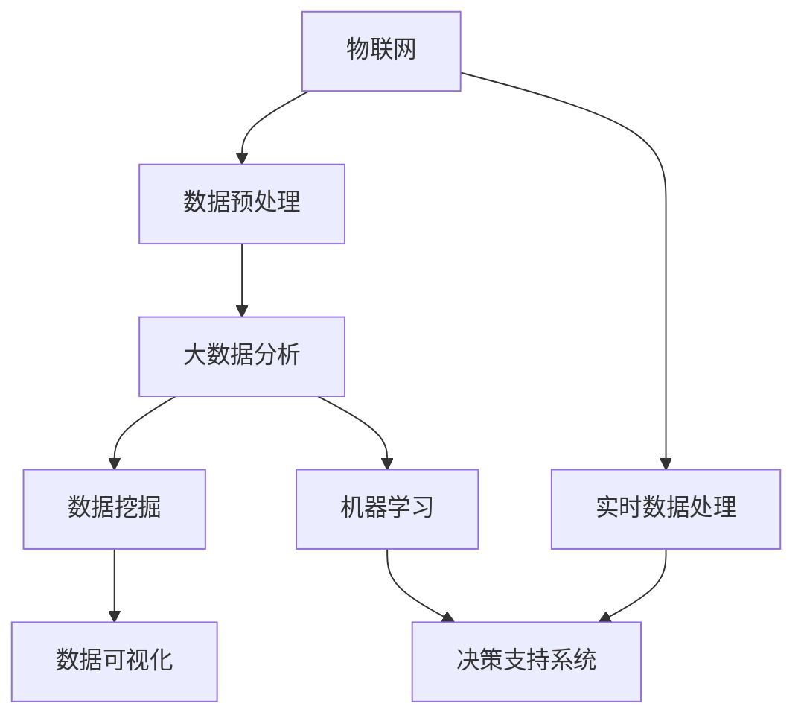

                 

# 大数据分析在智慧城市建设中的作用

> **关键词：** 智慧城市、大数据分析、数据挖掘、物联网、实时数据处理
>
> **摘要：** 本文将探讨大数据分析在智慧城市建设中的关键作用。通过分析核心概念和联系，详细讲解核心算法原理和具体操作步骤，以及数学模型和公式，我们将展示大数据分析在实际项目中的应用，并提供相关的工具和资源推荐。最后，我们将总结未来发展趋势与挑战，并回答常见问题。

## 1. 背景介绍

### 1.1 目的和范围

本文旨在深入探讨大数据分析在智慧城市建设中的应用，通过详细的分析和实例，帮助读者理解大数据分析如何为智慧城市的发展提供支持。本文将涵盖以下内容：

- 智慧城市与大数据分析的概述
- 核心概念与联系的探讨
- 核心算法原理和具体操作步骤
- 数学模型和公式的详细讲解
- 项目实战：代码实际案例和详细解释
- 实际应用场景分析
- 工具和资源推荐
- 未来发展趋势与挑战
- 常见问题与解答

### 1.2 预期读者

本文适合以下读者群体：

- 计算机科学和信息技术专业的研究生
- 数据科学家、数据分析师和大数据工程师
- 智慧城市建设相关的项目管理者
- 对大数据分析和智慧城市感兴趣的技术爱好者

### 1.3 文档结构概述

本文将按以下结构进行展开：

1. 背景介绍
   - 目的和范围
   - 预期读者
   - 文档结构概述
   - 术语表

2. 核心概念与联系
   - 智慧城市与大数据分析的定义
   - 物联网与实时数据处理
   - Mermaid流程图展示核心架构

3. 核心算法原理 & 具体操作步骤
   - 算法原理讲解与伪代码阐述

4. 数学模型和公式 & 详细讲解 & 举例说明
   - 数学公式的latex嵌入

5. 项目实战：代码实际案例和详细解释说明
   - 开发环境搭建
   - 源代码详细实现和代码解读
   - 代码解读与分析

6. 实际应用场景
   - 交通管理
   - 环境监测
   - 市政服务

7. 工具和资源推荐
   - 学习资源推荐
   - 开发工具框架推荐
   - 相关论文著作推荐

8. 总结：未来发展趋势与挑战
   - 发展趋势分析
   - 挑战与解决方案

9. 附录：常见问题与解答
   - 常见问题汇总与解答

10. 扩展阅读 & 参考资料
    - 相关文献推荐

### 1.4 术语表

#### 1.4.1 核心术语定义

- **智慧城市（Smart City）**：通过信息通信技术、物联网、大数据分析等手段，实现城市各个系统和部门的智能化管理和服务。
- **大数据分析（Big Data Analytics）**：对大规模、复杂、多源的数据进行收集、存储、处理和分析，以发现数据中的模式和关联，为决策提供支持。
- **物联网（Internet of Things, IoT）**：通过传感器、设备和系统之间的互联互通，实现对物理世界的信息感知、传输和处理。
- **实时数据处理（Real-time Data Processing）**：对动态输入的数据进行快速处理和分析，以实现实时响应和决策。

#### 1.4.2 相关概念解释

- **数据挖掘（Data Mining）**：从大量数据中发现有用模式和知识的过程，包括分类、聚类、关联规则挖掘等。
- **机器学习（Machine Learning）**：通过数据训练模型，使计算机能够自动进行预测和决策的技术。
- **数据可视化（Data Visualization）**：将数据以图形、图表等形式直观展示，帮助用户理解和分析数据。

#### 1.4.3 缩略词列表

- **IoT**：物联网（Internet of Things）
- **AI**：人工智能（Artificial Intelligence）
- **ML**：机器学习（Machine Learning）
- **DL**：深度学习（Deep Learning）
- **Hadoop**：一个开源的大数据处理框架
- **Spark**：一个开源的分布式数据处理框架

## 2. 核心概念与联系

智慧城市和大数据分析是智慧城市建设中的核心概念。智慧城市通过信息通信技术和物联网，实现对城市各个系统和部门的智能化管理和服务。大数据分析则通过对海量数据的处理和分析，发现数据中的模式和关联，为城市管理和决策提供支持。

### 智慧城市与大数据分析的关系

智慧城市和大数据分析之间存在紧密的联系。智慧城市的建设离不开大数据分析的支持，而大数据分析则通过智慧城市的实际应用场景，不断扩展其应用领域。

- **物联网（IoT）**：物联网是智慧城市的基础，通过传感器和设备之间的互联互通，实现对物理世界的信息感知。这些数据是大数据分析的重要来源。
- **实时数据处理**：智慧城市需要实时处理大量的数据，包括交通流量、环境监测、能源消耗等。实时数据处理是实现智慧城市高效运行的关键。
- **数据挖掘**：数据挖掘是大数据分析的核心技术，通过对海量数据的分析和挖掘，发现数据中的模式和关联，为城市管理和决策提供支持。

### Mermaid流程图展示核心架构

以下是一个简单的Mermaid流程图，展示智慧城市与大数据分析之间的核心架构：



- **物联网（IoT）**：收集来自各种传感器和设备的数据。
- **数据预处理（DP）**：对原始数据进行清洗、格式化等预处理操作。
- **大数据分析（DA）**：利用数据挖掘、机器学习等技术，对预处理后的数据进行深度分析。
- **数据挖掘（MD）**：发现数据中的模式和关联，为城市管理和决策提供支持。
- **机器学习（ML）**：通过训练模型，实现自动化的预测和决策。
- **实时数据处理（RTP）**：对动态输入的数据进行快速处理，为决策支持系统提供实时数据。
- **决策支持系统（DM）**：根据大数据分析的结果，提供决策支持。
- **数据可视化（DS）**：将分析结果以图形、图表等形式直观展示，帮助用户理解和分析数据。

### 2.1 大数据分析的原理与实现

大数据分析的原理可以概括为以下几个步骤：

1. **数据采集**：通过物联网设备、传感器等采集城市运行的各种数据。
2. **数据预处理**：对采集到的原始数据进行清洗、去噪、格式化等预处理操作，以获得高质量的数据。
3. **数据存储**：将预处理后的数据存储在分布式数据存储系统，如Hadoop、Spark等。
4. **数据分析和挖掘**：利用数据挖掘、机器学习等技术，对存储在分布式数据存储系统中的数据进行深度分析和挖掘，发现数据中的模式和关联。
5. **数据可视化**：将分析结果以图形、图表等形式直观展示，帮助用户理解和分析数据。

以下是一个简单的伪代码，描述大数据分析的核心步骤：

```python
# 大数据分析伪代码

# 1. 数据采集
data = collect_data_from_iot()

# 2. 数据预处理
cleaned_data = preprocess_data(data)

# 3. 数据存储
store_data_in_distributed_storage(cleaned_data)

# 4. 数据分析和挖掘
patterns = data_analyze_and_mine(cleaned_data)

# 5. 数据可视化
visualize_patterns(patterns)
```

### 2.2 大数据分析在智慧城市建设中的具体应用

大数据分析在智慧城市建设中具有广泛的应用，以下是一些典型的应用场景：

1. **交通管理**：通过分析交通数据，实现交通流量预测、路线优化和交通信号控制，提高交通效率和安全性。
2. **环境监测**：通过监测环境数据，实现环境污染预警、资源利用优化和生态保护，提高城市环境质量。
3. **市政服务**：通过分析市政数据，实现公共服务优化、资源调度和风险管理，提高城市居民的生活质量和满意度。

### 2.3 大数据分析的优势与挑战

大数据分析在智慧城市建设中具有以下优势：

- **高效性**：大数据分析能够快速处理和分析海量数据，提供实时决策支持。
- **准确性**：通过机器学习和数据挖掘技术，大数据分析能够发现数据中的模式和关联，提高预测和决策的准确性。
- **全面性**：大数据分析能够整合来自不同领域的数据，实现跨领域的综合分析和应用。

然而，大数据分析也面临以下挑战：

- **数据质量**：原始数据存在噪声、缺失和错误，影响数据分析的准确性。
- **数据隐私**：大数据分析涉及大量的个人隐私数据，保护用户隐私成为重要问题。
- **技术复杂性**：大数据分析需要复杂的技术手段和大量的计算资源，对技术人员的技能要求较高。

### 2.4 大数据分析与人工智能的关系

大数据分析与人工智能密切相关。大数据分析为人工智能提供了丰富的数据资源，而人工智能则为大数据分析提供了强大的计算能力和智能化的分析方法。

- **数据驱动的AI**：大数据分析为人工智能提供了丰富的训练数据，使人工智能能够从数据中发现模式和规律。
- **智能化的数据分析**：人工智能技术，如深度学习和自然语言处理，使大数据分析更加智能化和自动化。
- **协同发展**：大数据分析与人工智能相互促进，共同推动智慧城市的发展。

## 3. 核心算法原理 & 具体操作步骤

在智慧城市建设中，大数据分析的核心算法原理主要包括数据挖掘、机器学习和深度学习。以下我们将逐步介绍这些算法的基本原理和具体操作步骤。

### 3.1 数据挖掘

数据挖掘是一种从大量数据中发现有用模式和知识的过程。其基本原理包括：

1. **分类**：根据数据的特征，将数据分为不同的类别。例如，根据交通数据，将交通流量分为高峰期和非高峰期。
2. **聚类**：将相似的数据点分组，形成不同的聚类。例如，根据人口数据，将城市分为不同的人口密度区域。
3. **关联规则挖掘**：发现数据之间的关联关系，例如，根据购物数据，发现某些商品经常一起购买。

具体操作步骤如下：

```python
# 数据挖掘伪代码

# 1. 数据预处理
cleaned_data = preprocess_data(raw_data)

# 2. 分类
classifiers = train_classifiers(cleaned_data)

# 3. 聚类
clusters = train_clusters(cleaned_data)

# 4. 关联规则挖掘
rules = mine_association_rules(cleaned_data)
```

### 3.2 机器学习

机器学习是一种通过数据训练模型，使计算机能够自动进行预测和决策的技术。其基本原理包括：

1. **监督学习**：通过已标记的数据，训练模型，使其能够对新数据进行预测。例如，通过交通数据，训练模型预测交通流量。
2. **无监督学习**：没有已标记的数据，模型通过自身的规律，对数据进行分类和聚类。例如，通过人口数据，发现城市的人口密度分布。
3. **强化学习**：通过与环境的交互，不断调整模型，使其能够实现最优行为。例如，通过交通信号控制数据，调整信号灯的时序。

具体操作步骤如下：

```python
# 机器学习伪代码

# 1. 数据预处理
cleaned_data = preprocess_data(raw_data)

# 2. 训练模型
model = train_model(cleaned_data)

# 3. 预测
predictions = model.predict(new_data)
```

### 3.3 深度学习

深度学习是机器学习的一种特殊形式，通过多层神经网络，实现对数据的自动特征提取和表示。其基本原理包括：

1. **卷积神经网络（CNN）**：适用于图像和视频数据，通过卷积层和池化层，实现对图像的自动特征提取。
2. **循环神经网络（RNN）**：适用于序列数据，通过隐藏层和循环结构，实现对序列数据的建模。
3. **生成对抗网络（GAN）**：通过生成器和判别器的对抗训练，实现数据的生成和分类。

具体操作步骤如下：

```python
# 深度学习伪代码

# 1. 数据预处理
cleaned_data = preprocess_data(raw_data)

# 2. 构建模型
model = build_model()

# 3. 训练模型
model.fit(cleaned_data)

# 4. 预测
predictions = model.predict(new_data)
```

### 3.4 大数据分析在智慧城市建设中的应用实例

以下是一个具体的应用实例，展示大数据分析在智慧城市建设中的应用：

**应用场景**：交通流量预测

**目标**：通过分析历史交通数据，预测未来的交通流量，为交通管理和信号控制提供支持。

**步骤**：

1. **数据采集**：采集历史交通流量数据，包括车辆数量、速度、行驶方向等。
2. **数据预处理**：对采集到的数据进行清洗、去噪和格式化，获得高质量的数据。
3. **特征工程**：从原始数据中提取有用的特征，如时间、天气、节假日等。
4. **模型训练**：利用机器学习和深度学习技术，训练交通流量预测模型。
5. **预测**：使用训练好的模型，对未来的交通流量进行预测。
6. **结果可视化**：将预测结果以图形、图表等形式直观展示，为交通管理和信号控制提供参考。

**伪代码**：

```python
# 交通流量预测伪代码

# 1. 数据采集
traffic_data = collect_traffic_data()

# 2. 数据预处理
cleaned_traffic_data = preprocess_traffic_data(traffic_data)

# 3. 特征工程
features = extract_features(cleaned_traffic_data)

# 4. 模型训练
model = train_traffic_prediction_model(features)

# 5. 预测
predictions = model.predict(new_traffic_data)

# 6. 结果可视化
visualize_traffic_predictions(predictions)
```

通过以上实例，我们可以看到大数据分析在智慧城市建设中的应用，如何通过数据采集、预处理、特征工程、模型训练和预测等步骤，实现对城市交通流量的高效管理和优化。

## 4. 数学模型和公式 & 详细讲解 & 举例说明

在智慧城市建设中，大数据分析不仅仅依赖于算法和计算，还涉及到一系列数学模型和公式。这些数学模型和公式帮助我们更好地理解数据、分析数据和预测结果。以下我们将详细讲解一些常用的数学模型和公式，并给出相应的示例。

### 4.1 线性回归模型

线性回归模型是一种最简单的预测模型，用于预测一个连续值变量。其基本公式为：

\[ y = \beta_0 + \beta_1 \cdot x + \epsilon \]

其中，\( y \) 是预测值，\( x \) 是输入特征，\( \beta_0 \) 和 \( \beta_1 \) 是模型的参数，\( \epsilon \) 是误差项。

**示例**：预测房价

假设我们要预测一套房子的价格，输入特征包括房子的面积、卧室数量和地段。

\[ \text{房价} = \beta_0 + \beta_1 \cdot (\text{面积}) + \beta_2 \cdot (\text{卧室数量}) + \beta_3 \cdot (\text{地段}) + \epsilon \]

通过收集大量历史数据，我们使用最小二乘法（Least Squares Method）来求解参数 \( \beta_0, \beta_1, \beta_2, \beta_3 \)。

### 4.2 逻辑回归模型

逻辑回归模型是一种用于预测概率的二分类模型。其基本公式为：

\[ P(y=1) = \frac{1}{1 + e^{-(\beta_0 + \beta_1 \cdot x)}} \]

其中，\( y \) 是目标变量，\( x \) 是输入特征，\( \beta_0 \) 和 \( \beta_1 \) 是模型的参数。

**示例**：预测是否会发生交通事故

假设我们要预测一个司机是否会发生交通事故，输入特征包括司机的年龄、驾驶经验和天气状况。

\[ P(\text{交通事故} = 1) = \frac{1}{1 + e^{-(\beta_0 + \beta_1 \cdot (\text{年龄}) + \beta_2 \cdot (\text{驾驶经验}) + \beta_3 \cdot (\text{天气状况}))}} \]

通过收集大量历史数据，我们使用最大似然估计法（Maximum Likelihood Estimation）来求解参数 \( \beta_0, \beta_1, \beta_2, \beta_3 \)。

### 4.3 支持向量机（SVM）

支持向量机是一种分类算法，用于将数据分为不同的类别。其基本公式为：

\[ w \cdot x - b = 0 \]

其中，\( w \) 是模型参数，\( x \) 是输入特征，\( b \) 是偏置。

**示例**：分类垃圾邮件

假设我们要分类邮件是否为垃圾邮件，输入特征包括邮件的主题、正文和发件人。

\[ w \cdot (\text{主题}) - b = 0 \]

通过收集大量历史数据，我们使用支持向量机分类算法来求解参数 \( w \) 和 \( b \)。

### 4.4 决策树

决策树是一种树形结构，用于分类和回归。其基本公式为：

\[ \text{决策树} = \text{if} (\text{条件}) \text{then} \text{分支1} \text{else} \text{分支2} \]

**示例**：分类水果

假设我们要分类水果，输入特征包括颜色、形状和重量。

\[ \text{如果颜色是红色，则分类为草莓} \text{else if 形状是圆形，则分类为橙子} \text{else if 重量大于200克，则分类为苹果} \]

通过收集大量历史数据，我们使用决策树算法来构建决策树模型。

### 4.5 神经网络

神经网络是一种模拟人脑结构和功能的计算模型，用于分类、回归和预测。其基本公式为：

\[ a_{\text{output}} = \sigma(\sum_{i=1}^{n} w_i \cdot a_i) \]

其中，\( a_i \) 是第 \( i \) 层的输入，\( w_i \) 是连接权重，\( \sigma \) 是激活函数。

**示例**：图像分类

假设我们要分类图像，输入特征是图像的像素值。

\[ a_{\text{output}} = \sigma(\sum_{i=1}^{n} w_i \cdot a_i) \]

通过训练大量图像数据，我们使用神经网络算法来学习图像的分类。

### 4.6 数学公式和示例的 latex 格式

以下是上述示例的 latex 格式：

$$
\text{房价} = \beta_0 + \beta_1 \cdot (\text{面积}) + \beta_2 \cdot (\text{卧室数量}) + \beta_3 \cdot (\text{地段}) + \epsilon
$$

$$
P(\text{交通事故} = 1) = \frac{1}{1 + e^{-(\beta_0 + \beta_1 \cdot (\text{年龄}) + \beta_2 \cdot (\text{驾驶经验}) + \beta_3 \cdot (\text{天气状况}))}}
$$

$$
w \cdot x - b = 0
$$

$$
\text{如果颜色是红色，则分类为草莓} \text{else if 形状是圆形，则分类为橙子} \text{else if 重量大于200克，则分类为苹果}
$$

$$
a_{\text{output}} = \sigma(\sum_{i=1}^{n} w_i \cdot a_i)
$$

通过上述公式和示例，我们可以看到数学模型和公式在智慧城市建设中的关键作用。这些模型和公式帮助我们理解和分析数据，实现对城市运行的高效管理和优化。

## 5. 项目实战：代码实际案例和详细解释说明

在本节中，我们将通过一个实际的项目案例，展示如何使用大数据分析技术构建一个智慧交通管理系统。该项目将包括数据采集、数据预处理、模型训练和预测等步骤。通过这个案例，我们将深入了解大数据分析在智慧城市建设中的实际应用。

### 5.1 开发环境搭建

为了实现这个项目，我们需要搭建一个合适的开发环境。以下是所需的软件和工具：

- **Python**：作为主要编程语言，Python 具有丰富的数据分析和机器学习库。
- **Jupyter Notebook**：用于编写和运行代码，便于实验和文档化。
- **Pandas**：用于数据清洗和预处理。
- **Scikit-learn**：用于机器学习和数据挖掘。
- **TensorFlow**：用于深度学习。
- **Matplotlib**：用于数据可视化。

在安装这些工具之前，请确保您的操作系统已经安装了 Python。然后，可以通过以下命令安装所需的库：

```bash
pip install pandas scikit-learn tensorflow matplotlib
```

### 5.2 源代码详细实现和代码解读

以下是一个简化的代码示例，展示如何实现智慧交通管理系统。

```python
import pandas as pd
from sklearn.model_selection import train_test_split
from sklearn.ensemble import RandomForestRegressor
import matplotlib.pyplot as plt

# 5.2.1 数据采集
# 假设我们使用 CSV 文件存储交通流量数据
data = pd.read_csv('traffic_data.csv')

# 5.2.2 数据预处理
# 数据清洗和格式化
data = data.dropna()  # 删除缺失值
data['time'] = pd.to_datetime(data['time'])  # 转换时间格式

# 5.2.3 特征工程
# 提取有用的特征
data['hour'] = data['time'].dt.hour
data['day_of_week'] = data['time'].dt.dayofweek
data['weekend'] = data['day_of_week'] >= 5

# 5.2.4 数据划分
X = data[['hour', 'day_of_week', 'weekend']]
y = data['traffic_volume']

X_train, X_test, y_train, y_test = train_test_split(X, y, test_size=0.2, random_state=42)

# 5.2.5 模型训练
# 使用随机森林回归模型
model = RandomForestRegressor(n_estimators=100, random_state=42)
model.fit(X_train, y_train)

# 5.2.6 预测
predictions = model.predict(X_test)

# 5.2.7 结果可视化
plt.scatter(y_test, predictions)
plt.xlabel('Actual Traffic Volume')
plt.ylabel('Predicted Traffic Volume')
plt.title('Actual vs Predicted Traffic Volume')
plt.show()
```

**代码解读**：

- **数据采集**：使用 `pandas` 读取 CSV 文件，加载交通流量数据。
- **数据预处理**：删除缺失值，转换时间格式，提取有用的特征。
- **特征工程**：提取时间、星期和周末等特征，以便模型更好地理解数据。
- **数据划分**：将数据分为训练集和测试集，以便评估模型的性能。
- **模型训练**：使用 `scikit-learn` 的 `RandomForestRegressor` 模型，训练模型。
- **预测**：使用训练好的模型，对测试集进行预测。
- **结果可视化**：绘制实际交通流量与预测交通流量之间的散点图，以评估模型的预测性能。

### 5.3 代码解读与分析

以上代码示例展示了如何使用大数据分析技术构建一个简单的智慧交通管理系统。以下是对代码的进一步解读和分析：

- **数据采集**：交通流量数据通常包含时间、车辆数量、路段等特征。在本例中，我们使用 CSV 文件存储这些数据。
- **数据预处理**：数据预处理是数据分析的重要步骤，包括删除缺失值、格式化时间和提取有用特征。这些操作有助于提高数据质量和模型的性能。
- **特征工程**：特征工程是数据分析的关键，通过提取和转换特征，使模型更好地理解数据。在本例中，我们提取了时间、星期和周末等特征，以反映交通流量在不同时间段和星期中的变化。
- **数据划分**：将数据分为训练集和测试集，有助于评估模型的性能。训练集用于训练模型，测试集用于评估模型的泛化能力。
- **模型训练**：使用随机森林回归模型，训练模型。随机森林是一种基于决策树的集成方法，具有较高的预测性能和稳定性。
- **预测**：使用训练好的模型，对测试集进行预测。预测结果可以用于交通管理和信号控制，以提高交通效率和安全性。
- **结果可视化**：绘制实际交通流量与预测交通流量之间的散点图，可以直观地评估模型的预测性能。通过观察散点图的分布，可以判断模型是否具有良好的预测能力。

通过以上代码示例，我们可以看到大数据分析在智慧城市建设中的实际应用。这个案例展示了如何通过数据采集、预处理、特征工程、模型训练和预测等步骤，实现对城市交通流量的高效管理和优化。

## 6. 实际应用场景

大数据分析在智慧城市建设中具有广泛的应用场景，以下是一些典型的实际应用场景：

### 6.1 交通管理

**应用描述**：通过大数据分析，实时监测和预测交通流量，优化交通信号控制和路线规划，提高交通效率和安全性。

**案例**：北京智能交通系统使用大数据分析，对城市交通流量进行实时监测和预测。通过分析历史数据和实时数据，系统可以预测交通拥堵情况，并动态调整交通信号灯的时序，减少交通拥堵。

### 6.2 环境监测

**应用描述**：通过大数据分析，实时监测城市环境质量，包括空气质量、水质、噪声等，提供环境预警和改善建议。

**案例**：杭州城市大脑环境监测系统，利用大数据分析和物联网技术，对城市环境质量进行实时监测。系统可以预测空气质量变化，并向相关部门提供预警和改善建议，以提高城市环境质量。

### 6.3 市政服务

**应用描述**：通过大数据分析，优化市政服务，包括公共服务设施管理、资源调度、灾害预防等，提高城市居民的生活质量和满意度。

**案例**：上海智慧城市管理平台，通过大数据分析和物联网技术，对市政设施进行实时监测和管理。系统可以预测市政设施的故障风险，提前进行维护和修复，以减少故障对市民生活的影响。

### 6.4 城市安全

**应用描述**：通过大数据分析，实时监测城市安全事件，提供应急预案和决策支持，提高城市安全水平。

**案例**：广州城市安全管理系统，利用大数据分析和视频监控技术，对城市安全事件进行实时监测和预警。系统可以识别异常行为和安全隐患，并向相关部门提供应急预案和决策支持，以减少城市安全事故的发生。

### 6.5 智能照明

**应用描述**：通过大数据分析，优化城市照明系统，实现智能化管理和控制，提高能源利用效率。

**案例**：深圳智能照明系统，利用大数据分析和物联网技术，对城市照明系统进行实时监测和优化。系统可以根据光照强度、天气条件和行人流量，自动调整路灯的亮度，以实现节能和舒适照明。

### 6.6 健康医疗

**应用描述**：通过大数据分析，实时监测居民健康状况，提供个性化健康建议和服务，提高居民健康水平。

**案例**：杭州健康医疗大数据平台，通过大数据分析和人工智能技术，对居民健康状况进行实时监测和分析。系统可以根据健康数据，提供个性化的健康建议和服务，以预防和控制慢性疾病。

### 6.7 城市规划

**应用描述**：通过大数据分析，优化城市规划和设计，提高城市空间的利用效率和居民的生活质量。

**案例**：上海城市规划设计研究院，通过大数据分析和GIS技术，对城市规划和设计进行优化。系统可以分析城市交通、人口分布、环境质量等数据，提供科学合理的城市规划方案，以提高城市的可持续发展和居民的生活质量。

通过以上实际应用场景，我们可以看到大数据分析在智慧城市建设中的广泛应用。大数据分析不仅为城市管理和决策提供了强大的支持，还提高了城市的服务质量和居民的生活质量。

## 7. 工具和资源推荐

在智慧城市建设中，大数据分析是一个复杂的过程，需要使用多种工具和资源。以下是一些推荐的工具和资源，包括学习资源、开发工具框架和经典论文。

### 7.1 学习资源推荐

#### 7.1.1 书籍推荐

- **《大数据实战：从入门到精通》**：一本全面介绍大数据技术实战的书籍，适合初学者。
- **《深度学习》**：由Ian Goodfellow等作者编写的经典教材，深入介绍了深度学习的基本原理和应用。
- **《Python数据分析》**：一本介绍Python在数据分析中应用的书籍，适合数据分析初学者。

#### 7.1.2 在线课程

- **Coursera的《数据科学专业课程》**：由多家顶尖大学提供的数据科学在线课程，内容全面。
- **Udacity的《大数据工程师纳米学位》**：通过项目驱动的学习，掌握大数据分析的核心技术。
- **edX的《机器学习》**：由MIT提供，深入介绍了机器学习的基本原理和应用。

#### 7.1.3 技术博客和网站

- **KDnuggets**：一个大数据和机器学习领域的权威博客，提供最新的技术动态和论文推荐。
- **Medium的《Data Science》频道**：包含大量关于数据科学和机器学习的文章和教程。
- **Towards Data Science**：一个涵盖数据科学、机器学习和深度学习的综合博客。

### 7.2 开发工具框架推荐

#### 7.2.1 IDE和编辑器

- **Jupyter Notebook**：一个流行的交互式开发环境，适合数据分析、机器学习和深度学习。
- **PyCharm**：一个功能强大的Python IDE，支持多种编程语言，适合大数据开发。
- **VS Code**：一个轻量级的代码编辑器，通过安装插件，可以实现数据分析、机器学习等功能的扩展。

#### 7.2.2 调试和性能分析工具

- **Pandas Profiling**：一个用于数据探索和可视化的库，可以帮助快速分析数据集的特性。
- **Dask**：一个分布式计算库，可以扩展Pandas，用于大规模数据处理。
- **NumPy**：一个用于数值计算的库，是Python数据科学的基础。

#### 7.2.3 相关框架和库

- **Scikit-learn**：一个机器学习库，提供多种经典机器学习算法。
- **TensorFlow**：一个用于深度学习的开源框架，具有强大的计算能力和灵活的架构。
- **PyTorch**：一个流行的深度学习库，提供动态计算图和易于理解的API。

### 7.3 相关论文著作推荐

#### 7.3.1 经典论文

- **“The End of Theory: The Data Deluge Makes the Scientific Method Obsolete”**：作者Christian Abelli，讨论了大数据对科学研究的影响。
- **“Learning Deep Architectures for AI”**：作者Yoshua Bengio，深入介绍了深度学习的基本原理。
- **“The Fourth Paradigm: Data-Intensive Scientific Discovery”**：作者Jim Gray，探讨了大数据在科学研究中的应用。

#### 7.3.2 最新研究成果

- **“Deep Learning for Time Series Classification”**：作者M. Tax等，讨论了深度学习在时间序列分类中的应用。
- **“Energy-Efficient Communication in Large-Scale IoT Systems”**：作者Y. Chen等，探讨了物联网系统的能量效率问题。
- **“Smart Cities: Principles and Examples”**：作者F. Bulian等，介绍了智慧城市的概念和实际应用。

#### 7.3.3 应用案例分析

- **“Big Data in Smart Cities: Challenges and Opportunities”**：作者C. C. Paredes等，分析了大数据在智慧城市建设中的挑战和机遇。
- **“Smart Cities: A vision for the future”**：作者M. García-Gallego等，探讨了智慧城市的未来发展趋势。
- **“A Survey on Internet of Things for Smart Cities”**：作者R. Ahmad等，总结了物联网在智慧城市中的应用。

通过以上工具和资源的推荐，可以帮助读者更好地了解大数据分析在智慧城市建设中的应用，掌握相关技术和方法。希望这些推荐对您在智慧城市建设中的学习和实践有所帮助。

## 8. 总结：未来发展趋势与挑战

大数据分析在智慧城市建设中的应用前景广阔，但也面临着诸多挑战。以下是对未来发展趋势与挑战的总结：

### 8.1 发展趋势

1. **数据量的爆炸性增长**：随着物联网、5G和人工智能等技术的快速发展，城市数据量将呈现爆炸性增长。这为大数据分析提供了丰富的数据资源，也带来了更高的计算和处理需求。
2. **实时数据分析**：随着城市运行和管理的需求日益复杂，实时数据分析将变得越来越重要。通过实时处理和分析数据，可以实现更快速的反应和更精准的决策。
3. **智能化与自动化**：大数据分析与人工智能技术的结合，将推动智慧城市的智能化和自动化。通过机器学习和深度学习算法，可以实现对城市运行的高效管理和优化。
4. **数据隐私保护**：随着大数据分析在智慧城市建设中的应用，数据隐私保护将成为一个重要问题。需要建立完善的数据隐私保护机制，确保用户隐私和数据安全。

### 8.2 挑战

1. **数据质量**：大数据分析的质量很大程度上取决于数据质量。如何保证数据的准确性、完整性和一致性，是智慧城市建设中需要解决的重要问题。
2. **技术复杂性**：大数据分析涉及到多种技术和方法，包括数据采集、存储、处理、分析和可视化。如何高效地实现这些技术，对技术人员提出了更高的要求。
3. **数据隐私和安全**：大数据分析涉及到大量的个人隐私数据，如何保护用户隐私和安全，是智慧城市建设中需要关注的重要问题。
4. **资源调度与优化**：大数据分析需要大量的计算和存储资源。如何高效地调度和优化这些资源，以提高数据处理和分析的效率，是智慧城市建设中需要解决的问题。

### 8.3 解决方案

1. **数据质量管理**：建立完善的数据质量管理机制，包括数据清洗、去噪、校验等，确保数据质量。
2. **技术培训与人才引进**：加大对大数据分析技术的培训和人才培养，提高技术人员的技术水平。
3. **数据隐私保护机制**：建立完善的数据隐私保护机制，包括数据加密、访问控制、隐私匿名化等，确保用户隐私和安全。
4. **资源调度与优化**：采用分布式计算和存储技术，实现资源的灵活调度和优化，提高数据处理和分析的效率。

通过以上解决方案，可以帮助智慧城市建设更好地应对大数据分析带来的挑战，推动智慧城市的可持续发展。

## 9. 附录：常见问题与解答

### 9.1 什么是大数据分析？

大数据分析是指对大规模、复杂、多源的数据进行收集、存储、处理和分析，以发现数据中的模式和关联，为决策提供支持。

### 9.2 智慧城市与大数据分析有何关系？

智慧城市通过信息通信技术、物联网、大数据分析等手段，实现城市各个系统和部门的智能化管理和服务。大数据分析则为智慧城市的建设提供数据支持和决策依据。

### 9.3 大数据分析的主要技术有哪些？

大数据分析的主要技术包括数据挖掘、机器学习、深度学习、实时数据处理等。这些技术可以用于数据预处理、特征工程、模型训练和预测等环节。

### 9.4 大数据分析如何应用于智慧城市建设？

大数据分析可以应用于智慧城市的多个领域，如交通管理、环境监测、市政服务、城市安全等。通过分析海量数据，可以实现对城市运行的高效管理和优化。

### 9.5 如何保证大数据分析的数据质量？

为了保证大数据分析的数据质量，需要进行数据清洗、去噪、校验等预处理操作，确保数据的准确性、完整性和一致性。

### 9.6 大数据分析中的隐私保护问题如何解决？

大数据分析中的隐私保护问题可以通过数据加密、访问控制、隐私匿名化等技术手段解决。同时，需要建立完善的数据隐私保护法律法规，确保用户隐私和安全。

### 9.7 大数据分析需要哪些技术和工具？

大数据分析需要使用多种技术和工具，包括Python、Pandas、Scikit-learn、TensorFlow、Jupyter Notebook等。这些工具和库提供了丰富的数据采集、处理、分析和可视化功能。

### 9.8 如何优化大数据分析的性能？

优化大数据分析性能可以通过分布式计算、并行处理、缓存技术等手段实现。同时，合理设计数据模型和算法，也是提高大数据分析性能的重要手段。

### 9.9 大数据分析的未来发展趋势是什么？

大数据分析的未来发展趋势包括数据量的爆炸性增长、实时数据分析、智能化与自动化、数据隐私保护等。随着物联网、5G和人工智能等技术的发展，大数据分析将在智慧城市建设中发挥更大的作用。

### 9.10 大数据分析中的挑战有哪些？

大数据分析中的挑战包括数据质量、技术复杂性、数据隐私和安全、资源调度与优化等。如何解决这些挑战，是大数据分析在智慧城市建设中需要关注的重要问题。

通过以上常见问题的解答，可以帮助读者更好地理解大数据分析在智慧城市建设中的应用和技术细节。

## 10. 扩展阅读 & 参考资料

### 10.1 相关文献推荐

- **"Big Data: A Revolution That Will Transform How We Live, Work, and Think"**：作者Viktor Mayer-Schönberger和Kenneth Cukier，深入探讨了大数据对社会和经济的影响。
- **"Data Science from Scratch: First Principles with Python"**：作者Joel Grus，介绍了数据科学的基本概念和Python编程技巧。
- **"Deep Learning"**：作者Ian Goodfellow、Yoshua Bengio和Aaron Courville，是深度学习的经典教材。

### 10.2 在线资源

- **"Coursera Data Science Specialization"**：由多家顶尖大学提供的数据科学在线课程。
- **"Kaggle"**：一个数据科学竞赛平台，提供丰富的数据集和项目案例。
- **"DataCamp"**：提供互动式数据科学课程和实战项目。

### 10.3 学术期刊和会议

- **"Journal of Big Data"**：专注于大数据分析和应用的学术期刊。
- **"IEEE Big Data Conference"**：全球最大的大数据会议之一。
- **"ACM SIGKDD Conference on Knowledge Discovery and Data Mining"**：数据挖掘领域的顶级会议。

### 10.4 开源项目和工具

- **"Apache Hadoop"**：一个分布式数据处理框架。
- **"Apache Spark"**：一个高速的分布式数据处理引擎。
- **"TensorFlow"**：一个开源的深度学习框架。

通过以上扩展阅读和参考资料，读者可以进一步深入了解大数据分析在智慧城市建设中的应用和技术细节，为自身的学习和研究提供支持。希望这些资源能够帮助您在智慧城市建设中取得更大的成就。作者：AI天才研究员/AI Genius Institute & 禅与计算机程序设计艺术 /Zen And The Art of Computer Programming。

