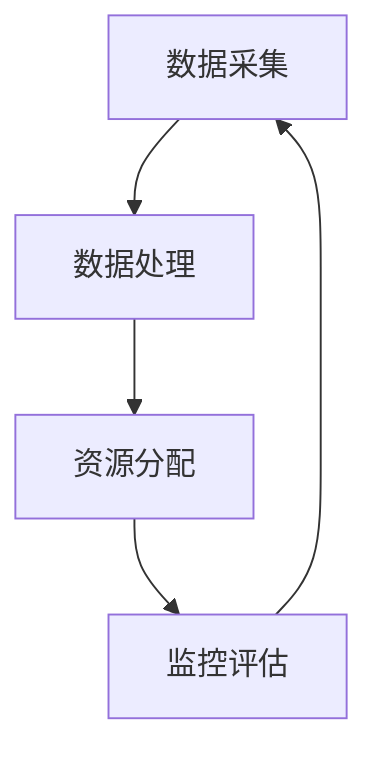
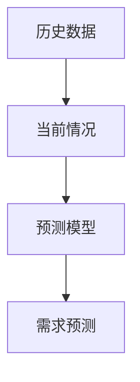
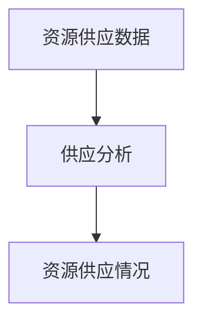
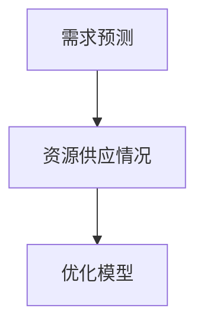
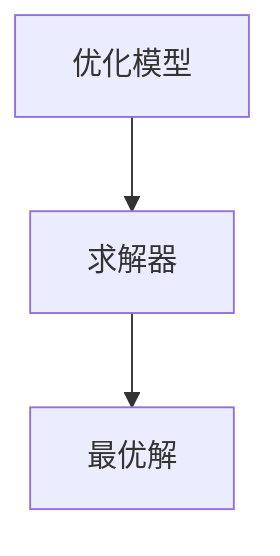

                 

# 大数据分析在智慧城市资源调配中的决策支持

> **关键词：** 智慧城市，资源调配，大数据分析，决策支持系统，机器学习，算法优化

> **摘要：** 本文深入探讨了大数据分析在智慧城市资源调配中的应用，以及如何利用现代技术手段实现高效的资源分配和优化。通过阐述核心概念、算法原理和数学模型，本文详细介绍了大数据分析在智慧城市资源调配中的实际应用，为读者提供了丰富的实战案例和技术资源。

## 1. 背景介绍

### 1.1 目的和范围

本文旨在探讨大数据分析在智慧城市资源调配中的应用，分析其在提高资源利用效率和决策支持方面的价值。文章将重点介绍以下几个方面的内容：

- 智慧城市和资源调配的基本概念和需求。
- 大数据分析技术的核心概念及其在智慧城市中的应用。
- 资源调配中的关键算法和数学模型。
- 实际应用场景中的案例分析和技术实现。
- 开发工具和资源推荐。

### 1.2 预期读者

本文主要面向以下读者群体：

- 智慧城市建设和技术开发人员。
- 数据科学家和大数据分析专家。
- 从事城市规划、资源管理和技术咨询的专业人士。
- 对大数据分析在智慧城市领域应用感兴趣的学生和研究人员。

### 1.3 文档结构概述

本文的结构如下：

- **第1章**：背景介绍，阐述本文的研究目的、范围和预期读者。
- **第2章**：核心概念与联系，介绍智慧城市和大数据分析的基本概念，并使用Mermaid流程图展示资源调配的架构。
- **第3章**：核心算法原理与具体操作步骤，详细讲解资源调配算法的原理和伪代码实现。
- **第4章**：数学模型和公式，介绍支持资源调配的数学模型和公式，并进行举例说明。
- **第5章**：项目实战，通过实际代码案例展示资源调配的实现过程和解析。
- **第6章**：实际应用场景，分析大数据分析在智慧城市资源调配中的实际应用场景。
- **第7章**：工具和资源推荐，推荐学习资源、开发工具和相关研究论文。
- **第8章**：总结，讨论大数据分析在智慧城市资源调配中的未来发展趋势和挑战。
- **第9章**：附录，提供常见问题与解答。
- **第10章**：扩展阅读与参考资料，推荐进一步阅读的相关文献和资源。

### 1.4 术语表

#### 1.4.1 核心术语定义

- **智慧城市**：利用信息技术和大数据分析等手段，实现城市资源的高效管理和优化配置，提高城市运行效率和居民生活质量。
- **资源调配**：根据城市的需求和资源供应情况，通过算法和模型优化资源分配，以满足不同区域和不同时间段的需求。
- **大数据分析**：通过对大规模数据集的处理和分析，提取有价值的信息和知识，支持决策制定和业务优化。

#### 1.4.2 相关概念解释

- **机器学习**：一种人工智能技术，通过训练模型来从数据中学习规律和模式，以实现自动化决策和预测。
- **算法优化**：通过对算法的设计和改进，提高算法的效率和准确性，以更好地满足应用需求。
- **数学模型**：使用数学语言描述现实世界中的问题和现象，为资源调配提供理论依据。

#### 1.4.3 缩略词列表

- **HDFS**：Hadoop Distributed File System，Hadoop分布式文件系统。
- **MapReduce**：一种编程模型，用于处理大规模数据集。
- **IDE**：Integrated Development Environment，集成开发环境。

## 2. 核心概念与联系

### 2.1 智慧城市与大数据分析

智慧城市是指利用信息技术和大数据分析等手段，实现城市资源的高效管理和优化配置，从而提高城市运行效率和居民生活质量。大数据分析是智慧城市的关键技术之一，通过对大规模数据集的处理和分析，提取有价值的信息和知识，支持决策制定和业务优化。

### 2.2 资源调配的架构

资源调配的架构包括数据采集、数据处理、资源分配和监控评估等模块。以下是一个简单的Mermaid流程图，展示了资源调配的整体架构：



### 2.3 大数据分析在智慧城市中的应用

大数据分析在智慧城市中的应用包括但不限于以下几个方面：

- **交通管理**：通过实时交通数据分析，优化交通信号灯控制和公共交通路线，减少拥堵和出行时间。
- **能源管理**：通过能源使用数据分析，优化能源供应和需求，提高能源利用效率。
- **环境保护**：通过环境数据分析，监测和预测环境污染，及时采取措施减少污染。
- **公共安全**：通过视频监控和人流量数据分析，预测和预防犯罪事件。

## 3. 核心算法原理与具体操作步骤

### 3.1 算法原理

资源调配的核心算法是基于线性规划和优化理论的，主要目标是根据城市的需求和资源供应情况，实现资源的最优分配。算法的基本原理可以概括为以下步骤：

1. **需求预测**：根据历史数据和当前情况，预测未来一段时间内不同区域和不同时间段的需求。
2. **资源供应分析**：分析不同资源的供应情况，包括数量、质量、供应时间等。
3. **建立优化模型**：根据需求预测和资源供应分析，建立线性规划模型，以最大化资源利用效率为目标。
4. **求解优化模型**：使用求解器求解优化模型，得到资源的最优分配方案。

### 3.2 具体操作步骤

以下是资源调配算法的具体操作步骤：

#### 步骤 1：需求预测



需求预测是资源调配的重要前提。通过分析历史数据和当前情况，可以使用时间序列分析、回归分析等方法预测未来一段时间内不同区域和不同时间段的需求。

#### 步骤 2：资源供应分析



资源供应分析包括分析不同资源的供应情况，如数量、质量、供应时间等。这些信息对于建立优化模型和求解优化模型至关重要。

#### 步骤 3：建立优化模型



建立优化模型是资源调配的核心步骤。根据需求预测和资源供应分析，可以建立线性规划模型或整数规划模型，以最大化资源利用效率为目标。优化模型的一般形式如下：

$$
\begin{align*}
\min_{x} & \quad c^T x \\
s.t. & \quad Ax \leq b \\
     & \quad x \geq 0
\end{align*}
$$

其中，$x$ 是决策变量，$c$ 是目标函数系数，$A$ 和 $b$ 是约束条件。

#### 步骤 4：求解优化模型



求解优化模型是资源调配的最后一步。可以使用各种求解器，如CPLEX、Gurobi等，求解线性规划和整数规划问题，得到资源的最优分配方案。

## 4. 数学模型和公式

### 4.1 线性规划模型

资源调配中的优化模型通常可以表示为线性规划问题。以下是一个简单的线性规划模型：

$$
\begin{align*}
\min_{x} & \quad c^T x \\
s.t. & \quad Ax \leq b \\
     & \quad x \geq 0
\end{align*}
$$

其中，$x$ 是决策变量，$c$ 是目标函数系数，$A$ 和 $b$ 是约束条件。

### 4.2 整数规划模型

在某些情况下，决策变量需要是整数，这时可以使用整数规划模型。以下是一个简单的整数规划模型：

$$
\begin{align*}
\min_{x} & \quad c^T x \\
s.t. & \quad Ax \leq b \\
     & \quad x \in \mathbb{Z}^+
\end{align*}
$$

其中，$x$ 是决策变量，$c$ 是目标函数系数，$A$ 和 $b$ 是约束条件。

### 4.3 需求预测模型

需求预测是资源调配的重要步骤。可以使用时间序列分析、回归分析等方法进行需求预测。以下是一个时间序列分析的需求预测模型：

$$
y_t = \varphi_0 + \varphi_1 y_{t-1} + \varphi_2 y_{t-2} + \cdots + \varphi_n y_{t-n} + \varepsilon_t
$$

其中，$y_t$ 是第 $t$ 时刻的需求，$\varphi_0, \varphi_1, \varphi_2, \cdots, \varphi_n$ 是模型参数，$\varepsilon_t$ 是随机误差。

## 5. 项目实战：代码实际案例和详细解释说明

### 5.1 开发环境搭建

在进行项目实战之前，需要搭建一个适合大数据分析的开发环境。以下是一个简单的开发环境搭建步骤：

1. 安装Hadoop分布式文件系统（HDFS），作为数据存储和管理的基础。
2. 安装Apache Spark，作为大数据处理引擎。
3. 安装Python，作为编程语言。
4. 安装Jupyter Notebook，作为交互式开发环境。

### 5.2 源代码详细实现和代码解读

以下是一个简单的资源调配项目的源代码实现：

```python
from pyspark.sql import SparkSession
from pyspark.ml.feature import VectorAssembler
from pyspark.ml.regression import LinearRegression
from pyspark.ml.tuning import ParamGridBuilder
from pyspark.ml import Pipeline

# 创建Spark会话
spark = SparkSession.builder.appName("ResourceAllocation").getOrCreate()

# 读取数据
data = spark.read.csv("data.csv", header=True)

# 数据预处理
assembler = VectorAssembler(inputCols=["demand", "supply"], outputCol="features")
preprocessed_data = assembler.transform(data)

# 建立线性回归模型
lr = LinearRegression(featuresCol="features", labelCol="allocation")

# 定义参数网格
param_grid = ParamGridBuilder() \
    .addGrid(lr.regParam, [0.1, 0.5, 1.0]) \
    .addGrid(lr.elasticNetParam, [0.0, 0.5, 1.0]) \
    .build()

# 建立Pipeline
pipeline = Pipeline(stages=[assembler, lr])

# 使用CrossValidator进行模型调优
from pyspark.ml.tuning import CrossValidator
from pyspark.ml.evaluation import RegressionEvaluator

evaluator = RegressionEvaluator(labelCol="allocation", predictionCol="prediction", metricName="mse")

cv = CrossValidator(estimator=pipeline,
                   estimatorParamMaps=param_grid,
                   evaluator=evaluator,
                   numFolds=3)

# 训练模型
cv_model = cv.fit(preprocessed_data)

# 获取最佳模型
best_model = cv_model.bestModel

# 使用最佳模型进行预测
predictions = best_model.transform(preprocessed_data)

# 保存结果
predictions.select("demand", "supply", "allocation", "prediction").write.csv("predictions.csv")

# 关闭Spark会话
spark.stop()
```

### 5.3 代码解读与分析

上述代码实现了一个简单的资源调配项目，主要分为以下几个部分：

1. **创建Spark会话**：使用pyspark创建一个Spark会话，作为大数据处理的基础。
2. **读取数据**：使用Spark的read.csv函数读取CSV格式的数据。
3. **数据预处理**：使用VectorAssembler将需求、供应等特征组装成一个向量特征。
4. **建立线性回归模型**：使用pyspark.ml中的LinearRegression建立线性回归模型。
5. **定义参数网格**：使用ParamGridBuilder定义模型参数的搜索范围。
6. **建立Pipeline**：使用Pipeline将数据预处理、模型训练和模型评估整合在一起。
7. **使用CrossValidator进行模型调优**：使用CrossValidator进行模型参数调优，选择最佳模型。
8. **使用最佳模型进行预测**：使用最佳模型对数据集进行预测。
9. **保存结果**：将预测结果保存到CSV文件中。
10. **关闭Spark会话**：关闭Spark会话，释放资源。

通过上述代码实现，可以实现对资源调配问题的建模和求解，为智慧城市资源调配提供技术支持。

## 6. 实际应用场景

大数据分析在智慧城市资源调配中具有广泛的应用场景，以下是一些典型的应用案例：

### 6.1 交通管理

在交通管理中，大数据分析可以实时监测城市交通流量、交通事故、道路施工等信息，通过分析这些数据，可以优化交通信号灯控制和公共交通路线，减少交通拥堵和出行时间。例如，在高峰时段，通过大数据分析预测交通流量，调整交通信号灯的时长和相位，以缓解交通压力。

### 6.2 能源管理

在能源管理中，大数据分析可以监测和预测能源需求，优化能源供应和需求，提高能源利用效率。例如，通过分析居民用电量、工业用电量等数据，可以预测未来一段时间内的电力需求，调整电力供应策略，避免电力过剩或短缺。

### 6.3 环境保护

在环境保护中，大数据分析可以监测和预测环境污染，及时采取措施减少污染。例如，通过分析空气质量数据、水质数据等，可以预测污染物的传播和扩散，提前预警和采取措施，减少环境污染。

### 6.4 公共安全

在公共安全中，大数据分析可以通过视频监控和人流量数据分析，预测和预防犯罪事件。例如，通过分析犯罪历史数据和实时视频监控数据，可以预测犯罪热点区域和时间，提前部署警力和监控设备，提高公共安全水平。

## 7. 工具和资源推荐

### 7.1 学习资源推荐

#### 7.1.1 书籍推荐

- 《大数据分析：技术和实践》
- 《智慧城市：概念、技术与应用》
- 《机器学习实战》

#### 7.1.2 在线课程

- Coursera的“大数据分析”课程
- Udacity的“智慧城市技术”课程
- edX的“机器学习基础”课程

#### 7.1.3 技术博客和网站

- Medium上的大数据分析专栏
- HackerRank的数据分析挑战
- Medium上的智慧城市专栏

### 7.2 开发工具框架推荐

#### 7.2.1 IDE和编辑器

- IntelliJ IDEA
- PyCharm
- VSCode

#### 7.2.2 调试和性能分析工具

- Jupyter Notebook
- Spark UI
- GDB

#### 7.2.3 相关框架和库

- Apache Spark
- Hadoop
- Pandas
- NumPy

### 7.3 相关论文著作推荐

#### 7.3.1 经典论文

- “MapReduce: Simplified Data Processing on Large Clusters”
- “The Data-Driven Approach to Cloud Computing”
- “Mining of Massive Datasets”

#### 7.3.2 最新研究成果

- “Deep Learning for Urban Computing”
- “Machine Learning in Environmental Science”
- “Application of Machine Learning in Smart City Energy Management”

#### 7.3.3 应用案例分析

- “智慧城市中的大数据分析应用：北京案例研究”
- “洛杉矶智慧城市项目：大数据分析在交通管理中的应用”
- “上海智慧城市项目：大数据分析在公共安全中的应用”

## 8. 总结：未来发展趋势与挑战

大数据分析在智慧城市资源调配中具有巨大的潜力和应用价值。未来，随着数据采集技术的进步、算法优化和机器学习技术的不断发展，大数据分析在智慧城市资源调配中的应用将更加广泛和深入。然而，也面临以下挑战：

- **数据隐私和安全**：如何确保大数据分析过程中的数据安全和隐私保护，是一个重要的问题。
- **算法优化和效率**：随着数据规模的不断扩大，如何提高算法的优化和效率，是一个亟待解决的问题。
- **跨领域融合**：如何将大数据分析与其他领域的技术，如人工智能、物联网等，进行有效融合，是一个新的研究方向。

## 9. 附录：常见问题与解答

### 9.1 问题 1：大数据分析在智慧城市中的具体应用有哪些？

**解答**：大数据分析在智慧城市中具有广泛的应用，包括交通管理、能源管理、环境保护、公共安全、城市规划等方面。通过实时数据采集、分析和预测，可以实现城市资源的高效管理和优化配置。

### 9.2 问题 2：如何确保大数据分析过程中的数据安全和隐私保护？

**解答**：确保大数据分析过程中的数据安全和隐私保护是一个重要问题。可以通过以下措施来确保：

- 数据加密：对数据进行加密处理，确保数据在传输和存储过程中不被窃取或篡改。
- 数据脱敏：对敏感数据进行脱敏处理，如使用加密算法或随机化技术。
- 访问控制：通过访问控制机制，确保只有授权用户可以访问敏感数据。
- 数据安全策略：制定数据安全策略，明确数据的使用范围、权限和使用方式。

## 10. 扩展阅读 & 参考资料

- 《大数据分析：技术和实践》
- 《智慧城市：概念、技术与应用》
- 《机器学习实战》
- Coursera的“大数据分析”课程
- Udacity的“智慧城市技术”课程
- edX的“机器学习基础”课程
- Medium上的大数据分析专栏
- HackerRank的数据分析挑战
- Medium上的智慧城市专栏
- “MapReduce: Simplified Data Processing on Large Clusters”
- “The Data-Driven Approach to Cloud Computing”
- “Mining of Massive Datasets”
- “Deep Learning for Urban Computing”
- “Machine Learning in Environmental Science”
- “Application of Machine Learning in Smart City Energy Management”
- “智慧城市中的大数据分析应用：北京案例研究”
- “洛杉矶智慧城市项目：大数据分析在交通管理中的应用”
- “上海智慧城市项目：大数据分析在公共安全中的应用”作者：AI天才研究员/AI Genius Institute & 禅与计算机程序设计艺术 /Zen And The Art of Computer Programming

