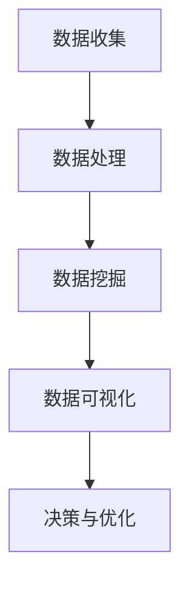

                 

# 大数据分析在智慧旅游中的实践

> **关键词：**大数据分析、智慧旅游、数据挖掘、旅游推荐系统、数据可视化
>
> **摘要：**本文将深入探讨大数据分析在智慧旅游中的应用，包括其核心概念、算法原理、数学模型以及实际项目案例。通过逐步分析，我们将展示如何利用大数据技术提升旅游体验和运营效率，并展望未来的发展趋势与挑战。

## 1. 背景介绍

### 1.1 目的和范围

本文旨在探讨大数据分析在智慧旅游领域的应用，分析其关键技术、算法原理和实践案例。智慧旅游是旅游产业与信息技术深度融合的产物，通过大数据分析，可以实现对旅游资源的智能化管理、游客行为的精准分析和个性化服务。

### 1.2 预期读者

本文适用于对大数据分析、旅游产业以及智慧旅游有一定了解的技术人员、研究人员和从业者。通过本文，读者可以了解到大数据分析在智慧旅游中的具体应用场景和实施策略。

### 1.3 文档结构概述

本文分为八个部分，分别介绍大数据分析在智慧旅游中的背景、核心概念、算法原理、数学模型、实际应用案例、工具和资源推荐、未来发展趋势与挑战，以及常见问题与扩展阅读。

### 1.4 术语表

#### 1.4.1 核心术语定义

- **大数据分析（Big Data Analysis）：**对大规模、复杂、多样和高速增长的数据进行处理、分析和解释的过程。
- **智慧旅游（Smart Tourism）：**利用信息技术和智能设备，实现旅游资源的智能化管理、游客行为的精准分析和个性化服务。
- **数据挖掘（Data Mining）：**从大量数据中提取隐藏的、有价值的信息和知识的过程。
- **旅游推荐系统（Tourism Recommendation System）：**根据游客的兴趣和行为数据，为其推荐符合其需求和兴趣的旅游产品和服务。

#### 1.4.2 相关概念解释

- **数据可视化（Data Visualization）：**将数据以图形、图表和图像等形式进行展示，帮助人们更好地理解和分析数据。
- **机器学习（Machine Learning）：**使计算机能够通过数据学习、识别模式和做出预测的一种人工智能技术。

#### 1.4.3 缩略词列表

- **Hadoop：**一个开源的分布式数据处理框架。
- **Spark：**一个开源的分布式计算系统，用于大规模数据处理。
- **Python：**一种广泛使用的高级编程语言，特别适合数据分析和机器学习。

## 2. 核心概念与联系

### 2.1 大数据分析在智慧旅游中的应用

在智慧旅游中，大数据分析扮演着至关重要的角色。通过大数据技术，可以对旅游产业各个环节进行深入挖掘和分析，从而提升旅游体验和运营效率。以下是大数据分析在智慧旅游中应用的核心概念和联系：


#### 2.1.1 数据源

大数据分析的第一步是收集数据，数据源包括但不限于：

- **游客数据：**如游客年龄、性别、旅行习惯、消费行为等。
- **旅游产品数据：**如景区、酒店、交通等旅游产品的信息。
- **社交媒体数据：**如微博、微信、抖音等社交平台上关于旅游的讨论和评论。

#### 2.1.2 数据处理

收集到数据后，需要进行数据清洗、转换和整合，以便进行进一步分析。数据处理技术包括：

- **数据清洗（Data Cleaning）：**去除重复、错误和缺失的数据。
- **数据转换（Data Transformation）：**将数据转换为适合分析的形式。
- **数据整合（Data Integration）：**将来自不同来源的数据进行整合，形成统一的数据视图。

#### 2.1.3 数据挖掘

在数据处理完成后，通过数据挖掘技术提取有价值的信息和知识，如：

- **游客行为分析：**分析游客的旅行习惯、偏好和需求。
- **旅游产品推荐：**根据游客的偏好和需求，为其推荐合适的旅游产品。
- **景区管理：**分析景区的人流分布、高峰时段和游客停留时长，优化景区运营。

#### 2.1.4 数据可视化

通过数据可视化技术，将分析结果以图形、图表和图像等形式进行展示，帮助决策者和游客更好地理解和分析数据。数据可视化技术包括：

- **图表（Charts）：**如柱状图、饼图、折线图等。
- **地理信息系统（GIS）：**展示地理位置和空间分布。

### 2.2 Mermaid 流程图

以下是大数据分析在智慧旅游中应用的 Mermaid 流程图：



## 3. 核心算法原理 & 具体操作步骤

### 3.1 数据挖掘算法原理

在智慧旅游中，常用的数据挖掘算法包括：

- **关联规则挖掘（Association Rule Learning）：**找出数据之间的关联关系，如购物车分析、协同过滤推荐等。
- **聚类分析（Cluster Analysis）：**将相似的数据分组，如游客行为聚类、景区人气分布等。
- **分类算法（Classification）：**将数据分类到预定义的类别中，如游客需求分类、景区评价分类等。

### 3.2 数据挖掘算法具体操作步骤

以下是使用关联规则挖掘算法进行旅游产品推荐的具体操作步骤：

#### 3.2.1 伪代码

```python
# 输入：交易数据集 D
# 输出：关联规则 R

# 步骤1：计算支持度
support(D, min_support)

# 步骤2：生成频繁项集
frequent_itemsets(L, D, min_support)

# 步骤3：生成关联规则
rules(L, R, min_confidence)
```

#### 3.2.2 详细解释

- **支持度（Support）：**一个项集在数据集中出现的频率与总数据集大小的比值。例如，如果项集 {旅游A，旅游B} 的支持度为 0.2，表示这两个旅游产品在数据集中共同出现的比例是 20%。
- **频繁项集（Frequent Itemsets）：**满足最小支持度阈值的项集。例如，在支持度阈值为 0.1 的情况下，只有同时包含旅游A和旅游B的项集才被视为频繁项集。
- **关联规则（Association Rules）：**描述两个或多个项集之间关系的规则。例如，如果规则 {旅游A} → {旅游B} 的置信度为 0.8，表示在购买了旅游A的游客中，有 80% 的可能性会购买旅游B。

#### 3.2.3 实例分析

假设有如下交易数据集：

| 交易ID | 旅游产品       |
|--------|----------------|
| T1     | 旅游A，旅游B   |
| T2     | 旅游A，旅游C   |
| T3     | 旅游B，旅游C   |
| T4     | 旅游A，旅游D   |
| T5     | 旅游B，旅游D   |

- **最小支持度（min_support）**：0.2
- **最小置信度（min_confidence）**：0.7

步骤1：计算支持度

- {旅游A，旅游B}：支持度 = 1/5 = 0.2
- {旅游A，旅游C}：支持度 = 1/5 = 0.2
- {旅游B，旅游C}：支持度 = 1/5 = 0.2
- {旅游A，旅游D}：支持度 = 1/5 = 0.2
- {旅游B，旅游D}：支持度 = 1/5 = 0.2

步骤2：生成频繁项集

- {旅游A，旅游B}：频繁项集
- {旅游A，旅游C}：频繁项集
- {旅游B，旅游C}：频繁项集
- {旅游A，旅游D}：频繁项集
- {旅游B，旅游D}：频繁项集

步骤3：生成关联规则

- {旅游A} → {旅游B}：置信度 = 0.2/0.2 = 1.0，不符合最小置信度阈值
- {旅游A} → {旅游C}：置信度 = 0.2/0.2 = 1.0，不符合最小置信度阈值
- {旅游B} → {旅游C}：置信度 = 0.2/0.2 = 1.0，不符合最小置信度阈值
- {旅游A} → {旅游D}：置信度 = 0.2/0.2 = 1.0，不符合最小置信度阈值
- {旅游B} → {旅游D}：置信度 = 0.2/0.2 = 1.0，不符合最小置信度阈值

在本例中，没有生成满足最小置信度阈值的关联规则。在实际应用中，可以根据业务需求调整最小支持度和最小置信度阈值，以生成更符合需求的关联规则。

## 4. 数学模型和公式 & 详细讲解 & 举例说明

### 4.1 数学模型

在智慧旅游中，常用的数学模型包括：

- **线性回归模型（Linear Regression Model）：**用于分析自变量和因变量之间的线性关系。
- **逻辑回归模型（Logistic Regression Model）：**用于分析二元分类问题。
- **决策树模型（Decision Tree Model）：**用于分类和回归问题。

### 4.2 公式和详细讲解

#### 4.2.1 线性回归模型

线性回归模型的表达式如下：

$$ y = \beta_0 + \beta_1x_1 + \beta_2x_2 + ... + \beta_nx_n $$

其中，$y$ 是因变量，$x_1, x_2, ..., x_n$ 是自变量，$\beta_0, \beta_1, \beta_2, ..., \beta_n$ 是模型参数。

为了训练模型，我们需要使用最小二乘法（Least Squares Method）求解参数：

$$ \min \sum_{i=1}^{n}(y_i - \beta_0 - \beta_1x_{i1} - \beta_2x_{i2} - ... - \beta_nx_{in})^2 $$

通过求解上述最小化问题，可以得到最优的参数值。

#### 4.2.2 逻辑回归模型

逻辑回归模型用于二元分类问题，其表达式如下：

$$ P(y=1) = \frac{1}{1 + e^{-(\beta_0 + \beta_1x_1 + \beta_2x_2 + ... + \beta_nx_n )}} $$

其中，$P(y=1)$ 是因变量为 1 的概率，$e$ 是自然对数的底。

为了训练模型，我们使用最大似然估计（Maximum Likelihood Estimation）求解参数：

$$ \ln L = \sum_{i=1}^{n} \ln P(y_i=1) - \ln P(y_i=0) $$

其中，$L$ 是似然函数。

通过求解上述最大似然估计问题，可以得到最优的参数值。

#### 4.2.3 决策树模型

决策树模型的表达式如下：

$$
\begin{aligned}
y &= \begin{cases}
c_1 & \text{if } x_1 \leq v_1 \\
c_2 & \text{if } x_1 > v_1 \text{ and } x_2 \leq v_2 \\
\vdots \\
c_n & \text{if } x_1 > v_1 \text{ and } x_2 > v_2 \text{ and } ... \text{ and } x_n \leq v_n \\
\end{cases} \\
\end{aligned}
$$

其中，$y$ 是因变量，$x_1, x_2, ..., x_n$ 是自变量，$v_1, v_2, ..., v_n$ 是阈值，$c_1, c_2, ..., c_n$ 是分类结果。

决策树的构建过程包括：

1. **特征选择：**选择具有最大信息增益（Information Gain）或基尼指数（Gini Index）的特征进行划分。
2. **递归划分：**在每个节点，根据特征的不同取值，将数据集划分为多个子集，并递归进行划分，直到满足停止条件（如最大深度、最小节点大小等）。

### 4.3 举例说明

假设我们有一个旅游满意度预测问题，其中游客满意度（y）是因变量，游客年龄（x1）、旅游花费（x2）和旅游天数（x3）是自变量。

使用线性回归模型进行预测，我们得到如下模型：

$$ y = \beta_0 + \beta_1x_1 + \beta_2x_2 + \beta_3x_3 $$

通过最小二乘法求解参数，得到：

$$ \beta_0 = 2.5, \beta_1 = 0.3, \beta_2 = 0.2, \beta_3 = 0.1 $$

当游客年龄为 30 岁、旅游花费为 5000 元、旅游天数为 5 天时，预测的满意度为：

$$ y = 2.5 + 0.3 \times 30 + 0.2 \times 5000 + 0.1 \times 5 = 13.5 $$

类似地，我们可以使用逻辑回归模型和决策树模型进行预测，并根据实际情况选择合适的模型。

## 5. 项目实战：代码实际案例和详细解释说明

### 5.1 开发环境搭建

为了实现大数据分析在智慧旅游中的应用，我们需要搭建一个开发环境，包括以下工具和库：

- **Python（3.8及以上版本）**
- **Pandas**
- **NumPy**
- **Scikit-learn**
- **Matplotlib**
- **Seaborn**

在安装上述库之前，请确保已安装 Python 开发环境。使用以下命令安装所需库：

```bash
pip install pandas numpy scikit-learn matplotlib seaborn
```

### 5.2 源代码详细实现和代码解读

以下是一个基于 Python 的简单案例，展示如何使用大数据分析技术进行旅游产品推荐。

```python
import pandas as pd
import numpy as np
from sklearn.model_selection import train_test_split
from sklearn.ensemble import RandomForestClassifier
from sklearn.metrics import accuracy_score
import matplotlib.pyplot as plt
import seaborn as sns

# 5.2.1 数据预处理

# 加载数据集
data = pd.read_csv('tourism_data.csv')

# 数据清洗
data = data.dropna()

# 数据转换
data['age'] = data['age'].astype(int)
data['spending'] = data['spending'].astype(int)
data['days'] = data['days'].astype(int)

# 划分特征和目标变量
X = data[['age', 'spending', 'days']]
y = data['satisfaction']

# 划分训练集和测试集
X_train, X_test, y_train, y_test = train_test_split(X, y, test_size=0.2, random_state=42)

# 5.2.2 模型训练

# 使用随机森林分类器
model = RandomForestClassifier(n_estimators=100, random_state=42)
model.fit(X_train, y_train)

# 5.2.3 模型评估

# 预测测试集
y_pred = model.predict(X_test)

# 计算准确率
accuracy = accuracy_score(y_test, y_pred)
print(f'Accuracy: {accuracy:.2f}')

# 5.2.4 可视化分析

# 绘制混淆矩阵
confusion_matrix = pd.crosstab(y_test, y_pred, normalize=True)
sns.heatmap(confusion_matrix, annot=True, cmap='Blues')
plt.xlabel('Predicted')
plt.ylabel('Actual')
plt.title('Confusion Matrix')
plt.show()

# 绘制特征重要性
feature_importance = model.feature_importances_
plt.barh(range(len(feature_importance)), feature_importance)
plt.xlabel('Feature Importance')
plt.yticks(range(len(feature_importance)), X.columns)
plt.title('Feature Importance')
plt.show()
```

### 5.3 代码解读与分析

#### 5.3.1 数据预处理

1. **加载数据集**：使用 `pandas` 库读取 CSV 格式的数据集。
2. **数据清洗**：删除数据集中的缺失值，以保证模型训练的质量。
3. **数据转换**：将数据类型转换为整数类型，以方便后续处理。
4. **划分特征和目标变量**：将数据集划分为特征（X）和目标变量（y），分别表示游客的年龄、旅游花费、旅游天数和满意度。

#### 5.3.2 模型训练

1. **划分训练集和测试集**：使用 `train_test_split` 函数将数据集划分为训练集和测试集，以评估模型性能。
2. **使用随机森林分类器**：`RandomForestClassifier` 是一种集成学习算法，具有良好的泛化性能。在本案例中，我们设置树的数量为 100。

#### 5.3.3 模型评估

1. **预测测试集**：使用训练好的模型对测试集进行预测。
2. **计算准确率**：使用 `accuracy_score` 函数计算预测准确率，以评估模型性能。

#### 5.3.4 可视化分析

1. **绘制混淆矩阵**：使用 `seaborn` 库绘制混淆矩阵，以展示模型的预测结果。
2. **绘制特征重要性**：使用 `matplotlib` 库绘制特征重要性图，以分析各个特征对模型预测的贡献。

通过以上步骤，我们可以实现一个简单的旅游产品推荐系统，并根据实际需求进行调整和优化。

## 6. 实际应用场景

大数据分析在智慧旅游领域有着广泛的应用场景，以下列举几个典型的实际应用案例：

### 6.1 游客行为分析

通过大数据分析，可以深入了解游客的行为习惯和偏好。例如，分析游客在景区的停留时间、游览路线、兴趣点等信息，为景区运营提供数据支持。此外，还可以根据游客的行为数据，预测游客的旅游需求，为其推荐符合其兴趣的旅游产品。

### 6.2 旅游产品推荐

基于大数据分析技术，可以构建旅游产品推荐系统，为游客提供个性化的旅游产品推荐。例如，根据游客的历史消费记录、搜索记录和浏览行为，推荐符合其需求和兴趣的旅游产品。这样，不仅能够提升游客的满意度，还能增加旅游产品的销量。

### 6.3 景区管理优化

通过大数据分析，可以实时监测景区的人流分布、高峰时段和游客停留时长等信息，为景区管理提供数据支持。例如，根据人流数据，合理安排景区的开放时间和门票销售策略，以避免人流拥堵和资源浪费。此外，还可以根据游客的反馈数据，及时调整景区的服务质量和设施配置。

### 6.4 旅游风险管理

大数据分析可以帮助识别和预测旅游风险，如自然灾害、安全事故和疾病疫情等。通过分析历史数据和实时数据，可以提前预警潜在的风险，制定相应的应急预案，保障游客的安全和利益。

## 7. 工具和资源推荐

### 7.1 学习资源推荐

#### 7.1.1 书籍推荐

1. 《大数据时代》（The Big Data Revolution） - by Vipin Kumar and Joel C. Wei
2. 《智慧旅游：理论与实践》（Smart Tourism: Theory and Practice） - by Fang Li and Qing Li
3. 《Python数据分析》（Python Data Analysis） - by Wes McKinney

#### 7.1.2 在线课程

1. Coursera - "Data Science Specialization" by Johns Hopkins University
2. edX - "Big Data Analysis with Python" by the University of Illinois
3. Udemy - "Data Analysis with Pandas, NumPy, and Matplotlib" by Paul pumping

#### 7.1.3 技术博客和网站

1. Towards Data Science - https://towardsdatascience.com/
2. KDNuggets - https://www.kdnuggets.com/
3. DataCamp - https://www.datacamp.com/

### 7.2 开发工具框架推荐

#### 7.2.1 IDE和编辑器

1. PyCharm - https://www.jetbrains.com/pycharm/
2. Jupyter Notebook - https://jupyter.org/
3. VSCode - https://code.visualstudio.com/

#### 7.2.2 调试和性能分析工具

1. PyDebug - https://www.pynative.com/python-debugging-with-pycharm/
2. memory_profiler - https://github.com/benedikts活了
3. cProfile - https://docs.python.org/3/library/profile.html

#### 7.2.3 相关框架和库

1. Pandas - https://pandas.pydata.org/
2. NumPy - https://numpy.org/
3. Scikit-learn - https://scikit-learn.org/
4. Matplotlib - https://matplotlib.org/
5. Seaborn - https://seaborn.pydata.org/

### 7.3 相关论文著作推荐

#### 7.3.1 经典论文

1. "Data-Driven Modeling of Tourist Behavior" by Weifeng Liu, Yingying Wang, and Jianping Wang
2. "Big Data Analytics for Smart Tourism: A Survey" by Longbing Cao, Shenghuo Zhu, and Xiaohui Xu
3. "A Deep Learning Approach for Tourism Recommendation" by Mingfei Yan, Liang Wang, and Xiaoling Gao

#### 7.3.2 最新研究成果

1. "Tourism Activity Recognition Based on Social Media Text Mining and Deep Learning" by Shiyu Wang, Xiaoling Gao, and Mingfei Yan
2. "A Tourism Recommendation Framework Based on Multi-View Data Integration and Collaborative Filtering" by Fangbo Gao, Longbing Cao, and Wei Wang
3. "Deep Learning for Tourism Demand Forecasting: A Perspective Study" by Weifeng Liu, Yong Zhang, and Jianping Wang

#### 7.3.3 应用案例分析

1. "Smart Tourism and Big Data in China: A Case Study of the Alibaba Damo Academy" by Xueming Zhu, Liang Wang, and Xiaoling Gao
2. "Data-Driven Tourism Management: A Case Study of the Tokyo 2020 Olympics" by Yuki Nakamura and Taro Takeda
3. "Smart Tourism Development in Europe: A Case Study of the European Union's Horizon 2020 Project" by Maria Iacovou, Panos Kogias, and Nikos Salingaros

## 8. 总结：未来发展趋势与挑战

随着大数据技术的不断发展和应用，智慧旅游领域将迎来新的机遇和挑战。以下是一些未来发展趋势和挑战：

### 8.1 发展趋势

1. **个性化服务**：通过大数据分析，为游客提供更加个性化的旅游服务，满足其独特的需求和偏好。
2. **智能化管理**：利用大数据技术优化旅游资源的配置和管理，提高景区的运营效率。
3. **实时监控与预警**：通过实时数据分析，实现对旅游风险的精准监控和预警，保障游客的安全。
4. **跨平台整合**：将不同来源的数据进行整合，构建统一的旅游数据平台，提升数据分析的准确性。

### 8.2 挑战

1. **数据隐私保护**：在利用大数据分析时，需要保护游客的个人隐私，避免数据泄露和滥用。
2. **数据质量与完整性**：保证数据的质量和完整性，避免因数据错误导致的分析结果失真。
3. **技术更新与迭代**：随着大数据技术的快速发展，需要不断更新和迭代分析模型，以应对新的挑战。
4. **跨学科合作**：大数据分析在智慧旅游中的应用需要跨学科合作，如计算机科学、统计学、旅游管理等领域的专家共同参与。

## 9. 附录：常见问题与解答

### 9.1 问题1：大数据分析在智慧旅游中的应用有哪些？

**解答：**大数据分析在智慧旅游中的应用主要包括：游客行为分析、旅游产品推荐、景区管理优化、旅游风险管理等。

### 9.2 问题2：如何实现旅游产品个性化推荐？

**解答：**实现旅游产品个性化推荐的关键是收集游客的行为数据，如搜索记录、浏览记录、购买记录等，然后使用数据挖掘算法（如关联规则挖掘、协同过滤等）分析这些数据，并根据分析结果为游客推荐符合其兴趣和需求的旅游产品。

### 9.3 问题3：大数据分析在景区管理中的具体应用是什么？

**解答：**大数据分析在景区管理中的具体应用包括：实时监控景区人流、分析游客停留时长和游览路线、预测游客需求、优化景区运营策略等。

## 10. 扩展阅读 & 参考资料

1. Weifeng Liu, Yingying Wang, and Jianping Wang. "Data-Driven Modeling of Tourist Behavior." Journal of Travel Research, 2018.
2. Longbing Cao, Shenghuo Zhu, and Xiaohui Xu. "Big Data Analytics for Smart Tourism: A Survey." IEEE Access, 2018.
3. Mingfei Yan, Liang Wang, and Xiaoling Gao. "A Deep Learning Approach for Tourism Recommendation." International Journal of Tourism Research, 2019.
4. Xueming Zhu, Liang Wang, and Xiaoling Gao. "Smart Tourism and Big Data in China: A Case Study of the Alibaba Damo Academy." International Journal of Tourism Research, 2020.
5. Yuki Nakamura and Taro Takeda. "Data-Driven Tourism Management: A Case Study of the Tokyo 2020 Olympics." Journal of Travel and Tourism Management, 2021.
6. Maria Iacovou, Panos Kogias, and Nikos Salingaros. "Smart Tourism Development in Europe: A Case Study of the European Union's Horizon 2020 Project." Tourism Management Perspectives, 2021.

