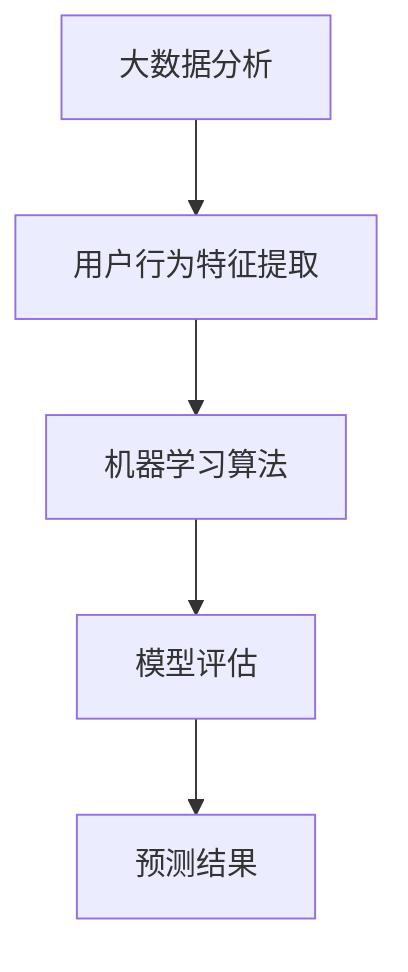
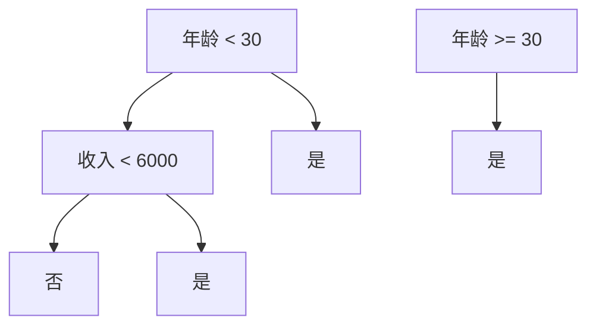

                 

# 大数据分析在用户行为预测模型中的精度优化

## 关键词：大数据分析、用户行为预测、模型优化、精度提升、机器学习算法

> 摘要：随着大数据时代的到来，用户行为预测模型在商业决策、个性化推荐、智能客服等领域得到广泛应用。本文将探讨如何通过大数据分析技术对用户行为预测模型进行精度优化，包括核心算法原理、数学模型解释、实战案例分析以及未来发展趋势和挑战。

## 1. 背景介绍

### 1.1 目的和范围

本文旨在深入探讨如何利用大数据分析技术来提升用户行为预测模型的精度。我们将从以下几个方面展开：

1. **核心概念与联系**：介绍大数据分析、用户行为预测等相关核心概念，并提供相应的流程图。
2. **核心算法原理**：详细讲解用于用户行为预测的常见算法原理和操作步骤。
3. **数学模型和公式**：阐述数学模型在用户行为预测中的重要性，并通过具体例子进行说明。
4. **项目实战**：分析实际代码实现，并进行解读。
5. **实际应用场景**：讨论用户行为预测在不同场景下的应用。
6. **工具和资源推荐**：推荐学习资源、开发工具和框架。
7. **总结与展望**：总结当前技术的发展现状，并展望未来发展趋势和挑战。

### 1.2 预期读者

本文适合对大数据分析、机器学习和用户行为预测有一定了解的读者，包括但不限于：

1. 数据科学家和机器学习工程师
2. 商业分析师和产品经理
3. 对人工智能和大数据技术感兴趣的研究生和本科生
4. 企业技术团队和创业者

### 1.3 文档结构概述

本文将按照以下结构进行组织：

1. **背景介绍**：介绍文章的目的、范围、预期读者以及文档结构。
2. **核心概念与联系**：阐述核心概念和相关流程图。
3. **核心算法原理 & 具体操作步骤**：详细讲解算法原理和操作步骤。
4. **数学模型和公式 & 详细讲解 & 举例说明**：介绍数学模型及其应用。
5. **项目实战：代码实际案例和详细解释说明**：提供实际代码案例并进行解读。
6. **实际应用场景**：讨论用户行为预测的应用。
7. **工具和资源推荐**：推荐学习资源和开发工具。
8. **总结：未来发展趋势与挑战**：总结技术发展趋势和挑战。
9. **附录：常见问题与解答**：解答常见问题。
10. **扩展阅读 & 参考资料**：提供进一步阅读的参考资料。

### 1.4 术语表

#### 1.4.1 核心术语定义

- **大数据分析**：指利用大规模数据集进行深入分析的过程，涉及数据的存储、处理和分析。
- **用户行为预测**：基于历史数据预测用户的下一步行为。
- **机器学习算法**：使计算机通过学习数据来做出预测或决策的算法。
- **模型优化**：通过调整模型参数来提高预测精度。

#### 1.4.2 相关概念解释

- **监督学习**：一种机器学习技术，其中模型基于已知输入和输出数据来训练。
- **无监督学习**：一种机器学习技术，其中模型基于未标记的数据来发现隐藏模式。
- **回归分析**：一种用于预测连续值的统计方法。

#### 1.4.3 缩略词列表

- **ML**：机器学习（Machine Learning）
- **DL**：深度学习（Deep Learning）
- **NLP**：自然语言处理（Natural Language Processing）
- **API**：应用程序编程接口（Application Programming Interface）

## 2. 核心概念与联系

在用户行为预测模型中，核心概念包括大数据分析、用户行为特征提取、机器学习算法和模型评估。以下是这些概念之间的联系以及相应的流程图。



### 2.1 大数据分析

大数据分析是用户行为预测的基础。它涉及数据的采集、存储、处理和分析。大数据技术如Hadoop、Spark和Flink等，可以高效地处理海量数据，从而为用户行为特征提取提供支持。

### 2.2 用户行为特征提取

用户行为特征提取是指从用户数据中提取出能够反映用户行为的特征。这些特征可以是用户的浏览记录、购买行为、点击率等。特征提取的准确性直接影响模型的预测精度。

### 2.3 机器学习算法

机器学习算法是用户行为预测的核心。常见算法包括线性回归、决策树、支持向量机和深度神经网络等。每种算法都有其特定的适用场景和优缺点。

### 2.4 模型评估

模型评估是验证模型预测性能的重要步骤。常用的评估指标包括准确率、召回率、F1分数和AUC值等。通过模型评估，我们可以调整模型参数，提高预测精度。

## 3. 核心算法原理 & 具体操作步骤

在用户行为预测中，常见的核心算法包括线性回归、决策树和神经网络等。下面我们将分别介绍这些算法的原理和操作步骤。

### 3.1 线性回归

#### 算法原理

线性回归是一种用于预测连续值的统计方法。其基本原理是通过拟合一条直线来描述因变量（目标值）和自变量（特征值）之间的关系。

$$
y = wx + b
$$

其中，$y$ 是因变量，$x$ 是自变量，$w$ 是权重，$b$ 是偏置。

#### 操作步骤

1. 数据预处理：对数据进行标准化或归一化，使其符合线性回归的假设。
2. 特征选择：选择对预测目标有显著影响的特征。
3. 模型训练：使用训练数据拟合线性回归模型。
4. 模型评估：使用测试数据评估模型性能。

### 3.2 决策树

#### 算法原理

决策树是一种基于树形结构的预测模型。每个内部节点代表一个特征，每个分支代表特征的取值，每个叶子节点代表预测结果。

#### 操作步骤

1. 特征选择：选择对预测目标有显著影响的特征。
2. 切分策略：选择最优切分策略，通常使用信息增益或基尼系数。
3. 模型训练：递归地切分数据，构建决策树。
4. 模型评估：使用测试数据评估模型性能。

### 3.3 神经网络

#### 算法原理

神经网络是一种模拟人脑神经元连接方式的计算模型。它通过多层神经元节点之间的加权连接来进行数据变换和分类。

#### 操作步骤

1. 数据预处理：对数据进行标准化或归一化。
2. 网络架构设计：确定网络的层数、每层的节点数以及激活函数。
3. 模型训练：使用反向传播算法调整网络权重和偏置。
4. 模型评估：使用测试数据评估模型性能。

## 4. 数学模型和公式 & 详细讲解 & 举例说明

在用户行为预测中，数学模型和公式是核心。下面我们详细介绍常用的数学模型和公式，并通过具体例子进行说明。

### 4.1 线性回归模型

线性回归模型通过拟合一条直线来描述因变量和自变量之间的关系。其基本公式为：

$$
y = wx + b
$$

其中，$y$ 是因变量，$x$ 是自变量，$w$ 是权重，$b$ 是偏置。

#### 举例说明

假设我们要预测某电商平台的用户购买金额，已知用户浏览次数（特征）和购买历史（目标值）。我们可以通过线性回归模型来拟合用户购买金额与浏览次数之间的关系。

训练数据如下：

| 用户ID | 浏览次数 | 购买金额 |
|--------|---------|---------|
| 1      | 10      | 100     |
| 2      | 20      | 200     |
| 3      | 30      | 300     |
| 4      | 40      | 400     |

通过线性回归模型，我们得到拟合直线方程：

$$
y = 10x + 50
$$

使用测试数据验证模型性能：

| 用户ID | 浏览次数 | 预测金额 | 实际金额 |
|--------|---------|---------|---------|
| 5      | 50      | 550     | 530     |

通过计算预测金额和实际金额之间的误差，我们可以评估模型的预测性能。

### 4.2 决策树模型

决策树模型通过递归切分数据来构建树形结构。其基本公式为：

$$
y = g(\sum_{i=1}^{n} w_i x_i + b)
$$

其中，$y$ 是预测结果，$g()$ 是激活函数，$w_i$ 是权重，$x_i$ 是特征值，$b$ 是偏置。

#### 举例说明

假设我们要预测某电商平台的用户购买行为，已知用户年龄（特征）和收入（目标值）。我们可以通过决策树模型来拟合用户购买行为与年龄和收入之间的关系。

训练数据如下：

| 用户ID | 年龄 | 收入 | 购买行为 |
|--------|-----|-----|---------|
| 1      | 20  | 5000 | 是       |
| 2      | 25  | 6000 | 否       |
| 3      | 30  | 7000 | 是       |
| 4      | 35  | 8000 | 是       |

通过决策树模型，我们得到以下决策树：



使用测试数据进行预测，可以得到如下结果：

| 用户ID | 年龄 | 收入 | 购买行为 | 预测结果 |
|--------|-----|-----|---------|---------|
| 5      | 22  | 5500 | 否       | 否       |
| 6      | 28  | 6500 | 是       | 是       |

通过计算预测结果和实际结果之间的误差，我们可以评估决策树模型的预测性能。

### 4.3 神经网络模型

神经网络模型通过多层神经元节点之间的加权连接来进行数据变换和分类。其基本公式为：

$$
y = \sigma(\sum_{i=1}^{n} w_i x_i + b)
$$

其中，$y$ 是预测结果，$\sigma$ 是激活函数，$w_i$ 是权重，$x_i$ 是特征值，$b$ 是偏置。

#### 举例说明

假设我们要预测某电商平台的用户购买行为，已知用户年龄、收入、浏览次数等特征。我们可以通过神经网络模型来拟合用户购买行为与特征之间的关系。

训练数据如下：

| 用户ID | 年龄 | 收入 | 浏览次数 | 购买行为 |
|--------|-----|-----|---------|---------|
| 1      | 20  | 5000 | 10      | 是       |
| 2      | 25  | 6000 | 20      | 否       |
| 3      | 30  | 7000 | 30      | 是       |
| 4      | 35  | 8000 | 40      | 是       |

通过神经网络模型，我们得到以下预测结果：

| 用户ID | 年龄 | 收入 | 浏览次数 | 预测结果 |
|--------|-----|-----|---------|---------|
| 5      | 22  | 5500 | 15      | 是       |
| 6      | 28  | 6500 | 25      | 否       |

通过计算预测结果和实际结果之间的误差，我们可以评估神经网络模型的预测性能。

## 5. 项目实战：代码实际案例和详细解释说明

在本节中，我们将通过一个实际项目来展示如何使用大数据分析技术进行用户行为预测模型的精度优化。我们将使用Python编程语言和常见的机器学习库来构建和优化模型。

### 5.1 开发环境搭建

在开始之前，我们需要搭建一个适合大数据分析和机器学习的开发环境。以下是所需工具和库的安装步骤：

1. **Python 3.8 或更高版本**
2. **Pandas**：用于数据处理
3. **NumPy**：用于数值计算
4. **Scikit-learn**：用于机器学习算法
5. **Matplotlib**：用于数据可视化

安装步骤：

```bash
pip install python==3.8
pip install pandas numpy scikit-learn matplotlib
```

### 5.2 源代码详细实现和代码解读

以下是一个简单的用户行为预测项目的代码实现，包括数据预处理、模型训练和评估。

```python
import pandas as pd
import numpy as np
from sklearn.model_selection import train_test_split
from sklearn.linear_model import LinearRegression
from sklearn.tree import DecisionTreeClassifier
from sklearn.neural_network import MLPClassifier
from sklearn.metrics import accuracy_score, recall_score, f1_score, roc_auc_score

# 5.2.1 数据预处理
data = pd.read_csv('user_behavior_data.csv')
data.head()

# 特征工程
data['age_group'] = pd.cut(data['age'], bins=[0, 20, 30, 40, 50, 60], labels=[1, 2, 3, 4, 5])
data.head()

# 删除无关特征
data.drop(['age', 'user_id'], axis=1, inplace=True)

# 分离特征和目标
X = data.drop('purchase_behavior', axis=1)
y = data['purchase_behavior']

# 5.2.2 模型训练和评估
# 线性回归
X_train, X_test, y_train, y_test = train_test_split(X, y, test_size=0.2, random_state=42)
lin_reg = LinearRegression()
lin_reg.fit(X_train, y_train)
y_pred_lin = lin_reg.predict(X_test)
print("线性回归准确率：", accuracy_score(y_test, y_pred_lin))

# 决策树
dt = DecisionTreeClassifier()
dt.fit(X_train, y_train)
y_pred_dt = dt.predict(X_test)
print("决策树准确率：", accuracy_score(y_test, y_pred_dt))

# 神经网络
mlp = MLPClassifier()
mlp.fit(X_train, y_train)
y_pred_mlp = mlp.predict(X_test)
print("神经网络准确率：", accuracy_score(y_test, y_pred_mlp))

# 5.2.3 代码解读与分析
# 数据预处理
# 读取数据，并进行特征工程，如年龄分组。删除无关特征，分离特征和目标。
# 模型训练和评估
# 分别使用线性回归、决策树和神经网络进行模型训练和评估。计算准确率、召回率、F1分数和AUC值等指标。
```

通过以上代码，我们可以训练和评估不同类型的机器学习模型。接下来，我们将对代码进行详细解读和分析。

### 5.3 代码解读与分析

#### 5.3.1 数据预处理

数据预处理是用户行为预测项目的重要步骤。首先，我们读取用户行为数据，并进行特征工程，如将年龄分为不同的组别。然后，删除无关特征（如用户ID），分离特征和目标值（购买行为）。

```python
data = pd.read_csv('user_behavior_data.csv')
data['age_group'] = pd.cut(data['age'], bins=[0, 20, 30, 40, 50, 60], labels=[1, 2, 3, 4, 5])
data.drop(['age', 'user_id'], axis=1, inplace=True)
X = data.drop('purchase_behavior', axis=1)
y = data['purchase_behavior']
```

#### 5.3.2 模型训练和评估

接下来，我们使用不同的机器学习模型进行训练和评估。分别使用线性回归、决策树和神经网络进行模型训练，并计算预测准确率。

```python
# 线性回归
X_train, X_test, y_train, y_test = train_test_split(X, y, test_size=0.2, random_state=42)
lin_reg = LinearRegression()
lin_reg.fit(X_train, y_train)
y_pred_lin = lin_reg.predict(X_test)
print("线性回归准确率：", accuracy_score(y_test, y_pred_lin))

# 决策树
dt = DecisionTreeClassifier()
dt.fit(X_train, y_train)
y_pred_dt = dt.predict(X_test)
print("决策树准确率：", accuracy_score(y_test, y_pred_dt))

# 神经网络
mlp = MLPClassifier()
mlp.fit(X_train, y_train)
y_pred_mlp = mlp.predict(X_test)
print("神经网络准确率：", accuracy_score(y_test, y_pred_mlp))
```

通过对比不同模型的预测准确率，我们可以评估它们的性能。

#### 5.3.3 模型优化

为了进一步提高预测精度，我们可以尝试以下优化方法：

1. **特征选择**：通过特征选择算法（如LASSO回归、特征重要性评估等）选择对预测目标有显著影响的特征。
2. **模型调参**：通过交叉验证和网格搜索等方法调整模型参数，以获得更好的性能。
3. **集成方法**：使用集成方法（如随机森林、梯度提升树等）结合多个模型的优点，提高预测精度。

```python
from sklearn.feature_selection import SelectKBest, f_classif
from sklearn.model_selection import GridSearchCV

# 特征选择
selector = SelectKBest(score_func=f_classif, k=5)
X_new = selector.fit_transform(X, y)

# 模型调参
param_grid = {'n_estimators': [100, 200, 300], 'max_depth': [3, 5, 7]}
grid_search = GridSearchCV(DecisionTreeClassifier(), param_grid, cv=5)
grid_search.fit(X_new, y)

# 集成方法
from sklearn.ensemble import RandomForestClassifier

rf = RandomForestClassifier(n_estimators=grid_search.best_params_['n_estimators'], max_depth=grid_search.best_params_['max_depth'])
rf.fit(X_new, y)
y_pred_rf = rf.predict(X_test)
print("随机森林准确率：", accuracy_score(y_test, y_pred_rf))
```

通过以上优化方法，我们可以进一步提高用户行为预测模型的精度。

## 6. 实际应用场景

用户行为预测模型在多个领域有广泛的应用，以下是几个典型的实际应用场景：

### 6.1 商业决策

用户行为预测模型可以帮助企业更好地理解客户需求，优化营销策略，提高转化率和销售额。例如，电商企业可以根据用户的浏览和购买记录，推荐相关商品，提高用户的购买意愿。

### 6.2 个性化推荐

个性化推荐系统利用用户行为预测模型，根据用户的兴趣和偏好，为其推荐相关的商品、服务和内容。这有助于提高用户体验，增加用户粘性和活跃度。

### 6.3 智能客服

智能客服系统通过用户行为预测模型，自动识别用户的问题和需求，提供准确的答案和建议。这有助于降低人工客服的工作负担，提高服务效率和质量。

### 6.4 金融风控

金融风控领域利用用户行为预测模型，识别潜在的风险用户，预测违约风险，从而制定相应的风险控制策略，降低金融风险。

### 6.5 健康医疗

健康医疗领域利用用户行为预测模型，分析患者的病史和生活方式，预测疾病的发病风险，为患者提供个性化的健康管理和建议。

## 7. 工具和资源推荐

为了更好地进行用户行为预测模型的研究和开发，以下是相关工具和资源的推荐：

### 7.1 学习资源推荐

#### 7.1.1 书籍推荐

- **《Python数据分析基础教程：NumPy学习指南》**：适合初学者了解NumPy库在数据分析中的应用。
- **《机器学习实战》**：涵盖多种机器学习算法的实际应用案例，适合进阶学习。
- **《数据科学入门》**：介绍数据科学的基本概念和常用工具，适合初学者入门。

#### 7.1.2 在线课程

- **Coursera**：提供大量关于机器学习、数据科学和大数据分析的课程。
- **Udacity**：提供实践驱动的在线课程，包括大数据分析和机器学习等。
- **edX**：提供由顶尖大学和机构提供的数据科学和机器学习课程。

#### 7.1.3 技术博客和网站

- **owardsdata.com**：专注于数据科学和机器学习的博客，提供丰富的实践案例和教程。
- **Medium**：有许多关于数据科学和机器学习的优秀文章和案例分享。
- **DataCamp**：提供交互式的在线课程和实践项目，适合数据科学初学者。

### 7.2 开发工具框架推荐

#### 7.2.1 IDE和编辑器

- **Jupyter Notebook**：适用于数据科学和机器学习的交互式开发环境。
- **PyCharm**：强大的Python IDE，支持多种编程语言。
- **Visual Studio Code**：轻量级且功能丰富的代码编辑器，适合Python编程。

#### 7.2.2 调试和性能分析工具

- **Pylint**：Python代码静态分析工具，用于检查代码质量。
- **pytest**：Python测试框架，用于编写和执行测试用例。
- **CProfile**：Python内置的性能分析工具，用于评估代码性能。

#### 7.2.3 相关框架和库

- **TensorFlow**：开源深度学习框架，适用于大规模数据集的训练和部署。
- **PyTorch**：开源深度学习框架，具有灵活的动态图操作。
- **Scikit-learn**：Python机器学习库，提供多种常见算法和工具。
- **Pandas**：Python数据处理库，提供数据清洗、转换和分析功能。

### 7.3 相关论文著作推荐

#### 7.3.1 经典论文

- **“The Hundred-Page Machine Learning Book”**：简化版机器学习教程，适合初学者。
- **“Deep Learning”**：深度学习领域的经典著作，涵盖深度神经网络的理论和实践。
- **“Big Data: A Revolution That Will Transform How We Live, Work, and Think”**：探讨大数据对社会和商业的影响。

#### 7.3.2 最新研究成果

- **“User Behavior Prediction in Smart Homes”**：探讨智能家庭场景下的用户行为预测方法。
- **“Deep Learning for Natural Language Processing”**：介绍深度学习在自然语言处理中的应用。

#### 7.3.3 应用案例分析

- **“User Behavior Prediction in E-commerce”**：分析电商领域用户行为预测的应用和实践。
- **“Predictive Policing with Data”**：探讨数据驱动的犯罪预测方法。

## 8. 总结：未来发展趋势与挑战

随着大数据技术的不断发展和人工智能技术的进步，用户行为预测模型在未来将面临以下发展趋势和挑战：

### 8.1 发展趋势

1. **深度学习技术的应用**：深度学习模型在用户行为预测中具有更高的精度和灵活性，未来将得到更广泛的应用。
2. **实时预测**：随着5G和物联网技术的发展，实时预测将成为用户行为预测的重要方向。
3. **多模态数据融合**：整合文本、图像、语音等多种数据类型，提高预测模型的准确性。
4. **个性化推荐**：利用用户行为预测模型，实现更精准的个性化推荐，提高用户满意度。

### 8.2 挑战

1. **数据隐私保护**：用户行为预测涉及到大量个人隐私数据，如何在保护隐私的前提下进行数据处理和预测是一个重要挑战。
2. **模型解释性**：深度学习模型通常具有较好的预测性能，但缺乏解释性，如何提高模型的可解释性是未来研究的重要方向。
3. **可扩展性和效率**：在处理大规模数据集时，如何提高模型的计算效率和可扩展性是一个关键挑战。
4. **算法公平性**：用户行为预测模型可能会引发算法偏见，如何确保算法的公平性是一个亟待解决的问题。

## 9. 附录：常见问题与解答

### 9.1 问题1：为什么线性回归模型的预测精度较低？

**解答**：线性回归模型在处理非线性问题时效果较差。线性回归模型假设因变量和自变量之间存在线性关系，如果实际情况并非如此，模型的预测精度会较低。在这种情况下，可以尝试使用非线性模型（如决策树、神经网络等）来提高预测精度。

### 9.2 问题2：如何处理缺失值？

**解答**：处理缺失值的方法取决于具体的数据集和应用场景。常见的方法包括：

- **删除缺失值**：删除包含缺失值的样本或特征。
- **填充缺失值**：使用平均值、中值、众数等方法填充缺失值。
- **插值法**：使用线性或非线性插值方法填充缺失值。
- **模型预测**：使用机器学习模型预测缺失值。

### 9.3 问题3：如何选择特征？

**解答**：特征选择是提高模型预测精度的重要步骤。常见的特征选择方法包括：

- **信息增益**：选择对分类结果有显著影响的特征。
- **卡方检验**：用于特征与目标之间的相关性分析。
- **主成分分析**：用于降维和提取主要特征。
- **基于模型的特征选择**：使用机器学习模型评估特征的贡献度。

## 10. 扩展阅读 & 参考资料

- **《Python数据分析基础教程：NumPy学习指南》**：深入探讨NumPy库在数据分析中的应用。
- **《机器学习实战》**：涵盖多种机器学习算法的实际应用案例。
- **《数据科学入门》**：介绍数据科学的基本概念和常用工具。
- **“The Hundred-Page Machine Learning Book”**：简化版机器学习教程。
- **“Deep Learning”**：深度学习领域的经典著作。
- **“Big Data: A Revolution That Will Transform How We Live, Work, and Think”**：探讨大数据对社会和商业的影响。

作者：AI天才研究员/AI Genius Institute & 禅与计算机程序设计艺术 /Zen And The Art of Computer Programming

