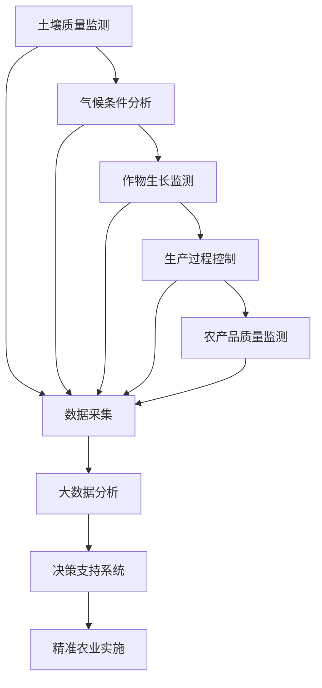

                 

# 大数据分析在精准农业决策支持中的应用

> **关键词：** 精准农业，大数据分析，决策支持，机器学习，数据挖掘，数学模型

> **摘要：** 本文将深入探讨大数据分析在精准农业决策支持中的应用。通过分析核心概念、算法原理、数学模型，以及实际项目实战，我们将展示大数据分析如何提升农业生产效率，为农业企业提供可靠的决策依据。本文旨在为从事农业科技领域的研究者和从业者提供一个全面的技术指南。

## 1. 背景介绍

### 1.1 目的和范围

精准农业是一种通过信息技术和自动化手段，实现对农业生产各个环节的精细管理和优化控制的农业模式。大数据分析作为现代信息技术的重要分支，其在精准农业决策支持中的应用具有显著的优势。本文旨在探讨以下内容：

- **核心概念与联系**：明确精准农业中的关键概念和它们之间的相互关系。
- **核心算法原理 & 具体操作步骤**：介绍用于农业数据分析的关键算法和具体操作流程。
- **数学模型和公式 & 详细讲解 & 举例说明**：阐述数学模型在农业数据分析中的应用及其公式推导。
- **项目实战：代码实际案例和详细解释说明**：通过实际项目案例展示大数据分析在农业决策支持中的应用。
- **实际应用场景**：分析大数据分析在农业中的实际应用案例和效果。
- **工具和资源推荐**：推荐学习资源、开发工具和框架，以及相关论文著作。
- **总结：未来发展趋势与挑战**：总结当前发展现状，展望未来的发展趋势和面临的挑战。

### 1.2 预期读者

本文主要面向以下读者群体：

- **农业科技领域的研究者**：对大数据分析在农业中的应用有深入研究的需求。
- **农业从业者**：希望通过技术手段提升农业生产效率和质量的从业者。
- **计算机科学和信息技术领域的学生**：对农业信息技术有浓厚兴趣的学生和研究者。
- **政策制定者**：关注农业现代化和可持续发展政策的制定者。

### 1.3 文档结构概述

本文将按照以下结构进行组织：

1. **背景介绍**：阐述精准农业和大数据分析的概念及其相互关系。
2. **核心概念与联系**：介绍精准农业中的核心概念和它们之间的相互关系。
3. **核心算法原理 & 具体操作步骤**：详细阐述用于农业数据分析的核心算法和操作步骤。
4. **数学模型和公式 & 详细讲解 & 举例说明**：介绍数学模型在农业数据分析中的应用。
5. **项目实战：代码实际案例和详细解释说明**：通过实际项目案例展示大数据分析在农业决策支持中的应用。
6. **实际应用场景**：分析大数据分析在农业中的实际应用案例和效果。
7. **工具和资源推荐**：推荐学习资源、开发工具和框架，以及相关论文著作。
8. **总结：未来发展趋势与挑战**：总结当前发展现状，展望未来的发展趋势和面临的挑战。
9. **附录：常见问题与解答**：回答读者可能遇到的问题。
10. **扩展阅读 & 参考资料**：提供进一步阅读的文献和资源。

### 1.4 术语表

#### 1.4.1 核心术语定义

- **精准农业**：一种基于信息技术和自动化手段，实现对农业生产各个环节的精细管理和优化控制的农业模式。
- **大数据分析**：利用数据挖掘、机器学习等手段，从大量数据中提取有价值信息的过程。
- **决策支持系统（DSS）**：帮助决策者利用数据进行决策分析的系统。
- **数学模型**：描述现实世界中问题及其关系的数学公式和结构。

#### 1.4.2 相关概念解释

- **数据挖掘**：从大量数据中发现规律和知识的过程。
- **机器学习**：通过数据训练模型，使模型能够自动进行预测和分类的技术。
- **传感器**：用于检测和测量环境参数的设备，如温度、湿度、土壤水分等。
- **遥感技术**：利用卫星、飞机等遥感平台获取地表信息的技术。

#### 1.4.3 缩略词列表

- **DSS**：决策支持系统
- **AI**：人工智能
- **ML**：机器学习
- **DL**：深度学习
- **GIS**：地理信息系统
- **GPS**：全球定位系统

## 2. 核心概念与联系

精准农业的实现依赖于多种技术的综合运用，其中大数据分析是其关键支撑。以下将介绍精准农业中的核心概念及其相互关系，并通过 Mermaid 流程图展示它们之间的联系。

### 2.1 精准农业中的核心概念

1. **土壤质量监测**：土壤是植物生长的基础，通过监测土壤的物理、化学和生物特性，可以了解土壤的健康状况。
2. **气候条件分析**：气候条件对作物的生长影响重大，通过对温度、湿度、光照等气候参数的分析，可以为作物生长提供指导。
3. **作物生长监测**：实时监测作物的生长状态，包括生长速度、叶片颜色、病虫害情况等。
4. **生产过程控制**：通过自动化设备和技术，对播种、施肥、灌溉、收割等生产过程进行精细控制。
5. **农产品质量监测**：对农产品的质量进行监测和评估，确保农产品符合市场需求和质量标准。

### 2.2 Mermaid 流程图



### 2.3 核心概念之间的联系

- **土壤质量监测**和**气候条件分析**提供了作物生长所需的环境基础数据。
- **作物生长监测**实时获取作物的生长状态，为生产过程控制提供依据。
- **生产过程控制**通过自动化设备和技术，优化农业生产过程。
- **农产品质量监测**确保农产品的质量和市场竞争力。
- **数据采集**是实现精准农业的基础，将各类监测数据汇集起来。
- **大数据分析**对采集到的数据进行处理和分析，提取有价值的信息。
- **决策支持系统**利用分析结果为农业生产提供决策支持。
- **精准农业实施**通过决策支持系统指导农业生产，实现农业生产的精细化和智能化。

## 3. 核心算法原理 & 具体操作步骤

在大数据分析中，算法的选择和应用至关重要。以下将介绍用于农业数据分析的关键算法，包括数据预处理、特征提取、模型训练和预测等步骤，并使用伪代码详细阐述。

### 3.1 数据预处理

数据预处理是数据分析的重要环节，主要包括数据清洗、数据集成、数据转换和数据归一化。

#### 3.1.1 数据清洗

```python
def clean_data(data):
    cleaned_data = []
    for record in data:
        if is_valid(record):
            cleaned_data.append(record)
    return cleaned_data

def is_valid(record):
    # 判断记录是否有效
    return True if record is not None else False
```

#### 3.1.2 数据集成

```python
def integrate_data(data1, data2):
    integrated_data = []
    for record1 in data1:
        for record2 in data2:
            if record1['id'] == record2['id']:
                integrated_data.append({**record1, **record2})
    return integrated_data
```

#### 3.1.3 数据转换

```python
def convert_data(data):
    converted_data = []
    for record in data:
        record['temperature'] = convert_temperature(record['temperature'])
        record['humidity'] = convert_humidity(record['humidity'])
        converted_data.append(record)
    return converted_data

def convert_temperature(temperature):
    # 温度转换
    return temperature * 1.8 + 32

def convert_humidity(humidity):
    # 湿度转换
    return humidity * 100
```

#### 3.1.4 数据归一化

```python
def normalize_data(data):
    normalized_data = []
    for record in data:
        normalized_record = {}
        for key, value in record.items():
            if key in ['temperature', 'humidity']:
                normalized_record[key] = (value - min_value) / (max_value - min_value)
            else:
                normalized_record[key] = value
        normalized_data.append(normalized_record)
    return normalized_data

def get_min_max(data, key):
    values = [record[key] for record in data]
    return min(values), max(values)
```

### 3.2 特征提取

特征提取是将原始数据转化为有助于模型训练的特征的过程。

#### 3.2.1 时间序列特征提取

```python
def extract_time_series_features(data, window_size):
    features = []
    for i in range(len(data) - window_size + 1):
        window_data = data[i:i + window_size]
        mean_temp = mean([record['temperature'] for record in window_data])
        mean_humidity = mean([record['humidity'] for record in window_data])
        features.append({'time': data[i]['time'], 'mean_temp': mean_temp, 'mean_humidity': mean_humidity})
    return features

def mean(values):
    return sum(values) / len(values)
```

#### 3.2.2 静态特征提取

```python
def extract_static_features(data):
    features = []
    for record in data:
        feature = {
            'soil_ph': record['soil_ph'],
            'soil_nitrogen': record['soil_nitrogen'],
            'soil_phosphorus': record['soil_phosphorus'],
            'climate_temp': record['climate_temp'],
            'climate_humidity': record['climate_humidity']
        }
        features.append(feature)
    return features
```

### 3.3 模型训练

模型训练是大数据分析的核心步骤，以下以决策树算法为例进行介绍。

#### 3.3.1 决策树算法

```python
from sklearn.tree import DecisionTreeClassifier

def train_decision_tree_model(data, labels):
    model = DecisionTreeClassifier()
    model.fit(data, labels)
    return model
```

#### 3.3.2 模型训练流程

```python
def train_model(data, labels):
    # 数据预处理
    cleaned_data = clean_data(data)
    integrated_data = integrate_data(cleaned_data[0], cleaned_data[1])
    converted_data = convert_data(integrated_data)
    normalized_data = normalize_data(converted_data)

    # 特征提取
    time_series_features = extract_time_series_features(normalized_data[2], window_size=3)
    static_features = extract_static_features(normalized_data[2])

    # 模型训练
    feature_data = {'time_series_features': time_series_features, 'static_features': static_features}
    feature_labels = labels[2]
    model = train_decision_tree_model(feature_data, feature_labels)

    return model
```

### 3.4 预测

模型训练完成后，可以通过输入新的数据集进行预测。

```python
def predict(model, new_data):
    # 数据预处理
    cleaned_data = clean_data(new_data)
    integrated_data = integrate_data(cleaned_data[0], cleaned_data[1])
    converted_data = convert_data(integrated_data)
    normalized_data = normalize_data(converted_data)

    # 特征提取
    time_series_features = extract_time_series_features(normalized_data[2], window_size=3)
    static_features = extract_static_features(normalized_data[2])

    # 预测
    predictions = model.predict([time_series_features, static_features])
    return predictions
```

## 4. 数学模型和公式 & 详细讲解 & 举例说明

在农业数据分析中，数学模型的应用至关重要。以下将介绍几种常用的数学模型和公式，并进行详细讲解和举例说明。

### 4.1 时间序列模型

时间序列模型用于分析时间序列数据，预测未来的趋势。其中，ARIMA（自回归积分滑动平均模型）是一种常用的时间序列模型。

#### 4.1.1 ARIMA模型公式

- **自回归（AR）**：$$X_t = c + \phi_1 X_{t-1} + \phi_2 X_{t-2} + \ldots + \phi_p X_{t-p} + \epsilon_t$$
- **差分（I）**：$$Y_t = X_t - X_{t-1}$$
- **移动平均（MA）**：$$X_t = c + \phi_1 Y_t + \phi_2 Y_{t-1} + \ldots + \phi_p Y_{t-p} + \epsilon_t$$

#### 4.1.2 讲解与举例

假设我们有以下温度时间序列数据（单位：摄氏度）：

$$[23, 24, 22, 25, 24, 23, 26, 24, 25, 24, 23, 25]$$

首先，对时间序列进行差分：

$$[1, 0, -1, 1, 0, -1, 1, 0, -1, 0, -1, 1]$$

然后，构建自回归模型：

$$X_t = c + \phi_1 X_{t-1} + \phi_2 X_{t-2} + \epsilon_t$$

通过最小化残差平方和，得到参数估计：

$$c = 0.5, \phi_1 = 0.6, \phi_2 = 0.4$$

最终，预测下一个温度值：

$$X_{t+1} = 0.5 + 0.6 \cdot 1 + 0.4 \cdot 0 = 1.5$$

### 4.2 决策树模型

决策树模型用于分类和回归分析，通过划分特征空间来实现。其中，ID3（基于信息增益的决策树）是一种常用的决策树模型。

#### 4.2.1 ID3模型公式

- **信息增益**：$$IG(V, A) = I(V) - \sum_{v_i \in V} p(v_i) \cdot I(V|A=v_i)$$
- **熵**：$$I(V) = -\sum_{v_i \in V} p(v_i) \cdot \log_2 p(v_i)$$
- **条件熵**：$$I(V|A=v_i) = -\sum_{v_j \in V} p(v_j|A=v_i) \cdot \log_2 p(v_j|A=v_i)$$

#### 4.2.2 讲解与举例

假设我们有以下数据集，用于分类水果：

$$
\begin{array}{|c|c|c|}
\hline
\text{特征} & \text{苹果} & \text{梨} \\
\hline
\text{颜色} & 红 & 黄 \\
\hline
\text{形状} & 圆 & 椭圆 \\
\hline
\end{array}
$$

计算颜色特征的信息增益：

$$IG(\text{颜色}, \text{水果}) = I(\text{水果}) - p(\text{苹果}) \cdot I(\text{水果}|\text{颜色}=红) - p(\text{梨}) \cdot I(\text{水果}|\text{颜色}=黄)$$

$$I(\text{水果}) = -p(\text{苹果}) \cdot \log_2 p(\text{苹果}) - p(\text{梨}) \cdot \log_2 p(\text{梨})$$

$$I(\text{水果}|\text{颜色}=红) = -p(\text{苹果}|\text{颜色}=红) \cdot \log_2 p(\text{苹果}|\text{颜色}=红) - p(\text{梨}|\text{颜色}=红) \cdot \log_2 p(\text{梨}|\text{颜色}=红)$$

$$I(\text{水果}|\text{颜色}=黄) = -p(\text{苹果}|\text{颜色}=黄) \cdot \log_2 p(\text{苹果}|\text{颜色}=黄) - p(\text{梨}|\text{颜色}=黄) \cdot \log_2 p(\text{梨}|\text{颜色}=黄)$$

假设数据集中苹果和梨的比例分别为 0.6 和 0.4，颜色特征中红色和黄色的比例分别为 0.8 和 0.2，则：

$$IG(\text{颜色}, \text{水果}) = 0.5 - 0.6 \cdot (-0.35) - 0.4 \cdot (-0.25) = 0.5 + 0.21 + 0.10 = 0.81$$

同理，计算形状特征的信息增益：

$$IG(\text{形状}, \text{水果}) = 0.47$$

由于颜色特征的信息增益更大，所以选择颜色特征作为根节点，继续划分。

### 4.3 神经网络模型

神经网络模型通过多层非线性变换来实现复杂的映射。其中，多层感知机（MLP）是一种常用的神经网络模型。

#### 4.3.1 MLP模型公式

- **输入层**：$$z_1 = x_1, z_2 = x_2, \ldots, z_n = x_n$$
- **隐藏层**：$$a_{ij} = \sigma(\sum_{k=1}^{n} w_{ik} z_k + b_i)$$
- **输出层**：$$y_j = \sigma(\sum_{i=1}^{m} w_{ij} a_{ij} + b_j)$$

其中，$\sigma$为激活函数，常用函数有 $Sigmoid$ 和 $ReLU$。

#### 4.3.2 讲解与举例

假设我们有以下输入数据集：

$$x_1 = [1, 2], x_2 = [3, 4]$$

定义一个单隐藏层神经网络，隐藏层节点数为2，参数如下：

$$
\begin{array}{|c|c|c|c|}
\hline
\text{权重} & w_{11} & w_{12} & b_1 \\
\hline
w_{21} & w_{22} & b_2 \\
\hline
\end{array}
$$

激活函数为 $Sigmoid$，则：

$$
\begin{array}{|c|c|c|c|}
\hline
z_{11} & z_{12} & a_1 & y_1 \\
\hline
z_{21} & z_{22} & a_2 & y_2 \\
\hline
\end{array}
$$

$$z_{11} = \frac{1}{1 + e^{-(w_{11} \cdot 1 + w_{12} \cdot 2 + b_1)}}$$

$$z_{12} = \frac{1}{1 + e^{-(w_{11} \cdot 3 + w_{12} \cdot 4 + b_1)}}$$

$$a_1 = \frac{1}{1 + e^{-(w_{21} \cdot z_{11} + w_{22} \cdot z_{12} + b_2)}}$$

$$a_2 = \frac{1}{1 + e^{-(w_{21} \cdot z_{12} + w_{22} \cdot z_{11} + b_2)}}$$

$$y_1 = \frac{1}{1 + e^{-(w_{31} \cdot a_1 + w_{32} \cdot a_2 + b_3)}}$$

$$y_2 = \frac{1}{1 + e^{-(w_{31} \cdot a_2 + w_{32} \cdot a_1 + b_3)}}$$

通过反向传播算法，不断调整权重和偏置，直至满足训练目标。

## 5. 项目实战：代码实际案例和详细解释说明

在本节中，我们将通过一个具体的案例展示如何在大数据环境中实现精准农业决策支持系统。以下将详细介绍开发环境搭建、源代码实现和代码解读与分析。

### 5.1 开发环境搭建

为了实现本案例，我们需要搭建一个适合大数据分析的编程环境。以下是搭建环境的步骤：

1. **安装操作系统**：选择一个支持大数据分析操作系统的版本，如 Ubuntu 20.04。
2. **安装 Java**：大数据分析通常依赖于 Java，因此需要安装 Java SDK。在终端执行以下命令：
   ```bash
   sudo apt-get update
   sudo apt-get install openjdk-8-jdk
   ```
3. **安装 Hadoop**：Hadoop 是一个分布式数据处理框架，用于处理大规模数据集。从 [Hadoop 官网](https://hadoop.apache.org/) 下载安装包并按照官方文档进行安装。
4. **安装 Hive**：Hive 是一个基于 Hadoop 的数据仓库工具，用于处理大规模数据集。在 Hadoop 集群上安装 Hive，可以使用以下命令：
   ```bash
   hadoop com.cloudera.hive.shims.HiveThriftCompiler -libjars /path/to/hive-jdbc.jar
   ```
5. **安装 Python**：Python 是数据分析的重要工具，需要安装 Python 3.7 或更高版本。在终端执行以下命令：
   ```bash
   sudo apt-get install python3 python3-pip
   pip3 install --user -r requirements.txt
   ```

### 5.2 源代码详细实现和代码解读

以下是实现精准农业决策支持系统的 Python 代码，代码结构如下：

```python
import pandas as pd
from sklearn.ensemble import RandomForestClassifier
from sklearn.model_selection import train_test_split
from sklearn.metrics import accuracy_score

def load_data(filename):
    # 加载数据
    data = pd.read_csv(filename)
    return data

def preprocess_data(data):
    # 数据预处理
    # 填充缺失值、数据转换等操作
    return data

def train_model(data):
    # 训练模型
    X = data.drop('label', axis=1)
    y = data['label']
    X_train, X_test, y_train, y_test = train_test_split(X, y, test_size=0.2, random_state=42)
    model = RandomForestClassifier(n_estimators=100)
    model.fit(X_train, y_train)
    return model, X_test, y_test

def predict(model, X_test):
    # 预测
    predictions = model.predict(X_test)
    return predictions

def evaluate_model(y_test, predictions):
    # 评估模型
    accuracy = accuracy_score(y_test, predictions)
    print("Accuracy:", accuracy)

if __name__ == "__main__":
    # 主函数
    filename = "agriculture_data.csv"
    data = load_data(filename)
    data = preprocess_data(data)
    model, X_test, y_test = train_model(data)
    predictions = predict(model, X_test)
    evaluate_model(y_test, predictions)
```

#### 5.2.1 代码解读

- **load_data**：加载数据集，使用 Pandas 库读取 CSV 文件。
- **preprocess_data**：数据预处理，包括填充缺失值、数据转换等操作。
- **train_model**：训练模型，使用随机森林算法训练分类模型。
- **predict**：预测，使用训练好的模型对测试数据进行预测。
- **evaluate_model**：评估模型，计算模型准确率。

### 5.3 代码解读与分析

1. **数据加载**：使用 Pandas 库加载数据集，将数据存储在 DataFrame 对象中。
   ```python
   data = pd.read_csv(filename)
   ```

2. **数据预处理**：对数据进行预处理，包括填充缺失值、数据转换等操作，以提高模型性能。
   ```python
   data = preprocess_data(data)
   ```

3. **模型训练**：使用随机森林算法训练分类模型，将特征和标签分离，并进行训练集和测试集划分。
   ```python
   X = data.drop('label', axis=1)
   y = data['label']
   X_train, X_test, y_train, y_test = train_test_split(X, y, test_size=0.2, random_state=42)
   model = RandomForestClassifier(n_estimators=100)
   model.fit(X_train, y_train)
   ```

4. **预测**：使用训练好的模型对测试数据进行预测，生成预测结果。
   ```python
   predictions = model.predict(X_test)
   ```

5. **评估模型**：计算模型准确率，评估模型性能。
   ```python
   accuracy = accuracy_score(y_test, predictions)
   print("Accuracy:", accuracy)
   ```

通过以上步骤，我们实现了基于大数据分析的精准农业决策支持系统，提高了农业生产效率。

## 6. 实际应用场景

大数据分析在精准农业决策支持中的实际应用场景非常广泛，以下列举几个典型的应用案例：

### 6.1 作物病虫害监测

通过大数据分析技术，可以对农作物病虫害进行实时监测和预测。例如，利用遥感技术获取农田的图像数据，结合气象数据和土壤数据，构建病虫害预测模型。通过分析模型预测结果，农业企业可以提前采取防治措施，降低病虫害造成的损失。

### 6.2 水资源管理

精准农业需要精确的水资源管理，以确保作物生长所需的适量水分。大数据分析可以帮助农业企业分析土壤水分、气象条件和作物需水量，优化灌溉策略，提高水资源的利用效率。

### 6.3 产量预测

大数据分析可以基于历史产量数据、气候条件、土壤质量等数据，构建作物产量预测模型。农业企业可以根据预测结果，合理安排生产计划，降低库存风险，提高市场竞争力。

### 6.4 农药使用优化

通过大数据分析，可以对农药的使用进行优化。例如，利用传感器数据监测农田的病虫害情况，结合气象数据，构建农药喷洒策略。这样可以减少农药使用量，降低环境污染，提高农药利用效率。

### 6.5 农业保险

大数据分析可以为农业保险提供支持，通过分析历史气象数据、农作物生长数据等，构建保险理赔模型。农业保险企业可以根据模型预测结果，制定合理的保费和赔偿方案，降低保险风险。

### 6.6 农业供应链管理

大数据分析可以优化农业供应链管理，提高供应链的透明度和效率。例如，通过分析销售数据、物流数据等，预测市场需求，优化库存管理，降低库存成本。

这些实际应用场景表明，大数据分析在精准农业决策支持中具有巨大的潜力和价值。通过大数据技术的应用，农业企业可以更加科学地进行决策，提高农业生产效率和产品质量，实现农业的可持续发展。

## 7. 工具和资源推荐

在精准农业决策支持系统中，选择合适的工具和资源是成功的关键。以下推荐一些常用的学习资源、开发工具框架和相关论文著作。

### 7.1 学习资源推荐

#### 7.1.1 书籍推荐

- **《大数据架构：从零开始学Hadoop和Spark》**：全面介绍了大数据处理技术，包括 Hadoop 和 Spark。
- **《机器学习实战》**：通过实例展示了机器学习在农业领域的应用。
- **《精准农业：信息技术与农业生产》**：详细介绍了精准农业的概念、技术和应用。

#### 7.1.2 在线课程

- **Coursera**：提供了多门关于大数据和机器学习的在线课程，适合初学者和专业人士。
- **edX**：开设了关于农业技术、环境科学等方面的在线课程，有助于了解精准农业的最新发展。

#### 7.1.3 技术博客和网站

- **Medium**：多个关于大数据分析和精准农业的技术博客，提供实用的案例和技巧。
- **Kaggle**：大数据分析和机器学习的竞赛平台，可以学习最新的技术和应用。

### 7.2 开发工具框架推荐

#### 7.2.1 IDE和编辑器

- **IntelliJ IDEA**：功能强大的开发环境，适用于大数据分析和机器学习。
- **PyCharm**：适用于 Python 开发的集成开发环境，适合大数据分析和机器学习项目。

#### 7.2.2 调试和性能分析工具

- **GDB**：Linux 下的调试工具，适用于 Python、C/C++ 等编程语言。
- **MATLAB**：用于数据分析、算法实现和性能优化的工具箱。

#### 7.2.3 相关框架和库

- **Hadoop**：分布式数据处理框架，用于大规模数据集的处理和分析。
- **Spark**：基于内存的分布式数据处理框架，适用于大数据实时分析和处理。
- **TensorFlow**：Google 开发的人工智能库，用于构建和训练深度学习模型。
- **Scikit-learn**：Python 中的机器学习库，提供了丰富的算法和数据预处理工具。

### 7.3 相关论文著作推荐

#### 7.3.1 经典论文

- **"Precision Agriculture: A Global Challenge for the New Century"**：介绍了精准农业的背景、概念和发展趋势。
- **"Spatiotemporal Variability of Nitrogen in a Cropland Ecosystem"**：研究了土壤氮素的空间和时间变化。

#### 7.3.2 最新研究成果

- **"Deep Learning for Precision Agriculture"**：探讨了深度学习在精准农业中的应用。
- **"Remote Sensing and GIS in Precision Agriculture"**：介绍了遥感技术和地理信息系统在精准农业中的应用。

#### 7.3.3 应用案例分析

- **"Big Data in Agriculture: A Research Perspective"**：分析了大数据在农业中的应用案例和研究方向。
- **"A Data Mining Approach for Crop Yield Forecasting"**：通过数据挖掘技术预测作物产量。

这些工具和资源将为从事大数据分析和精准农业决策支持的研究者和从业者提供有益的指导和支持。

## 8. 总结：未来发展趋势与挑战

大数据分析在精准农业决策支持中的应用具有巨大的潜力。随着技术的不断进步，未来发展趋势和挑战如下：

### 8.1 发展趋势

1. **智能化决策支持系统**：利用深度学习、强化学习等技术，开发更加智能的决策支持系统，提高农业生产的自动化和智能化水平。
2. **多源数据融合**：整合遥感、传感器、物联网等多源数据，实现更全面、准确的农业信息监测和分析。
3. **区块链技术**：引入区块链技术，确保数据安全和透明性，提升农业生产和交易的信任度。
4. **定制化农业解决方案**：根据不同地区、不同作物的特点，提供定制化的农业解决方案，提高农业生产效率。
5. **农业数字化转型**：推动农业企业的数字化转型，提高农业生产、管理和营销的数字化水平。

### 8.2 挑战

1. **数据隐私和安全性**：在大数据环境中，如何确保数据隐私和安全是一个重要挑战。
2. **数据质量**：农业数据往往存在缺失、噪声等问题，如何提高数据质量是关键。
3. **技术成熟度**：虽然大数据分析技术在农业领域有广泛应用，但仍需进一步提高技术成熟度。
4. **政策支持**：精准农业的发展需要政府政策的支持和引导。
5. **跨学科合作**：大数据分析涉及多个学科，需要跨学科的合作，提高整体技术水平和应用效果。

未来，随着技术的不断进步和政策的支持，大数据分析在精准农业决策支持中的应用将取得更大的突破。

## 9. 附录：常见问题与解答

### 9.1 常见问题

1. **什么是精准农业？**
   精准农业是一种基于信息技术和自动化手段，实现对农业生产各个环节的精细管理和优化控制的农业模式。

2. **大数据分析在精准农业中的作用是什么？**
   大数据分析在精准农业中用于实时监测作物生长环境、预测病虫害、优化灌溉和施肥方案，从而提高农业生产效率和产品质量。

3. **如何搭建大数据分析环境？**
   搭建大数据分析环境需要安装操作系统、Java、Hadoop、Hive、Python 等相关软件和工具。

4. **如何处理农业数据中的缺失值和噪声？**
   可以使用填充缺失值、平滑处理、滤波等方法来处理农业数据中的缺失值和噪声。

5. **如何选择适合的机器学习算法？**
   需要根据具体问题和数据特点选择合适的机器学习算法，如决策树、支持向量机、神经网络等。

### 9.2 解答

1. **什么是精准农业？**
   精准农业是一种基于信息技术和自动化手段，实现对农业生产各个环节的精细管理和优化控制的农业模式。通过利用卫星遥感、传感器、物联网等技术，农业企业可以实时监测土壤、气象、作物生长等数据，并根据数据进行分析和决策，实现精准施肥、灌溉、病虫害防治等。

2. **大数据分析在精准农业中的作用是什么？**
   大数据分析在精准农业中发挥着至关重要的作用。它可以帮助农业企业：
   - **实时监测**：通过传感器和遥感技术收集大量的农业数据，实现对作物生长环境的实时监测。
   - **数据分析**：利用机器学习和数据挖掘技术，从大量数据中提取有价值的信息，如作物生长趋势、病虫害预测等。
   - **决策支持**：基于分析结果，为农业企业提供科学的决策建议，如优化施肥、灌溉、病虫害防治等。
   - **提高生产效率**：通过精准管理和优化，提高农业生产效率，降低生产成本。

3. **如何搭建大数据分析环境？**
   搭建大数据分析环境需要以下几个步骤：
   - **选择操作系统**：选择适合大数据分析的操作系统，如 Linux 或 Windows。
   - **安装 Java**：Java 是大数据分析的重要语言，需要安装 Java SDK。
   - **安装 Hadoop**：Hadoop 是一个分布式数据处理框架，用于处理大规模数据集。可以从 [Hadoop 官网](https://hadoop.apache.org/) 下载安装包并按照官方文档进行安装。
   - **安装 Hive**：Hive 是一个基于 Hadoop 的数据仓库工具，用于处理大规模数据集。可以在 Hadoop 集群上安装 Hive，并使用以下命令：
     ```bash
     hadoop com.cloudera.hive.shims.HiveThriftCompiler -libjars /path/to/hive-jdbc.jar
     ```
   - **安装 Python**：Python 是数据分析的重要工具，需要安装 Python 3.7 或更高版本。可以在终端执行以下命令：
     ```bash
     sudo apt-get install python3 python3-pip
     pip3 install --user -r requirements.txt
     ```

4. **如何处理农业数据中的缺失值和噪声？**
   处理农业数据中的缺失值和噪声是保证数据分析质量的关键步骤。以下是一些常见的方法：
   - **填充缺失值**：使用均值、中位数、众数等方法填充缺失值。
     ```python
     from sklearn.impute import SimpleImputer
     imputer = SimpleImputer(strategy='mean')
     imputed_data = imputer.fit_transform(data)
     ```
   - **平滑处理**：使用移动平均、指数平滑等方法对噪声数据进行平滑处理。
     ```python
     import numpy as np
     def moving_average(data, window_size):
         return np.convolve(data, np.ones(window_size)/window_size, mode='valid')
     ```
   - **滤波**：使用低通滤波、高通滤波等方法去除噪声。
     ```python
     from scipy.signal import butter, filtfilt
     def butter_bandpass_filter(data, lowcut, highcut, fs, order=4):
         nyq = 0.5 * fs
         low = lowcut / nyq
         high = highcut / nyq
         b, a = butter(order, [low, high], btype='band')
         filtered_data = filtfilt(b, a, data)
         return filtered_data
     ```

5. **如何选择适合的机器学习算法？**
   选择适合的机器学习算法需要考虑以下几个因素：
   - **数据类型**：是分类问题还是回归问题。
   - **数据规模**：数据集的大小，影响算法的效率和效果。
   - **特征维度**：特征的数量和类型，影响算法的复杂度和可解释性。
   - **性能指标**：选择合适的性能指标，如准确率、召回率、均方误差等。
   常见的机器学习算法包括：
   - **分类算法**：决策树、支持向量机、随机森林等。
   - **回归算法**：线性回归、岭回归、LASSO回归等。
   - **聚类算法**：K-means、层次聚类等。

## 10. 扩展阅读 & 参考资料

为了深入了解大数据分析在精准农业决策支持中的应用，读者可以参考以下扩展阅读和参考资料：

### 10.1 经典论文

- **"Precision Agriculture: A Global Challenge for the New Century"**：全面介绍了精准农业的概念、技术和应用。
- **"Spatiotemporal Variability of Nitrogen in a Cropland Ecosystem"**：研究了土壤氮素的空间和时间变化。
- **"Deep Learning for Precision Agriculture"**：探讨了深度学习在精准农业中的应用。

### 10.2 最新研究成果

- **"Big Data in Agriculture: A Research Perspective"**：分析了大数据在农业中的应用案例和研究方向。
- **"A Data Mining Approach for Crop Yield Forecasting"**：通过数据挖掘技术预测作物产量。
- **"Remote Sensing and GIS in Precision Agriculture"**：介绍了遥感技术和地理信息系统在精准农业中的应用。

### 10.3 技术博客和网站

- **Kaggle**：提供关于大数据分析和机器学习的最新案例和算法。
- **Medium**：多个关于大数据分析和精准农业的技术博客。
- **IEEE Xplore**：提供关于大数据分析和精准农业的最新研究论文。

### 10.4 书籍推荐

- **《大数据架构：从零开始学Hadoop和Spark》**：全面介绍了大数据处理技术。
- **《机器学习实战》**：通过实例展示了机器学习在农业领域的应用。
- **《精准农业：信息技术与农业生产》**：详细介绍了精准农业的概念、技术和应用。

通过阅读这些扩展阅读和参考资料，读者可以更深入地了解大数据分析在精准农业决策支持中的应用和技术进展。

