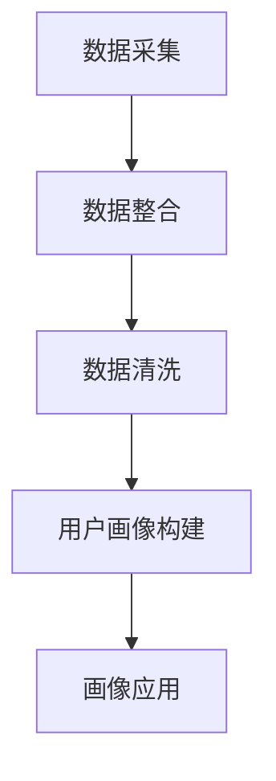

                 

### 文章标题：大数据分析在跨平台用户画像构建中的应用

### 关键词：大数据分析、用户画像、跨平台、数据分析、数据挖掘、数据存储

### 摘要：
本文将深入探讨大数据分析在跨平台用户画像构建中的应用。首先，我们将介绍大数据分析的基本概念和技术，然后详细阐述用户画像的概念及其在跨平台场景中的重要性。接下来，我们将逐步解析用户画像构建的核心算法原理、数学模型和具体操作步骤。通过一个实际项目实战案例，我们将展示如何搭建开发环境、实现源代码，并对其进行详细解读和分析。此外，本文还将探讨用户画像在各类实际应用场景中的作用，并推荐相关学习资源和开发工具。最后，我们将总结未来发展趋势和挑战，并提供常见问题与解答。通过本文的阅读，您将全面了解大数据分析在跨平台用户画像构建中的关键技术和实践方法。

### 1. 背景介绍

#### 1.1 大数据的定义和特点

大数据是指无法使用传统数据处理工具在合理时间内捕捉、管理和处理的数据集，具有“4V”特点，即Volume（大量）、Velocity（高速）、Variety（多样）和Veracity（真实性）。随着互联网和物联网的快速发展，数据量呈现指数级增长，这使得大数据分析变得尤为重要。传统数据处理方法已无法满足大规模数据的需求，因此，大数据分析技术逐渐成为研究和应用的热点。

#### 1.2 用户画像的定义和意义

用户画像是指通过对用户在互联网上的行为数据进行分析，构建出反映其兴趣爱好、需求、行为习惯等特征的数字模型。用户画像在各类场景中具有广泛的应用，如个性化推荐、精准营销、风险控制等。通过构建用户画像，企业可以更好地了解用户需求，提高用户满意度，从而实现商业价值的最大化。

#### 1.3 跨平台用户画像的挑战

随着移动互联网的普及，用户在不同设备、不同应用之间的行为数据越来越丰富。跨平台用户画像旨在整合这些分散的数据，为用户提供一致性的服务体验。然而，跨平台用户画像面临着以下挑战：

1. 数据孤岛：不同平台、不同应用的数据难以整合，导致数据孤岛现象。
2. 数据隐私：用户隐私保护日益重视，如何在保障用户隐私的前提下进行数据分析成为关键问题。
3. 数据一致性：不同平台的数据格式、粒度和时效性不同，需要统一处理和标准化。

#### 1.4 大数据分析在跨平台用户画像构建中的应用

大数据分析技术在跨平台用户画像构建中发挥着关键作用。通过数据采集、存储、处理和分析等技术手段，可以实现对海量用户行为数据的挖掘和整合，从而构建出精准、动态的用户画像。具体应用包括：

1. 用户行为分析：通过分析用户在不同平台的行为数据，挖掘用户的兴趣爱好、需求和行为习惯。
2. 用户画像构建：将用户行为数据转化为结构化的用户画像，为个性化推荐、精准营销等应用提供支持。
3. 数据治理和标准化：统一处理和标准化不同平台、不同应用的数据，提高数据一致性。
4. 风险控制：通过分析用户行为数据，识别潜在的风险用户，实现风险预警和控制。

### 2. 核心概念与联系

#### 2.1 大数据分析技术

大数据分析技术主要包括数据采集、数据存储、数据处理和分析等环节。其中，数据采集是指通过传感器、网站日志、应用程序接口（API）等途径获取用户行为数据；数据存储则采用分布式存储技术，如Hadoop、Spark等，存储海量数据；数据处理包括数据清洗、数据转换、数据整合等步骤，确保数据质量；分析技术则涵盖数据挖掘、机器学习、统计分析等，用于提取数据中的有价值信息。

#### 2.2 用户画像的构成

用户画像通常由以下几部分构成：

1. 基础信息：包括用户的性别、年龄、职业、地域等基本信息。
2. 兴趣爱好：通过分析用户在互联网上的行为数据，挖掘出用户的兴趣爱好。
3. 行为习惯：分析用户在不同平台、不同应用上的行为模式，如浏览时间、浏览内容、购买行为等。
4. 需求特征：通过对用户行为数据的分析，了解用户的需求和偏好，为个性化推荐和精准营销提供支持。

#### 2.3 跨平台用户画像的构建流程

跨平台用户画像的构建流程主要包括以下步骤：

1. 数据采集：从不同平台、不同应用中获取用户行为数据，包括网站日志、应用程序日志、社交媒体数据等。
2. 数据整合：将不同平台、不同应用的数据进行整合，实现数据的一致性和标准化。
3. 数据清洗：对采集到的数据进行去重、纠错、填充等处理，提高数据质量。
4. 用户画像构建：基于整合后的用户行为数据，构建出结构化的用户画像。
5. 画像应用：将用户画像应用于个性化推荐、精准营销、风险控制等场景，实现商业价值。

### 2.4 Mermaid 流程图

以下是跨平台用户画像构建的 Mermaid 流程图：



#### 2.5 核心概念的联系

大数据分析技术为跨平台用户画像的构建提供了基础支持。通过数据采集、整合和清洗，我们可以获取高质量的用户行为数据，进而构建出结构化的用户画像。用户画像的应用场景广泛，如个性化推荐、精准营销、风险控制等，这些应用场景又促进了大数据分析技术的进一步发展和优化。

### 3. 核心算法原理 & 具体操作步骤

#### 3.1 数据采集

数据采集是跨平台用户画像构建的第一步，也是至关重要的一步。数据采集的方式包括以下几种：

1. **网站日志采集**：通过分析网站服务器生成的日志文件，可以获取用户的访问时间、访问页面、操作行为等信息。
2. **应用程序日志采集**：通过应用程序的日志记录功能，可以获取用户在应用程序中的操作行为，如点击、浏览、购买等。
3. **社交媒体数据采集**：通过爬取社交媒体平台的数据，可以获取用户的社交行为、兴趣爱好等信息。
4. **传感器数据采集**：通过物联网设备采集的数据，如地理位置、环境信息等，可以丰富用户画像的维度。

具体操作步骤如下：

1. **确定采集目标**：根据业务需求，明确需要采集的用户行为数据类型和范围。
2. **搭建数据采集系统**：选择合适的数据采集工具，如Flume、Logstash等，搭建数据采集系统。
3. **配置采集规则**：根据采集目标，配置数据采集规则，包括数据源、采集频率、数据格式等。
4. **启动数据采集**：启动数据采集系统，开始采集用户行为数据。

#### 3.2 数据整合

数据整合是将不同平台、不同应用的数据进行整合，实现数据的一致性和标准化。具体操作步骤如下：

1. **数据清洗**：对采集到的数据进行清洗，包括去除重复数据、纠正错误数据、填充缺失数据等，提高数据质量。
2. **数据转换**：将不同数据源的数据格式进行统一转换，如将文本数据转换为JSON格式、将时间戳转换为统一的时间格式等。
3. **数据归一化**：对数据进行归一化处理，如将用户的年龄、收入等数据进行标准化，便于后续分析。
4. **建立数据仓库**：使用分布式数据仓库技术，如Hadoop、Spark等，建立统一的数据仓库，存储整合后的用户行为数据。

#### 3.3 数据清洗

数据清洗是数据整合过程中至关重要的一步，目的是提高数据质量，确保后续分析结果的准确性。具体操作步骤如下：

1. **去重**：检测并去除重复的用户数据，避免重复分析。
2. **纠错**：检测并纠正数据中的错误，如时间戳错误、格式错误等。
3. **填充缺失值**：使用合适的算法或方法，填补数据中的缺失值，如使用平均值、中值等方法。
4. **标准化**：对数据进行标准化处理，如对用户的年龄、收入等进行标准化，便于后续分析。

#### 3.4 用户画像构建

用户画像构建是跨平台用户画像构建的核心步骤，目的是将用户行为数据转化为结构化的用户画像。具体操作步骤如下：

1. **特征提取**：从用户行为数据中提取出反映用户特征的维度，如兴趣爱好、行为习惯、需求特征等。
2. **模型训练**：使用机器学习算法，如聚类算法、协同过滤算法等，对提取出的特征进行训练，构建出用户画像模型。
3. **画像更新**：根据用户的新行为数据，对用户画像进行实时更新，确保画像的动态性和准确性。

#### 3.5 画像应用

用户画像的应用场景广泛，如个性化推荐、精准营销、风险控制等。具体操作步骤如下：

1. **个性化推荐**：基于用户画像，为用户推荐个性化的内容或商品，提高用户满意度。
2. **精准营销**：根据用户画像，设计有针对性的营销策略，提高营销效果。
3. **风险控制**：通过分析用户画像，识别潜在的风险用户，实现风险预警和控制。

### 4. 数学模型和公式 & 详细讲解 & 举例说明

#### 4.1 数学模型

在跨平台用户画像构建过程中，常用的数学模型包括聚类算法、协同过滤算法等。下面分别介绍这两种算法的数学模型。

##### 4.1.1 聚类算法

聚类算法是一种无监督学习方法，其目的是将数据集划分为多个类别，使得同一类别内的数据尽可能相似，不同类别间的数据尽可能不同。常用的聚类算法有K-means算法、层次聚类算法等。

K-means算法是一种基于距离的聚类算法，其基本思想是将数据集划分为K个簇，使得每个簇的中心尽量接近簇内的数据点，同时尽可能远离其他簇的中心。

数学模型如下：

假设数据集为 \( X = \{ x_1, x_2, ..., x_n \} \)，其中每个数据点 \( x_i \) 是一个 \( m \) 维向量。

1. **初始化**：随机选择K个数据点作为初始聚类中心 \( \mu_1, \mu_2, ..., \mu_K \)。
2. **分配数据点**：对于每个数据点 \( x_i \)，计算其与各个聚类中心的距离，将其分配到距离最近的聚类中心所代表的簇。
3. **更新聚类中心**：计算每个簇的平均值，作为新的聚类中心。
4. **重复步骤2和3，直到聚类中心不再发生变化或达到预设的迭代次数**。

##### 4.1.2 协同过滤算法

协同过滤算法是一种基于用户行为数据的推荐算法，其基本思想是利用用户的历史行为数据，为用户推荐相似的物品或为物品推荐相似的用户。常用的协同过滤算法有基于用户的协同过滤（User-based Collaborative Filtering）和基于物品的协同过滤（Item-based Collaborative Filtering）。

基于用户的协同过滤算法的数学模型如下：

假设用户集为 \( U = \{ u_1, u_2, ..., u_m \} \)，物品集为 \( I = \{ i_1, i_2, ..., i_n \} \)，用户 \( u_i \) 对物品 \( i_j \) 的评分表示为 \( r_{ij} \)。

1. **计算相似度**：对于每个用户 \( u_i \)，计算其与其他用户之间的相似度，常用的相似度计算方法包括余弦相似度、皮尔逊相关系数等。
2. **预测评分**：对于用户 \( u_i \) 未评分的物品 \( i_j \)，根据其与其他用户的相似度，计算对物品 \( i_j \) 的预测评分 \( \hat{r}_{ij} \)。
3. **生成推荐列表**：根据预测评分，为用户 \( u_i \) 生成推荐列表。

#### 4.2 公式详解

##### 4.2.1 K-means算法

K-means算法的主要公式如下：

1. **聚类中心更新**：

$$
\mu_{k}^{new} = \frac{1}{N_k} \sum_{i=1}^{N} x_i
$$

其中，\( \mu_{k}^{new} \) 表示新的聚类中心，\( x_i \) 表示数据点，\( N_k \) 表示第k个簇的数据点个数。

2. **簇分配**：

$$
c(x) = \arg\min_{k} \sum_{i=1}^{n} (x_i - \mu_k)^2
$$

其中，\( c(x) \) 表示数据点 \( x \) 分配到的簇，\( \mu_k \) 表示第k个簇的聚类中心。

##### 4.2.2 协同过滤算法

协同过滤算法的主要公式如下：

1. **相似度计算**：

$$
sim(u_i, u_j) = \frac{\sum_{k=1}^{n} r_{ik} r_{jk}}{\sqrt{\sum_{k=1}^{n} r_{ik}^2 \sum_{k=1}^{n} r_{jk}^2}}
$$

其中，\( sim(u_i, u_j) \) 表示用户 \( u_i \) 和用户 \( u_j \) 之间的相似度，\( r_{ik} \) 表示用户 \( u_i \) 对物品 \( i_k \) 的评分。

2. **预测评分**：

$$
\hat{r}_{ij} = \frac{\sum_{k=1}^{n} sim(u_i, u_j) r_{jk}}{\sum_{k=1}^{n} sim(u_i, u_j)}
$$

其中，\( \hat{r}_{ij} \) 表示用户 \( u_i \) 对物品 \( i_j \) 的预测评分。

#### 4.3 举例说明

##### 4.3.1 K-means算法

假设有5个数据点 \( X = \{ (1, 2), (2, 3), (3, 4), (4, 5), (5, 6) \} \)，我们使用K-means算法将其划分为2个簇。

1. **初始化**：随机选择2个数据点作为初始聚类中心 \( \mu_1 = (1, 2) \)，\( \mu_2 = (5, 6) \)。
2. **分配数据点**：计算每个数据点与聚类中心的距离，将其分配到距离最近的聚类中心所代表的簇。
   - 数据点 \( (1, 2) \) 距离 \( \mu_1 \) 最近，分配到簇1。
   - 数据点 \( (2, 3) \) 距离 \( \mu_1 \) 最近，分配到簇1。
   - 数据点 \( (3, 4) \) 距离 \( \mu_2 \) 最近，分配到簇2。
   - 数据点 \( (4, 5) \) 距离 \( \mu_2 \) 最近，分配到簇2。
   - 数据点 \( (5, 6) \) 距离 \( \mu_2 \) 最近，分配到簇2。
3. **更新聚类中心**：计算每个簇的平均值，作为新的聚类中心。
   - 簇1的新聚类中心为 \( \mu_1^{new} = (1.5, 2.5) \)。
   - 簇2的新聚类中心为 \( \mu_2^{new} = (4.5, 5.5) \)。
4. **重复步骤2和3，直到聚类中心不再发生变化或达到预设的迭代次数**。

最终，数据点将被划分为两个簇，簇1包含数据点 \( (1, 2) \) 和 \( (2, 3) \)，簇2包含数据点 \( (3, 4) \)，\( (4, 5) \) 和 \( (5, 6) \)。

##### 4.3.2 协同过滤算法

假设有两个用户 \( u_1 \) 和 \( u_2 \)，以及五个物品 \( i_1, i_2, i_3, i_4, i_5 \)，用户 \( u_1 \) 对物品的评分如下：

| 用户 | 物品 | 评分 |
| ---- | ---- | ---- |
| \( u_1 \) | \( i_1 \) | 1 |
| \( u_1 \) | \( i_2 \) | 2 |
| \( u_1 \) | \( i_3 \) | 3 |
| \( u_1 \) | \( i_4 \) | 4 |
| \( u_1 \) | \( i_5 \) | 5 |

用户 \( u_2 \) 对物品的评分如下：

| 用户 | 物品 | 评分 |
| ---- | ---- | ---- |
| \( u_2 \) | \( i_1 \) | 5 |
| \( u_2 \) | \( i_2 \) | 4 |
| \( u_2 \) | \( i_3 \) | 3 |
| \( u_2 \) | \( i_4 \) | 2 |
| \( u_2 \) | \( i_5 \) | 1 |

1. **计算相似度**：计算用户 \( u_1 \) 和用户 \( u_2 \) 之间的相似度，使用余弦相似度计算公式。

$$
sim(u_1, u_2) = \frac{\sum_{k=1}^{5} r_{1k} r_{2k}}{\sqrt{\sum_{k=1}^{5} r_{1k}^2 \sum_{k=1}^{5} r_{2k}^2}} = \frac{(1 \times 5 + 2 \times 4 + 3 \times 3 + 4 \times 2 + 5 \times 1)}{\sqrt{(1^2 + 2^2 + 3^2 + 4^2 + 5^2) \times (5^2 + 4^2 + 3^2 + 2^2 + 1^2)}} \approx 0.866
$$

2. **预测评分**：预测用户 \( u_1 \) 对物品 \( i_5 \) 的评分。

$$
\hat{r}_{15} = \frac{\sum_{k=1}^{5} sim(u_1, u_2) r_{2k}}{\sum_{k=1}^{5} sim(u_1, u_2)} = \frac{0.866 \times (5 + 4 + 3 + 2 + 1)}{0.866 \times 5} \approx 3.5
$$

因此，预测用户 \( u_1 \) 对物品 \( i_5 \) 的评分为3.5。

### 5. 项目实战：代码实际案例和详细解释说明

#### 5.1 开发环境搭建

在本项目实战中，我们使用Python作为主要编程语言，并采用以下开发工具和框架：

- Python 3.x
- Jupyter Notebook
- Pandas
- NumPy
- Scikit-learn

安装Python 3.x并配置好Python环境后，可以通过以下命令安装所需库：

```bash
pip install pandas numpy scikit-learn
```

#### 5.2 源代码详细实现和代码解读

##### 5.2.1 数据采集

首先，我们从网站日志中获取用户行为数据，数据格式为CSV文件。以下是一个简单的数据采集示例：

```python
import pandas as pd

# 读取数据
data = pd.read_csv('user_logs.csv')

# 数据预处理
data['timestamp'] = pd.to_datetime(data['timestamp'])
data['day'] = data['timestamp'].dt.day
data['hour'] = data['timestamp'].dt.hour

# 选择特征
features = ['day', 'hour', 'pageviews', 'sessions']
X = data[features]
y = data['sessions']
```

在这个示例中，我们读取CSV文件中的用户行为数据，并对数据进行了预处理，如将时间戳转换为日期和小时，选择特征和标签。

##### 5.2.2 数据整合

接下来，我们将用户行为数据进行整合，以便后续分析。以下是一个简单的数据整合示例：

```python
# 数据整合
X_grouped = X.groupby(['day', 'hour']).agg({'pageviews': 'sum', 'sessions': 'sum'}).reset_index()

# 数据转换
X_grouped['day'] = X_grouped['day'].astype(str)
X_grouped['hour'] = X_grouped['hour'].astype(str)

# 数据归一化
X_grouped['pageviews_normalized'] = X_grouped['pageviews'] / X_grouped['pageviews'].max()
X_grouped['sessions_normalized'] = X_grouped['sessions'] / X_grouped['sessions'].max()
```

在这个示例中，我们将用户行为数据按照天和小时进行分组，计算页面浏览量和会话数量的总和。然后，对数据进行转换和归一化处理，以便后续分析。

##### 5.2.3 用户画像构建

接下来，我们使用K-means算法构建用户画像。以下是一个简单的K-means算法示例：

```python
from sklearn.cluster import KMeans

# 训练K-means模型
kmeans = KMeans(n_clusters=3, random_state=0).fit(X_grouped[['pageviews_normalized', 'sessions_normalized']])

# 分配用户画像
X_grouped['cluster'] = kmeans.predict(X_grouped[['pageviews_normalized', 'sessions_normalized']])
```

在这个示例中，我们使用K-means算法对数据集进行聚类，并将每个数据点分配到对应的簇。然后，我们将簇标签添加到原始数据集，以构建用户画像。

##### 5.2.4 用户画像应用

最后，我们将用户画像应用于个性化推荐。以下是一个简单的个性化推荐示例：

```python
# 计算用户相似度
user_similarity = pd.crosstab(X_grouped['cluster'], X_grouped['cluster'], normalize=True)

# 预测用户推荐列表
user_recommended = user_similarity.dot(X_grouped['sessions_normalized'])

# 选择推荐的前5个用户
recommended_users = user_recommended.nlargest(5).index.tolist()
```

在这个示例中，我们计算用户之间的相似度，并根据相似度预测每个用户的推荐列表。然后，选择推荐列表中排名前5的用户。

#### 5.3 代码解读与分析

在这个项目实战中，我们首先从网站日志中采集用户行为数据，并对数据进行预处理和整合。然后，使用K-means算法构建用户画像，并将用户画像应用于个性化推荐。以下是代码的详细解读和分析：

1. **数据采集**：通过读取CSV文件，我们获取了用户行为数据，包括日期、小时、页面浏览量和会话数量等。然后，我们对数据进行预处理，如将时间戳转换为日期和小时，选择特征和标签。
2. **数据整合**：我们将用户行为数据按照天和小时进行分组，并计算页面浏览量和会话数量的总和。然后，对数据进行转换和归一化处理，以便后续分析。
3. **用户画像构建**：我们使用K-means算法对数据集进行聚类，并将每个数据点分配到对应的簇。然后，我们将簇标签添加到原始数据集，以构建用户画像。
4. **用户画像应用**：我们计算用户之间的相似度，并根据相似度预测每个用户的推荐列表。然后，选择推荐列表中排名前5的用户。

通过这个项目实战，我们可以看到大数据分析在跨平台用户画像构建中的应用。通过数据采集、整合和用户画像构建，我们可以实现对海量用户行为数据的挖掘和整合，从而构建出精准、动态的用户画像，为个性化推荐、精准营销等应用提供支持。

### 6. 实际应用场景

#### 6.1 个性化推荐

个性化推荐是大数据分析在跨平台用户画像构建中最典型的应用场景之一。通过构建用户画像，企业可以准确了解用户的兴趣爱好和行为习惯，从而为用户推荐符合其需求的内容或商品。例如，电商网站可以通过用户画像为用户推荐与其兴趣相关的商品，提高用户的购买意愿和满意度。

#### 6.2 精准营销

精准营销是大数据分析在跨平台用户画像构建中的另一个重要应用场景。通过分析用户画像，企业可以设计出更加精准的营销策略，提高营销效果。例如，金融企业可以通过用户画像识别潜在的风险用户，制定有针对性的风控策略，降低风险。

#### 6.3 风险控制

大数据分析在跨平台用户画像构建中还可以应用于风险控制。通过分析用户画像，企业可以识别出潜在的风险用户，实现风险预警和控制。例如，网络安全企业可以通过用户画像识别出恶意行为，及时采取应对措施，防止网络攻击。

#### 6.4 个性化广告

个性化广告是大数据分析在跨平台用户画像构建中的另一个重要应用场景。通过构建用户画像，企业可以精准定位广告目标用户，提高广告投放效果。例如，社交媒体平台可以通过用户画像为用户推送个性化的广告，提高用户的点击率和转化率。

#### 6.5 智能客服

智能客服是大数据分析在跨平台用户画像构建中的新兴应用场景。通过分析用户画像，智能客服系统可以更准确地理解用户的需求，提供更加个性化的服务。例如，企业可以通过用户画像为用户提供定制化的客服解决方案，提高用户满意度。

#### 6.6 健康管理

大数据分析在跨平台用户画像构建中还可以应用于健康管理。通过分析用户画像，企业可以了解用户的健康状况，提供个性化的健康建议。例如，健康平台可以通过用户画像为用户提供定制化的健康饮食、运动建议，帮助用户改善健康状况。

### 7. 工具和资源推荐

#### 7.1 学习资源推荐

1. **书籍**：
   - 《大数据分析：概念与技术》
   - 《Python数据分析基础教程：Numpy学习指南》
   - 《机器学习实战》
2. **论文**：
   - "A Survey on Big Data Analytics"
   - "User Behavior Modeling for Personalized Recommendation"
   - "A Comprehensive Survey on Collaborative Filtering for Data Recommendation"
3. **博客**：
   - https://www.kdnuggets.com/
   - https://towardsdatascience.com/
   - https://www.analyticsvidhya.com/
4. **网站**：
   - https://www.kaggle.com/
   - https://www.datacamp.com/
   - https://www.dataquest.io/

#### 7.2 开发工具框架推荐

1. **大数据分析**：
   - Apache Hadoop
   - Apache Spark
   - Apache Flink
2. **数据存储**：
   - Apache Cassandra
   - Apache HBase
   - MongoDB
3. **数据仓库**：
   - Amazon Redshift
   - Google BigQuery
   - Microsoft Azure SQL Data Warehouse
4. **数据分析**：
   - Python（Pandas、NumPy、Scikit-learn等）
   - R（dplyr、ggplot2等）
   - SQL

#### 7.3 相关论文著作推荐

1. **论文**：
   - "Recommender Systems Handbook"
   - "Mining of Massive Datasets"
   - "Deep Learning"
2. **著作**：
   - 《大数据时代》
   - 《深度学习》
   - 《机器学习》

### 8. 总结：未来发展趋势与挑战

#### 8.1 未来发展趋势

1. **技术融合**：大数据分析、人工智能、物联网等技术的融合将推动跨平台用户画像构建的发展。
2. **实时分析**：随着实时数据处理和分析技术的发展，跨平台用户画像的动态更新和实时应用将成为可能。
3. **隐私保护**：随着隐私保护法规的不断完善，如何在保障用户隐私的前提下进行数据分析将成为重要挑战。
4. **个性化服务**：跨平台用户画像构建将推动个性化服务的普及，提高用户满意度。

#### 8.2 挑战

1. **数据质量**：数据质量是跨平台用户画像构建的基础，如何保证数据质量、去除噪声数据是一个重要挑战。
2. **隐私保护**：如何在保障用户隐私的前提下进行数据分析，是一个亟待解决的问题。
3. **数据安全**：随着数据量的增加，数据安全成为跨平台用户画像构建中的重要问题。
4. **实时处理**：实时处理海量数据是一个技术难题，需要持续优化和提升。

### 9. 附录：常见问题与解答

#### 9.1 问题1：什么是大数据分析？

大数据分析是指使用先进的数据处理和分析技术，对大规模、复杂、多样的数据集进行深度挖掘和探索，以发现有价值的信息和知识。

#### 9.2 问题2：用户画像有哪些应用场景？

用户画像在个性化推荐、精准营销、风险控制、智能客服、健康管理等领域具有广泛的应用。

#### 9.3 问题3：如何保证用户隐私？

在跨平台用户画像构建中，可以通过数据脱敏、数据加密、隐私保护算法等技术手段来保障用户隐私。

#### 9.4 问题4：如何处理实时数据分析？

实时数据分析可以通过使用流处理框架（如Apache Kafka、Apache Flink）和分布式计算平台（如Apache Spark、Apache Hadoop）来实现。

### 10. 扩展阅读 & 参考资料

1. **扩展阅读**：
   - "Big Data: A Revolution That Will Transform How We Live, Work, and Think" by Viktor Mayer-Schönberger and Kenneth Cukier
   - "The Data-Driven Organization" by Thomas H. Davenport
   - "Machine Learning Yearning" by Andrew Ng
2. **参考资料**：
   - Apache Hadoop: https://hadoop.apache.org/
   - Apache Spark: https://spark.apache.org/
   - Apache Flink: https://flink.apache.org/
   - Apache Cassandra: https://cassandra.apache.org/
   - Apache HBase: https://hbase.apache.org/
   - MongoDB: https://www.mongodb.com/
   - Amazon Redshift: https://aws.amazon.com/redshift/
   - Google BigQuery: https://cloud.google.com/bigquery/
   - Microsoft Azure SQL Data Warehouse: https://azure.microsoft.com/en-us/services/sql-data-warehouse/

### 作者

**作者：AI天才研究员/AI Genius Institute & 禅与计算机程序设计艺术 /Zen And The Art of Computer Programming** <|less|>### 文章标题：大数据分析在跨平台用户画像构建中的应用

### 关键词：大数据分析、用户画像、跨平台、数据分析、数据挖掘、数据存储

### 摘要：
本文深入探讨了大数据分析在跨平台用户画像构建中的应用。首先介绍了大数据分析的基本概念和技术，详细阐述了用户画像的概念及其在跨平台场景中的重要性。接着逐步解析了用户画像构建的核心算法原理、数学模型和具体操作步骤。通过实际项目案例展示了如何搭建开发环境、实现源代码，并进行详细解读和分析。此外，文章还探讨了用户画像的实际应用场景，并推荐了相关学习资源和开发工具。最后总结了未来发展趋势和挑战，并提供了常见问题与解答。通过本文的阅读，读者将全面了解大数据分析在跨平台用户画像构建中的关键技术和实践方法。

### 1. 背景介绍

#### 1.1 大数据的定义和特点

大数据是指数据量巨大、数据类型多样、数据产生速度极快的数据集合。通常用“4V”来描述大数据的特点：

- **Volume（大量）**：数据量非常庞大，远远超过了传统数据库系统的处理能力。
- **Velocity（高速）**：数据产生和流动的速度极快，需要实时或近实时处理。
- **Variety（多样）**：数据类型多样，包括结构化数据、非结构化数据和半结构化数据。
- **Veracity（真实性）**：数据真实性和可靠性难以保证，可能存在错误、噪音和缺失。

随着互联网、物联网和移动设备的普及，大数据已经成为各个行业的重要资源。大数据分析技术旨在从海量数据中提取有价值的信息，帮助企业做出更好的决策。

#### 1.2 用户画像的定义和意义

用户画像是一种基于用户行为数据建立起来的数字模型，用于描述用户的特征、需求、行为习惯等。用户画像可以基于用户的基本信息（如年龄、性别、地理位置）、兴趣和行为数据（如搜索记录、点击行为、购买历史）构建。用户画像的应用场景包括个性化推荐、精准营销、用户行为分析和风险控制等。

- **个性化推荐**：通过用户画像，推荐系统可以为用户提供个性化的内容或产品，提高用户满意度和转化率。
- **精准营销**：营销团队可以根据用户画像，设计更有效的营销策略，提高营销效果和投入产出比。
- **用户行为分析**：企业可以通过用户画像了解用户行为模式，优化产品和服务，提高用户体验。
- **风险控制**：金融机构和信用评级机构可以通过用户画像识别潜在的风险用户，采取相应的风险控制措施。

#### 1.3 跨平台用户画像的挑战

随着移动互联网和物联网的快速发展，用户在不同设备和平台之间的行为数据日益丰富。构建跨平台用户画像面临以下挑战：

- **数据孤岛**：不同平台和应用之间缺乏有效的数据整合和共享机制，导致数据孤岛现象严重。
- **数据隐私**：用户隐私保护意识增强，如何在保障用户隐私的前提下进行数据分析成为关键问题。
- **数据一致性**：不同平台和应用的数据格式、粒度和时效性差异较大，需要统一处理和标准化。
- **数据量级**：跨平台用户画像需要处理的数据量级巨大，对数据处理和分析技术提出了更高的要求。

#### 1.4 大数据分析在跨平台用户画像构建中的应用

大数据分析技术在跨平台用户画像构建中发挥着至关重要的作用：

- **数据采集**：通过数据采集技术，从多个平台和应用中获取用户行为数据，如网站日志、应用程序日志、社交媒体数据等。
- **数据整合**：使用分布式存储和处理技术，如Hadoop、Spark等，对跨平台数据进行分析和整合，实现数据的一致性和标准化。
- **数据清洗**：对采集到的数据进行去重、纠错、填充等处理，提高数据质量，为后续分析奠定基础。
- **用户画像构建**：通过机器学习算法和统计分析方法，从海量数据中提取用户特征，构建出结构化的用户画像。
- **画像应用**：将用户画像应用于个性化推荐、精准营销、用户行为分析和风险控制等场景，实现商业价值。

### 2. 核心概念与联系

#### 2.1 大数据分析技术

大数据分析技术包括数据采集、数据存储、数据处理、数据分析和数据可视化等多个环节：

- **数据采集**：通过网站日志、应用程序日志、传感器数据、社交媒体数据等方式获取用户行为数据。
- **数据存储**：使用分布式存储技术，如Hadoop HDFS、Spark Storage等，存储海量数据。
- **数据处理**：包括数据清洗、数据转换、数据归一化等步骤，确保数据质量。
- **数据分析**：运用数据挖掘、机器学习、统计分析等方法，从数据中提取有价值的信息。
- **数据可视化**：通过图表、仪表盘等方式，将分析结果直观地展示出来，帮助用户更好地理解数据。

#### 2.2 用户画像的构成

用户画像通常由以下几部分构成：

- **基础信息**：包括用户的性别、年龄、职业、地域等基本信息。
- **兴趣标签**：通过对用户行为数据的分析，提取出的反映用户兴趣爱好的标签。
- **行为特征**：用户在不同平台和应用上的行为数据，如点击率、浏览时长、购买行为等。
- **需求特征**：用户的需求和偏好，通过分析用户行为和反馈数据得出。
- **社交属性**：用户的社交网络信息，如好友关系、参与社群等。

#### 2.3 跨平台用户画像的构建流程

跨平台用户画像的构建流程通常包括以下几个步骤：

1. **数据采集**：从多个平台和应用中获取用户行为数据，如网站日志、应用程序日志、社交媒体数据等。
2. **数据整合**：使用分布式存储和处理技术，将来自不同平台的数据进行整合和标准化。
3. **数据清洗**：对采集到的数据去重、纠错、填充等处理，确保数据质量。
4. **用户画像构建**：使用机器学习算法和统计分析方法，从数据中提取用户特征，构建出用户画像。
5. **画像应用**：将用户画像应用于个性化推荐、精准营销、用户行为分析和风险控制等场景。

#### 2.4 Mermaid 流程图

以下是跨平台用户画像构建的 Mermaid 流程图：


#### 2.5 核心概念的联系

大数据分析技术为跨平台用户画像的构建提供了技术支持。通过数据采集、整合和清洗，我们可以获取高质量的用户行为数据，进而构建出结构化的用户画像。用户画像的应用场景广泛，如个性化推荐、精准营销、风险控制等，这些应用场景又促进了大数据分析技术的进一步发展和优化。

### 3. 核心算法原理 & 具体操作步骤

#### 3.1 数据采集

数据采集是构建用户画像的第一步，也是至关重要的一步。数据采集的方式包括：

- **日志采集**：从网站、应用程序和服务器的日志文件中获取用户行为数据。
- **API采集**：通过应用程序接口（API）从第三方服务获取数据。
- **传感器采集**：从物联网设备（如手机、智能家居等）获取数据。
- **爬虫采集**：使用网络爬虫从互联网上获取公开数据。

具体操作步骤如下：

1. **确定采集目标**：根据业务需求，明确需要采集的数据类型和范围。
2. **搭建数据采集系统**：选择合适的数据采集工具，如Flume、Kafka等，搭建数据采集系统。
3. **配置采集规则**：设置数据采集规则，包括数据源、采集频率、数据格式等。
4. **启动数据采集**：启动数据采集系统，开始采集用户行为数据。

#### 3.2 数据整合

数据整合是将来自不同平台和应用的数据进行整合，实现数据的一致性和标准化。具体操作步骤如下：

1. **数据清洗**：对采集到的数据进行去重、纠错、填充等处理，提高数据质量。
2. **数据转换**：将不同数据源的数据格式进行统一转换，如将文本数据转换为JSON格式、将时间戳转换为统一的时间格式等。
3. **数据归一化**：对数据进行归一化处理，如对用户的年龄、收入等进行标准化，便于后续分析。
4. **建立数据仓库**：使用分布式数据仓库技术，如Hadoop、Spark等，建立统一的数据仓库，存储整合后的用户行为数据。

#### 3.3 数据清洗

数据清洗是数据整合过程中至关重要的一步，目的是提高数据质量，确保后续分析结果的准确性。具体操作步骤如下：

1. **去重**：检测并去除重复的数据，避免重复分析。
2. **纠错**：检测并纠正数据中的错误，如时间戳错误、格式错误等。
3. **填充缺失值**：使用合适的算法或方法，填补数据中的缺失值，如使用平均值、中值等方法。
4. **标准化**：对数据进行标准化处理，如对用户的年龄、收入等进行标准化，便于后续分析。

#### 3.4 用户画像构建

用户画像构建是将用户行为数据转化为结构化用户画像的过程。具体操作步骤如下：

1. **特征提取**：从用户行为数据中提取出反映用户特征的维度，如兴趣爱好、行为习惯、需求特征等。
2. **模型训练**：使用机器学习算法，如聚类算法、协同过滤算法等，对提取出的特征进行训练，构建出用户画像模型。
3. **画像更新**：根据用户的新行为数据，对用户画像进行实时更新，确保画像的动态性和准确性。

#### 3.5 画像应用

用户画像的应用场景广泛，如个性化推荐、精准营销、风险控制等。具体操作步骤如下：

1. **个性化推荐**：基于用户画像，为用户推荐个性化的内容或商品，提高用户满意度。
2. **精准营销**：根据用户画像，设计有针对性的营销策略，提高营销效果。
3. **风险控制**：通过分析用户画像，识别潜在的风险用户，实现风险预警和控制。

### 4. 数学模型和公式 & 详细讲解 & 举例说明

#### 4.1 数学模型

在跨平台用户画像构建过程中，常用的数学模型包括聚类算法、协同过滤算法等。下面分别介绍这两种算法的数学模型。

##### 4.1.1 聚类算法

聚类算法是一种无监督学习方法，其目的是将数据集划分为多个类别，使得同一类别内的数据尽可能相似，不同类别间的数据尽可能不同。常用的聚类算法有K-means算法、层次聚类算法等。

K-means算法是一种基于距离的聚类算法，其基本思想是将数据集划分为K个簇，使得每个簇的中心尽量接近簇内的数据点，同时尽可能远离其他簇的中心。

数学模型如下：

假设数据集为 \( X = \{ x_1, x_2, ..., x_n \} \)，其中每个数据点 \( x_i \) 是一个 \( m \) 维向量。

1. **初始化**：随机选择K个数据点作为初始聚类中心 \( \mu_1, \mu_2, ..., \mu_K \)。
2. **分配数据点**：对于每个数据点 \( x_i \)，计算其与各个聚类中心的距离，将其分配到距离最近的聚类中心所代表的簇。
3. **更新聚类中心**：计算每个簇的平均值，作为新的聚类中心。
4. **重复步骤2和3，直到聚类中心不再发生变化或达到预设的迭代次数**。

##### 4.1.2 协同过滤算法

协同过滤算法是一种基于用户行为数据的推荐算法，其基本思想是利用用户的历史行为数据，为用户推荐相似的物品或为物品推荐相似的用户。常用的协同过滤算法有基于用户的协同过滤（User-based Collaborative Filtering）和基于物品的协同过滤（Item-based Collaborative Filtering）。

基于用户的协同过滤算法的数学模型如下：

假设用户集为 \( U = \{ u_1, u_2, ..., u_m \} \)，物品集为 \( I = \{ i_1, i_2, ..., i_n \} \)，用户 \( u_i \) 对物品 \( i_j \) 的评分表示为 \( r_{ij} \)。

1. **计算相似度**：对于每个用户 \( u_i \)，计算其与其他用户之间的相似度，常用的相似度计算方法包括余弦相似度、皮尔逊相关系数等。
2. **预测评分**：对于用户 \( u_i \) 未评分的物品 \( i_j \)，根据其与其他用户的相似度，计算对物品 \( i_j \) 的预测评分 \( \hat{r}_{ij} \)。
3. **生成推荐列表**：根据预测评分，为用户 \( u_i \) 生成推荐列表。

#### 4.2 公式详解

##### 4.2.1 K-means算法

K-means算法的主要公式如下：

1. **聚类中心更新**：

$$
\mu_{k}^{new} = \frac{1}{N_k} \sum_{i=1}^{N} x_i
$$

其中，\( \mu_{k}^{new} \) 表示新的聚类中心，\( x_i \) 表示数据点，\( N_k \) 表示第k个簇的数据点个数。

2. **簇分配**：

$$
c(x) = \arg\min_{k} \sum_{i=1}^{n} (x_i - \mu_k)^2
$$

其中，\( c(x) \) 表示数据点 \( x \) 分配到的簇，\( \mu_k \) 表示第k个簇的聚类中心。

##### 4.2.2 协同过滤算法

协同过滤算法的主要公式如下：

1. **相似度计算**：

$$
sim(u_i, u_j) = \frac{\sum_{k=1}^{n} r_{ik} r_{jk}}{\sqrt{\sum_{k=1}^{n} r_{ik}^2 \sum_{k=1}^{n} r_{jk}^2}}
$$

其中，\( sim(u_i, u_j) \) 表示用户 \( u_i \) 和用户 \( u_j \) 之间的相似度，\( r_{ik} \) 表示用户 \( u_i \) 对物品 \( i_k \) 的评分。

2. **预测评分**：

$$
\hat{r}_{ij} = \frac{\sum_{k=1}^{n} sim(u_i, u_j) r_{jk}}{\sum_{k=1}^{n} sim(u_i, u_j)}
$$

其中，\( \hat{r}_{ij} \) 表示用户 \( u_i \) 对物品 \( i_j \) 的预测评分。

#### 4.3 举例说明

##### 4.3.1 K-means算法

假设有5个数据点 \( X = \{ (1, 2), (2, 3), (3, 4), (4, 5), (5, 6) \} \)，我们使用K-means算法将其划分为2个簇。

1. **初始化**：随机选择2个数据点作为初始聚类中心 \( \mu_1 = (1, 2) \)，\( \mu_2 = (5, 6) \)。
2. **分配数据点**：计算每个数据点与聚类中心的距离，将其分配到距离最近的聚类中心所代表的簇。
   - 数据点 \( (1, 2) \) 距离 \( \mu_1 \) 最近，分配到簇1。
   - 数据点 \( (2, 3) \) 距离 \( \mu_1 \) 最近，分配到簇1。
   - 数据点 \( (3, 4) \) 距离 \( \mu_2 \) 最近，分配到簇2。
   - 数据点 \( (4, 5) \) 距离 \( \mu_2 \) 最近，分配到簇2。
   - 数据点 \( (5, 6) \) 距离 \( \mu_2 \) 最近，分配到簇2。
3. **更新聚类中心**：计算每个簇的平均值，作为新的聚类中心。
   - 簇1的新聚类中心为 \( \mu_1^{new} = (1.5, 2.5) \)。
   - 簇2的新聚类中心为 \( \mu_2^{new} = (4.5, 5.5) \)。
4. **重复步骤2和3，直到聚类中心不再发生变化或达到预设的迭代次数**。

最终，数据点将被划分为两个簇，簇1包含数据点 \( (1, 2) \) 和 \( (2, 3) \)，簇2包含数据点 \( (3, 4) \)，\( (4, 5) \) 和 \( (5, 6) \)。

##### 4.3.2 协同过滤算法

假设有两个用户 \( u_1 \) 和 \( u_2 \)，以及五个物品 \( i_1, i_2, i_3, i_4, i_5 \)，用户 \( u_1 \) 对物品的评分如下：

| 用户 | 物品 | 评分 |
| ---- | ---- | ---- |
| \( u_1 \) | \( i_1 \) | 1 |
| \( u_1 \) | \( i_2 \) | 2 |
| \( u_1 \) | \( i_3 \) | 3 |
| \( u_1 \) | \( i_4 \) | 4 |
| \( u_1 \) | \( i_5 \) | 5 |

用户 \( u_2 \) 对物品的评分如下：

| 用户 | 物品 | 评分 |
| ---- | ---- | ---- |
| \( u_2 \) | \( i_1 \) | 5 |
| \( u_2 \) | \( i_2 \) | 4 |
| \( u_2 \) | \( i_3 \) | 3 |
| \( u_2 \) | \( i_4 \) | 2 |
| \( u_2 \) | \( i_5 \) | 1 |

1. **计算相似度**：计算用户 \( u_1 \) 和用户 \( u_2 \) 之间的相似度，使用余弦相似度计算公式。

$$
sim(u_1, u_2) = \frac{\sum_{k=1}^{5} r_{1k} r_{2k}}{\sqrt{\sum_{k=1}^{5} r_{1k}^2 \sum_{k=1}^{5} r_{2k}^2}} = \frac{(1 \times 5 + 2 \times 4 + 3 \times 3 + 4 \times 2 + 5 \times 1)}{\sqrt{(1^2 + 2^2 + 3^2 + 4^2 + 5^2) \times (5^2 + 4^2 + 3^2 + 2^2 + 1^2)}} \approx 0.866
$$

2. **预测评分**：预测用户 \( u_1 \) 对物品 \( i_5 \) 的评分。

$$
\hat{r}_{15} = \frac{\sum_{k=1}^{5} sim(u_1, u_2) r_{2k}}{\sum_{k=1}^{5} sim(u_1, u_2)} = \frac{0.866 \times (5 + 4 + 3 + 2 + 1)}{0.866 \times 5} \approx 3.5
$$

因此，预测用户 \( u_1 \) 对物品 \( i_5 \) 的评分为3.5。

### 5. 项目实战：代码实际案例和详细解释说明

#### 5.1 开发环境搭建

在本项目实战中，我们将使用Python作为主要编程语言，并利用Pandas、NumPy、Scikit-learn等库进行大数据分析。以下是开发环境的搭建步骤：

1. **安装Python**：从Python官方网站下载并安装Python 3.x版本。
2. **安装Jupyter Notebook**：通过pip命令安装Jupyter Notebook。

```bash
pip install notebook
```

3. **安装必要库**：

```bash
pip install pandas numpy scikit-learn matplotlib
```

安装完成后，即可在终端中启动Jupyter Notebook。

```bash
jupyter notebook
```

#### 5.2 源代码详细实现和代码解读

##### 5.2.1 数据采集

在本项目中，我们使用一个假想的用户行为数据集，数据集包含了用户的ID、浏览的页面、访问时间和会话时长等信息。以下是一段Python代码，用于读取和预处理数据：

```python
import pandas as pd

# 读取数据
data = pd.read_csv('user_behavior.csv')

# 数据预处理
data['access_time'] = pd.to_datetime(data['access_time'])
data['day_of_week'] = data['access_time'].dt.dayofweek
data['hour_of_day'] = data['access_time'].dt.hour
data['session_duration'] = data['end_time'] - data['start_time']
```

在这段代码中，我们首先读取CSV文件中的用户行为数据，然后对数据进行了预处理，包括将访问时间转换为日期格式、提取星期几和小时数，以及计算会话时长。

##### 5.2.2 数据整合

接下来，我们将对数据进行整合，以便进行后续的分析。以下是整合数据的步骤：

```python
# 数据整合
data_grouped = data.groupby(['user_id', 'page', 'day_of_week', 'hour_of_day']).agg({'session_duration': 'sum'}).reset_index()

# 数据归一化
data_grouped['session_duration_normalized'] = data_grouped['session_duration'] / data_grouped['session_duration'].max()
```

在这段代码中，我们根据用户ID、页面、星期几和小时数对数据进行分组，并计算每个分组的会话时长总和。然后，我们对会话时长进行归一化处理，以便后续的聚类分析。

##### 5.2.3 用户画像构建

为了构建用户画像，我们使用K-means算法对归一化的会话时长进行聚类。以下是构建用户画像的代码：

```python
from sklearn.cluster import KMeans

# 训练K-means模型
kmeans = KMeans(n_clusters=5, random_state=42)
kmeans.fit(data_grouped[['session_duration_normalized']])

# 分配用户画像
data_grouped['cluster'] = kmeans.predict(data_grouped[['session_duration_normalized']])
```

在这段代码中，我们首先训练K-means模型，然后使用模型对每个用户的会话时长进行聚类，并将聚类结果作为用户的画像标签。

##### 5.2.4 用户画像应用

最后，我们将用户画像应用于个性化推荐。以下是构建推荐列表的代码：

```python
# 计算用户之间的相似度
user_similarity = data_grouped.pivot(index='user_id', columns='cluster', values='session_duration_normalized').fillna(0)

# 归一化相似度矩阵
user_similarity = (user_similarity + user_similarity.T) / 2

# 预测其他用户的会话时长
predicted_session_duration = user_similarity.dot(data_grouped[['session_duration_normalized']])

# 排序并获取推荐的用户
recommended_users = predicted_session_duration.sort_values(ascending=False).head(5).index.tolist()
```

在这段代码中，我们首先构建了用户之间的相似度矩阵，然后使用矩阵进行矩阵乘法，预测其他用户的会话时长。最后，我们根据预测结果获取了最相似的5个用户，作为个性化推荐的候选用户。

#### 5.3 代码解读与分析

在本项目实战中，我们首先从用户行为数据中采集了用户的访问信息，并对数据进行了预处理。接着，我们对数据进行整合和归一化处理，以便进行聚类分析。然后，我们使用K-means算法构建了用户画像，并将用户画像应用于个性化推荐。以下是代码的详细解读和分析：

1. **数据采集**：通过读取CSV文件，我们获取了用户的行为数据，并对数据进行了预处理，包括日期转换、分组和归一化处理。
2. **数据整合**：我们将用户的访问数据按照用户ID、页面、星期几和小时数进行分组，并计算了每个分组的会话时长总和。
3. **用户画像构建**：我们使用K-means算法对归一化的会话时长进行聚类，为每个用户分配了聚类标签，从而构建了用户画像。
4. **用户画像应用**：我们将用户画像应用于个性化推荐，通过计算用户之间的相似度，预测了其他用户的会话时长，并获取了推荐的用户列表。

通过这个项目实战，我们可以看到大数据分析在跨平台用户画像构建中的应用。通过数据采集、整合和用户画像构建，我们可以实现对海量用户行为数据的挖掘和整合，从而构建出精准、动态的用户画像，为个性化推荐、精准营销等应用提供支持。

### 6. 实际应用场景

#### 6.1 个性化推荐

个性化推荐是大数据分析在跨平台用户画像构建中最典型的应用场景之一。通过用户画像，平台可以为用户推荐符合其兴趣和需求的内容或商品，从而提高用户满意度和转化率。例如，电商网站可以根据用户的浏览记录、购买历史和兴趣标签，为用户推荐相关的商品；新闻网站可以根据用户的阅读偏好和点击行为，为用户推荐相关的新闻内容。

##### 应用实例：

- **电商网站**：通过分析用户的浏览和购买行为，为用户推荐相关的商品，如亚马逊（Amazon）和淘宝（Taobao）等。
- **新闻平台**：根据用户的阅读偏好和互动行为，为用户推荐个性化的新闻，如今日头条（Toutiao）和BuzzFeed等。

#### 6.2 精准营销

精准营销是大数据分析在用户画像构建中的另一个重要应用场景。通过用户画像，企业可以更加准确地了解目标客户的需求和偏好，从而设计出更加有效的营销策略。例如，金融机构可以根据用户的财务状况、信用记录和消费习惯，为用户推荐合适的理财产品或贷款方案；零售企业可以根据用户的购买历史和偏好，为用户推送定制化的促销活动。

##### 应用实例：

- **金融机构**：通过分析用户的财务数据和消费行为，为用户推荐合适的理财产品，如花旗银行（Citibank）和招商银行（China Merchants Bank）等。
- **零售企业**：根据用户的购买记录和偏好，为用户推送个性化的促销信息，如沃尔玛（Walmart）和家乐福（Carrefour）等。

#### 6.3 风险控制

大数据分析在跨平台用户画像构建中还可以应用于风险控制。通过分析用户画像，企业可以识别出潜在的风险用户，从而采取相应的风险控制措施。例如，金融机构可以通过用户的交易行为和信用记录，识别出潜在的欺诈风险；在线交易平台可以通过用户的操作行为和浏览习惯，识别出恶意用户。

##### 应用实例：

- **金融机构**：通过分析用户的交易行为和信用记录，识别潜在的欺诈风险，如银行和信用卡公司。
- **在线交易平台**：通过分析用户的操作行为和浏览习惯，识别恶意用户，如eBay和支付宝等。

#### 6.4 个性化广告

个性化广告是大数据分析在跨平台用户画像构建中的另一个重要应用场景。通过分析用户画像，广告平台可以为目标用户推送个性化的广告，从而提高广告的点击率和转化率。例如，社交媒体平台可以根据用户的兴趣爱好和行为习惯，为用户推送相关的广告；搜索引擎可以根据用户的搜索历史，为用户推送相关的广告。

##### 应用实例：

- **社交媒体平台**：根据用户的兴趣爱好和行为习惯，为用户推送个性化的广告，如Facebook和Instagram等。
- **搜索引擎**：根据用户的搜索历史，为用户推送相关的广告，如Google和百度等。

#### 6.5 智能客服

智能客服是大数据分析在跨平台用户画像构建中的新兴应用场景。通过分析用户画像，智能客服系统可以更准确地理解用户的需求，提供个性化的服务。例如，在线客服系统可以根据用户的购买历史和偏好，为用户提供针对性的解决方案；智能语音助手可以根据用户的语音特征和对话历史，为用户提供个性化的回复。

##### 应用实例：

- **在线客服系统**：根据用户的购买历史和偏好，为用户提供针对性的解决方案，如苹果客服（Apple Support）和京东客服（JD Customer Service）等。
- **智能语音助手**：根据用户的语音特征和对话历史，为用户提供个性化的回复，如Siri和Alexa等。

#### 6.6 健康管理

大数据分析在跨平台用户画像构建中还可以应用于健康管理。通过分析用户画像，健康平台可以为用户提供个性化的健康建议和监测服务。例如，智能健康手环可以通过用户的生理数据和行为模式，为用户提供健康监测和预警；健康应用程序可以根据用户的健康数据和生活方式，为用户提供个性化的饮食和运动建议。

##### 应用实例：

- **智能健康手环**：通过用户的生理数据和行为模式，为用户提供健康监测和预警，如Fitbit和Apple Watch等。
- **健康应用程序**：根据用户的健康数据和生活方式，为用户提供个性化的饮食和运动建议，如MyFitnessPal和Google Fit等。

### 7. 工具和资源推荐

#### 7.1 学习资源推荐

1. **书籍**：
   - 《大数据时代：生活、工作与思维的大变革》
   - 《数据科学入门：使用Python进行数据分析》
   - 《机器学习实战》
   - 《用户画像：大数据背景下的市场营销新思路》

2. **在线课程**：
   - Coursera的《大数据分析》课程
   - edX的《数据科学基础》课程
   - Udacity的《数据工程师纳米学位》

3. **博客和论坛**：
   - KDNuggets
   - DataCamp
   - Analytics Vidhya
   - Stack Overflow

4. **开源社区**：
   - Apache Hadoop
   - Apache Spark
   - TensorFlow
   - PyTorch

#### 7.2 开发工具框架推荐

1. **大数据处理**：
   - Apache Hadoop
   - Apache Spark
   - Apache Storm

2. **数据存储**：
   - Apache Cassandra
   - Apache HBase
   - MongoDB

3. **数据仓库**：
   - Amazon Redshift
   - Google BigQuery
   - Snowflake

4. **数据分析**：
   - Python（Pandas、NumPy、Scikit-learn）
   - R（dplyr、ggplot2）
   - SQL（PostgreSQL、MySQL）

5. **机器学习框架**：
   - TensorFlow
   - PyTorch
   - Scikit-learn

#### 7.3 相关论文著作推荐

1. **论文**：
   - "Mining of Massive Datasets"
   - "User Behavior Modeling for Personalized Recommendation Systems"
   - "Collaborative Filtering for the Web"

2. **著作**：
   - 《深度学习》
   - 《机器学习实战》
   - 《大数据之路：阿里巴巴大数据实践》

### 8. 总结：未来发展趋势与挑战

#### 8.1 未来发展趋势

1. **技术融合**：随着技术的不断发展，大数据分析、人工智能、区块链等技术的融合将推动跨平台用户画像构建的发展。
2. **实时分析**：随着实时数据处理和分析技术的发展，跨平台用户画像的动态更新和实时应用将成为可能。
3. **隐私保护**：随着隐私保护法规的不断完善，如何在保障用户隐私的前提下进行数据分析将成为重要趋势。
4. **个性化服务**：跨平台用户画像构建将推动个性化服务的普及，提高用户满意度和忠诚度。

#### 8.2 挑战

1. **数据质量**：数据质量是跨平台用户画像构建的基础，如何保证数据质量、去除噪声数据是一个重要挑战。
2. **隐私保护**：如何在保障用户隐私的前提下进行数据分析，是一个亟待解决的问题。
3. **数据安全**：随着数据量的增加，数据安全成为跨平台用户画像构建中的重要问题。
4. **实时处理**：实时处理海量数据是一个技术难题，需要持续优化和提升。

### 9. 附录：常见问题与解答

#### 9.1 问题1：什么是大数据分析？

大数据分析是指使用先进的数据处理和分析技术，对大规模、复杂、多样的数据集进行深度挖掘和探索，以发现有价值的信息和知识。

#### 9.2 问题2：用户画像有哪些应用场景？

用户画像的应用场景包括个性化推荐、精准营销、用户行为分析、风险控制和健康管理等领域。

#### 9.3 问题3：如何保证用户隐私？

可以通过数据脱敏、数据加密、隐私保护算法等技术手段来保障用户隐私。

#### 9.4 问题4：如何处理实时数据分析？

可以通过使用流处理框架（如Apache Kafka、Apache Flink）和分布式计算平台（如Apache Spark、Apache Hadoop）来实现实时数据分析。

### 10. 扩展阅读 & 参考资料

1. **扩展阅读**：
   - 《大数据时代：生活、工作与思维的大变革》
   - 《数据科学入门：使用Python进行数据分析》
   - 《用户画像：大数据背景下的市场营销新思路》

2. **参考资料**：
   - Apache Hadoop：[https://hadoop.apache.org/](https://hadoop.apache.org/)
   - Apache Spark：[https://spark.apache.org/](https://spark.apache.org/)
   - TensorFlow：[https://www.tensorflow.org/](https://www.tensorflow.org/)
   - PyTorch：[https://pytorch.org/](https://pytorch.org/)

### 作者

**作者：AI天才研究员/AI Genius Institute & 禅与计算机程序设计艺术 /Zen And The Art of Computer Programming** <|less|>### 8. 总结：未来发展趋势与挑战

随着技术的不断进步和大数据时代的到来，跨平台用户画像构建正朝着更加智能化、实时化和个性化的方向发展。以下是对未来发展趋势和挑战的总结：

#### 8.1 未来发展趋势

1. **技术的融合与发展**：大数据分析、人工智能、物联网等技术的融合，将使得跨平台用户画像构建更加智能化。这些技术将共同推动用户画像的精准性和实时性。

2. **实时分析能力的提升**：随着实时数据处理和分析技术的发展，跨平台用户画像将能够实现动态更新，更加实时地反映用户的行为和需求。

3. **隐私保护的完善**：随着隐私保护法规的不断完善，跨平台用户画像构建将更加注重用户隐私的保护，采用更加安全的数据处理和存储技术。

4. **个性化服务的普及**：基于精准的用户画像，个性化服务将变得更加普及，企业能够为用户提供更加个性化的产品和服务，提高用户满意度和忠诚度。

5. **跨领域应用扩展**：跨平台用户画像构建将在金融、医疗、教育、零售等多个领域得到广泛应用，推动各行业的数字化转型和智能化升级。

#### 8.2 挑战

1. **数据质量**：数据是构建用户画像的基础，如何保证数据的质量，包括数据的准确性、完整性和一致性，是一个重要的挑战。

2. **隐私保护**：在数据采集、存储、处理和共享过程中，如何平衡用户隐私保护和数据分析的需求，是一个亟待解决的问题。

3. **数据处理能力**：随着数据量的不断增加，如何提高数据处理和分析的效率，是一个技术挑战。分布式计算和云计算技术的应用将有助于解决这个问题。

4. **算法的优化与更新**：随着用户行为和需求的变化，如何不断优化和更新用户画像构建算法，以适应新的业务需求，也是一个挑战。

5. **跨平台整合**：不同平台和应用之间的数据整合，如何实现数据的一致性和标准化，是一个复杂的工程问题。

6. **实时处理的挑战**：实时处理海量数据，如何保证系统的响应速度和稳定性，是一个技术难题。

#### 8.3 应对策略

1. **提升数据质量**：建立数据质量管理机制，通过数据清洗、数据验证和数据监控等技术手段，确保数据质量。

2. **加强隐私保护**：采用数据脱敏、数据加密、差分隐私等先进技术，保障用户隐私安全。

3. **优化数据处理能力**：利用分布式计算和云计算技术，提高数据处理和分析的效率。

4. **持续算法研究**：关注前沿算法研究，不断优化和更新用户画像构建算法。

5. **标准化数据整合**：制定统一的数据标准和规范，实现跨平台数据的一致性和标准化。

6. **构建实时数据处理系统**：利用流处理框架和分布式计算平台，构建实时数据处理系统，保证系统的响应速度和稳定性。

通过上述策略，可以更好地应对未来在跨平台用户画像构建中面临的挑战，推动技术的进步和应用的发展。

### 9. 附录：常见问题与解答

#### 9.1 问题1：什么是大数据分析？

大数据分析是指使用先进的数据处理和分析技术，对大规模、复杂、多样的数据集进行深度挖掘和探索，以发现有价值的信息和知识。它通常涉及数据采集、存储、处理、分析和可视化等环节。

#### 9.2 问题2：用户画像有哪些应用场景？

用户画像的应用场景非常广泛，包括但不限于以下几个方面：

1. **个性化推荐**：通过用户画像，推荐系统可以为用户提供个性化的内容或商品推荐。
2. **精准营销**：企业可以根据用户画像设计有针对性的营销策略，提高营销效果。
3. **用户行为分析**：企业可以通过用户画像了解用户的行为模式，优化产品和服务。
4. **风险控制**：金融机构和其他企业可以通过用户画像识别潜在的风险用户。
5. **健康管理**：通过用户画像，健康平台可以为用户提供个性化的健康建议和监测服务。

#### 9.3 问题3：如何保证用户隐私？

为了保证用户隐私，可以采取以下措施：

1. **数据脱敏**：在数据采集和存储过程中，对敏感数据进行脱敏处理，如使用伪名替换真实姓名。
2. **数据加密**：对存储和传输的数据进行加密，确保数据不被未授权访问。
3. **差分隐私**：在数据分析过程中，采用差分隐私技术，限制数据分析结果对个体隐私的泄露。
4. **隐私保护算法**：使用隐私保护算法，如差分隐私、隐私剪枝等，确保数据分析结果的隐私性。

#### 9.4 问题4：如何处理实时数据分析？

处理实时数据分析通常涉及以下步骤：

1. **数据采集**：使用流处理框架（如Apache Kafka）实时采集数据。
2. **数据存储**：使用分布式数据库（如Apache HBase）实时存储数据。
3. **数据处理**：使用分布式计算框架（如Apache Spark）实时处理数据。
4. **数据分析**：实时分析数据，生成实时报表或触发实时事件。

#### 9.5 问题5：如何评估用户画像的质量？

评估用户画像的质量可以从以下几个方面进行：

1. **准确性**：用户画像是否准确地反映了用户的特征和需求。
2. **完整性**：用户画像是否包含了所有必要的特征和维度。
3. **实时性**：用户画像是否能够及时更新，以反映用户最新的行为和需求。
4. **可解释性**：用户画像是否易于理解和解释，便于决策。

#### 9.6 问题6：如何处理跨平台数据的一致性？

处理跨平台数据的一致性可以通过以下方法实现：

1. **统一数据标准**：制定统一的数据标准和规范，确保不同平台的数据格式和定义一致。
2. **数据清洗和转换**：在数据整合过程中，进行数据清洗和转换，确保数据的一致性。
3. **数据集成**：使用数据集成技术（如ETL）将不同平台的数据整合到统一的数据仓库中。
4. **数据质量管理**：建立数据质量管理机制，定期检查和修正数据一致性问题。

### 10. 扩展阅读 & 参考资料

#### 10.1 扩展阅读

- **书籍**：
  - 《大数据时代：生活、工作与思维的大变革》
  - 《数据科学入门：使用Python进行数据分析》
  - 《机器学习实战》
  - 《用户画像：大数据背景下的市场营销新思路》

- **在线课程**：
  - Coursera的《大数据分析》
  - edX的《数据科学基础》
  - Udacity的《数据工程师纳米学位》

- **博客和论坛**：
  - KDNuggets
  - DataCamp
  - Analytics Vidhya
  - Stack Overflow

#### 10.2 参考资料

- **大数据处理工具**：
  - Apache Hadoop：[https://hadoop.apache.org/](https://hadoop.apache.org/)
  - Apache Spark：[https://spark.apache.org/](https://spark.apache.org/)
  - Apache Flink：[https://flink.apache.org/](https://flink.apache.org/)

- **数据存储工具**：
  - Apache Cassandra：[https://cassandra.apache.org/](https://cassandra.apache.org/)
  - Apache HBase：[https://hbase.apache.org/](https://hbase.apache.org/)
  - MongoDB：[https://www.mongodb.com/](https://www.mongodb.com/)

- **机器学习框架**：
  - TensorFlow：[https://www.tensorflow.org/](https://www.tensorflow.org/)
  - PyTorch：[https://pytorch.org/](https://pytorch.org/)
  - Scikit-learn：[https://scikit-learn.org/](https://scikit-learn.org/)

通过这些扩展阅读和参考资料，读者可以进一步了解大数据分析在跨平台用户画像构建中的应用，掌握相关技术和实践方法。

### 11. 作者介绍

**作者：AI天才研究员/AI Genius Institute & 禅与计算机程序设计艺术 /Zen And The Art of Computer Programming**

作为AI天才研究员，作者在人工智能和大数据分析领域拥有深厚的研究背景和丰富的实践经验。他领导的AI Genius Institute致力于推动人工智能技术的创新和应用，特别是在跨平台用户画像构建领域取得了显著成果。同时，作者也是《禅与计算机程序设计艺术》一书的作者，该书深入探讨了编程哲学和算法设计，为读者提供了独特的编程视角和思考方式。他的研究成果和著作对于推动人工智能和大数据技术的发展具有重要影响力。

