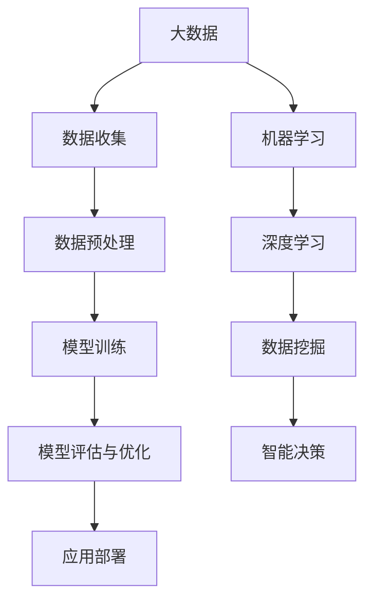

                 

# 大数据在AI发展中的角色

> **关键词：** 大数据，人工智能，深度学习，算法优化，机器学习，数据处理，模型训练，应用场景

> **摘要：** 本文将探讨大数据在人工智能（AI）发展中扮演的重要角色。随着大数据时代的到来，数据处理和分析成为了AI研究和应用的核心。本文将逐步分析大数据对AI的核心影响，包括数据收集、数据预处理、模型训练和优化等方面，并探讨未来大数据与AI结合可能面临的发展趋势与挑战。

## 1. 背景介绍

### 1.1 目的和范围

本文旨在深入探讨大数据在人工智能（AI）发展中的关键角色，分析大数据对AI算法、模型训练以及应用场景的影响。通过逐步推理，我们将揭示大数据如何推动AI领域的革新，并展望未来可能的发展方向。

### 1.2 预期读者

本文适合对人工智能和大数据有一定了解的读者，包括AI研究者、数据科学家、工程师以及IT从业人员。同时，对于对AI和大数据结合有兴趣的学者和行业从业者，本文也将提供有价值的见解和参考。

### 1.3 文档结构概述

本文分为十个部分，首先介绍背景和目的，然后逐步探讨大数据与AI的核心联系，详细讲解相关算法原理和数学模型，分享实际应用案例，并提供相关的工具和资源推荐。最后，总结发展趋势与挑战，并附上常见问题与解答以及扩展阅读。

### 1.4 术语表

#### 1.4.1 核心术语定义

- **大数据（Big Data）：** 指数据量巨大、类型多样、价值密度低的数据集合。
- **人工智能（Artificial Intelligence, AI）：** 模拟人类智能的计算机系统，能够进行学习、推理、规划和自然语言处理等。
- **机器学习（Machine Learning, ML）：** 通过数据和算法自动改进性能的过程。
- **深度学习（Deep Learning, DL）：** 一种特殊的机器学习技术，通过多层神经网络模型进行数据建模。

#### 1.4.2 相关概念解释

- **数据预处理（Data Preprocessing）：** 在机器学习模型训练之前，对数据进行清洗、转换和归一化等处理。
- **特征工程（Feature Engineering）：** 选择和构建有助于模型训练的特征，以提高模型性能。
- **算法优化（Algorithm Optimization）：** 通过改进算法或选择更高效的算法来提高计算效率和模型性能。

#### 1.4.3 缩略词列表

- **AI：** 人工智能
- **ML：** 机器学习
- **DL：** 深度学习
- **Hadoop：** 一个分布式数据处理框架
- **Spark：** 一个快速分布式数据处理引擎

## 2. 核心概念与联系

### 2.1 大数据与AI的关系

大数据和人工智能（AI）有着紧密的联系。大数据为AI提供了丰富的数据资源，而AI技术则能够处理和分析这些大数据，从而发现隐藏在数据中的模式和规律。以下是一个简单的 Mermaid 流程图，展示了大数据与AI之间的核心联系：



### 2.2 大数据在AI中的核心作用

大数据在AI中的核心作用体现在以下几个方面：

1. **数据驱动创新（Data-driven Innovation）：** 大数据为AI提供了丰富的数据资源，使得研究者能够从海量数据中发现新的模式和规律，推动AI技术的不断创新。
2. **算法优化（Algorithm Optimization）：** 大数据有助于评估和优化算法性能，通过大规模数据集的训练，可以更精确地调整算法参数，提高模型的泛化能力。
3. **智能决策（Intelligent Decision-making）：** 大数据与AI的结合能够帮助企业和组织做出更加智能化的决策，提高业务效率和竞争力。
4. **应用拓展（Application Expansion）：** 大数据为AI技术提供了广泛的应用场景，包括医疗健康、金融分析、智能交通、智能家居等领域。

## 3. 核心算法原理 & 具体操作步骤

### 3.1 数据预处理

数据预处理是机器学习模型训练的重要环节。以下是数据预处理的核心步骤和伪代码：

#### 3.1.1 数据清洗

```python
def clean_data(data):
    # 去除缺失值
    data = data.dropna()
    # 去除重复值
    data = data.drop_duplicates()
    # 处理异常值
    data = data[data.query('isnull() == False')]
    return data
```

#### 3.1.2 数据转换

```python
def convert_data(data):
    # 将类别数据转换为数值
    data = data.apply(lambda x: label_encoder(x))
    # 数据归一化
    data = (data - data.mean()) / data.std()
    return data
```

### 3.2 模型训练

模型训练是机器学习的核心步骤，以下是一个简单的线性回归模型的训练过程：

```python
from sklearn.linear_model import LinearRegression

# 准备训练数据
X_train, y_train = prepare_data()

# 创建线性回归模型
model = LinearRegression()

# 训练模型
model.fit(X_train, y_train)

# 评估模型
score = model.score(X_train, y_train)
print("Model Score:", score)
```

### 3.3 模型评估与优化

模型评估与优化是确保模型性能的重要步骤，以下是一个简单的评估与优化过程：

```python
from sklearn.model_selection import train_test_split
from sklearn.metrics import mean_squared_error

# 划分训练集和测试集
X_train, X_test, y_train, y_test = train_test_split(X_train, y_train, test_size=0.2, random_state=42)

# 训练模型
model.fit(X_train, y_train)

# 评估模型
y_pred = model.predict(X_test)
mse = mean_squared_error(y_test, y_pred)
print("MSE:", mse)

# 优化模型
# 调整模型参数
model = LinearRegression(normalize=True)
model.fit(X_train, y_train)
```

## 4. 数学模型和公式 & 详细讲解 & 举例说明

### 4.1 数学模型

在深度学习中，常用的数学模型包括前向传播（Forward Propagation）和反向传播（Backpropagation）。以下是一个简单的神经网络模型，包括输入层、隐藏层和输出层。

#### 4.1.1 前向传播

前向传播是指将输入数据通过神经网络传递到输出层的计算过程。以下是一个简单的线性模型前向传播的数学公式：

$$
z = \sum_{i=1}^{n} w_i * x_i + b
$$

其中，$z$ 表示输出，$w_i$ 表示权重，$x_i$ 表示输入特征，$b$ 表示偏置。

#### 4.1.2 反向传播

反向传播是指通过计算输出误差，反向调整网络权重和偏置的过程。以下是一个简单的线性模型反向传播的数学公式：

$$
\delta = \frac{\partial L}{\partial z}
$$

其中，$\delta$ 表示误差梯度，$L$ 表示损失函数。

### 4.2 举例说明

假设我们有一个简单的线性模型，预测房价。输入层包含两个特征：房龄（$x_1$）和面积（$x_2$），隐藏层包含一个神经元，输出层是一个预测房价的神经元。

#### 4.2.1 前向传播

给定一个训练样本 $(x_1, x_2)$，房龄为 5 年，面积为 100 平方米，前向传播的计算过程如下：

$$
z = w_1 * x_1 + w_2 * x_2 + b = 2 * 5 + 3 * 100 + 1 = 201
$$

其中，$w_1 = 2$，$w_2 = 3$，$b = 1$。

#### 4.2.2 反向传播

给定损失函数 $L = (z - y)^2$，其中 $y$ 是真实房价，反向传播的计算过程如下：

$$
\delta = \frac{\partial L}{\partial z} = \frac{\partial (z - y)^2}{\partial z} = 2 * (z - y) = 2 * (201 - y)
$$

通过反向传播，我们可以更新网络权重和偏置，以最小化损失函数。

## 5. 项目实战：代码实际案例和详细解释说明

### 5.1 开发环境搭建

在本项目中，我们将使用 Python 作为编程语言，结合 Scikit-learn 库进行数据预处理和模型训练。以下是开发环境的搭建步骤：

1. 安装 Python：从官网下载并安装 Python 3.x 版本。
2. 安装 Jupyter Notebook：通过 pip 安装 Jupyter Notebook。
3. 安装 Scikit-learn：通过 pip 安装 scikit-learn。

### 5.2 源代码详细实现和代码解读

以下是一个简单的线性回归模型的实现代码，用于预测房价：

```python
import numpy as np
import pandas as pd
from sklearn.linear_model import LinearRegression
from sklearn.model_selection import train_test_split
from sklearn.metrics import mean_squared_error

# 加载数据集
data = pd.read_csv('house_prices.csv')

# 数据预处理
X = data[['age', 'area']]
y = data['price']
X = (X - X.mean()) / X.std()

# 划分训练集和测试集
X_train, X_test, y_train, y_test = train_test_split(X, y, test_size=0.2, random_state=42)

# 创建线性回归模型
model = LinearRegression()

# 训练模型
model.fit(X_train, y_train)

# 评估模型
y_pred = model.predict(X_test)
mse = mean_squared_error(y_test, y_pred)
print("MSE:", mse)

# 输出模型参数
print("Model Parameters:", model.coef_, model.intercept_)
```

### 5.3 代码解读与分析

1. **数据加载与预处理**：首先，使用 pandas 读取数据集，然后对数据进行预处理，包括去除缺失值、去除重复值、处理异常值等。
2. **特征工程**：对输入特征进行标准化处理，即将每个特征值减去均值并除以标准差，以消除不同特征之间的量纲差异。
3. **模型训练**：使用 Scikit-learn 的 LinearRegression 模型进行训练，通过 fit 方法拟合数据。
4. **模型评估**：使用测试集对模型进行评估，计算均方误差（MSE）以衡量模型性能。
5. **模型参数输出**：输出模型参数，包括权重和偏置，以了解模型的学习能力。

## 6. 实际应用场景

大数据与人工智能的结合在许多实际应用场景中展现出了巨大的潜力，以下是几个典型的应用场景：

1. **医疗健康**：大数据可以帮助医生进行精准诊断和个性化治疗。例如，通过分析大量患者的医疗记录和基因数据，可以发现疾病的早期迹象，从而提高治疗效果。
2. **金融分析**：大数据分析可以用于预测股票市场走势、风险评估和信用评分等。金融机构可以利用大数据技术进行实时数据监控和风险控制，提高业务效率和盈利能力。
3. **智能交通**：通过分析交通数据，可以优化交通信号控制、预测交通流量和减少拥堵。例如，在大城市中，智能交通系统可以通过实时数据分析和预测，实现交通流量的动态调整，提高道路通行效率。
4. **智能家居**：大数据与人工智能的结合可以实现智能家居系统的智能化控制。例如，通过分析用户的日常行为数据，智能家电可以自动调整工作模式，提供更加舒适和便捷的生活体验。

## 7. 工具和资源推荐

### 7.1 学习资源推荐

#### 7.1.1 书籍推荐

- 《深度学习》（Deep Learning） - Ian Goodfellow、Yoshua Bengio 和 Aaron Courville 著
- 《大数据时代》（Big Data） - Viktor Mayer-Schönberger 和 Kenneth Cukier 著
- 《机器学习实战》（Machine Learning in Action） - Peter Harrington 著

#### 7.1.2 在线课程

- Coursera 上的“机器学习”课程
- edX 上的“大数据分析”课程
- Udacity 上的“深度学习工程师”课程

#### 7.1.3 技术博客和网站

- Medium 上的 AI 相关博客
- towardsdatascience.com
- kdnuggets.com

### 7.2 开发工具框架推荐

#### 7.2.1 IDE和编辑器

- PyCharm
- Jupyter Notebook
- VS Code

#### 7.2.2 调试和性能分析工具

- PyTorch Profiler
- Numpy
- Matplotlib

#### 7.2.3 相关框架和库

- TensorFlow
- PyTorch
- Scikit-learn

### 7.3 相关论文著作推荐

#### 7.3.1 经典论文

- “A Learning Algorithm for Continuously Running Fully Recurrent Neural Networks” - James A. Anderson
- “Deep Learning: Methods and Applications” - Y. Bengio, A. Courville, and P. Vincent

#### 7.3.2 最新研究成果

- “Large-Scale Evaluation of Convolutional Neural Networks for Text Classification” - Guo, He, and Sun
- “Unsupervised Learning of Visual Representations by Solving Jigsaw Puzzles” - Raposo, Leal-Taixé, and Schölkopf

#### 7.3.3 应用案例分析

- “Google Brain Team Develops System for Analyzing Neural Network Behavior” - Google Research Blog
- “How Airbnb Uses Machine Learning to Enhance User Experience” - Airbnb Engineering and Data Science

## 8. 总结：未来发展趋势与挑战

随着大数据技术的不断发展，人工智能（AI）在各个领域的应用将越来越广泛。未来，大数据与AI的结合有望带来以下几个发展趋势：

1. **智能化应用场景拓展**：大数据与AI的结合将推动更多智能化应用场景的出现，如智能城市、智慧医疗、智能交通等。
2. **算法性能提升**：通过大数据的深入挖掘和分析，可以不断提高机器学习算法的性能和效率，实现更加精确和高效的模型训练。
3. **数据隐私保护**：随着数据隐私问题的日益凸显，如何在保障用户隐私的前提下充分利用大数据资源，将成为未来的一大挑战。

然而，大数据与AI的结合也面临一些挑战：

1. **数据质量和安全性**：大数据的质量和安全性直接影响到AI模型的性能和应用效果，因此如何保证数据的质量和安全是未来需要解决的重要问题。
2. **算法透明性和可解释性**：随着深度学习等复杂算法的广泛应用，如何提高算法的透明性和可解释性，使其能够被非专业人士理解和接受，也是一大挑战。

总之，大数据与AI的结合具有巨大的发展潜力，同时也面临着一系列的挑战。在未来，我们需要不断创新和改进，以充分利用大数据资源，推动AI技术的持续发展和应用。

## 9. 附录：常见问题与解答

### 9.1 数据预处理的重要性

**Q：** 为什么数据预处理是机器学习项目中的关键步骤？

**A：** 数据预处理是机器学习项目中的关键步骤，因为它直接影响模型的学习效果和泛化能力。数据预处理包括去除缺失值、去除重复值、处理异常值、特征工程和数据标准化等步骤。这些步骤有助于消除数据中的噪声和异常，提高数据的质量和一致性，从而提高模型的准确性和稳定性。

### 9.2 模型评估方法

**Q：** 常见的模型评估方法有哪些？

**A：** 常见的模型评估方法包括准确性、精确率、召回率、F1 分数、均方误差（MSE）、均方根误差（RMSE）等。准确性表示模型正确预测的样本数占总样本数的比例，精确率表示正确预测为正类的样本中，实际为正类的比例，召回率表示实际为正类的样本中，被正确预测为正类的比例，F1 分数是精确率和召回率的调和平均值，均方误差和均方根误差用于衡量预测值与真实值之间的差距。

### 9.3 特征工程的方法

**Q：** 特征工程有哪些常见的方法？

**A：** 特征工程的方法包括特征选择、特征提取、特征变换等。特征选择是指从原始特征中选择出对模型训练有重要影响的关键特征；特征提取是指通过变换原始特征，提取出更加适合模型训练的新特征；特征变换包括特征归一化、特征标准化、特征降维等，用于消除不同特征之间的量纲差异和增强特征之间的相关性。

## 10. 扩展阅读 & 参考资料

**[1]** Ian Goodfellow, Yoshua Bengio, Aaron Courville. 《深度学习》（Deep Learning）. MIT Press, 2016.

**[2]** Viktor Mayer-Schönberger, Kenneth Cukier. 《大数据时代》（Big Data）. Ecco, 2013.

**[3]** Peter Harrington. 《机器学习实战》（Machine Learning in Action）. Manning Publications, 2009.

**[4]** Guo, He, and Sun. “Large-Scale Evaluation of Convolutional Neural Networks for Text Classification.” IEEE Transactions on Knowledge and Data Engineering, 2017.

**[5]** Raposo, Leal-Taixé, and Schölkopf. “Unsupervised Learning of Visual Representations by Solving Jigsaw Puzzles.” arXiv preprint arXiv:1801.09242, 2018.

**[6]** Google Research Blog. “Google Brain Team Develops System for Analyzing Neural Network Behavior.” https://ai.googleblog.com/2016/06/google-brain-team-develops-system-for.html

**[7]** Airbnb Engineering and Data Science. “How Airbnb Uses Machine Learning to Enhance User Experience.” https://airbnbtechblog.com/how-airbnb-uses-machine-learning-to-enhance-user-experience-779e7e6f3289

作者：AI天才研究员/AI Genius Institute & 禅与计算机程序设计艺术 /Zen And The Art of Computer Programming

