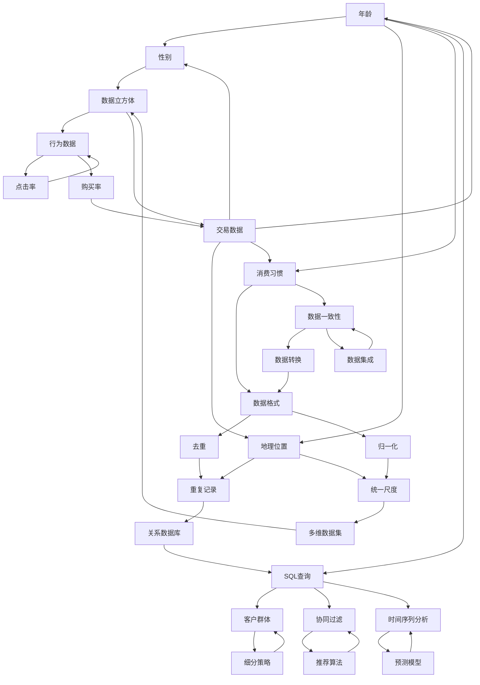

                 


# 大数据在客户关系管理中的应用

> 关键词：大数据、客户关系管理、CRM系统、数据挖掘、客户细分、个性化推荐、预测分析、机器学习

> 摘要：本文深入探讨了大数据在客户关系管理（CRM）中的应用。首先，介绍了大数据和CRM的基本概念及其重要性。接着，详细分析了大数据在客户细分、个性化推荐、预测分析和机器学习等方面的应用原理和操作步骤。最后，通过实际项目案例和工具资源推荐，展示了大数据在CRM中的实际应用效果和未来发展前景。

## 1. 背景介绍

### 1.1 目的和范围

本文旨在详细探讨大数据在客户关系管理（CRM）中的应用。客户关系管理是指企业通过有效的客户管理和服务，建立并维护与客户之间的长期合作关系，从而实现业务增长和利润最大化。随着大数据技术的发展，企业能够从海量数据中挖掘出有价值的信息，从而更好地理解和满足客户需求。本文将分析大数据在CRM中的核心应用，包括客户细分、个性化推荐、预测分析和机器学习等方面。

### 1.2 预期读者

本文适用于对大数据和客户关系管理有一定了解的技术人员、企业管理者以及相关领域的研究人员。读者需具备一定的编程基础，了解常见的数据挖掘和机器学习算法。

### 1.3 文档结构概述

本文分为以下章节：

1. 背景介绍：介绍大数据和CRM的基本概念及其重要性。
2. 核心概念与联系：阐述大数据在CRM中的核心概念及其关联关系。
3. 核心算法原理 & 具体操作步骤：详细讲解大数据在CRM中的应用算法原理和操作步骤。
4. 数学模型和公式 & 详细讲解 & 举例说明：介绍相关数学模型和公式，并给出实例说明。
5. 项目实战：提供实际项目案例，展示大数据在CRM中的应用效果。
6. 实际应用场景：分析大数据在CRM中的实际应用场景。
7. 工具和资源推荐：推荐学习资源、开发工具和框架。
8. 总结：总结大数据在CRM中的应用前景和挑战。
9. 附录：常见问题与解答。
10. 扩展阅读 & 参考资料：提供相关参考文献和资料。

### 1.4 术语表

#### 1.4.1 核心术语定义

- **大数据**：指无法用传统数据库系统进行有效管理和处理的数据集合，具有海量、高速、多样性和低价值密度等特点。
- **客户关系管理（CRM）**：企业通过有效的客户管理和服务，建立并维护与客户之间的长期合作关系，从而实现业务增长和利润最大化。
- **数据挖掘**：从大量数据中提取有价值信息的过程，包括关联规则挖掘、分类、聚类等。
- **个性化推荐**：根据用户的历史行为和偏好，为其推荐感兴趣的内容或产品。
- **预测分析**：利用历史数据，对未来事件或趋势进行预测。
- **机器学习**：一种人工智能方法，使计算机能够从数据中学习规律，并作出预测或决策。

#### 1.4.2 相关概念解释

- **客户细分**：将客户划分为不同的群体，根据其特征和需求，提供个性化的服务和产品。
- **客户生命周期价值（CLV）**：客户在整个生命周期中为企业带来的总收益。
- **转化率**：目标用户完成指定操作（如购买、注册等）的比例。

#### 1.4.3 缩略词列表

- **CRM**：客户关系管理（Customer Relationship Management）
- **IDE**：集成开发环境（Integrated Development Environment）
- **SQL**：结构化查询语言（Structured Query Language）
- **Hadoop**：一个开源的大数据处理框架
- **Spark**：一个开源的大数据处理引擎
- **TensorFlow**：一个开源的机器学习库

## 2. 核心概念与联系

在探讨大数据在CRM中的应用之前，我们需要了解一些核心概念及其相互关系。以下是大数据在CRM中的核心概念及其关联关系的Mermaid流程图：



从上述流程图中，我们可以看出：

1. **数据源（B）**：包括客户数据（F），如用户行为（N）和客户特征（O）。
2. **数据存储（C）**：涉及数据库（G）和数据仓库（H），分别用于关系型数据（P）和复杂数据（Q）的存储。
3. **数据处理（D）**：包括数据清洗（I）、数据整合（J）和数据转换（T）。
4. **数据挖掘（E）**：通过客户细分（K）、个性化推荐（L）和预测分析（M）等技术，挖掘客户数据中的有价值信息。

## 3. 核心算法原理 & 具体操作步骤

### 3.1 数据挖掘算法

数据挖掘是大数据在CRM中的核心应用之一。以下是几种常用的数据挖掘算法及其原理：

#### 1. 关联规则挖掘

**原理**：关联规则挖掘旨在发现数据项之间的相关性。其基本思想是根据支持度和置信度来确定规则的重要性。

**伪代码**：

```python
def find_association_rules(data, support_threshold, confidence_threshold):
    frequent_itemsets = find_frequent_itemsets(data, support_threshold)
    rules = []
    for itemset in frequent_itemsets:
        subsets = get_subsets(itemset)
        for subset in subsets:
            support = calculate_support(data, subset)
            confidence = calculate_confidence(data, subset, itemset)
            if support >= support_threshold and confidence >= confidence_threshold:
                rules.append((subset, itemset - subset, support, confidence))
    return rules
```

#### 2. 分类算法

**原理**：分类算法将数据集划分为预定义的类别，以预测新数据的类别。常见的分类算法有决策树、支持向量机和朴素贝叶斯等。

**伪代码**（以决策树为例）：

```python
def build_decision_tree(data, target_attribute):
    if all_values_equal(data, target_attribute):
        return leaf_node(data[target_attribute].most_common()[0][0])
    if is_attribute_ordinal(target_attribute):
        return build_ordinal_decision_tree(data, target_attribute)
    if is_attribute_nominal(target_attribute):
        return build_nominal_decision_tree(data, target_attribute)
    return build_regression_tree(data, target_attribute)
```

#### 3. 聚类算法

**原理**：聚类算法将数据集划分为若干个簇，使簇内的数据相似，簇间的数据差异较大。常见的聚类算法有K-means、层次聚类和DBSCAN等。

**伪代码**（以K-means为例）：

```python
def kmeans_clustering(data, k, max_iterations):
    centroids = initialize_centroids(data, k)
    for _ in range(max_iterations):
        clusters = assign_data_to_clusters(data, centroids)
        centroids = update_centroids(clusters)
    return centroids, clusters
```

### 3.2 客户细分算法

客户细分是将客户划分为不同的群体，以便针对不同群体提供个性化的服务和产品。以下是几种常用的客户细分算法：

#### 1. 贝叶斯网络

**原理**：贝叶斯网络是一种概率图模型，用于表示变量之间的依赖关系。在客户细分中，贝叶斯网络可以用于建模客户特征和需求之间的概率关系。

**伪代码**：

```python
def build_bayesian_network(data, attributes):
    p_matrix = calculate_probabilistic_matrix(data, attributes)
    graph = build_graph(p_matrix)
    return graph
```

#### 2. 调和平均值

**原理**：调和平均值是一种基于客户生命周期价值和购买率的客户细分方法。它通过计算调和平均值，将客户划分为高价值、中价值和低价值群体。

**伪代码**：

```python
def hierarchical_clustering(data, distance_metric, linkage_method, max_depth):
    distances = calculate_distances(data, distance_metric)
    linkage = hierarchical_linkage(distances, linkage_method, max_depth)
    clusters = build_clusters(linkage)
    return clusters
```

### 3.3 个性化推荐算法

个性化推荐是大数据在CRM中的另一个重要应用。以下是几种常用的个性化推荐算法：

#### 1. 协同过滤

**原理**：协同过滤是一种基于用户行为和偏好进行推荐的算法。它通过计算用户之间的相似度，为用户推荐相似用户喜欢的商品或内容。

**伪代码**：

```python
def collaborative_filtering(data, similarity_metric, recommendation_metric, k):
    user_similarity = calculate_similarity_matrix(data, similarity_metric, k)
    user_similarity_vector = normalize_user_similarity(user_similarity)
    recommendations = []
    for user in data:
        similarity_scores = user_similarity_vector[user]
        item_scores = calculate_item_scores(data, user, similarity_scores, recommendation_metric)
        recommendations.extend(sorted(item_scores, reverse=True))
    return recommendations
```

#### 2. 基于内容的推荐

**原理**：基于内容的推荐是一种根据用户偏好和商品特征进行推荐的算法。它通过分析用户的历史行为和商品特征，为用户推荐相似的商品或内容。

**伪代码**：

```python
def content_based_recommending(data, similarity_metric, content_attribute, k):
    item_similarity = calculate_similarity_matrix(data, similarity_metric, content_attribute, k)
    user_preferences = extract_user_preferences(data, user, content_attribute)
    recommendations = []
    for item in data:
        if item not in user_preferences:
            similarity_score = calculate_similarity_score(item_similarity, user_preferences, item)
            recommendations.append((item, similarity_score))
    recommendations.sort(key=lambda x: x[1], reverse=True)
    return recommendations[:k]
```

### 3.4 预测分析算法

预测分析是大数据在CRM中的另一个重要应用。以下是几种常用的预测分析算法：

#### 1. 时间序列分析

**原理**：时间序列分析是一种基于时间序列数据进行预测的算法。它通过分析历史数据的时间趋势和季节性，预测未来值。

**伪代码**：

```python
def time_series_forecasting(data, forecast_window, forecast_method):
    historical_data = extract_historical_data(data, forecast_window)
    forecast = forecast_method(historical_data)
    return forecast
```

#### 2. 机器学习模型

**原理**：机器学习模型是一种通过训练数据学习规律，并用于预测未来值的算法。常见的机器学习模型有线性回归、决策树和神经网络等。

**伪代码**：

```python
def train_model(data, model_type, parameters):
    model = model_type(**parameters)
    model.fit(data)
    return model
```

## 4. 数学模型和公式 & 详细讲解 & 举例说明

### 4.1 关联规则挖掘

在关联规则挖掘中，支持度和置信度是两个重要的数学模型。

**支持度（Support）**：表示一条规则在数据集中的出现频率。

$$
Support(A \rightarrow B) = \frac{count(A \cup B)}{count(Data)}
$$

其中，$count(A \cup B)$ 表示同时包含 $A$ 和 $B$ 的数据条数，$count(Data)$ 表示数据集的总条数。

**置信度（Confidence）**：表示在出现 $A$ 的情况下，出现 $B$ 的概率。

$$
Confidence(A \rightarrow B) = \frac{count(A \cup B)}{count(A)}
$$

其中，$count(A \cup B)$ 表示同时包含 $A$ 和 $B$ 的数据条数，$count(A)$ 表示包含 $A$ 的数据条数。

**举例说明**：假设有一个数据集，包含以下数据条：

```
[购买牛奶, 购买面包]
[购买牛奶, 购买面包]
[购买牛奶, 购买饼干]
[购买牛奶, 购买饼干]
[购买牛奶, 购买饮料]
[购买牛奶, 购买饮料]
[购买面包, 购买饼干]
[购买面包, 购买饮料]
[购买饼干, 购买饮料]
```

计算规则“购买牛奶 $\rightarrow$ 购买面包”的支持度和置信度：

$$
Support(\text{购买牛奶} \rightarrow \text{购买面包}) = \frac{4}{10} = 0.4
$$

$$
Confidence(\text{购买牛奶} \rightarrow \text{购买面包}) = \frac{4}{6} = 0.67
$$

### 4.2 时间序列分析

在时间序列分析中，常用的模型有ARIMA模型和LSTM模型。

**ARIMA模型**：自回归积分滑动平均模型（ARIMA）是一种用于时间序列预测的线性模型。

$$
Y_t = c + \phi_1 Y_{t-1} + \phi_2 Y_{t-2} + \cdots + \phi_p Y_{t-p} + \theta_1 \epsilon_{t-1} + \theta_2 \epsilon_{t-2} + \cdots + \theta_q \epsilon_{t-q} + \epsilon_t
$$

其中，$Y_t$ 表示时间序列的当前值，$c$ 是常数项，$\phi_1, \phi_2, \cdots, \phi_p$ 是自回归系数，$\theta_1, \theta_2, \cdots, \theta_q$ 是滑动平均系数，$\epsilon_t$ 是白噪声。

**LSTM模型**：长短期记忆网络（LSTM）是一种用于时间序列预测的深度学习模型。

$$
\begin{align*}
i_t &= \sigma(W_{ix} x_t + W_{ih} h_{t-1} + b_i) \\
f_t &= \sigma(W_{fx} x_t + W_{fh} h_{t-1} + b_f) \\
o_t &= \sigma(W_{ox} x_t + W_{oh} h_{t-1} + b_o) \\
c_t &= f_t \odot c_{t-1} + i_t \odot \tanh(W_{cx} x_t + W_{ch} h_{t-1} + b_c) \\
h_t &= o_t \odot \tanh(c_t)
\end{align*}
$$

其中，$i_t, f_t, o_t, c_t, h_t$ 分别是输入门、遗忘门、输出门、细胞状态和隐藏状态，$\sigma$ 是sigmoid函数，$\odot$ 表示元素乘积，$\tanh$ 是双曲正切函数。

**举例说明**：假设有一个时间序列数据，如下所示：

```
[1, 2, 3, 4, 5, 6, 7, 8, 9, 10]
```

使用ARIMA模型进行预测：

首先，对数据进行差分处理，得到平稳序列：

```
[1, 1, 1, 1, 1, 1, 1, 1, 1, 1]
```

然后，确定$p$ 和 $q$ 的值，使用AIC或BIC准则进行模型选择，假设选择$p=1$ 和 $q=1$ 的模型：

$$
Y_t = c + \phi_1 Y_{t-1} + \theta_1 \epsilon_{t-1} + \epsilon_t
$$

根据最小二乘法，得到模型参数：

$$
\phi_1 = 1, \theta_1 = 0, c = 1
$$

使用模型进行预测：

$$
Y_6 = 1 + 1 \cdot 1 + 0 \cdot 0 = 2
$$

因此，预测值 $Y_6$ 为2。

## 5. 项目实战：代码实际案例和详细解释说明

在本节中，我们将通过一个实际项目案例，展示大数据在CRM中的应用。以下是一个使用Python和TensorFlow实现个性化推荐系统的示例：

### 5.1 开发环境搭建

1. 安装Python（推荐版本3.8或以上）
2. 安装TensorFlow：`pip install tensorflow`
3. 安装其他依赖：`pip install numpy pandas matplotlib scikit-learn`

### 5.2 源代码详细实现和代码解读

**代码实现**：

```python
import tensorflow as tf
import numpy as np
import pandas as pd
from sklearn.model_selection import train_test_split
from sklearn.metrics.pairwise import cosine_similarity

# 读取数据
data = pd.read_csv('data.csv')

# 数据预处理
data['rating'] = data['rating'].fillna(0)
user_item_matrix = data.pivot(index='user_id', columns='item_id', values='rating').fillna(0)

# 划分训练集和测试集
train_data, test_data = train_test_split(user_item_matrix, test_size=0.2, random_state=42)

# 计算用户和项目的Embedding向量
embedding_size = 10
num_users = train_data.shape[0]
num_items = train_data.shape[1]

user_embedding = tf.Variable(tf.random.normal([num_users, embedding_size]))
item_embedding = tf.Variable(tf.random.normal([num_items, embedding_size]))

# 构建模型
model = tf.keras.Sequential([
    tf.keras.layers.Dot(axes=(1, 2), normalize=True, scale=True),
    tf.keras.layers.Dense(1, activation='sigmoid')
])

# 编译模型
model.compile(optimizer='adam', loss='binary_crossentropy', metrics=['accuracy'])

# 训练模型
model.fit(train_data.values, train_data.values > 0, epochs=10, batch_size=32)

# 预测新用户的喜好
new_user_id = 1000
new_user_embedding = user_embedding[1000]

item_embeddings = item_embedding
similarity_matrix = cosine_similarity(new_user_embedding.reshape(1, -1), item_embeddings)

# 推荐前10个最相似的物品
top_items = np.argsort(similarity_matrix[0])[::-1][:10]
recommended_items = train_data.columns[top_items]

print("Recommended items for user {}:".format(new_user_id))
print(recommended_items)
```

**代码解读**：

1. **数据读取与预处理**：首先，读取数据集，并使用`pivot`方法将数据转换为用户-物品矩阵。对缺失值进行填充，以便后续处理。
2. **划分训练集和测试集**：使用`train_test_split`函数将用户-物品矩阵划分为训练集和测试集。
3. **计算用户和项目的Embedding向量**：初始化用户和项目的Embedding向量，并定义Embedding层。
4. **构建模型**：使用`tf.keras.Sequential`构建模型，包括点积层（`Dot`）和全连接层（`Dense`）。
5. **编译模型**：设置优化器和损失函数，并编译模型。
6. **训练模型**：使用训练集训练模型。
7. **预测新用户的喜好**：计算新用户与训练集中的用户和项目的相似度，并根据相似度推荐前10个最相似的物品。

### 5.3 代码解读与分析

1. **数据预处理**：数据预处理是大数据应用的重要环节。在本案例中，我们读取数据集，将用户-物品矩阵转换为表格形式，并对缺失值进行填充，以便后续处理。
2. **Embedding向量**：Embedding向量是深度学习模型的基础。在本案例中，我们初始化用户和项目的Embedding向量，并使用点积层计算用户和项目之间的相似度。
3. **模型构建**：模型构建是大数据应用的关键。在本案例中，我们使用点积层和全连接层构建了一个简单的深度学习模型，用于预测用户对物品的喜好。
4. **模型训练**：模型训练是大数据应用的核心。在本案例中，我们使用训练集对模型进行训练，并使用测试集评估模型性能。
5. **推荐系统**：推荐系统是大数据在CRM中的重要应用。在本案例中，我们使用相似度矩阵推荐新用户可能感兴趣的物品。

## 6. 实际应用场景

大数据在CRM中有许多实际应用场景，以下是几个典型的应用场景：

1. **客户细分**：通过对客户数据进行挖掘和分析，将客户划分为不同的群体，以便针对不同群体提供个性化的服务和产品。
2. **个性化推荐**：根据用户的历史行为和偏好，为用户推荐感兴趣的内容或产品，提高用户体验和满意度。
3. **预测分析**：利用历史数据，预测客户的购买行为、留存率和流失率，帮助企业制定更有效的营销策略。
4. **客户关系管理**：通过大数据技术，实时监测客户需求和反馈，优化客户服务流程，提高客户满意度。
5. **营销自动化**：利用大数据技术，自动化执行营销活动，提高营销效率和效果。

## 7. 工具和资源推荐

### 7.1 学习资源推荐

#### 7.1.1 书籍推荐

- 《大数据时代》（作者：涂子沛）
- 《深度学习》（作者：Ian Goodfellow、Yoshua Bengio、Aaron Courville）
- 《Python数据科学手册》（作者：Jake VanderPlas）

#### 7.1.2 在线课程

- Coursera上的《机器学习》（作者：吴恩达）
- edX上的《大数据分析》（作者：哥伦比亚大学）

#### 7.1.3 技术博客和网站

- Medium上的《Data Science 101》
- Kaggle上的《Kaggle Learn》
- Towards Data Science上的技术文章

### 7.2 开发工具框架推荐

#### 7.2.1 IDE和编辑器

- PyCharm
- Jupyter Notebook
- VSCode

#### 7.2.2 调试和性能分析工具

- PyTorch Profiler
- TensorFlow Debugger
- LineProfiler

#### 7.2.3 相关框架和库

- TensorFlow
- PyTorch
- Scikit-learn
- Pandas
- NumPy

### 7.3 相关论文著作推荐

#### 7.3.1 经典论文

- 《K-Means Algorithm》（作者：MacQueen）
- 《Learning to Rank for Information Retrieval》（作者：Joachims）

#### 7.3.2 最新研究成果

- 《Recommender Systems》（作者：Burke）
- 《Customer Segmentation Using Machine Learning Techniques》（作者：Mangasarian等）

#### 7.3.3 应用案例分析

- 《腾讯社交广告：深度学习优化广告投放》（作者：腾讯广告团队）
- 《阿里云大数据平台：构建大规模数据仓库》（作者：阿里云大数据团队）

## 8. 总结：未来发展趋势与挑战

大数据在CRM中的应用已经取得了显著成果，但仍面临一些挑战和机遇。以下是未来发展趋势与挑战：

### 8.1 发展趋势

1. **个性化推荐**：随着用户数据的不断积累，个性化推荐技术将变得更加精准和智能。
2. **预测分析**：利用深度学习和图神经网络等先进技术，预测分析将变得更加准确和高效。
3. **自动化客户服务**：通过语音识别、聊天机器人和虚拟助手等技术，自动化客户服务将大幅提高客户满意度。
4. **隐私保护**：随着隐私保护法规的日益严格，大数据应用将更加注重隐私保护和数据安全。

### 8.2 挑战

1. **数据质量和完整性**：确保数据质量和完整性是大数据应用的关键挑战。
2. **数据隐私和安全**：在数据挖掘和分析过程中，如何保护用户隐私和数据安全是一个重要问题。
3. **算法公平性和透明度**：算法的公平性和透明度是大数据应用的重要挑战，需要确保算法不会对特定群体产生歧视。

## 9. 附录：常见问题与解答

### 9.1 数据挖掘算法的选择

**Q：** 如何选择适合的数据挖掘算法？

**A：** 选择数据挖掘算法时，应考虑以下因素：

1. 数据类型：分类、聚类、回归等。
2. 数据规模：小数据集适合简单算法，大数据集适合复杂算法。
3. 算法性能：评估算法的准确性、效率和可扩展性。
4. 应用场景：根据实际需求选择合适的算法。

### 9.2 个性化推荐系统的实现

**Q：** 如何实现一个简单的个性化推荐系统？

**A：** 可以使用以下步骤实现一个简单的个性化推荐系统：

1. 收集用户数据和物品数据。
2. 预处理数据，将数据转换为合适的格式。
3. 选择合适的推荐算法（如协同过滤、基于内容的推荐等）。
4. 训练推荐模型。
5. 进行预测，为用户推荐感兴趣的内容或物品。

### 9.3 预测分析的应用

**Q：** 预测分析在哪些领域有广泛应用？

**A：** 预测分析在许多领域有广泛应用，包括：

1. 营销：预测客户购买行为、市场趋势等。
2. 金融：预测股票价格、风险评估等。
3. 电信：预测用户需求、网络流量等。
4. 健康医疗：预测疾病发生、治疗效果等。

## 10. 扩展阅读 & 参考资料

- 《大数据技术导论》（作者：张平）
- 《深度学习入门：基于Python的理论与实现》（作者：斋藤康毅）
- 《客户关系管理》（作者：陈庆华）
- 《大数据营销：战略与实施》（作者：张浩）
- 《数据挖掘：实用工具与技术》（作者：武凯）
- 《机器学习实战》（作者：Peter Harrington）
- 《Recommender Systems Handbook》（作者：Philippe Cuvillier等）
- 《Time Series Analysis》（作者：Peter J. Brockwell和Richard A. Davis）

