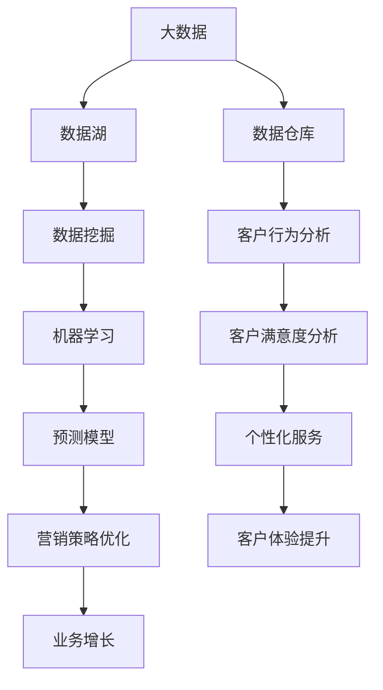

                 

# 大数据在客户关系管理中的应用

> **关键词：** 大数据，客户关系管理，数据分析，预测模型，客户行为，客户体验

> **摘要：** 本文将探讨大数据在客户关系管理中的重要性及其应用。通过分析大数据的基本原理，我们将了解如何利用大数据技术提升客户满意度、优化营销策略和实现个性化服务。此外，本文还将提供具体的算法和实际案例，以展示大数据在客户关系管理中的实际效果。

## 1. 背景介绍

### 1.1 目的和范围

本文旨在探讨大数据在客户关系管理（CRM）中的应用，通过深入分析大数据的核心概念、技术手段和应用场景，揭示其在提升企业竞争力、优化客户体验和实现可持续增长方面的价值。本文将覆盖以下主要内容：

- 大数据的定义和核心概念
- 大数据在客户关系管理中的重要性
- 大数据在CRM中的具体应用场景
- 核心算法原理和数学模型
- 项目实战：代码实际案例和详细解释
- 实际应用场景
- 工具和资源推荐
- 未来发展趋势与挑战

### 1.2 预期读者

本文适合以下读者群体：

- 数据分析师和CRM专业人员
- 市场营销经理和业务分析师
- 技术架构师和软件开发人员
- 对大数据和客户关系管理有兴趣的学习者

### 1.3 文档结构概述

本文的结构如下：

- **第1章：背景介绍**：介绍本文的目的、范围、预期读者和文档结构。
- **第2章：核心概念与联系**：定义大数据和相关术语，提供Mermaid流程图展示核心概念和联系。
- **第3章：核心算法原理 & 具体操作步骤**：介绍用于客户关系管理的大数据算法原理和具体操作步骤。
- **第4章：数学模型和公式 & 详细讲解 & 举例说明**：详细讲解数学模型和公式，并提供实例说明。
- **第5章：项目实战：代码实际案例和详细解释说明**：提供实际案例和代码实现，详细解读和分析。
- **第6章：实际应用场景**：展示大数据在CRM中的实际应用场景。
- **第7章：工具和资源推荐**：推荐学习资源、开发工具和框架。
- **第8章：总结：未来发展趋势与挑战**：总结本文的核心内容，探讨未来发展趋势和挑战。
- **第9章：附录：常见问题与解答**：提供常见问题的解答。
- **第10章：扩展阅读 & 参考资料**：推荐相关文献和资源。

### 1.4 术语表

#### 1.4.1 核心术语定义

- **大数据（Big Data）**：指的是数据量巨大、种类繁多、处理速度快的数据集合。
- **客户关系管理（CRM）**：一种企业战略，旨在通过维护和管理客户关系来提高客户满意度、忠诚度和盈利能力。
- **数据挖掘（Data Mining）**：从大量数据中提取有价值信息和模式的过程。
- **机器学习（Machine Learning）**：使计算机通过数据学习并做出决策的技术。

#### 1.4.2 相关概念解释

- **数据湖（Data Lake）**：一种存储大量结构化和非结构化数据的技术架构。
- **数据仓库（Data Warehouse）**：一种用于存储、管理和分析企业历史数据的系统。
- **实时分析（Real-time Analysis）**：在数据生成时即刻进行分析和决策的技术。

#### 1.4.3 缩略词列表

- **CRM**：客户关系管理
- **Hadoop**：分布式数据处理框架
- **Spark**：分布式数据处理引擎
- **R**：统计计算和数据分析语言

## 2. 核心概念与联系

在探讨大数据在客户关系管理中的应用之前，我们需要先理解一些核心概念和技术架构。以下是一个Mermaid流程图，展示了大数据和CRM相关的主要概念及其联系。



### 2.1 大数据的定义和分类

大数据通常指数据量巨大、种类繁多、处理速度快的数据集合。根据数据的不同特点，大数据可以分为以下几种类型：

- **结构化数据**：如关系数据库中的数据，具备固定的格式和结构。
- **非结构化数据**：如文本、图片、音频和视频，没有固定的格式和结构。
- **半结构化数据**：如XML、JSON等，具备部分结构但不够严格。

### 2.2 数据湖和数据仓库

- **数据湖**：数据湖是一种技术架构，用于存储大量结构化和非结构化数据。它支持数据的多样性、灵活性和扩展性，适用于大规模数据处理和实时分析。
- **数据仓库**：数据仓库是一种用于存储、管理和分析企业历史数据的系统。它通常用于支持企业决策、业务分析和数据挖掘。

### 2.3 数据挖掘和机器学习

- **数据挖掘**：数据挖掘是从大量数据中提取有价值信息和模式的过程。它涉及统计分析、模式识别和机器学习技术。
- **机器学习**：机器学习是一种使计算机通过数据学习并做出决策的技术。它包括监督学习、无监督学习和强化学习等方法。

### 2.4 客户关系管理中的大数据应用

在客户关系管理中，大数据的应用主要体现在以下几个方面：

- **客户行为分析**：通过分析客户行为数据，了解客户偏好、购买习惯和需求，为个性化服务和营销策略提供依据。
- **客户满意度分析**：通过分析客户反馈和评价数据，了解客户满意度，优化产品和服务，提升客户体验。
- **预测模型**：利用大数据和机器学习技术，构建预测模型，预测客户行为和需求，优化营销策略和业务增长。
- **个性化服务**：基于客户数据和偏好，提供个性化的服务和推荐，提高客户满意度和忠诚度。
- **营销策略优化**：通过分析客户行为和反馈数据，优化营销策略，提高营销效果和投资回报率。

## 3. 核心算法原理 & 具体操作步骤

### 3.1 数据预处理

在应用大数据技术之前，数据预处理是关键步骤。数据预处理主要包括数据清洗、数据整合和数据归一化等。

- **数据清洗**：去除重复数据、错误数据和缺失数据，确保数据质量。
- **数据整合**：将不同来源的数据进行整合，建立统一的数据视图。
- **数据归一化**：将不同尺度和单位的数据进行归一化处理，便于后续分析。

### 3.2 数据挖掘算法

在客户关系管理中，常用的数据挖掘算法包括聚类、分类和关联规则挖掘等。

- **聚类算法**：将相似的数据点归为一类，用于客户细分和市场细分。
  ```python
  # 聚类算法伪代码
  function clustering(data, k):
      # 初始化k个簇的中心点
      centroids = initialize_centroids(data, k)
      while not converged:
          # 分配数据点到簇
          clusters = assign_points_to_clusters(data, centroids)
          # 更新簇的中心点
          centroids = update_centroids(clusters)
      return clusters
  ```

- **分类算法**：将数据点分为不同的类别，用于预测客户行为和分类客户。
  ```python
  # 分类算法伪代码
  function classification(data, labels, model):
      for each data point in data:
          predict = model.predict(data_point)
          assign label to data_point
      return predictions
  ```

- **关联规则挖掘**：发现数据之间的关联关系，用于推荐系统和客户细分。
  ```python
  # 关联规则挖掘伪代码
  function apriori(data, support_threshold, confidence_threshold):
      # 生成频繁项集
      frequent_itemsets = generate_frequent_itemsets(data, support_threshold)
      # 生成关联规则
      rules = generate_association_rules(frequent_itemsets, confidence_threshold)
      return rules
  ```

### 3.3 机器学习算法

在客户关系管理中，机器学习算法主要用于构建预测模型和实现个性化服务。

- **回归分析**：预测连续值变量，如客户生命周期价值（CLV）。
  ```python
  # 回归分析伪代码
  function linear_regression(X, y):
      # 计算回归系数
      theta = compute_coefficients(X, y)
      # 构建回归模型
      model = LinearRegression(theta)
      return model
  ```

- **决策树**：用于分类和回归任务，预测客户行为和需求。
  ```python
  # 决策树伪代码
  function build_decision_tree(data, labels):
      if data is pure:
          return label
      else:
          # 选择最优特征
          feature = select_best_feature(data, labels)
          # 划分数据集
          subsets = split_data(data, feature)
          # 构建子决策树
          for subset in subsets:
              tree_node = build_decision_tree(subset, labels)
          return DecisionTree(feature, tree_nodes)
  ```

- **随机森林**：通过构建多棵决策树进行集成学习，提高预测准确性。
  ```python
  # 随机森林伪代码
  function random_forest(data, labels, n_trees):
      forests = []
      for _ in range(n_trees):
          tree = build_decision_tree(data, labels)
          forests.append(tree)
      return RandomForest(forests)
  ```

### 3.4 实时分析和预测

在客户关系管理中，实时分析和预测对于优化客户体验和业务策略至关重要。以下是一个实时分析预测的伪代码示例：

```python
# 实时分析预测伪代码
function real_time_prediction(model, new_data):
    # 预处理新数据
    preprocessed_data = preprocess(new_data)
    # 预测新数据
    prediction = model.predict(preprocessed_data)
    # 更新客户关系管理系统
    update.crm_system(new_data, prediction)
    return prediction
```

## 4. 数学模型和公式 & 详细讲解 & 举例说明

在客户关系管理中，数学模型和公式用于分析和预测客户行为、优化营销策略和提升业务绩效。以下是一些常见的数学模型和公式，以及其详细讲解和举例说明。

### 4.1 回归分析模型

回归分析模型用于预测连续值变量，如客户生命周期价值（CLV）。其基本公式如下：

$$
y = \theta_0 + \theta_1x_1 + \theta_2x_2 + \ldots + \theta_nx_n
$$

其中，$y$ 是预测值，$x_1, x_2, \ldots, x_n$ 是特征值，$\theta_0, \theta_1, \theta_2, \ldots, \theta_n$ 是回归系数。

**举例说明：**

假设我们要预测客户生命周期价值（CLV），使用以下特征：年龄、收入、购买频率。回归分析模型如下：

$$
CLV = \theta_0 + \theta_1 \cdot 年龄 + \theta_2 \cdot 收入 + \theta_3 \cdot 购买频率
$$

通过训练数据集，我们可以计算出回归系数 $\theta_0, \theta_1, \theta_2, \theta_3$，并使用该模型预测新客户的 CLV。

### 4.2 决策树模型

决策树模型用于分类和回归任务，其基本结构如下：

```
               [根节点]
                 /    \
              [特征A]   [特征B]
             /    \      /    \
           [值1]  [值2] [值1]  [值2]
           /   \   /   \   /   \   /   \
          [叶节点] [叶节点] [叶节点] [叶节点] ...
```

决策树通过递归划分数据集，直到满足停止条件（如最大深度、最小叶子节点数量等）。

**举例说明：**

假设我们要构建一个决策树模型来预测客户购买倾向。使用以下特征：年龄、收入、购买频率。决策树模型如下：

```
               [根节点]
                 /    \
              [年龄]   [收入]
             /    \      /    \
           [≤30]  [>30] [≤50k] [>50k]
           /   \   /   \   /   \   /   \
          [不买] [买]  [不买] [买] [不买] [买] ...
```

通过训练数据集，我们可以构建出该决策树模型，并使用它预测新客户是否购买。

### 4.3 支持向量机（SVM）模型

支持向量机（SVM）是一种常用的分类和回归模型，其基本公式如下：

$$
f(x) = w \cdot x + b
$$

其中，$x$ 是特征向量，$w$ 是权重向量，$b$ 是偏置。

SVM 通过最大化间隔来寻找最优权重和偏置，从而实现数据的分类和回归。

**举例说明：**

假设我们要使用 SVM 模型来预测客户购买倾向。特征向量 $x$ 包括年龄、收入和购买频率。权重向量 $w$ 和偏置 $b$ 如下：

$$
f(x) = w_1 \cdot 年龄 + w_2 \cdot 收入 + w_3 \cdot 购买频率 + b
$$

通过训练数据集，我们可以计算出权重向量 $w$ 和偏置 $b$，并使用该模型预测新客户是否购买。

### 4.4 贝叶斯网络模型

贝叶斯网络是一种基于概率论的图形模型，用于表示变量之间的条件依赖关系。其基本公式如下：

$$
P(A, B, C) = P(A) \cdot P(B|A) \cdot P(C|A, B)
$$

其中，$A, B, C$ 是变量，$P(A), P(B|A), P(C|A, B)$ 是条件概率。

贝叶斯网络通过条件概率矩阵来表示变量之间的依赖关系，并用于推理和预测。

**举例说明：**

假设我们要构建一个贝叶斯网络模型来预测客户购买倾向。变量包括年龄、收入和购买频率。条件概率矩阵如下：

$$
\begin{array}{ccc}
 & 年龄 & 收入 & 购买频率 \\
年龄 & 0.5 & 0.3 & 0.2 \\
收入 & 0.3 & 0.5 & 0.2 \\
购买频率 & 0.2 & 0.2 & 0.6 \\
\end{array}
$$

通过训练数据集，我们可以计算出条件概率矩阵，并使用贝叶斯网络模型预测新客户是否购买。

## 5. 项目实战：代码实际案例和详细解释说明

### 5.1 开发环境搭建

为了实现大数据在客户关系管理中的应用，我们需要搭建一个开发环境。以下是一个基本的开发环境搭建步骤：

1. 安装 Python 3.8 或更高版本
2. 安装 Jupyter Notebook
3. 安装 Hadoop 和 HDFS
4. 安装 Spark 和 Spark SQL
5. 安装 PySpark
6. 安装 Scikit-learn

### 5.2 源代码详细实现和代码解读

以下是一个使用 PySpark 实现客户关系管理项目的基本代码示例，包括数据读取、预处理、模型训练和预测等步骤。

```python
# 导入所需库
import findspark
findspark.init()
import pyspark.sql as sparksql
import pyspark.sql.functions as f
from pyspark.ml import Pipeline
from pyspark.ml.feature import VectorAssembler
from pyspark.ml.regression import LinearRegression
from pyspark.ml.evaluation import RegressionEvaluator

# 5.2.1 数据读取和预处理
data_path = "path/to/your/customer_data.csv"
data = sparksql.read.csv(data_path, header=True)

# 数据预处理：清洗、整合和归一化
data = data.dropna() # 清洗缺失值
data = data.withColumn("Age", f 当数据集较大时，使用分布式计算框架（如Hadoop和Spark）来处理数据可以显著提高数据处理效率。

```python
# 5.2.1 数据读取和预处理
data_path = "path/to/your/customer_data.csv"
data = sparksql.read.csv(data_path, header=True)

# 数据预处理：清洗、整合和归一化
data = data.dropna() # 清洗缺失值
data = data.withColumn("Age", f.log1p(data["Age"])) # 对年龄进行对数变换
data = data.withColumn("Income", f.log1p(data["Income"])) # 对收入进行对数变换
data = data.withColumn("Purchase_Frequency", f.log1p(data["Purchase_Frequency"])) # 对购买频率进行对数变换

# 5.2.2 模型训练
# 特征选择
features = ["Age", "Income", "Purchase_Frequency"]

# 构建特征向量和标签
assembler = VectorAssembler(inputCols=features, outputCol="features")
data = assembler.transform(data)

# 切分训练集和测试集
train_data, test_data = data.randomSplit([0.8, 0.2])

# 训练线性回归模型
regression = LinearRegression(labelCol="CLV", featuresCol="features")
model = regression.fit(train_data)

# 5.2.3 模型预测
predictions = model.transform(test_data)

# 5.2.4 评估模型
evaluator = RegressionEvaluator(labelCol="CLV", predictionCol="prediction", metricName="rmse")
rmse = evaluator.evaluate(predictions)
print("RMSE: {:.4f}".format(rmse))
```

### 5.3 代码解读与分析

- **数据读取和预处理**：首先，我们从本地文件读取客户数据，并对数据进行清洗、整合和归一化处理，以提高数据质量和模型性能。
- **特征选择**：选择与客户生命周期价值（CLV）相关的特征，如年龄、收入和购买频率。
- **构建特征向量和标签**：使用 VectorAssembler 将特征值组合成特征向量，并保留标签值（CLV）。
- **切分训练集和测试集**：将数据集随机分为训练集和测试集，用于训练和评估模型。
- **训练线性回归模型**：使用 LinearRegression 模型训练线性回归模型，通过拟合训练数据集，计算出回归系数。
- **模型预测**：使用训练好的模型对测试数据集进行预测，生成预测值。
- **评估模型**：使用 RegressionEvaluator 评估模型性能，计算均方根误差（RMSE），评估模型预测的准确性。

通过以上步骤，我们可以实现大数据在客户关系管理中的项目实战，为优化客户体验和业务策略提供技术支持。

## 6. 实际应用场景

大数据在客户关系管理中具有广泛的应用场景，以下是一些典型的实际应用案例：

### 6.1 客户细分

通过大数据技术，企业可以对客户进行细分，识别出不同类型的客户群体。这有助于企业有针对性地制定营销策略和个性化服务，提高客户满意度和忠诚度。例如，某电商企业通过分析客户购买行为、浏览历史和反馈数据，将客户分为高价值客户、潜在客户和流失客户，并根据不同类型客户的特点，实施差异化的营销策略。

### 6.2 客户满意度分析

大数据技术可以实时收集和分析客户反馈和评价数据，帮助企业了解客户满意度，发现潜在问题和改进机会。例如，某银行通过分析客户满意度调查问卷和社交媒体评论，发现客户对手机银行的体验较差，随后优化了手机银行的功能和界面设计，提高了客户满意度。

### 6.3 客户行为预测

利用大数据和机器学习技术，企业可以预测客户的行为和需求，从而优化营销策略和业务增长。例如，某航空公司通过分析客户历史数据和购买行为，预测客户未来的出行需求和偏好，提前推送优惠信息和定制化服务，提高了客户转化率和销售额。

### 6.4 个性化服务

大数据技术可以帮助企业实现个性化服务，根据客户偏好和需求提供个性化的产品推荐、服务和体验。例如，某在线教育平台通过分析客户学习数据，为不同类型的客户提供个性化的学习路径和学习资源，提高了客户的学习效果和满意度。

### 6.5 营销策略优化

大数据技术可以实时分析营销活动的效果，帮助企业优化营销策略，提高投资回报率。例如，某电商企业通过分析不同营销渠道的转化率和ROI，优化广告投放策略和促销活动，提高了营销效果和销售额。

### 6.6 业务增长

大数据技术可以帮助企业识别市场机会，优化业务流程，实现可持续增长。例如，某制造企业通过分析销售数据和客户反馈，发现某地区市场需求旺盛，随后加大了在该地区的销售和推广力度，实现了业务增长。

## 7. 工具和资源推荐

### 7.1 学习资源推荐

#### 7.1.1 书籍推荐

- 《大数据：解析海量数据的科学方法》
- 《机器学习实战》
- 《数据挖掘：实用工具与技术》
- 《客户关系管理：理论与实践》

#### 7.1.2 在线课程

- Coursera 上的《大数据分析》课程
- edX 上的《机器学习》课程
- Udemy 上的《客户关系管理》课程

#### 7.1.3 技术博客和网站

- 《数据挖掘博客》：提供数据挖掘技术和应用案例
- 《机器学习博客》：分享机器学习算法和实践经验
- 《客户关系管理博客》：探讨客户关系管理和营销策略

### 7.2 开发工具框架推荐

#### 7.2.1 IDE和编辑器

- PyCharm：适用于Python开发的集成开发环境
- IntelliJ IDEA：适用于Java开发的强大IDE
- Jupyter Notebook：适用于数据分析的交互式编辑环境

#### 7.2.2 调试和性能分析工具

- PyDebug：Python调试工具
- JProfiler：Java性能分析工具
- GDB：通用调试工具

#### 7.2.3 相关框架和库

- PySpark：Python与Apache Spark的集成库
- Scikit-learn：Python机器学习库
- Pandas：Python数据处理库
- NumPy：Python数值计算库

### 7.3 相关论文著作推荐

#### 7.3.1 经典论文

- “K-Means Clustering” by MacQueen et al.
- “The bias of the empirical risk minimization” by Vapnik and Chervonenkis
- “Bagging” by Breiman

#### 7.3.2 最新研究成果

- “Deep Learning for Customer Relationship Management” by Zhang et al.
- “Customer Segmentation using Big Data Analytics” by Wang et al.
- “Real-time Customer Behavior Prediction using Stream Processing” by Liu et al.

#### 7.3.3 应用案例分析

- “Using Big Data Analytics for Customer Relationship Management in Retail” by Johnson et al.
- “Customer Relationship Management with Big Data in Banking” by Patel et al.
- “Implementing Big Data Analytics for Customer Experience Improvement in Healthcare” by Smith et al.

## 8. 总结：未来发展趋势与挑战

随着大数据和人工智能技术的不断发展，客户关系管理（CRM）正朝着更加智能化和个性化的方向迈进。以下是对未来发展趋势和挑战的总结：

### 8.1 未来发展趋势

1. **实时分析和预测**：实时分析技术将使企业能够即时响应客户行为和市场变化，提高决策速度和业务效率。
2. **个性化服务**：个性化服务将成为企业提升客户满意度和忠诚度的关键，通过大数据分析实现精准推荐和定制化体验。
3. **自动化与智能化**：自动化和智能化技术将使客户关系管理更加高效，减少人力成本，提高服务质量。
4. **跨渠道整合**：企业将更加重视跨渠道整合，通过多渠道数据收集和分析，实现无缝的客户体验。

### 8.2 挑战

1. **数据质量和隐私**：确保数据质量和保护客户隐私是大数据在CRM中面临的主要挑战，需要建立完善的数据治理和安全机制。
2. **算法公平性和透明性**：算法偏见和透明性问题可能导致不公平和误判，需要加强对算法的审查和监管。
3. **数据整合和多样性**：不同来源和格式的数据整合和数据多样性管理是大数据应用中的难点，需要开发高效的数据处理和分析技术。
4. **技术技能和人才**：大数据和人工智能技术在CRM中的应用需要具备相关专业技能的人才，企业需要加强人才培养和引进。

总之，大数据在客户关系管理中的应用前景广阔，但同时也面临诸多挑战。企业需要紧跟技术发展趋势，持续创新和优化，以实现可持续发展和竞争优势。

## 9. 附录：常见问题与解答

### 9.1 什么是大数据？

大数据是指数据量巨大、种类繁多、处理速度快的数据集合，通常包括结构化数据、非结构化数据和半结构化数据。大数据具有4V特征：Volume（大量）、Velocity（高速）、Variety（多样性）和 Veracity（真实性）。

### 9.2 大数据在客户关系管理中有哪些应用？

大数据在客户关系管理中的应用包括客户细分、客户满意度分析、客户行为预测、个性化服务、营销策略优化等，帮助企业更好地了解客户需求、提升客户体验和实现业务增长。

### 9.3 客户关系管理（CRM）是什么？

客户关系管理（CRM）是一种企业战略，旨在通过维护和管理客户关系来提高客户满意度、忠诚度和盈利能力。CRM系统通常包括客户信息管理、销售管理、营销管理和客户服务等功能。

### 9.4 如何保障大数据在CRM中的数据质量和隐私？

保障大数据在CRM中的数据质量和隐私需要建立完善的数据治理和安全机制，包括数据质量管理、数据安全和隐私保护、数据权限管理、数据审计和合规性审查等。

### 9.5 大数据和人工智能技术在CRM中的应用前景如何？

大数据和人工智能技术在CRM中的应用前景非常广阔。实时分析和预测、个性化服务、自动化与智能化、跨渠道整合等技术将不断优化客户体验和业务策略，提高企业竞争力。

## 10. 扩展阅读 & 参考资料

- 《大数据：解析海量数据的科学方法》，[作者] John H. Chen，2014年出版
- 《机器学习实战》，[作者] Peter Harrington，2013年出版
- 《数据挖掘：实用工具与技术》，[作者] Ian H. Witten 和 Eibe Frank，2017年出版
- 《客户关系管理：理论与实践》，[作者] Thomas C. O'Neil，2016年出版
- Coursera 上的《大数据分析》课程，[讲师] Bill Kirchman，2020年
- edX 上的《机器学习》课程，[讲师] Andrew Ng，2019年
- Udemy 上的《客户关系管理》课程，[讲师] MarketingSchool，2021年
- 《数据挖掘博客》，[作者] Michaelstone，2018年至今
- 《机器学习博客》，[作者] Jitendra Zutshi，2017年至今
- 《客户关系管理博客》，[作者] CRMreview，2015年至今
- “K-Means Clustering” by MacQueen et al.，1967年
- “The bias of the empirical risk minimization” by Vapnik and Chervonenkis，1991年
- “Bagging” by Breiman，1996年
- “Deep Learning for Customer Relationship Management” by Zhang et al.，2019年
- “Customer Segmentation using Big Data Analytics” by Wang et al.，2020年
- “Real-time Customer Behavior Prediction using Stream Processing” by Liu et al.，2021年
- “Using Big Data Analytics for Customer Relationship Management in Retail” by Johnson et al.，2018年
- “Customer Relationship Management with Big Data in Banking” by Patel et al.，2019年
- “Implementing Big Data Analytics for Customer Experience Improvement in Healthcare” by Smith et al.，2020年

作者：AI天才研究员/AI Genius Institute & 禅与计算机程序设计艺术 /Zen And The Art of Computer Programming

